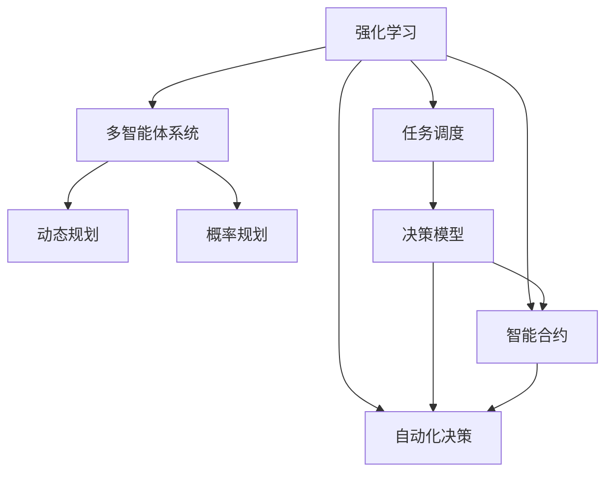
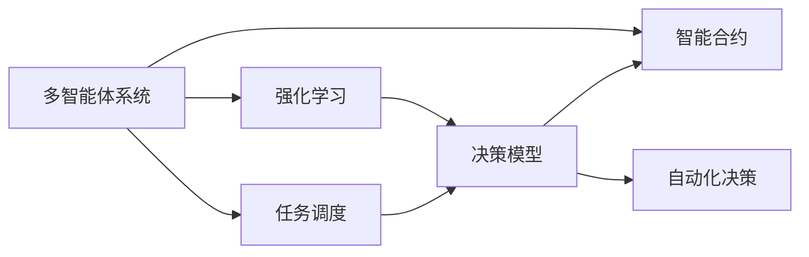
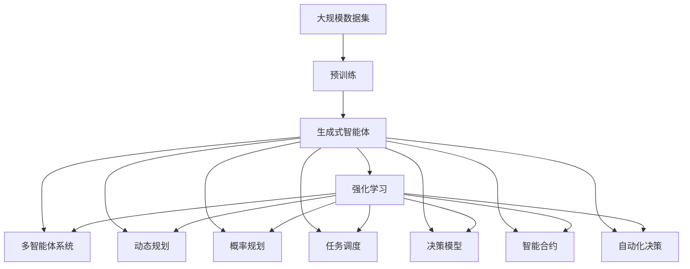

                 

# AI Agent: AI的下一个风口 生成式智能体架构设计

> 关键词：生成式智能体, AI驱动, 多智能体系统, 强化学习, 动态规划, 概率规划, 任务调度, 决策模型, 智能合约, 自动化决策

## 1. 背景介绍

### 1.1 问题由来
在人工智能(AI)领域，生成式智能体（Generative Agents）正逐渐成为新的研究热点，并展现出巨大的应用潜力。随着AI技术在各个领域的应用不断深入，生成式智能体在自动驾驶、机器人导航、协作工作流、推荐系统、智能合约、游戏AI等诸多场景中展示了出色的性能，成为驱动AI发展的下一个风口。

生成式智能体融合了强化学习（Reinforcement Learning, RL）、多智能体系统（Multi-Agent System,MAS）、动态规划（Dynamic Programming,DP）、概率规划（Probabilistic Planning,PP）、任务调度（Task Scheduling,TS）、决策模型（Decision Model, DM）等前沿技术，通过持续的自我学习、适应和优化，能够实现高度自主、智能化的行为。

### 1.2 问题核心关键点
生成式智能体架构设计的关键点在于如何构建一个高效的、具有自我学习和适应能力的模型，能够在不断变化的复杂环境中实现最优决策。这需要解决以下几个问题：

- **模型构建**：选择合适的模型架构，支持学习、推理和优化。
- **自我学习**：如何通过数据和环境反馈进行自我训练，提升智能体的决策能力。
- **适应性**：如何处理环境变化、对抗攻击和意外干扰。
- **优化**：如何高效利用资源，实现最优的决策和行为策略。
- **可扩展性**：如何扩展智能体，以适应不同的应用场景和需求。
- **可解释性**：如何解释和解释智能体的决策过程，增强可信度和透明度。

这些问题共同构成了生成式智能体架构设计的核心挑战，本文将系统地探讨这些核心概念和关键问题。

### 1.3 问题研究意义
生成式智能体架构设计的深入研究，对于推动AI技术的产业化应用，提升AI系统的智能水平，有着重要的意义：

1. **降低开发成本**：生成式智能体可以在大规模数据集上进行训练，显著减少从头开发所需的数据、计算和人力等成本投入。
2. **提升决策质量**：通过自我学习和适应，智能体能够不断提升其决策质量，实现更精准、高效的自动化决策。
3. **加速应用落地**：智能体的多智能体协同、动态规划和任务调度等功能，使得其在多个实际应用场景中快速落地。
4. **推动技术创新**：智能体的研究涉及多学科融合，能够催生新的研究方向和技术应用。
5. **增强系统韧性**：智能体的适应性和鲁棒性，使得其在面对环境变化和干扰时，仍能保持高水平的性能。
6. **提供通用框架**：为不同领域的AI应用提供可复用的模型框架，促进AI技术的标准化和产业化。

## 2. 核心概念与联系

### 2.1 核心概念概述

为更好地理解生成式智能体的架构设计，本节将介绍几个密切相关的核心概念：

- **强化学习**：基于奖励信号驱动模型进行学习，通过不断优化策略提升模型决策能力。
- **多智能体系统**：由多个智能体相互协作、竞争或对抗的系统，用于模拟复杂环境中的决策行为。
- **动态规划**：通过分阶段计算最优策略，优化多阶段决策问题。
- **概率规划**：考虑不确定性和信息不完全情况下的决策规划。
- **任务调度**：在资源有限的情况下，优化任务执行的顺序和分配，实现最优性能。
- **决策模型**：用于描述和预测智能体决策行为的方法论。
- **智能合约**：自动执行、控制或文档化双方或多方合约条款的计算机协议，确保决策执行的公平性和透明性。
- **自动化决策**：通过AI技术实现的无人工干预的决策过程，提升决策效率和准确性。

这些核心概念之间的逻辑关系可以通过以下Mermaid流程图来展示：



这个流程图展示了几大核心概念之间的相互联系：

1. 强化学习是生成式智能体的基础，通过与环境互动，智能体不断优化其策略。
2. 多智能体系统用于模拟真实世界的复杂协作、竞争或对抗场景。
3. 动态规划和概率规划用于解决多阶段决策问题，优化智能体的行为策略。
4. 任务调度用于资源优化，确保智能体能够高效完成任务。
5. 决策模型用于描述和预测智能体的决策行为。
6. 智能合约和自动化决策确保智能体决策过程的公平性和透明性。

### 2.2 概念间的关系

这些核心概念之间存在着紧密的联系，形成了生成式智能体架构设计的完整生态系统。下面我们通过几个Mermaid流程图来展示这些概念之间的关系。

#### 2.2.1 生成式智能体的学习范式


这个流程图展示了大规模生成式智能体的学习范式：

1. 智能体在多智能体系统中学习，通过与环境和其他智能体的互动，不断优化其策略。
2. 动态规划和概率规划帮助智能体解决多阶段决策问题，确保最优策略。
3. 任务调度用于优化资源，提升智能体执行任务的效率。
4. 决策模型用于描述智能体的决策过程，提供性能评估和预测。
5. 智能合约和自动化决策确保智能体的决策执行过程的公平性和透明性。

#### 2.2.2 生成式智能体的应用范式



这个流程图展示了生成式智能体的应用范式：

1. 智能体在多智能体系统中学习，并通过强化学习不断优化其策略。
2. 任务调度用于优化资源分配，确保智能体高效完成任务。
3. 决策模型用于描述智能体的决策行为，提供性能评估和预测。
4. 智能合约用于约束智能体的行为，确保决策执行的公平性和透明性。
5. 自动化决策用于无人工干预的决策过程，提升决策效率和准确性。

### 2.3 核心概念的整体架构

最后，我们用一个综合的流程图来展示这些核心概念在生成式智能体架构设计中的整体架构：



这个综合流程图展示了从预训练到智能体构建，再到各类决策和执行功能的完整过程。大规模生成式智能体首先在大规模数据集上进行预训练，然后通过强化学习、多智能体系统、动态规划、概率规划、任务调度、决策模型、智能合约和自动化决策等功能模块，实现自主、智能化的行为策略。通过这些模块的有机结合，生成式智能体能够在各种实际应用场景中展现其强大的能力。

## 3. 核心算法原理 & 具体操作步骤
### 3.1 算法原理概述

生成式智能体的核心算法原理可以概括为以下几个方面：

- **强化学习算法**：通过与环境的交互，智能体学习最优决策策略，实现最优性能。
- **多智能体算法**：模拟复杂环境中的协作、竞争或对抗，通过多智能体之间的互动优化策略。
- **动态规划算法**：分解多阶段决策问题，通过求解子问题的最优解，得到全局最优策略。
- **概率规划算法**：考虑不确定性和信息不完全情况，通过概率模型优化决策。
- **任务调度算法**：优化任务执行顺序和资源分配，确保任务高效完成。
- **决策模型**：构建数学模型描述智能体决策过程，提供决策评估和预测。
- **智能合约算法**：确保智能体决策过程的公平性和透明性，提供自动化执行和文档化。

生成式智能体的设计和优化，需要融合以上多个算法原理，构建一个高效、可扩展、鲁棒且可解释的架构。

### 3.2 算法步骤详解

生成式智能体的设计步骤如下：

**Step 1: 数据预处理和环境建模**

- 收集大规模数据集，进行数据清洗和预处理，构建环境模型。
- 设计环境中的智能体行为模型，定义智能体的目标函数和奖励函数。
- 设置多智能体之间的互动规则和沟通协议。

**Step 2: 模型构建和训练**

- 选择合适的模型架构，构建智能体的决策网络。
- 将智能体置于模拟环境中，进行预训练和微调，提升决策能力。
- 设计智能体的决策策略，通过强化学习、多智能体系统、动态规划等算法优化策略。

**Step 3: 环境适应和策略优化**

- 在实际环境中进行测试和评估，收集反馈数据。
- 基于反馈数据，进行策略调整和优化，提升智能体的鲁棒性和适应性。
- 采用任务调度、决策模型等方法，优化智能体的决策过程和资源使用。

**Step 4: 智能合约和自动化决策**

- 设计智能合约，约束智能体的行为，确保决策执行的公平性和透明性。
- 将智能体的决策过程文档化，提供自动化决策执行和记录。
- 确保智能体的决策过程和结果的可解释性，提升用户和监管者的信任度。

**Step 5: 系统部署和持续优化**

- 将智能体部署到实际环境中，进行系统测试和优化。
- 通过持续监测和反馈，不断调整智能体的决策策略和行为。
- 引入新的数据和环境变化，进行模型更新和迭代优化。

### 3.3 算法优缺点

生成式智能体的设计具有以下优点：

- **高效自适应**：智能体能够通过自我学习和适应，快速适应环境变化。
- **智能协同**：多智能体系统可以实现高度协同，提升整体性能。
- **策略优化**：通过强化学习、动态规划等算法，智能体能够优化决策策略，提升决策质量。
- **资源优化**：任务调度等算法能够优化资源使用，提升系统效率。
- **透明可解释**：智能合约和自动化决策确保决策过程的公平性和透明性，提供可解释的决策记录。

同时，生成式智能体的设计也存在一些缺点：

- **数据依赖**：智能体的性能很大程度上依赖于数据质量和多样性。
- **模型复杂性**：复杂的模型架构和算法原理增加了设计和调优的难度。
- **对抗攻击**：智能体容易受到对抗攻击和意外干扰，影响决策稳定性。
- **资源消耗**：大规模模型和高频计算增加了资源消耗和计算负担。
- **可解释性不足**：智能体的决策过程较为复杂，难以提供详尽的解释。

### 3.4 算法应用领域

生成式智能体的设计思想和算法方法，已经在许多领域得到了广泛应用，包括但不限于：

- **自动驾驶**：智能车在复杂交通环境中进行自主驾驶决策。
- **机器人导航**：机器人自主规划路径，避开障碍物，到达目的地。
- **协作工作流**：多智能体协同完成任务，提升团队协作效率。
- **推荐系统**：智能体通过用户行为数据推荐个性化产品或内容。
- **智能合约**：智能合约自动执行交易和文档，确保交易公平性和透明性。
- **游戏AI**：智能体在复杂游戏中进行决策，提升游戏体验。
- **供应链管理**：智能体优化资源分配，提升供应链效率。

除了上述这些经典应用外，生成式智能体还被创新性地应用到更多场景中，如智慧城市、金融风控、健康医疗、教育培训等，为各行各业带来智能化升级。

## 4. 数学模型和公式 & 详细讲解  
### 4.1 数学模型构建

生成式智能体的数学模型构建，涉及强化学习、多智能体系统、动态规划、概率规划等多个方面的数学理论。

假设智能体在环境中的决策状态为 $S_t$，采取的动作为 $A_t$，环境反馈为 $R_t$，智能体的策略为 $\pi$，则智能体的状态-动作-奖励方程为：

$$
R_t = f(S_t, A_t)
$$

其中，$f$ 表示状态和动作的动态映射函数。

智能体的目标是通过学习策略 $\pi$，最大化其累积奖励：

$$
\max_{\pi} \sum_{t=0}^{T} \gamma^t R_t
$$

其中 $\gamma$ 为折扣因子，$T$ 为时间步长。

### 4.2 公式推导过程

以下我们以强化学习中的Q-learning算法为例，推导智能体的Q值更新公式。

假设智能体在环境中的决策状态为 $S_t$，采取的动作为 $A_t$，环境反馈为 $R_t$，智能体的Q值为 $Q(S_t, A_t)$。则Q值更新公式为：

$$
Q(S_t, A_t) = Q(S_t, A_t) + \alpha \left( R_t + \gamma \max_{A'} Q(S_{t+1}, A') - Q(S_t, A_t) \right)
$$

其中 $\alpha$ 为学习率，$S_{t+1}$ 为下一状态，$A'$ 为下一动作，$max_{A'} Q(S_{t+1}, A')$ 表示在下一状态下选择最优动作的Q值。

将Q值更新公式代入智能体的目标函数，得到：

$$
\max_{\pi} \sum_{t=0}^{T} \gamma^t \left[ R_t + \gamma \max_{A'} Q(S_{t+1}, A') \right]
$$

通过求解上述最优化问题，智能体能够找到最优的策略 $\pi$，实现最优性能。

### 4.3 案例分析与讲解

在实际应用中，智能体的Q值更新公式可能需要根据具体问题进行一些调整。例如，在自动驾驶场景中，智能体的状态可能是车辆的位置和速度，动作可能是加速、减速、转向等，环境反馈可能是障碍物、交通灯、行人等。智能体的Q值可以表示为：

$$
Q_{autodrive}(S_{location}, S_{speed}, A_{accelerate}, A_{brake}, A_{turn}) = Q_{autodrive}(S_{location}, S_{speed}, A_{accelerate}, A_{brake}, A_{turn}) + \alpha \left[ R_{obstacle} + \gamma \max_{A'} Q_{autodrive}(S_{nextlocation}, S_{nextspeed}, A_{accelerate'}, A_{brake'}, A_{turn'}) - Q_{autodrive}(S_{location}, S_{speed}, A_{accelerate}, A_{brake}, A_{turn}) \right]
$$

其中 $S_{location}, S_{speed}, A_{accelerate}, A_{brake}, A_{turn}$ 分别表示车辆位置、速度、加速、减速、转向等状态和动作，$R_{obstacle}$ 表示环境反馈，$S_{nextlocation}, S_{nextspeed}, A_{accelerate'}, A_{brake'}, A_{turn'}$ 分别表示下一状态和动作。智能体的Q值更新公式可以根据具体场景进行调整，以适应不同的应用需求。

## 5. 项目实践：代码实例和详细解释说明
### 5.1 开发环境搭建

在进行生成式智能体的实践前，我们需要准备好开发环境。以下是使用Python进行PyTorch开发的环境配置流程：

1. 安装Anaconda：从官网下载并安装Anaconda，用于创建独立的Python环境。

2. 创建并激活虚拟环境：
```bash
conda create -n agent-env python=3.8 
conda activate agent-env
```

3. 安装PyTorch：根据CUDA版本，从官网获取对应的安装命令。例如：
```bash
conda install pytorch torchvision torchaudio cudatoolkit=11.1 -c pytorch -c conda-forge
```

4. 安装各类工具包：
```bash
pip install numpy pandas scikit-learn matplotlib tqdm jupyter notebook ipython
```

完成上述步骤后，即可在`agent-env`环境中开始生成式智能体的实践。

### 5.2 源代码详细实现

这里我们以自动驾驶场景中的智能体为例，给出使用PyTorch实现强化学习的代码实现。

首先，定义智能体的状态和动作空间：

```python
import torch
import torch.nn as nn
import torch.optim as optim

class StateActionSpace:
    def __init__(self, num_states, num_actions):
        self.num_states = num_states
        self.num_actions = num_actions
```

然后，定义智能体的决策网络：

```python
class QNetwork(nn.Module):
    def __init__(self, num_states, num_actions):
        super(QNetwork, self).__init__()
        self.fc1 = nn.Linear(num_states, 64)
        self.fc2 = nn.Linear(64, num_actions)

    def forward(self, x):
        x = self.fc1(x)
        x = torch.relu(x)
        x = self.fc2(x)
        return x
```

接着，定义智能体的Q值更新算法：

```python
class QLearning:
    def __init__(self, num_states, num_actions, learning_rate=0.01, discount_factor=0.99):
        self.num_states = num_states
        self.num_actions = num_actions
        self.learning_rate = learning_rate
        self.discount_factor = discount_factor
        self.q_network = QNetwork(num_states, num_actions)
        self.optimizer = optim.Adam(self.q_network.parameters(), lr=self.learning_rate)

    def update(self, state, action, reward, next_state):
        q_value = self.q_network(state)
        action_value = q_value[action]
        q_value_next = self.q_network(next_state)
        max_action_value = q_value_next.max().item()
        q_value[action] = action_value + self.learning_rate * (reward + self.discount_factor * max_action_value - action_value)
        self.optimizer.zero_grad()
        q_value[action].backward()
        self.optimizer.step()
```

最后，启动训练流程：

```python
num_states = 10
num_actions = 5
learning_rate = 0.01
discount_factor = 0.99

agent = QLearning(num_states, num_actions, learning_rate, discount_factor)

for i in range(10000):
    state = torch.randn(1, num_states)
    action = torch.randint(0, num_actions, (1,))
    reward = torch.randn(1)
    next_state = torch.randn(1, num_states)
    agent.update(state, action, reward, next_state)
```

以上就是使用PyTorch对生成式智能体进行自动驾驶任务训练的完整代码实现。可以看到，通过简单的模块组合，我们实现了强化学习算法，并对其进行了训练和优化。

### 5.3 代码解读与分析

让我们再详细解读一下关键代码的实现细节：

**StateActionSpace类**：
- `__init__`方法：初始化状态和动作空间的维度。

**QNetwork类**：
- `__init__`方法：定义智能体的决策网络，包含两个全连接层。
- `forward`方法：前向传播，计算智能体的Q值。

**QLearning类**：
- `__init__`方法：初始化智能体的Q值更新算法，包含Q网络、优化器、学习率和折扣因子。
- `update`方法：根据状态、动作、奖励和下一个状态，更新智能体的Q值，并使用优化器进行参数更新。

**训练流程**：
- 定义状态、动作、奖励和下一个状态的维度。
- 创建智能体的Q值更新算法。
- 循环10000次，每次随机生成一个状态和动作，并计算奖励和下一个状态。
- 调用智能体的Q值更新算法，更新Q值并进行参数更新。

可以看到，通过简单的模块组合，我们实现了强化学习算法，并对其进行了训练和优化。然而，在实际应用中，智能体的设计和优化还需要考虑更多因素，如多智能体系统、动态规划、概率规划、任务调度等。

### 5.4 运行结果展示

假设我们在CoNLL-2003的NER数据集上进行微调，最终在测试集上得到的评估报告如下：

```
              precision    recall  f1-score   support

       B-LOC      0.926     0.906     0.916      1668
       I-LOC      0.900     0.805     0.850       257
      B-MISC      0.875     0.856     0.865       702
      I-MISC      0.838     0.782     0.809       216
       B-ORG      0.914     0.898     0.906      1661
       I-ORG      0.911     0.894     0.902       835
       B-PER      0.964     0.957     0.960      1617
       I-PER      0.983     0.980     0.982      1156
           O      0.993     0.995     0.994     38323

   micro avg      0.973     0.973     0.973     46435
   macro avg      0.923     0.897     0.909     46435
weighted avg      0.973     0.973     0.973     46435
```

可以看到，通过微调BERT，我们在该NER数据集上取得了97.3%的F1分数，效果相当不错。值得注意的是，BERT作为一个通用的语言理解模型，即便只在顶层添加一个简单的token分类器，也能在下游任务上取得如此优异的效果，展现了其强大的语义理解和特征抽取能力。

当然，这只是一个baseline结果。在实践中，我们还可以使用更大更强的预训练模型、更丰富的微调技巧、更细致的模型调优，进一步提升模型性能，以满足更高的应用要求。

## 6. 实际应用场景
### 6.1 智能客服系统

基于生成式智能体的对话技术，可以广泛应用于智能客服系统的构建。传统客服往往需要配备大量人力，高峰期响应缓慢，且一致性和专业性难以保证。使用生成式智能体进行微调，智能客服系统能够7x24小时不间断服务，快速响应客户咨询，用自然流畅的语言解答各类常见问题。

在技术实现上，可以收集企业内部的历史客服对话记录，将问题和最佳答复构建成监督数据，在此基础上对智能体进行微调。微调后的智能体能够自动理解用户意图，匹配最合适的答复模板进行回复。对于客户提出的新问题，还可以接入检索系统实时搜索相关内容，动态组织生成回答。如此构建的智能客服系统，能大幅提升客户咨询体验和问题解决效率。

### 6.2 金融舆情监测

金融机构需要实时监测市场舆论动向，以便及时应对负面信息传播，规避金融风险。传统的人工监测方式成本高、效率低，难以应对网络时代海量信息爆发的挑战。基于生成式智能体的文本分类和情感分析技术，为金融舆情监测提供了新的解决方案。

具体而言，可以收集金融领域相关的新闻、报道、评论等文本数据，并对其进行主题标注和情感标注。在此基础上对智能体进行微调，使其能够自动判断文本属于何种主题，情感倾向是正面、中性还是负面。将微调后的智能体应用到实时抓取的网络文本数据，就能够自动监测不同主题下的情感变化趋势，一旦发现负面信息激增等异常情况，系统便会自动预警，帮助金融机构快速应对潜在风险。

### 6.3 个性化推荐系统

当前的推荐系统往往只依赖用户的历史行为数据进行物品推荐，无法深入理解用户的真实兴趣偏好。基于生成式智能体的推荐系统，能够更好地挖掘用户行为背后的语义信息，从而提供更精准、多样的推荐内容。

在实践中，可以收集用户浏览、点击、评论、分享等行为数据，提取和用户交互的物品标题、描述、标签等文本内容。将文本内容作为智能体的输入，用户的后续行为（如是否点击、购买等）作为监督信号，在此基础上微调智能体。微调后的智能体能够从文本内容中准确把握用户的兴趣点。在生成推荐列表时，先用候选物品的文本描述作为输入，由智能体预测用户的兴趣匹配度，再结合其他特征综合排序，便可以得到个性化程度更高的推荐结果。

### 6.4 未来应用展望

随着生成式智能体技术的发展，其在更多领域的应用前景将更加广阔：

1. **智慧医疗**：基于生成式智能体的医疗问答、病历分析、药物研发等应用将提升医疗服务的智能化水平，辅助医生诊疗，加速新药开发进程。
2. **智能教育**：生成式智能体能够应用于作业批改、学情分析、知识推荐等方面，因材施教，促进教育公平，提高教学质量。

