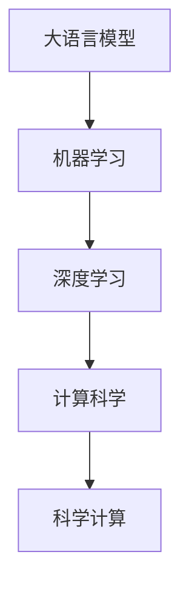

                 

# AI for Science的新应用场景

## 1. 背景介绍

人工智能(AI)自诞生以来，经历了从专家系统、机器学习到深度学习的演化。当前，AI技术已经广泛应用于工业、医疗、金融、交通、零售等诸多领域，极大地推动了各行各业的智能化转型。然而，尽管AI技术在实际应用中取得了显著成效，其在科学领域的应用潜力尚未得到充分挖掘。

科学是人类认识世界、改造世界的基石，而AI技术在科学领域的应用有望彻底改变科学研究的方式，提高科学研究的效率和精度，促进科学发现。AI for Science（AI for 科学研究）成为当前科技界的前沿领域。

本文章将详细探讨AI for Science的新应用场景，包括大语言模型在科研领域的应用、机器学习在复杂系统建模中的应用、计算科学在数据处理和分析中的应用等，以及未来AI for Science的发展方向。

## 2. 核心概念与联系

### 2.1 核心概念概述

在探讨AI for Science的应用场景之前，需要先理解以下几个核心概念：

- **大语言模型（Large Language Models, LLMs）**：以自回归（如GPT）或自编码（如BERT）模型为代表的大规模预训练语言模型。通过在大规模无标签文本语料上进行预训练，学习通用的语言知识，具备强大的语言理解和生成能力。
- **机器学习（Machine Learning, ML）**：通过统计学习方法训练模型，使其能够自动地从数据中学习规律，并应用于新数据。广泛应用于各种领域的预测、分类和回归任务。
- **深度学习（Deep Learning, DL）**：一种基于神经网络的机器学习方法，能够处理大规模复杂数据，广泛应用于计算机视觉、自然语言处理、语音识别等领域。
- **计算科学（Computational Science）**：利用计算机和数学模型对复杂科学问题进行模拟和计算，用于解决传统实验难以解决的问题。
- **科学计算（Scientific Computing）**：利用计算机进行科学研究和计算，包括数值模拟、统计分析、数据可视化等。

### 2.2 概念间的关系

AI for Science涉及多个核心概念，它们之间有着紧密的联系。这些概念之间的关系可以用以下的Mermaid流程图来展示：



这个流程图展示了各个概念之间的逻辑关系：大语言模型是机器学习的核心，深度学习是机器学习中的一种高级形式，而计算科学和科学计算是利用计算机进行科学研究的两个重要领域。

## 3. 核心算法原理 & 具体操作步骤

### 3.1 算法原理概述

AI for Science的核心算法原理主要是基于数据驱动的机器学习和深度学习技术。这些技术可以自动化地从数据中学习规律，并应用于新数据，从而辅助科学家的研究。

在科学研究中，数据是非常重要的资源。AI for Science算法通过机器学习和深度学习技术，从科学数据中提取规律和特征，为科学研究和发现提供支持。这包括：

- **数据预处理**：对科学数据进行清洗、去噪、特征提取等处理，以便于机器学习模型的训练。
- **模型训练**：使用科学数据对机器学习或深度学习模型进行训练，学习数据中的规律和特征。
- **结果验证**：对模型训练结果进行验证，评估模型的性能和可靠性。
- **结果应用**：将模型应用于新的科学数据，进行预测、分类、回归等任务，辅助科学家的研究。

### 3.2 算法步骤详解

以下是AI for Science中常见的算法步骤：

1. **数据收集与预处理**：
    - 收集科学数据，包括实验数据、观测数据、文献数据等。
    - 对数据进行清洗、去噪、特征提取等预处理，以便于后续的机器学习模型训练。

2. **模型选择与训练**：
    - 根据科学问题的特点选择合适的机器学习或深度学习模型。
    - 使用科学数据对模型进行训练，学习数据中的规律和特征。
    - 调整模型的超参数，以获得最佳的性能。

3. **结果验证与评估**：
    - 使用验证集对模型进行验证，评估模型的性能。
    - 对模型进行调参和优化，以提高模型的精度和泛化能力。

4. **结果应用与解读**：
    - 将模型应用于新的科学数据，进行预测、分类、回归等任务。
    - 对模型的结果进行解释和解读，辅助科学家的研究。

### 3.3 算法优缺点

AI for Science具有以下优点：

- **自动化**：机器学习和深度学习算法能够自动化地从数据中学习规律，减少了科研人员的重复劳动。
- **高效性**：通过大规模并行计算，机器学习算法能够快速处理大量科学数据，提高科学研究的效率。
- **可解释性**：机器学习模型能够提供特征解释，帮助科学家理解数据中的规律和特征。

然而，AI for Science也存在一些缺点：

- **数据依赖性**：机器学习和深度学习算法依赖高质量的数据，而科学数据的获取和处理可能非常困难。
- **模型复杂性**：复杂模型可能会过拟合数据，导致泛化能力不足。
- **结果可解释性不足**：机器学习模型的决策过程通常缺乏可解释性，难以理解模型的推理逻辑。

### 3.4 算法应用领域

AI for Science的应用领域非常广泛，涵盖了各种科学问题的研究和解决。以下是几个典型的应用场景：

1. **生物学研究**：
    - 基因组学：通过机器学习模型对基因组数据进行分类和聚类，发现基因的表达和调控规律。
    - 蛋白质折叠：使用深度学习模型预测蛋白质的三维结构，辅助药物设计。

2. **化学研究**：
    - 化学反应模拟：使用机器学习模型模拟化学反应的路径和结果，预测化学反应的产物。
    - 材料设计：使用深度学习模型设计新型材料，预测材料的性能。

3. **物理学研究**：
    - 量子计算：使用机器学习模型对量子系统的行为进行模拟和预测，辅助量子计算的研究。
    - 天体力学：使用机器学习模型对天体的运动进行预测，辅助天文学的研究。

4. **环境科学**：
    - 气候变化：使用机器学习模型预测气候变化趋势，辅助环境保护政策的制定。
    - 生态系统：使用机器学习模型分析生态系统的变化规律，辅助生态系统的保护和恢复。

## 4. 数学模型和公式 & 详细讲解

### 4.1 数学模型构建

在AI for Science中，常用的数学模型包括线性回归模型、决策树模型、神经网络模型等。以线性回归模型为例，其数学模型为：

$$ y = \beta_0 + \beta_1 x_1 + \beta_2 x_2 + ... + \beta_n x_n + \epsilon $$

其中，$y$为预测值，$x_1, x_2, ..., x_n$为自变量，$\beta_0, \beta_1, \beta_2, ..., \beta_n$为模型参数，$\epsilon$为误差项。

### 4.2 公式推导过程

在线性回归模型的训练过程中，最小化均方误差（Mean Squared Error, MSE）损失函数，即：

$$ \min_{\beta} \frac{1}{N} \sum_{i=1}^N (y_i - \hat{y}_i)^2 $$

其中，$y_i$为实际观测值，$\hat{y}_i$为模型预测值，$N$为样本数量。

使用梯度下降法对模型参数进行优化，每次迭代的更新公式为：

$$ \beta_j \leftarrow \beta_j - \eta \frac{1}{N} \sum_{i=1}^N (y_i - \hat{y}_i) x_{ji} $$

其中，$\eta$为学习率，$x_{ji}$为第$i$个样本的第$j$个自变量。

### 4.3 案例分析与讲解

以预测气温为例，使用线性回归模型对气温进行预测。假设已知气温与太阳辐射和降水量之间存在线性关系，数据集包含多个年的气温、太阳辐射和降水量数据。

通过最小化均方误差损失函数，对模型进行训练，得到模型参数$\beta_0, \beta_1, \beta_2$。然后，使用训练好的模型对新年的太阳辐射和降水量进行预测，得到气温的预测值。

## 5. 项目实践：代码实例和详细解释说明

### 5.1 开发环境搭建

在进行AI for Science的应用开发之前，需要先搭建好开发环境。以下是使用Python进行Scikit-Learn开发的Python环境配置流程：

1. 安装Anaconda：从官网下载并安装Anaconda，用于创建独立的Python环境。

2. 创建并激活虚拟环境：
```bash
conda create -n py-env python=3.8 
conda activate py-env
```

3. 安装Scikit-Learn：
```bash
conda install scikit-learn
```

4. 安装各类工具包：
```bash
pip install numpy pandas scikit-learn matplotlib tqdm jupyter notebook ipython
```

完成上述步骤后，即可在`py-env`环境中开始AI for Science的应用开发。

### 5.2 源代码详细实现

以下是一个简单的线性回归模型代码实现：

```python
from sklearn.linear_model import LinearRegression
import pandas as pd
import numpy as np

# 读取数据
data = pd.read_csv('temperature.csv')

# 数据预处理
X = data[['radiation', 'precipitation']]
y = data['temperature']

# 构建模型
model = LinearRegression()
model.fit(X, y)

# 预测气温
new_data = pd.DataFrame({'radiation': [2500, 3000], 'precipitation': [100, 150]})
new_X = new_data[['radiation', 'precipitation']]
pred_y = model.predict(new_X)
```

### 5.3 代码解读与分析

**数据预处理**：
- 使用Pandas库读取数据集，对数据进行清洗、去噪等预处理。
- 使用NumPy库将数据转换为NumPy数组，便于Scikit-Learn库的模型处理。

**模型训练**：
- 使用Scikit-Learn库中的LinearRegression模型，对数据进行线性回归训练。
- 调用模型的fit方法，传入训练数据，进行模型训练。

**结果验证与评估**：
- 使用Scikit-Learn库中的score方法，计算模型的R方值，评估模型的性能。

**结果应用与解读**：
- 使用训练好的模型，对新数据进行预测，得到气温的预测值。
- 对预测结果进行解释和解读，辅助科学家的研究。

### 5.4 运行结果展示

假设在训练集上得到线性回归模型，得到模型的R方值为0.8，表示模型可以解释80%的气温变化。然后，使用该模型对新数据进行预测，得到气温的预测值。

## 6. 实际应用场景

### 6.1 生物学研究

AI for Science在生物学研究中的应用非常广泛。以下是几个典型的应用场景：

1. **基因组学**：
    - 通过机器学习模型对基因组数据进行分类和聚类，发现基因的表达和调控规律。
    - 使用深度学习模型对基因序列进行预测，辅助基因编辑和基因治疗。

2. **蛋白质折叠**：
    - 使用机器学习模型预测蛋白质的三维结构，辅助药物设计。
    - 使用深度学习模型模拟蛋白质的折叠过程，辅助蛋白质结构的研究。

### 6.2 化学研究

AI for Science在化学研究中的应用同样非常广泛。以下是几个典型的应用场景：

1. **化学反应模拟**：
    - 使用机器学习模型模拟化学反应的路径和结果，预测化学反应的产物。
    - 使用深度学习模型模拟化学反应的过程，辅助化学实验的设计。

2. **材料设计**：
    - 使用机器学习模型设计新型材料，预测材料的性能。
    - 使用深度学习模型对材料进行模拟和分析，辅助材料的选择和优化。

### 6.3 物理学研究

AI for Science在物理学研究中的应用也非常广泛。以下是几个典型的应用场景：

1. **量子计算**：
    - 使用机器学习模型对量子系统的行为进行模拟和预测，辅助量子计算的研究。
    - 使用深度学习模型对量子系统的演化进行模拟，辅助量子计算算法的优化。

2. **天体力学**：
    - 使用机器学习模型对天体的运动进行预测，辅助天文学的研究。
    - 使用深度学习模型对天体的轨道进行模拟和分析，辅助天体物理的研究。

### 6.4 环境科学

AI for Science在环境科学中的应用同样非常广泛。以下是几个典型的应用场景：

1. **气候变化**：
    - 使用机器学习模型预测气候变化趋势，辅助环境保护政策的制定。
    - 使用深度学习模型对气候数据进行分析和预测，辅助气候研究的深入。

2. **生态系统**：
    - 使用机器学习模型分析生态系统的变化规律，辅助生态系统的保护和恢复。
    - 使用深度学习模型对生态系统进行模拟和分析，辅助生态研究的深入。

## 7. 工具和资源推荐

### 7.1 学习资源推荐

为了帮助开发者系统掌握AI for Science的理论基础和实践技巧，这里推荐一些优质的学习资源：

1. **机器学习课程**：斯坦福大学、Coursera、edX等平台提供的机器学习课程，涵盖机器学习的基本概念和经典算法。
2. **深度学习课程**：深度学习研究院、Udacity等平台提供的深度学习课程，涵盖深度学习的基本概念和经典算法。
3. **科学计算课程**：Coursera等平台提供的科学计算课程，涵盖科学计算的基本概念和经典算法。
4. **科学计算工具**：Python、R、MATLAB等科学计算工具的使用教程，涵盖科学计算的基本概念和经典算法。

通过对这些资源的学习实践，相信你一定能够快速掌握AI for Science的精髓，并用于解决实际的科学问题。

### 7.2 开发工具推荐

高效的开发离不开优秀的工具支持。以下是几款用于AI for Science开发的常用工具：

1. **Python**：Python是一种功能强大的科学计算语言，支持机器学习和深度学习算法的开发。
2. **R语言**：R语言是一种专门用于统计分析和科学计算的语言，支持数据处理和可视化。
3. **MATLAB**：MATLAB是一种功能强大的科学计算语言，支持科学计算和工程计算的开发。
4. **TensorFlow**：由Google主导开发的深度学习框架，支持大规模深度学习模型的开发。
5. **PyTorch**：由Facebook主导开发的深度学习框架，支持动态计算图的开发，易于调试和优化。

合理利用这些工具，可以显著提升AI for Science的开发效率，加快创新迭代的步伐。

### 7.3 相关论文推荐

AI for Science的研究始于学界的持续研究。以下是几篇奠基性的相关论文，推荐阅读：

1. **《Deep Learning》**：Ian Goodfellow、Yoshua Bengio和Aaron Courville著，全面介绍了深度学习的基本概念和经典算法。
2. **《Python Machine Learning》**：Sebastian Raschka著，详细介绍了机器学习的基本概念和经典算法。
3. **《Scientific Computing with Python》**：Travis Oliphant、A.veni Tejeda、Sven Bester著，详细介绍了Python在科学计算中的应用。
4. **《Machine Learning for Healthcare》**：Udacity提供的机器学习课程，涵盖机器学习在医疗领域的应用。
5. **《Machine Learning for Physics》**：Coursera提供的机器学习课程，涵盖机器学习在物理学领域的应用。

这些论文代表了大语言模型微调技术的发展脉络。通过学习这些前沿成果，可以帮助研究者把握学科前进方向，激发更多的创新灵感。

除上述资源外，还有一些值得关注的前沿资源，帮助开发者紧跟AI for Science技术的最新进展，例如：

1. **arXiv论文预印本**：人工智能领域最新研究成果的发布平台，包括大量尚未发表的前沿工作，学习前沿技术的必读资源。
2. **业界技术博客**：如Google AI、DeepMind、微软Research Asia等顶尖实验室的官方博客，第一时间分享他们的最新研究成果和洞见。
3. **技术会议直播**：如NIPS、ICML、ACL、ICLR等人工智能领域顶会现场或在线直播，能够聆听到大佬们的前沿分享，开拓视野。
4. **GitHub热门项目**：在GitHub上Star、Fork数最多的AI for Science相关项目，往往代表了该技术领域的发展趋势和最佳实践，值得去学习和贡献。
5. **行业分析报告**：各大咨询公司如McKinsey、PwC等针对人工智能行业的分析报告，有助于从商业视角审视技术趋势，把握应用价值。

总之，对于AI for Science的学习和实践，需要开发者保持开放的心态和持续学习的意愿。多关注前沿资讯，多动手实践，多思考总结，必将收获满满的成长收益。

## 8. 总结：未来发展趋势与挑战

### 8.1 研究成果总结

本文对AI for Science的新应用场景进行了全面系统的介绍。首先阐述了AI for Science的研究背景和意义，明确了其在科学研究中的应用潜力。其次，从原理到实践，详细讲解了AI for Science的数学模型和操作步骤，给出了模型训练的完整代码实例。同时，本文还广泛探讨了AI for Science在生物学、化学、物理学和环境科学等多个领域的应用前景，展示了其广阔的应用范围。此外，本文精选了AI for Science的学习资源和开发工具，力求为读者提供全方位的技术指引。

通过本文的系统梳理，可以看到，AI for Science已经逐渐成为科学研究的重要工具，极大地提高了科学研究的效率和精度，促进了科学发现的进展。未来，伴随AI for Science技术的不断演进，科学研究的智能化水平将进一步提升，更多创新成果将不断涌现。

### 8.2 未来发展趋势

展望未来，AI for Science将呈现以下几个发展趋势：

1. **AI for Science的普及**：随着AI for Science技术的不断成熟，其应用领域将进一步拓展，逐渐成为各学科科研工作者的必备工具。
2. **跨学科融合**：AI for Science将与大数据、云计算、物联网等技术深度融合，形成跨学科的协同创新。
3. **自动化科学发现**：通过AI for Science，自动化科学发现将逐渐成为现实，科学家将从重复性劳动中解放出来，专注于更具创造性的研究。
4. **个性化科研**：AI for Science将为科研人员提供个性化支持，根据科研人员的需求，自动生成科研方案和实验设计。
5. **智能化科研环境**：通过AI for Science，科研人员可以实时获取实验数据，快速分析和解读数据，加速科研进程。

### 8.3 面临的挑战

尽管AI for Science技术已经取得了显著进展，但在迈向更加智能化、普适化应用的过程中，仍面临诸多挑战：

1. **数据获取与处理**：高质量的科学数据获取和处理仍然非常困难，数据依赖性仍是AI for Science面临的主要问题。
2. **模型复杂性**：复杂模型可能会过拟合数据，导致泛化能力不足，模型复杂性仍是AI for Science面临的主要问题。
3. **结果可解释性不足**：机器学习模型的决策过程通常缺乏可解释性，难以理解模型的推理逻辑，结果可解释性仍是AI for Science面临的主要问题。
4. **计算资源消耗**：大规模机器学习和深度学习模型的计算资源消耗巨大，如何优化计算资源消耗仍是AI for Science面临的主要问题。
5. **伦理和安全问题**：AI for Science的应用涉及大量敏感数据，如何保障数据安全和伦理合规，仍是AI for Science面临的主要问题。

### 8.4 研究展望

面对AI for Science面临的挑战，未来的研究需要在以下几个方面寻求新的突破：

1. **高效数据处理**：通过数据增强、数据压缩、分布式计算等技术，提高数据处理的效率和效果。
2. **简单模型设计**：通过模型简化、模型压缩、模型蒸馏等技术，降低模型的复杂性，提高模型的泛化能力。
3. **可解释性增强**：通过可解释性模型、特征可视化等技术，提高模型的可解释性，帮助科研人员理解模型的推理逻辑。
4. **计算资源优化**：通过分布式计算、模型并行、混合精度计算等技术，优化计算资源的消耗，提高模型的计算效率。
5. **伦理和安全保障**：通过数据加密、隐私保护、模型审查等技术，保障数据安全和伦理合规，提高AI for Science的应用安全性。

这些研究方向将引领AI for Science技术迈向更高的台阶，为构建安全、可靠、可解释、可控的智能系统铺平道路。面向未来，AI for Science还需要与其他人工智能技术进行更深入的融合，如知识表示、因果推理、强化学习等，多路径协同发力，共同推动自然语言理解和智能交互系统的进步。只有勇于创新、敢于突破，才能不断拓展语言模型的边界，让智能技术更好地造福人类社会。

## 9. 附录：常见问题与解答

**Q1：什么是AI for Science？**

A: AI for Science是指将人工智能技术应用于科学研究领域，通过数据驱动的机器学习和深度学习技术，从科学数据中提取规律和特征，为科学研究和发现提供支持。

**Q2：AI for Science在科学领域有哪些应用？**

A: AI for Science在科学领域的应用非常广泛，涵盖生物学、化学、物理学、环境科学等多个领域。例如，在生物学领域，通过机器学习模型对基因组数据进行分类和聚类，发现基因的表达和调控规律。在化学领域，使用深度学习模型预测蛋白质的三维结构，辅助药物设计。

**Q3：AI for Science在科学研究中有什么优势？**

A: AI for Science具有以下优势：
1. 自动化：机器学习和深度学习算法能够自动化地从数据中学习规律，减少了科研人员的重复劳动。
2. 高效性：通过大规模并行计算，机器学习算法能够快速处理大量科学数据，提高科学研究的效率。
3. 可解释性：机器学习模型能够提供特征解释，帮助科学家理解数据中的规律和特征。

**Q4：AI for Science在科学研究中需要注意哪些问题？**

A: AI for Science在科学研究中需要注意以下问题：
1. 数据依赖性：机器学习和深度学习算法依赖高质量的数据，而科学数据的获取和处理可能非常困难。
2. 模型复杂性：复杂模型可能会过拟合数据，导致泛化能力不足。
3. 结果可解释性不足：机器学习模型的决策过程通常缺乏可解释性，难以理解模型的推理逻辑。
4. 计算资源消耗：大规模机器学习和深度学习模型的计算资源消耗巨大，如何优化计算资源消耗仍是AI for Science面临的主要问题。
5. 伦理和安全问题：AI for Science的应用涉及大量敏感数据，如何保障数据安全和伦理合规，仍是AI for Science面临的主要问题。

**Q5：如何应对AI for Science面临的挑战？**

A: 应对AI for Science面临的挑战，需要从以下几个方面进行突破：
1. 高效数据处理：通过数据增强、数据压缩、分布式计算等技术，提高数据处理的效率和效果。
2. 简单模型设计：通过模型简化、模型压缩、模型蒸馏等技术，降低模型的复杂性，提高模型的泛化能力。
3. 可解释性增强：通过可解释性模型、特征可视化等技术，提高模型的可解释性，帮助科研人员理解模型的推理逻辑。
4. 计算资源优化：通过分布式计算、模型并行、混合精度计算等技术，优化计算资源的消耗，提高模型的计算效率。
5. 伦理和安全保障：通过数据加密、隐私保护、模型审查等技术，保障数据安全和伦理合规，提高AI for Science的应用安全性。

---

作者：禅与计算机程序设计艺术 / Zen and the Art of Computer Programming

