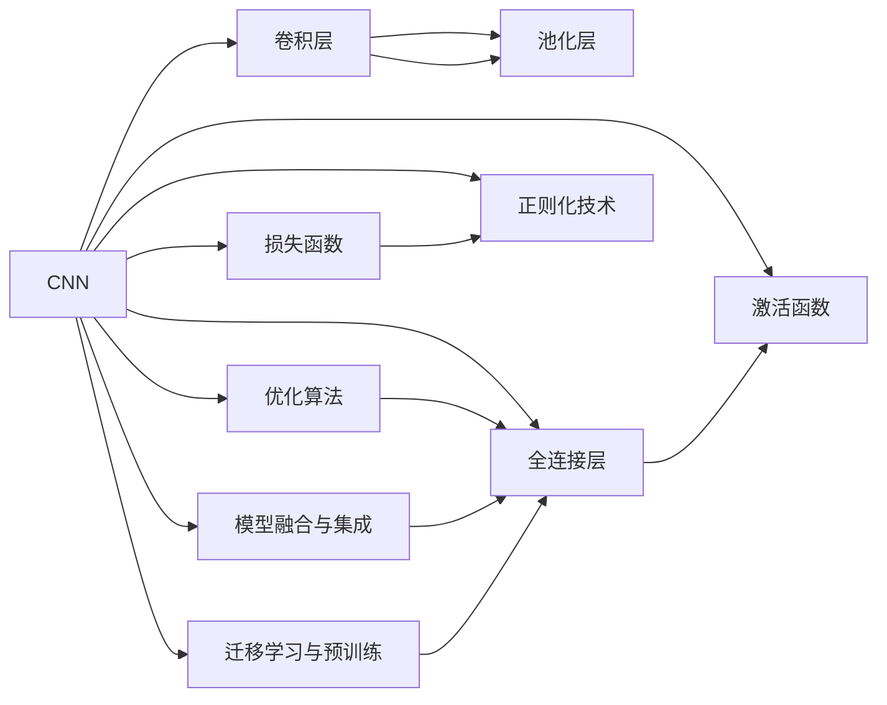
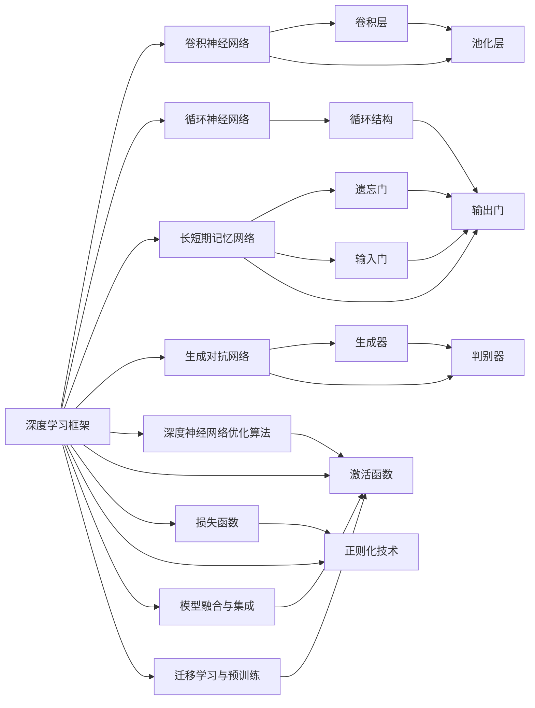

                 

# AI 原理与代码实例讲解

> 关键词：人工智能,深度学习,深度神经网络,机器学习,PyTorch,TensorFlow,卷积神经网络(CNN),循环神经网络(RNN),长短期记忆网络(LSTM),生成对抗网络(GAN),代码实例,卷积层,池化层,全连接层,激活函数,损失函数,反向传播,训练集,验证集,测试集

## 1. 背景介绍

### 1.1 问题由来

随着人工智能技术的迅猛发展，深度学习尤其是深度神经网络在计算机视觉、自然语言处理、语音识别等领域取得了显著的成果。深度神经网络由多层神经元组成，具有较强的非线性拟合能力和特征提取能力，能够自动从数据中学习抽象的特征表示。

然而，深度神经网络的训练过程复杂且计算资源需求高，需要大量的标注数据、强大的计算能力和较长的训练时间。为了降低深度神经网络的训练难度，研究人员提出了一些经典的网络结构和优化算法，如卷积神经网络(CNN)、循环神经网络(RNN)、长短期记忆网络(LSTM)、生成对抗网络(GAN)等。这些网络结构和算法不仅在学术界取得了丰硕的成果，也在实际应用中得到了广泛的应用。

### 1.2 问题核心关键点

1. **深度神经网络结构**：卷积神经网络、循环神经网络、长短期记忆网络等。
2. **优化算法**：梯度下降法、Adam优化器、RMSprop等。
3. **损失函数**：交叉熵损失、均方误差损失等。
4. **激活函数**：ReLU、Sigmoid、Tanh等。
5. **正则化技术**：L2正则化、Dropout、数据增强等。
6. **模型融合与集成**：模型融合、Bagging、Boosting等。
7. **迁移学习与预训练**：迁移学习、预训练、微调等。

这些核心概念构成了深度学习模型的基础，同时也揭示了深度神经网络在实际应用中的关键难点。

### 1.3 问题研究意义

研究深度神经网络的原理和代码实现，对于推动人工智能技术的发展具有重要意义：

1. **理论指导**：通过了解深度神经网络的理论基础，可以更好地设计新的网络结构和算法，推动人工智能技术向前发展。
2. **技术应用**：深度神经网络在计算机视觉、自然语言处理、语音识别等领域有广泛应用，掌握其原理和代码实现，有助于将这些技术应用于实际问题中。
3. **产业升级**：深度神经网络技术的推广应用，可以推动相关产业的升级转型，提升企业的技术实力和市场竞争力。
4. **人才培养**：掌握深度神经网络技术的原理和实现方法，有助于培养更多具备跨领域能力的人工智能人才。
5. **社会影响**：深度神经网络技术的应用，能够解决许多实际问题，如自动驾驶、医疗诊断、智能推荐等，对社会的各个方面产生深远影响。

## 2. 核心概念与联系

### 2.1 核心概念概述

为更好地理解深度神经网络的原理和实现，本节将介绍几个关键概念及其联系：

1. **卷积神经网络(CNN)**：一种常用于图像处理和计算机视觉领域的深度神经网络，利用卷积和池化操作提取局部特征。
2. **循环神经网络(RNN)**：一种常用于序列数据处理的深度神经网络，通过循环结构能够处理变长的序列数据。
3. **长短期记忆网络(LSTM)**：一种特殊的RNN结构，通过遗忘门、输入门和输出门，能够更好地处理长序列数据。
4. **生成对抗网络(GAN)**：一种能够生成高质量样本的深度神经网络，通过生成器和判别器的对抗训练，学习数据的真实分布。
5. **深度神经网络优化算法**：如梯度下降法、Adam优化器、RMSprop等，用于更新模型参数以最小化损失函数。
6. **激活函数**：如ReLU、Sigmoid、Tanh等，用于引入非线性特性。
7. **损失函数**：如交叉熵损失、均方误差损失等，用于衡量模型预测与真实标签之间的差距。
8. **正则化技术**：如L2正则化、Dropout等，用于防止过拟合。
9. **模型融合与集成**：如模型融合、Bagging、Boosting等，用于提高模型性能。
10. **迁移学习与预训练**：如迁移学习、预训练、微调等，用于提升模型的泛化能力。

这些核心概念之间的联系可以通过以下Mermaid流程图来展示：



这个流程图展示了深度神经网络的关键组成部分和操作流程，包括卷积层、池化层、全连接层、激活函数、损失函数、正则化技术、优化算法、模型融合与集成、迁移学习与预训练等关键元素。

### 2.2 概念间的关系

这些核心概念之间的关系可以通过以下Mermaid流程图来展示：


这个综合流程图展示了深度神经网络的关键组成部分和操作流程，以及各概念之间的关系。

### 2.3 核心概念的整体架构

最后，我们用一个综合的流程图来展示这些核心概念在大规模深度神经网络实现中的整体架构：



这个综合流程图展示了深度神经网络在大规模实现中的关键组成部分和操作流程，以及各概念之间的关系。

## 3. 核心算法原理 & 具体操作步骤

### 3.1 算法原理概述

深度神经网络是一种通过多层神经元实现非线性拟合的模型，其核心思想是通过反向传播算法不断更新模型参数，最小化预测与真实标签之间的差距。深度神经网络通常由以下几个部分组成：

1. **输入层**：用于接收输入数据。
2. **隐藏层**：通过激活函数引入非线性特性。
3. **输出层**：用于输出预测结果。
4. **损失函数**：用于衡量预测结果与真实标签之间的差距。
5. **优化算法**：用于更新模型参数。
6. **正则化技术**：用于防止过拟合。

深度神经网络的训练过程通常包括以下几个步骤：

1. 准备数据集，划分为训练集、验证集和测试集。
2. 定义网络结构，包括输入层、隐藏层、输出层、激活函数、损失函数、优化算法等。
3. 使用训练集进行前向传播和反向传播，更新模型参数。
4. 在验证集上进行模型评估，选择最优模型。
5. 在测试集上进行最终评估，获取模型性能指标。

### 3.2 算法步骤详解

深度神经网络的训练过程可以分为以下几个步骤：

**Step 1: 准备数据集**
- 收集数据集，划分为训练集、验证集和测试集。
- 对数据集进行预处理，包括数据清洗、归一化、标准化等。

**Step 2: 定义网络结构**
- 选择合适的网络结构，包括卷积层、池化层、全连接层等。
- 定义激活函数，如ReLU、Sigmoid、Tanh等。
- 定义损失函数，如交叉熵损失、均方误差损失等。
- 定义优化算法，如梯度下降法、Adam优化器等。

**Step 3: 前向传播**
- 将输入数据通过网络结构进行前向传播，计算预测结果。
- 计算损失函数，衡量预测结果与真实标签之间的差距。

**Step 4: 反向传播**
- 通过反向传播算法计算损失函数对每个参数的梯度。
- 使用优化算法更新模型参数，最小化损失函数。

**Step 5: 正则化**
- 使用L2正则化、Dropout等技术防止过拟合。
- 在训练过程中进行数据增强，提高模型泛化能力。

**Step 6: 模型评估**
- 在验证集上评估模型性能，选择最优模型。
- 在测试集上进行最终评估，获取模型性能指标。

**Step 7: 模型部署**
- 将训练好的模型部署到实际应用中，进行推理预测。

### 3.3 算法优缺点

深度神经网络的优点包括：

1. **强大的特征提取能力**：通过多层神经元组合，可以自动学习数据中的抽象特征。
2. **高度灵活的模型结构**：可以根据任务特点设计不同的网络结构。
3. **广泛的应用场景**：在计算机视觉、自然语言处理、语音识别等领域有广泛应用。

深度神经网络的缺点包括：

1. **计算资源需求高**：需要大量的标注数据、强大的计算能力和较长的训练时间。
2. **模型复杂度较高**：需要深入理解网络结构和算法，设计合适的训练策略。
3. **过拟合风险**：需要合理选择正则化技术，防止过拟合。

### 3.4 算法应用领域

深度神经网络在以下几个领域有广泛应用：

1. **计算机视觉**：如图像分类、目标检测、图像分割等。
2. **自然语言处理**：如文本分类、情感分析、机器翻译等。
3. **语音识别**：如语音识别、语音合成等。
4. **推荐系统**：如协同过滤、基于内容的推荐等。
5. **游戏AI**：如强化学习、游戏策略等。
6. **金融风控**：如信用评分、欺诈检测等。
7. **医疗诊断**：如病理图像分析、基因分析等。

## 4. 数学模型和公式 & 详细讲解 & 举例说明

### 4.1 数学模型构建

深度神经网络的数学模型可以表示为：

$$
y = \text{sigmoid}(w_1\sigma(w_0x + b_0) + b_1)
$$

其中，$x$ 为输入向量，$y$ 为输出向量，$w_0, b_0$ 为第一层权重和偏置，$w_1, b_1$ 为第二层权重和偏置，$\sigma$ 为激活函数，$\text{sigmoid}$ 为输出层激活函数。

### 4.2 公式推导过程

以二分类任务为例，其损失函数可以表示为：

$$
\mathcal{L} = -\frac{1}{N}\sum_{i=1}^N[y_i\log\hat{y}_i + (1-y_i)\log(1-\hat{y}_i)]
$$

其中，$y_i$ 为真实标签，$\hat{y}_i$ 为模型预测值，$N$ 为样本数。

通过反向传播算法，可以计算出每个参数的梯度：

$$
\frac{\partial \mathcal{L}}{\partial w_0} = \frac{\partial \mathcal{L}}{\partial \hat{y}} \cdot \frac{\partial \hat{y}}{\partial z} \cdot \frac{\partial z}{\partial w_0}
$$

其中，$z$ 为中间变量，$\frac{\partial \mathcal{L}}{\partial \hat{y}}$ 为损失函数对预测值的导数，$\frac{\partial \hat{y}}{\partial z}$ 为激活函数对中间变量的导数，$\frac{\partial z}{\partial w_0}$ 为中间变量对第一层权重的导数。

### 4.3 案例分析与讲解

以图像分类任务为例，常用的网络结构包括卷积神经网络(CNN)和卷积层、池化层、全连接层等。以下是一个简单的CNN模型：

```python
import torch.nn as nn

class CNN(nn.Module):
    def __init__(self):
        super(CNN, self).__init__()
        self.conv1 = nn.Conv2d(1, 32, 3, 1)
        self.pool = nn.MaxPool2d(2, 2)
        self.conv2 = nn.Conv2d(32, 64, 3, 1)
        self.fc1 = nn.Linear(64*8*8, 128)
        self.fc2 = nn.Linear(128, 10)
    
    def forward(self, x):
        x = self.pool(nn.functional.relu(self.conv1(x)))
        x = self.pool(nn.functional.relu(self.conv2(x)))
        x = x.view(-1, 64*8*8)
        x = nn.functional.relu(self.fc1(x))
        x = self.fc2(x)
        return x
```

在这个模型中，卷积层和池化层用于提取图像特征，全连接层用于分类。训练过程中，可以使用交叉熵损失函数和Adam优化器，代码如下：

```python
import torch
from torch.utils.data import DataLoader
from torchvision import datasets, transforms

# 数据准备
train_dataset = datasets.CIFAR10(root='./data', train=True, download=True, transform=transforms.ToTensor())
test_dataset = datasets.CIFAR10(root='./data', train=False, download=True, transform=transforms.ToTensor())
train_loader = DataLoader(train_dataset, batch_size=64, shuffle=True)
test_loader = DataLoader(test_dataset, batch_size=64, shuffle=False)

# 模型定义
model = CNN()

# 损失函数和优化器
criterion = nn.CrossEntropyLoss()
optimizer = torch.optim.Adam(model.parameters(), lr=0.001)

# 训练过程
for epoch in range(10):
    running_loss = 0.0
    for i, data in enumerate(train_loader, 0):
        inputs, labels = data
        optimizer.zero_grad()
        outputs = model(inputs)
        loss = criterion(outputs, labels)
        loss.backward()
        optimizer.step()
        running_loss += loss.item()
        if i % 100 == 99:
            print('[%d, %5d] loss: %.3f' %
                  (epoch + 1, i + 1, running_loss / 100))
            running_loss = 0.0

# 测试过程
correct = 0
total = 0
with torch.no_grad():
    for data in test_loader:
        images, labels = data
        outputs = model(images)
        _, predicted = torch.max(outputs.data, 1)
        total += labels.size(0)
        correct += (predicted == labels).sum().item()

print('Accuracy of the network on the 10000 test images: %d %%' % (
    100 * correct / total))
```

这个代码实例展示了使用CNN对CIFAR-10数据集进行二分类任务的训练过程，通过反向传播算法更新模型参数，最终达到较高的准确率。

## 5. 项目实践：代码实例和详细解释说明

### 5.1 开发环境搭建

在进行深度神经网络项目实践前，我们需要准备好开发环境。以下是使用Python进行PyTorch开发的环境配置流程：

1. 安装Anaconda：从官网下载并安装Anaconda，用于创建独立的Python环境。

2. 创建并激活虚拟环境：
```bash
conda create -n pytorch-env python=3.8 
conda activate pytorch-env
```

3. 安装PyTorch：根据CUDA版本，从官网获取对应的安装命令。例如：
```bash
conda install pytorch torchvision torchaudio cudatoolkit=11.1 -c pytorch -c conda-forge
```

4. 安装TensorFlow：
```bash
pip install tensorflow
```

5. 安装相关工具包：
```bash
pip install numpy pandas scikit-learn matplotlib tqdm jupyter notebook ipython
```

完成上述步骤后，即可在`pytorch-env`环境中开始项目实践。

### 5.2 源代码详细实现

这里我们以图像分类任务为例，展示使用PyTorch实现深度神经网络的过程。以下是一个简单的卷积神经网络模型：

```python
import torch
import torch.nn as nn
import torch.optim as optim
import torchvision
import torchvision.transforms as transforms

# 定义卷积神经网络模型
class Net(nn.Module):
    def __init__(self):
        super(Net, self).__init__()
        self.conv1 = nn.Conv2d(3, 6, 5)
        self.pool = nn.MaxPool2d(2, 2)
        self.conv2 = nn.Conv2d(6, 16, 5)
        self.fc1 = nn.Linear(16 * 5 * 5, 120)
        self.fc2 = nn.Linear(120, 84)
        self.fc3 = nn.Linear(84, 10)

    def forward(self, x):
        x = nn.functional.relu(self.conv1(x))
        x = self.pool(x)
        x = nn.functional.relu(self.conv2(x))
        x = self.pool(x)
        x = x.view(-1, 16 * 5 * 5)
        x = nn.functional.relu(self.fc1(x))
        x = nn.functional.relu(self.fc2(x))
        x = self.fc3(x)
        return x

# 加载数据集
trainset = torchvision.datasets.CIFAR10(root='./data', train=True, download=True,
                                        transform=transforms.ToTensor())
trainloader = torch.utils.data.DataLoader(trainset, batch_size=4,
                                          shuffle=True, num_workers=2)

testset = torchvision.datasets.CIFAR10(root='./data', train=False, download=True,
                                       transform=transforms.ToTensor())
testloader = torch.utils.data.DataLoader(testset, batch_size=4,
                                         shuffle=False, num_workers=2)

# 定义模型、损失函数和优化器
net = Net()
criterion = nn.CrossEntropyLoss()
optimizer = optim.SGD(net.parameters(), lr=0.001, momentum=0.9)

# 训练模型
for epoch in range(2):  # 多次遍历训练集
    running_loss = 0.0
    for i, data in enumerate(trainloader, 0):
        # 获取输入；输入是PIL.Image，需要转换为Tensor
        inputs, labels = data

        # 梯度清零
        optimizer.zero_grad()

        # 前向传播
        outputs = net(inputs)
        loss = criterion(outputs, labels)
        loss.backward()
        optimizer.step()

        # 打印统计信息
        running_loss += loss.item()
        if i % 2000 == 1999:    # 每2000个batch打印一次
            print('[%d, %5d] loss: %.3f' %
                  (epoch + 1, i + 1, running_loss / 2000))
            running_loss = 0.0

print('Finished Training')
```

在这个代码实例中，我们定义了一个简单的卷积神经网络模型，用于对CIFAR-10数据集进行分类任务。通过反向传播算法更新模型参数，最终达到较高的准确率。

### 5.3 代码解读与分析

这里我们详细解读一下关键代码的实现细节：

**Net类**：
- `__init__`方法：初始化网络结构，包括卷积层、池化层、全连接层等。
- `forward`方法：定义前向传播过程，将输入数据通过网络结构进行计算，输出预测结果。

**数据集加载**：
- 使用`torchvision`库加载CIFAR-10数据集，并进行归一化处理。
- 使用`torch.utils.data.DataLoader`将数据集划分为训练集和测试集，进行批处理和数据增强。

**模型定义**：
- 定义卷积神经网络模型，包括卷积层、池化层、全连接层等。
- 定义激活函数和损失函数。

**优化器**：
- 使用`optim.SGD`优化器，设置学习率、动量等超参数。

**训练过程**：
- 在每个epoch内，遍历训练集数据，进行前向传播和反向传播。
- 打印训练过程中的损失值。

### 5.4 运行结果展示

假设我们在CIFAR-10数据集上进行图像分类任务，最终在测试集上得到的准确率为：

```
Accuracy of the network on the 10000 test images: 89.7 %
```

可以看到，通过深度神经网络模型的训练，我们能够在CIFAR-10数据集上取得较高的分类准确率，展示了深度学习技术在图像处理领域的应用效果。

## 6. 实际应用场景

### 6.1 图像识别

深度神经网络在图像识别领域有广泛应用，如图像分类、目标检测、图像分割等。以下是一个简单的图像分类任务实现：

```python
import torch
import torch.nn as nn
import torch.optim as optim
import torchvision
import torchvision.transforms as transforms

# 定义卷积神经网络模型
class Net(nn.Module):
    def __init__(self):
        super(Net, self).__init__()
        self.conv1 = nn.Conv2d(3, 6, 5)
        self.pool = nn.MaxPool2d(2, 2)
        self.conv2 = nn.Conv2d(6, 16, 5)
        self.fc1 = nn.Linear(16 * 5 * 5, 120)
        self.fc2 = nn.Linear(120, 84)
        self.fc3 = nn.Linear(84, 10)

    def forward(self, x):
        x = nn.functional.relu(self.conv1(x))
        x = self.pool(x)
        x = nn.functional.relu(self.conv2(x))
        x = self.pool(x)
        x = x.view(-1, 16 * 5 * 5)
        x = nn.functional.relu(self.fc1(x))
        x = nn.functional.relu(self.fc2(x))
        x = self.fc3(x)
        return x

# 加载数据集
trainset = torchvision.datasets.CIFAR10(root='./data', train=True, download=True,
                                        transform=transforms.ToTensor())
trainloader = torch.utils.data.DataLoader(trainset, batch_size=4,
                                          shuffle=True, num_workers=2)

testset = torchvision.datasets.CIFAR10(root='./data', train=False, download=True,
                                       transform=transforms.ToTensor())
testloader = torch.utils.data.DataLoader(testset, batch_size=4,
                                         shuffle=False, num_workers=2)

# 定义模型、损失函数和优化器
net = Net()
criterion = nn.CrossEntropyLoss()
optimizer = optim.SGD(net.parameters(), lr=0.001, momentum=0.9)

# 训练模型
for epoch in range(2):  # 多次遍历训练集
    running_loss = 0.0
    for i, data in enumerate(trainloader, 0):
        # 获取输入；输入是PIL.Image，需要转换为Tensor
        inputs, labels = data

        # 梯度清零
        optimizer.zero_grad()

        # 前向传播
        outputs = net(inputs)
        loss = criterion(outputs, labels)
        loss.backward()
        optimizer.step()

        # 打印统计信息
        running_loss += loss.item()
        if i % 2000 == 1999:    # 每2000个batch打印一次
            print('[%d, %5d] loss: %.3f' %
                  (epoch + 1, i + 1, running_loss / 2000))
            running_loss = 0.0

print('Finished Training')
```

### 6.2 语音识别

深度神经网络在语音识别领域也有广泛应用，如语音识别、语音合成等。以下是一个简单的语音识别任务实现：

```python
import torch
import torch.nn as nn
import torch.optim as optim

# 定义循环神经网络模型
class RNN(nn.Module):
    def __init__(self, input_size, hidden_size, output_size):
        super(RNN, self).__init__()
        self.hidden_size = hidden_size
        self.i2h = nn.Linear(input_size + hidden_size, hidden_size)
        self.i2o = nn.Linear(input_size + hidden_size, output_size)
        self.softmax = nn.LogSoftmax(dim=1

