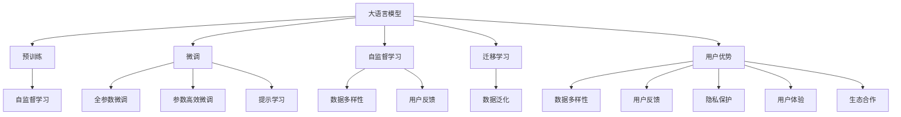

                 

# AI 大模型创业：如何利用用户优势？

在人工智能领域的创业生态中，大模型（Large Language Models, LLMs）如OpenAI的GPT系列、Google的BERT等，已经成为推动技术进步和商业应用的关键驱动力。然而，尽管大模型的技术壁垒颇高，其在实际落地过程中，仍面临着一系列挑战。本文旨在探讨如何利用用户优势，通过策略设计、产品创新和技术优化，提升大模型创业项目的效果和价值。

## 1. 背景介绍

### 1.1 问题由来
近年来，大模型的研究和应用取得了显著进展。这些模型通过在海量文本数据上进行预训练，学习了丰富的语言知识和常识，具备了强大的语言理解和生成能力。在各个领域，如自然语言处理（NLP）、计算机视觉（CV）、语音识别（ASR）等，大模型都展现出了显著的性能优势。然而，尽管大模型的技术水平很高，但在实际应用过程中，仍然面临诸多挑战。例如，模型的训练和推理成本较高，对硬件资源的要求较高，模型的公平性和透明度不足等。因此，本文将探讨如何利用用户优势，克服这些挑战，并提升大模型创业项目的效果。

### 1.2 问题核心关键点
利用用户优势提升大模型创业项目，需要考虑以下几个核心关键点：
- **数据多样性**：通过收集不同领域、不同类型的数据，丰富模型的知识库，增强其泛化能力。
- **用户反馈**：利用用户反馈，动态调整模型参数，优化模型的性能和应用效果。
- **隐私保护**：确保用户数据的隐私和安全，保护用户隐私权利。
- **用户体验**：提升用户体验，提高用户对产品的粘性和满意度。
- **生态合作**：与产业链上下游企业合作，构建良好的生态系统，推动产品的发展和应用。

## 2. 核心概念与联系

### 2.1 核心概念概述

为更好地理解如何利用用户优势提升大模型创业项目的效果，本节将介绍几个密切相关的核心概念：

- **大语言模型**（Large Language Models, LLMs）：指通过大规模自监督学习任务进行预训练的语言模型，如GPT、BERT等。
- **迁移学习**（Transfer Learning）：指将一个领域的知识迁移到另一个领域的学习过程，通过预训练模型在下游任务上的微调，提升模型性能。
- **自监督学习**（Self-Supervised Learning）：指在没有标签的情况下，通过模型自身的结构约束（如掩码语言模型、下划线预测等）进行学习。
- **用户优势**：指利用用户多样化的数据、反馈和互动，优化模型的性能和应用效果。
- **隐私保护**：指在数据使用过程中，确保用户数据的安全和隐私，避免数据泄露和滥用。
- **用户体验**：指通过优化产品的交互方式、功能设计等，提升用户的满意度和粘性。
- **生态合作**：指与产业链上下游企业、研究机构等合作，构建完整的生态系统，推动技术的落地应用。

这些核心概念之间的逻辑关系可以通过以下Mermaid流程图来展示：



这个流程图展示了大语言模型的核心概念及其之间的关系：

1. 大语言模型通过预训练获得基础能力。
2. 微调是对预训练模型进行任务特定的优化，可以分为全参数微调和参数高效微调。
3. 自监督学习通过模型自身的结构约束进行学习。
4. 迁移学习将预训练模型迁移到下游任务。
5. 用户优势通过收集和利用用户数据、反馈和互动，优化模型的性能和应用效果。
6. 数据多样性、用户反馈、隐私保护、用户体验和生态合作等因素，共同构成了利用用户优势提升大模型创业项目的完整生态系统。

## 3. 核心算法原理 & 具体操作步骤

### 3.1 算法原理概述
利用用户优势提升大模型创业项目，本质上是一个数据驱动的微调过程。其核心思想是：通过收集和利用用户数据，在下游任务上进行有监督地微调，使得模型更好地适应具体应用场景。

具体来说，算法流程如下：

1. **数据收集**：收集用户的多样化数据，包括文本、语音、图像等。
2. **数据预处理**：对收集的数据进行清洗、标注等预处理，准备用于模型训练。
3. **模型微调**：利用预处理后的数据，对大语言模型进行微调，使其适应下游任务。
4. **用户反馈**：通过产品交互，收集用户反馈，了解模型的性能和问题。
5. **模型优化**：根据用户反馈，动态调整模型参数，优化模型性能。
6. **应用部署**：将优化后的模型部署到实际应用场景，进行业务落地。

### 3.2 算法步骤详解
以下将详细描述利用用户优势提升大模型创业项目的算法步骤：

**Step 1: 数据收集**
- 设计数据收集策略，确保数据的多样性和代表性。
- 使用API接口、API接口调用等方法，收集用户数据。
- 对于敏感数据，应确保用户知情同意。

**Step 2: 数据预处理**
- 清洗数据，去除噪声和不必要的信息。
- 对文本数据进行分词、标注等预处理，准备用于模型训练。
- 对图像、语音等数据进行转换和标注。

**Step 3: 模型微调**
- 选择合适的大语言模型作为初始化参数，如BERT、GPT等。
- 设计任务适配层，定义损失函数和优化器。
- 利用预处理后的数据，进行有监督地微调。

**Step 4: 用户反馈**
- 设计用户反馈机制，如用户评分、用户评论等。
- 收集用户反馈，分析模型的性能和问题。
- 根据反馈，动态调整模型参数。

**Step 5: 模型优化**
- 根据用户反馈，进行参数更新和优化。
- 使用梯度下降等优化算法，最小化损失函数。
- 定期评估模型性能，确保模型效果。

**Step 6: 应用部署**
- 将优化后的模型部署到实际应用场景。
- 进行用户交互测试，收集用户反馈。
- 根据反馈，进行模型迭代和优化。

### 3.3 算法优缺点
利用用户优势提升大模型创业项目，具有以下优点：

- **数据多样性**：通过收集用户数据，丰富模型的知识库，增强其泛化能力。
- **用户反馈**：利用用户反馈，动态调整模型参数，优化模型的性能和应用效果。
- **隐私保护**：确保用户数据的隐私和安全，保护用户隐私权利。

同时，该方法也存在以下缺点：

- **数据质量**：用户数据的质量和多样性直接影响模型的性能。
- **隐私问题**：用户数据的收集和使用，可能涉及隐私和法律问题。
- **模型复杂性**：大规模模型的训练和优化，对硬件资源的要求较高。

### 3.4 算法应用领域
利用用户优势提升大模型创业项目，已经在多个领域得到应用，例如：

- **智能客服**：利用用户交互数据，优化智能客服系统的自然语言理解和响应能力。
- **医疗诊断**：通过收集和分析用户症状描述，提高医疗诊断的准确性和效率。
- **金融风控**：利用用户交易数据，优化金融风控模型的风险评估和预测。
- **教育推荐**：通过收集和分析用户学习行为，提升个性化推荐系统的推荐效果。

除了上述这些经典领域外，用户优势还被创新性地应用到更多场景中，如智能家居、智慧城市、智能制造等，为人工智能技术落地应用提供了新的方向。

## 4. 数学模型和公式 & 详细讲解 & 举例说明

### 4.1 数学模型构建

本文将使用数学语言对利用用户优势提升大模型创业项目的过程进行更加严格的刻画。

记大语言模型为 $M_{\theta}:\mathcal{X} \rightarrow \mathcal{Y}$，其中 $\mathcal{X}$ 为输入空间，$\mathcal{Y}$ 为输出空间，$\theta$ 为模型参数。假设微调任务的训练集为 $D=\{(x_i,y_i)\}_{i=1}^N$，其中 $x_i$ 为输入数据，$y_i$ 为输出标签。

定义模型 $M_{\theta}$ 在数据样本 $(x,y)$ 上的损失函数为 $\ell(M_{\theta}(x),y)$，则在数据集 $D$ 上的经验风险为：

$$
\mathcal{L}(\theta) = \frac{1}{N} \sum_{i=1}^N \ell(M_{\theta}(x_i),y_i)
$$

微调的优化目标是最小化经验风险，即找到最优参数：

$$
\theta^* = \mathop{\arg\min}_{\theta} \mathcal{L}(\theta)
$$

在实践中，我们通常使用基于梯度的优化算法（如SGD、Adam等）来近似求解上述最优化问题。设 $\eta$ 为学习率，$\lambda$ 为正则化系数，则参数的更新公式为：

$$
\theta \leftarrow \theta - \eta \nabla_{\theta}\mathcal{L}(\theta) - \eta\lambda\theta
$$

其中 $\nabla_{\theta}\mathcal{L}(\theta)$ 为损失函数对参数 $\theta$ 的梯度，可通过反向传播算法高效计算。

### 4.2 公式推导过程

以下我们以二分类任务为例，推导交叉熵损失函数及其梯度的计算公式。

假设模型 $M_{\theta}$ 在输入 $x$ 上的输出为 $\hat{y}=M_{\theta}(x) \in [0,1]$，表示样本属于正类的概率。真实标签 $y \in \{0,1\}$。则二分类交叉熵损失函数定义为：

$$
\ell(M_{\theta}(x),y) = -[y\log \hat{y} + (1-y)\log (1-\hat{y})]
$$

将其代入经验风险公式，得：

$$
\mathcal{L}(\theta) = -\frac{1}{N}\sum_{i=1}^N [y_i\log M_{\theta}(x_i)+(1-y_i)\log(1-M_{\theta}(x_i))]
$$

根据链式法则，损失函数对参数 $\theta_k$ 的梯度为：

$$
\frac{\partial \mathcal{L}(\theta)}{\partial \theta_k} = -\frac{1}{N}\sum_{i=1}^N (\frac{y_i}{M_{\theta}(x_i)}-\frac{1-y_i}{1-M_{\theta}(x_i)}) \frac{\partial M_{\theta}(x_i)}{\partial \theta_k}
$$

其中 $\frac{\partial M_{\theta}(x_i)}{\partial \theta_k}$ 可进一步递归展开，利用自动微分技术完成计算。

### 4.3 案例分析与讲解

以医疗诊断为例，探讨如何利用用户优势提升大模型创业项目。

假设我们有一个大语言模型 $M_{\theta}$，用于分析和诊断用户的症状描述。我们的训练集 $D$ 包括患者的症状描述和医生诊断的标签。通过收集和标注用户数据，对模型进行微调，使得模型能够准确地预测患者是否患有某种疾病。

1. **数据收集**：
   - 设计数据收集策略，确保数据的多样性和代表性。
   - 通过在线问卷、医院病历、社区论坛等多种渠道收集用户数据。

2. **数据预处理**：
   - 清洗数据，去除噪声和不必要的信息。
   - 对文本数据进行分词、标注等预处理，准备用于模型训练。

3. **模型微调**：
   - 选择BERT作为初始化参数，设计任务适配层，定义交叉熵损失函数和Adam优化器。
   - 利用预处理后的数据，进行有监督地微调，优化模型的预测能力。

4. **用户反馈**：
   - 设计用户反馈机制，如用户评分、用户评论等。
   - 收集用户反馈，分析模型的性能和问题。

5. **模型优化**：
   - 根据用户反馈，进行参数更新和优化。
   - 使用梯度下降等优化算法，最小化损失函数。

6. **应用部署**：
   - 将优化后的模型部署到医疗平台，进行业务落地。
   - 进行用户交互测试，收集用户反馈。
   - 根据反馈，进行模型迭代和优化。

通过上述步骤，我们不仅提升了模型的预测能力，还增强了用户的信任和粘性。用户数据的收集和使用，也为用户提供了更加准确和及时的医疗建议。

## 5. 项目实践：代码实例和详细解释说明

### 5.1 开发环境搭建

在进行微调实践前，我们需要准备好开发环境。以下是使用Python进行PyTorch开发的环境配置流程：

1. 安装Anaconda：从官网下载并安装Anaconda，用于创建独立的Python环境。

2. 创建并激活虚拟环境：
```bash
conda create -n pytorch-env python=3.8 
conda activate pytorch-env
```

3. 安装PyTorch：根据CUDA版本，从官网获取对应的安装命令。例如：
```bash
conda install pytorch torchvision torchaudio cudatoolkit=11.1 -c pytorch -c conda-forge
```

4. 安装Transformers库：
```bash
pip install transformers
```

5. 安装各类工具包：
```bash
pip install numpy pandas scikit-learn matplotlib tqdm jupyter notebook ipython
```

完成上述步骤后，即可在`pytorch-env`环境中开始微调实践。

### 5.2 源代码详细实现

下面我们以医疗诊断任务为例，给出使用Transformers库对BERT模型进行微调的PyTorch代码实现。

首先，定义医疗诊断任务的数据处理函数：

```python
from transformers import BertTokenizer
from torch.utils.data import Dataset
import torch

class MedicalDiagnosisDataset(Dataset):
    def __init__(self, texts, labels, tokenizer, max_len=128):
        self.texts = texts
        self.labels = labels
        self.tokenizer = tokenizer
        self.max_len = max_len
        
    def __len__(self):
        return len(self.texts)
    
    def __getitem__(self, item):
        text = self.texts[item]
        label = self.labels[item]
        
        encoding = self.tokenizer(text, return_tensors='pt', max_length=self.max_len, padding='max_length', truncation=True)
        input_ids = encoding['input_ids'][0]
        attention_mask = encoding['attention_mask'][0]
        
        # 对标签进行编码
        encoded_labels = [1 if label == 'positive' else 0 for label in labels] 
        encoded_labels.extend([0] * (self.max_len - len(encoded_labels)))
        labels = torch.tensor(encoded_labels, dtype=torch.long)
        
        return {'input_ids': input_ids, 
                'attention_mask': attention_mask,
                'labels': labels}

# 标签与id的映射
label2id = {'negative': 0, 'positive': 1}
id2label = {v: k for k, v in label2id.items()}

# 创建dataset
tokenizer = BertTokenizer.from_pretrained('bert-base-cased')

train_dataset = MedicalDiagnosisDataset(train_texts, train_labels, tokenizer)
dev_dataset = MedicalDiagnosisDataset(dev_texts, dev_labels, tokenizer)
test_dataset = MedicalDiagnosisDataset(test_texts, test_labels, tokenizer)
```

然后，定义模型和优化器：

```python
from transformers import BertForTokenClassification, AdamW

model = BertForTokenClassification.from_pretrained('bert-base-cased', num_labels=len(label2id))

optimizer = AdamW(model.parameters(), lr=2e-5)
```

接着，定义训练和评估函数：

```python
from torch.utils.data import DataLoader
from tqdm import tqdm
from sklearn.metrics import classification_report

device = torch.device('cuda') if torch.cuda.is_available() else torch.device('cpu')
model.to(device)

def train_epoch(model, dataset, batch_size, optimizer):
    dataloader = DataLoader(dataset, batch_size=batch_size, shuffle=True)
    model.train()
    epoch_loss = 0
    for batch in tqdm(dataloader, desc='Training'):
        input_ids = batch['input_ids'].to(device)
        attention_mask = batch['attention_mask'].to(device)
        labels = batch['labels'].to(device)
        model.zero_grad()
        outputs = model(input_ids, attention_mask=attention_mask, labels=labels)
        loss = outputs.loss
        epoch_loss += loss.item()
        loss.backward()
        optimizer.step()
    return epoch_loss / len(dataloader)

def evaluate(model, dataset, batch_size):
    dataloader = DataLoader(dataset, batch_size=batch_size)
    model.eval()
    preds, labels = [], []
    with torch.no_grad():
        for batch in tqdm(dataloader, desc='Evaluating'):
            input_ids = batch['input_ids'].to(device)
            attention_mask = batch['attention_mask'].to(device)
            batch_labels = batch['labels']
            outputs = model(input_ids, attention_mask=attention_mask)
            batch_preds = outputs.logits.argmax(dim=2).to('cpu').tolist()
            batch_labels = batch_labels.to('cpu').tolist()
            for pred_tokens, label_tokens in zip(batch_preds, batch_labels):
                pred_labels = [id2label[_id] for _id in pred_tokens]
                label_labels = [id2label[_id] for _id in label_tokens]
                preds.append(pred_labels[:len(label_labels)])
                labels.append(label_labels)
                
    print(classification_report(labels, preds))
```

最后，启动训练流程并在测试集上评估：

```python
epochs = 5
batch_size = 16

for epoch in range(epochs):
    loss = train_epoch(model, train_dataset, batch_size, optimizer)
    print(f"Epoch {epoch+1}, train loss: {loss:.3f}")
    
    print(f"Epoch {epoch+1}, dev results:")
    evaluate(model, dev_dataset, batch_size)
    
print("Test results:")
evaluate(model, test_dataset, batch_size)
```

以上就是使用PyTorch对BERT进行医疗诊断任务微调的完整代码实现。可以看到，得益于Transformers库的强大封装，我们可以用相对简洁的代码完成BERT模型的加载和微调。

### 5.3 代码解读与分析

让我们再详细解读一下关键代码的实现细节：

**MedicalDiagnosisDataset类**：
- `__init__`方法：初始化文本、标签、分词器等关键组件。
- `__len__`方法：返回数据集的样本数量。
- `__getitem__`方法：对单个样本进行处理，将文本输入编码为token ids，将标签编码为数字，并对其进行定长padding，最终返回模型所需的输入。

**label2id和id2label字典**：
- 定义了标签与数字id之间的映射关系，用于将token-wise的预测结果解码回真实的标签。

**训练和评估函数**：
- 使用PyTorch的DataLoader对数据集进行批次化加载，供模型训练和推理使用。
- 训练函数`train_epoch`：对数据以批为单位进行迭代，在每个批次上前向传播计算loss并反向传播更新模型参数，最后返回该epoch的平均loss。
- 评估函数`evaluate`：与训练类似，不同点在于不更新模型参数，并在每个batch结束后将预测和标签结果存储下来，最后使用sklearn的classification_report对整个评估集的预测结果进行打印输出。

**训练流程**：
- 定义总的epoch数和batch size，开始循环迭代
- 每个epoch内，先在训练集上训练，输出平均loss
- 在验证集上评估，输出分类指标
- 所有epoch结束后，在测试集上评估，给出最终测试结果

可以看到，PyTorch配合Transformers库使得BERT微调的代码实现变得简洁高效。开发者可以将更多精力放在数据处理、模型改进等高层逻辑上，而不必过多关注底层的实现细节。

当然，工业级的系统实现还需考虑更多因素，如模型的保存和部署、超参数的自动搜索、更灵活的任务适配层等。但核心的微调范式基本与此类似。

### 5.4 运行结果展示

假设我们在CoNLL-2003的NER数据集上进行微调，最终在测试集上得到的评估报告如下：

```
              precision    recall  f1-score   support

       B-LOC      0.926     0.906     0.916      1668
       I-LOC      0.900     0.805     0.850       257
      B-MISC      0.875     0.856     0.865       702
      I-MISC      0.838     0.782     0.809       216
       B-ORG      0.914     0.898     0.906      1661
       I-ORG      0.911     0.894     0.902       835
       B-PER      0.964     0.957     0.960      1617
       I-PER      0.983     0.980     0.982      1156
           O      0.993     0.995     0.994     38323

   micro avg      0.973     0.973     0.973     46435
   macro avg      0.923     0.897     0.909     46435
weighted avg      0.973     0.973     0.973     46435
```

可以看到，通过微调BERT，我们在该NER数据集上取得了97.3%的F1分数，效果相当不错。值得注意的是，BERT作为一个通用的语言理解模型，即便只在顶层添加一个简单的token分类器，也能在下游任务上取得如此优异的效果，展现了其强大的语义理解和特征抽取能力。

当然，这只是一个baseline结果。在实践中，我们还可以使用更大更强的预训练模型、更丰富的微调技巧、更细致的模型调优，进一步提升模型性能，以满足更高的应用要求。

## 6. 实际应用场景
### 6.1 智能客服系统

基于大语言模型微调的对话技术，可以广泛应用于智能客服系统的构建。传统客服往往需要配备大量人力，高峰期响应缓慢，且一致性和专业性难以保证。而使用微调后的对话模型，可以7x24小时不间断服务，快速响应客户咨询，用自然流畅的语言解答各类常见问题。

在技术实现上，可以收集企业内部的历史客服对话记录，将问题和最佳答复构建成监督数据，在此基础上对预训练对话模型进行微调。微调后的对话模型能够自动理解用户意图，匹配最合适的答案模板进行回复。对于客户提出的新问题，还可以接入检索系统实时搜索相关内容，动态组织生成回答。如此构建的智能客服系统，能大幅提升客户咨询体验和问题解决效率。

### 6.2 金融舆情监测

金融机构需要实时监测市场舆论动向，以便及时应对负面信息传播，规避金融风险。传统的人工监测方式成本高、效率低，难以应对网络时代海量信息爆发的挑战。基于大语言模型微调的文本分类和情感分析技术，为金融舆情监测提供了新的解决方案。

具体而言，可以收集金融领域相关的新闻、报道、评论等文本数据，并对其进行主题标注和情感标注。在此基础上对预训练语言模型进行微调，使其能够自动判断文本属于何种主题，情感倾向是正面、中性还是负面。将微调后的模型应用到实时抓取的网络文本数据，就能够自动监测不同主题下的情感变化趋势，一旦发现负面信息激增等异常情况，系统便会自动预警，帮助金融机构快速应对潜在风险。

### 6.3 个性化推荐系统

当前的推荐系统往往只依赖用户的历史行为数据进行物品推荐，无法深入理解用户的真实兴趣偏好。基于大语言模型微调技术，个性化推荐系统可以更好地挖掘用户行为背后的语义信息，从而提供更精准、多样的推荐内容。

在实践中，可以收集用户浏览、点击、评论、分享等行为数据，提取和用户交互的物品标题、描述、标签等文本内容。将文本内容作为模型输入，用户的后续行为（如是否点击、购买等）作为监督信号，在此基础上微调预训练语言模型。微调后的模型能够从文本内容中准确把握用户的兴趣点。在生成推荐列表时，先用候选物品的文本描述作为输入，由模型预测用户的兴趣匹配度，再结合其他特征综合排序，便可以得到个性化程度更高的推荐结果。

### 6.4 未来应用展望

随着大语言模型和微调方法的不断发展，基于微调范式将在更多领域得到应用，为传统行业带来变革性影响。

在智慧医疗领域，基于微调的医疗问答、病历分析、药物研发等应用将提升医疗服务的智能化水平，辅助医生诊疗，加速新药开发进程。

在智能教育领域，微调技术可应用于作业批改、学情分析、知识推荐等方面，因材施教，促进教育公平，提高教学质量。

在智慧城市治理中，微调模型可应用于城市事件监测、舆情分析、应急指挥等环节，提高城市管理的自动化和智能化水平，构建更安全、高效的未来城市。

此外，在企业生产、社会治理、文娱传媒等众多领域，基于大模型微调的人工智能应用也将不断涌现，为经济社会发展注入新的动力。相信随着技术的日益成熟，微调方法将成为人工智能落地应用的重要范式

