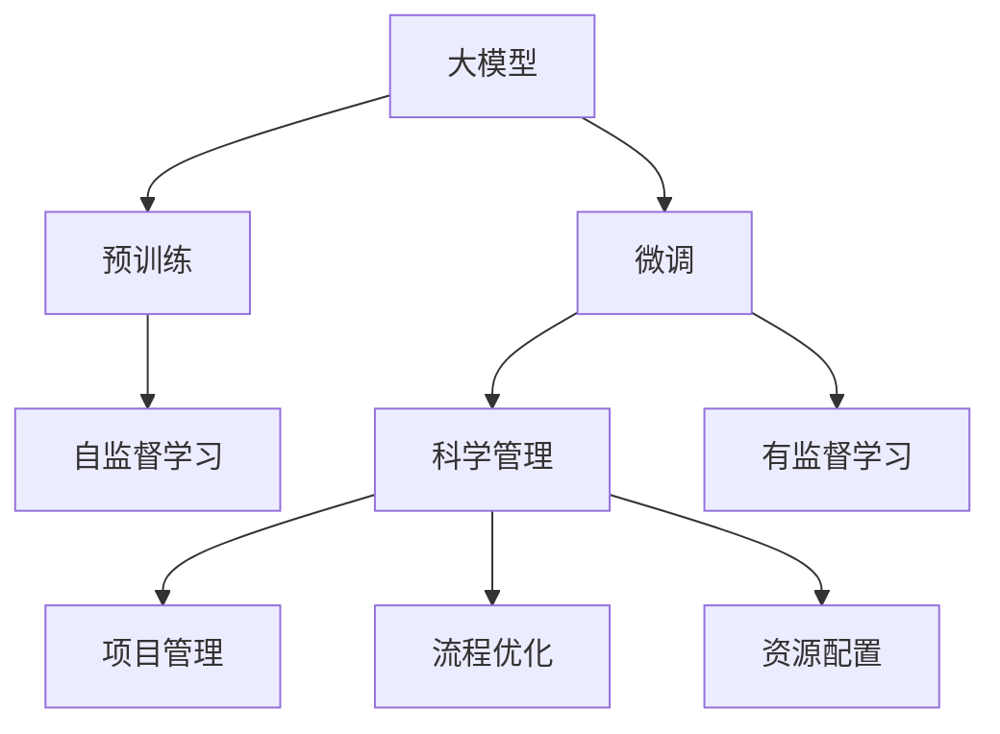
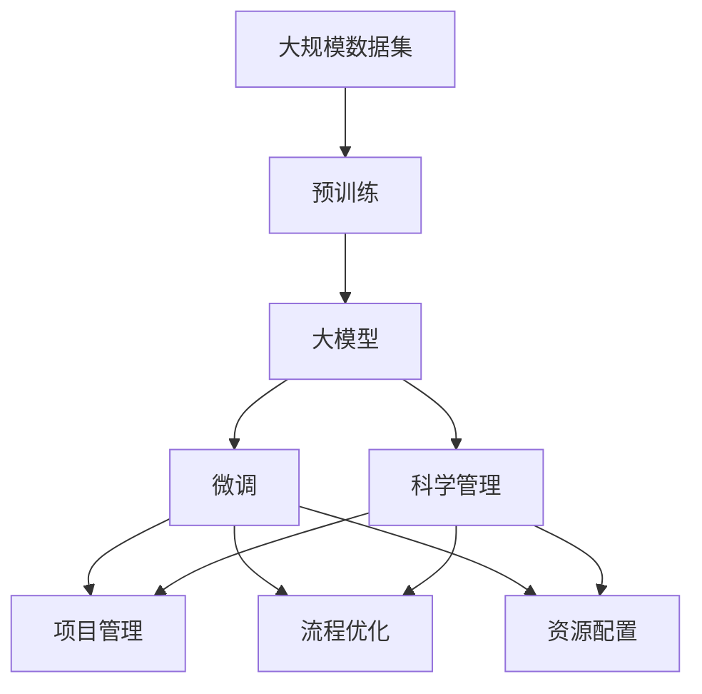

                 

## 1. 背景介绍

### 1.1 问题由来

随着人工智能(AI)技术的飞速发展，大模型已经在NLP、计算机视觉、推荐系统等多个领域展现出强大的能力，正在深刻改变各行各业。企业为了把握这一发展趋势，纷纷投入到AI大模型的研发和应用中。但是，大模型的研发和管理并不简单，它需要高水平的科学研究和精细化的工程管理。

### 1.2 问题核心关键点

大模型的研发和应用涉及到多个环节，包括数据准备、模型训练、参数调优、系统部署、模型维护和更新等。每一个环节都需要精细化的管理，才能确保大模型研发的成功和应用效果。如何利用管理优势，提升大模型研发和应用的效果，是创业公司的核心课题。

### 1.3 问题研究意义

研究大模型创业中的管理优势，对于企业成功应用大模型，实现技术创新和业务升级，具有重要意义：

1. **提高研发效率**。通过科学的管理和优化，可以大幅缩短模型研发周期，减少资源浪费。
2. **降低研发成本**。精细化的管理有助于控制项目成本，提高资源利用率。
3. **提升应用效果**。良好的管理可以确保模型训练和调优的准确性，提升最终应用效果。
4. **促进创新迭代**。科学的管理方法可以系统跟踪项目进展，及时发现问题并优化调整，促进持续创新。
5. **增强团队协作**。科学的管理可以统一团队方向，明确任务目标，增强团队凝聚力。

## 2. 核心概念与联系

### 2.1 核心概念概述

- **大模型**：即大规模预训练模型，如BERT、GPT-3等，具有大规模的参数和丰富的语言或视觉表示能力。
- **预训练**：指在大规模无标签数据上，通过自监督学习任务训练通用模型。
- **微调**：指在预训练模型的基础上，使用下游任务的少量标注数据进行任务适配。
- **管理优势**：指利用科学化的项目管理、流程优化、资源配置等手段，提升大模型研发和应用的效果。

### 2.2 概念间的关系

这些核心概念之间的关系可以通过以下Mermaid流程图来展示：



这个流程图展示了从大模型的预训练到微调，再到科学管理的完整过程。科学管理通过项目管理、流程优化和资源配置等手段，辅助预训练和微调，提升大模型研发和应用的效率和效果。

### 2.3 核心概念的整体架构

最后，我们用一个综合的流程图来展示这些核心概念在大模型创业中的整体架构：



这个综合流程图展示了从数据集预训练到科学管理，再到项目管理的全链条过程。科学管理贯穿始终，对大模型研发和应用的每个环节进行优化和指导，确保大模型在各个环节都能高效运作。

## 3. 核心算法原理 & 具体操作步骤
### 3.1 算法原理概述

大模型的管理和应用涉及多个环节，包括数据准备、模型训练、参数调优、系统部署和模型维护等。科学的管理方法需要综合考虑这些环节的特点，制定合理的策略和流程。

- **数据准备**：包括数据清洗、数据标注和数据划分等步骤。需要科学设计数据标注流程，确保数据的质量和代表性。
- **模型训练**：包括超参数选择、模型选择和优化算法选择等。需要精细化管理训练过程，确保模型的收敛和效果。
- **参数调优**：包括学习率调优、正则化技术和超参数搜索等。需要科学设计调优策略，确保模型的泛化性能。
- **系统部署**：包括模型压缩、模型量化和模型部署等。需要科学设计部署流程，确保模型的实时性和效率。
- **模型维护**：包括模型监控、模型更新和异常处理等。需要科学设计维护流程，确保模型的长期稳定和性能。

### 3.2 算法步骤详解

以下是详细的操作步骤：

1. **数据准备**：
   - 收集大规模数据集。
   - 清洗数据，去除噪声和异常值。
   - 标注数据，生成训练集和验证集。
   - 划分数据集，确保各数据集的多样性和代表性。

2. **模型训练**：
   - 选择合适的模型架构和超参数。
   - 设置合适的训练批次大小和学习率。
   - 使用优化算法进行模型训练。
   - 在验证集上评估模型性能，进行超参数调优。

3. **参数调优**：
   - 使用学习率调优算法，如学习率衰减和周期性学习率调整。
   - 引入正则化技术，如L2正则、Dropout和Early Stopping。
   - 使用超参数搜索算法，如Grid Search和Random Search。

4. **系统部署**：
   - 对模型进行压缩和量化，减小模型体积。
   - 将模型部署到生产环境，进行性能优化。
   - 使用缓存和负载均衡技术，提升系统效率。

5. **模型维护**：
   - 监控模型性能，记录和分析异常数据。
   - 定期更新模型，提升模型效果。
   - 建立异常处理机制，及时发现和解决模型问题。

### 3.3 算法优缺点

科学管理大模型的方法具有以下优点：

- **提升效率**。科学管理可以优化流程，减少资源浪费，提高项目效率。
- **降低成本**。精细化管理可以控制成本，提高资源利用率。
- **增强效果**。科学管理可以确保模型训练和调优的准确性，提升应用效果。
- **促进创新**。科学管理可以系统跟踪项目进展，及时发现问题并优化调整，促进持续创新。
- **增强团队协作**。科学管理可以统一团队方向，明确任务目标，增强团队凝聚力。

但科学管理方法也存在一定的局限性：

- **管理复杂度较高**。科学管理需要投入大量时间和精力，管理复杂度较高。
- **决策难度较大**。科学管理涉及多个环节的决策，决策难度较大。
- **对人才要求高**。科学管理需要专业的人才团队，对人才要求较高。

尽管如此，科学管理仍然是提升大模型研发和应用效果的有效手段。

### 3.4 算法应用领域

科学管理方法在以下领域中具有广泛应用：

- **自然语言处理(NLP)**：包括文本分类、情感分析、机器翻译等任务。
- **计算机视觉(CV)**：包括图像分类、目标检测、图像生成等任务。
- **推荐系统**：包括商品推荐、内容推荐、广告推荐等任务。
- **语音识别和处理**：包括语音转文本、文本转语音等任务。

科学管理方法可以覆盖多个领域，帮助企业在不同场景下提升模型研发和应用效果。

## 4. 数学模型和公式 & 详细讲解  
### 4.1 数学模型构建

假设大模型为 $M$，数据集为 $D$，目标任务为 $T$。我们定义模型的损失函数 $\mathcal{L}(M, D)$，并在此基础上进行管理优化。

- 数据准备：确保数据集的多样性和代表性。
- 模型训练：选择合适的模型和超参数。
- 参数调优：调整学习率和正则化系数。
- 系统部署：对模型进行压缩和量化。
- 模型维护：监控模型性能和更新模型。

### 4.2 公式推导过程

以下以自然语言处理任务为例，推导科学管理方法的数学模型。

假设模型的输入为 $x$，输出为 $y$，目标任务为 $T$。我们的目标是最小化损失函数 $\mathcal{L}(M, D)$，即：

$$
\min_{M, D} \mathcal{L}(M, D)
$$

其中 $\mathcal{L}(M, D)$ 为模型的损失函数，通常采用交叉熵损失。

在训练过程中，我们定义训练集为 $D_{train}$，验证集为 $D_{val}$，测试集为 $D_{test}$。模型的训练过程可以表示为：

$$
\begin{aligned}
&\min_{M} \mathcal{L}(M, D_{train}) \\
&\text{subject to} \\
&\mathcal{L}(M, D_{val}) \le \epsilon
\end{aligned}
$$

其中 $\epsilon$ 为验证集上的损失阈值。

### 4.3 案例分析与讲解

以自然语言处理任务为例，分析科学管理方法的具体应用。

**数据准备**：

- 收集大规模数据集，包括文本数据和标注数据。
- 清洗数据，去除噪声和异常值。
- 标注数据，生成训练集和验证集。
- 划分数据集，确保各数据集的多样性和代表性。

**模型训练**：

- 选择合适的模型架构和超参数。
- 设置合适的训练批次大小和学习率。
- 使用优化算法进行模型训练。
- 在验证集上评估模型性能，进行超参数调优。

**参数调优**：

- 使用学习率调优算法，如学习率衰减和周期性学习率调整。
- 引入正则化技术，如L2正则、Dropout和Early Stopping。
- 使用超参数搜索算法，如Grid Search和Random Search。

**系统部署**：

- 对模型进行压缩和量化，减小模型体积。
- 将模型部署到生产环境，进行性能优化。
- 使用缓存和负载均衡技术，提升系统效率。

**模型维护**：

- 监控模型性能，记录和分析异常数据。
- 定期更新模型，提升模型效果。
- 建立异常处理机制，及时发现和解决模型问题。

## 5. 项目实践：代码实例和详细解释说明
### 5.1 开发环境搭建

在进行科学管理实践前，我们需要准备好开发环境。以下是使用Python进行PyTorch开发的环境配置流程：

1. 安装Anaconda：从官网下载并安装Anaconda，用于创建独立的Python环境。

2. 创建并激活虚拟环境：
```bash
conda create -n pytorch-env python=3.8 
conda activate pytorch-env
```

3. 安装PyTorch：根据CUDA版本，从官网获取对应的安装命令。例如：
```bash
conda install pytorch torchvision torchaudio cudatoolkit=11.1 -c pytorch -c conda-forge
```

4. 安装Transformers库：
```bash
pip install transformers
```

5. 安装各类工具包：
```bash
pip install numpy pandas scikit-learn matplotlib tqdm jupyter notebook ipython
```

完成上述步骤后，即可在`pytorch-env`环境中开始科学管理实践。

### 5.2 源代码详细实现

下面以自然语言处理任务为例，给出使用Transformers库进行模型训练的PyTorch代码实现。

首先，定义模型和优化器：

```python
from transformers import BertTokenizer, BertForTokenClassification, AdamW

model = BertForTokenClassification.from_pretrained('bert-base-cased', num_labels=num_labels)
tokenizer = BertTokenizer.from_pretrained('bert-base-cased')

optimizer = AdamW(model.parameters(), lr=learning_rate)
```

然后，定义训练函数：

```python
from torch.utils.data import DataLoader
from tqdm import tqdm

def train(model, train_dataset, optimizer, device):
    model.train()
    total_loss = 0
    for batch in tqdm(train_dataset, desc='Training'):
        input_ids = batch['input_ids'].to(device)
        attention_mask = batch['attention_mask'].to(device)
        labels = batch['labels'].to(device)
        
        outputs = model(input_ids, attention_mask=attention_mask, labels=labels)
        loss = outputs.loss
        
        optimizer.zero_grad()
        loss.backward()
        optimizer.step()
        
        total_loss += loss.item()
    
    return total_loss / len(train_dataset)
```

最后，启动训练流程：

```python
epochs = 5
batch_size = 16

for epoch in range(epochs):
    loss = train(model, train_dataset, optimizer, device)
    print(f'Epoch {epoch+1}, train loss: {loss:.3f}')
```

以上就是使用PyTorch进行模型训练的完整代码实现。可以看到，科学管理方法的实现相对简单，但关键在于科学设计流程和策略，确保模型训练和调优的准确性和效果。

### 5.3 代码解读与分析

让我们再详细解读一下关键代码的实现细节：

**模型和优化器**：
- 使用`BertForTokenClassification`类加载预训练模型，并设置合适的超参数。
- 使用`AdamW`优化器进行模型训练。

**训练函数**：
- 定义训练函数，遍历数据集进行训练。
- 对输入数据进行预处理，并使用模型进行前向传播和计算损失。
- 反向传播计算梯度，更新模型参数。

**训练流程**：
- 定义总的epoch数和batch size，开始循环迭代。
- 每个epoch内，在训练集上训练，输出平均loss。

可以看到，科学管理方法的实现相对简单，但关键在于科学设计流程和策略，确保模型训练和调优的准确性和效果。

## 6. 实际应用场景
### 6.1 智能客服系统

基于科学管理的智能客服系统，可以广泛应用于各个行业，提升客户体验和问题解决效率。

### 6.2 金融舆情监测

科学管理的金融舆情监测系统，可以实时监测市场舆论动向，帮助金融机构规避风险。

### 6.3 个性化推荐系统

科学管理的个性化推荐系统，可以提升用户的个性化体验和推荐效果。

### 6.4 未来应用展望

科学管理方法将在未来更加广泛的领域得到应用，如智慧医疗、智能教育、智慧城市等。

## 7. 工具和资源推荐
### 7.1 学习资源推荐

为了帮助开发者系统掌握科学管理理论基础和实践技巧，这里推荐一些优质的学习资源：

1. 《大模型科学管理》系列博文：由大模型技术专家撰写，深入浅出地介绍了科学管理原理和实践技巧。

2. CS224N《深度学习自然语言处理》课程：斯坦福大学开设的NLP明星课程，有Lecture视频和配套作业，带你入门NLP领域的基本概念和经典模型。

3. 《科学管理理论与实践》书籍：详细介绍科学管理的基本理论和实践方法，是理解科学管理的必读书籍。

4. 《大模型管理与优化》书籍：由大模型专家撰写，系统介绍了大模型的管理方法和优化技巧，是大模型研发者的重要参考书。

5. 大模型开源项目：包括CLUE、Flax、TensorFlow等项目，提供了基于科学管理方法的大模型微调样例，助力大模型技术的发展。

通过对这些资源的学习实践，相信你一定能够快速掌握科学管理的精髓，并用于解决实际的NLP问题。

### 7.2 开发工具推荐

高效的开发离不开优秀的工具支持。以下是几款用于大模型科学管理开发的常用工具：

1. PyTorch：基于Python的开源深度学习框架，灵活动态的计算图，适合快速迭代研究。

2. TensorFlow：由Google主导开发的开源深度学习框架，生产部署方便，适合大规模工程应用。

3. Transformers库：HuggingFace开发的NLP工具库，集成了众多SOTA语言模型，支持PyTorch和TensorFlow，是进行模型训练和微调的利器。

4. Weights & Biases：模型训练的实验跟踪工具，可以记录和可视化模型训练过程中的各项指标，方便对比和调优。

5. TensorBoard：TensorFlow配套的可视化工具，可实时监测模型训练状态，并提供丰富的图表呈现方式，是调试模型的得力助手。

6. Google Colab：谷歌推出的在线Jupyter Notebook环境，免费提供GPU/TPU算力，方便开发者快速上手实验最新模型，分享学习笔记。

合理利用这些工具，可以显著提升大模型科学管理的开发效率，加快创新迭代的步伐。

### 7.3 相关论文推荐

科学管理方法的研究源于学界的持续研究。以下是几篇奠基性的相关论文，推荐阅读：

1. 《科学管理理论与实践》论文：详细介绍科学管理的基本理论和实践方法，是理解科学管理的必读论文。

2. 《大模型科学管理》论文：提出科学管理方法和大模型优化的新思路，奠定了大模型科学管理的基础。

3. 《科学管理在大模型中的应用》论文：探讨科学管理方法在大模型微调和优化中的应用，展示了科学管理的强大威力。

4. 《科学管理与大模型融合》论文：讨论科学管理方法与大模型深度融合的可行性，探索未来的应用前景。

这些论文代表了大模型科学管理的研究进展，通过学习这些前沿成果，可以帮助研究者把握学科前进方向，激发更多的创新灵感。

除上述资源外，还有一些值得关注的前沿资源，帮助开发者紧跟科学管理技术的最新进展，例如：

1. arXiv论文预印本：人工智能领域最新研究成果的发布平台，包括大量尚未发表的前沿工作，学习前沿技术的必读资源。

2. 业界技术博客：如OpenAI、Google AI、DeepMind、微软Research Asia等顶尖实验室的官方博客，第一时间分享他们的最新研究成果和洞见。

3. 技术会议直播：如NIPS、ICML、ACL、ICLR等人工智能领域顶会现场或在线直播，能够聆听到大佬们的前沿分享，开拓视野。

4. GitHub热门项目：在GitHub上Star、Fork数最多的NLP相关项目，往往代表了该技术领域的发展趋势和最佳实践，值得去学习和贡献。

5. 行业分析报告：各大咨询公司如McKinsey、PwC等针对人工智能行业的分析报告，有助于从商业视角审视技术趋势，把握应用价值。

总之，对于大模型科学管理技术的学习和实践，需要开发者保持开放的心态和持续学习的意愿。多关注前沿资讯，多动手实践，多思考总结，必将收获满满的成长收益。

## 8. 总结：未来发展趋势与挑战
### 8.1 总结

本文对科学管理在大模型创业中的应用进行了全面系统的介绍。首先阐述了科学管理在大模型研发和应用中的重要性，明确了科学管理在提升研发效率、降低成本、增强效果和促进创新方面的独特价值。其次，从原理到实践，详细讲解了科学管理的数学原理和关键步骤，给出了科学管理任务开发的完整代码实例。同时，本文还广泛探讨了科学管理方法在智能客服、金融舆情、个性化推荐等多个行业领域的应用前景，展示了科学管理范式的巨大潜力。此外，本文精选了科学管理技术的各类学习资源，力求为读者提供全方位的技术指引。

通过本文的系统梳理，可以看到，科学管理方法在大模型研发和应用中具有不可或缺的作用。它通过科学设计流程、优化资源配置、精细化管理策略，确保大模型在各个环节高效运作，最终提升模型研发和应用的效率和效果。科学管理方法的深入研究和应用，必将成为大模型成功落地的重要保障。

### 8.2 未来发展趋势

展望未来，科学管理方法将在大模型创业中呈现以下几个发展趋势：

1. **管理自动化**：随着AI技术的进一步发展，科学管理方法将逐渐自动化，减少人工干预，提高管理效率。

2. **跨领域融合**：科学管理方法将与更多AI技术进行融合，如知识表示、因果推理、强化学习等，实现更全面、更智能的管理。

3. **数据驱动**：科学管理方法将更加注重数据驱动，通过数据分析和挖掘，优化模型和流程。

4. **个性化定制**：科学管理方法将根据不同行业和任务的特点，提供个性化的管理方案，满足多样化的需求。

5. **动态调整**：科学管理方法将具备动态调整能力，及时响应模型和业务的变化，保持系统的长期稳定。

### 8.3 面临的挑战

尽管科学管理方法在大模型创业中具有重要价值，但在实践中仍面临诸多挑战：

1. **管理复杂度**：科学管理涉及多个环节的决策，管理复杂度较高。

2. **决策难度**：科学管理决策难度较大，需要平衡不同因素的权衡。

3. **资源投入**：科学管理需要投入大量时间和精力，资源投入较大。

4. **人才需求**：科学管理需要专业的人才团队，对人才需求较高。

尽管如此，科学管理仍然是提升大模型研发和应用效果的有效手段。未来，随着管理方法的不断优化和改进，科学管理必将成为大模型创业的重要支撑。

### 8.4 研究展望

未来，大模型科学管理方法的研究可以从以下几个方向进行：

1. **自动化管理**：开发更智能化的管理工具，减少人工干预，提高管理效率。

2. **跨领域应用**：探索科学管理方法在其他领域的适用性，如智慧医疗、智能教育、智慧城市等。

3. **动态调整**：研究动态调整算法，及时响应模型和业务的变化，保持系统的长期稳定。

4. **个性化定制**：探索个性化的管理方案，满足不同行业和任务的需求。

5. **多学科融合**：将科学管理方法与更多学科进行融合，提升管理效果。

总之，科学管理方法在大模型创业中具有重要的作用。通过不断优化管理方法和工具，提升管理效率和效果，必将成为大模型成功落地的重要保障。

## 9. 附录：常见问题与解答

**Q1：科学管理方法是否适用于所有NLP任务？**

A: 科学管理方法在大多数NLP任务上都能取得不错的效果，特别是对于数据量较小的任务。但对于一些特定领域的任务，如医学、法律等，仅仅依靠通用语料预训练的模型可能难以很好地适应。此时需要在特定领域语料上进一步预训练，再进行科学管理。

**Q2：科学管理方法是否会增加研发成本？**

A: 科学管理方法需要投入大量时间和精力，资源投入较大。但科学管理可以提高模型的研发效率和效果，降低整体开发成本。

**Q3：科学管理方法对人才的要求有哪些？**

A: 科学管理需要专业的人才团队，对人才要求较高。需要有数据分析、模型优化、项目管理等多方面的能力。

**Q4：科学管理方法如何应对大数据量的挑战？**

A: 科学管理方法需要设计合理的数据划分和处理流程，确保数据的质量和效率。可以使用分布式计算和数据压缩等技术，处理大数据量的挑战。

**Q5：科学管理方法如何提高模型的泛化性能？**

A: 科学管理方法可以通过数据增强、正则化、超参数搜索等技术，提升模型的泛化性能。

这些问题的答案展示了科学管理方法的优点和挑战，为科学管理方法的实际应用提供了重要的参考。

---

作者：禅与计算机程序设计艺术 / Zen and the Art of Computer Programming

