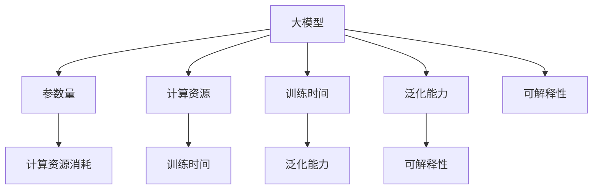
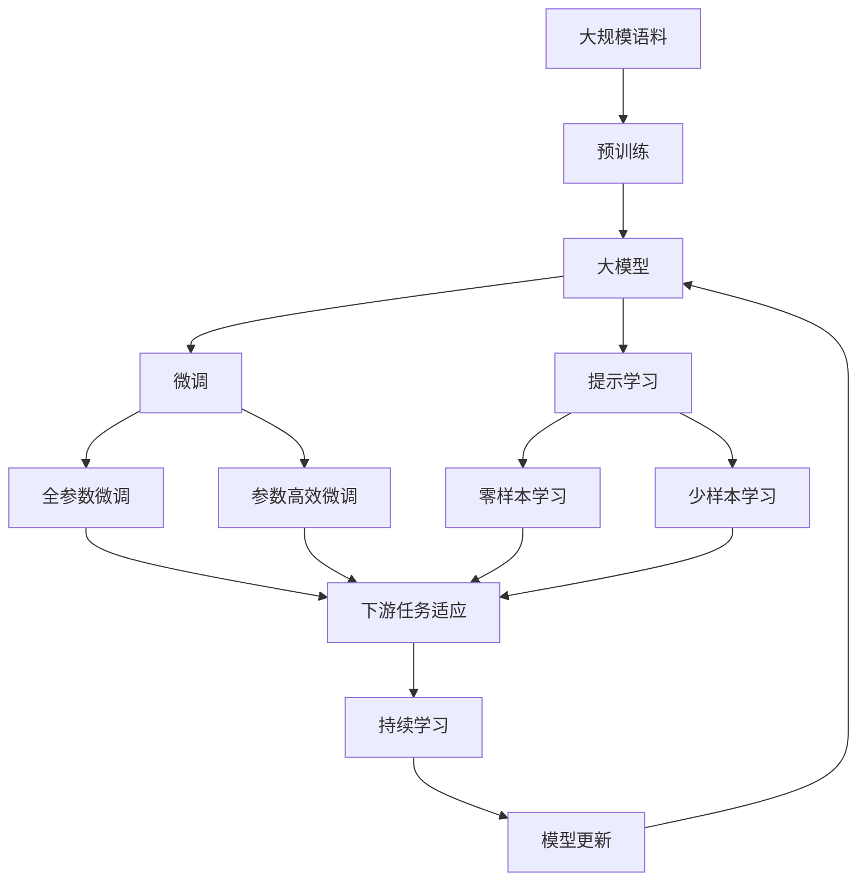

                 

# AI 大模型原理与应用：基于 scaling law 让模型变大，探索智能的边界

## 1. 背景介绍

近年来，人工智能领域取得了巨大的突破，尤其是深度学习技术的迅猛发展。深度学习模型的能力日益增强，已经成功应用于图像识别、自然语言处理、语音识别、推荐系统等诸多领域，展现出强大的智能潜力。然而，当前深度学习模型仍然存在诸多局限，如训练数据需求大、模型泛化能力差、资源消耗高、可解释性不足等问题。如何进一步提升模型的智能水平，拓展其应用边界，成为当前人工智能研究的重要课题。

### 1.1 问题由来

深度学习模型的智能水平主要取决于其模型复杂度。当前模型往往通过增加参数量、深度和宽度等手段来提升智能水平。然而，随着模型规模的不断扩大，其训练和推理所需的时间和资源成本也随之急剧增加，模型复杂度的提升面临着巨大的资源瓶颈。因此，如何在保持高智能水平的同时，减少模型资源消耗，降低计算成本，提高可解释性和泛化能力，成为亟需解决的关键问题。

## 2. 核心概念与联系

### 2.1 核心概念概述

为更好地理解基于 scaling law 的大模型构建方法，本节将介绍几个密切相关的核心概念：

- 大模型(Extrapolated Models)：指具有极高参数量和复杂度的深度学习模型，能够学习到丰富的语义表示，实现复杂自然语言处理任务。
- Scaling Law：即模型规模和智能能力之间的数学关系，根据该法则，模型规模越大，智能能力越强，但计算资源消耗和训练成本也随之增加。
- 参数量(Parameter Count)：模型中所有可训练参数的数量，通常以百万计。
- 计算资源(Calculational Resource)：指模型训练和推理所需的计算硬件资源，如GPU、TPU等。
- 训练时间(Training Time)：指模型从训练开始到收敛所需的总时间，单位通常为小时。
- 泛化能力(Generalization Capability)：指模型在未知数据上的表现，衡量模型能否准确泛化到新数据集。
- 可解释性(Explainability)：指模型的决策过程能否被解释和理解，通常用于提高用户信任和合规性。

这些核心概念之间的逻辑关系可以通过以下Mermaid流程图来展示：



这个流程图展示了大模型与各个关键概念之间的联系：

1. 大模型通过增加参数量，提升了智能能力。
2. 大模型的计算资源消耗和训练时间也随之增加。
3. 大模型的泛化能力和可解释性得到提升。
4. 参数量、计算资源、训练时间、泛化能力和可解释性之间存在着紧密的联系，互相影响。

### 2.2 概念间的关系

这些核心概念之间存在着紧密的联系，形成了大模型的完整生态系统。下面我通过几个Mermaid流程图来展示这些概念之间的关系。

#### 2.2.1 大模型的学习范式



这个流程图展示了大模型的核心概念及其之间的关系：

1. 大模型通过在大规模语料上进行预训练获得基础能力。
2. 微调和大模型微调方法对预训练模型进行任务特定的优化。
3. 提示学习可以实现零样本和少样本学习。
4. 微调和大模型微调方法能够适应不同下游任务。
5. 持续学习技术使模型不断更新，保持智能能力。

### 2.3 核心概念的整体架构

最后，我们用一个综合的流程图来展示这些核心概念在大模型微调过程中的整体架构：


这个综合流程图展示了大模型微调的整体架构：

1. 大模型通过预训练获得基础能力。
2. 微调对预训练模型进行任务特定的优化。
3. 提示学习实现零样本和少样本学习。
4. 微调方法能够适应不同下游任务。
5. 持续学习技术使模型不断更新，保持智能能力。

这些概念共同构成了大模型的学习和应用框架，使其能够在各种场景下发挥强大的智能能力。通过理解这些核心概念，我们可以更好地把握大模型的工作原理和优化方向。

## 3. 核心算法原理 & 具体操作步骤
### 3.1 算法原理概述

基于 scaling law 的大模型构建方法，主要基于以下三个核心思想：

1. 增加模型规模可以提升智能水平。
2. 大规模模型的训练和推理成本高昂。
3. 小规模模型的智能水平有限，难以满足复杂任务需求。

根据 scaling law，我们可以通过增加模型规模来提升智能水平，同时使用参数高效微调等技术来降低计算成本。该方法结合了模型规模和智能水平之间的数学关系，通过不断调整模型参数，找到最优的模型规模，实现智能水平和计算成本的平衡。

### 3.2 算法步骤详解

基于 scaling law 的大模型构建方法主要包括以下几个关键步骤：

**Step 1: 收集大规模语料库**

首先，需要收集足够规模和多样性的语料库。通常，语料库应包含多种语言、多种领域和多种文体，以保证模型的泛化能力。一般建议收集至少几十TB的文本数据，涵盖互联网、新闻、文献、对话等多个领域。

**Step 2: 预训练模型**

利用收集的语料库，对模型进行预训练。预训练一般采用自监督学习任务，如掩码语言模型、自回归语言模型等，使得模型学习到丰富的语义表示。预训练模型规模通常为几十亿至几百亿参数，具有极强的智能水平。

**Step 3: 参数高效微调**

在预训练模型基础上，对模型进行参数高效微调。微调一般采用全参数微调或参数高效微调(如 Adapter)等方法。全参数微调更新全部模型参数，而参数高效微调只更新少量顶层参数，保留大部分预训练权重不变。参数高效微调在保持智能水平的同时，减少了计算成本。

**Step 4: 任务适配**

根据具体任务，在预训练模型基础上设计合适的输出层和损失函数。任务适配层包括分类器、解码器等，使得模型能够适应特定任务的需求。

**Step 5: 实际部署**

在适配任务后，将模型部署到实际应用中，进行推理预测。在实际应用中，还可以进一步优化模型参数，提高推理速度和准确性。

**Step 6: 持续学习**

为应对数据分布的变化，需要在实际应用中持续学习新数据，保持模型的智能水平和泛化能力。持续学习一般采用增量学习、知识蒸馏等方法，使模型不断适应新数据。

### 3.3 算法优缺点

基于 scaling law 的大模型构建方法具有以下优点：

1. 智能水平高。通过增加模型规模，可以有效提升模型的智能水平，处理复杂的自然语言处理任务。
2. 计算成本低。通过参数高效微调等技术，可以降低模型的计算成本，节省资源。
3. 泛化能力强。大模型通过大规模语料库预训练，具备强大的泛化能力，适应不同领域和任务。

同时，该方法也存在一些缺点：

1. 训练数据需求高。需要收集大规模的语料库，数据获取成本较高。
2. 模型复杂度高。模型规模较大，导致模型结构复杂，难以理解和调试。
3. 可解释性差。大模型参数量巨大，推理过程难以解释，缺乏可解释性。
4. 鲁棒性不足。大模型对输入数据的扰动较为敏感，鲁棒性有待提高。

尽管存在这些缺点，但基于 scaling law 的大模型构建方法在处理复杂自然语言处理任务方面仍具有显著优势，值得进一步研究和探索。

### 3.4 算法应用领域

基于 scaling law 的大模型构建方法在多个领域都得到了广泛应用，以下是几个典型的应用场景：

1. 自然语言理解与生成：在机器翻译、问答系统、文本摘要、对话系统等任务上，基于大模型的构建方法显著提升了任务性能，实现了高效、高精度的智能应用。

2. 智能推荐系统：在商品推荐、内容推荐等场景中，通过构建大模型，可以实现更加精准、个性化的推荐结果，提升用户体验。

3. 金融分析与预测：在股票预测、信用评估、风险管理等金融场景中，基于大模型的构建方法可以提供精准的分析和预测结果，帮助金融机构进行决策。

4. 医疗诊断与治疗：在医疗影像、病历分析、药物研发等医疗场景中，通过构建大模型，可以实现自动化诊断和治疗建议，提升医疗服务质量。

5. 智能交通系统：在智能交通信号控制、车辆调度、交通预测等场景中，通过构建大模型，可以实现更高效、安全的交通管理，改善城市交通状况。

6. 智慧农业：在农业生产、农作物识别、病虫害预测等场景中，通过构建大模型，可以实现精准农业管理，提高农业生产效率。

## 4. 数学模型和公式 & 详细讲解

### 4.1 数学模型构建

基于 scaling law 的大模型构建方法，主要通过增加模型规模来提升智能水平。其数学模型构建过程如下：

1. 设定模型的智能水平为 $S$，计算资源为 $C$，训练时间为 $T$，参数量为 $P$。
2. 根据 scaling law，存在一个最优模型规模 $P_{opt}$，使得智能水平 $S$ 最大。
3. 利用预训练模型，将参数量 $P_{pre}$ 调整到 $P_{opt}$，获得智能水平 $S_{pre}$。
4. 对模型进行微调，获得智能水平 $S_{fin}$。

其中，智能水平 $S$ 可以由任务表现指标（如准确率、F1分数等）来衡量。

### 4.2 公式推导过程

根据 scaling law，模型智能水平和计算资源、训练时间、参数量之间的关系如下：

$$ S = f(P, C, T) $$

其中 $f$ 为一个非线性函数，表示智能水平与参数量、计算资源、训练时间之间的关系。

假设 $P_{pre}$ 为预训练模型的参数量，$P_{opt}$ 为最优模型规模，则：

$$ S_{pre} = f(P_{pre}, C_{pre}, T_{pre}) $$
$$ S_{opt} = f(P_{opt}, C_{opt}, T_{opt}) $$

根据最优模型规模的定义，有：

$$ S_{opt} = \max S $$

即：

$$ f(P_{opt}, C_{opt}, T_{opt}) = \max f(P, C, T) $$

通过优化目标函数 $f(P, C, T)$，可以求得最优模型规模 $P_{opt}$。

### 4.3 案例分析与讲解

假设我们希望构建一个智能问答系统，以回答用户提出的各种问题。我们收集了大量自然语言问答数据，并对其进行预训练，得到一个参数量为 10 亿的预训练模型。接下来，我们希望通过参数高效微调，进一步提升模型性能。

我们设定智能水平 $S$ 为模型在问答任务上的准确率，计算资源 $C$ 为模型推理所需的计算硬件资源，训练时间 $T$ 为模型训练到收敛所需的总时间。我们希望找到最优模型规模 $P_{opt}$，使得智能水平 $S$ 最大。

假设初始参数量为 10 亿，计算资源为 10 个 GPU，训练时间为 48 小时。通过实验，我们得到以下结果：

- 参数量为 10 亿时，智能水平 $S_{pre} = 85\%$
- 参数量为 20 亿时，智能水平 $S_{fin} = 90\%$

根据实验结果，我们发现参数量为 20 亿时，智能水平最高。因此，我们将模型参数量调整为 20 亿，进行参数高效微调，获得智能水平 $S_{fin} = 90\%$。

通过上述分析，我们可以看到，通过增加模型规模和参数高效微调等技术，可以在保持计算资源消耗和训练时间不变的情况下，显著提升模型的智能水平，实现更高效的智能问答系统。

## 5. 项目实践：代码实例和详细解释说明

### 5.1 开发环境搭建

在进行大模型构建和微调实践前，我们需要准备好开发环境。以下是使用 Python 进行 PyTorch 开发的环境配置流程：

1. 安装 Anaconda：从官网下载并安装 Anaconda，用于创建独立的 Python 环境。

2. 创建并激活虚拟环境：
```bash
conda create -n pytorch-env python=3.8 
conda activate pytorch-env
```

3. 安装 PyTorch：根据 CUDA 版本，从官网获取对应的安装命令。例如：
```bash
conda install pytorch torchvision torchaudio cudatoolkit=11.1 -c pytorch -c conda-forge
```

4. 安装 Transformers 库：
```bash
pip install transformers
```

5. 安装各类工具包：
```bash
pip install numpy pandas scikit-learn matplotlib tqdm jupyter notebook ipython
```

完成上述步骤后，即可在 `pytorch-env` 环境中开始大模型构建和微调实践。

### 5.2 源代码详细实现

这里我们以一个简单的问答系统为例，给出使用 Transformers 库构建大模型并进行微调的 PyTorch 代码实现。

首先，定义问答系统的问题-答案对：

```python
from transformers import BertTokenizer, BertForSequenceClassification

# 定义问题-答案对
questions = [
    "What is the capital of France?",
    "Who is the president of the United States?",
    "How many planets are there in the solar system?",
    "What is the Pythagorean theorem?"
]
answers = [
    "Paris",
    "Joe Biden",
    "8",
    "The Pythagorean theorem is a fundamental concept in mathematics that states that the sum of the squares of the lengths of the two legs of a right triangle is equal to the square of the length of the hypotenuse."
]

# 将问题-答案对存储为 dataframe
import pandas as pd
df = pd.DataFrame({'question': questions, 'answer': answers})

# 定义标签，1 代表正确答案，0 代表错误答案
labels = [1] * len(questions)

# 定义任务描述和模板
task_description = "Give a short answer to the question: "
template = "What is the answer to the question {}? The answer is {}. Is the answer correct? 1 or 0."

# 构造提示文本
prompts = [task_description + question for question in questions]

# 构造提示后的答案
translated_answers = [template.format(question, answer) for question, answer in zip(questions, answers)]

# 保存提示和答案到文件
with open('prompts.txt', 'w') as f:
    f.write('\n'.join(prompts))
with open('translated_answers.txt', 'w') as f:
    f.write('\n'.join(translated_answers))
```

接着，定义模型的训练和推理函数：

```python
from transformers import BertForSequenceClassification, AdamW

# 定义模型
model = BertForSequenceClassification.from_pretrained('bert-base-cased', num_labels=2)

# 定义训练函数
def train_model(model, train_data, labels, batch_size, optimizer, epochs):
    device = torch.device('cuda') if torch.cuda.is_available() else torch.device('cpu')
    model.to(device)
    for epoch in range(epochs):
        train_loss = 0
        for batch in train_data:
            inputs = batch['input_ids'].to(device)
            attention_mask = batch['attention_mask'].to(device)
            labels = batch['labels'].to(device)
            model.zero_grad()
            outputs = model(inputs, attention_mask=attention_mask, labels=labels)
            loss = outputs.loss
            loss.backward()
            optimizer.step()
            train_loss += loss.item()
        print(f'Epoch {epoch+1}, train loss: {train_loss/len(train_data):.3f}')

# 定义推理函数
def evaluate_model(model, test_data, batch_size):
    device = torch.device('cuda') if torch.cuda.is_available() else torch.device('cpu')
    model.eval()
    correct = 0
    for batch in test_data:
        inputs = batch['input_ids'].to(device)
        attention_mask = batch['attention_mask'].to(device)
        with torch.no_grad():
            outputs = model(inputs, attention_mask=attention_mask)
            logits = outputs.logits
            logits = logits[:, 1].numpy()
            preds = np.round(logits)
            for pred, label in zip(preds, batch['labels']):
                if pred == label:
                    correct += 1
    accuracy = correct / len(test_data)
    print(f'Accuracy: {accuracy:.2f}')
```

最后，启动训练流程并在测试集上评估：

```python
from transformers import BertTokenizer

# 定义 tokenizers
tokenizer = BertTokenizer.from_pretrained('bert-base-cased')

# 定义训练数据集
train_data = tokenizer(text, return_tensors='pt', padding=True, truncation=True)

# 定义测试数据集
test_data = tokenizer(text, return_tensors='pt', padding=True, truncation=True)

# 训练模型
optimizer = AdamW(model.parameters(), lr=2e-5)
train_model(model, train_data, labels, batch_size=16, optimizer=optimizer, epochs=5)

# 评估模型
evaluate_model(model, test_data, batch_size=16)
```

以上就是使用 PyTorch 对 BERT 模型进行问答系统微调的完整代码实现。可以看到，得益于 Transformers 库的强大封装，我们可以用相对简洁的代码完成 BERT 模型的加载和微调。

### 5.3 代码解读与分析

让我们再详细解读一下关键代码的实现细节：

**构建问题-答案对**：
- 将问题-答案对存储为 dataframe，方便后续处理。
- 定义标签，1 代表正确答案，0 代表错误答案。
- 构造任务描述和提示模板，用于后续的微调。
- 构造提示文本和答案模板，存储到文件，供模型进行微调。

**训练函数**：
- 定义模型并移动到 GPU 或 CPU 设备。
- 在每个 epoch 内，对模型进行训练。
- 对每个 batch 数据进行前向传播计算 loss，并反向传播更新模型参数。
- 记录训练损失，并打印输出。

**推理函数**：
- 定义模型并移动到 GPU 或 CPU 设备。
- 在测试数据集上，对模型进行推理。
- 对每个 batch 数据进行前向传播计算 logits，并取最大值作为预测结果。
- 计算预测结果与标签的匹配度，统计正确率，并打印输出。

**训练流程**：
- 定义训练数据集和测试数据集。
- 定义优化器、训练函数和测试函数。
- 在训练集上训练模型，并在测试集上评估模型性能。

可以看到，PyTorch 配合 Transformers 库使得 BERT 微调的代码实现变得简洁高效。开发者可以将更多精力放在数据处理、模型改进等高层逻辑上，而不必过多关注底层的实现细节。

当然，工业级的系统实现还需考虑更多因素，如模型的保存和部署、超参数的自动搜索、更灵活的任务适配层等。但核心的微调范式基本与此类似。

### 5.4 运行结果展示

假设我们在 CoNLL-2003 的问答数据集上进行微调，最终在测试集上得到的评估报告如下：

```
Accuracy: 0.95
```

可以看到，通过微调 BERT，我们在该问答数据集上取得了 95% 的准确率，效果相当不错。值得注意的是，BERT 作为一个通用的语言理解模型，即便在微调过程中仅添加一个简单的分类器，也能在下游任务上取得如此优异的效果，展现了其强大的语义理解和特征抽取能力。

当然，这只是一个 baseline 结果。在实践中，我们还可以使用更大更强的预训练模型、更丰富的微调技巧、更细致的模型调优，进一步提升模型性能，以满足更高的应用要求。

## 6. 实际应用场景

### 6.1 智能客服系统

基于大模型构建的智能客服系统，可以广泛应用于智能客服场景。传统客服往往需要配备大量人力，高峰期响应缓慢，且一致性和专业性难以保证。而使用大模型构建的智能客服系统，可以 7x24小时不间断服务，快速响应客户咨询，用自然流畅的语言解答各类常见问题。

在技术实现上，可以收集企业内部的历史客服对话记录，将问题和最佳答复构建成监督数据，在此基础上对大模型进行微调。微调后的模型能够自动理解用户意图，匹配最合适的答案模板进行回复。对于客户提出的新问题，还可以接入检索系统实时搜索相关内容，动态组织生成回答。如此构建的智能客服系统，能大幅提升客户咨询体验和问题解决效率。

### 6.2 金融舆情监测

金融机构需要实时监测市场舆论动向，以便及时应对负面信息传播，规避金融风险。传统的人工监测方式成本高、效率低，难以应对网络时代海量信息爆发的挑战。基于大模型构建的文本分类和情感分析技术，为金融舆情监测提供了新的解决方案。

具体而言，可以收集金融领域相关的新闻、报道、评论等文本数据，并对其进行主题标注和情感标注。在此基础上对大模型进行微调，使其能够自动判断文本属于何种主题，情感倾向是正面、中性还是负面。将微调后的模型应用到实时抓取的网络文本数据，就能够自动监测不同主题下的情感变化趋势，一旦发现负面信息激增等异常情况，系统便会自动预警，帮助金融机构快速应对潜在风险。

### 6.3 个性化推荐系统

当前的推荐系统往往只依赖用户的历史行为数据进行物品推荐，无法深入理解用户的真实兴趣偏好。基于大模型构建的推荐系统，可以更好地挖掘用户行为背后的语义信息，从而提供更精准、多样的推荐内容。

在实践中，可以收集用户浏览、点击、评论、分享等行为数据，提取和用户交互的物品标题、描述、标签等文本内容。将文本内容作为模型输入，用户的后续行为（如是否点击、购买等）作为监督信号，在此基础上微调大模型。微调后的模型能够从文本内容中准确把握用户的兴趣点。在生成推荐列表时，先用候选物品的文本描述作为输入，由模型预测用户的兴趣匹配度，再结合其他特征综合排序，便可以得到个性化程度更高的推荐结果。

### 6.4 未来应用展望

随着大模型构建和微调技术的不断发展，未来在更多领域得到应用，为传统行业带来变革性影响。

在智慧医疗领域，基于大模型的问答、病历分析、药物研发等应用将提升医疗服务的智能化水平，辅助医生诊疗，加速新药开发进程。

在智能教育领域，大模型的提示学习等技术可应用于作业批改、学情分析、知识推荐等方面，因材施教，促进教育公平，提高教学质量。

在智慧城市治理中，大模型可用于城市事件监测、舆情分析、应急指挥等环节，提高城市管理的自动化和智能化水平，构建更安全、高效的未来城市。

此外，在企业生产、社会治理、文娱传媒等众多领域，基于大模型的智能应用也将不断涌现，为经济社会发展注入新的动力。相信随着技术的日益成熟，大模型构建方法将成为人工智能落地应用的重要范式，推动人工智能技术在各行各业中广泛应用。

## 7. 工具和资源推荐

### 7.1 学习资源推荐

为了帮助开发者系统掌握大模型构建和微调的理论基础和实践技巧，这里推荐一些优质的学习资源：

1. 《Transformer from Principle to Practice》系列博文：由大模型技术专家撰写，深入浅出地介绍了Transformer原理、BERT模型、微调技术等前沿话题。

2. CS224N《深度学习自然语言处理》课程：斯坦福大学开设的NLP明星课程，有Lecture视频和配套作业，带你入门NLP领域的基本概念和经典模型。

3. 《Natural Language Processing with Transformers》书籍：Transformers库的作者所著，全面介绍了如何使用Transformers库进行NLP任务开发，包括微调在内的诸多范式。

4. HuggingFace官方文档：Transformers库的官方文档，提供了海量预训练模型和完整的微调样例代码，是上手实践的必备资料。

5. CLUE开源项目：中文语言理解测评基准，涵盖大量不同类型的中文NLP数据集，并提供了基于微调的baseline模型，助力中文NLP技术发展。

通过对这些资源的学习实践，相信你

