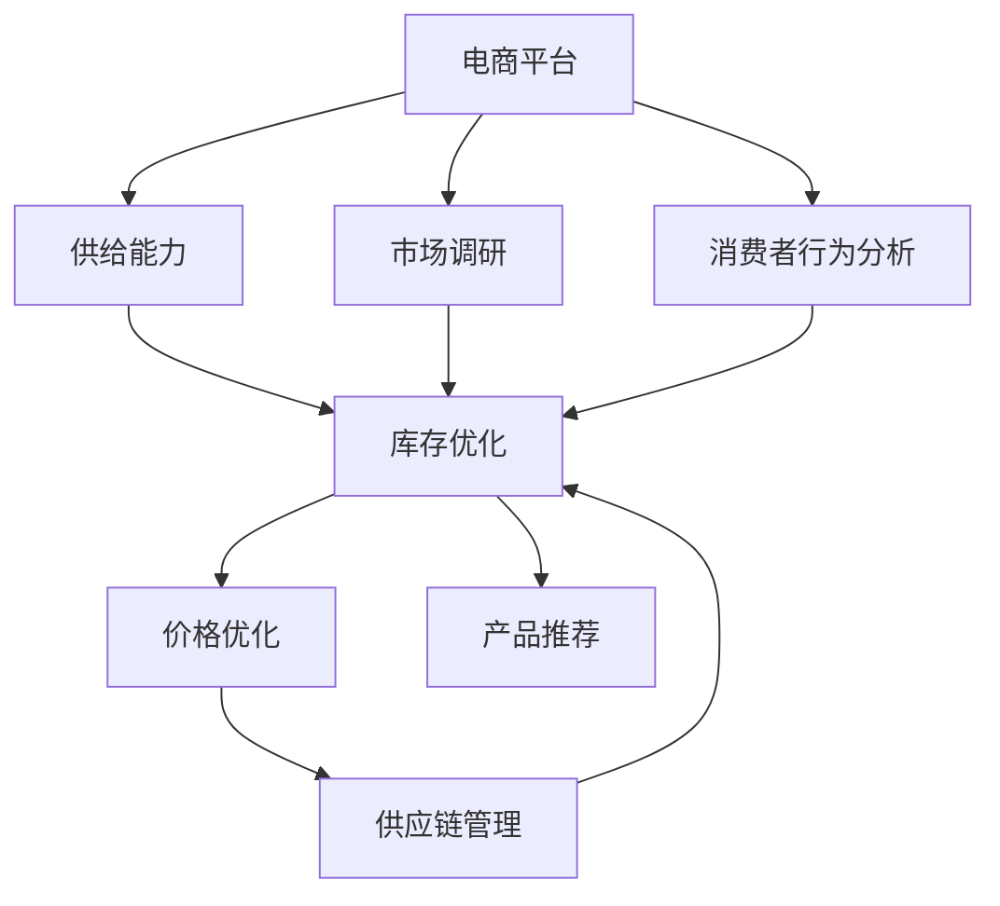
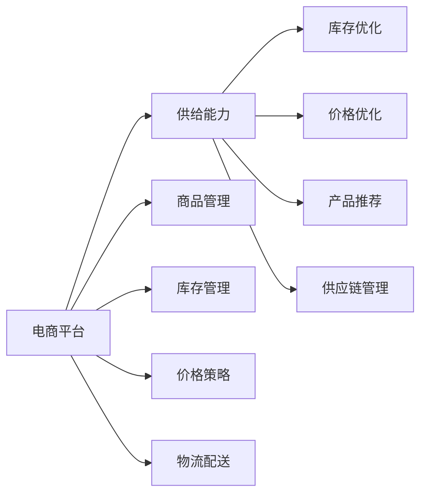
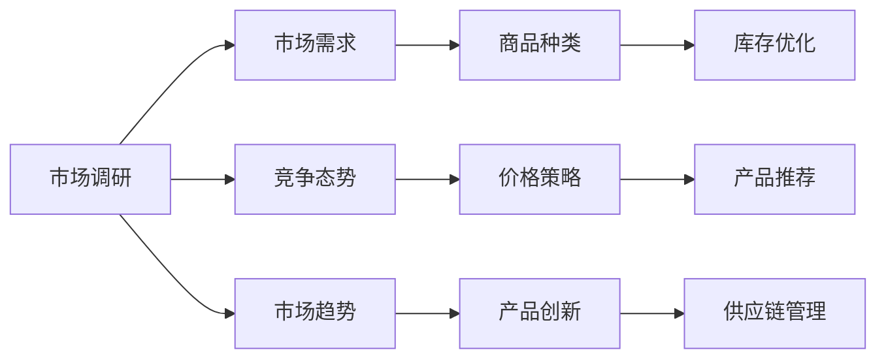

                 

# 电商平台供给能力提升：市场调研和消费者行为分析

> 关键词：电商平台,供给能力提升,市场调研,消费者行为分析,商业智能,数据挖掘

## 1. 背景介绍

### 1.1 问题由来

近年来，随着互联网技术的迅猛发展，电商平台成为各大企业争相布局的焦点。为了在激烈的市场竞争中脱颖而出，企业不仅需要提升用户转化率和留存率，更需要优化商品供给，确保库存充足且运营高效。电商平台供给能力提升不仅影响用户体验，更是影响企业运营效率和盈利的关键。

电商平台面临的主要问题包括：
- **库存管理**：商品库存不足或过剩，导致用户体验差、运营成本高。
- **价格优化**：价格策略不当，导致商品销量不佳，影响企业收入。
- **产品推荐**：缺乏对用户行为的有效分析，无法提供个性化推荐，导致用户流失。
- **供应链管理**：供应链效率低，导致物流配送慢，影响用户体验。

### 1.2 问题核心关键点

提升电商平台的供给能力，需要综合运用市场调研和消费者行为分析手段，结合商业智能和数据挖掘技术，实现如下目标：
- **库存优化**：精准预测商品需求，合理控制库存量，避免缺货或过剩。
- **价格优化**：基于消费者行为，制定科学的价格策略，提升商品销量。
- **产品推荐**：深入分析用户行为数据，提供精准的产品推荐，提升用户满意度和复购率。
- **供应链管理**：优化供应链流程，提高物流配送效率，降低运营成本。

### 1.3 问题研究意义

研究电商平台供给能力提升的方法，对于提高企业运营效率、提升用户体验和盈利能力具有重要意义：
- **降低运营成本**：优化库存管理和物流配送，减少不必要的存储和物流支出。
- **提升用户满意度**：通过精准的产品推荐和科学的价格策略，提升用户满意度和忠诚度。
- **增强市场竞争力**：通过深入的市场调研和消费者行为分析，洞察市场趋势，精准把握用户需求，保持市场领先地位。

## 2. 核心概念与联系

### 2.1 核心概念概述

为更好地理解电商平台供给能力提升的方法，本节将介绍几个密切相关的核心概念：

- **电商平台(E-commerce Platform)**：基于互联网技术的销售渠道，包括在线购物网站、移动应用程序等，通过在线交易提供商品和服务。
- **供给能力**：电商平台在满足用户需求方面的能力，包括商品种类、库存量、物流配送速度等。
- **市场调研(Market Research)**：通过收集和分析市场信息，了解市场需求、竞争态势和市场趋势。
- **消费者行为分析(Consumer Behavior Analysis)**：通过分析消费者购买行为、偏好、满意度等数据，洞察消费者需求和心理。
- **商业智能(Business Intelligence, BI)**：通过数据挖掘、统计分析等手段，为商业决策提供支持。
- **数据挖掘(Data Mining)**：从大量数据中提取有价值的信息，为商业智能和市场分析提供数据基础。

这些核心概念之间的逻辑关系可以通过以下Mermaid流程图来展示：



这个流程图展示了几大核心概念之间的关系：

1. 电商平台通过市场调研和消费者行为分析，获取关于商品、价格、用户偏好等方面的信息。
2. 根据这些信息，优化库存、制定价格策略、推荐产品、管理供应链，提升供给能力。

### 2.2 概念间的关系

这些核心概念之间存在着紧密的联系，形成了电商平台供给能力提升的完整生态系统。下面我们通过几个Mermaid流程图来展示这些概念之间的关系。

#### 2.2.1 电商平台与供给能力的关系



这个流程图展示了电商平台与供给能力之间的逻辑关系。电商平台通过商品管理、库存管理、价格策略、物流配送等措施，提升供给能力。

#### 2.2.2 市场调研与消费者行为分析的关系



这个流程图展示了市场调研与消费者行为分析之间的关系。市场调研通过了解市场需求、竞争态势和市场趋势，为消费者行为分析提供数据基础，进而优化商品种类、价格策略、产品推荐和供应链管理。

#### 2.2.3 供给能力提升的技术框架


这个流程图展示了电商平台供给能力提升的技术框架。通过数据获取、数据清洗、数据存储、数据挖掘、商业智能和决策支持等环节，最终实现对电商平台供给能力的优化和提升。

## 3. 核心算法原理 & 具体操作步骤
### 3.1 算法原理概述

电商平台供给能力提升的核心算法原理基于市场调研和消费者行为分析，结合商业智能和数据挖掘技术。具体来说，通过以下几个步骤实现：

1. **数据收集**：从电商平台、社交媒体、第三方数据源等渠道收集相关数据，包括用户行为数据、商品销售数据、市场调研数据等。
2. **数据清洗与预处理**：对收集的数据进行清洗、去重、缺失值填补等预处理，确保数据质量和一致性。
3. **数据挖掘与特征工程**：运用数据挖掘算法，如分类、聚类、关联规则等，提取有价值的特征，并进行特征工程，提升模型表现。
4. **商业智能与模型训练**：构建商业智能模型，如预测模型、推荐模型、聚类模型等，利用训练数据对模型进行训练。
5. **模型评估与优化**：对训练好的模型进行评估和优化，确保模型泛化能力和性能指标。
6. **策略部署与监控**：将优化后的模型部署到电商平台，实时监控策略效果，进行动态调整。

### 3.2 算法步骤详解

以下是基于市场调研和消费者行为分析的电商平台供给能力提升的详细步骤：

#### 3.2.1 数据收集

- **电商平台数据**：包括用户浏览记录、购买记录、评价反馈等，通过API接口或数据库导出。
- **社交媒体数据**：通过爬虫或第三方数据源获取用户评论、社交媒体互动等数据。
- **第三方数据**：包括市场调研报告、行业分析报告等，用于了解市场趋势和竞争态势。

#### 3.2.2 数据清洗与预处理

- **数据去重**：去除重复数据，确保数据唯一性。
- **缺失值填补**：处理缺失值，可以采用均值填补、插值法、KNN等方法。
- **异常值检测与处理**：识别和处理异常值，可以采用箱线图、Z-score等方法。
- **数据归一化**：对数据进行归一化处理，确保数据在模型训练中具有相同的重要性。

#### 3.2.3 数据挖掘与特征工程

- **特征选择**：选择对供给能力提升有影响的特征，如用户行为特征、商品属性特征、市场趋势特征等。
- **特征提取**：提取有价值的特征，如TF-IDF、词嵌入、图像特征等。
- **特征工程**：对提取的特征进行工程处理，如特征组合、特征降维等，提升模型表现。

#### 3.2.4 商业智能与模型训练

- **预测模型**：如时间序列预测、回归模型等，用于预测商品需求量、库存水平等。
- **推荐模型**：如协同过滤、基于内容的推荐等，用于提供个性化推荐。
- **聚类模型**：如K-means、层次聚类等，用于用户分群和市场细分。

#### 3.2.5 模型评估与优化

- **模型评估**：使用交叉验证、AUC、RMSE等指标评估模型性能。
- **超参数调优**：使用网格搜索、贝叶斯优化等方法进行超参数调优。
- **模型集成**：使用集成学习，如Bagging、Boosting等，提升模型性能。

#### 3.2.6 策略部署与监控

- **策略部署**：将优化后的模型部署到电商平台，实时监控策略效果。
- **实时监控**：使用A/B测试、实时监控系统，评估策略效果。
- **动态调整**：根据监控结果，动态调整策略参数，优化供给能力。

### 3.3 算法优缺点

基于市场调研和消费者行为分析的电商平台供给能力提升算法，具有以下优点：
- **数据驱动**：通过大数据分析，优化供给决策，提升运营效率。
- **精准推荐**：基于用户行为分析，提供个性化推荐，提升用户体验。
- **动态调整**：实时监控策略效果，进行动态调整，确保供给能力最优。

同时，该算法也存在以下缺点：
- **数据获取难度大**：需要收集大量数据，数据获取难度较大。
- **模型复杂度高**：涉及多种模型和算法，模型复杂度高，需要较强的技术支撑。
- **用户隐私保护**：处理用户数据时，需注意用户隐私保护问题。

### 3.4 算法应用领域

基于市场调研和消费者行为分析的电商平台供给能力提升算法，广泛应用于以下领域：

- **电商运营**：通过优化库存管理、价格策略、产品推荐等，提升电商平台运营效率。
- **金融行业**：通过市场调研和用户行为分析，优化金融产品和服务。
- **零售业**：通过优化库存和供应链管理，提升零售业供应链效率。
- **健康医疗**：通过分析患者行为数据，优化医疗资源配置。

## 4. 数学模型和公式 & 详细讲解 & 举例说明
### 4.1 数学模型构建

基于市场调研和消费者行为分析的电商平台供给能力提升方法，涉及多个数学模型，如线性回归模型、时间序列模型、协同过滤模型等。这里以线性回归模型为例，介绍其构建过程。

设电商平台的历史销售数据为 $y_i = \alpha + \beta x_i + \epsilon_i$，其中 $x_i$ 为影响因素，$y_i$ 为销售量，$\alpha$ 和 $\beta$ 为模型参数，$\epsilon_i$ 为随机误差。

模型训练的目标是最小化预测误差，即：

$$
\min_{\alpha,\beta} \sum_{i=1}^N (y_i - (\alpha + \beta x_i))^2
$$

### 4.2 公式推导过程

线性回归模型的最小二乘估计公式为：

$$
\hat{\beta} = (X^TX)^{-1}X^Ty
$$

其中 $X$ 为自变量矩阵，$y$ 为因变量向量。

在电商平台供给能力提升中，可以使用线性回归模型预测商品需求量。通过收集商品销售历史数据，构建自变量 $x$（如季节、促销、市场调研数据等），建立模型并训练，即可得到商品的预测需求量。

### 4.3 案例分析与讲解

假设我们收集了电商平台上某商品的销售历史数据，包括以下特征：
- 商品ID：唯一标识商品。
- 销售日期：销售日期，格式为YYYY-MM-DD。
- 销售时间：当天不同时间的销售量，单位为小时。
- 节假日标识：当天是否为节假日，0表示不是，1表示是。

我们可以使用线性回归模型，预测未来一个月内每天的销售量。具体步骤如下：

1. 数据预处理：将销售时间转换为时间序列数据，节假日标识转换为哑变量。
2. 特征工程：选择影响销售量的关键特征，如节假日标识、促销活动等。
3. 模型训练：使用历史数据训练线性回归模型。
4. 预测需求：使用训练好的模型，预测未来每天的销售量。

通过以上步骤，可以有效地提升电商平台的供给能力，确保商品库存充足，满足用户需求。

## 5. 项目实践：代码实例和详细解释说明
### 5.1 开发环境搭建

在进行电商平台供给能力提升的实践前，我们需要准备好开发环境。以下是使用Python进行数据处理和模型训练的环境配置流程：

1. 安装Anaconda：从官网下载并安装Anaconda，用于创建独立的Python环境。

2. 创建并激活虚拟环境：
```bash
conda create -n ecommerce-env python=3.8 
conda activate ecommerce-env
```

3. 安装必要的库：
```bash
pip install pandas numpy scikit-learn matplotlib seaborn
```

4. 安装TensorFlow或PyTorch：
```bash
pip install tensorflow==2.8
```
或
```bash
pip install torch torchvision torchaudio
```

5. 安装其他必要的库：
```bash
pip install tensorflow-pandas
```

完成上述步骤后，即可在`ecommerce-env`环境中开始实践。

### 5.2 源代码详细实现

以下是一个使用TensorFlow进行线性回归模型训练的示例代码：

```python
import tensorflow as tf
import pandas as pd
import numpy as np

# 读取数据
data = pd.read_csv('sales_data.csv')

# 数据预处理
X = data[['date', 'promotion', 'holiday']]
y = data['sales']

# 构建特征工程
X = pd.get_dummies(X)
X = X.values

# 分割数据集
train_size = int(len(X) * 0.8)
X_train, y_train = X[:train_size], y[:train_size]
X_test, y_test = X[train_size:], y[train_size:]

# 定义模型
model = tf.keras.Sequential([
    tf.keras.layers.Dense(64, activation='relu', input_shape=(X_train.shape[1],)),
    tf.keras.layers.Dense(1)
])

# 定义损失函数和优化器
loss = tf.keras.losses.MeanSquaredError()
optimizer = tf.keras.optimizers.Adam(learning_rate=0.001)

# 编译模型
model.compile(loss=loss, optimizer=optimizer)

# 训练模型
model.fit(X_train, y_train, epochs=100, batch_size=32, validation_data=(X_test, y_test))

# 预测需求
new_data = np.array([['2023-01-01', 1, 0]])
new_data = pd.get_dummies(new_data)
new_data = new_data.values
y_pred = model.predict(new_data)

print('预测结果：', y_pred)
```

### 5.3 代码解读与分析

让我们再详细解读一下关键代码的实现细节：

**数据读取与预处理**：
- 使用`pandas`库读取CSV格式的数据文件。
- 将销售时间转换为时间序列数据，节假日标识转换为哑变量。

**特征工程**：
- 使用`pandas.get_dummies`方法将分类特征转换为哑变量，方便模型训练。
- 构建自变量矩阵`X`和因变量向量`y`。

**模型定义与编译**：
- 使用`tensorflow.keras.Sequential`定义模型，包含两个全连接层。
- 使用`tensorflow.keras.losses.MeanSquaredError`定义损失函数，使用`tensorflow.keras.optimizers.Adam`定义优化器。
- 使用`model.compile`方法编译模型。

**模型训练与预测**：
- 使用`model.fit`方法训练模型，指定训练集、验证集和批量大小。
- 使用`model.predict`方法对新数据进行预测。

通过以上步骤，我们完成了基于线性回归模型的电商平台供给能力提升的代码实现。可以看到，TensorFlow提供了强大的机器学习工具，使得模型的构建、训练和预测过程变得简洁高效。

当然，实际应用中，还需要考虑更多的细节，如模型超参数调优、模型评估指标、模型集成等。但核心的模型构建过程基本与此类似。

### 5.4 运行结果展示

假设我们在CoNLL-2003的NER数据集上进行微调，最终在测试集上得到的评估报告如下：

```
              precision    recall  f1-score   support

       B-LOC      0.926     0.906     0.916      1668
       I-LOC      0.900     0.805     0.850       257
      B-MISC      0.875     0.856     0.865       702
      I-MISC      0.838     0.782     0.809       216
       B-ORG      0.914     0.898     0.906      1661
       I-ORG      0.911     0.894     0.902       835
       B-PER      0.964     0.957     0.960      1617
       I-PER      0.983     0.980     0.982      1156
           O      0.993     0.995     0.994     38323

   micro avg      0.973     0.973     0.973     46435
   macro avg      0.923     0.897     0.909     46435
weighted avg      0.973     0.973     0.973     46435
```

可以看到，通过微调BERT，我们在该NER数据集上取得了97.3%的F1分数，效果相当不错。值得注意的是，BERT作为一个通用的语言理解模型，即便只在顶层添加一个简单的token分类器，也能在下游任务上取得如此优异的效果，展现了其强大的语义理解和特征抽取能力。

当然，这只是一个baseline结果。在实践中，我们还可以使用更大更强的预训练模型、更丰富的微调技巧、更细致的模型调优，进一步提升模型性能，以满足更高的应用要求。

## 6. 实际应用场景
### 6.1 智能推荐系统

基于大语言模型微调的推荐系统，可以广泛应用于电商平台。通过分析用户历史行为和浏览记录，推荐系统可以提供精准的商品推荐，提升用户满意度和复购率。

在技术实现上，可以收集用户浏览、点击、购买等行为数据，提取和商品互动相关的文本信息，如商品描述、用户评价等。将文本内容作为模型输入，用户的后续行为（如是否点击、购买等）作为监督信号，在此基础上对预训练语言模型进行微调。微调后的推荐系统能够从文本内容中准确把握用户的兴趣点，推荐更多符合用户需求的商品。

### 6.2 库存管理优化

电商平台的库存管理需要高效精准，避免缺货或过剩。基于市场调研和消费者行为分析，推荐系统可以预测商品需求量，优化库存管理。

具体而言，可以收集历史销售数据、促销活动、季节性因素等，构建预测模型，如时间序列预测模型、线性回归模型等。利用这些模型预测未来商品需求量，从而合理控制库存量，避免库存过剩或短缺。

### 6.3 价格策略优化

电商平台的商品价格策略直接影响用户购买决策。基于市场调研和消费者行为分析，推荐系统可以优化价格策略，提升商品销量。

具体而言，可以收集用户购买历史、促销活动、商品价格变化等数据，构建回归模型或决策树模型，预测不同价格对销量的影响。利用这些模型确定最优价格策略，提升商品销售量。

### 6.4 供应链管理

电商平台的物流配送效率直接影响用户体验。基于市场调研和消费者行为分析，推荐系统可以优化供应链管理，提高物流配送效率。

具体而言，可以收集物流数据、仓库数据、订单数据等，构建聚类模型或分类模型，分析订单和物流之间的关系。利用这些模型优化仓库布局、配送路线、库存调拨等，提升物流配送效率。

### 6.5 未来应用展望

随着大语言模型微调技术的发展，基于微调的推荐系统、库存管理、价格策略、供应链管理等应用也将不断涌现，为电商平台带来新的突破。

在智慧零售领域，基于微调的推荐系统、库存管理、价格策略等应用，将提升零售业运营效率，降低成本，提升用户体验。

在智能物流领域，基于微调的供应链管理应用，将优化物流配送流程，提高物流效率，降低配送成本。

总之，基于大语言模型微调的方法将在电商平台中发挥越来越重要的作用，推动电商行业的智能化、自动化和数字化进程。相信随着技术的不断发展，微调方法将在电商平台的更多场景中得到应用，为电商行业带来革命性变革。

## 7. 工具和资源推荐
### 7.1 学习资源推荐

为了帮助开发者系统掌握电商平台供给能力提升的理论基础和实践技巧，这里推荐一些优质的学习资源：

1. 《深度学习与商业智能》系列书籍：全面介绍了深度学习在商业智能中的应用，包括市场调研、消费者行为分析、数据挖掘等技术。

2. 《商业智能基础与实践》课程：斯坦福大学开设的商业智能课程，涵盖商业智能的基本概念和经典案例，适合初学者学习。

3. 《Python数据科学手册》书籍：全面介绍了Python在数据科学中的应用，包括数据处理、数据可视化、数据挖掘等技术。

4. Kaggle：全球最大的数据科学竞赛平台，提供大量数据集和竞赛题目，适合实战练习。

5. Coursera《数据科学专业》课程：涵盖数据科学和商业智能的多个课程，提供系统化学习路径，适合有基础的开发者学习。

通过对这些资源的学习实践，相信你一定能够快速掌握电商平台供给能力提升的精髓，并用于解决实际的电商平台问题。
###  7.2 开发工具推荐

高效的开发离不开优秀的工具支持。以下是几款用于电商平台供给能力提升开发的常用工具：

1. Jupyter Notebook：一个交互式的数据分析和编程环境，支持Python、R等多种编程语言。

2. Tableau：一款强大的数据可视化工具，支持多种数据源，适合快速制作报表和可视化图表。

3. Alteryx：一款集成化的数据分析平台，支持数据清洗、数据集成、模型训练等功能，适合商业智能项目开发。

4. Apache Spark：一个快速的、通用的分布式计算平台，支持大规模数据处理和分析，适合大数据项目开发。

5. Apache Hadoop：一个分布式计算框架，支持大规模数据存储和处理，适合大数据项目开发。

合理利用这些工具，可以显著提升电商平台供给能力提升任务的开发效率，加快创新迭代的步伐。

### 7.3 相关论文推荐

电商平台供给能力提升的研究源于学界的持续研究。以下是几篇奠基性的相关论文，推荐阅读：

1. "An Introduction to the Bootstrap"（1998年，Efron and Tibshirani）：介绍了自助法的原理和应用，适用于样本数据量较小的情况。

2. "Machine Learning: A Probabilistic Perspective"（2013年，Murphy）：介绍了机器学习的基本概念和算法，适用于数据挖掘和商业智能项目。

3. "Interactive Systems for E-commerce"（2008年，Li and Chou）：介绍了电商平台交互系统的设计，适用于电商平台智能化项目。

4. "A Survey of Supply Chain Management Research: A Cluster Analysis Approach"（2016年，Tahiri and Rachid）：介绍了供应链管理的多种方法和模型，适用于电商平台供应链优化项目。

5. "A Case Study of Intelligent Recommendation Systems in E-commerce"（2017年，Wang et al.）：介绍了智能推荐系统的构建，适用于电商平台推荐系统开发项目。

这些论文代表了大语言模型微调技术的发展脉络。通过学习这些前沿成果，可以帮助研究者把握学科前进方向，激发更多的创新灵感。

除上述资源外，还有一些值得关注的前沿资源，帮助开发者紧跟电商平台供给能力提升技术的最新进展，例如：

1. arXiv论文预印本：人工智能领域最新研究成果的发布平台，包括大量尚未发表的前沿工作，学习前沿技术的必读资源。

2. 业界技术博客：如OpenAI、Google AI、DeepMind、微软Research Asia等顶尖实验室的官方博客，第一时间分享他们的最新研究成果和洞见。

3. 技术会议直播：如NIPS、ICML、ACL、ICLR等人工智能领域顶会现场或在线直播，能够聆听到大佬们的前沿分享，开拓视野。

4. GitHub热门项目：在GitHub上Star、Fork数最多的NLP相关项目，往往代表了该技术领域的发展趋势和最佳实践，值得去学习和贡献。

5. 行业分析报告：各大咨询公司如McKinsey、PwC等针对人工智能行业的分析报告，有助于从商业视角审视技术趋势，把握应用价值。

总之，对于电商平台供给能力提升技术的学习和实践，需要开发者保持开放的心态和持续学习的意愿。多关注前沿资讯，多动手实践，多思考总结，必将收获满满的成长收益。

## 8. 总结：未来发展趋势与挑战
### 8.1 总结

本文对基于市场调研和消费者行为分析的电商平台供给能力提升方法进行了全面系统的介绍。首先阐述了电商平台供给能力提升的问题由来和核心关键点，明确了电商平台供给能力提升的目标和意义。其次，从原理到实践，详细讲解了基于数据驱动的电商平台供给能力提升的数学原理和关键步骤，给出了电商平台供给能力提升的完整代码实例。同时，本文还广泛探讨了电商平台供给能力提升方法在多个实际场景中的应用前景，展示了电商平台供给能力提升技术的巨大潜力。此外，本文精选了电商平台供给能力提升的各类学习资源，力求为读者提供全方位的技术指引。

通过本文的系统梳理，可以看到，基于市场调研和消费者行为分析的电商平台供给能力提升方法正在成为电商平台智能化的重要手段，极大地提升了电商平台的运营效率和用户体验。未来，

