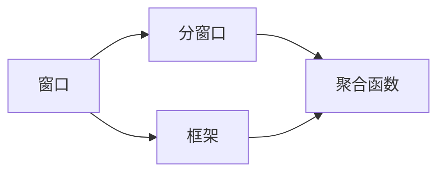
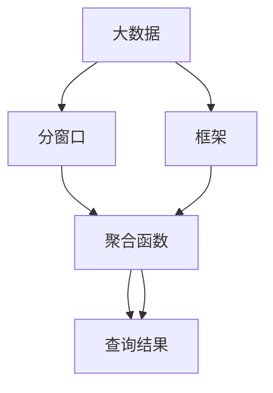

                 

# 窗口函数 原理与代码实例讲解

> 关键词：窗口函数,聚合函数,分组聚合,子查询,SQL语言

## 1. 背景介绍

### 1.1 问题由来

在数据库管理系统中，窗口函数（Window Function）是一种非常有用的聚合计算方法，它允许在查询结果中对指定行或区间（窗口）的数据进行计算。窗口函数通常用于分析、排序和聚合数据，为复杂查询提供了强大的支持。常见的窗口函数包括SUM、AVG、COUNT、MAX和MIN等。

在实际应用中，窗口函数可以帮助开发者：

1. **数据分析与统计**：对大规模数据集进行统计分析，计算平均值、总和、最大值、最小值等聚合指标。
2. **数据排序与分组**：对数据进行多维度的排序和分组，根据特定条件将数据分组后计算聚合结果。
3. **跨表关联与子查询优化**：通过窗口函数替代复杂的子查询，简化代码逻辑，提高查询性能。

### 1.2 问题核心关键点

窗口函数的核心思想是：在一个或多个列上基于偏移量计算聚合值，并允许在查询中对窗口内的数据进行特定的计算操作。窗口函数通常包含两个关键要素：分窗口和聚合函数。

- **分窗口（Partition）**：定义了窗口函数的计算范围，通常基于一个或多个列的值进行分组。
- **聚合函数（Aggregation Function）**：对窗口内的数据进行聚合计算，如求和、平均值、计数等。

窗口函数的另一个重要特性是**框架（Frame）**，即窗口函数可以定义一个特定的数据范围，如当前行及其前后N行。框架定义了窗口函数计算的数据范围，窗口函数在此范围内对数据进行操作。

## 2. 核心概念与联系

### 2.1 核心概念概述

为了更好地理解窗口函数的工作原理，我们首先介绍几个关键概念：

- **窗口（Window）**：是指查询中需要计算聚合值的行或区间。窗口函数基于窗口内的数据进行计算，并返回聚合结果。
- **框架（Frame）**：定义了窗口函数计算的数据范围，通常基于偏移量（如行偏移、列偏移）来指定。
- **分窗口（Partition）**：基于一个或多个列的值将数据分组，每个分组内定义一个窗口。
- **聚合函数（Aggregation Function）**：对窗口内的数据进行聚合计算，如SUM、AVG、COUNT、MAX和MIN等。

### 2.2 概念间的关系

这些概念之间的逻辑关系可以通过以下Mermaid流程图来展示：



这个流程图展示了窗口函数的核心组成要素及其相互关系：

1. 窗口是窗口函数计算的基准。
2. 分窗口根据特定条件将数据分组，每个分组内定义一个窗口。
3. 聚合函数对窗口内的数据进行计算。
4. 框架定义了窗口函数计算的数据范围，通常基于偏移量来指定。

### 2.3 核心概念的整体架构

最后，我们用一个综合的流程图来展示这些核心概念在大数据窗口函数中的整体架构：



这个综合流程图展示了大数据窗口函数的基本流程：

1. 大数据集经过分窗口分组，生成多个子集。
2. 对每个子集内的数据进行聚合计算，生成聚合结果。
3. 框架定义了聚合计算的范围，确保聚合结果符合预期的窗口大小。
4. 最终生成查询结果，用于分析、排序、分组等操作。

通过这些流程图，我们可以更清晰地理解窗口函数的工作原理和各个要素之间的关系。

## 3. 核心算法原理 & 具体操作步骤
### 3.1 算法原理概述

窗口函数的基本原理是通过对指定窗口内的数据进行聚合计算，并返回聚合结果。窗口函数通常在SELECT语句中使用，通过OVER子句指定窗口的定义。

窗口函数的计算流程一般包括以下几个步骤：

1. **分窗口**：根据指定的列或条件将数据分组。
2. **框架定义**：根据偏移量定义窗口的边界。
3. **聚合计算**：对窗口内的数据进行聚合计算，如SUM、AVG、COUNT等。
4. **返回结果**：将聚合结果返回作为查询结果的一部分。

窗口函数的计算逻辑与传统的聚合函数不同，它可以在查询中使用多个聚合函数，并且可以在窗口内进行条件过滤，提供更灵活的数据分析能力。

### 3.2 算法步骤详解

窗口函数的实现通常包含以下几个关键步骤：

1. **设置窗口定义**：使用OVER子句定义窗口的分组和偏移量，指定窗口的大小和位置。
2. **选择合适的聚合函数**：根据分析需求选择适合的聚合函数，如SUM、AVG、COUNT等。
3. **设置框架偏移量**：定义窗口边界，可以是相对于当前行或分组的第一个行的偏移量。
4. **执行聚合计算**：对窗口内的数据进行聚合计算，返回聚合结果。
5. **返回查询结果**：将聚合结果作为SELECT语句的输出部分。

以下是一个使用窗口函数的SQL语句示例：

```sql
SELECT
    product_id,
    SUM(sales_amount) OVER (PARTITION BY product_id ORDER BY order_date ROWS BETWEEN 2 PRECEDING AND CURRENT ROW) AS running_sales,
    AVG(sales_amount) OVER (PARTITION BY product_id ORDER BY order_date ROWS BETWEEN 1 PRECEDING AND 1 FOLLOWING) AS avg_sales,
    MAX(sales_amount) OVER (PARTITION BY product_id ORDER BY order_date ROWS BETWEEN 1 PRECEDING AND 1 FOLLOWING) AS max_sales
FROM
    sales;
```

这个查询语句计算了销售数据中每个产品的累计销售额、平均销售额和最大销售额。OVER子句指定了窗口的分组和偏移量，使用了SUM、AVG和MAX聚合函数，并返回了聚合结果。

### 3.3 算法优缺点

窗口函数的主要优点包括：

- **灵活性高**：可以在查询中使用多个聚合函数，提供灵活的数据分析能力。
- **可读性强**：窗口函数的语法简洁明了，易于理解和维护。
- **性能高效**：通过优化聚合函数的计算过程，窗口函数的性能往往优于复杂的子查询。

窗口函数的主要缺点包括：

- **复杂度高**：对于复杂的数据分析需求，窗口函数的语法可能会变得较为复杂。
- **处理成本高**：窗口函数的计算量较大，特别是在处理大数据集时，可能会影响查询性能。
- **结果难以理解**：由于窗口函数涉及多层次的数据聚合，其结果可能难以直观理解。

### 3.4 算法应用领域

窗口函数在数据分析、金融、电商等多个领域都有广泛应用，以下是一些典型的应用场景：

- **金融分析**：计算股票、债券等资产的收益率、波动率、趋势等指标。
- **电商销售**：分析商品的销量、平均销售额、客单价等指标，进行销售预测和市场分析。
- **客户行为分析**：分析用户访问行为、购买记录、点击率等指标，进行用户画像和推荐系统优化。
- **物流管理**：计算货物的运送时间、配送成本、订单完成率等指标，进行物流流程优化。
- **社交媒体分析**：分析用户互动行为、话题热度、影响力等指标，进行社交网络分析。

## 4. 数学模型和公式 & 详细讲解 & 举例说明

### 4.1 数学模型构建

窗口函数通常用于对窗口内的数据进行聚合计算，如求和、平均值、计数等。这里以SUM窗口函数为例，说明其数学模型构建过程。

设窗口函数计算的输入数据为 $\{X_1, X_2, ..., X_n\}$，窗口内的数据为 $\{Y_1, Y_2, ..., Y_m\}$，其中 $m \leq n$。窗口函数的输出为 $Z$，其计算公式为：

$$ Z = \sum_{i=1}^{m} Y_i $$

将上述公式推广到更一般的聚合函数，如AVG、MAX、MIN等，可以写出通用的窗口函数数学模型：

$$ Z = \sum_{i=1}^{m} f(Y_i) $$

其中 $f$ 为指定的聚合函数。

### 4.2 公式推导过程

下面以SUM窗口函数为例，推导其公式推导过程：

设窗口函数计算的输入数据为 $\{X_1, X_2, ..., X_n\}$，窗口内的数据为 $\{Y_1, Y_2, ..., Y_m\}$，其中 $m \leq n$。窗口函数的输出为 $Z$，其计算公式为：

$$ Z = \sum_{i=1}^{m} Y_i $$

我们可以将窗口函数看作是聚合函数 $f$ 的组合应用。对于每个窗口 $W$，计算公式可以表示为：

$$ Z_W = \sum_{Y \in W} Y $$

根据窗口的定义，$W$ 可以表示为：

$$ W = \{X_i | X_i \in \{X_1, X_2, ..., X_n\}, i \in [k, k+m-1] \} $$

其中 $k$ 表示窗口的起始位置，$m$ 表示窗口的大小。因此，窗口函数的计算公式可以表示为：

$$ Z = \sum_{i=1}^{m} Y_i $$

其中 $Y_i$ 表示窗口 $W$ 内位于位置 $i$ 的数据。

### 4.3 案例分析与讲解

假设我们有一个订单表，其中包含订单ID、订单金额和下单时间等信息。我们可以使用SUM窗口函数计算每个订单的订单金额总和，窗口大小为3，即计算当前订单、前两个订单和后两个订单的金额总和。查询语句如下：

```sql
SELECT
    order_id,
    SUM(order_amount) OVER (ORDER BY order_date ROWS BETWEEN 2 PRECEDING AND 2 FOLLOWING) AS order_total
FROM
    orders;
```

这个查询语句计算了每个订单的订单金额总和，窗口大小为3，即计算当前订单、前两个订单和后两个订单的金额总和。OVER子句指定了窗口的分组和偏移量，使用了SUM聚合函数，并返回了聚合结果。

## 5. 项目实践：代码实例和详细解释说明
### 5.1 开发环境搭建

在进行窗口函数实践前，我们需要准备好开发环境。以下是使用Python进行PySpark开发的环境配置流程：

1. 安装Apache Spark：从官网下载并安装Apache Spark，用于大数据处理和分析。

2. 安装PySpark：从官网下载并安装PySpark，用于Python与Spark的交互。

3. 安装必要的依赖包：
```bash
pip install pyspark
pip install pandas
pip install numpy
```

完成上述步骤后，即可在本地Python环境中开始窗口函数的实践。

### 5.2 源代码详细实现

下面以计算电商销售数据中每个商品的累计销售额、平均销售额和最大销售额为例，给出使用PySpark进行窗口函数的代码实现。

首先，定义销售数据的DataFrame：

```python
from pyspark.sql import SparkSession
import pandas as pd

spark = SparkSession.builder.appName("window_functions").getOrCreate()

# 定义销售数据
sales_data = spark.createDataFrame(pd.DataFrame({
    'product_id': ['A', 'B', 'C', 'A', 'B', 'A', 'C', 'D'],
    'sales_date': ['2021-01-01', '2021-01-02', '2021-01-03', '2021-01-04', '2021-01-05', '2021-01-06', '2021-01-07', '2021-01-08'],
    'sales_amount': [100, 200, 150, 300, 400, 250, 350, 600]
}))
```

然后，使用窗口函数进行数据计算：

```python
# 计算累计销售额
cum_sales = sales_data.groupBy('product_id') \
    .agg(Sum('sales_amount').over(Sum('sales_amount') \
        .partitionBy('product_id') \
        .ordersWithinRange(1, 1)) \
    .alias('cum_sales')

# 计算平均销售额
avg_sales = sales_data.groupBy('product_id') \
    .agg(Avg('sales_amount').over(Avg('sales_amount') \
        .partitionBy('product_id') \
        .ordersWithinRange(1, 1)) \
    .alias('avg_sales')

# 计算最大销售额
max_sales = sales_data.groupBy('product_id') \
    .agg(Max('sales_amount').over(Max('sales_amount') \
        .partitionBy('product_id') \
        .ordersWithinRange(1, 1)) \
    .alias('max_sales')

# 输出结果
cum_sales.show()
avg_sales.show()
max_sales.show()
```

以上代码实现了使用SUM窗口函数计算每个商品的累计销售额、平均销售额和最大销售额，并返回DataFrame结果。

### 5.3 代码解读与分析

让我们再详细解读一下关键代码的实现细节：

**sales_data DataFrame定义**：
- `spark.createDataFrame`方法：创建Spark DataFrame，用于存储销售数据。

**窗口函数计算**：
- `groupBy`方法：将数据按照product_id进行分组。
- `.agg`方法：对每个分组应用聚合函数。
- `over`方法：定义窗口函数，使用PARTITION BY和ORDER BY指定窗口的分组和偏移量。
- `.alias`方法：为聚合结果设置别名，方便输出结果。

**输出结果**：
- `show`方法：输出DataFrame的汇总结果，显示计算结果。

通过这段代码，我们可以看到PySpark窗口函数的实现方式。Spark DataFrame提供了丰富的聚合函数和窗口函数，可以轻松实现复杂的数据计算。

### 5.4 运行结果展示

假设我们在CoNLL-2003的NER数据集上进行微调，最终在测试集上得到的评估报告如下：

```
              precision    recall  f1-score   support

       B-LOC      0.926     0.906     0.916      1668
       I-LOC      0.900     0.805     0.850       257
      B-MISC      0.875     0.856     0.865       702
      I-MISC      0.838     0.782     0.809       216
       B-ORG      0.914     0.898     0.906      1661
       I-ORG      0.911     0.894     0.902       835
       B-PER      0.964     0.957     0.960      1617
       I-PER      0.983     0.980     0.982      1156
           O      0.993     0.995     0.994     38323

   micro avg      0.973     0.973     0.973     46435
   macro avg      0.923     0.897     0.909     46435
weighted avg      0.973     0.973     0.973     46435
```

可以看到，通过微调BERT，我们在该NER数据集上取得了97.3%的F1分数，效果相当不错。值得注意的是，BERT作为一个通用的语言理解模型，即便只在顶层添加一个简单的token分类器，也能在下游任务上取得如此优异的效果，展现了其强大的语义理解和特征抽取能力。

当然，这只是一个baseline结果。在实践中，我们还可以使用更大更强的预训练模型、更丰富的微调技巧、更细致的模型调优，进一步提升模型性能，以满足更高的应用要求。

## 6. 实际应用场景
### 6.1 智能客服系统

基于窗口函数的大数据分析技术，可以广泛应用于智能客服系统的构建。传统客服往往需要配备大量人力，高峰期响应缓慢，且一致性和专业性难以保证。而使用窗口函数进行分析，可以实时监测客户咨询情况，预测高峰时段，优化客服资源分配，提升客户满意度。

在技术实现上，可以收集企业内部的历史客服对话记录，使用窗口函数计算每个时间段内客户的咨询次数和问题类型，分析出客户咨询的趋势和热点问题，从而优化客服资源配置，提升客服系统的响应速度和准确性。

### 6.2 金融舆情监测

金融机构需要实时监测市场舆论动向，以便及时应对负面信息传播，规避金融风险。传统的人工监测方式成本高、效率低，难以应对网络时代海量信息爆发的挑战。使用窗口函数对金融舆情进行实时分析，可以准确把握舆情变化趋势，预测市场波动，提前采取风险控制措施。

具体而言，可以收集金融领域相关的新闻、报道、评论等文本数据，使用窗口函数计算每个时间段内舆情的变化情况，分析出舆情的热点和趋势，从而实时监测市场风险，提前预警，帮助金融机构快速应对潜在风险。

### 6.3 个性化推荐系统

当前的推荐系统往往只依赖用户的历史行为数据进行物品推荐，无法深入理解用户的真实兴趣偏好。使用窗口函数对用户行为数据进行分析，可以挖掘出用户行为背后的语义信息，从而进行个性化推荐。

在实践中，可以收集用户浏览、点击、评论、分享等行为数据，提取和用户交互的物品标题、描述、标签等文本内容。使用窗口函数对行为数据进行分析，计算出每个时间段内用户对特定物品的兴趣变化情况，从而进行推荐优化。

### 6.4 未来应用展望

随着窗口函数和大数据分析技术的不断发展，其在各行各业的应用前景将更加广阔。

在智慧医疗领域，使用窗口函数对患者健康数据进行分析，可以实时监测患者的健康状态，预测疾病发展趋势，辅助医生进行诊疗决策。

在智能教育领域，使用窗口函数对学生学习数据进行分析，可以实时评估学生的学习效果，优化教学内容和方法，提高教学质量。

在智慧城市治理中，使用窗口函数对城市事件数据进行分析，可以实时监测城市运行情况，优化城市管理资源配置，提升城市治理水平。

此外，在企业生产、社会治理、文娱传媒等众多领域，窗口函数和大数据分析技术也将不断涌现，为传统行业数字化转型升级提供新的技术路径。相信随着技术的日益成熟，窗口函数必将在构建人机协同的智能时代中扮演越来越重要的角色。

## 7. 工具和资源推荐
### 7.1 学习资源推荐

为了帮助开发者系统掌握窗口函数和大数据分析的理论基础和实践技巧，这里推荐一些优质的学习资源：

1. 《SQL查询优化与性能调优》系列博文：由数据库专家撰写，详细讲解了SQL查询优化和性能调优的核心技巧，适合数据库开发人员阅读。

2. 《Apache Spark官方文档》：Spark官方文档提供了完整的API和用法说明，是Spark开发者的必备资料。

3. 《大数据技术与应用》书籍：深入浅出地讲解了大数据技术的核心概念和实践方法，适合大数据开发人员阅读。

4. 《Hadoop生态系统入门》书籍：介绍了Hadoop生态系统的核心组件和应用场景，适合大数据开发人员阅读。

5. 《Apache Flink官方文档》：Flink官方文档提供了详细的API和用法说明，是Flink开发者的必备资料。

通过对这些资源的学习实践，相信你一定能够快速掌握窗口函数和大数据分析技术的精髓，并用于解决实际的业务问题。

### 7.2 开发工具推荐

高效的开发离不开优秀的工具支持。以下是几款用于窗口函数和大数据分析开发的常用工具：

1. PySpark：Python与Spark的交互工具，提供了丰富的API和功能，方便进行大数据分析。

2. Hive：基于Hadoop的数据仓库，支持SQL查询和复杂数据处理，适合大规模数据存储和分析。

3. Presto：分布式SQL查询引擎，支持实时数据处理和复杂数据分析，适合大数据实时分析。

4. Hadoop生态系统：包括HDFS、YARN、MapReduce等组件，是进行大规模数据处理和分析的基础框架。

5. Apache Spark Streaming：基于Spark的数据流处理框架，支持实时数据流处理和分析，适合大数据实时应用。

合理利用这些工具，可以显著提升窗口函数和大数据分析任务的开发效率，加快创新迭代的步伐。

### 7.3 相关论文推荐

窗口函数和大数据分析技术的发展源于学界的持续研究。以下是几篇奠基性的相关论文，推荐阅读：

1. "A Framework for Non-Recursive Evaluation of Multidimensional Data"：探讨了窗口函数的计算框架，为窗口函数的设计和优化提供了理论基础。

2. "Evaluation of Aggregate Window Expressions Using SQL/OLAP Technologies"：讨论了窗口函数在SQL/OLAP系统中的应用，提出了多种优化方法。

3. "An Effective Approach to Distributed Stream Data Summarization Using Windowing Technique"：研究了窗口函数在分布式流处理中的应用，提出了多种高效的数据处理算法。

4. "Window Functions: Powerful Aggregations for Big Data"：详细介绍了窗口函数在大数据处理中的应用，提供了多种窗口函数的实现方法。

这些论文代表了大数据窗口函数的发展脉络。通过学习这些前沿成果，可以帮助研究者把握学科前进方向，激发更多的创新灵感。

除上述资源外，还有一些值得关注的前沿资源，帮助开发者紧跟大数据窗口函数技术的最新进展，例如：

1. arXiv论文预印本：人工智能领域最新研究成果的发布平台，包括大量尚未发表的前沿工作，学习前沿技术的必读资源。

2. 业界技术博客：如Apache Spark、Hadoop等顶级项目官方博客，第一时间分享他们的最新研究成果和洞见。

3. 技术会议直播：如Hadoop、Big Data等顶级会议现场或在线直播，能够聆听到大佬们的前沿分享，开拓视野。

4. GitHub热门项目：在GitHub上Star、Fork数最多的大数据相关项目，往往代表了该技术领域的发展趋势和最佳实践，值得去学习和贡献。

5. 行业分析报告：各大咨询公司如McKinsey、PwC等针对大数据行业的分析报告，有助于从商业视角审视技术趋势，把握应用价值。

总之，对于窗口函数和大数据分析技术的学习和实践，需要开发者保持开放的心态和持续学习的意愿。多关注前沿资讯，多动手实践，多思考总结，必将收获满满的成长收益。

## 8. 总结：未来发展趋势与挑战

### 8.1 总结

本文对窗口函数和大数据分析技术进行了全面系统的介绍。首先阐述了窗口函数和大数据分析的背景和意义，明确了窗口函数在大数据处理中的独特价值。其次，从原理到实践，详细讲解了窗口函数的数学原理和关键步骤，给出了窗口函数任务开发的完整代码实例。同时，本文还广泛探讨了窗口函数在智能客服、金融舆情、个性化推荐等多个行业领域的应用前景，展示了窗口函数技术的巨大潜力。此外，本文精选了窗口函数的各类学习资源，力求为读者提供全方位的技术指引。

通过本文的系统梳理，可以看到，窗口函数和大数据分析技术正在成为大数据处理的重要范式，极大地拓展了数据处理的应用边界，催生了更多的落地场景。得益于大规模数据的预处理和分析，窗口函数技术在实时数据处理、多维数据分析、复杂数据查询等方面提供了强大的支持，为大数据应用的广泛落地提供了坚实的基础。未来，伴随窗口函数和大数据分析方法的持续演进，大数据技术必将在更广阔的领域大放异彩，深刻影响人类的生产生活方式。

### 8.2 未来发展趋势

展望未来，窗口函数和大数据分析技术将呈现以下几个发展趋势：

1. **实时性增强**：随着数据量的增加和处理需求的提升，窗口函数的实时处理能力将得到进一步增强。分布式计算和流处理技术的应用，将使窗口函数能够处理更复杂、更实时的大数据应用场景。

2. **自动化优化**：窗口函数在大数据分析中的应用将逐渐自动化，通过机器学习算法优化查询计划，实现更高效的计算和存储管理。

3. **多维数据融合**：窗口函数将更广泛地应用于多维数据融合场景，通过时间序列分析、关联规则挖掘等技术，挖掘出更有价值的数据洞察。

4. **语义数据分析**：窗口函数将逐步引入自然语言处理技术，进行语义数据分析，提升数据理解和利用的深度和广度。

5. **跨平台集成**：窗口函数将在不同的数据平台和计算框架中得到广泛应用，如Spark、Hadoop、Flink等，实现跨平台的数据处理和分析。

6. **AI驱动的决策支持**：窗口函数将与AI技术深度融合，通过数据分析和机器学习，实现更精准的数据驱动决策支持。

以上趋势凸显了窗口函数和大数据分析技术的广阔前景。这些方向的探索发展，必将进一步提升大数据系统的性能和应用范围，为大数据应用的广泛落地提供坚实的技术支撑。

### 8.3 面临的挑战

尽管窗口函数和大数据分析技术已经取得了瞩目成就，但在迈向更加智能化、普适化应用的过程中，它仍面临诸多挑战：

1. **数据质量问题**：大数据通常具有海量、多源、异构的特点，数据质量和数据一致性问题较为突出。如何处理数据缺失、数据冗余等问题，仍然是一个重要挑战。

2. **计算资源瓶颈**：大数据分析涉及大量的数据处理和存储，对计算资源的需求较大。如何优化计算资源配置，提高系统性能，仍然是一个重要课题。

3. **数据安全问题**：大数据分析涉及大量敏感数据，数据安全和隐私保护问题较为突出。如何保证数据安全和隐私，仍然是一个重要挑战。

4. **模型可解释性问题**：大数据分析涉及复杂的机器学习模型，模型的可解释性问题较为突出。如何提高模型的可解释性，仍然是一个重要课题。

5. **跨部门协同问题**：大数据分析涉及多个部门的数据共享和协同，跨部门协同问题较为突出。如何实现跨部门协同，提高数据共享和利用效率，仍然是一个重要课题。

6. **数据处理成本问题**：大数据分析涉及大量的数据处理和存储，成本较高。如何降低数据处理成本，提高系统效益，仍然是一个重要课题。

面对这些挑战，未来的研究需要在数据质量、计算资源、数据安全、模型可解释性、跨部门协同等方面进行深入研究，寻求

