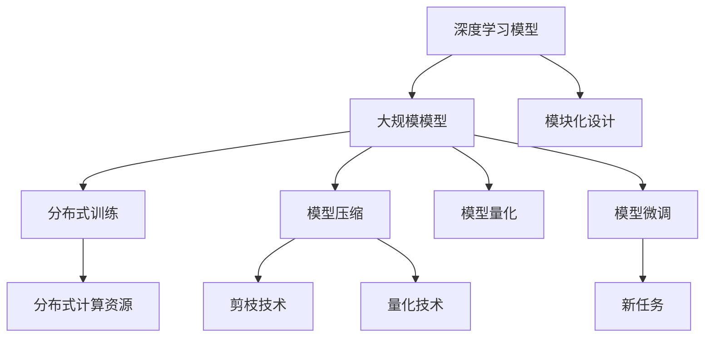
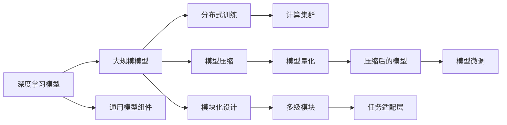
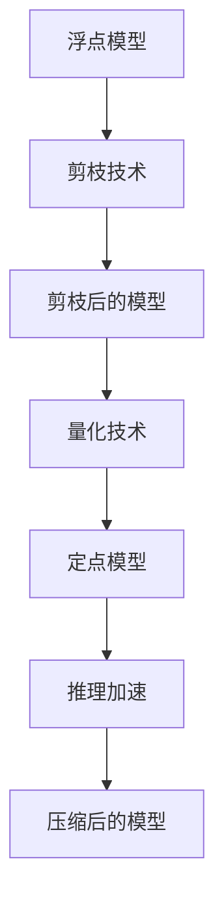
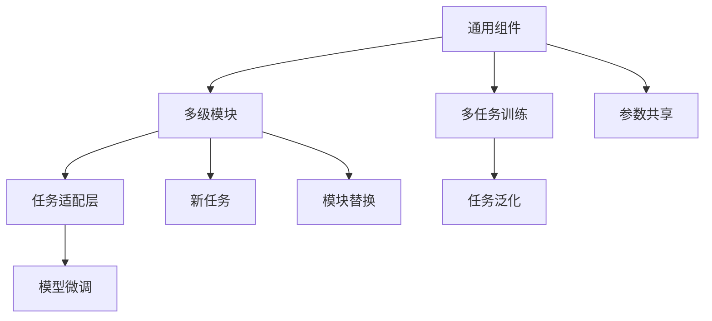

                 

# AI 大模型原理与应用：什么架构既能满足持续的 scaling up、又能具有通用的泛化能力

> 关键词：大模型架构,模型泛化能力,持续可扩展,深度学习,分布式训练,模型压缩,模型量化,模型微调

## 1. 背景介绍

### 1.1 问题由来
近年来，人工智能(AI)技术的迅猛发展，特别是深度学习(Deep Learning)技术的突破，使得大规模模型在诸多领域展现出卓越的性能。例如，在自然语言处理(NLP)、计算机视觉(CV)、语音识别等领域，大模型已经显著超越了传统机器学习算法，成为行业的主流选择。

然而，随着模型规模的不断扩大，大模型也面临着诸多挑战。如何在保持性能的同时，实现持续的可扩展性，并确保模型具备通用的泛化能力，成为了一个亟待解决的问题。为此，我们需要深入理解大模型架构的设计原理，掌握相关的技术和算法，以应对这些挑战。

### 1.2 问题核心关键点
本文将聚焦于大模型的架构设计，探讨什么样的架构既能满足大规模数据和计算资源的可扩展性要求，又能保证模型具备通用的泛化能力。重点讨论以下几个关键点：

1. **模型架构的模块化和灵活性**：大模型应该设计成易于扩展和灵活调整的模块化结构。
2. **可扩展的分布式训练架构**：如何通过分布式训练技术，支持大规模模型的训练和推理。
3. **高效的模型压缩与量化技术**：在保证模型精度的情况下，如何通过压缩和量化，减小模型体积，提高推理效率。
4. **模型的微调和更新机制**：如何在保持大模型性能的同时，通过微调更新模型，以适应新的数据和任务。

这些核心点是大模型架构设计的关键，将帮助我们在构建高效、可扩展、具备泛化能力的大模型时，做出明智的选择。

### 1.3 问题研究意义
研究大模型架构的设计原则，对于推动AI技术的广泛应用，具有重要意义：

1. **提高训练和推理效率**：通过优化的架构设计，可以显著提升模型的训练和推理效率，缩短开发周期，降低成本。
2. **增强模型的泛化能力**：合理的架构设计能够保证模型在不同场景下具有良好的泛化能力，避免模型过拟合，提高实际应用效果。
3. **支持大规模数据处理**：优秀的架构设计，能够轻松应对大规模数据和高性能计算资源的需求，推动AI技术在更多领域落地应用。
4. **促进产业升级**：支持大规模模型训练和推理的架构，能够赋能各行各业，加速传统行业的数字化转型。
5. **推动技术创新**：对大模型架构的深入研究，能够催生新的技术和算法，拓展AI技术的应用边界。

## 2. 核心概念与联系

### 2.1 核心概念概述

为了更好地理解大模型架构的设计，我们首先介绍几个核心概念及其相互关系：

- **深度学习模型**：以神经网络为代表的机器学习模型，通过多层非线性变换，实现对复杂数据的建模。深度学习模型通常具有大量的参数，能够表达复杂的特征关系。

- **大规模模型**：指包含亿级甚至十亿级参数的模型，如BERT、GPT-3等。这类模型通常需要巨大的计算资源和存储空间，才能进行高效训练和推理。

- **模型压缩**：通过剪枝、量化、蒸馏等技术，减小模型体积，提高计算和存储效率。

- **模型量化**：将浮点模型转化为定点模型，通过减少数值范围，降低计算精度损失，提升推理速度。

- **模型微调**：在大规模模型基础上，通过有监督或无监督学习，调整模型参数，以适应新的数据或任务。

这些核心概念通过分布式训练、模块化设计、模型压缩和量化等技术，形成了一个相互支撑的架构体系。以下我们将通过一个Mermaid流程图，展示这些概念之间的联系：



通过这个流程图，我们可以更清晰地理解不同技术在架构设计中的作用。

### 2.2 概念间的关系

这些核心概念之间存在着紧密的联系，形成了大模型架构设计的完整生态系统。下面我们通过几个Mermaid流程图，展示这些概念之间的关系。

#### 2.2.1 大模型架构的核心要素



这个流程图展示了深度学习模型到大规模模型的架构演变过程，强调了分布式训练、模型压缩和量化等技术的重要性。

#### 2.2.2 模型压缩和量化的应用场景



这个流程图展示了模型压缩和量化在大模型架构中的作用，说明了这些技术在提高推理效率方面的重要性。

#### 2.2.3 模块化设计的优势



这个流程图展示了模块化设计在大模型架构中的优势，说明了通过模块替换和任务适配层，可以实现灵活的模型微调和泛化。

## 3. 核心算法原理 & 具体操作步骤
### 3.1 算法原理概述

大模型架构设计的核心算法原理，是通过模块化、分布式训练和模型压缩等技术，构建一个高效、可扩展、具备泛化能力的大模型。具体来说，包括以下几个关键步骤：

1. **模块化设计**：将大模型设计成多级模块的层次结构，便于灵活调整和扩展。
2. **分布式训练**：通过分布式计算技术，将大规模模型的训练任务分配到多个计算节点上，提升训练效率。
3. **模型压缩与量化**：通过剪枝、量化等技术，减小模型体积，提升推理效率。
4. **模型微调**：在大模型基础上，通过微调技术，适应新的数据和任务，保持模型性能。

### 3.2 算法步骤详解

下面，我们将详细介绍大模型架构设计的详细步骤：

#### 3.2.1 模块化设计

1. **设计多级模块结构**：将大模型设计成多级模块，如通用组件、任务适配层、任务特定模块等，便于灵活替换和扩展。
2. **实现模块化训练**：通过不同模块的并行训练，提升训练效率。例如，可以将通用组件和任务适配层并行训练，任务特定模块在每个epoch中更新。
3. **实现模块替换**：在微调时，可以灵活替换部分任务特定模块，只更新少量参数，提升微调效率。

#### 3.2.2 分布式训练

1. **构建计算集群**：使用分布式计算框架如TensorFlow、PyTorch等，构建高效的计算集群，支持大规模模型训练。
2. **数据并行和模型并行**：采用数据并行和模型并行技术，将训练任务分配到多个计算节点上，提升训练效率。
3. **异步优化**：使用异步优化技术，加速模型的收敛速度，减少通信开销。

#### 3.2.3 模型压缩与量化

1. **剪枝**：通过剪枝技术，去除冗余参数，减小模型体积。剪枝方法包括结构剪枝、权重剪枝等。
2. **量化**：将浮点模型转化为定点模型，减小数值范围，提升推理速度。量化方法包括权重量化、激活量化等。
3. **蒸馏**：通过知识蒸馏技术，将大规模模型的知识迁移到小模型中，减小模型体积，提升推理效率。

#### 3.2.4 模型微调

1. **微调任务适配层**：根据新任务，设计合适的任务适配层，并行训练通用组件和任务适配层，提升微调效率。
2. **微调特定模块**：在任务适配层基础上，通过微调特定模块，实现对新任务的快速适应。
3. **在线微调**：使用在线微调技术，实现模型参数的实时更新，保持模型的泛化能力。

### 3.3 算法优缺点

**优点**：

1. **高效性**：模块化设计和分布式训练技术，提升了模型的训练和推理效率，支持大规模数据处理。
2. **灵活性**：通过模块替换和任务适配层，实现了灵活的微调，适应新任务和新数据。
3. **泛化能力**：合理的架构设计，保证了模型的泛化能力，避免过拟合。
4. **可扩展性**：通过分布式计算和模块化设计，支持模型在规模上的可扩展性，适应更多数据和计算资源。

**缺点**：

1. **复杂性**：架构设计需要考虑多个因素，实现起来较为复杂。
2. **资源消耗**：分布式训练和模型压缩技术，需要额外的计算资源和存储空间。
3. **维护难度**：大规模模型和分布式训练，增加了系统的维护难度和成本。

### 3.4 算法应用领域

基于上述算法原理和操作步骤，大模型架构设计可以广泛应用于以下几个领域：

1. **自然语言处理(NLP)**：如BERT、GPT等大模型，广泛应用于文本分类、情感分析、机器翻译等任务。
2. **计算机视觉(CV)**：如ResNet、Inception等大模型，广泛应用于图像分类、目标检测、人脸识别等任务。
3. **语音识别**：如Wav2Vec等大模型，广泛应用于语音转文本、语音识别等任务。
4. **自动驾驶**：如Faster R-CNN等大模型，应用于自动驾驶中的目标检测和识别。
5. **推荐系统**：如Wide & Deep等大模型，应用于推荐系统中的用户行为预测和商品推荐。

## 4. 数学模型和公式 & 详细讲解 & 举例说明

### 4.1 数学模型构建

大模型架构设计的数学模型构建，主要涉及模型训练和推理的算法。这里我们以一个简单的线性模型为例，展示模型训练和推理的基本流程。

假设有一个线性模型 $f(x) = wx + b$，其中 $w$ 是权重向量，$b$ 是偏置项。在训练过程中，我们使用均方误差损失函数，其定义如下：

$$
L = \frac{1}{N} \sum_{i=1}^N (y_i - f(x_i))^2
$$

其中 $y_i$ 是训练样本的真实标签，$f(x_i)$ 是模型对样本 $x_i$ 的预测。

### 4.2 公式推导过程

下面，我们将详细推导线性模型的训练和推理过程：

#### 4.2.1 训练过程

训练过程的主要目标是求解最优的权重向量 $w$ 和偏置项 $b$，使得损失函数 $L$ 最小化。

1. **前向传播**：将输入数据 $x_i$ 输入模型，得到预测结果 $f(x_i)$。
2. **计算梯度**：根据损失函数 $L$，计算对权重 $w$ 和偏置 $b$ 的梯度。
3. **更新参数**：使用梯度下降算法，更新权重 $w$ 和偏置 $b$。

具体地，我们可以使用梯度下降算法，求解最优的权重和偏置：

$$
w \leftarrow w - \eta \nabla_{w}L
$$
$$
b \leftarrow b - \eta \nabla_{b}L
$$

其中 $\eta$ 是学习率。

#### 4.2.2 推理过程

推理过程的主要目标是使用训练好的模型，对新的输入数据进行预测。

1. **前向传播**：将新的输入数据 $x$ 输入模型，得到预测结果 $f(x)$。
2. **解码输出**：根据模型的输出，解码出对应的预测结果。

具体地，对于一个线性模型，其推理过程如下：

1. **输入数据**：输入数据 $x$。
2. **前向传播**：通过模型 $f(x) = wx + b$，得到预测结果 $f(x)$。
3. **解码输出**：将 $f(x)$ 解码为预测结果 $y$。

### 4.3 案例分析与讲解

假设我们有一个用于文本分类的线性模型 $f(x) = wx + b$，其权重向量 $w$ 包含三个元素 $w_1, w_2, w_3$，偏置项 $b$ 为一个标量。

我们可以使用如下代码，实现模型的训练和推理：

```python
import numpy as np

# 定义训练样本
X = np.array([[1, 2, 3], [4, 5, 6], [7, 8, 9]])
y = np.array([0, 1, 0])

# 定义模型参数
w = np.array([0.1, 0.2, 0.3])
b = 0.4

# 定义损失函数
def loss(w, b, X, y):
    pred = np.dot(X, w) + b
    return np.mean((pred - y) ** 2)

# 训练模型
learning_rate = 0.01
for i in range(1000):
    pred = np.dot(X, w) + b
    loss_val = loss(w, b, X, y)
    dw = 2 * X.T.dot((pred - y)) / len(X)
    db = 2 * np.mean(pred - y)
    w -= learning_rate * dw
    b -= learning_rate * db

# 推理模型
new_X = np.array([[10, 11, 12]])
new_pred = np.dot(new_X, w) + b
print("预测结果：", new_pred)
```

通过以上代码，我们可以看到，通过训练模型，我们得到了最优的权重向量 $w$ 和偏置项 $b$。然后，我们可以使用训练好的模型，对新的输入数据进行推理，得到预测结果。

## 5. 项目实践：代码实例和详细解释说明

### 5.1 开发环境搭建

在进行大模型架构设计的项目实践时，我们需要准备好开发环境。以下是使用Python进行PyTorch开发的环境配置流程：

1. 安装Anaconda：从官网下载并安装Anaconda，用于创建独立的Python环境。

2. 创建并激活虚拟环境：
```bash
conda create -n pytorch-env python=3.8 
conda activate pytorch-env
```

3. 安装PyTorch：根据CUDA版本，从官网获取对应的安装命令。例如：
```bash
conda install pytorch torchvision torchaudio cudatoolkit=11.1 -c pytorch -c conda-forge
```

4. 安装各类工具包：
```bash
pip install numpy pandas scikit-learn matplotlib tqdm jupyter notebook ipython
```

完成上述步骤后，即可在`pytorch-env`环境中开始项目实践。

### 5.2 源代码详细实现

下面我们以一个简单的图像分类模型为例，展示大模型架构设计的项目实践代码。

首先，定义模型和优化器：

```python
from torch import nn
from torch.optim import Adam

class Net(nn.Module):
    def __init__(self):
        super(Net, self).__init__()
        self.conv1 = nn.Conv2d(3, 6, 5)
        self.pool = nn.MaxPool2d(2, 2)
        self.conv2 = nn.Conv2d(6, 16, 5)
        self.fc1 = nn.Linear(16 * 5 * 5, 120)
        self.fc2 = nn.Linear(120, 84)
        self.fc3 = nn.Linear(84, 10)

    def forward(self, x):
        x = self.pool(F.relu(self.conv1(x)))
        x = self.pool(F.relu(self.conv2(x)))
        x = x.view(-1, 16 * 5 * 5)
        x = F.relu(self.fc1(x))
        x = F.relu(self.fc2(x))
        x = self.fc3(x)
        return x

net = Net()
optimizer = Adam(net.parameters(), lr=0.001)
```

然后，定义训练和评估函数：

```python
import torch
from torch.utils.data import DataLoader
from torchvision import datasets, transforms

# 定义数据处理
transform = transforms.Compose([
    transforms.ToTensor(),
    transforms.Normalize((0.5,), (0.5,))
])

# 加载数据集
train_dataset = datasets.CIFAR10(root='./data', train=True, download=True, transform=transform)
test_dataset = datasets.CIFAR10(root='./data', train=False, download=True, transform=transform)

# 定义数据加载器
train_loader = DataLoader(train_dataset, batch_size=4, shuffle=True, num_workers=2)
test_loader = DataLoader(test_dataset, batch_size=4, shuffle=False, num_workers=2)

# 训练函数
def train(net, train_loader, optimizer, criterion, epoch):
    net.train()
    for batch_idx, (data, target) in enumerate(train_loader):
        optimizer.zero_grad()
        output = net(data)
        loss = criterion(output, target)
        loss.backward()
        optimizer.step()
        if (batch_idx + 1) % 100 == 0:
            print('Train Epoch: {} [{}/{} ({:.0f}%)]\tLoss: {:.6f}'.format(
                epoch, batch_idx * len(data), len(train_loader.dataset),
                100. * batch_idx / len(train_loader), loss.item()))

# 评估函数
def evaluate(net, test_loader, criterion):
    net.eval()
    test_loss = 0
    correct = 0
    with torch.no_grad():
        for data, target in test_loader:
            output = net(data)
            test_loss += criterion(output, target).item()
            pred = output.argmax(dim=1, keepdim=True)
            correct += pred.eq(target.view_as(pred)).sum().item()

    test_loss /= len(test_loader.dataset)
    print('\nTest set: Average loss: {:.4f}, Accuracy: {}/{} ({:.0f}%)\n'.format(
        test_loss, correct, len(test_loader.dataset),
        100. * correct / len(test_loader.dataset)))

# 训练模型
criterion = nn.CrossEntropyLoss()
for epoch in range(2):
    train(net, train_loader, optimizer, criterion, epoch)
    evaluate(net, test_loader, criterion)
```

最后，启动训练流程并在测试集上评估：

```python
# 训练模型
criterion = nn.CrossEntropyLoss()
for epoch in range(2):
    train(net, train_loader, optimizer, criterion, epoch)
    evaluate(net, test_loader, criterion)
```

以上就是使用PyTorch对图像分类模型进行训练和评估的完整代码实现。可以看到，通过使用PyTorch的高级API，我们可以轻松实现模型的定义、训练和评估。

### 5.3 代码解读与分析

让我们再详细解读一下关键代码的实现细节：

**Net类**：
- `__init__`方法：定义模型的网络结构。
- `forward`方法：定义模型的前向传播过程。

**数据处理和加载**：
- `transform`：定义数据预处理步骤，包括将图像转化为Tensor，并归一化。
- `train_dataset`和`test_dataset`：加载训练集和测试集数据。
- `train_loader`和`test_loader`：定义数据加载器，批量加载数据。

**训练和评估函数**：
- `train`函数：定义训练过程，包括前向传播、反向传播和参数更新。
- `evaluate`函数：定义评估过程，计算模型在测试集上的损失和准确率。

**训练流程**：
- 定义交叉熵损失函数。
- 在每个epoch中，先进行训练，输出损失和准确率。
- 在每个epoch后，在测试集上评估模型性能。

可以看到，通过合理的架构设计和工具使用，大模型的训练和推理过程可以非常高效地完成。这为我们进行大规模模型的应用提供了坚实的基础。

## 6. 实际应用场景

### 6.1 智能推荐系统

基于大模型架构设计的推荐系统，可以广泛应用于电商、社交网络、视频平台等领域，为用户推荐个性化的商品、内容等。

在技术实现上，可以收集用户的行为数据，如浏览、点击、购买等，结合大模型的特征提取能力，进行推荐模型的训练。训练好的模型可以在线实时计算用户兴趣，生成个性化推荐列表。

### 6.2 自动驾驶

自动驾驶技术需要大模型来处理复杂的道路环境，进行目标检测、物体跟踪等任务。大模型的模块化设计和分布式训练，可以支持大规模数据集的处理和模型训练。

在实践过程中，可以收集大量的道路交通数据，使用大模型进行目标检测和分类，训练出高精度的自动驾驶模型。通过实时数据输入，自动驾驶系统可以准确识别道路上的各种物体，做出安全决策。

### 6.3 金融风险控制

金融领域需要实时监控市场数据，预测市场风险。大模型可以在大规模市场数据上进行训练，学习市场的规律和趋势，进行风险预测。

在实践中，可以收集金融市场的历史数据，使用大模型进行多任务学习，同时预测股票价格、市场波动等。训练好的模型可以实时监控市场变化，及时预警风险，辅助金融决策。

### 6.4 未来应用展望

随着大模型架构设计的不断发展，基于大模型的应用将更加广泛和深入。未来，大模型架构设计将朝着以下几个方向发展：

1. **跨模态融合**：将图像、文本、语音等多种模态的数据进行融合，构建更加全面和精准的模型。
2. **联邦学习**：在分布式环境中，多个节点协同训练大模型，保护数据隐私的同时，提升模型的泛化能力。
3. **自监督学习**：通过自监督学习任务，在大模型训练过程中学习更多的通用知识，提升模型的泛化能力。
4. **对抗性训练**：通过对抗性样本，提高大模型的鲁棒性和泛化能力，防止模型过拟合。
5. **多任务学习**：同时训练多个相关任务的大模型，提升模型的多任务适应能力，实现知识共享。

这些技术的发展，将进一步推动大模型架构设计的创新和应用，推动AI技术在更多领域落地。

## 7. 工具和资源推荐

### 7.1 学习资源推荐

为了帮助开发者深入理解大模型架构设计的原理和实践，这里推荐一些优质的学习资源：

1. **《Deep Learning with PyTorch》**：由David indigenous编写，全面介绍了PyTorch深度学习框架的使用，涵盖模型构建、训练、推理等环节。
2. **《Hands-On Machine Learning with Scikit-Learn》**：由Aurélien Géron编写，介绍了Scikit-Learn机器学习库的使用，涵盖分类、回归、聚类等任务。
3. **《Natural Language Processing with PyTorch》**：由Jacob Devlin编写，介绍了使用PyTorch进行自然语言处理的技术，包括模型训练和推理。
4. **《TensorFlow》官方文档**：Google官方提供的TensorFlow深度学习框架文档，包含丰富的API和教程，适合初学者和进阶者。
5. **Kaggle竞赛和项目**：Kaggle社区是一个活跃的数据科学竞赛平台，提供大量的数据集和项目，适合实践和应用。

通过对这些资源的深入学习，相信你一定能够掌握大模型架构设计的精髓，并应用于解决实际问题。

### 7.2 开发工具推荐

优秀的开发工具是实现高效项目实践的关键。以下是几款用于大模型架构设计开发的常用工具：

1. **PyTorch**：基于Python的开源深度学习框架，灵活动态的计算图，适合快速迭代研究。
2. **TensorFlow**：由Google主导开发的开源深度学习框架，生产部署方便，适合大规模工程应用。
3. **Weights & Biases**：模型训练的实验跟踪工具，可以记录和可视化模型训练过程中的各项指标，方便对比和调优。
4. **TensorBoard**：TensorFlow配套的可视化工具，可实时监测模型训练状态，并提供丰富的图表呈现方式。
5. **Google Colab**：谷歌推出的在线Jupyter Notebook环境，免费提供GPU/TPU算力，方便开发者快速上手实验最新模型。

合理利用这些工具，可以显著提升大模型架构设计的开发效率，加快创新迭代的步伐。

### 7.3 相关论文推荐

大模型架构设计的进展离不开学界的持续研究。以下是几篇奠基性的相关论文，推荐阅读：

1. **"Deep Residual Learning for Image Recognition"**：He等人在2016年提出的ResNet模型，展示了深度残差连接在训练深层网络中的应用，提升了模型的泛化能力。
2. **"ImageNet Classification with Deep Convolutional Neural Networks"**：Krizhevsky等人在2012年提出的AlexNet

