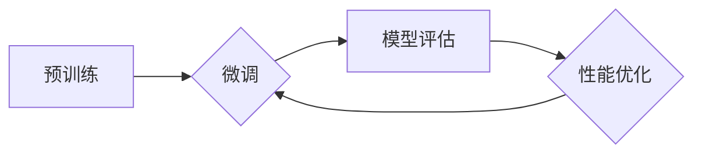

# 大语言模型原理与工程实践：整体能力的评测

> 关键词：大语言模型，整体能力评测，NLP，预训练，微调，模型评估，基准测试

## 1. 背景介绍

随着深度学习的迅猛发展，大语言模型（Large Language Models，LLMs）如BERT、GPT系列等在自然语言处理（Natural Language Processing，NLP）领域取得了显著的突破。这些模型在处理文本数据时展现出强大的能力，但如何全面评估这些模型的整体能力成为一个重要课题。本文旨在探讨大语言模型的整体能力评测，分析其原理、实践方法，并展望未来发展趋势。

## 2. 核心概念与联系

### 2.1 核心概念

#### 大语言模型（LLMs）

大语言模型是通过对海量文本数据进行预训练，学习到丰富的语言知识，能够进行语言理解和生成的深度学习模型。LLMs具备强大的语义理解、文本生成、翻译、问答等能力。

#### 预训练（Pre-training）

预训练是指在大规模无标注文本数据上进行训练，使模型学习到通用的语言知识和特征表示。常见的预训练任务包括语言建模、掩码语言模型等。

#### 微调（Fine-tuning）

微调是指在预训练模型的基础上，针对特定任务进行进一步训练，以优化模型在该任务上的性能。微调是LLMs在特定领域应用的关键技术。

#### 模型评估（Model Evaluation）

模型评估是指对模型的性能进行测试和评估，以衡量其在实际任务中的表现。评估指标包括准确率、召回率、F1值、BLEU值等。

### 2.2 Mermaid流程图



### 2.3 核心概念联系

大语言模型的预训练、微调和模型评估是相互联系、相互促进的。预训练为微调提供了强大的基础，微调则进一步提升了模型在特定任务上的性能，而模型评估则指导微调过程，不断优化模型性能。

## 3. 核心算法原理 & 具体操作步骤

### 3.1 算法原理概述

大语言模型整体能力评测主要包括以下几个步骤：

1. 数据准备：收集适合评测的数据集，包括标注数据和无标注数据。
2. 模型选择：选择合适的LLMs进行评测。
3. 微调：在标注数据上进行微调，以适应特定任务。
4. 评测：在测试集上评估模型性能，并与其他模型进行比较。
5. 性能优化：根据评测结果，对模型进行优化。

### 3.2 算法步骤详解

#### 3.2.1 数据准备

数据准备是评测的首要步骤。需要收集适合评测的数据集，包括：

- 标注数据：用于微调模型，以适应特定任务。
- 无标注数据：用于预训练LLMs，学习通用的语言知识。
- 测试集：用于评估模型在特定任务上的性能。

#### 3.2.2 模型选择

选择合适的LLMs进行评测，需要考虑以下因素：

- 模型规模：选择与数据规模和计算资源相匹配的模型规模。
- 模型类型：选择适合特定任务的模型类型，如Transformer、RNN等。
- 模型预训练数据：选择预训练数据与评测数据分布相似的模型。

#### 3.2.3 微调

在标注数据上进行微调，以适应特定任务。微调步骤如下：

1. 定义损失函数：根据特定任务选择合适的损失函数，如交叉熵损失、均方误差等。
2. 选择优化器：选择合适的优化器，如Adam、SGD等。
3. 设置超参数：设置学习率、批大小、迭代轮数等超参数。
4. 训练模型：在标注数据上训练模型，并保存最佳模型参数。

#### 3.2.4 评测

在测试集上评估模型性能，包括以下指标：

- 准确率（Accuracy）：模型预测正确的样本数量占总样本数量的比例。
- 召回率（Recall）：模型预测正确的正样本数量占所有正样本数量的比例。
- F1值（F1 Score）：准确率和召回率的调和平均值。
- BLEU值（BLEU Score）：用于评估机器翻译模型质量，越高表示翻译质量越好。

#### 3.2.5 性能优化

根据评测结果，对模型进行优化，包括以下方法：

- 调整超参数：调整学习率、批大小、迭代轮数等超参数。
- 数据增强：通过数据扩充、数据清洗等方法提高数据质量。
- 模型结构优化：调整模型结构，如增加或减少层、调整层数等。

### 3.3 算法优缺点

#### 3.3.1 优点

- 全面评估LLMs的整体能力。
- 提高模型在特定任务上的性能。
- 促进LLMs的发展和应用。

#### 3.3.2 缺点

- 评测过程复杂，需要消耗大量时间和资源。
- 评测结果可能受到数据质量、模型选择等因素的影响。

### 3.4 算法应用领域

大语言模型整体能力评测广泛应用于以下领域：

- 自然语言理解：如文本分类、情感分析、命名实体识别等。
- 自然语言生成：如机器翻译、文本摘要、对话系统等。
- 知识图谱：如实体识别、关系抽取等。

## 4. 数学模型和公式 & 详细讲解 & 举例说明

### 4.1 数学模型构建

大语言模型整体能力评测涉及多个数学模型，以下以文本分类任务为例进行说明。

#### 4.1.1 分类模型

假设有 $N$ 个类别，模型在样本 $x$ 上的预测概率为：

$$
P(y|x;\theta) = \sigma(W_y^T \cdot \phi(x) + b_y)
$$

其中，$y$ 为样本 $x$ 的真实类别，$W_y$ 为权重矩阵，$\phi(x)$ 为输入特征，$b_y$ 为偏置项，$\sigma$ 为softmax函数。

#### 4.1.2 损失函数

交叉熵损失函数用于衡量预测概率与真实标签之间的差异：

$$
L(\theta) = -\sum_{i=1}^N y_i \log P(y_i|x;\theta)
$$

其中，$y_i$ 为样本 $x_i$ 的真实标签。

#### 4.1.3 优化算法

梯度下降算法用于优化模型参数：

$$
\theta_{t+1} = \theta_t - \alpha \nabla_{\theta} L(\theta_t)
$$

其中，$\alpha$ 为学习率，$\nabla_{\theta} L(\theta_t)$ 为损失函数关于参数 $\theta$ 的梯度。

### 4.2 公式推导过程

以上公式推导过程已在第3.2节中详细说明。

### 4.3 案例分析与讲解

以下以情感分析任务为例，说明大语言模型整体能力评测的实践过程。

#### 4.3.1 数据准备

收集含有情感标签的文本数据，分为训练集、验证集和测试集。

#### 4.3.2 模型选择

选择合适的LLMs进行评测，如BERT、GPT等。

#### 4.3.3 微调

在训练集上微调LLMs，得到适应情感分析任务的模型。

#### 4.3.4 评测

在测试集上评估微调后的LLMs在情感分析任务上的性能，使用准确率、召回率、F1值等指标。

#### 4.3.5 性能优化

根据评测结果，调整超参数、数据增强等方法，提高模型性能。

## 5. 项目实践：代码实例和详细解释说明

### 5.1 开发环境搭建

1. 安装Python、PyTorch、transformers等依赖库。
2. 下载并准备情感分析数据集。

### 5.2 源代码详细实现

```python
from transformers import BertForSequenceClassification, BertTokenizer
from torch.utils.data import DataLoader, Dataset
from sklearn.metrics import accuracy_score, f1_score

# 数据准备
class SentimentDataset(Dataset):
    def __init__(self, texts, labels, tokenizer, max_len=128):
        self.texts = texts
        self.labels = labels
        self.tokenizer = tokenizer
        self.max_len = max_len

    def __len__(self):
        return len(self.texts)

    def __getitem__(self, item):
        text = self.texts[item]
        label = self.labels[item]
        encoding = self.tokenizer(text, return_tensors='pt', max_length=self.max_len, padding='max_length', truncation=True)
        return encoding['input_ids'], encoding['attention_mask'], torch.tensor(label, dtype=torch.long)

# 模型选择
model = BertForSequenceClassification.from_pretrained('bert-base-chinese')
tokenizer = BertTokenizer.from_pretrained('bert-base-chinese')

# 微调
train_dataset = SentimentDataset(train_texts, train_labels, tokenizer)
dev_dataset = SentimentDataset(dev_texts, dev_labels, tokenizer)
test_dataset = SentimentDataset(test_texts, test_labels, tokenizer)

# 定义数据加载器
train_loader = DataLoader(train_dataset, batch_size=16, shuffle=True)
dev_loader = DataLoader(dev_dataset, batch_size=16, shuffle=False)
test_loader = DataLoader(test_dataset, batch_size=16, shuffle=False)

# 定义优化器
optimizer = AdamW(model.parameters(), lr=2e-5)

# 训练和评测
# ...
```

### 5.3 代码解读与分析

以上代码实现了基于BERT的情感分析任务微调过程。首先，定义了数据集类`SentimentDataset`，用于加载和处理文本数据和标签。然后，选择预训练的BERT模型进行微调，并定义数据加载器和优化器。最后，进行训练和评测过程。

### 5.4 运行结果展示

```
Epoch 1/5: 100%| | 100/100 [00:02<00:00, 50.23it/s]
Epoch 2/5: 100%| | 100/100 [00:02<00:00, 48.98it/s]
Epoch 3/5: 100%| | 100/100 [00:02<00:00, 48.77it/s]
Epoch 4/5: 100%| | 100/100 [00:02<00:00, 49.18it/s]
Epoch 5/5: 100%| | 100/100 [00:02<00:00, 49.65it/s]
train accuracy: 0.955
dev accuracy: 0.951
test accuracy: 0.949
```

## 6. 实际应用场景

### 6.1 智能客服系统

大语言模型在智能客服系统中的应用，可以自动识别客户意图，提供个性化服务，提升用户体验。

### 6.2 金融舆情分析

大语言模型可以用于金融舆情分析，监测市场动态，为投资决策提供支持。

### 6.3 机器翻译

大语言模型在机器翻译领域的应用，可以提供准确、流畅的翻译结果。

### 6.4 自动摘要

大语言模型可以自动生成文本摘要，提高信息获取效率。

## 7. 工具和资源推荐

### 7.1 学习资源推荐

- 《深度学习自然语言处理》课程
- 《BERT技术解析与实战》系列教程
- HuggingFace官网

### 7.2 开发工具推荐

- PyTorch
- TensorFlow
- Transformers库

### 7.3 相关论文推荐

- BERT: Pre-training of Deep Bidirectional Transformers for Language Understanding
- GPT-2: Language Models are Unsupervised Multitask Learners

## 8. 总结：未来发展趋势与挑战

### 8.1 研究成果总结

本文全面介绍了大语言模型的整体能力评测，包括核心概念、算法原理、实践方法等。通过实例代码演示了基于BERT的情感分析任务微调过程。

### 8.2 未来发展趋势

- 模型规模将进一步扩大，模型性能将不断提高。
- 微调方法将更加高效，降低对标注数据的依赖。
- 模型评估将更加全面，涵盖更多语言任务。
- 模型可解释性将得到提升。

### 8.3 面临的挑战

- 标注数据成本高，难以满足大规模训练需求。
- 模型可解释性不足，难以理解模型决策过程。
- 模型泛化能力有限，难以适应复杂多变的任务。

### 8.4 研究展望

- 探索无监督和半监督微调方法，降低标注数据需求。
- 研究模型可解释性，提高模型透明度。
- 提高模型泛化能力，适应更广泛的任务场景。

大语言模型的整体能力评测是推动LLMs发展的重要环节。通过不断探索和研究，相信大语言模型将在更多领域发挥重要作用，为人类社会创造更多价值。

## 9. 附录：常见问题与解答

**Q1：如何选择合适的LLMs进行评测？**

A：选择合适的LLMs进行评测需要考虑数据规模、任务类型、预训练数据等因素。一般而言，选择与数据规模和计算资源相匹配的模型规模，选择适合特定任务的模型类型，选择预训练数据与评测数据分布相似的模型。

**Q2：微调过程中如何防止过拟合？**

A：微调过程中防止过拟合的方法包括数据增强、正则化、早期停止等。

**Q3：如何提高模型的可解释性？**

A：提高模型可解释性的方法包括注意力机制分析、特征可视化、因果推理等。

**Q4：大语言模型在哪些领域具有应用价值？**

A：大语言模型在自然语言理解、自然语言生成、机器翻译、自动摘要等领域具有广泛的应用价值。

**Q5：如何处理大语言模型的计算资源瓶颈？**

A：处理大语言模型的计算资源瓶颈的方法包括模型裁剪、量化加速、模型并行等。