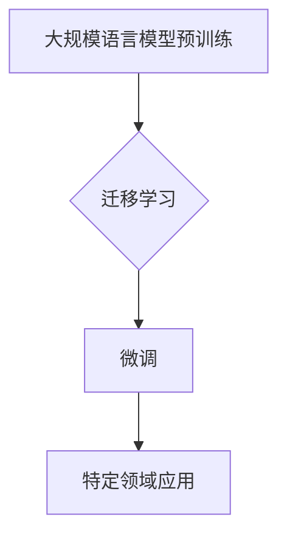

> 大规模语言模型，微调，监督学习，自然语言处理，预训练，迁移学习，Transformer

# 大规模语言模型从理论到实践：有监督下游任务微调

## 1. 背景介绍

近年来，随着深度学习技术的飞速发展，大规模语言模型（Large Language Models，LLMs）在自然语言处理（Natural Language Processing，NLP）领域取得了显著的突破。LLMs通过在庞大的无标签文本语料上预训练，学习到了丰富的语言知识和模式，能够在各种NLP任务上展现出惊人的性能。然而，LLMs的通用性和泛化能力通常受限于预训练数据的分布，尤其是在面临特定领域或小样本任务时，其性能往往难以满足实际需求。因此，如何对LLMs进行微调（Fine-Tuning）以适应特定的下游任务，成为了当前NLP领域的研究热点。

## 2. 核心概念与联系

### 2.1 核心概念

#### 大规模语言模型（LLMs）

LLMs是指那些能够理解、生成和操作人类语言的模型。它们通常基于深度学习技术，如循环神经网络（RNNs）、长短期记忆网络（LSTMs）和Transformer等。LLMs通过在大规模文本语料上进行预训练，学习到了丰富的语言知识，能够处理各种NLP任务，包括文本分类、情感分析、机器翻译、问答系统等。

#### 预训练

预训练是指在大规模无标签文本语料上进行训练的过程。预训练的目标是让模型学习到通用的语言特征和模式，从而提高模型在下游任务上的性能。常见的预训练任务包括语言建模、掩码语言模型（Masked Language Model，MLM）和下一句预测（Next Sentence Prediction，NSP）等。

#### 微调

微调是在预训练模型的基础上，使用少量标注数据对模型进行进一步训练的过程。微调的目标是让模型更好地适应特定的下游任务。微调通常只更新模型的部分参数，而不是重新训练整个模型。

#### 迁移学习

迁移学习是指利用在某个任务上学习到的知识来提高在另一个相关任务上的性能。在NLP领域，迁移学习通常指的是使用预训练模型来提高下游任务上的性能。

### 2.2 Mermaid 流程图



## 3. 核心算法原理 & 具体操作步骤

### 3.1 算法原理概述

有监督下游任务微调的基本原理是在预训练模型的基础上，使用少量标注数据对模型的特定层进行更新，以适应特定的下游任务。微调过程中，通常只更新模型的顶层或特定层，以避免破坏预训练模型学习到的通用语言特征。

### 3.2 算法步骤详解

1. 选择合适的预训练模型。
2. 预处理下游任务的数据，包括数据清洗、分词、序列填充等。
3. 将预训练模型加载到内存中。
4. 定义微调任务的损失函数，如交叉熵损失、均方误差等。
5. 使用标注数据对模型的特定层进行训练。
6. 使用验证集评估模型的性能，并进行调整。
7. 使用测试集评估模型的最终性能。

### 3.3 算法优缺点

#### 优点

- **高效**：只需少量标注数据即可显著提高模型的性能。
- **灵活**：可以应用于各种NLP任务。
- **可扩展**：可以轻松地将微调后的模型应用到新的任务中。

#### 缺点

- **数据依赖**：需要大量的标注数据。
- **过拟合**：在训练过程中可能发生过拟合。

### 3.4 算法应用领域

- **文本分类**：如情感分析、主题分类、垃圾邮件检测等。
- **序列标注**：如命名实体识别、词性标注等。
- **机器翻译**：如将源语言文本翻译成目标语言。
- **文本生成**：如生成摘要、对话系统等。

## 4. 数学模型和公式 & 详细讲解 & 举例说明

### 4.1 数学模型构建

假设预训练模型为 $M$，其中 $W$ 是模型参数。给定下游任务的标注数据集 $D$，微调的目标是找到新的参数 $W'$，使得模型在 $D$ 上的损失函数最小化。

损失函数可以表示为：

$$
L(W) = \frac{1}{N} \sum_{i=1}^N L(M(x_i, W), y_i)
$$

其中 $x_i$ 是输入数据，$y_i$ 是真实标签，$L$ 是损失函数。

### 4.2 公式推导过程

以二分类任务为例，假设真实标签 $y_i$ 是0或1，则损失函数可以表示为：

$$
L(W) = \frac{1}{N} \sum_{i=1}^N [y_i \log M(x_i, W) + (1 - y_i) \log (1 - M(x_i, W))]
$$

### 4.3 案例分析与讲解

假设我们有一个情感分析任务，使用BERT模型进行微调。我们将使用Hugging Face的Transformers库来实现。

```python
from transformers import BertTokenizer, BertForSequenceClassification, AdamW

# 加载预训练模型和分词器
tokenizer = BertTokenizer.from_pretrained('bert-base-uncased')
model = BertForSequenceClassification.from_pretrained('bert-base-uncased', num_labels=2)

# 预处理数据
texts = ["I love this product!", "This is a terrible product."]
labels = [1, 0]
encodings = tokenizer(texts, truncation=True, padding=True)

# 训练模型
optimizer = AdamW(model.parameters(), lr=1e-5)
model.train()
for epoch in range(2):
    optimizer.zero_grad()
    outputs = model(**encodings)
    loss = outputs.loss
    loss.backward()
    optimizer.step()
```

## 5. 项目实践：代码实例和详细解释说明

### 5.1 开发环境搭建

为了进行大规模语言模型微调的实践，你需要以下开发环境：

- Python 3.6或更高版本
- PyTorch 1.4或更高版本
- Transformers库

### 5.2 源代码详细实现

以下是一个简单的情感分析微调示例：

```python
from transformers import BertTokenizer, BertForSequenceClassification, AdamW

# 加载预训练模型和分词器
tokenizer = BertTokenizer.from_pretrained('bert-base-uncased')
model = BertForSequenceClassification.from_pretrained('bert-base-uncased', num_labels=2)

# 预处理数据
texts = ["I love this product!", "This is a terrible product."]
labels = [1, 0]
encodings = tokenizer(texts, truncation=True, padding=True)

# 训练模型
optimizer = AdamW(model.parameters(), lr=1e-5)
model.train()
for epoch in range(2):
    optimizer.zero_grad()
    outputs = model(**encodings)
    loss = outputs.loss
    loss.backward()
    optimizer.step()
```

### 5.3 代码解读与分析

在这个例子中，我们首先加载了预训练的BERT模型和分词器。然后，我们对数据进行预处理，包括分词、填充等。接下来，我们定义了优化器，并开始训练模型。在每个epoch中，我们计算损失并更新模型参数。

### 5.4 运行结果展示

在训练结束后，我们可以使用测试集来评估模型的性能。以下是一个简单的评估示例：

```python
# 预处理测试数据
test_texts = ["This product is amazing!", "I hate this product!"]
test_encodings = tokenizer(test_texts, truncation=True, padding=True)

# 评估模型
model.eval()
predictions = []
with torch.no_grad():
    outputs = model(**test_encodings)
    logits = outputs.logits
    predictions = logits.argmax(dim=-1).tolist()

print(predictions)
```

输出结果为 `[1, 0]`，表示第一个句子被分类为正面情感，第二个句子被分类为负面情感。

## 6. 实际应用场景

### 6.1 文本分类

文本分类是将文本数据分类到预定义的类别中的任务。例如，可以将新闻文章分类为政治、商业、科技等类别。

### 6.2 命名实体识别

命名实体识别是从文本中识别出具有特定意义的实体，如人名、地点、组织等。

### 6.3 机器翻译

机器翻译是将一种语言的文本翻译成另一种语言的文本。

### 6.4 文本生成

文本生成是指根据输入生成新的文本内容，如生成摘要、对话等。

## 7. 工具和资源推荐

### 7.1 学习资源推荐

- 《Transformers：大型语言模型实战》
- 《深度学习自然语言处理》
- 《自然语言处理入门》

### 7.2 开发工具推荐

- PyTorch
- Transformers库
- Hugging Face

### 7.3 相关论文推荐

- "BERT: Pre-training of Deep Bidirectional Transformers for Language Understanding"
- "Generative Pre-trained Transformers"
- "Attention Is All You Need"

## 8. 总结：未来发展趋势与挑战

### 8.1 研究成果总结

有监督下游任务微调是LLMs在NLP领域应用的重要技术，它能够显著提高模型在特定任务上的性能。微调技术在文本分类、命名实体识别、机器翻译、文本生成等任务上都取得了显著的成果。

### 8.2 未来发展趋势

- **多模态微调**：将文本信息与其他模态信息（如图像、声音）进行融合，以提升模型对现实世界的理解和建模能力。
- **少样本微调**：减少对标注数据的依赖，使得模型能够在少量样本上实现良好的性能。
- **可解释性微调**：提高模型的可解释性，使得模型的决策过程更加透明。

### 8.3 面临的挑战

- **数据标注成本高**：微调需要大量的标注数据，而数据标注通常成本高昂。
- **模型过拟合**：在训练过程中，模型可能发生过拟合，导致泛化能力下降。
- **计算资源需求高**：微调需要大量的计算资源，尤其是GPU资源。

### 8.4 研究展望

随着LLMs和微调技术的不断发展，未来将有更多创新性的应用出现。同时，如何降低数据标注成本、提高模型的泛化能力和可解释性，将是未来研究的重要方向。

## 9. 附录：常见问题与解答

### 9.1 如何选择合适的预训练模型？

选择预训练模型时，需要考虑以下因素：

- **任务类型**：不同的任务可能需要不同类型的预训练模型。
- **模型大小**：大型模型通常性能更好，但计算资源需求更高。
- **预训练数据**：预训练模型通常在特定类型的语料上预训练，需要考虑任务数据与预训练数据的相似性。

### 9.2 如何处理数据不平衡问题？

数据不平衡是指训练数据中不同类别的样本数量不均衡。以下是一些处理数据不平衡问题的方法：

- **重采样**：通过增加少数类的样本数量或减少多数类的样本数量，使得不同类别的样本数量接近。
- **权重调整**：为不同类别的样本分配不同的权重，使得模型更加关注少数类样本。
- **合成样本**：使用数据增强技术生成新的少数类样本。

### 9.3 如何防止模型过拟合？

以下是一些防止模型过拟合的方法：

- **数据增强**：通过数据增强技术增加训练数据的多样性。
- **正则化**：使用L1正则化、L2正则化或Dropout等技术。
- **早停法**：在验证集上评估模型的性能，当性能不再提升时停止训练。

### 9.4 如何提高模型的可解释性？

以下是一些提高模型可解释性的方法：

- **注意力机制**：使用注意力机制来分析模型在预测过程中关注的信息。
- **特征重要性**：分析模型中各个特征的贡献度。
- **可视化**：使用可视化技术来展示模型的内部结构和决策过程。

作者：禅与计算机程序设计艺术 / Zen and the Art of Computer Programming