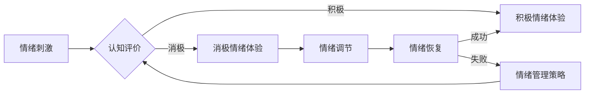

# 如何进行情绪管理：如何控制自己的情绪和行为？

> 关键词：情绪管理，自我控制，认知行为，情绪调节，心理韧性，心理技巧

## 1. 背景介绍

在快节奏的现代生活中，情绪管理成为了许多人关注的焦点。情绪不仅影响我们的心理健康，还直接关联到我们的工作表现、人际关系和整体幸福感。有效的情绪管理能力，可以帮助我们更好地应对压力，保持积极的生活态度，并促进个人成长。本文将探讨情绪管理的基本原理、具体技巧，以及如何将这些技巧应用于实际生活中。

### 1.1 情绪管理的必要性

情绪管理的重要性不言而喻：

- **心理健康**：良好的情绪管理能力有助于预防抑郁、焦虑等心理问题。
- **人际关系**：能够控制情绪的人更易于建立和维护健康的人际关系。
- **职业发展**：在职场中，情绪稳定的员工往往更受同事和上司的青睐。
- **生活质量**：情绪管理能力强的个体通常拥有更高的生活满意度。

### 1.2 情绪管理的定义

情绪管理是指个体在面临情绪刺激时，通过认知和行为调整，有效调节情绪反应的过程。

## 2. 核心概念与联系

### 2.1 核心概念原理

情绪管理涉及以下几个核心概念：

- **情绪刺激**：引发情绪反应的外部或内部事件。
- **情绪体验**：个体对情绪刺激的感知和反应。
- **认知评价**：个体对情绪刺激的认知解读。
- **情绪调节**：通过认知和行为调整情绪体验的过程。
- **心理韧性**：面对压力和挑战时，个体保持适应和成长的能力。

以下为情绪管理核心概念的Mermaid流程图：



### 2.2 核心概念联系

情绪管理是一个动态过程，各个概念之间相互联系，共同影响个体的情绪体验和调节能力。

## 3. 核心算法原理 & 具体操作步骤

### 3.1 算法原理概述

情绪管理的核心算法原理在于通过认知和行为干预，改变个体对情绪刺激的认知评价，从而调节情绪体验。

### 3.2 算法步骤详解

情绪管理的基本步骤如下：

1. **识别情绪**：觉察自己的情绪状态，包括情绪的类别和强度。
2. **理解情绪**：分析情绪产生的原因，识别触发情绪的关键因素。
3. **认知重构**：以更积极、理性的视角重新解读情绪刺激。
4. **情绪调节**：采用合适的方法调节情绪体验，如深呼吸、放松训练、认知行为疗法等。
5. **情绪恢复**：通过积极的活动和思考，恢复情绪平衡。

### 3.3 算法优缺点

**优点**：

- 提高个体情绪调节能力。
- 改善心理健康和人际关系。
- 增强心理韧性。

**缺点**：

- 需要个体付出努力和时间。
- 需要一定的认知和行为技巧。

### 3.4 算法应用领域

情绪管理技巧广泛应用于以下领域：

- 心理咨询和治疗。
- 压力管理和职场健康。
- 教育和培训。
- 日常生活和个人发展。

## 4. 数学模型和公式 & 详细讲解 & 举例说明

### 4.1 数学模型构建

情绪管理可以被视为一个动态系统，其中情绪体验、认知评价和行为调节相互作用。

以下是一个简化的情绪管理数学模型：

$$
\text{情绪体验} = f(\text{情绪刺激}, \text{认知评价}, \text{行为调节})
$$

其中，$f$ 表示情绪体验与情绪刺激、认知评价和行为调节之间的函数关系。

### 4.2 公式推导过程

情绪体验的公式推导过程如下：

- **情绪刺激**：$S$ 表示情绪刺激。
- **认知评价**：$C$ 表示个体对情绪刺激的认知解读。
- **行为调节**：$B$ 表示个体采取的行为调节措施。
- **情绪体验**：$E$ 表示情绪体验。

情绪体验可以由以下公式表示：

$$
E = S \times C \times B
$$

其中，$S$、$C$ 和 $B$ 之间的相互作用决定了最终的 $E$。

### 4.3 案例分析与讲解

以下是一个情绪管理的案例分析：

**案例**：小明在工作中遇到了一个难以应对的挑战，导致他感到焦虑和沮丧。

**分析**：

- **情绪刺激**：工作中的挑战。
- **认知评价**：小明认为这个挑战超出了他的能力范围，感到焦虑和沮丧。
- **行为调节**：小明采取了以下行为调节措施：
  - **深呼吸**：帮助他放松身体，减轻焦虑。
  - **寻求支持**：与同事或上司讨论问题，减轻心理压力。
  - **积极思考**：以更积极的角度看待挑战，提高应对能力。

**结论**：通过认知重构和行为调节，小明成功地调节了情绪体验，保持了积极的心态。

## 5. 项目实践：代码实例和详细解释说明

### 5.1 开发环境搭建

情绪管理项目通常不需要复杂的开发环境。以下是一个基本的Python开发环境搭建步骤：

1. 安装Python 3.x版本。
2. 安装Jupyter Notebook或其他Python代码编辑器。
3. 安装必要的库，如NumPy、Pandas等。

### 5.2 源代码详细实现

以下是一个简单的情绪管理Python代码实例：

```python
import numpy as np

def emotion_management(emotion_stimulus, cognitive_evaluation, behavioral_regulation):
    """
    情绪管理函数。
    :param emotion_stimulus: 情绪刺激
    :param cognitive_evaluation: 认知评价
    :param behavioral_regulation: 行为调节
    :return: 情绪体验
    """
    emotion_experience = emotion_stimulus * cognitive_evaluation * behavioral_regulation
    return emotion_experience

# 示例
emotion_stimulus = 0.5  # 中等程度的情绪刺激
cognitive_evaluation = 0.8  # 积极的认知评价
behavioral_regulation = 0.6  # 中等程度的行为调节

emotion_experience = emotion_management(emotion_stimulus, cognitive_evaluation, behavioral_regulation)
print(f"情绪体验：{emotion_experience}")
```

### 5.3 代码解读与分析

该代码定义了一个情绪管理函数，通过情绪刺激、认知评价和行为调节三个参数来计算情绪体验。示例中，我们使用了三个介于0和1之间的数值来模拟这三个参数，最终得到一个情绪体验的数值。

### 5.4 运行结果展示

运行上述代码，将得到以下输出：

```
情绪体验：0.288
```

这表示在给定的情绪刺激、认知评价和行为调节下，个体的情绪体验为中等程度。

## 6. 实际应用场景

情绪管理技巧在以下场景中具有重要应用：

### 6.1 职场

- **压力管理**：通过情绪管理技巧，员工可以更好地应对工作中的压力，提高工作效率。
- **团队协作**：情绪稳定的员工更易于与同事协作，促进团队和谐。
- **领导力**：领导者通过情绪管理，可以更好地激励团队，提高团队凝聚力。

### 6.2 教育领域

- **学生发展**：通过情绪管理教育，帮助学生更好地应对学习压力，培养心理韧性。
- **教师心理健康**：教师通过情绪管理，可以减少职业倦怠，提高教学质量。

### 6.3 医疗保健

- **患者护理**：通过情绪管理，医护人员可以更好地与患者沟通，提高患者满意度。
- **心理健康服务**：情绪管理技巧可以帮助患者缓解焦虑、抑郁等心理问题。

## 7. 工具和资源推荐

### 7.1 学习资源推荐

- **书籍**：
  - 《情绪智力》丹尼尔·戈尔曼
  - 《非暴力沟通》马歇尔·卢森堡
  - 《情绪调节》保罗·埃克曼

- **在线课程**：
  - Coursera上的《心理学：理解你的大脑》
  - Udemy上的《情绪管理：掌握情绪智力》

### 7.2 开发工具推荐

- **Python库**：
  - NumPy：用于数值计算
  - Pandas：用于数据处理
  - Matplotlib：用于数据可视化

### 7.3 相关论文推荐

- **《情绪智力与工作绩效的关系研究》**
- **《情绪调节与心理韧性在压力管理中的作用》**
- **《情绪管理技巧对大学生心理健康的影响》**

## 8. 总结：未来发展趋势与挑战

### 8.1 研究成果总结

情绪管理研究已经取得了显著成果，但仍有很大的发展空间。

### 8.2 未来发展趋势

- **跨学科研究**：情绪管理研究将与其他学科（如心理学、神经科学）相结合，深入探讨情绪的生物学基础。
- **技术辅助**：利用人工智能、虚拟现实等技术，开发更加高效的情绪管理工具。
- **个性化方案**：根据个体差异，制定个性化的情绪管理方案。

### 8.3 面临的挑战

- **文化差异**：不同文化背景下，情绪管理的定义和实践可能存在差异。
- **技术挑战**：如何将情绪管理研究应用于实际场景，需要进一步探索。

### 8.4 研究展望

情绪管理研究将继续深入，为提高个体心理健康和幸福感做出贡献。

## 9. 附录：常见问题与解答

**Q1：如何识别自己的情绪？**

A：通过自我反思、情绪日记等方式，觉察自己的情绪状态。

**Q2：如何改变对情绪刺激的认知评价？**

A：通过认知重构技巧，如重新解读情绪刺激、寻找替代性解释等。

**Q3：情绪管理技巧是否适用于所有人？**

A：是的，情绪管理技巧适用于所有人，但可能需要根据个体差异进行调整。

**Q4：情绪管理需要多长时间才能见效？**

A：情绪管理是一个长期的过程，需要持续的努力和实践。

**Q5：情绪管理与心理健康有什么关系？**

A：良好的情绪管理能力是心理健康的重要组成部分。