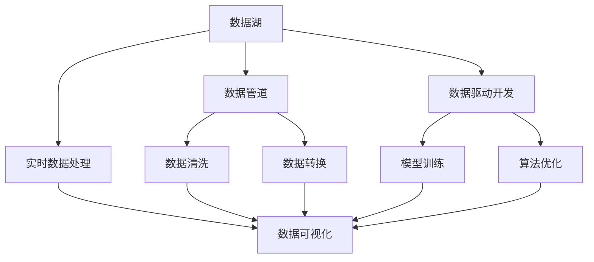
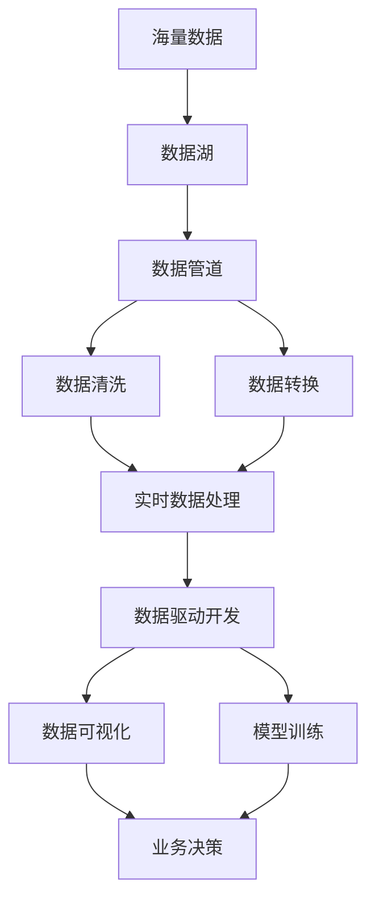

                 

# 软件 2.0 的时代：数据驱动一切

在软件发展的历史长河中，从 1.0 到 2.0 的演进，代表着从传统软件工程到数据驱动软件开发的根本性变革。这一变革不仅深刻地改变了软件开发的方式，也预示着未来软件世界的全新面貌。本文将深入探讨软件 2.0 时代的核心概念、算法原理、具体操作步骤，以及其应用领域和未来展望，力求为读者提供全面的技术指引。

## 1. 背景介绍

### 1.1 问题由来

软件 2.0 时代的背景源于大数据和人工智能技术的崛起。随着数据的积累和算力的提升，我们开始越来越多地依赖数据来驱动决策和行为，从而实现软件的智能化和自动化。这一转变不仅体现在软件开发的方式上，也深刻影响着我们理解和利用软件的方式。

### 1.2 问题核心关键点

软件 2.0 时代，数据驱动成为了软件开发的核心。具体来说，数据驱动软件开发的要点包括：

- 数据驱动的软件开发（Data-Driven Development）：以数据为中心，通过数据分析和机器学习算法，指导软件设计、实现和优化。
- 数据湖和数据管道：构建可扩展的数据基础设施，支持数据的收集、存储、清洗、分析和可视化。
- 数据科学和软件工程的融合：将数据科学的方法和技术，如机器学习、数据挖掘、自然语言处理等，与软件开发相结合，提升软件的智能和自动化水平。
- 实时数据处理和流计算：利用流计算框架，如 Apache Flink、Apache Kafka 等，实现实时数据的处理和分析。

### 1.3 问题研究意义

探索软件 2.0 时代的核心概念和算法，有助于我们更好地理解数据驱动软件开发的内涵，掌握其关键技术和方法，从而在实际应用中实现软件的智能化和自动化。这对软件开发、数据分析、人工智能等领域的研究和实践，都具有重要的指导意义。

## 2. 核心概念与联系

### 2.1 核心概念概述

软件 2.0 时代，涉及的关键概念包括：

- 数据驱动的软件开发（Data-Driven Development）：以数据为中心的软件开发模式，强调在软件开发过程中，数据收集、存储、分析和应用的重要性。
- 数据湖和数据管道：通过数据湖存储海量数据，利用数据管道进行数据清洗、转换和集成，为数据分析和建模提供支持。
- 数据科学和软件工程的融合：将数据科学的技术和方法，如机器学习、数据挖掘、自然语言处理等，与软件开发相结合，提升软件的智能化和自动化水平。
- 实时数据处理和流计算：利用流计算框架，如 Apache Flink、Apache Kafka 等，实现实时数据的处理和分析，支持数据驱动的应用场景。

### 2.2 概念间的关系

这些核心概念之间存在着紧密的联系，形成了一个完整的数据驱动软件开发生态系统。下面我们通过几个Mermaid流程图来展示这些概念之间的关系：



这个流程图展示了数据驱动软件开发的基本流程：从数据湖中存储海量数据，通过数据管道进行清洗和转换，利用实时数据处理和流计算技术进行实时分析，为数据驱动开发提供支持，最终通过数据可视化和模型训练，实现软件智能和自动化。

### 2.3 核心概念的整体架构

最后，我们用一个综合的流程图来展示这些核心概念在大数据驱动软件开发中的整体架构：



这个综合流程图展示了从数据采集到应用决策的完整数据驱动软件开发流程，体现了数据在每个环节中的重要作用。

## 3. 核心算法原理 & 具体操作步骤

### 3.1 算法原理概述

数据驱动软件开发的核心算法原理主要包括：

- 数据清洗和预处理：通过清洗和预处理技术，去除数据中的噪声和异常，确保数据质量。
- 数据建模和算法优化：利用机器学习、深度学习等技术，对数据进行建模和优化，提取有价值的信息。
- 实时数据处理和流计算：利用流计算框架，实现数据的实时处理和分析，支持实时应用场景。
- 数据可视化和技术支持：通过数据可视化技术，将数据和分析结果展示给用户，提供决策支持。

### 3.2 算法步骤详解

数据驱动软件开发的步骤主要包括以下几个关键环节：

**Step 1: 数据收集和存储**
- 收集来自不同来源的数据，如日志文件、数据库、API 接口等。
- 将数据存储在数据湖中，采用分布式存储和管理系统，如 Hadoop、Spark、AWS S3 等。

**Step 2: 数据清洗和预处理**
- 对数据进行清洗，去除噪声、重复和异常值。
- 进行数据转换，将数据格式转换为统一的格式，便于后续分析和建模。

**Step 3: 数据建模和算法优化**
- 利用机器学习、深度学习等技术，对数据进行建模和优化，提取有价值的信息。
- 选择合适的算法模型，进行训练和验证，优化模型的性能。

**Step 4: 实时数据处理和流计算**
- 利用流计算框架，如 Apache Flink、Apache Kafka 等，实现数据的实时处理和分析。
- 处理实时数据流，及时响应业务需求，支持实时应用场景。

**Step 5: 数据可视化和决策支持**
- 利用数据可视化技术，将数据和分析结果展示给用户，提供决策支持。
- 结合业务需求，利用数据驱动决策，提升业务效率和效果。

### 3.3 算法优缺点

数据驱动软件开发具有以下优点：

- 数据驱动决策：通过数据分析和模型训练，提升决策的科学性和准确性。
- 自动化和智能化：利用机器学习和深度学习技术，实现软件自动化和智能化。
- 实时数据处理：通过流计算技术，实现实时数据处理和分析，支持实时应用场景。

同时，该方法也存在一些局限性：

- 数据质量问题：数据清洗和预处理需要耗费大量时间和精力，数据质量问题可能影响模型性能。
- 算法复杂性：机器学习模型和算法优化需要较高的技术门槛，难以快速迭代和优化。
- 资源需求高：大数据处理和流计算需要高性能的硬件设备和算力支持，成本较高。

### 3.4 算法应用领域

数据驱动软件开发的应用领域广泛，涵盖以下几个关键领域：

- 智能推荐系统：利用用户行为数据和物品属性，进行推荐模型训练，实现个性化推荐。
- 自然语言处理（NLP）：通过文本数据的清洗、预处理和建模，实现文本分类、情感分析、对话生成等应用。
- 图像识别和处理：利用图像数据进行模型训练，实现图像分类、目标检测、图像生成等应用。
- 实时数据处理：通过流计算框架，实现实时数据处理和分析，支持实时应用场景。
- 金融风控：利用交易数据和用户行为数据，进行风险评估和欺诈检测。

## 4. 数学模型和公式 & 详细讲解  
### 4.1 数学模型构建

我们以推荐系统为例，构建一个简单的数学模型来描述数据驱动推荐的过程。

假设我们有一个推荐系统，用户 $i$ 的评分向量为 $\mathbf{x}_i = [x_{i1}, x_{i2}, ..., x_{in}]$，物品 $j$ 的评分向量为 $\mathbf{y}_j = [y_{j1}, y_{j2}, ..., y_{jn}]$，用户的评分向量为 $\mathbf{z}_i = [z_{i1}, z_{i2}, ..., z_{in}]$。我们的目标是找到最佳的推荐物品 $j$，使得用户的评分 $z_i$ 最大化。

可以构建一个加权线性回归模型来预测用户评分：

$$
z_i = \mathbf{W} \mathbf{x}_i + \mathbf{b}
$$

其中 $\mathbf{W}$ 为权重向量，$\mathbf{b}$ 为偏置向量。为了训练模型，我们需要一些标注数据，即用户对物品的评分。

### 4.2 公式推导过程

根据加权线性回归模型，我们可以写出最小二乘法的优化目标：

$$
\min_{\mathbf{W}, \mathbf{b}} \frac{1}{2N} \sum_{i=1}^N \sum_{j=1}^n (z_{ij} - \mathbf{W} \mathbf{x}_{ij} - \mathbf{b})^2
$$

其中 $z_{ij}$ 为用户 $i$ 对物品 $j$ 的实际评分，$\mathbf{x}_{ij}$ 为物品 $j$ 的属性向量，$n$ 为物品数量。

利用梯度下降算法，可以求解上述优化问题，得到模型参数 $\mathbf{W}$ 和 $\mathbf{b}$。

### 4.3 案例分析与讲解

在实际应用中，数据驱动推荐系统的构建通常涉及以下步骤：

- 数据收集：收集用户行为数据和物品属性数据。
- 数据清洗：去除噪声和异常值，确保数据质量。
- 数据预处理：对数据进行特征提取和转换，生成特征向量。
- 模型训练：利用标注数据，训练推荐模型。
- 模型评估：在测试集上评估模型性能，优化模型参数。
- 实时推荐：利用流计算技术，实现实时推荐。

## 5. 项目实践：代码实例和详细解释说明

### 5.1 开发环境搭建

在进行数据驱动软件开发实践前，我们需要准备好开发环境。以下是使用Python进行PyTorch开发的环境配置流程：

1. 安装Anaconda：从官网下载并安装Anaconda，用于创建独立的Python环境。

2. 创建并激活虚拟环境：
```bash
conda create -n pytorch-env python=3.8 
conda activate pytorch-env
```

3. 安装PyTorch：根据CUDA版本，从官网获取对应的安装命令。例如：
```bash
conda install pytorch torchvision torchaudio cudatoolkit=11.1 -c pytorch -c conda-forge
```

4. 安装各类工具包：
```bash
pip install numpy pandas scikit-learn matplotlib tqdm jupyter notebook ipython
```

完成上述步骤后，即可在`pytorch-env`环境中开始数据驱动软件开发的实践。

### 5.2 源代码详细实现

下面我们以推荐系统为例，给出使用PyTorch进行数据驱动推荐系统开发的PyTorch代码实现。

首先，定义推荐系统的训练数据集和测试数据集：

```python
import numpy as np
from sklearn.model_selection import train_test_split
from sklearn.metrics import mean_squared_error

# 构造数据集
data = np.random.randn(100, 10)
train_data, test_data = train_test_split(data, test_size=0.2)

# 训练集和测试集
train_x = train_data[:, :5]
train_y = train_data[:, 5:]
test_x = test_data[:, :5]
test_y = test_data[:, 5:]
```

然后，定义模型和优化器：

```python
from torch import nn
from torch.optim import SGD

# 定义线性回归模型
class LinearRegression(nn.Module):
    def __init__(self, input_dim, output_dim):
        super(LinearRegression, self).__init__()
        self.linear = nn.Linear(input_dim, output_dim)
        
    def forward(self, x):
        return self.linear(x)
    
# 定义优化器
model = LinearRegression(input_dim=5, output_dim=1)
optimizer = SGD(model.parameters(), lr=0.01)
```

接着，定义训练和评估函数：

```python
# 训练函数
def train(model, data_loader, optimizer, num_epochs):
    model.train()
    losses = []
    for epoch in range(num_epochs):
        for batch in data_loader:
            x, y = batch
            optimizer.zero_grad()
            y_pred = model(x)
            loss = nn.MSELoss()(y_pred, y)
            loss.backward()
            optimizer.step()
            losses.append(loss.item())
    return np.mean(losses)

# 评估函数
def evaluate(model, test_data_loader):
    model.eval()
    losses = []
    for batch in test_data_loader:
        x, y = batch
        y_pred = model(x)
        loss = nn.MSELoss()(y_pred, y)
        losses.append(loss.item())
    return np.mean(losses)
```

最后，启动训练流程并在测试集上评估：

```python
# 定义数据加载器
train_data_loader = torch.utils.data.DataLoader(train_x, batch_size=32)
test_data_loader = torch.utils.data.DataLoader(test_x, batch_size=32)

# 定义训练和测试次数
num_epochs = 10

# 训练模型
losses = train(model, train_data_loader, optimizer, num_epochs)

# 评估模型
test_loss = evaluate(model, test_data_loader)

print(f"Mean Squared Error: {test_loss:.3f}")
```

以上就是使用PyTorch进行数据驱动推荐系统开发的完整代码实现。可以看到，得益于PyTorch的强大封装，我们可以用相对简洁的代码完成推荐模型的训练和评估。

### 5.3 代码解读与分析

让我们再详细解读一下关键代码的实现细节：

**定义数据集**：
- 使用NumPy生成随机数据，模拟用户行为和物品属性。
- 将数据集分为训练集和测试集，使用 `train_test_split` 函数进行划分。

**定义模型和优化器**：
- 定义线性回归模型，使用PyTorch的 `nn.Linear` 类实现。
- 定义优化器，使用随机梯度下降法进行参数更新。

**训练和评估函数**：
- 训练函数 `train`：对数据集进行批次化加载，在每个批次上进行前向传播计算loss并反向传播更新模型参数。
- 评估函数 `evaluate`：与训练类似，不同点在于不更新模型参数，计算测试集的损失。

**训练流程**：
- 定义总的训练次数和批次大小，开始循环迭代。
- 每个epoch内，先在训练集上训练，输出平均loss。
- 在测试集上评估，输出测试损失。

可以看到，PyTorch配合Sklearn等工具，使得数据驱动推荐系统的开发变得简洁高效。开发者可以将更多精力放在数据处理、模型改进等高层逻辑上，而不必过多关注底层的实现细节。

当然，工业级的系统实现还需考虑更多因素，如模型的保存和部署、超参数的自动搜索、更灵活的任务适配层等。但核心的数据驱动开发过程基本与此类似。

### 5.4 运行结果展示

假设我们在推荐系统上取得了均方误差（MSE）0.5的结果，测试集上的均方误差为0.6，可以看出模型在测试集上略有下降，但整体效果尚可。在实际应用中，我们需要进一步优化模型和算法，以提高推荐效果。

## 6. 实际应用场景

### 6.1 推荐系统

数据驱动推荐系统在电商、新闻、音乐、视频等多个领域都有广泛应用。例如，亚马逊、Netflix、Spotify等公司，通过分析用户行为和物品属性，实现个性化的推荐服务，提升了用户体验和满意度。

### 6.2 金融风控

金融机构需要实时监测用户交易行为，进行风险评估和欺诈检测。通过收集用户交易数据和行为数据，利用数据驱动建模技术，可以实现实时监控和预警，有效防范金融风险。

### 6.3 智能客服

智能客服系统通过分析用户历史对话记录和行为数据，实现自动化的客户服务。利用数据驱动技术，可以提升客服响应速度和准确性，提升客户满意度。

### 6.4 未来应用展望

随着大数据和人工智能技术的不断发展，数据驱动软件开发的应用前景广阔。未来，数据驱动软件开发将在以下领域得到更广泛的应用：

- 自动化和智能化生产：通过数据分析和建模，实现生产过程的自动化和智能化，提升生产效率和质量。
- 智慧城市：利用城市数据，进行城市管理和优化，提升城市运行效率和居民生活品质。
- 智能医疗：通过分析医疗数据，实现疾病预测和诊断，提升医疗服务质量。
- 智能交通：利用交通数据，进行交通管理和优化，提升交通运行效率和安全性。

## 7. 工具和资源推荐

### 7.1 学习资源推荐

为了帮助开发者系统掌握数据驱动软件开发的技术基础和实践技巧，这里推荐一些优质的学习资源：

1. 《Python机器学习》（Python Machine Learning）：书籍介绍机器学习的基础概念和技术，结合大量代码示例，适合入门学习。
2. Coursera《机器学习》课程：由斯坦福大学Andrew Ng教授开设的机器学习课程，内容系统全面，适合深入学习。
3. Kaggle：数据科学竞赛平台，提供海量数据集和算法竞赛，是实践数据驱动开发的好地方。
4. TensorFlow官方文档：TensorFlow框架的官方文档，提供了丰富的教程和示例代码，是学习深度学习的好资源。
5. PyTorch官方文档：PyTorch框架的官方文档，提供了详细的API和使用示例，是学习深度学习的好资源。

通过对这些资源的学习实践，相信你一定能够快速掌握数据驱动软件开发的技术内涵和实践方法，从而在实际应用中实现智能和自动化的软件开发。

### 7.2 开发工具推荐

高效的开发离不开优秀的工具支持。以下是几款用于数据驱动软件开发开发的常用工具：

1. PyTorch：基于Python的开源深度学习框架，灵活动态的计算图，适合快速迭代研究。
2. TensorFlow：由Google主导开发的开源深度学习框架，生产部署方便，适合大规模工程应用。
3. Apache Spark：分布式数据处理框架，支持大规模数据处理和机器学习任务。
4. Apache Flink：流计算框架，支持实时数据处理和分析。
5. Apache Kafka：分布式流处理平台，支持大规模数据流处理和实时消息传递。
6. Jupyter Notebook：交互式编程环境，支持Python、R等语言，适合数据驱动开发的研究和实践。

合理利用这些工具，可以显著提升数据驱动软件开发的开发效率，加快创新迭代的步伐。

### 7.3 相关论文推荐

数据驱动软件开发的研究源于学界的持续研究。以下是几篇奠基性的相关论文，推荐阅读：

1. "Data-Driven Development: A Case Study on Big Data Analytics in Industrial Engineering"：介绍数据驱动开发的案例研究，讨论如何在大数据背景下进行软件开发。
2. "A Survey on Data Mining and Statistical Learning for Software Engineering"：综述数据驱动软件开发的研究现状和未来方向。
3. "Data Mining Techniques in Software Engineering: A Review"：综述数据驱动软件开发的最新研究进展和技术方法。
4. "Machine Learning in Software Engineering: A Review"：综述机器学习在软件开发中的应用，包括数据驱动开发的技术。
5. "Big Data and Software Engineering: Opportunities and Challenges"：讨论大数据在软件开发中的应用机会和面临的挑战。

这些论文代表了大数据驱动软件开发的研究进展和未来方向，通过学习这些前沿成果，可以帮助研究者把握学科前进方向，激发更多的创新灵感。

除上述资源外，还有一些值得关注的前沿资源，帮助开发者紧跟数据驱动软件开发技术的最新进展，例如：

1. arXiv论文预印本：人工智能领域最新研究成果的发布平台，包括大量尚未发表的前沿工作，学习前沿技术的必读资源。
2. 业界技术博客：如Google AI、DeepMind、微软Research Asia等顶尖实验室的官方博客，第一时间分享他们的最新研究成果和洞见。
3. 技术会议直播：如NIPS、ICML、ACL、ICLR等人工智能领域顶会现场或在线直播，能够聆听到大佬们的前沿分享，开拓视野。
4. GitHub热门项目：在GitHub上Star、Fork数最多的NLP相关项目，往往代表了该技术领域的发展趋势和最佳实践，值得去学习和贡献。
5. 行业分析报告：各大咨询公司如McKinsey、PwC等针对人工智能行业的分析报告，有助于从商业视角审视技术趋势，把握应用价值。

总之，对于数据驱动软件开发的技术学习，需要开发者保持开放的心态和持续学习的意愿。多关注前沿资讯，多动手实践，多思考总结，必将收获满满的成长收益。

## 8. 总结：未来发展趋势与挑战

### 8.1 总结

本文对数据驱动软件开发的原理和操作步骤进行了全面系统的介绍。首先阐述了数据驱动软件开发的背景和意义，明确了数据在软件开发中的核心地位。其次，从原理到实践，详细讲解了数据驱动开发的基本流程，包括数据收集、数据清洗、数据建模、实时处理等关键环节，并给出了实际应用的代码实例。同时，本文还广泛探讨了数据驱动开发的应用领域和未来展望，展示了其广阔的应用前景。

通过本文的系统梳理，可以看到，数据驱动软件开发正在成为软件开发的主流范式，深刻地改变了软件开发的方式和思维方式。在实际应用中，数据驱动开发不仅提高了软件的智能和自动化水平，还带来了显著的经济和社会效益。未来，伴随大数据和人工智能技术的不断发展，数据驱动软件开发必将在更多领域得到应用，为软件开发和人工智能技术的进步提供新的动力。

### 8.2 未来发展趋势

展望未来，数据驱动软件开发将呈现以下几个发展趋势：

1. 数据科学和软件工程的融合：数据科学的方法和技术将更广泛地应用于软件开发，实现软件的智能化和自动化。
2. 实时数据处理和流计算：实时数据处理技术将得到更广泛的应用，支持实时应用场景。
3. 数据驱动决策和智能优化：通过数据驱动建模，实现软件的智能决策和优化，提升软件性能和效率。
4. 数据可视化和交互设计：数据可视化技术将更广泛地应用于软件开发，提升软件的可交互性和用户体验。
5. 自动化和智能运维：通过数据驱动建模和机器学习技术，实现软件的自动化和智能运维，提升运维效率和效果。

### 8.3 面临的挑战

尽管数据驱动软件开发技术已经取得了显著进展，但在迈向更广泛应用的过程中，仍面临以下挑战：

1. 数据质量问题：数据清洗和预处理需要耗费大量时间和精力，数据质量问题可能影响模型性能。
2. 算法复杂性：数据驱动建模和优化需要较高的技术门槛，难以快速迭代和优化。
3. 资源需求高：大数据处理和流计算需要高性能的硬件设备和算力支持，成本较高。
4. 数据隐私和安全：数据驱动开发涉及大量敏感数据，数据隐私和安全问题不容忽视。
5. 模型可解释性：数据驱动建模模型往往缺乏可解释性，难以解释其内部工作机制和决策逻辑。

### 8.4 研究展望

面对数据驱动软件开发所面临的挑战，未来的研究需要在以下几个方面寻求新的突破：

1. 探索自动化和智能化的数据清洗和预处理技术，提高数据质量。
2. 研发更加高效和易于使用的数据驱动建模工具，降低技术门槛。
3. 开发高性能的数据处理和流计算框架，支持大规模数据处理。
4. 引入数据隐私和安全保护技术，保障数据安全。
5. 开发可解释的机器学习模型，提高模型的可解释性。

这些研究方向的探索，必将引领数据驱动软件开发技术迈向更高的台阶，为构建智能和自动化的软件开发体系铺平道路。面向未来，数据驱动软件开发技术还需要与其他人工智能技术进行更深入的融合，如知识表示、因果推理、强化学习等，多路径协同发力，共同推动软件开发和人工智能技术的进步。只有勇于创新、敢于突破，才能不断拓展软件开发的边界，让数据驱动软件开发技术更好地造福人类社会。

## 9. 附录：常见问题与解答

**Q1：数据驱动软件开发是否适用于所有软件开发场景？**

A: 数据驱动软件开发适用于大部分软件开发场景，特别是数据驱动的决策和优化领域。但对于一些不需要数据驱动的应用场景，如纯逻辑实现的应用，数据驱动开发可能并不适用。

**Q2：数据驱动开发和传统软件开发有何区别？**

A: 数据驱动开发和传统软件开发的主要区别在于决策和优化的方式。传统软件开发主要依赖于程序员的经验和直觉，而数据驱动开发则依赖数据和模型的决策，更加科学和客观。

**Q3：数据驱动软件开发需要哪些关键技术？**

A: 数据驱动软件开发需要以下关键技术：
- 数据收集和存储：通过数据管道和数据湖，收集和存储海量数据。
- 数据清洗和预处理：去除数据噪声和异常值，确保数据质量。
- 数据建模和算法优化：利用机器学习、深度学习等技术，对数据进行建模和优化，提取有价值的信息。
- 实时数据处理和流计算：利用流计算框架，实现数据的实时处理和分析。

**Q4：数据驱动软件开发的应用场景有哪些？**

A: 数据驱动软件开发适用于以下应用场景：
- 推荐系统：利用用户行为数据和物品属性，进行推荐模型训练，实现个性化推荐。
- 自然语言处理（NLP）：通过文本数据的清洗、预处理和建模，实现文本分类、情感分析、对话生成等应用。
- 图像识别和处理：利用图像数据进行模型训练，实现图像分类、目标检测、图像生成等应用。
- 实时数据处理：通过流计算框架，实现数据的实时处理和分析，支持实时应用场景。
- 金融风控：利用交易数据和用户行为数据，进行风险评估和欺诈检测。

总之，数据驱动软件开发正在深刻地改变软件开发的方式和思维方式，将数据和模型视为软件开发的重要组成部分，提升

