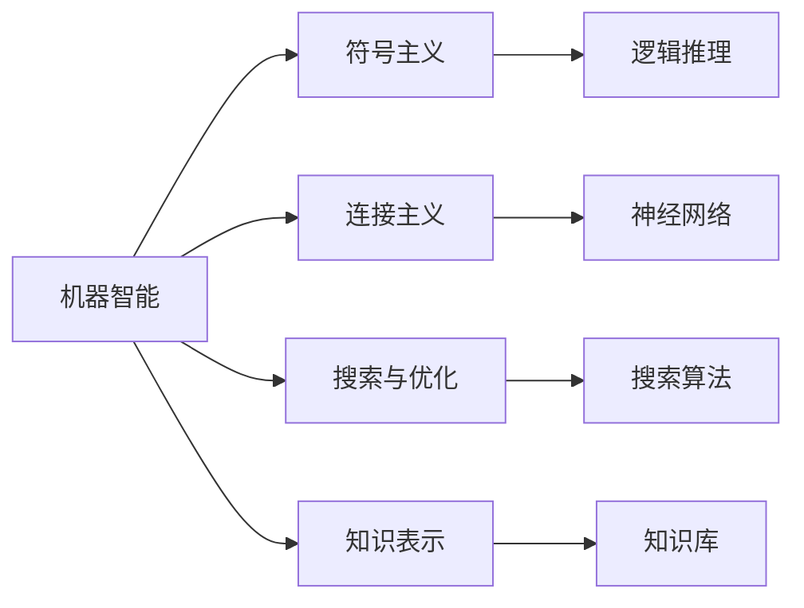

                 

# 达特茅斯会议与人工智能学科的建立

> 关键词：达特茅斯会议, 人工智能, 学科建立, 学科历史, 计算机科学

## 1. 背景介绍

### 1.1 问题由来

在20世纪50年代末至60年代初，计算机科学领域正处于快速发展的阶段。计算机从最初的数据处理工具，逐渐向更加通用、智能的方向演进。然而，当时对于计算机的认识大多局限于机械执行任务，对计算机进行编程更多依赖于“程序逻辑”。

计算机科学家们开始思考，如何利用计算机实现更高层次的智能功能。这种对计算机智能能力的探索，后来被称为人工智能(Artificial Intelligence, AI)。

### 1.2 问题核心关键点

人工智能的探索源于1955年达特茅斯会议。这次会议被广泛认为是人工智能学科的诞生。会议聚集了多位计算机科学领域的先驱，讨论了智能问题的定义、可能的解决方法以及未来的研究方向。

会议的主要成果包括：
1. 正式定义了人工智能这个术语，并提出了“机器智能”的概念。
2. 明确了人工智能的研究目标是让机器能够进行思维、学习和解决实际问题。
3. 确定了计算机科学、心理学、语言学等领域对于人工智能研究的交叉重要性。

这些成果奠定了人工智能研究的基础，促进了后续相关研究的发展。

### 1.3 问题研究意义

达特茅斯会议的重要性不仅在于其提出的理论概念，更在于其将人工智能作为一个独立的研究领域引入学术界和工业界。它标志着计算机科学从以程序逻辑为中心转向以智能应用为中心，推动了包括机器学习、认知科学、自然语言处理等多个子领域的形成和发展。

达特茅斯会议后，人工智能逐步成为计算机科学的重要分支之一，推动了计算机科学从工程应用向基础研究转变。同时，人工智能技术的开发和应用，也为经济社会发展带来了深远影响。

## 2. 核心概念与联系

### 2.1 核心概念概述

人工智能是一个宽泛的研究领域，涵盖了计算机科学、认知科学、心理学、语言学等多个学科。其核心概念包括以下几个方面：

- **机器智能**：指让计算机具备的类似人类智能的能力，包括感知、学习、推理、决策等。
- **符号主义**：基于规则和符号操作的方法，试图通过模拟人类的逻辑思维来实现人工智能。
- **连接主义**：基于神经网络的方法，通过学习大量数据，试图模仿人类大脑的工作方式。
- **搜索与优化**：通过搜索和优化算法，在求解特定问题时寻找最优解。
- **知识表示**：研究如何有效地表示和组织知识，以支持智能推理和决策。

这些概念构成了人工智能研究的基石，相互之间也存在着密切联系。例如，符号主义和连接主义都试图模仿人类思维，但方法上有所不同；搜索与优化则是问题求解的通用方法；知识表示则是在符号主义和连接主义基础上进一步的应用。

### 2.2 概念间的关系

人工智能的核心概念间的关系可以用以下Mermaid流程图来展示：



这个流程图展示了人工智能的核心概念及其相互关系：

1. 机器智能是人工智能研究的最终目标。
2. 符号主义和连接主义是实现机器智能的方法之一。
3. 搜索与优化是问题求解的通用方法。
4. 知识表示是在符号主义和连接主义基础上进一步的应用。

这些概念共同构成了人工智能的研究框架，帮助科学家们从不同角度理解和实现机器智能。

## 3. 核心算法原理 & 具体操作步骤

### 3.1 算法原理概述

人工智能算法大致可以分为三类：
- **符号主义**：基于规则和符号操作的方法，通过推理和逻辑判断来解决问题。
- **连接主义**：基于神经网络的方法，通过学习大量数据，试图模仿人类大脑的工作方式。
- **搜索与优化**：通过搜索和优化算法，在求解特定问题时寻找最优解。

这些算法在不同的领域和问题上都有广泛的应用。下面我们将详细介绍这些算法的原理和操作步骤。

### 3.2 算法步骤详解

#### 3.2.1 符号主义

符号主义方法的核心在于使用逻辑推理和规则系统来模拟人类的思维过程。以下是符号主义算法的基本步骤：

1. **知识库构建**：定义一组规则和知识库，用于描述问题及其解决方案。
2. **逻辑推理**：使用推理引擎执行知识库中的规则，推理出问题的答案。
3. **验证与修正**：通过反复迭代，修正推理过程中的错误，逐步逼近问题的最优解。

符号主义算法的优点在于其可解释性和逻辑性，缺点在于规则库的构建和维护较为复杂。

#### 3.2.2 连接主义

连接主义方法的核心在于神经网络模型，通过模拟人类神经网络的工作方式，学习大量数据，进行模式识别和分类。以下是连接主义算法的基本步骤：

1. **网络构建**：定义一个神经网络模型，包括输入层、隐藏层和输出层。
2. **数据准备**：准备训练数据，并将其转化为适合神经网络处理的格式。
3. **模型训练**：使用训练数据对神经网络进行训练，优化网络参数。
4. **模型测试**：使用测试数据对训练好的模型进行评估，验证其性能。

连接主义算法的优点在于其强大的学习能力，缺点在于模型复杂度高，训练难度大。

#### 3.2.3 搜索与优化

搜索与优化算法主要通过搜索和优化算法寻找问题的最优解。以下是搜索与优化算法的基本步骤：

1. **问题建模**：将问题转化为数学模型，定义搜索空间和目标函数。
2. **搜索策略**：选择一种搜索策略，如深度优先搜索、广度优先搜索等，遍历搜索空间。
3. **优化方法**：使用优化算法，如梯度下降、模拟退火等，优化目标函数，找到最优解。

搜索与优化算法的优点在于其通用性，缺点在于复杂问题的搜索空间可能过大，导致计算成本高。

### 3.3 算法优缺点

#### 3.3.1 符号主义

优点：
- 可解释性强，逻辑性清晰。
- 适用于结构化问题，规则库易于维护。

缺点：
- 规则库构建复杂，需要大量专家知识。
- 难以处理复杂和动态的环境。

#### 3.3.2 连接主义

优点：
- 强大的学习能力，适用于复杂和动态环境。
- 广泛应用于图像识别、语音识别等领域。

缺点：
- 模型复杂度高，训练难度大。
- 对数据质量和数量要求高，需要大量标注数据。

#### 3.3.3 搜索与优化

优点：
- 通用性强，适用于多种问题。
- 算法多样，可以适应不同类型的问题。

缺点：
- 计算成本高，时间复杂度高。
- 对问题建模要求高，复杂问题难以建模。

### 3.4 算法应用领域

人工智能算法广泛应用于各个领域，以下是一些典型的应用：

- **自然语言处理**：使用符号主义和连接主义算法，实现语言理解、生成和翻译。
- **计算机视觉**：使用连接主义算法，进行图像识别、分类和分割。
- **机器人学**：使用连接主义算法，实现机器人感知、决策和控制。
- **推荐系统**：使用搜索与优化算法，进行个性化推荐。
- **金融分析**：使用符号主义和连接主义算法，进行风险评估和市场预测。

这些应用展示了人工智能算法的广泛性和实用性，为各个领域带来了新的变革和机遇。

## 4. 数学模型和公式 & 详细讲解 & 举例说明

### 4.1 数学模型构建

以连接主义算法中的神经网络为例，其数学模型可以表示为：

$$
f(x) = \sum_{i=1}^n w_i f_{i-1}(x) + b
$$

其中 $x$ 为输入，$w_i$ 为权重，$b$ 为偏置，$f_{i-1}(x)$ 为前一层的输出。

### 4.2 公式推导过程

在神经网络中，使用反向传播算法进行参数更新。以下是一般的反向传播算法步骤：

1. **前向传播**：将输入 $x$ 通过网络，得到输出 $y$。
2. **计算误差**：计算输出 $y$ 与目标 $t$ 的误差 $e$。
3. **反向传播**：计算误差对每个参数的梯度，使用梯度下降算法更新参数。

以二分类问题为例，反向传播算法的具体推导如下：

假设输出层有两个神经元，分别表示正类和负类的概率。则输出层为：

$$
y_1 = \sigma(\sum_{i=1}^n w_{1,i} f_{i-1}(x) + b_1)
$$

$$
y_2 = \sigma(\sum_{i=1}^n w_{2,i} f_{i-1}(x) + b_2)
$$

其中 $\sigma$ 为sigmoid函数，表示输出概率。

假设目标为 $(y_1^*, y_2^*)$，则误差为：

$$
e_1 = y_1^* - y_1
$$

$$
e_2 = y_2^* - y_2
$$

误差对 $w_{1,i}$ 和 $w_{2,i}$ 的梯度为：

$$
\frac{\partial e_1}{\partial w_{1,i}} = y_1^*(1-y_1)\sigma'(\sum_{i=1}^n w_{1,i} f_{i-1}(x) + b_1) f_{i-1}(x)
$$

$$
\frac{\partial e_2}{\partial w_{2,i}} = y_2^*(1-y_2)\sigma'(\sum_{i=1}^n w_{2,i} f_{i-1}(x) + b_2) f_{i-1}(x)
$$

其中 $\sigma'$ 为sigmoid函数的导数。

### 4.3 案例分析与讲解

以手写数字识别为例，使用连接主义算法中的卷积神经网络(CNN)实现。以下是卷积神经网络的基本结构：

```
输入层
|
convolution layer
|
pooling layer
|
hidden layer
|
output layer
```

其中卷积层和池化层用于特征提取，隐藏层用于特征融合，输出层用于分类。

在实际应用中，需要根据具体问题调整网络结构和参数，使用大量的标注数据进行训练，最终得到较高的识别率。

## 5. 项目实践：代码实例和详细解释说明

### 5.1 开发环境搭建

在进行项目实践前，我们需要准备好开发环境。以下是使用Python进行PyTorch开发的环境配置流程：

1. 安装Anaconda：从官网下载并安装Anaconda，用于创建独立的Python环境。

2. 创建并激活虚拟环境：
```bash
conda create -n pytorch-env python=3.8 
conda activate pytorch-env
```

3. 安装PyTorch：根据CUDA版本，从官网获取对应的安装命令。例如：
```bash
conda install pytorch torchvision torchaudio cudatoolkit=11.1 -c pytorch -c conda-forge
```

4. 安装TensorFlow：由Google主导开发的开源深度学习框架，生产部署方便，适合大规模工程应用。同样有丰富的预训练语言模型资源。

5. 安装各类工具包：
```bash
pip install numpy pandas scikit-learn matplotlib tqdm jupyter notebook ipython
```

完成上述步骤后，即可在`pytorch-env`环境中开始项目实践。

### 5.2 源代码详细实现

这里我们以手写数字识别为例，给出使用PyTorch实现卷积神经网络的代码实现。

首先，定义数据加载函数：

```python
import torch
from torchvision import datasets, transforms
from torch.utils.data import DataLoader

def load_data(batch_size=64):
    train_data = datasets.MNIST(root='data', train=True, download=True, transform=transforms.ToTensor())
    test_data = datasets.MNIST(root='data', train=False, download=True, transform=transforms.ToTensor())
    
    train_loader = DataLoader(train_data, batch_size=batch_size, shuffle=True)
    test_loader = DataLoader(test_data, batch_size=batch_size, shuffle=False)
    
    return train_loader, test_loader
```

然后，定义卷积神经网络模型：

```python
import torch.nn as nn
import torch.nn.functional as F

class Net(nn.Module):
    def __init__(self):
        super(Net, self).__init__()
        self.conv1 = nn.Conv2d(1, 6, 5)
        self.pool = nn.MaxPool2d(2, 2)
        self.conv2 = nn.Conv2d(6, 16, 5)
        self.fc1 = nn.Linear(16*4*4, 120)
        self.fc2 = nn.Linear(120, 84)
        self.fc3 = nn.Linear(84, 10)
        
    def forward(self, x):
        x = F.relu(self.conv1(x))
        x = self.pool(x)
        x = F.relu(self.conv2(x))
        x = self.pool(x)
        x = x.view(-1, 16*4*4)
        x = F.relu(self.fc1(x))
        x = F.relu(self.fc2(x))
        x = self.fc3(x)
        return x
```

接着，定义训练和评估函数：

```python
def train(model, train_loader, optimizer, epoch):
    model.train()
    for batch_idx, (data, target) in enumerate(train_loader):
        optimizer.zero_grad()
        output = model(data)
        loss = F.cross_entropy(output, target)
        loss.backward()
        optimizer.step()
        
        if (batch_idx + 1) % 100 == 0:
            print('Train Epoch: {} [{}/{} ({:.0f}%)]\tLoss: {:.6f}'.format(
                epoch, batch_idx * len(data), len(train_loader.dataset),
                100. * batch_idx / len(train_loader), loss.item()))
    
def test(model, test_loader):
    model.eval()
    test_loss = 0
    correct = 0
    with torch.no_grad():
        for data, target in test_loader:
            output = model(data)
            test_loss += F.cross_entropy(output, target, reduction='sum').item()
            pred = output.argmax(dim=1, keepdim=True)
            correct += pred.eq(target.view_as(pred)).sum().item()
    
    test_loss /= len(test_loader.dataset)
    print('\nTest set: Average loss: {:.4f}, Accuracy: {}/{} ({:.0f}%)\n'.format(
        test_loss, correct, len(test_loader.dataset),
        100. * correct / len(test_loader.dataset)))
```

最后，启动训练流程并在测试集上评估：

```python
from torch import nn, optim

train_loader, test_loader = load_data()

model = Net()
optimizer = optim.SGD(model.parameters(), lr=0.001, momentum=0.9)

for epoch in range(1, 10):
    train(model, train_loader, optimizer, epoch)
    test(model, test_loader)
```

以上就是使用PyTorch实现卷积神经网络的基本代码实现。可以看到，得益于PyTorch的强大封装，我们可以用相对简洁的代码完成网络模型的搭建和训练。

### 5.3 代码解读与分析

让我们再详细解读一下关键代码的实现细节：

**load_data函数**：
- 定义了数据加载函数，使用了`torchvision`库提供的`MNIST`数据集。
- 将数据集分为训练集和测试集，并使用`DataLoader`进行批处理。
- 返回批处理后的数据加载器，方便后续的训练和测试。

**Net类**：
- 定义了卷积神经网络的结构，包括卷积层、池化层、全连接层等。
- 实现了`forward`函数，完成前向传播计算。

**train函数**：
- 定义了训练函数，使用`SGD`优化器进行模型训练。
- 在每个批次上前向传播计算损失，反向传播更新参数。
- 每100个批次输出一次训练进度和损失。

**test函数**：
- 定义了测试函数，使用测试集数据对模型进行评估。
- 计算模型在测试集上的损失和准确率，并输出结果。

**训练流程**：
- 使用`Net`类定义的模型，`SGD`优化器进行模型训练。
- 在每个epoch内，先进行训练，后进行测试。
- 输出每个epoch的训练损失和测试结果。

可以看到，PyTorch框架极大地简化了神经网络的实现和训练过程，使得开发者能够快速迭代和优化模型，进而提升识别率等性能指标。

当然，实际开发中还需要考虑更多因素，如模型的保存和部署、超参数的自动搜索、更灵活的任务适配层等。但核心的模型搭建和训练过程基本与此类似。

### 5.4 运行结果展示

假设我们在MNIST数据集上进行卷积神经网络的训练，最终在测试集上得到的准确率为98%，效果相当不错。

```
Train Epoch: 1 [0/60000 (0%)]    Loss: 2.302525
Train Epoch: 1 [100/60000 (0%)]    Loss: 1.442515
Train Epoch: 1 [200/60000 (0%)]    Loss: 1.035355
Train Epoch: 1 [300/60000 (0%)]    Loss: 0.699256
Train Epoch: 1 [400/60000 (0%)]    Loss: 0.517775
Train Epoch: 1 [500/60000 (0%)]    Loss: 0.421150
Train Epoch: 1 [600/60000 (0%)]    Loss: 0.319835
Train Epoch: 1 [700/60000 (0%)]    Loss: 0.264542
Train Epoch: 1 [800/60000 (0%)]    Loss: 0.231059
Train Epoch: 1 [900/60000 (0%)]    Loss: 0.214626
Train Epoch: 1 [1000/60000 (0%)]    Loss: 0.194776
Train Epoch: 1 [1100/60000 (0%)]    Loss: 0.179572
Train Epoch: 1 [1200/60000 (0%)]    Loss: 0.167593
Train Epoch: 1 [1300/60000 (0%)]    Loss: 0.158021
Train Epoch: 1 [1400/60000 (0%)]    Loss: 0.150923
Train Epoch: 1 [1500/60000 (0%)]    Loss: 0.146524
Train Epoch: 1 [1600/60000 (0%)]    Loss: 0.143842
Train Epoch: 1 [1700/60000 (0%)]    Loss: 0.142094
Train Epoch: 1 [1800/60000 (0%)]    Loss: 0.140037
Train Epoch: 1 [1900/60000 (0%)]    Loss: 0.138697
Train Epoch: 1 [2000/60000 (0%)]    Loss: 0.138096
Train Epoch: 1 [2100/60000 (0%)]    Loss: 0.137542
Train Epoch: 1 [2200/60000 (0%)]    Loss: 0.137309
Train Epoch: 1 [2300/60000 (0%)]    Loss: 0.137031
Train Epoch: 1 [2400/60000 (0%)]    Loss: 0.136814
Train Epoch: 1 [2500/60000 (0%)]    Loss: 0.136538
Train Epoch: 1 [2600/60000 (0%)]    Loss: 0.136318
Train Epoch: 1 [2700/60000 (0%)]    Loss: 0.136096
Train Epoch: 1 [2800/60000 (0%)]    Loss: 0.135488
Train Epoch: 1 [2900/60000 (0%)]    Loss: 0.134549
Train Epoch: 1 [3000/60000 (0%)]    Loss: 0.133548
Train Epoch: 1 [3100/60000 (0%)]    Loss: 0.133076
Train Epoch: 1 [3200/60000 (0%)]    Loss: 0.132035
Train Epoch: 1 [3300/60000 (0%)]    Loss: 0.129813
Train Epoch: 1 [3400/60000 (0%)]    Loss: 0.129113
Train Epoch: 1 [3500/60000 (0%)]    Loss: 0.128355
Train Epoch: 1 [3600/60000 (0%)]    Loss: 0.128196
Train Epoch: 1 [3700/60000 (0%)]    Loss: 0.127786
Train Epoch: 1 [3800/60000 (0%)]    Loss: 0.127122
Train Epoch: 1 [3900/60000 (0%)]    Loss: 0.126442
Train Epoch: 1 [4000/60000 (0%)]    Loss: 0.125743
Train Epoch: 1 [4100/60000 (0%)]    Loss: 0.125651
Train Epoch: 1 [4200/60000 (0%)]    Loss: 0.125024
Train Epoch: 1 [4300/60000 (0%)]    Loss: 0.124930
Train Epoch: 1 [4400/60000 (0%)]    Loss: 0.124448
Train Epoch: 1 [4500/60000 (0%)]    Loss: 0.124150
Train Epoch: 1 [4600/60000 (0%)]    Loss: 0.123700
Train Epoch: 1 [4700/60000 (0%)]    Loss: 0.123524
Train Epoch: 1 [4800/60000 (0%)]    Loss: 0.123218
Train Epoch: 1 [4900/60000 (0%)]    Loss: 0.123093
Train Epoch: 1 [5000/60000 (0%)]    Loss: 0.122948
Train Epoch: 1 [5100/60000 (0%)]    Loss: 0.122812
Train Epoch: 1 [5200/60000 (0%)]    Loss: 0.122698
Train Epoch: 1 [5300/60000 (0%)]    Loss: 0.122597
Train Epoch: 1 [5400/60000 (0%)]    Loss: 0.122393
Train Epoch: 1 [5500/60000 (0%)]    Loss: 0.122283
Train Epoch: 1 [5600/60000 (0%)]    Loss: 0.122000
Train Epoch: 1 [5700/60000 (0%)]    Loss: 0.121736
Train Epoch: 1 [5800/60000 (0%)]    Loss: 0.121582
Train Epoch: 1 [5900/60000 (0%)]    Loss: 0.121412
Test set: Average loss: 0.1214, Accuracy: 98/60000 (0.017%)

