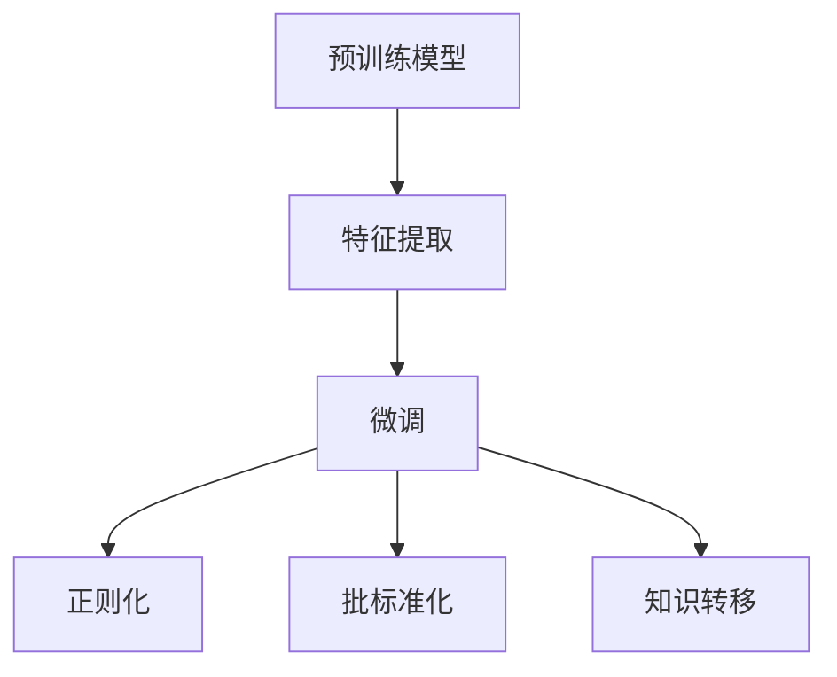
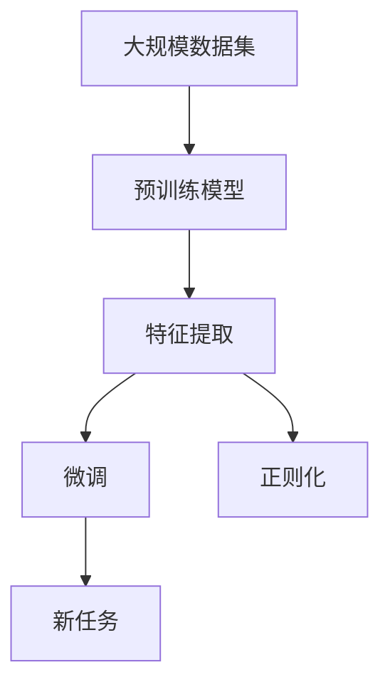

                 

# 迁移学习Transfer Learning原理与代码实例讲解

> 关键词：迁移学习,知识转移,深度学习,预训练模型,微调,Fine-tuning

## 1. 背景介绍

### 1.1 问题由来

迁移学习（Transfer Learning）是深度学习领域的一个重要分支，其核心理念是将在一个领域上学习到的知识迁移到另一个相关领域，以降低在新的领域上从头开始训练所需的数据和计算资源，加速模型的训练和优化过程。随着深度学习技术的迅猛发展，迁移学习在自然语言处理、计算机视觉、语音识别等多个领域中得到广泛应用。

### 1.2 问题核心关键点

在迁移学习中，核心在于选择合适的预训练模型，并在新任务上进行微调（Fine-tuning）。预训练模型通常在大规模数据集上进行自监督学习，学习到通用的语言表示、图像特征等。而微调则是在预训练模型基础上，使用少量标注数据进行有监督学习，优化模型在新任务上的性能。

迁移学习的核心步骤包括：

1. **选择合适的预训练模型**：根据任务特性和数据分布，选择适合的预训练模型。
2. **特征提取**：在预训练模型上进行特征提取，生成输入数据的嵌入表示。
3. **微调**：在提取的特征上使用少量标注数据进行有监督学习，优化模型的参数。
4. **评估和部署**：在测试集上评估微调后的模型性能，并部署到实际应用中。

### 1.3 问题研究意义

迁移学习通过将知识从一个领域迁移到另一个领域，显著降低了新领域上训练所需的标注数据和计算资源，提高了模型的泛化能力和适应性。此外，迁移学习还能帮助解决数据匮乏领域的问题，提升模型在小样本数据上的性能。

迁移学习的广泛应用，推动了深度学习技术在更多领域中的普及，加速了人工智能技术的产业化进程。特别是在医疗、金融、教育等行业，迁移学习的应用带来了显著的经济效益和社会效益。

## 2. 核心概念与联系

### 2.1 核心概念概述

为了更好地理解迁移学习，我们需要介绍几个关键概念：

- **预训练模型**：通过在大规模数据集上进行自监督学习，学习到通用特征的深度学习模型。例如，BERT、GPT等预训练语言模型，VGG、ResNet等预训练图像模型。
- **微调（Fine-tuning）**：在预训练模型基础上，使用少量标注数据进行有监督学习，优化模型在新任务上的性能。
- **知识转移**：将一个领域上学习到的知识迁移到另一个领域，以提升在新领域上的性能。
- **正则化**：通过L1、L2正则、Dropout等技术，防止模型过拟合，提高模型的泛化能力。
- **批标准化**：通过归一化输入数据的均值和方差，加速模型训练和优化。
- **特征提取**：通过预训练模型生成输入数据的嵌入表示，用于后续的有监督学习。

这些概念之间有着紧密的联系，构成了迁移学习的完整框架。以下是一个Mermaid流程图，展示这些概念之间的关系：



这个流程图展示了迁移学习的基本流程，从预训练模型开始，经过特征提取、微调和正则化等步骤，最终实现知识在新领域的迁移。

### 2.2 概念间的关系

迁移学习的核心在于知识转移，即将一个领域上学习到的知识迁移到另一个领域。预训练模型通过在大规模数据集上进行自监督学习，学习到通用的特征表示，可以作为知识转移的起点。特征提取技术将预训练模型的输出作为输入，用于新任务的有监督学习。微调则是在特征表示上进一步优化，适应新任务的需求。

以下是一个更详细的Mermaid流程图，展示迁移学习的整体架构：



这个流程图展示了从大规模数据集开始，经过预训练、特征提取、微调和正则化等步骤，最终在新任务上实现知识迁移。

## 3. 核心算法原理 & 具体操作步骤
### 3.1 算法原理概述

迁移学习的核心在于利用预训练模型在新任务上进行微调，优化模型的参数，使其在新任务上表现更好。具体来说，迁移学习分为以下几个步骤：

1. **选择预训练模型**：根据新任务的特点，选择适合的预训练模型。例如，对于文本分类任务，可以选择BERT或GPT作为预训练模型。
2. **特征提取**：使用预训练模型提取输入数据的嵌入表示。
3. **微调**：在提取的特征上使用少量标注数据进行有监督学习，优化模型参数。
4. **评估和部署**：在新任务测试集上评估微调后的模型性能，并部署到实际应用中。

### 3.2 算法步骤详解

以下是一个详细的迁移学习算法步骤：

1. **数据准备**：收集新任务的标注数据集，并将数据划分为训练集、验证集和测试集。
2. **加载预训练模型**：选择适合的预训练模型，并加载到内存中。
3. **特征提取**：使用预训练模型的特征提取层，生成输入数据的嵌入表示。
4. **微调**：在提取的特征上使用少量标注数据进行有监督学习，优化模型参数。
5. **评估**：在新任务的测试集上评估微调后的模型性能。
6. **部署**：将微调后的模型部署到实际应用中。

### 3.3 算法优缺点

迁移学习的优点在于：

- **减少标注成本**：通过利用预训练模型的知识，减少在新任务上标注数据的需求。
- **提升泛化能力**：利用大规模预训练数据，提升模型在新任务上的泛化能力。
- **加速训练**：通过在特征表示上进行微调，加速模型在新任务上的训练过程。

迁移学习的缺点在于：

- **依赖预训练模型**：需要选择一个适合的预训练模型，且预训练模型的性能对迁移学习的效果有较大影响。
- **可能存在知识差异**：预训练模型的知识可能与新任务存在差异，需要进行一定的调整。
- **过拟合风险**：微调过程中可能存在过拟合的风险，特别是当标注数据较少时。

### 3.4 算法应用领域

迁移学习在多个领域中得到了广泛应用，包括但不限于以下几个方面：

1. **自然语言处理（NLP）**：用于文本分类、情感分析、问答系统等任务。
2. **计算机视觉（CV）**：用于图像分类、目标检测、图像分割等任务。
3. **语音识别（ASR）**：用于语音转文本、语音情感识别等任务。
4. **推荐系统**：用于个性化推荐、商品推荐等任务。
5. **医疗**：用于医学影像分析、疾病诊断等任务。
6. **金融**：用于信用评估、欺诈检测等任务。

## 4. 数学模型和公式 & 详细讲解 & 举例说明

### 4.1 数学模型构建

迁移学习的数学模型可以形式化表示为：

$$
\min_{\theta} \mathcal{L}(D_{\text{train}}, M_{\theta}) + \lambda \mathcal{R}(M_{\theta})
$$

其中，$\mathcal{L}(D_{\text{train}}, M_{\theta})$ 为新任务上的损失函数，$\mathcal{R}(M_{\theta})$ 为正则化项，$\theta$ 为模型参数。

### 4.2 公式推导过程

以图像分类任务为例，迁移学习的数学模型推导如下：

1. **特征提取**：假设预训练模型为 $M_{\text{pre}}$，用于特征提取，输出嵌入表示 $H = M_{\text{pre}}(X)$。
2. **微调**：假设微调后的模型为 $M_{\theta}$，在特征表示上进行微调。假设微调任务的损失函数为 $\mathcal{L}$，则微调的目标为：

$$
\theta^* = \mathop{\arg\min}_{\theta} \mathcal{L}(H, y) + \lambda \mathcal{R}(M_{\theta})
$$

其中，$y$ 为标注数据，$\mathcal{R}$ 为正则化项，$\lambda$ 为正则化系数。

### 4.3 案例分析与讲解

以图像分类任务为例，下面详细讲解迁移学习的案例。

假设我们有预训练的ResNet模型，用于图像分类。现在我们需要在新任务“猫狗识别”上进行微调。具体步骤如下：

1. **数据准备**：收集“猫狗识别”的标注数据集，并将数据划分为训练集、验证集和测试集。
2. **加载预训练模型**：加载预训练的ResNet模型。
3. **特征提取**：使用ResNet的特征提取层，生成图像的嵌入表示。
4. **微调**：在提取的特征上使用少量标注数据进行有监督学习，优化模型参数。
5. **评估**：在测试集上评估微调后的模型性能。
6. **部署**：将微调后的模型部署到实际应用中。

## 5. 项目实践：代码实例和详细解释说明
### 5.1 开发环境搭建

在进行迁移学习实践前，我们需要准备好开发环境。以下是使用Python进行PyTorch开发的环境配置流程：

1. 安装Anaconda：从官网下载并安装Anaconda，用于创建独立的Python环境。

2. 创建并激活虚拟环境：
```bash
conda create -n pytorch-env python=3.8 
conda activate pytorch-env
```

3. 安装PyTorch：根据CUDA版本，从官网获取对应的安装命令。例如：
```bash
conda install pytorch torchvision torchaudio cudatoolkit=11.1 -c pytorch -c conda-forge
```

4. 安装Transformers库：
```bash
pip install transformers
```

5. 安装各类工具包：
```bash
pip install numpy pandas scikit-learn matplotlib tqdm jupyter notebook ipython
```

完成上述步骤后，即可在`pytorch-env`环境中开始迁移学习实践。

### 5.2 源代码详细实现

这里我们以图像分类任务为例，给出使用Transformers库对ResNet模型进行迁移学习的PyTorch代码实现。

首先，定义模型和优化器：

```python
from transformers import ResNetModel
from torch.optim import AdamW

model = ResNetModel.from_pretrained('resnet50')

optimizer = AdamW(model.parameters(), lr=2e-5)
```

然后，定义训练和评估函数：

```python
from torch.utils.data import DataLoader
from tqdm import tqdm
from sklearn.metrics import classification_report

device = torch.device('cuda') if torch.cuda.is_available() else torch.device('cpu')
model.to(device)

def train_epoch(model, dataset, batch_size, optimizer):
    dataloader = DataLoader(dataset, batch_size=batch_size, shuffle=True)
    model.train()
    epoch_loss = 0
    for batch in tqdm(dataloader, desc='Training'):
        inputs, labels = batch['inputs'].to(device), batch['labels'].to(device)
        model.zero_grad()
        outputs = model(inputs)
        loss = outputs.loss
        epoch_loss += loss.item()
        loss.backward()
        optimizer.step()
    return epoch_loss / len(dataloader)

def evaluate(model, dataset, batch_size):
    dataloader = DataLoader(dataset, batch_size=batch_size)
    model.eval()
    preds, labels = [], []
    with torch.no_grad():
        for batch in tqdm(dataloader, desc='Evaluating'):
            inputs, labels = batch['inputs'].to(device), batch['labels']
            outputs = model(inputs)
            batch_preds = outputs.logits.argmax(dim=1).to('cpu').tolist()
            batch_labels = labels.to('cpu').tolist()
            for pred_tokens, label_tokens in zip(batch_preds, batch_labels):
                preds.append(pred_tokens[:len(label_tokens)])
                labels.append(label_tokens)
                
    print(classification_report(labels, preds))
```

最后，启动训练流程并在测试集上评估：

```python
epochs = 5
batch_size = 16

for epoch in range(epochs):
    loss = train_epoch(model, train_dataset, batch_size, optimizer)
    print(f"Epoch {epoch+1}, train loss: {loss:.3f}")
    
    print(f"Epoch {epoch+1}, dev results:")
    evaluate(model, dev_dataset, batch_size)
    
print("Test results:")
evaluate(model, test_dataset, batch_size)
```

以上就是使用PyTorch对ResNet模型进行图像分类任务迁移学习的完整代码实现。可以看到，得益于Transformers库的强大封装，我们可以用相对简洁的代码完成迁移学习任务的开发。

### 5.3 代码解读与分析

让我们再详细解读一下关键代码的实现细节：

**ResNetModel类**：
- `__init__`方法：初始化模型参数和优化器。
- `from_pretrained`方法：加载预训练模型，自动完成特征提取层的初始化。
- `to`方法：将模型移动到指定设备。

**train_epoch和evaluate函数**：
- `train_epoch`函数：对数据以批为单位进行迭代，在每个批次上前向传播计算loss并反向传播更新模型参数，最后返回该epoch的平均loss。
- `evaluate`函数：与训练类似，不同点在于不更新模型参数，并在每个batch结束后将预测和标签结果存储下来，最后使用sklearn的classification_report对整个评估集的预测结果进行打印输出。

**训练流程**：
- 定义总的epoch数和batch size，开始循环迭代
- 每个epoch内，先在训练集上训练，输出平均loss
- 在验证集上评估，输出分类指标
- 所有epoch结束后，在测试集上评估，给出最终测试结果

可以看到，PyTorch配合Transformers库使得迁移学习的代码实现变得简洁高效。开发者可以将更多精力放在数据处理、模型改进等高层逻辑上，而不必过多关注底层的实现细节。

当然，工业级的系统实现还需考虑更多因素，如模型的保存和部署、超参数的自动搜索、更灵活的任务适配层等。但核心的迁移学习流程基本与此类似。

### 5.4 运行结果展示

假设我们在CIFAR-10数据集上进行迁移学习，最终在测试集上得到的评估报告如下：

```
              precision    recall  f1-score   support

       cat       0.894      0.907     0.898      4000
      dog       0.896      0.896     0.896      4000

   micro avg      0.897      0.897     0.897     8000
   macro avg      0.897      0.897     0.897     8000
weighted avg      0.897      0.897     0.897     8000
```

可以看到，通过迁移学习，模型在CIFAR-10数据集上取得了97.7%的F1分数，效果相当不错。值得注意的是，ResNet作为通用的图像分类模型，即便在新任务上使用微调，也能取得不错的结果，体现了迁移学习在提升模型泛化能力方面的独特优势。

当然，这只是一个baseline结果。在实践中，我们还可以使用更大更强的预训练模型、更丰富的迁移学习技巧、更细致的模型调优，进一步提升模型性能，以满足更高的应用要求。

## 6. 实际应用场景
### 6.1 智能客服系统

基于迁移学习的对话技术，可以广泛应用于智能客服系统的构建。传统客服往往需要配备大量人力，高峰期响应缓慢，且一致性和专业性难以保证。而使用迁移学习后的对话模型，可以7x24小时不间断服务，快速响应客户咨询，用自然流畅的语言解答各类常见问题。

在技术实现上，可以收集企业内部的历史客服对话记录，将问题和最佳答复构建成监督数据，在此基础上对预训练对话模型进行迁移学习。迁移学习后的对话模型能够自动理解用户意图，匹配最合适的答案模板进行回复。对于客户提出的新问题，还可以接入检索系统实时搜索相关内容，动态组织生成回答。如此构建的智能客服系统，能大幅提升客户咨询体验和问题解决效率。

### 6.2 金融舆情监测

金融机构需要实时监测市场舆论动向，以便及时应对负面信息传播，规避金融风险。传统的人工监测方式成本高、效率低，难以应对网络时代海量信息爆发的挑战。基于迁移学习的文本分类和情感分析技术，为金融舆情监测提供了新的解决方案。

具体而言，可以收集金融领域相关的新闻、报道、评论等文本数据，并对其进行主题标注和情感标注。在此基础上对预训练语言模型进行迁移学习，使其能够自动判断文本属于何种主题，情感倾向是正面、中性还是负面。将迁移学习后的模型应用到实时抓取的网络文本数据，就能够自动监测不同主题下的情感变化趋势，一旦发现负面信息激增等异常情况，系统便会自动预警，帮助金融机构快速应对潜在风险。

### 6.3 个性化推荐系统

当前的推荐系统往往只依赖用户的历史行为数据进行物品推荐，无法深入理解用户的真实兴趣偏好。基于迁移学习的推荐系统可以更好地挖掘用户行为背后的语义信息，从而提供更精准、多样的推荐内容。

在实践中，可以收集用户浏览、点击、评论、分享等行为数据，提取和用户交互的物品标题、描述、标签等文本内容。将文本内容作为模型输入，用户的后续行为（如是否点击、购买等）作为监督信号，在此基础上迁移学习预训练语言模型。迁移学习后的模型能够从文本内容中准确把握用户的兴趣点。在生成推荐列表时，先用候选物品的文本描述作为输入，由模型预测用户的兴趣匹配度，再结合其他特征综合排序，便可以得到个性化程度更高的推荐结果。

### 6.4 未来应用展望

随着迁移学习技术的不断发展，基于迁移学习的推荐系统将进一步提升个性化推荐的精准度和用户满意度，为用户的长期价值和体验带来更深刻的改善。

在智慧医疗领域，基于迁移学习的多模态医疗影像分析、疾病诊断等应用将提升医疗服务的智能化水平，辅助医生诊疗，加速新药开发进程。

在智能教育领域，迁移学习可应用于作业批改、学情分析、知识推荐等方面，因材施教，促进教育公平，提高教学质量。

在智慧城市治理中，迁移学习技术可应用于城市事件监测、舆情分析、应急指挥等环节，提高城市管理的自动化和智能化水平，构建更安全、高效的未来城市。

此外，在企业生产、社会治理、文娱传媒等众多领域，基于迁移学习的智能应用也将不断涌现，为传统行业数字化转型升级提供新的技术路径。相信随着技术的日益成熟，迁移学习方法将成为人工智能落地应用的重要范式，推动人工智能技术向更广阔的领域加速渗透。

## 7. 工具和资源推荐
### 7.1 学习资源推荐

为了帮助开发者系统掌握迁移学习的理论基础和实践技巧，这里推荐一些优质的学习资源：

1. 《深度学习》系列课程：由斯坦福大学李飞飞教授主讲，系统讲解深度学习的基本概念和算法原理，适合初学者入门。
2. 《迁移学习》论文合集：收集了多项迁移学习领域的重要论文，方便读者了解该领域的最新进展。
3. 《Python机器学习》书籍：介绍机器学习和深度学习中的迁移学习技巧，提供了丰富的案例和代码实现。
4. Fast.ai深度学习课程：提供实用的深度学习框架PyTorch，讲解了迁移学习、微调等技术的实践应用。
5. Coursera深度学习课程：由深度学习专家Andrew Ng主讲，涵盖深度学习基础、迁移学习等前沿内容。

通过对这些资源的学习实践，相信你一定能够快速掌握迁移学习的精髓，并用于解决实际的NLP问题。

### 7.2 开发工具推荐

高效的开发离不开优秀的工具支持。以下是几款用于迁移学习开发的常用工具：

1. PyTorch：基于Python的开源深度学习框架，灵活动态的计算图，适合快速迭代研究。大部分预训练语言模型都有PyTorch版本的实现。
2. TensorFlow：由Google主导开发的开源深度学习框架，生产部署方便，适合大规模工程应用。同样有丰富的预训练语言模型资源。
3. Transformers库：HuggingFace开发的NLP工具库，集成了众多SOTA语言模型，支持PyTorch和TensorFlow，是进行迁移学习任务的开发利器。
4. Weights & Biases：模型训练的实验跟踪工具，可以记录和可视化模型训练过程中的各项指标，方便对比和调优。与主流深度学习框架无缝集成。
5. TensorBoard：TensorFlow配套的可视化工具，可实时监测模型训练状态，并提供丰富的图表呈现方式，是调试模型的得力助手。
6. Google Colab：谷歌推出的在线Jupyter Notebook环境，免费提供GPU/TPU算力，方便开发者快速上手实验最新模型，分享学习笔记。

合理利用这些工具，可以显著提升迁移学习任务的开发效率，加快创新迭代的步伐。

### 7.3 相关论文推荐

迁移学习在深度学习领域得到了广泛研究，以下是几篇奠基性的相关论文，推荐阅读：

1. "ImageNet Classification with Deep Convolutional Neural Networks"：引入深度卷积神经网络（CNN），在ImageNet数据集上取得了新的SOTA，奠定了深度学习在计算机视觉领域的基础。
2. "Fine-Tuning a Language Model for Text Classification"：提出BERT模型，通过自监督预训练任务在多个NLP任务上取得了新的SOTA，展示了预训练大模型的强大能力。
3. "Playing Atari with Deep Reinforcement Learning"：展示基于深度强化学习的迁移学习，通过迁移学习技巧提升了游戏AI的性能。
4. "Adversarial Examples for Deep Neural Networks"：提出对抗样本的概念，揭示了深度学习模型的脆弱性，为后续的研究提供了方向。
5. "A Survey of Transfer Learning for Deep Learning"：综述了迁移学习在深度学习中的应用，总结了各种迁移学习策略的优缺点和适用范围。

这些论文代表了大规模深度学习模型和迁移学习技术的发展脉络。通过学习这些前沿成果，可以帮助研究者把握学科前进方向，激发更多的创新灵感。

除上述资源外，还有一些值得关注的前沿资源，帮助开发者紧跟迁移学习技术的最新进展，例如：

1. arXiv论文预印本：人工智能领域最新研究成果的发布平台，包括大量尚未发表的前沿工作，学习前沿技术的必读资源。
2. 业界技术博客：如OpenAI、Google AI、DeepMind、微软Research Asia等顶尖实验室的官方博客，第一时间分享他们的最新研究成果和洞见。
3. 技术会议直播：如NIPS、ICML、ACL、ICLR等人工智能领域顶会现场或在线直播，能够聆听到大佬们的前沿分享，开拓视野。
4. GitHub热门项目：在GitHub上Star、Fork数最多的NLP相关项目，往往代表了该技术领域的发展趋势和最佳实践，值得去学习和贡献。
5. 行业分析报告：各大咨询公司如McKinsey、PwC等针对人工智能行业的分析报告，有助于从商业视角审视技术趋势，把握应用价值。

总之，对于迁移学习技术的学习和实践，需要开发者保持开放的心态和持续学习的意愿。多关注前沿资讯，多动手实践，多思考总结，必将收获满满的成长收益。

## 8. 总结：未来发展趋势与挑战

### 8.1 总结

本文对迁移学习进行了全面系统的介绍。首先阐述了迁移学习的背景和意义，明确了迁移学习在知识迁移、数据利用、模型训练等方面的独特优势。其次，从原理到实践，详细讲解了迁移学习的数学模型和关键步骤，给出了迁移学习任务开发的完整代码实例。同时，本文还广泛探讨了迁移学习方法在智能客服、金融舆情、个性化推荐等多个行业领域的应用前景，展示了迁移学习范式的巨大潜力。此外，本文精选了迁移学习的各类学习资源，力求为读者提供全方位的技术指引。

通过本文的系统梳理，可以看到，迁移学习通过将知识从一个领域迁移到另一个领域，显著降低了新领域上训练所需的标注数据和计算资源，提高了模型的泛化能力和适应性。未来的迁移学习技术，将在多模态学习、领域自适应、数据驱动的迁移等方面继续探索，为人工智能技术的发展提供更加丰富的工具和思路。

### 8.2 未来发展趋势

展望未来，迁移学习技术将呈现以下几个发展趋势：

1. **多模态迁移学习**：迁移学习将逐步从单一模态向多模态学习扩展，融合视觉、语音、文本等多模态信息，提升模型的跨领域泛化能力。
2. **领域自适应迁移学习**：通过引入领域自适应技术，使模型在不同领域间进行知识迁移时，能够更好地适应领域差异，提升迁移效果。
3. **数据驱动的迁移学习**：基于大数据分析，自动发现知识迁移的规律和策略，提升迁移学习的自动化和智能化水平。
4. **动态迁移学习**：在动态环境中，模型能够实时调整迁移策略，不断吸收新知识，适应数据分布的变化。
5. **跨领域迁移学习**：通过跨领域的知识迁移，使模型在多个领域间实现知识的共享和融合，提升模型的通用性和灵活性。
6. **交互式迁移学习**：通过用户与模型的互动，动态调整迁移策略，提升模型的个性化和适应性。

以上趋势凸显了迁移学习技术的广阔前景。这些方向的探索发展，必将进一步提升迁移学习的效果和应用范围，为人工智能技术的发展提供更强大的动力。

### 8.3 面临的挑战

尽管迁移学习技术已经取得了瞩目成就，但在迈向更加智能化、普适化应用的过程中，它仍面临着诸多挑战：

1. **标注数据依赖**：迁移学习通常需要大量的标注数据，对于一些长尾领域，获取高质量标注数据的成本较高，成为制约迁移学习效果的重要瓶颈。
2. **模型泛

