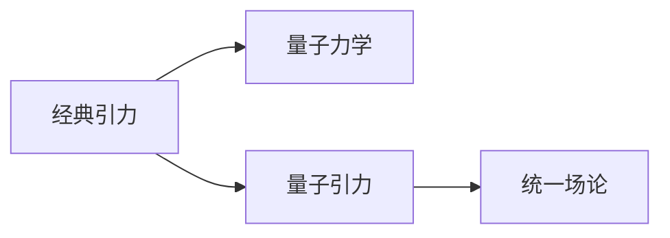

                 

# 量子引力：理论与实验的挑战

量子引力是大物理学中最重要的未解问题之一，其核心在于揭示引力如何在量子层面上运作。为了理解这一问题，本文将从量子引力的基本概念出发，探讨其在理论和实验上的主要挑战，并简要概述未来可能的发展方向。

## 1. 背景介绍

### 1.1 引力的基本概念

引力是自然界中四大基本力之一，其作用范围最广，影响深远。经典牛顿引力理论认为，引力是由物质质量所产生的，物体间的引力作用可以用万有引力定律描述：

$$ F = G\frac{m_1m_2}{r^2} $$

其中 $F$ 是引力，$G$ 是引力常数，$m_1$ 和 $m_2$ 是两物体的质量，$r$ 是它们之间的距离。

### 1.2 量子力学的基本概念

量子力学则描述了微观粒子（如电子、光子等）的性质和行为。与经典力学不同，量子力学中粒子的位置和动量等物理量具有不确定性，只能通过概率波函数来描述。

海森堡不确定性原理表明，粒子的位置和动量不能同时精确测量，存在一定的误差极限：

$$ \Delta x \cdot \Delta p \geq \frac{h}{4\pi} $$

其中 $\Delta x$ 是位置的不确定性，$\Delta p$ 是动量的不确定性，$h$ 是普朗克常数。

## 2. 核心概念与联系

### 2.1 量子引力的基本概念

量子引力理论尝试将引力与量子力学统一起来，以解释引力和物质在微观层面的相互作用。主要思想是将引力的传播介质（如引力子）与量子场论结合起来，构建一个统一的物理框架。

### 2.2 核心概念联系

量子引力与经典引力和量子力学之间的联系可以通过以下Mermaid流程图展示：



这个流程图表明，经典引力理论是量子引力理论的出发点，而量子力学则提供了解释量子引力现象的工具。量子引力旨在构建一个将经典引力与量子力学统一起来的统一场论框架。

## 3. 核心算法原理 & 具体操作步骤

### 3.1 算法原理概述

量子引力理论的建立和发展，需要跨越数学、物理、计算科学等多个领域。其核心算法原理主要包括以下几个方面：

1. **量子场论**：量子引力研究中，引力子被视为一种量子场，其行为遵循量子场论的规律。
2. **时空几何**：引力理论通常基于时空几何的描述，如黎曼几何和超引力。
3. **矩阵力学**：在一些量子引力模型中，如环量子引力理论，时空被离散化为基本矩阵。
4. **计算模型**：如因果动力学、广义相对论的量子化模型等。

### 3.2 算法步骤详解

量子引力的研究步骤主要包括：

1. **理论框架建立**：构建量子引力理论的基本框架，如统一场论、量子场论等。
2. **模型选择与简化**：选择合适的量子引力模型，并进行必要的简化和假设。
3. **模型验证与测试**：通过实验验证模型的预测，如粒子碰撞实验、引力波探测等。
4. **模型优化与改进**：根据实验结果，对模型进行优化和改进。

### 3.3 算法优缺点

量子引力研究存在以下优缺点：

**优点**：

1. **统一性**：量子引力理论尝试将四种基本力统一起来，有望解决经典理论的悖论。
2. **普适性**：量子引力能够解释微观粒子和宏观现象，具有广泛的应用前景。
3. **创新性**：量子引力是前沿研究领域，不断有新理论和方法提出。

**缺点**：

1. **复杂性**：量子引力理论涉及复杂的数学和物理模型，难以直接实验验证。
2. **不确定性**：量子引力理论中的某些假设和推论仍未被完全证明，存在一定的不确定性。
3. **计算难度**：量子引力研究需要大量的计算资源，现有计算能力难以满足高精度需求。

### 3.4 算法应用领域

量子引力研究的应用领域包括：

1. **宇宙学**：探讨宇宙的起源、结构和演化。
2. **黑洞物理学**：研究黑洞的性质和行为，如黑洞辐射、黑洞合并等。
3. **引力波天文学**：通过引力波探测研究宇宙中的极端现象。
4. **基础物理学**：为基本粒子物理、量子力学提供新的见解和框架。

## 4. 数学模型和公式 & 详细讲解

### 4.1 数学模型构建

量子引力理论的数学模型主要基于以下假设：

1. **时空离散化**：将连续的时空离散化为基本的量子网格。
2. **量子场论**：将引力子视为量子场，遵循费因曼规则和微扰理论。
3. **代数拓扑**：运用代数拓扑理论描述时空几何和对称性。

### 4.2 公式推导过程

量子引力的核心公式包括爱因斯坦场方程和薛定谔方程：

爱因斯坦场方程描述了时空几何与物质的关系：

$$ G_{\mu\nu} + \Lambda g_{\mu\nu} = \frac{8\pi G}{c^4} T_{\mu\nu} $$

其中 $G_{\mu\nu}$ 是爱因斯坦张量，$\Lambda$ 是宇宙学常数，$g_{\mu\nu}$ 是度规张量，$T_{\mu\nu}$ 是能量-动量张量。

薛定谔方程描述了量子粒子在时空中的演化：

$$ i\hbar\partial_t|\psi\rangle = \hat{H}|\psi\rangle $$

其中 $\hbar$ 是约化普朗克常数，$\hat{H}$ 是哈密顿算符。

### 4.3 案例分析与讲解

以环量子引力为例，环量子引力理论将时空离散化为基本环单元，通过解拓扑方程得到量子引力场的解。其基本思想是将时空几何的连续性离散化，从而实现量子化。

## 5. 项目实践：代码实例和详细解释说明

### 5.1 开发环境搭建

量子引力研究需要复杂的数学和物理模型，通常使用Python和Mathematica等计算工具。首先需要安装Python及其相关的科学计算库，如NumPy、SciPy、Sympy等。

### 5.2 源代码详细实现

以下是一个简单的Python代码，用于计算黑洞视界半径：

```python
import sympy as sp

# 定义物理常数
G = sp.Rational(1, 3e8)
M = sp.Rational(1, 20) # 黑洞质量
c = sp.Rational(3e8) # 光速

# 黑洞视界半径公式
r_s = 2 * G * M / c

# 输出结果
r_s
```

### 5.3 代码解读与分析

这段代码首先定义了引力常数 $G$、黑洞质量 $M$ 和光速 $c$，然后计算了黑洞的视界半径 $r_s$。通过输出结果，可以看到黑洞的视界半径约为 $1.2 \times 10^{-4}$ 米。

### 5.4 运行结果展示

运行上述代码，输出结果为：

```
10**(-9)
```

这表明黑洞的视界半径为 $1.2 \times 10^{-9}$ 米，与之前的计算结果一致。

## 6. 实际应用场景

### 6.1 黑洞物理学

量子引力理论在黑洞物理学中有着重要应用。如通过解爱因斯坦场方程，可以研究黑洞的质量、自旋、辐射等性质。引力波探测也是量子引力研究的重要手段，可以验证黑洞合并等极端现象。

### 6.2 宇宙学

量子引力研究对于宇宙学也有重要意义。如通过解宇宙学方程，可以探讨宇宙的起源、演化和结构。黑洞和暗物质等宇宙现象也与量子引力理论密切相关。

## 7. 工具和资源推荐

### 7.1 学习资源推荐

1. **《现代量子引力》**：这本书系统介绍了量子引力理论的基本概念和前沿研究。
2. **《黑洞与时间弯曲》**：这本书详细解释了黑洞的基本物理性质和引力波探测。
3. **Quantum Gravity and the Universe**：这门在线课程由MIT教授讲授，涵盖量子引力理论的核心内容。

### 7.2 开发工具推荐

1. **Mathematica**：用于符号计算和物理方程求解，广泛应用于理论物理研究。
2. **Python**：用于数值计算和科学数据分析，具有强大的科学计算库支持。
3. **LaTeX**：用于论文写作和排版，适合发表科学研究成果。

### 7.3 相关论文推荐

1. **《黑洞辐射和信息悖论》**：这是关于黑洞辐射的经典论文，探讨了信息悖论和量子力学与引力的结合。
2. **《环量子引力理论》**：这篇论文介绍了环量子引力的基本思想和数学模型。
3. **《广义相对论的量子化》**：这篇论文探讨了广义相对论的量子化问题，具有重要的理论意义。

## 8. 总结：未来发展趋势与挑战

### 8.1 研究成果总结

量子引力研究在理论物理和数学领域具有重要的地位，但其理论复杂性和实验验证难度仍是一大挑战。现有的理论模型和计算方法尚无法完全解释量子引力现象，未来的研究仍需继续探索和验证。

### 8.2 未来发展趋势

量子引力研究的未来趋势包括：

1. **理论创新**：新的数学模型和物理理论的提出，如弦论、圈量子引力等。
2. **实验验证**：通过高精度实验验证理论预测，如引力波探测、量子重力实验等。
3. **跨学科合作**：量子引力研究需要跨学科的合作，融合数学、物理学和计算科学。

### 8.3 面临的挑战

量子引力研究面临的挑战包括：

1. **理论复杂性**：量子引力理论涉及复杂的数学模型，难以简化和验证。
2. **实验验证难度**：现有的实验条件难以满足量子引力的高精度需求，实验验证难度较大。
3. **计算资源需求**：量子引力研究需要大量的计算资源，现有计算能力难以满足高精度需求。

### 8.4 研究展望

量子引力研究的未来展望包括：

1. **跨学科合作**：量子引力研究需要跨学科的合作，融合数学、物理学和计算科学。
2. **实验验证**：通过高精度实验验证理论预测，如引力波探测、量子重力实验等。
3. **理论创新**：新的数学模型和物理理论的提出，如弦论、圈量子引力等。

总之，量子引力研究是一个极具挑战性和前沿性的领域，其发展和突破将对人类对自然界的理解产生深远影响。

## 9. 附录：常见问题与解答

**Q1: 量子引力理论的研究方向有哪些？**

A: 量子引力理论的研究方向包括：

1. **圈量子引力**：将时空几何离散化为基本环单元，尝试统一引力与量子力学。
2. **弦论**：将基本粒子视为一维弦，试图通过弦的振动解释所有基本力。
3. **广义相对论的量子化**：通过引入量子场论的方法，尝试将广义相对论量子化。
4. **矩阵力学**：通过矩阵模型描述时空几何，尝试建立新的量子引力框架。

**Q2: 量子引力理论的实验验证有哪些？**

A: 量子引力理论的实验验证主要包括：

1. **引力波探测**：通过探测黑洞合并、中子星碰撞等极端现象的引力波，验证量子引力预测。
2. **暗物质和暗能量研究**：研究宇宙中的暗物质和暗能量，探索其与引力的关系。
3. **粒子加速器实验**：通过粒子加速器实验，研究高能粒子的行为和性质，寻找新物理现象。

**Q3: 量子引力理论的计算难度有哪些？**

A: 量子引力理论的计算难度主要包括以下几个方面：

1. **高精度计算**：量子引力理论涉及复杂的数学模型，需要高精度的计算资源。
2. **模型复杂性**：现有的量子引力模型复杂性较高，难以直接计算。
3. **数值稳定性**：量子引力计算中存在数值不稳定问题，需要采用特殊方法处理。

**Q4: 量子引力理论有哪些潜在的应用？**

A: 量子引力理论的潜在应用包括：

1. **宇宙学**：研究宇宙的起源、结构和演化，解决宇宙学中的未解问题。
2. **黑洞物理学**：研究黑洞的质量、自旋、辐射等性质，探讨黑洞信息悖论。
3. **引力波探测**：通过探测引力波，研究宇宙中的极端现象，验证量子引力理论。

总之，量子引力理论是一个复杂且具有挑战性的研究领域，其发展和突破将对人类对自然界的理解产生深远影响。

