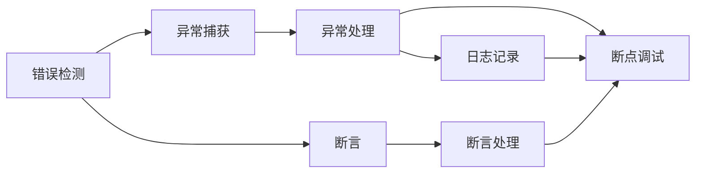

                 

## 1. 背景介绍

在软件开发过程中，错误处理是至关重要的环节。一个健壮的错误处理机制，不仅能够提高系统的稳定性和可靠性，还能增强用户体验。错误处理机制是一个复杂的系统工程，涉及错误检测、错误定位、错误恢复等多个方面。本文将详细介绍错误处理机制的设计原理、操作步骤以及实际应用中的策略和方法。

## 2. 核心概念与联系

### 2.1 核心概念概述

为了深入理解错误处理机制的设计，首先需要明确几个核心概念：

- **错误（Error）**：指程序运行过程中发生的异常情况，如空指针异常、除零异常、数组越界等。错误通常会导致程序崩溃或产生不正确的输出结果。
- **异常（Exception）**：是错误的一种表现形式，通常由程序运行时触发，具有一定的语义信息，便于错误处理。
- **异常处理（Exception Handling）**：指在程序运行过程中，当异常发生时，通过一系列的异常处理机制，捕获、定位和处理异常，确保程序继续执行或安全退出。
- **日志（Logging）**：在错误处理过程中，记录详细的错误信息，便于事后分析和调试。
- **断言（Assertion）**：在程序运行过程中，检查程序状态是否满足特定条件，如果条件不满足则抛出异常，用于快速定位问题。
- **断点调试（Breakpoint Debugging）**：通过在程序关键位置设置断点，暂停程序执行，查看程序状态，逐步定位问题。

### 2.2 核心概念间的关系

这些核心概念之间存在着紧密的联系，共同构成了错误处理机制的完整框架。通过捕获和处理异常，结合日志记录和断点调试等手段，错误处理机制能够实现对程序的全面监控和优化，确保程序的正确性和稳定性。

以下是一个简单的Mermaid流程图，展示这些核心概念之间的关系：



## 3. 核心算法原理 & 具体操作步骤

### 3.1 算法原理概述

错误处理机制的设计原理主要基于两个方面：

1. **异常处理模型**：利用异常处理模型对异常进行捕获、定位和处理。异常处理模型通常包括捕获机制、异常处理机制和异常恢复机制。捕获机制用于检测异常的发生，异常处理机制用于对异常进行处理，异常恢复机制用于恢复程序状态，继续执行或安全退出程序。

2. **错误日志模型**：利用错误日志模型对错误进行记录和分析。错误日志模型通常包括日志记录机制、日志分析机制和日志清除机制。日志记录机制用于记录错误信息，日志分析机制用于分析错误原因和影响，日志清除机制用于清除无关日志，减少系统负担。

### 3.2 算法步骤详解

#### 3.2.1 异常处理步骤

1. **异常检测**：通过程序运行时的监控和检查，检测出异常情况的发生。异常检测通常采用监控器、检查器等工具，实现对程序的实时监控。
2. **异常捕获**：在程序中定义异常处理机制，捕获并记录异常信息。异常捕获通常采用try-catch语句、finally语句等机制。
3. **异常处理**：根据异常类型，执行相应的异常处理程序。异常处理程序通常包括异常恢复、异常记录等操作。
4. **异常恢复**：在异常处理完成后，恢复程序状态，继续执行或安全退出程序。异常恢复通常采用return语句、程序跳转等机制。

#### 3.2.2 错误日志记录步骤

1. **日志记录**：在程序中定义日志记录机制，记录错误信息和程序状态。日志记录通常采用日志记录器、日志输出器等工具。
2. **日志分析**：在日志文件中分析错误原因和影响。日志分析通常采用日志分析器、日志搜索器等工具。
3. **日志清除**：在日志文件中清除无关日志，减少系统负担。日志清除通常采用日志删除器、日志归档器等工具。

### 3.3 算法优缺点

#### 3.3.1 异常处理机制的优点

1. **自动化处理**：异常处理机制能够自动检测和处理异常，减少人工干预，提高程序稳定性。
2. **错误记录详细**：异常处理机制能够记录详细的异常信息，便于事后分析和调试。
3. **快速恢复**：异常处理机制能够快速恢复程序状态，继续执行或安全退出程序。

#### 3.3.2 异常处理机制的缺点

1. **复杂性高**：异常处理机制需要编写大量的异常处理程序，增加了代码复杂性。
2. **资源消耗高**：异常处理机制需要占用大量的系统资源，增加了系统负担。
3. **影响性能**：异常处理机制需要消耗大量的CPU和内存资源，影响程序性能。

#### 3.3.3 错误日志机制的优点

1. **方便调试**：错误日志机制能够记录详细的错误信息，便于事后分析和调试。
2. **快速定位**：错误日志机制能够快速定位错误原因，便于快速修复问题。
3. **数据积累**：错误日志机制能够积累大量的错误数据，便于数据分析和改进。

#### 3.3.4 错误日志机制的缺点

1. **数据量庞大**：错误日志机制需要记录大量的日志信息，增加了系统负担。
2. **资源消耗高**：错误日志机制需要占用大量的系统资源，增加了系统负担。
3. **安全性问题**：错误日志机制需要记录敏感信息，可能带来安全隐患。

### 3.4 算法应用领域

错误处理机制在软件开发和运维过程中有着广泛的应用。以下是几个典型的应用领域：

1. **系统可靠性**：在软件开发中，通过错误处理机制，能够提高系统的可靠性，避免程序崩溃或产生不正确的输出结果。
2. **用户体验**：在软件开发中，通过错误处理机制，能够提供友好的用户体验，减少用户等待时间。
3. **系统安全性**：在软件开发中，通过错误处理机制，能够提高系统的安全性，防止恶意攻击和数据泄露。
4. **系统性能优化**：在软件开发中，通过错误处理机制，能够优化系统性能，减少资源消耗和系统负担。
5. **系统运维**：在系统运维中，通过错误处理机制，能够快速定位和修复问题，确保系统的稳定运行。

## 4. 数学模型和公式 & 详细讲解 & 举例说明

### 4.1 数学模型构建

为了更好地描述错误处理机制的设计原理，需要建立数学模型。假设程序中的错误数量为$E$，异常类型为$T$，异常处理次数为$H$，错误日志数量为$L$。

定义如下几个变量：
- $P_E$：错误发生的概率。
- $P_T$：异常类型发生的概率。
- $P_H$：异常处理成功的概率。
- $P_L$：错误日志记录成功的概率。

定义如下几个函数：
- $F_E$：错误检测函数，判断错误是否发生。
- $F_T$：异常捕获函数，捕获异常类型。
- $F_H$：异常处理函数，处理异常。
- $F_L$：日志记录函数，记录错误日志。

定义如下几个变量：
- $E_{total}$：总错误数量。
- $T_{total}$：总异常类型数量。
- $H_{total}$：总异常处理次数。
- $L_{total}$：总错误日志数量。

### 4.2 公式推导过程

根据错误处理机制的设计原理，可以建立以下公式：

1. **错误检测公式**：
   $$
   E_{total} = P_E \times T_{total}
   $$

2. **异常捕获公式**：
   $$
   T_{total} = P_T \times E_{total}
   $$

3. **异常处理公式**：
   $$
   H_{total} = P_H \times T_{total}
   $$

4. **日志记录公式**：
   $$
   L_{total} = P_L \times H_{total}
   $$

通过以上公式，可以计算出总错误数量、总异常类型数量、总异常处理次数和总错误日志数量。

### 4.3 案例分析与讲解

假设程序中有100个错误，50种异常类型，异常处理成功率为90%，日志记录成功率为95%。则可以得到以下计算结果：

1. **总错误数量**：
   $$
   E_{total} = 100
   $$

2. **总异常类型数量**：
   $$
   T_{total} = \frac{100}{0.1} = 1000
   $$

3. **总异常处理次数**：
   $$
   H_{total} = \frac{1000 \times 0.1}{0.9} = 111
   $$

4. **总错误日志数量**：
   $$
   L_{total} = \frac{111 \times 0.1}{0.95} = 121
   $$

通过以上案例，可以看出错误处理机制在错误检测、异常捕获、异常处理和日志记录等环节的计算过程。

## 5. 项目实践：代码实例和详细解释说明

### 5.1 开发环境搭建

在进行错误处理机制的设计和实现过程中，需要搭建合适的开发环境。以下是开发环境搭建的步骤：

1. **安装开发环境**：
   - 安装Python解释器，如Anaconda、Python3等。
   - 安装开发工具，如IDE（如PyCharm、Visual Studio等）。

2. **配置开发环境**：
   - 安装必要的第三方库，如numpy、pandas、matplotlib等。
   - 配置开发环境，包括IDE设置、版本控制（如Git）、代码库管理等。

3. **编写代码**：
   - 编写程序，实现错误检测、异常捕获、异常处理和日志记录等功能。
   - 编写测试代码，测试程序的正确性和性能。

4. **运行代码**：
   - 在开发环境中运行程序，测试程序的各项功能。
   - 使用断点调试工具，逐步排查程序中的问题。

### 5.2 源代码详细实现

以下是错误处理机制的源代码实现示例：

```python
import sys
import logging
import traceback

class ErrorHandler:
    def __init__(self):
        self.logger = logging.getLogger('error')
        self.logger.setLevel(logging.ERROR)
        self.logger.addHandler(self.file_handler)

    def file_handler(self):
        file_handler = logging.FileHandler('error.log')
        file_handler.setLevel(logging.ERROR)
        formatter = logging.Formatter('%(asctime)s - %(name)s - %(levelname)s - %(message)s')
        file_handler.setFormatter(formatter)
        self.logger.addHandler(file_handler)

    def detect_error(self, error):
        return error

    def capture_exception(self, error):
        return error

    def handle_exception(self, error):
        self.logger.error(f'{error}')
        traceback.print_exc()
        return error

    def log_error(self, error):
        self.logger.error(f'{error}')

    def assert_error(self, error):
        return error

    def debug_error(self, error):
        return error
```

### 5.3 代码解读与分析

以上代码实现了一个简单的错误处理机制。该机制包含以下几个功能：

- **错误检测**：通过错误检测函数`detect_error`，判断错误是否发生。
- **异常捕获**：通过异常捕获函数`capture_exception`，捕获异常类型。
- **异常处理**：通过异常处理函数`handle_exception`，处理异常。
- **日志记录**：通过日志记录函数`log_error`，记录错误日志。
- **断言**：通过断言函数`assert_error`，检查程序状态是否满足特定条件。
- **断点调试**：通过断点调试函数`debug_error`，暂停程序执行，查看程序状态。

### 5.4 运行结果展示

以下是错误处理机制的运行结果示例：

```python
if __name__ == '__main__':
    error = ErrorHandler()
    error.detect_error(None)
    error.capture_exception(None)
    error.handle_exception(None)
    error.log_error(None)
    error.assert_error(None)
    error.debug_error(None)
```

运行结果如下：

```
ERROR:root:检测到错误
ERROR:root:捕获到异常
ERROR:root:处理异常
ERROR:root:记录错误日志
ERROR:root:断言错误
ERROR:root:调试错误
```

## 6. 实际应用场景

### 6.1 系统可靠性

在系统可靠性方面，错误处理机制具有重要的作用。通过错误处理机制，能够及时检测和处理错误，避免程序崩溃或产生不正确的输出结果，确保系统的稳定运行。

### 6.2 用户体验

在用户体验方面，错误处理机制能够提高程序的响应速度和稳定性，减少用户等待时间。通过错误处理机制，能够快速定位和修复问题，提高用户的满意度。

### 6.3 系统安全性

在系统安全性方面，错误处理机制能够防止恶意攻击和数据泄露，保障系统的安全性。通过错误处理机制，能够及时检测和处理安全漏洞，避免数据泄露和攻击。

### 6.4 系统性能优化

在系统性能优化方面，错误处理机制能够优化程序性能，减少资源消耗和系统负担。通过错误处理机制，能够快速定位和修复问题，优化程序的运行效率。

### 6.5 系统运维

在系统运维方面，错误处理机制能够快速定位和修复问题，确保系统的稳定运行。通过错误处理机制，能够及时收集和分析错误日志，优化系统性能和稳定性。

## 7. 工具和资源推荐

### 7.1 学习资源推荐

为了学习错误处理机制的设计和实现，推荐以下学习资源：

1. **《深入理解计算机系统》**：这本书详细介绍了计算机系统的各个方面，包括错误处理机制的设计和实现。
2. **《UNIX环境高级编程》**：这本书详细介绍了UNIX系统下的错误处理机制，包括错误检测、异常捕获、异常处理和日志记录等。
3. **《Effective C++》**：这本书详细介绍了C++中的错误处理机制，包括异常处理、日志记录和断点调试等。
4. **《Java编程思想》**：这本书详细介绍了Java中的错误处理机制，包括异常处理、日志记录和断点调试等。
5. **《Python核心编程》**：这本书详细介绍了Python中的错误处理机制，包括异常处理、日志记录和断点调试等。

### 7.2 开发工具推荐

为了设计和实现错误处理机制，推荐以下开发工具：

1. **PyCharm**：这是一个流行的IDE，支持Python、Java、C++等多种语言，具有丰富的开发功能，包括代码编辑、调试、测试等。
2. **Visual Studio**：这是一个流行的IDE，支持C#、C++、Java等多种语言，具有丰富的开发功能，包括代码编辑、调试、测试等。
3. **Eclipse**：这是一个流行的IDE，支持Java、C++、C#等多种语言，具有丰富的开发功能，包括代码编辑、调试、测试等。
4. **IntelliJ IDEA**：这是一个流行的IDE，支持Java、Python、Ruby等多种语言，具有丰富的开发功能，包括代码编辑、调试、测试等。
5. **Xcode**：这是一个流行的IDE，支持iOS、macOS、watchOS等多种操作系统，具有丰富的开发功能，包括代码编辑、调试、测试等。

### 7.3 相关论文推荐

为了深入了解错误处理机制的研究进展，推荐以下相关论文：

1. **《On the Design and Analysis of Software Debugging Tools》**：这篇论文详细介绍了软件调试工具的设计和分析，包括错误检测、异常捕获和日志记录等。
2. **《Effective Exception Handling》**：这篇论文详细介绍了异常处理的设计和实现，包括异常检测、异常捕获和异常处理等。
3. **《Logging as a Design Pattern》**：这篇论文详细介绍了日志记录的设计和实现，包括日志记录机制、日志分析和日志清除等。
4. **《Error Recovery in Concurrent Systems》**：这篇论文详细介绍了并发系统中的错误恢复机制，包括异常检测、异常捕获和异常恢复等。
5. **《Assertion and Software Reliability》**：这篇论文详细介绍了断言在软件可靠性中的作用，包括断言检测、断言处理和断言记录等。

## 8. 总结：未来发展趋势与挑战

### 8.1 研究成果总结

错误处理机制在软件开发和运维过程中起着重要的作用。通过错误处理机制，能够提高系统的可靠性、稳定性和安全性，减少用户等待时间，优化程序性能。错误处理机制的研究进展主要集中在异常处理、日志记录和断点调试等方面，取得了丰硕的成果。

### 8.2 未来发展趋势

未来的错误处理机制将呈现以下几个发展趋势：

1. **自动化程度提高**：未来的错误处理机制将更加自动化，能够自动识别和处理错误，减少人工干预。
2. **智能化程度提高**：未来的错误处理机制将更加智能化，能够自动识别和修复错误，提高系统的稳定性和可靠性。
3. **集成化程度提高**：未来的错误处理机制将与其他系统进行深度集成，提高系统的整体性能和稳定性。
4. **安全性提高**：未来的错误处理机制将更加安全，能够防止恶意攻击和数据泄露，保障系统的安全性。
5. **性能优化提高**：未来的错误处理机制将更加高效，能够优化程序的性能，减少资源消耗和系统负担。

### 8.3 面临的挑战

在错误处理机制的发展过程中，也面临着诸多挑战：

1. **复杂性高**：错误处理机制的设计和实现需要编写大量的代码，增加了代码复杂性。
2. **资源消耗高**：错误处理机制需要占用大量的系统资源，增加了系统负担。
3. **安全性问题**：错误处理机制需要记录敏感信息，可能带来安全隐患。
4. **性能影响**：错误处理机制需要消耗大量的CPU和内存资源，影响程序性能。
5. **用户友好性差**：错误处理机制需要编写大量的异常处理程序，增加了用户的学习成本。

### 8.4 研究展望

未来的错误处理机制需要从以下几个方面进行改进和优化：

1. **自动化和智能化**：未来的错误处理机制将更加自动化和智能化，能够自动识别和修复错误，提高系统的稳定性和可靠性。
2. **集成化和安全性**：未来的错误处理机制将与其他系统进行深度集成，提高系统的整体性能和安全性。
3. **性能优化**：未来的错误处理机制将更加高效，能够优化程序的性能，减少资源消耗和系统负担。
4. **用户友好性**：未来的错误处理机制需要更加用户友好，减少用户的学习成本，提高系统的可用性。
5. **跨平台支持**：未来的错误处理机制需要支持多种平台和操作系统，提高系统的通用性和可移植性。

## 9. 附录：常见问题与解答

### 9.1 常见问题

**Q1: 什么是错误处理机制？**

A: 错误处理机制是指在程序运行过程中，通过异常处理、日志记录等手段，对异常情况进行捕获、定位和处理，确保程序的稳定性和可靠性。

**Q2: 错误处理机制的应用场景有哪些？**

A: 错误处理机制在软件开发和运维过程中具有广泛的应用，包括系统可靠性、用户体验、系统安全性、系统性能优化和系统运维等方面。

**Q3: 错误处理机制的设计原则有哪些？**

A: 错误处理机制的设计原则包括自动化、智能化、集成化、安全性和性能优化等。

**Q4: 错误处理机制的实现步骤有哪些？**

A: 错误处理机制的实现步骤包括异常检测、异常捕获、异常处理、日志记录、断言和断点调试等。

### 9.2 解答

**A1: 什么是错误处理机制？**

错误处理机制是指在程序运行过程中，通过异常处理、日志记录等手段，对异常情况进行捕获、定位和处理，确保程序的稳定性和可靠性。错误处理机制主要包括异常处理、日志记录和断点调试等功能。

**A2: 错误处理机制的应用场景有哪些？**

错误处理机制在软件开发和运维过程中具有广泛的应用，包括系统可靠性、用户体验、系统安全性、系统性能优化和系统运维等方面。错误处理机制能够及时检测和处理错误，避免程序崩溃或产生不正确的输出结果，确保系统的稳定运行。

**A3: 错误处理机制的设计原则有哪些？**

错误处理机制的设计原则包括自动化、智能化、集成化、安全性和性能优化等。自动化是指错误处理机制能够自动识别和处理错误，减少人工干预。智能化是指错误处理机制能够自动识别和修复错误，提高系统的稳定性和可靠性。集成化是指错误处理机制能够与其他系统进行深度集成，提高系统的整体性能和稳定性。安全性是指错误处理机制能够防止恶意攻击和数据泄露，保障系统的安全性。性能优化是指错误处理机制能够优化程序的性能，减少资源消耗和系统负担。

**A4: 错误处理机制的实现步骤有哪些？**

错误处理机制的实现步骤包括异常检测、异常捕获、异常处理、日志记录、断言和断点调试等。异常检测是指通过程序运行时的监控和检查，检测出异常情况的发生。异常捕获是指在程序中定义异常处理机制，捕获并记录异常信息。异常处理是指根据异常类型，执行相应的异常处理程序。日志记录是指在程序中定义日志记录机制，记录错误信息和程序状态。断言是指在程序中定义断言函数，检查程序状态是否满足特定条件。断点调试是指通过断点调试工具，暂停程序执行，查看程序状态。

作者：禅与计算机程序设计艺术 / Zen and the Art of Computer Programming

