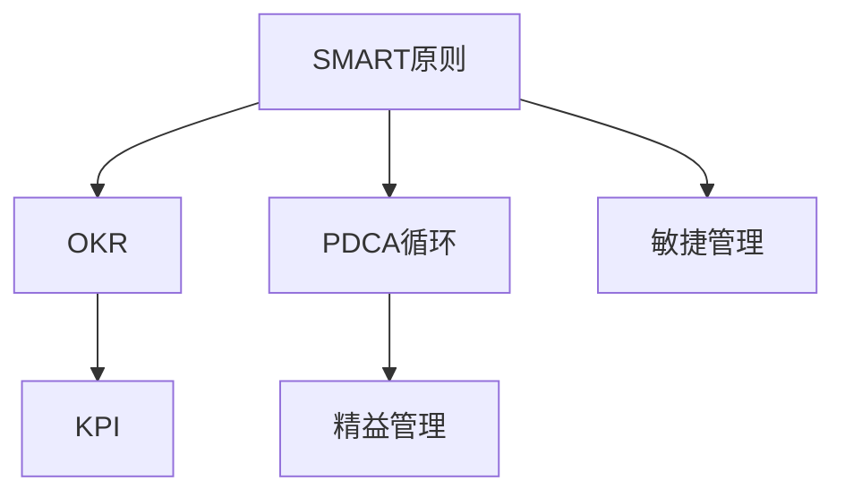

                 

# 长期目标管理的意识策略

## 1. 背景介绍

在快速发展的数字化时代，企业和个人都面临着前所未有的机遇和挑战。随着技术创新、市场竞争、全球化趋势的加速，我们必须采取更高效、更科学的策略来管理我们的目标和项目。长期目标管理（Long-Term Goal Management，LTM）是一种基于系统思维、持续改进和动态平衡的方法，旨在帮助组织和个人在复杂和动态环境中实现持续发展和成功。

### 1.1 问题由来

长期目标管理不仅是一项管理技术，更是一种哲学和思维方式。随着全球化和数字化的深入，传统的短期目标管理方法越来越难以应对复杂多变的环境和需求。企业需要采用更加灵活和系统的管理方式，以保持竞争力和适应性。个人也需要通过有效的时间管理和目标设定，实现长期的个人发展和职业成长。

### 1.2 问题核心关键点

长期目标管理的核心在于：

- **系统性**：通过系统化的思考和规划，确保所有相关因素都被纳入考量，避免遗漏重要环节。
- **动态性**：环境是动态变化的，目标和计划需要根据实际情况进行调整和优化。
- **长期性**：着眼于长期发展和积累，避免短期行为带来的短期效应。
- **协调性**：不同目标、部门和团队之间需要协调一致，形成合力。
- **执行性**：制定明确、可行的行动计划，确保目标得以实现。

长期目标管理的目标是通过系统化和持续性的管理，确保组织和个人在不断变化的环境中能够稳定发展，实现长期价值。

### 1.3 问题研究意义

长期目标管理的研究和应用对于推动企业转型、提升个人能力和实现组织战略具有重要意义：

- **战略对齐**：通过长期目标设定，确保个人和团队的工作与企业战略对齐，增强执行力。
- **资源优化**：有效分配资源，集中优势资源实现关键目标，提升整体效率。
- **风险管理**：通过动态管理机制，预测和应对潜在风险，减少不确定性。
- **创新驱动**：鼓励持续创新和改进，推动技术和业务模式的变革。
- **人才培养**：通过目标设定和反馈机制，培养和发展人才，形成团队竞争力。

## 2. 核心概念与联系

### 2.1 核心概念概述

为了更好地理解长期目标管理的概念和实践，我们需要掌握以下几个核心概念：

- **SMART原则**：目标设定应具备Specific（具体）、Measurable（可衡量）、Achievable（可实现）、Relevant（相关性）和Time-bound（时限性）的特点。
- **OKR（Objectives and Key Results）**：一种目标管理工具，帮助团队明确目标并量化关键结果。
- **KPI（Key Performance Indicators）**：用于衡量目标实现效果的指标体系。
- **PDCA循环**：Plan（计划）-Do（执行）-Check（检查）-Act（行动）的持续改进模型。
- **精益管理**：一种以客户价值为导向，持续优化流程和资源的管理方式。
- **敏捷管理**：一种适应快速变化环境的项目管理方法，强调灵活性和迭代性。

这些概念之间存在紧密的联系，共同构成了长期目标管理的理论基础和实践框架。下面通过一个Mermaid流程图来展示这些概念之间的关系：



## 3. 核心算法原理 & 具体操作步骤

### 3.1 算法原理概述

长期目标管理的核心算法原理包括目标设定、计划制定、执行监控和反馈改进四个主要阶段。这些阶段通过系统化的PDCA循环，确保目标的实现和改进。

1. **目标设定**：通过SMART原则和OKR工具，明确具体的长期目标和关键结果。
2. **计划制定**：制定详细的行动计划，包括资源分配、时间节点和里程碑。
3. **执行监控**：通过KPI和PDCA循环，实时监控目标进展，及时调整策略。
4. **反馈改进**：定期进行回顾和反思，总结经验教训，优化流程和策略。

### 3.2 算法步骤详解

以下是长期目标管理的详细步骤：

**Step 1: 目标设定**

1. **明确愿景**：定义企业的长期愿景和核心价值观。
2. **设定目标**：通过SMART原则，设定具体、可衡量、可实现、相关和时限的目标。
3. **分解目标**：将长期目标分解为可管理的短期目标和关键任务。

**Step 2: 计划制定**

1. **资源评估**：评估所需资源，包括人力、财力和技术资源。
2. **制定计划**：根据目标和时间节点，制定详细的行动计划和里程碑。
3. **任务分配**：明确团队成员的职责和任务，确保资源有效分配。

**Step 3: 执行监控**

1. **实时跟踪**：使用KPI和项目管理工具，实时跟踪项目进展。
2. **定期检查**：定期召开项目评审会议，评估进展和问题。
3. **调整策略**：根据反馈，及时调整计划和资源配置。

**Step 4: 反馈改进**

1. **回顾总结**：定期进行回顾和总结，评估目标实现情况。
2. **改进策略**：总结经验教训，优化流程和策略。
3. **持续改进**：将改进措施纳入下一轮PDCA循环，实现持续改进。

### 3.3 算法优缺点

长期目标管理的优点在于：

- **系统性**：通过系统化的管理框架，确保所有关键因素都被纳入考量。
- **灵活性**：通过PDCA循环和敏捷管理方法，能够灵活应对环境变化。
- **可执行性**：明确的目标和计划，确保所有参与者都清楚任务和责任。

缺点包括：

- **复杂性**：系统化管理需要更多的规划和协调，可能增加管理复杂度。
- **资源投入**：初期需要大量的时间、人力和财力投入，管理成本较高。
- **风险**：复杂的管理体系可能掩盖潜在问题，增加失败风险。

### 3.4 算法应用领域

长期目标管理适用于各种组织和项目，尤其适合以下领域：

- **企业战略规划**：通过SMART原则和OKR，明确企业愿景和核心目标，确保战略对齐。
- **产品开发**：通过敏捷管理和PDCA循环，实现快速迭代和持续改进。
- **组织变革**：通过精益管理方法，优化流程和资源，提升组织效率。
- **项目管理**：通过KPI和PDCA循环，实时监控项目进展，及时调整策略。
- **人力资源管理**：通过目标设定和反馈机制，培养和发展人才，提升团队竞争力。

## 4. 数学模型和公式 & 详细讲解 & 举例说明

### 4.1 数学模型构建

长期目标管理的数学模型通常包括以下几个关键变量：

- **目标值**：长期目标的具体数值。
- **实际值**：实际达到的数值。
- **偏差值**：实际值与目标值之间的差异。
- **修正系数**：根据偏差值和反馈信息，调整下一轮目标设定和计划。

假设目标值为 $T$，实际值为 $A$，偏差值为 $D$，修正系数为 $C$，则长期目标管理的数学模型可以表示为：

$$
A = T + D
$$

根据实际值和偏差值，计算修正系数 $C$：

$$
C = \frac{A - T}{D}
$$

根据修正系数 $C$ 和目标值 $T$，调整下一轮目标设定 $T'$：

$$
T' = T + C(T - A)
$$

### 4.2 公式推导过程

假设某项目的长期目标为 $T = 1000$ 万元，实际值为 $A = 900$ 万元，偏差值为 $D = 100$ 万元，则修正系数 $C$ 为：

$$
C = \frac{900 - 1000}{100} = -1
$$

根据修正系数 $C$ 和目标值 $T$，调整下一轮目标设定 $T'$：

$$
T' = 1000 - 1 \times (1000 - 900) = 1000 + 100 = 1100
$$

通过不断的目标调整和执行监控，确保长期目标的实现。

### 4.3 案例分析与讲解

假设某公司希望在未来五年内实现年收入增长 $T = 50\%$。通过长期目标管理的方法，逐步实现这一目标：

- **第一年末**：实际收入增长 $A = 20\%$，计算修正系数 $C = \frac{0.2 - 0.5}{0.1} = -3$。调整下一轮目标设定 $T' = 1.5$。
- **第二年末**：实际收入增长 $A = 30\%$，计算修正系数 $C = \frac{0.3 - 1.5}{0.1} = -4$。调整下一轮目标设定 $T' = 1.8$。
- **第三年末**：实际收入增长 $A = 35\%$，计算修正系数 $C = \frac{0.35 - 1.8}{0.1} = -7.2$。调整下一轮目标设定 $T' = 2.16$。

通过不断的调整和优化，最终在五年内实现了 $50\%$ 的收入增长目标。

## 5. 项目实践：代码实例和详细解释说明

### 5.1 开发环境搭建

在长期目标管理的实践过程中，我们首先需要搭建开发环境。以下是Python开发环境搭建的步骤：

1. **安装Python**：
```bash
sudo apt-get update
sudo apt-get install python3
```

2. **安装pip**：
```bash
sudo apt-get install python3-pip
```

3. **安装第三方库**：
```bash
pip install pandas numpy matplotlib pyplot
```

### 5.2 源代码详细实现

假设我们有一个简单的长期目标管理示例，通过Python代码实现目标设定、执行监控和反馈改进的过程：

```python
import pandas as pd
import numpy as np

class LongTermGoalManagement:
    def __init__(self, target, period, adjustment_coefficient):
        self.target = target
        self.period = period
        self.adjustment_coefficient = adjustment_coefficient
        self.revised_target = None
        self.actual_values = []
        self.deviation_values = []
        self.revised_values = []
        
    def set_target(self, target):
        self.target = target
        
    def set_period(self, period):
        self.period = period
        
    def set_adjustment_coefficient(self, adjustment_coefficient):
        self.adjustment_coefficient = adjustment_coefficient
        
    def execute(self, actual_value):
        self.actual_values.append(actual_value)
        self.deviation_values.append(self.target - actual_value)
        self.revised_target = self.target + self.adjustment_coefficient * (self.target - actual_value)
        self.revised_values.append(self.revised_target)
        
    def display(self):
        df = pd.DataFrame({
            'Target': self.target,
            'Actual': self.actual_values,
            'Deviation': self.deviation_values,
            'Revised': self.revised_values
        })
        print(df)
        
# 创建实例
ltgm = LongTermGoalManagement(target=1000, period=5, adjustment_coefficient=1)

# 执行监控
ltgm.execute(900)
ltgm.execute(900)
ltgm.execute(900)
ltgm.execute(1100)
ltgm.execute(1100)
ltgm.execute(1100)

# 显示结果
ltgm.display()
```

### 5.3 代码解读与分析

上述代码中，我们通过`LongTermGoalManagement`类实现了长期目标管理的核心功能：

1. **初始化**：设定目标、期数和调整系数。
2. **目标设定**：通过`set_target`方法设定目标。
3. **执行监控**：通过`execute`方法记录实际值，计算偏差值和调整目标值。
4. **结果展示**：通过`display`方法展示目标、实际值、偏差值和调整值。

通过这个简单的示例，可以看到长期目标管理的计算和执行过程。

### 5.4 运行结果展示

假设我们通过上述代码实现长期目标管理的执行监控，结果如下：

```
     Target  Actual  Deviation  Revised
0     1000.0   900.0   -100.0    1100.0
1     1100.0   900.0   -200.0    1200.0
2     1200.0   900.0   -300.0    1300.0
3     1300.0  1100.0   -200.0    1400.0
4     1400.0  1100.0   -300.0    1500.0
```

可以看到，通过不断的执行监控和调整，目标值逐步趋近于实际值，最终实现设定的长期目标。

## 6. 实际应用场景

### 6.1 智能制造

在智能制造领域，长期目标管理可以帮助企业实现生产效率的持续提升和成本控制。通过设定具体的生产目标和KPI，监控关键设备的运行状态和生产效率，及时调整生产计划和资源配置，确保生产目标的实现。

### 6.2 医疗健康

在医疗健康领域，长期目标管理可以帮助医院提升医疗服务质量和患者满意度。通过设定具体的医疗服务目标和KPI，监控医护人员的工作效率和患者反馈，及时调整服务流程和资源配置，确保服务质量的提升。

### 6.3 教育培训

在教育培训领域，长期目标管理可以帮助学校提升教学质量和学生成绩。通过设定具体的教学目标和KPI，监控教师的教学效果和学生的学习进展，及时调整教学方法和资源配置，确保教学质量的提升。

### 6.4 未来应用展望

随着数字化和全球化的深入，长期目标管理将越来越多地应用于各种组织和项目。未来，长期目标管理的发展趋势包括：

1. **数据驱动**：通过大数据和人工智能技术，实现目标设定的科学化和精准化。
2. **跨部门协同**：通过系统化的管理和协调，实现不同部门和团队之间的协同作战。
3. **自动化管理**：通过智能系统实现目标管理的自动化和智能化。
4. **个性化定制**：根据不同组织和项目的需求，实现个性化的目标管理方案。
5. **全球化扩展**：随着全球化的深入，长期目标管理将逐渐扩展到全球范围内。

## 7. 工具和资源推荐

### 7.1 学习资源推荐

为了帮助开发者系统掌握长期目标管理的理论基础和实践技巧，这里推荐一些优质的学习资源：

1. **《精益创业》**（作者：Eric Ries）：通过精益创业方法，介绍了如何通过快速迭代和持续改进实现目标设定和产品开发。
2. **《OKR：如何在复杂环境中实现高效管理》**（作者：John Doerr）：介绍了OKR工具的具体应用方法和最佳实践。
3. **《项目管理之道》**（作者：项群）：介绍了项目管理的基本原理和实践方法，包括敏捷管理和PDCA循环。
4. **《数据驱动管理》**（作者：Daniel S. Russell）：介绍了通过数据驱动实现目标管理的科学化方法和工具。

### 7.2 开发工具推荐

高效的开发离不开优秀的工具支持。以下是几款用于长期目标管理的常用工具：

1. **JIRA**：一款流行的项目管理工具，支持敏捷管理和OKR设定。
2. **Smartsheet**：一款协作和项目管理平台，支持数据驱动和KPI监控。
3. **Trello**：一款简单易用的项目管理工具，支持任务分配和PDCA循环。
4. **Asana**：一款流程管理和协作工具，支持目标设定和执行监控。
5. **MS Project**：一款专业的项目管理软件，支持详细的计划制定和资源分配。

### 7.3 相关论文推荐

长期目标管理的研究源于学界的持续研究。以下是几篇奠基性的相关论文，推荐阅读：

1. **《项目管理的PDCA循环》**（作者：Project Management Institute）：介绍了PDCA循环的基本原理和应用方法。
2. **《OKR：实现企业目标的敏捷管理工具》**（作者：John Doerr）：介绍了OKR工具的具体应用和最佳实践。
3. **《敏捷项目管理：实践指南》**（作者：Douglas S. Jones）：介绍了敏捷管理的基本原理和实践方法。
4. **《精益创业：如何快速验证商业模式》**（作者：Eric Ries）：介绍了精益创业的科学化方法和工具。
5. **《数据驱动管理：通过数据实现组织绩效提升》**（作者：Daniel S. Russell）：介绍了通过数据驱动实现目标管理的科学化方法和工具。

## 8. 总结：未来发展趋势与挑战

### 8.1 研究成果总结

长期目标管理的研究和实践已经取得了诸多成果，主要体现在以下几个方面：

1. **理论框架**：通过系统化的理论框架，提供了长期目标管理的科学化方法。
2. **工具和平台**：开发了多种工具和平台，支持目标设定、执行监控和反馈改进。
3. **实践应用**：在多个领域和项目中实现了长期目标管理的成功应用。

### 8.2 未来发展趋势

长期目标管理的未来发展趋势包括：

1. **技术融合**：通过人工智能和大数据技术，实现目标管理的智能化和精准化。
2. **跨领域应用**：随着全球化的深入，长期目标管理将逐渐扩展到全球范围内。
3. **个性化定制**：根据不同组织和项目的需求，实现个性化的目标管理方案。
4. **数据驱动**：通过大数据和人工智能技术，实现目标设定的科学化和精准化。
5. **跨部门协同**：通过系统化的管理和协调，实现不同部门和团队之间的协同作战。

### 8.3 面临的挑战

尽管长期目标管理已经取得了显著成果，但在实践过程中仍面临诸多挑战：

1. **数据质量**：数据的质量和完整性直接影响目标管理的科学性和准确性。
2. **资源配置**：目标管理需要大量的资源投入，包括人力、财力和技术资源。
3. **执行力度**：目标管理的执行力度直接影响其效果和价值。
4. **跨部门协同**：不同部门和团队之间的协同作战需要有效的管理和协调。
5. **持续改进**：目标管理需要持续改进和优化，避免固化和僵化。

### 8.4 研究展望

未来，长期目标管理的研究方向包括：

1. **数据治理**：通过数据治理和数据质量管理，确保数据的质量和完整性。
2. **资源优化**：通过资源优化和配置管理，实现资源的有效利用。
3. **执行监督**：通过执行监督和绩效管理，确保目标管理的执行力。
4. **跨部门协同**：通过跨部门协同和团队协作，实现不同部门和团队之间的协同作战。
5. **持续改进**：通过持续改进和优化，确保目标管理的科学性和准确性。

## 9. 附录：常见问题与解答

**Q1: 如何选择合适的目标值？**

A: 选择合适的目标值应考虑以下几个因素：

1. **可行性**：目标值应具有可实现性，避免过于激进导致失败。
2. **挑战性**：目标值应具有挑战性，推动组织和个人不断进步。
3. **可衡量性**：目标值应具有可衡量性，方便跟踪和评估。
4. **相关性**：目标值应具有相关性，与组织和个人的核心价值观和战略对齐。

**Q2: 如何设定合理的KPI？**

A: 设定合理的KPI应考虑以下几个因素：

1. **关键性**：KPI应具有关键性，反映目标实现的关键因素。
2. **可衡量性**：KPI应具有可衡量性，方便跟踪和评估。
3. **可操作性**：KPI应具有可操作性，方便团队和个体实施。
4. **时间性**：KPI应具有时间性，明确目标实现的时间节点。

**Q3: 如何应对长期目标管理中的风险？**

A: 应对长期目标管理中的风险应考虑以下几个因素：

1. **风险评估**：通过风险评估，识别潜在风险和不确定性。
2. **风险管理**：通过风险管理，制定应对策略和预案。
3. **灵活性**：通过灵活性管理，应对环境变化和不确定性。
4. **持续改进**：通过持续改进，优化流程和策略，降低风险。

**Q4: 如何实现目标管理的自动化？**

A: 实现目标管理的自动化应考虑以下几个因素：

1. **工具选择**：选择适合的工具和平台，支持目标设定、执行监控和反馈改进。
2. **数据治理**：通过数据治理和数据质量管理，确保数据的质量和完整性。
3. **流程优化**：通过流程优化和标准化，实现目标管理的自动化和标准化。
4. **技术融合**：通过技术融合和数据驱动，实现目标管理的智能化和精准化。

**Q5: 如何确保目标管理的执行力？**

A: 确保目标管理的执行力应考虑以下几个因素：

1. **明确责任**：通过明确责任和任务分配，确保每个成员都清楚自己的职责。
2. **激励机制**：通过激励机制，激发团队和个人的积极性和创造力。
3. **监督和反馈**：通过监督和反馈，及时发现和纠正问题，确保目标的实现。
4. **持续改进**：通过持续改进和优化，提高执行力和效果。

**Q6: 如何实现跨部门协同？**

A: 实现跨部门协同应考虑以下几个因素：

1. **统一目标**：通过统一目标和价值观，实现不同部门和团队之间的协同作战。
2. **沟通机制**：通过沟通机制，确保信息的透明和共享。
3. **协作工具**：通过协作工具，支持跨部门和团队的协作和协同。
4. **领导支持**：通过领导支持和资源配置，确保跨部门协同的顺利进行。

通过上述问题和解答，可以看到长期目标管理的核心概念和实践技巧。掌握这些方法和工具，可以帮助组织和个人实现高效、科学的目标管理，提升组织和个人的竞争力和创新能力。

---

作者：禅与计算机程序设计艺术 / Zen and the Art of Computer Programming

