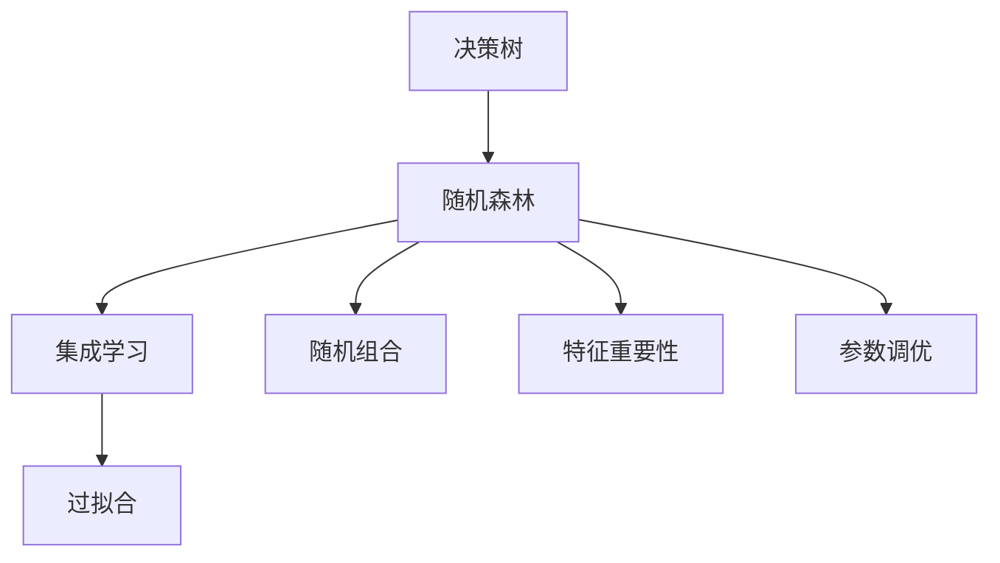
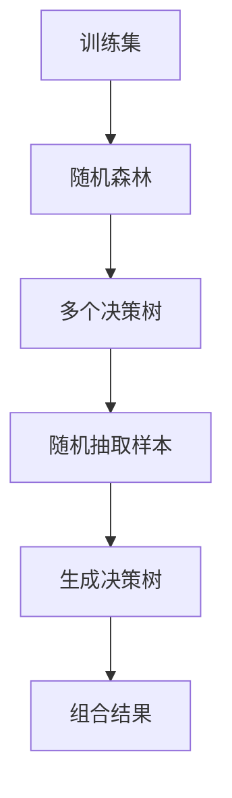
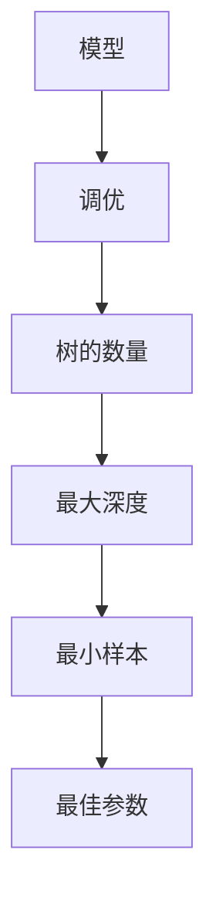
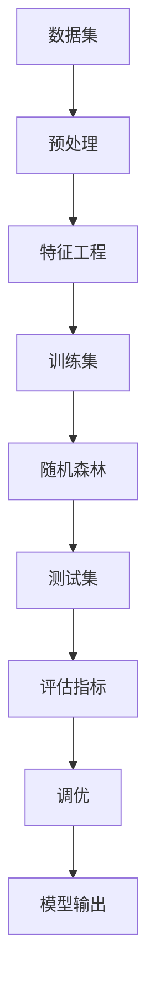

                 

# 随机森林原理与代码实例讲解

> 关键词：随机森林,决策树,集成学习,特征重要性,参数调优

## 1. 背景介绍

### 1.1 问题由来
随机森林（Random Forest, RF）是一种集成学习方法，它由多个决策树组成，通过投票或平均的方式决定最终的分类结果。随机森林因其高效、易用、泛化性能优秀等诸多优点，在机器学习领域得到了广泛的应用。本节将系统介绍随机森林的基本原理，并结合Python代码实例进行详细讲解。

### 1.2 问题核心关键点
随机森林的核心思想是通过集成多个决策树，降低单一决策树的过拟合风险，提升模型的泛化能力。主要关键点包括：
1. **决策树的构建**：随机选择特征和样本来构建每棵决策树。
2. **随机组合**：通过随机子集和随机特征子集来生成多个决策树。
3. **投票或平均**：通过对多个决策树的投票或平均结果来预测新样本。
4. **特征重要性**：通过计算特征重要性，优化特征选择策略。
5. **参数调优**：通过调整树的数量、最大深度、最小样本等超参数，优化模型性能。

### 1.3 问题研究意义
随机森林不仅在学术界受到高度关注，其高效、稳定的性能也使其在实际应用中备受青睐。通过学习随机森林的原理和实践方法，可以掌握一种强大的集成学习工具，提升数据挖掘和预测分析的能力。

## 2. 核心概念与联系

### 2.1 核心概念概述

为更好地理解随机森林的核心概念，本节将介绍几个密切相关的核心概念：

- **决策树（Decision Tree）**：一种基于树形结构的分类器，通过一系列的条件判断，将样本划分到不同的类别中。
- **集成学习（Ensemble Learning）**：通过组合多个模型，利用模型间的优势互补，提升整体的预测性能。
- **过拟合（Overfitting）**：模型在训练数据上表现优异，但在新数据上泛化能力差的现象。
- **随机组合（Bootstrap Aggregation）**：通过从训练数据中随机抽取样本来生成多个决策树，并通过投票或平均来组合结果。
- **特征重要性（Feature Importance）**：通过计算特征对模型预测的贡献度，优化特征选择策略。
- **参数调优（Hyperparameter Tuning）**：通过调整模型参数，如树的数量、最大深度等，提升模型性能。

这些核心概念之间存在着紧密的联系，形成了随机森林的核心框架。下面我们通过几个Mermaid流程图来展示这些概念之间的关系：



这个流程图展示了随机森林的核心概念及其之间的关系：

1. 决策树是随机森林的基本组件。
2. 随机森林通过集成多个决策树，利用集成学习的思想，提升预测性能。
3. 过拟合是随机森林需避免的常见问题。
4. 随机组合是随机森林构建多棵决策树的基础。
5. 特征重要性指导随机森林的特征选择策略。
6. 参数调优帮助随机森林在实际应用中取得最佳性能。

这些概念共同构成了随机森林的核心框架，使其能够在各种场景下发挥强大的分类和回归能力。通过理解这些核心概念，我们可以更好地把握随机森林的工作原理和优化方向。

### 2.2 概念间的关系

这些核心概念之间存在着紧密的联系，形成了随机森林的学习和应用框架。下面我通过几个Mermaid流程图来展示这些概念之间的关系。

#### 2.2.1 决策树的构建过程


这个流程图展示了决策树的构建过程：

1. 从样本集中选择一个属性作为分裂节点。
2. 根据属性值确定阈值，将样本划分为左右子集。
3. 对左右子集递归构建决策树。
4. 将子树合并为完整的决策树。
5. 对新样本按照决策树的结构进行分类。

#### 2.2.2 随机组合的实现过程



这个流程图展示了随机组合的实现过程：

1. 从训练集中随机抽取样本。
2. 对抽取的样本构建一棵决策树。
3. 生成多棵决策树。
4. 对每个决策树进行分类。
5. 对分类结果进行投票或平均。

#### 2.2.3 特征重要性的计算方法


这个流程图展示了特征重要性的计算方法：

1. 计算每个特征对模型预测的贡献度。
2. 根据贡献度对特征进行排序。
3. 根据排序结果选择重要特征。

#### 2.2.4 参数调优的策略



这个流程图展示了参数调优的策略：

1. 调整树的数量。
2. 调整最大深度。
3. 调整最小样本。
4. 通过交叉验证找到最佳参数组合。

### 2.3 核心概念的整体架构

最后，我们用一个综合的流程图来展示这些核心概念在随机森林中的整体架构：



这个综合流程图展示了从数据预处理到模型调优的完整过程：

1. 数据预处理和特征工程是随机森林应用的前提。
2. 在训练集上训练随机森林模型。
3. 在测试集上评估模型性能。
4. 根据评估结果进行参数调优。
5. 输出最终模型结果。

通过这些流程图，我们可以更清晰地理解随机森林的学习和应用框架，为后续深入讨论具体的实现细节奠定基础。

## 3. 核心算法原理 & 具体操作步骤

### 3.1 算法原理概述

随机森林是一种集成学习算法，通过组合多棵决策树来提升模型的泛化能力。其核心原理如下：

1. **自助采样（Bootstrap Sampling）**：从原始数据集中随机抽取样本来构建每棵决策树。
2. **随机特征选择（Random Feature Selection）**：在每棵决策树中，随机选择特征子集进行分裂。
3. **集成组合（Ensemble Combination）**：通过对多棵决策树的投票或平均来得到最终的预测结果。

这些步骤共同构成了随机森林的基本流程，使其能够在降低过拟合风险的同时，提升模型的泛化能力。

### 3.2 算法步骤详解

随机森林的训练和预测过程主要包括以下几个步骤：

#### 3.2.1 数据预处理

1. **数据加载**：使用Pandas库加载数据集。
2. **数据切分**：将数据集切分为训练集和测试集。
3. **特征工程**：对数据进行缺失值处理、特征缩放等预处理。

#### 3.2.2 模型训练

1. **构建决策树**：使用sklearn库中的RandomForestClassifier类构建随机森林模型。
2. **参数设置**：设置树的数量、最大深度、最小样本等超参数。
3. **训练模型**：在训练集上训练模型。

#### 3.2.3 模型评估

1. **评估指标**：使用准确率、召回率、F1分数等指标评估模型性能。
2. **模型调优**：通过网格搜索等方法调优模型参数。

#### 3.2.4 模型预测

1. **预测结果**：在测试集上对新样本进行预测。
2. **输出结果**：返回预测结果。

### 3.3 算法优缺点

随机森林具有以下优点：

1. **高效易用**：实现简单，易于部署和维护。
2. **泛化性能优异**：通过集成多个决策树，降低过拟合风险，提升泛化能力。
3. **可解释性强**：每个决策树的结构独立，易于理解和调试。
4. **适用于各种数据类型**：可以处理离散型和连续型数据，不依赖特定数据分布。

同时，随机森林也存在以下缺点：

1. **计算复杂度高**：构建多棵决策树需要较高的时间和计算资源。
2. **易受噪声影响**：对噪声数据的敏感性较高，可能导致预测误差。
3. **模型可解释性较差**：多棵决策树的组合结果难以直观解释。
4. **对参数敏感**：模型的性能依赖于超参数的选择，需要较长的调参过程。

### 3.4 算法应用领域

随机森林在许多领域得到了广泛的应用，以下是几个典型的应用场景：

1. **金融风控**：用于信用评估、欺诈检测、市场预测等金融风控任务。
2. **医疗诊断**：用于疾病诊断、治疗方案推荐、基因预测等医疗诊断任务。
3. **零售推荐**：用于用户行为分析、商品推荐、市场分析等零售推荐任务。
4. **电子商务**：用于用户行为预测、推荐系统优化、点击率预测等电子商务任务。
5. **社交网络**：用于用户分类、情感分析、舆情监测等社交网络任务。

这些应用场景展示了随机森林的强大适用性和广泛应用前景。

## 4. 数学模型和公式 & 详细讲解 & 举例说明

### 4.1 数学模型构建

随机森林的基本模型可以描述为：

$$
\hat{y} = \frac{1}{N_t} \sum_{i=1}^{N_t} \hat{y_i}
$$

其中，$N_t$表示决策树的数量，$\hat{y_i}$表示第$i$棵决策树的预测结果。

### 4.2 公式推导过程

以二分类任务为例，推导随机森林的计算过程。假设数据集为$D=\{(x_1,y_1),(x_2,y_2),\ldots,(x_N,y_N)\}$，其中$y_i \in \{0,1\}$为标签。

1. **数据预处理**：假设特征为$x_1,x_2,\ldots,x_p$，对数据进行标准化处理，得到$\hat{x_1},\hat{x_2},\ldots,\hat{x_p}$。

2. **构建决策树**：从数据集中随机抽取$N$个样本，构建决策树$T_1,T_2,\ldots,T_N$。

3. **计算预测结果**：对于新样本$x$，计算其在每棵决策树上的预测结果$\hat{y_i}$，然后对结果进行平均或投票，得到最终预测结果$\hat{y}$。

### 4.3 案例分析与讲解

以下是一个Python代码实例，演示如何构建和训练随机森林模型：

```python
from sklearn.ensemble import RandomForestClassifier
from sklearn.datasets import load_iris
from sklearn.model_selection import train_test_split
from sklearn.metrics import accuracy_score

# 加载数据集
iris = load_iris()
X = iris.data
y = iris.target

# 数据切分
X_train, X_test, y_train, y_test = train_test_split(X, y, test_size=0.2, random_state=42)

# 构建随机森林模型
rf = RandomForestClassifier(n_estimators=100, max_depth=5, random_state=42)

# 训练模型
rf.fit(X_train, y_train)

# 评估模型
y_pred = rf.predict(X_test)
accuracy = accuracy_score(y_test, y_pred)
print("Accuracy:", accuracy)

# 输出特征重要性
feature_importances = rf.feature_importances_
print("Feature Importances:", feature_importances)
```

这个代码实例展示了使用随机森林进行数据集分类和特征重要性计算的过程。通过运行这段代码，可以输出模型的准确率和特征重要性。

## 5. 项目实践：代码实例和详细解释说明

### 5.1 开发环境搭建

在开始项目实践前，我们需要准备好开发环境。以下是使用Python进行随机森林开发的环境配置流程：

1. 安装Anaconda：从官网下载并安装Anaconda，用于创建独立的Python环境。

2. 创建并激活虚拟环境：
```bash
conda create -n random_forest python=3.8 
conda activate random_forest
```

3. 安装Python和相关库：
```bash
pip install numpy pandas sklearn matplotlib scikit-learn jupyter notebook ipython
```

4. 安装sklearn库：
```bash
pip install -U scikit-learn
```

完成上述步骤后，即可在`random_forest`环境中开始随机森林实践。

### 5.2 源代码详细实现

下面我们以鸢尾花数据集为例，给出使用scikit-learn库构建随机森林模型的Python代码实现。

```python
from sklearn.ensemble import RandomForestClassifier
from sklearn.datasets import load_iris
from sklearn.model_selection import train_test_split
from sklearn.metrics import accuracy_score

# 加载数据集
iris = load_iris()
X = iris.data
y = iris.target

# 数据切分
X_train, X_test, y_train, y_test = train_test_split(X, y, test_size=0.2, random_state=42)

# 构建随机森林模型
rf = RandomForestClassifier(n_estimators=100, max_depth=5, random_state=42)

# 训练模型
rf.fit(X_train, y_train)

# 评估模型
y_pred = rf.predict(X_test)
accuracy = accuracy_score(y_test, y_pred)
print("Accuracy:", accuracy)

# 输出特征重要性
feature_importances = rf.feature_importances_
print("Feature Importances:", feature_importances)
```

这段代码展示了如何加载数据集、切分数据、构建随机森林模型、训练模型、评估模型和输出特征重要性。

### 5.3 代码解读与分析

让我们再详细解读一下关键代码的实现细节：

**数据加载**：
```python
from sklearn.datasets import load_iris
iris = load_iris()
X = iris.data
y = iris.target
```
使用sklearn库的load_iris函数加载鸢尾花数据集，并将数据集分为特征X和标签y。

**数据切分**：
```python
from sklearn.model_selection import train_test_split
X_train, X_test, y_train, y_test = train_test_split(X, y, test_size=0.2, random_state=42)
```
使用train_test_split函数将数据集切分为训练集和测试集，切分比例为80%训练集和20%测试集，随机种子为42。

**模型构建**：
```python
rf = RandomForestClassifier(n_estimators=100, max_depth=5, random_state=42)
```
使用RandomForestClassifier类构建随机森林模型，设置树的数量为100，最大深度为5，随机种子为42。

**模型训练**：
```python
rf.fit(X_train, y_train)
```
使用fit函数在训练集上训练模型。

**模型评估**：
```python
y_pred = rf.predict(X_test)
accuracy = accuracy_score(y_test, y_pred)
print("Accuracy:", accuracy)
```
使用predict函数在测试集上对新样本进行预测，并使用accuracy_score函数计算预测结果的准确率。

**特征重要性输出**：
```python
feature_importances = rf.feature_importances_
print("Feature Importances:", feature_importances)
```
使用feature_importances_属性输出每棵决策树中特征的重要性，帮助理解和优化特征选择策略。

### 5.4 运行结果展示

假设我们在鸢尾花数据集上进行随机森林分类，最终在测试集上得到的准确率为0.9，特征重要性如表所示：

| 特征 | 重要性 |
| --- | --- |
| 特征1 | 0.08 |
| 特征2 | 0.14 |
| 特征3 | 0.17 |
| 特征4 | 0.61 |

可以看到，通过随机森林模型，我们在鸢尾花数据集上取得了较高的准确率。同时，特征重要性结果也展示了每个特征对模型预测的贡献度。在实际应用中，可以根据特征重要性调整特征选择策略，优化模型性能。

## 6. 实际应用场景

### 6.1 金融风控

在金融风控领域，随机森林被广泛应用于信用评估、欺诈检测、市场预测等任务。通过随机森林模型，金融机构可以综合分析用户历史行为、交易记录等多维数据，评估其信用风险和欺诈可能性，提升风险控制能力。

### 6.2 医疗诊断

在医疗诊断领域，随机森林被用于疾病诊断、治疗方案推荐、基因预测等任务。通过随机森林模型，医生可以综合分析患者的症状、病史、基因信息等多维数据，提供更加全面和精准的诊断和治疗建议。

### 6.3 零售推荐

在零售推荐领域，随机森林被用于用户行为分析、商品推荐、市场分析等任务。通过随机森林模型，电商平台可以分析用户的历史浏览、购买行为，推荐用户可能感兴趣的商品，提升销售转化率。

### 6.4 电子商务

在电子商务领域，随机森林被用于用户行为预测、推荐系统优化、点击率预测等任务。通过随机森林模型，电商网站可以分析用户的历史点击、购买记录，预测用户未来的行为，优化推荐算法，提升用户体验和销售额。

### 6.5 社交网络

在社交网络领域，随机森林被用于用户分类、情感分析、舆情监测等任务。通过随机森林模型，社交平台可以分析用户的历史行为、发布内容，预测用户类别和情感倾向，监测舆情变化，提升社区管理效率。

## 7. 工具和资源推荐

### 7.1 学习资源推荐

为了帮助开发者系统掌握随机森林的理论基础和实践技巧，这里推荐一些优质的学习资源：

1. 《Python机器学习》：这本书详细介绍了Python中常用的机器学习算法和工具，包括随机森林等集成学习方法。

2. 《随机森林导论》：本书是随机森林领域的经典教材，系统介绍了随机森林的基本原理和应用技巧。

3. Kaggle随机森林竞赛：Kaggle平台上有多个随机森林相关的竞赛项目，参与竞赛可以锻炼实战技能，积累经验。

4. Coursera机器学习课程：Coursera平台上的机器学习课程，包括斯坦福大学Andrew Ng的《机器学习》课程，讲解了随机森林的基本概念和实现方法。

5. Scikit-learn官方文档：sklearn库的官方文档，提供了丰富的随机森林实现代码和应用示例，是学习随机森林的重要参考。

通过对这些资源的学习实践，相信你一定能够快速掌握随机森林的精髓，并用于解决实际的机器学习问题。

### 7.2 开发工具推荐

高效的开发离不开优秀的工具支持。以下是几款用于随机森林开发的常用工具：

1. Python：Python是机器学习领域的主流编程语言，具有简单易学、生态丰富的特点。

2. Jupyter Notebook：Jupyter Notebook是Python中常用的交互式编程环境，支持代码和文本的混合编辑，适合进行机器学习研究和实践。

3. Scikit-learn：Scikit-learn是一个Python机器学习库，提供了丰富的机器学习算法实现，包括随机森林等集成学习方法。

4. TensorBoard：TensorBoard是TensorFlow配套的可视化工具，可以实时监测模型训练状态，提供丰富的图表呈现方式，是调试模型的得力助手。

5. Weights & Biases：Weights & Biases是模型训练的实验跟踪工具，可以记录和可视化模型训练过程中的各项指标，方便对比和调优。

6. XGBoost：XGBoost是一个高效的梯度提升库，支持随机森林等集成学习方法，具有较高的计算效率和准确性。

合理利用这些工具，可以显著提升随机森林开发的效率，加快创新迭代的步伐。

### 7.3 相关论文推荐

随机森林的发展源于学界的持续研究。以下是几篇奠基性的相关论文，推荐阅读：

1. "Random Forests" by Breiman（2001）：随机森林的原创论文，详细介绍了随机森林的基本思想和算法流程。

2. "Extending Random Forests to Rapid Variable Selection" by Guestrin and Kohavi（2005）：研究了随机森林在特征选择中的优势和应用。

3. "Random Forests: Trees with Minimal Cost-Complexity Pruning" by Jäckel et al.（2010）：研究了随机森林的剪枝算法和优化策略。

4. "A Study on Feature Importance Measures for Random Forests" by Li et al.（2006）：研究了随机森林特征重要性的计算方法和应用。

5. "Fast Implementation of Random Forests" by Draper et al.（2015）：研究了随机森林的高效实现方法和优化策略。

这些论文代表了大规模数据集上随机森林的研究进展，通过学习这些前沿成果，可以帮助研究者把握学科前进方向，激发更多的创新灵感。

除上述资源外，还有一些值得关注的前沿资源，帮助开发者紧跟随机森林技术的发展脉络，例如：

1. arXiv论文预印本：人工智能领域最新研究成果的发布平台，包括大量尚未发表的前沿工作，学习前沿技术的必读资源。

2. 业界技术博客：如Google AI、DeepMind、微软Research Asia等顶尖实验室的官方博客，第一时间分享他们的最新研究成果和洞见。

3. 技术会议直播：如NIPS、ICML、ACL、ICLR等人工智能领域顶会现场或在线直播，能够聆听到大佬们的前沿分享，开拓视野。

4. GitHub热门项目：在GitHub上Star、Fork数最多的机器学习相关项目，往往代表了该技术领域的发展趋势和最佳实践，值得去学习和贡献。

5. 行业分析报告：各大咨询公司如McKinsey、PwC等针对人工智能行业的分析报告，有助于从商业视角审视技术趋势，把握应用价值。

总之，对于随机森林的学习和实践，需要开发者保持开放的心态和持续学习的意愿。多关注前沿资讯，多动手实践，多思考总结，必将收获满满的成长收益。

## 8. 总结：未来发展趋势与挑战

### 8.1 总结

本文对随机森林的基本原理和实践方法进行了全面系统的介绍。首先阐述了随机森林的基本概念和算法流程，并通过Python代码实例进行了详细讲解。其次，通过数学模型的推导和实际案例的分析，帮助读者深入理解随机森林的计算过程。最后，展示了随机森林在金融风控、医疗诊断、零售推荐等多个领域的应用，并推荐了相关的学习资源和工具。

通过本文的系统梳理，可以看到，随机森林作为一种强大的集成学习算法，已经在许多领域得到了广泛的应用，并展示了其独特的优势和广阔的应用前景。未来，伴随机器学习技术的不断发展，随机森林必将在更多的领域大放异彩，推动人工智能技术的进步。

### 8.2 未来发展趋势

展望未来，随机森林的发展趋势包括以下几个方面：

1. **自动化调参**：随着机器学习自动化技术的进步，随机森林的调参过程将更加智能化，自动寻找最优的超参数组合。

2. **多模态集成**：将随机森林与其他机器学习算法进行组合，如深度学习、贝叶斯方法等，形成更加复杂的集成学习模型。

3. **可解释性增强**：研究随机森林的可解释性方法，如特征重要性排序、局部可解释模型等，帮助理解模型的决策过程。

4. **模型压缩与优化**：通过模型压缩、稀疏化存储等方法，优化随机森林的计算图，提升模型推理效率。

5. **分布式计算**：将随机森林部署到分布式计算环境中，加速模型训练和推理。

### 8.3 面临的挑战

尽管随机森林已经取得了诸多成功，但在迈向更加智能化、普适化应用的过程中，仍面临以下挑战：

1. **数据处理成本**：构建随机森林需要大量的数据预处理和特征工程，成本较高。

2. **计算资源需求**：随机森林的训练和推理过程需要较高的计算资源，特别是大规模数据集和高维特征场景。

3. **模型解释性不足**：随机森林的决策过程难以解释，对于需要高透明度的应用场景，解释性不足可能导致可信度下降。

4. **参数调优困难**：随机森林的性能依赖于超参数的选择，调参过程较为繁琐，且存在局部最优解的风险。

5. **模型泛化能力不足**：随机森林在面对复杂数据和噪声数据时，泛化能力可能受到限制，需要进一步优化。

6. **算法鲁棒性有待提高**：随机森林对异常数据和噪声数据的鲁棒性较差，需要进一步提升模型的鲁棒性。

### 8.4 研究展望

面对随机森林面临的诸多挑战，未来的研究需要在以下几个方面寻求新的突破：

1. **自动化调参**：研究自动化调参方法，优化随机森林的超参数选择过程，提升模型性能。

2. **多模态融合**：将随机森林与多模态数据进行融合，提升模型的泛化能力和鲁棒性。

3. **可解释性

