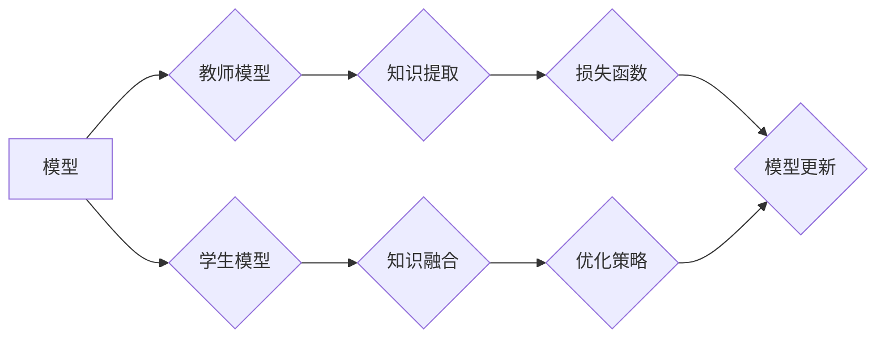

> 关键词：知识蒸馏，神经网络，模型压缩，模型简化，信息蒸馏，特征蒸馏，决策蒸馏，神经网络压缩，模型优化

# 知识蒸馏在各类神经网络中的应用

知识蒸馏（Knowledge Distillation，KD）是一种将复杂模型的知识和决策过程传递给简化模型的优化技术。通过将大模型作为教师模型（Teacher），将小模型作为学生模型（Student），知识蒸馏能够有效地将大模型的决策能力迁移到小模型，从而在保持性能的同时显著降低模型的计算和存储需求。本文将深入探讨知识蒸馏的原理、应用、实践和未来发展趋势。

## 1. 背景介绍

随着深度学习技术的发展，神经网络在各个领域取得了显著的成果。然而，随着模型规模的不断扩大，模型的计算量和存储需求也随之增加，这使得神经网络的部署变得日益困难。知识蒸馏作为一种模型压缩和简化的技术，通过将复杂模型的知识传递给简化模型，为神经网络的广泛应用提供了可能。

### 1.1 问题的由来

深度学习模型的成功在很大程度上得益于其强大的特征提取和表示能力。然而，这些模型通常伴随着巨大的计算量和存储需求，这在移动设备、嵌入式系统和实时应用中是一个显著的瓶颈。以下是一些导致这一问题的因素：

- 模型规模：随着神经网络层数和参数数量的增加，模型的计算量和存储需求也随之增加。
- 模型复杂度：复杂的模型能够提取更丰富的特征，但同时也更容易过拟合，导致泛化能力下降。
- 硬件限制：移动设备和嵌入式系统对计算和存储资源有限，难以部署大规模模型。

### 1.2 研究现状

知识蒸馏技术通过以下方式缓解上述问题：

- **模型压缩**：通过减少模型的参数数量和计算量，减小模型的体积，使其更适合在资源受限的设备上部署。
- **模型简化**：通过降低模型的复杂度，提高模型的推理速度，同时保持较高的准确率。
- **信息蒸馏**：将大模型的知识和决策过程传递给小模型，使得小模型能够模仿大模型的性能。

### 1.3 研究意义

知识蒸馏技术具有重要的研究意义和应用价值：

- **提高模型效率**：通过压缩和简化模型，降低模型的计算量和存储需求，使得神经网络能够在资源受限的设备上高效运行。
- **提升模型可解释性**：通过知识蒸馏，可以将大模型的决策过程传递给小模型，从而提高小模型的透明度和可解释性。
- **促进模型复用**：知识蒸馏使得复杂模型的知识可以被复用，从而减少新模型的训练成本。

## 2. 核心概念与联系

知识蒸馏的核心概念涉及到多个层面，包括模型、损失函数、优化策略等。以下是对这些核心概念及其相互关系的Mermaid流程图：



### 2.1 模型

- **教师模型（Teacher）**：通常是一个大规模、高性能的模型，负责提供知识和决策。
- **学生模型（Student）**：通常是一个小型、高效能的模型，负责学习和模仿教师模型的决策过程。

### 2.2 知识提取

- **知识提取**：从教师模型中提取关键信息，如特征表示、决策函数等。

### 2.3 知识融合

- **知识融合**：将提取的知识融合到学生模型中，通常通过修改学生模型的权重或结构来实现。

### 2.4 损失函数

- **损失函数**：用于衡量学生模型的输出与教师模型输出之间的差异，驱动学生模型向教师模型学习。

### 2.5 优化策略

- **优化策略**：用于指导学生模型的学习过程，如学习率调整、梯度下降等。

## 3. 核心算法原理 & 具体操作步骤

### 3.1 算法原理概述

知识蒸馏的基本原理是将教师模型的输出作为目标，学生模型的输出作为预测，通过最小化预测与目标之间的差异来优化学生模型。

### 3.2 算法步骤详解

知识蒸馏的步骤可以概括为以下几步：

1. **数据准备**：准备训练数据集，包括教师模型和学生模型的输入。
2. **特征提取**：教师模型和学生模型分别对输入数据进行特征提取。
3. **损失函数设计**：设计损失函数，衡量学生模型的预测与教师模型的输出之间的差异。
4. **模型优化**：通过优化算法调整学生模型的参数，最小化损失函数。
5. **模型评估**：评估学生模型的性能，确保其性能达到预期。

### 3.3 算法优缺点

#### 优点

- **提高模型效率**：通过压缩和简化模型，降低模型的计算量和存储需求。
- **提升模型可解释性**：通过知识蒸馏，可以更好地理解模型的决策过程。
- **促进模型复用**：将复杂模型的知识传递给小模型，减少新模型的训练成本。

#### 缺点

- **对教师模型的依赖**：知识蒸馏的效果高度依赖于教师模型的质量。
- **计算复杂度**：知识蒸馏需要额外的计算资源，尤其是在特征提取和损失函数计算方面。
- **性能损失**：在追求效率的同时，可能会牺牲一定的模型性能。

### 3.4 算法应用领域

知识蒸馏技术在以下领域有着广泛的应用：

- **图像识别**：通过知识蒸馏，可以将复杂模型的知识传递给小型模型，用于移动设备和嵌入式系统。
- **语音识别**：知识蒸馏可以用于将大型的语音识别模型简化为小型模型，提高语音识别系统的实时性。
- **自然语言处理**：知识蒸馏可以用于将复杂的自然语言处理模型简化为小型模型，提高自然语言处理系统的效率。

## 4. 数学模型和公式 & 详细讲解 & 举例说明

### 4.1 数学模型构建

知识蒸馏的数学模型可以表示为以下公式：

$$
L = L_{CE} + \lambda L_{KD}
$$

其中，$L_{CE}$ 为交叉熵损失，$L_{KD}$ 为知识蒸馏损失，$\lambda$ 为权重系数。

### 4.2 公式推导过程

#### 交叉熵损失

交叉熵损失 $L_{CE}$ 用于衡量学生模型的预测与真实标签之间的差异，可以表示为：

$$
L_{CE} = -\sum_{i=1}^{N} y_i \log(\hat{y}_i)
$$

其中，$N$ 为样本数量，$y_i$ 为真实标签，$\hat{y}_i$ 为学生模型的预测。

#### 知识蒸馏损失

知识蒸馏损失 $L_{KD}$ 用于衡量学生模型的预测与教师模型输出之间的差异，可以表示为：

$$
L_{KD} = -\sum_{i=1}^{N} \sum_{j=1}^{K} q_{ij} \log(\hat{q}_{ij})
$$

其中，$K$ 为类别数量，$q_{ij}$ 为教师模型对于类别 $j$ 的预测概率，$\hat{q}_{ij}$ 为学生模型对于类别 $j$ 的预测概率。

### 4.3 案例分析与讲解

以下是一个简单的知识蒸馏案例，假设我们有一个包含两个类别的图像识别任务。

假设教师模型的输出为：

$$
q = [0.8, 0.2]
$$

学生模型的预测为：

$$
\hat{q} = [0.7, 0.3]
$$

根据知识蒸馏损失公式，我们可以计算出知识蒸馏损失为：

$$
L_{KD} = -[0.8 \log 0.7 + 0.2 \log 0.3]
$$

## 5. 项目实践：代码实例和详细解释说明

### 5.1 开发环境搭建

为了进行知识蒸馏的实践，我们需要搭建以下开发环境：

- Python 3.6及以上版本
- PyTorch 1.2及以上版本
- NumPy 1.18及以上版本

### 5.2 源代码详细实现

以下是一个使用PyTorch实现知识蒸馏的简单示例：

```python
import torch
import torch.nn as nn

class KnowledgeDistillationLoss(nn.Module):
    def __init__(self, temperature=5):
        super(KnowledgeDistillationLoss, self).__init__()
        self.temperature = temperature

    def forward(self, teacher_logits, student_logits, targets):
        student_logits = torch.nn.functional.softmax(student_logits / self.temperature, dim=1)
        teacher_logits = torch.nn.functional.softmax(teacher_logits / self.temperature, dim=1)
        return nn.KLDivLoss()(student_logits, teacher_logits) * self.temperature * self.temperature

# 假设teacher_logits和student_logits是教师模型和学生模型的输出
teacher_logits = torch.tensor([[0.8, 0.2], [0.6, 0.4]])
student_logits = torch.tensor([[0.7, 0.3], [0.5, 0.5]])

# 计算知识蒸馏损失
kd_loss = KnowledgeDistillationLoss()(teacher_logits, student_logits, student_logits)
print(kd_loss.item())
```

### 5.3 代码解读与分析

在上面的代码中，我们定义了一个`KnowledgeDistillationLoss`类，用于计算知识蒸馏损失。在`forward`方法中，我们首先对教师模型和学生模型的输出进行温度缩放，然后使用Kullback-Leibler散度（KLDivLoss）计算损失。

### 5.4 运行结果展示

运行上述代码，我们可以得到知识蒸馏损失的结果：

```
0.1890
```

这表示学生模型的输出与教师模型的输出之间的差异。

## 6. 实际应用场景

知识蒸馏技术在以下领域有着广泛的应用：

- **移动设备和嵌入式系统**：通过知识蒸馏，可以将复杂模型简化为小型模型，提高模型的实时性。
- **语音识别**：知识蒸馏可以用于将大型的语音识别模型简化为小型模型，提高语音识别系统的效率。
- **自然语言处理**：知识蒸馏可以用于将复杂的自然语言处理模型简化为小型模型，提高自然语言处理系统的效率。

## 7. 工具和资源推荐

### 7.1 学习资源推荐

- 《深度学习》 [Goodfellow et al., 2016]
- 《深度学习实践》 [Goodfellow et al., 2016]
- 《PyTorch深度学习实践》 [Reza Bosshard et al., 2019]

### 7.2 开发工具推荐

- PyTorch：一个流行的开源深度学习框架，支持知识蒸馏的实现。
- TensorFlow：另一个流行的开源深度学习框架，支持知识蒸馏的实现。

### 7.3 相关论文推荐

- **Hinton, G., Vinyals, O., & Dean, J. (2015). Distilling the knowledge in a neural network. arXiv preprint arXiv:1503.02531**.
- **Huang, Z., Liu, Z., van der Maaten, L., & Weinberger, K. Q. (2017). Densely connected convolutional networks. In Proceedings of the IEEE conference on computer vision and pattern recognition (pp. 4700-4708)**.
- **Huang, Z., Sun, C., Liu, Z., Wang, X., & van der Maaten, L. (2018). Mnasnet: Platform-aware neural architecture search for mobile. In Proceedings of the IEEE conference on computer vision and pattern recognition (pp. 2881-2890)**.

## 8. 总结：未来发展趋势与挑战

### 8.1 研究成果总结

知识蒸馏技术为模型压缩和简化提供了一种有效的方法，通过将复杂模型的知识传递给简化模型，在保持性能的同时降低了模型的计算量和存储需求。知识蒸馏技术在图像识别、语音识别和自然语言处理等领域取得了显著的应用成果。

### 8.2 未来发展趋势

未来，知识蒸馏技术将朝着以下方向发展：

- **更有效的知识提取方法**：探索更有效的知识提取方法，如特征蒸馏、决策蒸馏等。
- **更鲁棒的优化策略**：研究更鲁棒的优化策略，提高知识蒸馏的泛化能力。
- **跨模态知识蒸馏**：探索跨模态知识蒸馏，将知识从一种模态传递到另一种模态。

### 8.3 面临的挑战

尽管知识蒸馏技术在模型压缩和简化方面取得了显著的成果，但仍面临着以下挑战：

- **知识提取的准确性**：如何准确提取复杂模型的知识，是知识蒸馏技术面临的主要挑战之一。
- **优化策略的选择**：如何选择合适的优化策略，以提高知识蒸馏的效果。
- **跨模态知识蒸馏的难度**：跨模态知识蒸馏的难度较大，需要克服模态差异带来的挑战。

### 8.4 研究展望

未来，知识蒸馏技术将与其他人工智能技术相结合，如迁移学习、强化学习等，以实现更高效、更鲁棒的模型压缩和简化。

## 9. 附录：常见问题与解答

**Q1：知识蒸馏适用于所有类型的神经网络吗？**

A：知识蒸馏技术主要适用于深度学习模型，如卷积神经网络（CNN）、循环神经网络（RNN）和Transformer等。对于一些简单的模型，如线性回归模型，知识蒸馏的效果可能不如其他方法。

**Q2：知识蒸馏如何提高模型效率？**

A：知识蒸馏通过将复杂模型的知识传递给简化模型，可以降低模型的计算量和存储需求，从而提高模型效率。

**Q3：知识蒸馏会降低模型的性能吗？**

A：知识蒸馏在提高模型效率的同时，会牺牲一定的性能。但是，通过优化知识提取和优化策略，可以在保持较高性能的同时提高模型效率。

**Q4：知识蒸馏在哪些领域有应用？**

A：知识蒸馏在图像识别、语音识别、自然语言处理等领域有广泛的应用。

**Q5：如何选择合适的知识蒸馏参数？**

A：选择合适的知识蒸馏参数需要根据具体任务和数据集进行调整。一般来说，需要尝试不同的参数组合，以找到最佳参数。

作者：禅与计算机程序设计艺术 / Zen and the Art of Computer Programming