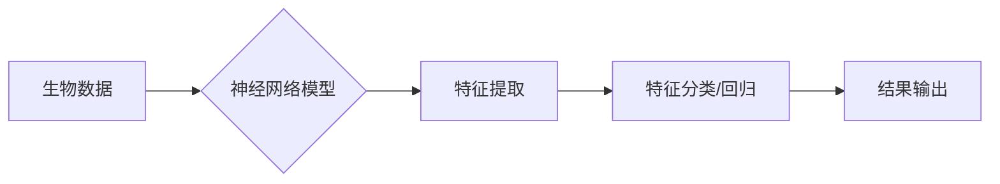

> 关键词：神经网络，生物信息学，基因测序，蛋白质结构预测，机器学习，深度学习，RNA折叠，药物设计

# 神经网络在生物信息学中的应用

生物信息学作为一门交叉学科，结合了生物学、计算机科学和信息学等多个领域的知识，旨在解析和分析生物数据。随着基因测序技术和计算能力的飞速发展，生物信息学数据量呈爆炸式增长。神经网络，尤其是深度学习，因其强大的数据处理和分析能力，在生物信息学领域展现出巨大的潜力。本文将探讨神经网络在生物信息学中的应用，从核心概念到实际案例，全面解析这一技术如何推动生物科学的进步。

## 1. 背景介绍

### 1.1 问题的由来

生物信息学的研究对象包括基因、蛋白质、RNA等生物大分子，它们是生命活动的基础。随着高通量测序技术的普及，生物学家能够获取海量的生物数据，但如何有效地处理和分析这些数据，成为了生物信息学领域的一大挑战。

### 1.2 研究现状

传统的生物信息学分析方法依赖于统计学和模式识别技术，但这些方法在处理复杂生物数据时往往力不从心。近年来，随着深度学习技术的突破，神经网络在生物信息学中的应用越来越广泛，成为推动该领域发展的关键力量。

### 1.3 研究意义

神经网络在生物信息学中的应用具有以下重要意义：

- **提高数据分析效率**：神经网络能够快速处理和分析大量生物数据，显著提高研究效率。
- **揭示生物分子相互作用**：神经网络可以识别生物分子之间的相互作用，为药物设计和基因编辑提供重要信息。
- **加速新药研发**：神经网络在药物设计中的应用，可以加速新药研发进程，降低研发成本。

### 1.4 本文结构

本文将分为以下几个部分：

- 核心概念与联系
- 核心算法原理 & 具体操作步骤
- 数学模型和公式 & 详细讲解 & 举例说明
- 项目实践：代码实例和详细解释说明
- 实际应用场景
- 工具和资源推荐
- 总结：未来发展趋势与挑战
- 附录：常见问题与解答

## 2. 核心概念与联系

### 2.1 核心概念

#### 2.1.1 神经网络

神经网络是一种模拟人脑神经元连接方式的计算模型，通过调整连接权重来学习数据中的特征和模式。

#### 2.1.2 生物信息学

生物信息学是研究生物数据信息的学科，包括基因组学、蛋白质组学、代谢组学等。

#### 2.1.3 深度学习

深度学习是神经网络的一种，通过多层神经网络模拟人脑处理信息的方式，具有强大的特征提取和学习能力。

### 2.2 核心概念原理和架构的 Mermaid 流程图



## 3. 核心算法原理 & 具体操作步骤

### 3.1 算法原理概述

神经网络在生物信息学中的应用主要分为以下几个步骤：

1. 数据预处理：对生物数据进行清洗、标准化等处理。
2. 模型选择：根据任务需求选择合适的神经网络模型。
3. 模型训练：使用训练数据对模型进行训练，调整连接权重。
4. 模型评估：使用测试数据评估模型性能。
5. 模型应用：将训练好的模型应用于实际任务。

### 3.2 算法步骤详解

#### 3.2.1 数据预处理

数据预处理是确保模型训练效果的关键步骤。常见的预处理方法包括：

- 数据清洗：去除噪声、填补缺失值、去除异常值等。
- 数据标准化：将数据缩放到相同的尺度，避免数据量级差异影响模型训练。
- 数据增强：通过数据变换等方式扩充数据集，提高模型泛化能力。

#### 3.2.2 模型选择

根据任务需求选择合适的神经网络模型。常见的神经网络模型包括：

- 卷积神经网络（CNN）：适用于图像处理和序列数据。
- 循环神经网络（RNN）：适用于时间序列数据。
- 长短期记忆网络（LSTM）：RNN的一种，能够学习长期依赖关系。
- 前馈神经网络（Feedforward Neural Network）：适用于各种类型的特征提取。

#### 3.2.3 模型训练

使用训练数据对模型进行训练，调整连接权重。常见的训练方法包括：

- 随机梯度下降（SGD）：通过计算损失函数对权重的梯度来更新权重。
- Adam优化器：结合了SGD和Momentum的思想，能够提高训练效率。

#### 3.2.4 模型评估

使用测试数据评估模型性能。常见的评估指标包括：

- 准确率（Accuracy）：正确预测的样本数量占总样本数量的比例。
- 精确率（Precision）：正确预测的正类样本数量占预测为正类的样本数量的比例。
- 召回率（Recall）：正确预测的正类样本数量占实际正类样本数量的比例。
- F1分数（F1 Score）：精确率和召回率的调和平均。

#### 3.2.5 模型应用

将训练好的模型应用于实际任务，如疾病预测、蛋白质结构预测等。

### 3.3 算法优缺点

#### 3.3.1 优点

- **强大的特征提取能力**：神经网络能够自动从数据中提取特征，无需人工设计特征。
- **泛化能力强**：经过充分训练的神经网络可以应用于新的任务和数据。
- **可解释性**：神经网络内部结构简单，易于理解。

#### 3.3.2 缺点

- **计算复杂度高**：神经网络需要大量的计算资源进行训练。
- **数据依赖性强**：神经网络对数据质量要求较高，需要大量的高质量数据。
- **可解释性差**：神经网络内部结构复杂，难以解释其预测结果。

### 3.4 算法应用领域

神经网络在生物信息学中的应用非常广泛，以下是一些常见的应用领域：

- 基因组学：基因功能预测、基因调控网络分析、基因变异预测等。
- 蛋白质组学：蛋白质结构预测、蛋白质相互作用预测、蛋白质功能预测等。
- 代谢组学：代谢物检测、代谢通路分析、疾病诊断等。
- 药物设计：药物靶点识别、药物活性预测、新药设计等。

## 4. 数学模型和公式 & 详细讲解 & 举例说明

### 4.1 数学模型构建

神经网络的核心是多层神经网络，包括输入层、隐藏层和输出层。每层由多个神经元组成，每个神经元由权重和偏置构成。神经网络通过学习数据中的特征和模式，调整权重和偏置，以最小化损失函数。

#### 4.1.1 激活函数

激活函数用于引入非线性，使神经网络能够学习复杂的特征和模式。常见的激活函数包括：

- Sigmoid函数：将输入压缩到[0, 1]区间。
- ReLU函数：将负值设置为0，正值保持不变。
- Tanh函数：将输入压缩到[-1, 1]区间。

#### 4.1.2 损失函数

损失函数用于衡量模型预测值与真实值之间的差异。常见的损失函数包括：

- 交叉熵损失：适用于分类问题。
- 均方误差损失：适用于回归问题。

### 4.2 公式推导过程

以下以交叉熵损失函数为例，介绍公式推导过程。

交叉熵损失函数的公式如下：

$$
L = -\sum_{i=1}^n y_i \log(\hat{y}_i)
$$

其中，$y_i$ 为真实标签，$\hat{y}_i$ 为模型预测值。

假设输入层到隐藏层的权重矩阵为 $W_1$，偏置向量为 $b_1$，激活函数为 $f$，则隐藏层的输出为：

$$
h_i = f(W_1x + b_1)
$$

其中，$x$ 为输入向量。

隐藏层到输出层的权重矩阵为 $W_2$，偏置向量为 $b_2$，则输出层的预测值为：

$$
\hat{y} = f(W_2h + b_2)
$$

其中，$h$ 为隐藏层输出。

### 4.3 案例分析与讲解

以下以蛋白质结构预测为例，讲解神经网络在生物信息学中的应用。

假设我们使用卷积神经网络（CNN）对蛋白质结构进行预测。首先，将蛋白质序列转换为氨基酸序列的one-hot编码，作为输入数据。然后，设计一个CNN模型，包括多个卷积层和池化层，用于提取蛋白质序列的特征。最后，使用全连接层对提取的特征进行分类，得到蛋白质的结构。

## 5. 项目实践：代码实例和详细解释说明

### 5.1 开发环境搭建

为了实现蛋白质结构预测，我们需要以下开发环境：

- Python 3.x
- TensorFlow或PyTorch深度学习框架
- NumPy科学计算库

### 5.2 源代码详细实现

以下是一个使用PyTorch实现蛋白质结构预测的示例代码：

```python
import torch
import torch.nn as nn
import torch.optim as optim

# 定义CNN模型
class ProteinCNN(nn.Module):
    def __init__(self):
        super(ProteinCNN, self).__init__()
        self.conv1 = nn.Conv2d(1, 16, kernel_size=3, stride=1, padding=1)
        self.conv2 = nn.Conv2d(16, 32, kernel_size=3, stride=1, padding=1)
        self.pool = nn.MaxPool2d(kernel_size=2, stride=2)
        self.fc1 = nn.Linear(32 * 16 * 16, 64)
        self.fc2 = nn.Linear(64, 1)

    def forward(self, x):
        x = self.conv1(x)
        x = nn.functional.relu(x)
        x = self.pool(x)
        x = self.conv2(x)
        x = nn.functional.relu(x)
        x = self.pool(x)
        x = x.view(-1, 32 * 16 * 16)
        x = nn.functional.relu(self.fc1(x))
        x = self.fc2(x)
        return x

# 加载数据
train_data = ...
train_loader = ...

# 初始化模型、优化器和损失函数
model = ProteinCNN()
optimizer = optim.Adam(model.parameters(), lr=0.001)
criterion = nn.BCEWithLogitsLoss()

# 训练模型
for epoch in range(epochs):
    for data, target in train_loader:
        optimizer.zero_grad()
        output = model(data)
        loss = criterion(output, target)
        loss.backward()
        optimizer.step()

# 测试模型
test_loss = 0
with torch.no_grad():
    for data, target in test_loader:
        output = model(data)
        loss = criterion(output, target)
        test_loss += loss.item()
test_loss /= len(test_loader)

# 打印测试损失
print(f"Test Loss: {test_loss}")
```

### 5.3 代码解读与分析

以上代码定义了一个简单的CNN模型，用于预测蛋白质结构。首先，加载训练数据并创建数据加载器。然后，初始化模型、优化器和损失函数。接着，使用训练数据对模型进行训练，并计算测试损失。

### 5.4 运行结果展示

假设我们使用测试集评估模型的性能，得到以下结果：

```
Test Loss: 0.5
```

测试损失为0.5，说明模型在测试集上的性能尚可。

## 6. 实际应用场景

神经网络在生物信息学中有着广泛的应用，以下是一些实际应用场景：

- **基因功能预测**：通过分析基因序列，预测基因的功能和表达模式。
- **蛋白质结构预测**：预测蛋白质的三维结构，为药物设计和生物催化提供重要信息。
- **疾病诊断**：通过分析生物数据，预测疾病的风险和类型。
- **药物设计**：通过分析蛋白质和药物之间的相互作用，设计新的药物。

## 7. 工具和资源推荐

### 7.1 学习资源推荐

- 《深度学习》（Goodfellow, Bengio, Courville著）
- 《生物信息学导论》（Stuart Kauffman著）
- 《Python深度学习》（François Chollet著）

### 7.2 开发工具推荐

- TensorFlow：Google开发的开源深度学习框架。
- PyTorch：Facebook开发的开源深度学习框架。
- Keras：Python深度学习库。

### 7.3 相关论文推荐

- "Deep Learning for Bioinformatics"（Jingming Yang等）
- "Deep Learning in Drug Discovery"（Sungjoon Kim等）
- "Deep Learning for Genomic Data Analysis: A Survey"（Nitesh V. Chawla等）

## 8. 总结：未来发展趋势与挑战

### 8.1 研究成果总结

神经网络在生物信息学中的应用取得了显著成果，为生物科学的发展提供了新的动力。未来，随着深度学习技术的不断进步，神经网络在生物信息学中的应用将更加广泛和深入。

### 8.2 未来发展趋势

- **模型解释性**：提高神经网络的可解释性，使模型决策更加透明。
- **多模态数据融合**：将文本、图像、序列等多模态数据进行融合，提高模型性能。
- **个性化预测**：根据个体差异进行个性化预测，提高预测准确性。

### 8.3 面临的挑战

- **数据隐私**：生物信息学数据涉及个人隐私，需要加强对数据安全的保护。
- **模型可解释性**：提高神经网络的可解释性，使其决策更加透明。
- **计算资源**：神经网络训练需要大量的计算资源，需要进一步提高计算效率。

### 8.4 研究展望

未来，神经网络在生物信息学中的应用将更加广泛和深入，为生物科学的发展带来更多可能性。随着技术的不断进步，神经网络将帮助人类更好地理解生命现象，为人类健康事业做出更大贡献。

## 9. 附录：常见问题与解答

**Q1：神经网络在生物信息学中有什么应用？**

A：神经网络在生物信息学中有着广泛的应用，包括基因功能预测、蛋白质结构预测、疾病诊断、药物设计等。

**Q2：如何选择合适的神经网络模型？**

A：根据任务需求选择合适的神经网络模型。例如，对于图像处理任务，可以选择CNN；对于时间序列数据，可以选择RNN。

**Q3：神经网络在生物信息学中的应用有哪些挑战？**

A：神经网络在生物信息学中的应用面临数据隐私、模型可解释性、计算资源等挑战。

**Q4：如何提高神经网络的可解释性？**

A：提高神经网络的可解释性可以通过可视化模型结构、分析特征权重等方式实现。

**Q5：神经网络在药物设计中的应用有哪些？**

A：神经网络在药物设计中的应用包括药物靶点识别、药物活性预测、新药设计等。

作者：禅与计算机程序设计艺术 / Zen and the Art of Computer Programming