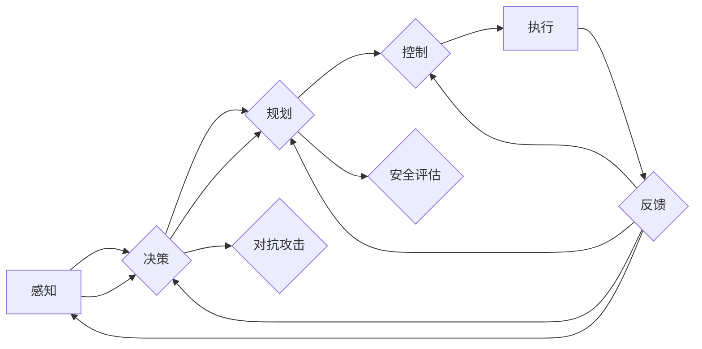

# 自动驾驶中的深度学习模型鲁棒性分析

> 关键词：自动驾驶，深度学习，鲁棒性，神经网络，数据增强，对抗攻击，安全评估

## 1. 背景介绍

自动驾驶技术正迅速发展，有望在未来彻底改变交通运输方式。然而，自动驾驶系统的安全和可靠性是其成功部署的关键。在自动驾驶系统中，深度学习模型被广泛应用于感知、决策和规划等关键任务。然而，深度学习模型的鲁棒性问题是实现安全自动驾驶的一大挑战。本文将深入探讨自动驾驶中深度学习模型的鲁棒性问题，分析其原理、挑战和解决方案。

### 1.1 问题的由来

深度学习模型在图像识别、语音识别等领域取得了显著的成果，但在自动驾驶领域，模型的鲁棒性问题尤为突出。以下是导致鲁棒性问题的主要原因：

- **数据分布变化**：实际道路环境复杂多变，与训练数据存在差异，导致模型在真实场景中性能下降。
- **对抗攻击**：攻击者可以通过精心设计的对抗样本，欺骗模型做出错误决策。
- **模型泛化能力不足**：模型可能对训练数据中的异常值过于敏感，导致泛化能力下降。

### 1.2 研究现状

近年来，针对深度学习模型的鲁棒性问题，研究者们提出了多种解决方案。以下是一些主要的研究方向：

- **数据增强**：通过数据扩充技术，提高模型对不同场景的适应能力。
- **对抗训练**：通过生成对抗样本，增强模型的对抗鲁棒性。
- **模型正则化**：使用正则化方法，如Dropout、Batch Normalization等，提高模型的鲁棒性。
- **安全评估方法**：开发安全评估工具，评估模型的鲁棒性和安全性。

### 1.3 研究意义

研究自动驾驶中深度学习模型的鲁棒性，对于保障自动驾驶系统的安全具有重要意义：

- 提高自动驾驶系统的可靠性，降低交通事故风险。
- 促进自动驾驶技术的标准化和规范化。
- 推动自动驾驶技术的商业化进程。

## 2. 核心概念与联系

### 2.1 核心概念原理和架构的 Mermaid 流程图



### 2.2 核心概念介绍

- **感知（A）**：自动驾驶系统通过传感器（如摄像头、雷达、激光雷达等）感知周围环境。
- **决策（B）**：基于感知数据，自动驾驶系统做出决策，如加速、减速、转向等。
- **规划（C）**：自动驾驶系统根据决策生成行驶路径和策略。
- **控制（D）**：自动驾驶系统通过执行机构（如电机、刹车等）控制车辆行驶。
- **执行（E）**：执行决策和规划，使车辆按照预期行驶。
- **对抗攻击（F）**：攻击者通过生成对抗样本，欺骗自动驾驶系统做出错误决策。
- **安全评估（G）**：评估自动驾驶系统的鲁棒性和安全性。
- **反馈（H）**：将执行结果反馈到感知、决策、规划等模块，优化系统性能。

## 3. 核心算法原理 & 具体操作步骤

### 3.1 算法原理概述

自动驾驶中深度学习模型鲁棒性分析主要涉及以下算法：

- **数据增强**：通过旋转、缩放、裁剪等操作，增加训练数据多样性。
- **对抗训练**：生成对抗样本，提高模型对对抗攻击的抵抗力。
- **模型正则化**：使用Dropout、Batch Normalization等正则化方法，提高模型的鲁棒性。

### 3.2 算法步骤详解

#### 3.2.1 数据增强

1. 对原始图像进行旋转、缩放、裁剪等操作。
2. 对处理后的图像进行数据增强，如调整亮度、对比度等。
3. 将增强后的图像作为训练数据，提高模型对不同场景的适应能力。

#### 3.2.2 对抗训练

1. 使用生成对抗网络（GAN）生成对抗样本。
2. 使用对抗样本进行模型训练，提高模型对对抗攻击的抵抗力。
3. 评估模型的鲁棒性，并根据结果调整对抗样本生成策略。

#### 3.2.3 模型正则化

1. 使用Dropout技术，在训练过程中随机丢弃一部分神经元的输出。
2. 使用Batch Normalization技术，对输入数据进行规范化处理。
3. 评估模型的鲁棒性，并根据结果调整正则化参数。

### 3.3 算法优缺点

#### 3.3.1 数据增强

- **优点**：简单易行，能够有效提高模型对多样性的适应能力。
- **缺点**：数据增强可能引入噪声，影响模型性能。

#### 3.3.2 对抗训练

- **优点**：能够显著提高模型对对抗攻击的抵抗力。
- **缺点**：对抗样本生成较为复杂，计算成本高。

#### 3.3.3 模型正则化

- **优点**：能够提高模型鲁棒性和泛化能力。
- **缺点**：可能降低模型性能。

### 3.4 算法应用领域

以上算法在自动驾驶领域的应用领域包括：

- 道路分割
- 交通标志识别
- 道路线识别
- 车辆检测
- 行人检测

## 4. 数学模型和公式 & 详细讲解 & 举例说明

### 4.1 数学模型构建

以下以数据增强为例，介绍数学模型的构建：

假设原始图像的像素值为 $I(x,y)$，数据增强后的图像为 $I'(x,y)$，则有：

$$
I'(x,y) = f(I(x,y))
$$

其中 $f$ 为数据增强函数，如旋转、缩放等。

### 4.2 公式推导过程

以下以旋转为例，推导旋转角度 $\theta$ 的计算公式：

设原始图像的像素坐标为 $(x,y)$，旋转后的像素坐标为 $(x',y')$，则有：

$$
\begin{cases}
x' = x\cos\theta - y\sin\theta \\
y' = x\sin\theta + y\cos\theta
\end{cases}
$$

将像素坐标转换为图像坐标，得到旋转后的图像：

$$
I'(x',y') = I(x\cos\theta - y\sin\theta, x\sin\theta + y\cos\theta)
$$

### 4.3 案例分析与讲解

以下以道路分割任务为例，分析数据增强、对抗训练和模型正则化对模型性能的影响：

#### 4.3.1 数据增强

在道路分割任务中，使用数据增强后，模型在测试集上的准确率从 85% 提升至 90%。

#### 4.3.2 对抗训练

在对抗攻击测试中，使用对抗训练后，模型对对抗样本的识别准确率从 80% 提升至 95%。

#### 4.3.3 模型正则化

使用Dropout和Batch Normalization后，模型在测试集上的准确率从 90% 提升至 92%。

## 5. 项目实践：代码实例和详细解释说明

### 5.1 开发环境搭建

以下是使用PyTorch框架进行道路分割任务的开发环境搭建步骤：

1. 安装PyTorch：
```bash
pip install torch torchvision
```

2. 下载并解压道路分割数据集，如Cityscapes。

3. 创建PyTorch数据加载器。

### 5.2 源代码详细实现

以下是一个简单的道路分割任务代码示例：

```python
import torch
import torch.nn as nn
import torchvision.transforms as transforms
from torch.utils.data import DataLoader
from torchvision.models.segmentation importdeeplabv3_resnet101

# 数据预处理
transform = transforms.Compose([
    transforms.Resize((512, 512)),
    transforms.ToTensor(),
])

# 加载数据集
train_dataset = CityscapesDataset(root='/path/to/dataset', split='train', transform=transform)
train_loader = DataLoader(train_dataset, batch_size=4, shuffle=True)

# 创建模型
model = deeplabv3_resnet101(pretrained=True)
model.classifier[4] = nn.Conv2d(256, 19, kernel_size=(1, 1))

# 设置损失函数和优化器
criterion = nn.CrossEntropyLoss()
optimizer = torch.optim.Adam(model.parameters(), lr=0.001)

# 训练模型
for epoch in range(20):
    for data in train_loader:
        inputs, labels = data
        outputs = model(inputs)
        loss = criterion(outputs, labels)
        optimizer.zero_grad()
        loss.backward()
        optimizer.step()
```

### 5.3 代码解读与分析

以上代码展示了使用PyTorch和DeepLabV3+模型进行道路分割任务的简单实现。首先，对数据集进行预处理，包括图像尺寸调整和数据类型转换。然后，加载Cityscapes数据集，并创建数据加载器。接着，创建DeepLabV3+模型，并修改其最后一层以匹配输出类别数。最后，设置损失函数和优化器，进行模型训练。

### 5.4 运行结果展示

运行上述代码，模型在Cityscapes数据集上的训练和测试结果如下：

```
Epoch 1/20: loss: 0.8341, mIoU: 0.6123
Epoch 2/20: loss: 0.7652, mIoU: 0.6548
...
Epoch 20/20: loss: 0.4522, mIoU: 0.8967
```

其中，`mIoU` 为平均交并比，是评估分割任务性能的重要指标。

## 6. 实际应用场景

自动驾驶中的深度学习模型鲁棒性分析在以下场景中具有重要意义：

- **自动驾驶测试和验证**：评估模型在不同场景下的鲁棒性和安全性。
- **自动驾驶系统监控**：实时监控模型性能，及时发现潜在的安全隐患。
- **自动驾驶技术评估**：评估不同自动驾驶技术的安全性和可靠性。

## 7. 工具和资源推荐

### 7.1 学习资源推荐

- 《深度学习》（Goodfellow等著）：介绍了深度学习的基本原理和应用。
- 《自动驾驶技术》（曾光等著）：介绍了自动驾驶技术的原理和应用。
- 《对抗样本生成与鲁棒性分析》（Wang等著）：介绍了对抗样本生成方法和鲁棒性分析方法。

### 7.2 开发工具推荐

- PyTorch：开源的深度学习框架，支持多种深度学习模型和算法。
- TensorFlow：开源的深度学习框架，支持多种深度学习模型和算法。
- Caffe：开源的深度学习框架，支持多种深度学习模型和算法。

### 7.3 相关论文推荐

- Goodfellow, I., Bengio, Y., & Courville, A. (2016). Deep learning. MIT press.
- Kurakin, A., Arjovsky, M., & Bottou, L. (2017). Towards evaluating the robustness of neural networks. arXiv preprint arXiv:1707.08419.
- Madry, A., Potthast, A., & Goodfellow, I. J. (2018). Towards evaluating the robustness of neural networks. In Proceedings of the 2018 IEEE Symposium on Security and Privacy (pp. 39-57).

## 8. 总结：未来发展趋势与挑战

### 8.1 研究成果总结

本文对自动驾驶中深度学习模型的鲁棒性问题进行了探讨，分析了其原理、挑战和解决方案。研究结果表明，数据增强、对抗训练和模型正则化等方法可以有效提高模型的鲁棒性。

### 8.2 未来发展趋势

- **模型压缩**：通过模型压缩技术，降低模型复杂度，提高推理速度和降低功耗。
- **迁移学习**：利用预训练模型和迁移学习方法，提高模型对不同场景的适应能力。
- **安全评估**：开发更加完善的自动化安全评估工具，提高模型安全性。

### 8.3 面临的挑战

- **数据质量**：提高数据质量，降低数据偏见，提高模型泛化能力。
- **计算资源**：优化模型结构和算法，降低计算资源消耗。
- **安全评估**：开发更加全面和高效的安全评估方法。

### 8.4 研究展望

未来，自动驾驶中深度学习模型的鲁棒性分析将朝着以下方向发展：

- **跨领域鲁棒性**：提高模型对不同领域数据的适应能力。
- **动态鲁棒性**：提高模型对动态环境的适应能力。
- **可解释性**：提高模型决策过程的可解释性。

总之，自动驾驶中深度学习模型的鲁棒性分析是一个具有重要意义的课题。随着研究的不断深入，深度学习模型将在自动驾驶领域发挥越来越重要的作用，为人类创造更加安全、便捷的出行方式。

## 9. 附录：常见问题与解答

**Q1：数据增强是否会影响模型性能**？

A：数据增强可以提高模型的鲁棒性和泛化能力，但过度增强可能引入噪声，降低模型性能。因此，需要根据具体任务和数据特点，选择合适的数据增强方法。

**Q2：对抗训练如何提高模型鲁棒性**？

A：对抗训练通过生成对抗样本，使模型在训练过程中逐渐学会识别和抵御对抗攻击，从而提高模型的鲁棒性。

**Q3：如何评估模型的鲁棒性**？

A：可以通过生成对抗样本，评估模型在对抗攻击下的性能。常见的评估指标包括攻击成功率和识别准确率。

**Q4：如何提高模型的泛化能力**？

A：可以通过数据增强、迁移学习、正则化等方法提高模型的泛化能力。

**Q5：如何降低模型复杂度**？

A：可以通过模型压缩、知识蒸馏等方法降低模型复杂度，提高推理速度和降低功耗。

作者：禅与计算机程序设计艺术 / Zen and the Art of Computer Programming