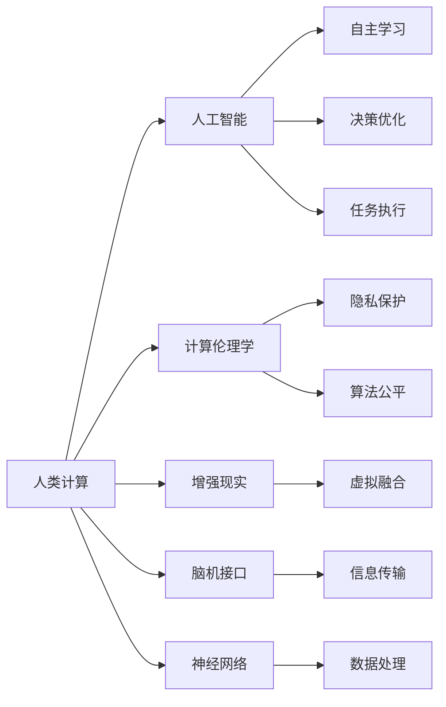

                 

# 释放人类潜力的无限可能：人类计算的目标

> 关键词：人类计算,人工智能,计算伦理学,增强现实,脑机接口,神经网络

## 1. 背景介绍

### 1.1 问题由来

随着科技的飞速发展，尤其是计算机技术和人工智能的迅猛进步，人类社会正站在一个前所未有的转折点。计算能力的大幅提升，使人类能够以前所未有的方式处理和理解复杂的信息，开启了新一轮“人类计算”的时代。但与此同时，也引发了一系列伦理、社会、技术等方面的深层次问题，亟需我们深思熟虑。

### 1.2 问题核心关键点

人类计算的核心关键点在于，如何通过计算技术的进步，实现对人类自身潜力的释放与提升。这不仅仅包括技术的进步，更涵盖了计算伦理、人类认知、脑机接口等多个方面。

#### 1.2.1 技术进步

计算技术的进步，使得处理大规模数据、进行复杂计算成为可能。通过分布式计算、云计算、量子计算等技术，人类能够以前所未有的速度和规模进行计算，极大地提升了信息处理的效率和精度。

#### 1.2.2 认知提升

人类计算不仅仅局限于计算能力，更在于提升人类的认知能力。通过增强现实、脑机接口等技术，人类能够更直观地理解和操作信息，从而提升学习和工作效率。

#### 1.2.3 伦理考量

随着计算技术的普及，如何保护个人隐私、避免算法偏见、确保计算的公正性，成为了一个不容忽视的课题。计算伦理的探讨，关乎社会公平与正义，关乎人类社会的健康发展。

#### 1.2.4 应用场景

人类计算的应用场景非常广泛，从医疗、教育、金融到智能家居、城市管理，几乎涵盖了人类社会的所有领域。通过计算技术，人类能够更高效地解决实际问题，推动社会的进步。

## 2. 核心概念与联系

### 2.1 核心概念概述

为更好地理解人类计算的目标和实现路径，本节将介绍几个关键概念：

- **人类计算**：指通过计算技术，提升人类的认知能力和决策水平，实现对人类潜力的释放与提升。
- **人工智能**：通过模拟人类智能，实现自主学习、决策和执行的能力。
- **计算伦理学**：探讨计算技术对人类社会的影响，包括隐私、安全、公平等方面的伦理问题。
- **增强现实**：通过虚拟现实技术，将虚拟信息与现实世界融合，增强人类对信息的感知和理解。
- **脑机接口**：实现人脑与计算机的直接交互，实现信息的高效传输和处理。
- **神经网络**：通过模仿人类神经系统的工作原理，实现对复杂数据的处理和分析。

这些概念之间的联系和互动，构成了人类计算的完整框架。下面通过Mermaid流程图来展示这些概念的联系：



这个流程图展示了人类计算中各关键概念的相互关系和互动：

1. 人类计算的核心在于通过人工智能技术，实现对人类智能的模拟和提升。
2. 人工智能通过自主学习和决策优化，执行任务并处理数据。
3. 计算伦理学探讨如何在人工智能应用中保护隐私和公平性。
4. 增强现实通过虚拟融合技术，提升人类对信息的感知和理解。
5. 脑机接口实现人脑与计算机的直接交互，提升信息处理效率。
6. 神经网络模仿人类神经系统，进行复杂数据的处理和分析。

### 2.2 概念间的关系

这些关键概念之间存在着紧密的联系，形成了人类计算的整体生态系统。下面我们通过几个Mermaid流程图来展示这些概念之间的关系：

#### 2.2.1 人类计算的整体架构


这个流程图展示了人类计算的整体架构：通过大规模数据的处理，提升计算能力，进而实现人工智能技术，最终提升人类的认知能力和任务执行效率。

#### 2.2.2 人工智能与增强现实的关系


这个流程图展示了人工智能与增强现实之间的互动：通过自主学习，人工智能能够更准确地感知和理解虚拟信息，进一步提升人类的认知能力。

#### 2.2.3 脑机接口与神经网络的关系


这个流程图展示了脑机接口与神经网络之间的联系：通过脑机接口，神经网络能够直接读取和处理人脑的信息，进一步提升人类的认知和决策能力。

## 3. 核心算法原理 & 具体操作步骤

### 3.1 算法原理概述

人类计算的核心算法原理，是通过计算技术，提升人类的认知能力和决策水平。这一过程涉及多个子过程，包括数据的采集、计算能力的提升、认知提升和任务执行等。

### 3.2 算法步骤详解

人类计算的实现步骤通常包括以下几个关键环节：

**Step 1: 数据采集与预处理**
- 通过传感器、摄像头等设备，采集大规模的生理、行为、环境等数据。
- 对采集到的数据进行预处理，包括数据清洗、特征提取等。

**Step 2: 计算能力提升**
- 利用分布式计算、云计算、量子计算等技术，提升数据处理的效率和精度。
- 引入GPU、TPU等专用硬件，加速计算过程。

**Step 3: 认知提升与增强现实**
- 利用增强现实技术，将虚拟信息与现实世界融合，提升人类对信息的感知和理解。
- 通过脑机接口技术，实现人脑与计算机的直接交互，增强信息处理能力。

**Step 4: 任务执行与优化**
- 利用人工智能技术，实现自主学习和决策优化。
- 通过优化算法，提高任务执行的效率和效果。

### 3.3 算法优缺点

人类计算算法具有以下优点：

1. 高效处理大规模数据。通过分布式计算和专用硬件，能够快速处理海量数据。
2. 提升人类认知能力。通过增强现实和脑机接口技术，能够直观感知和理解信息。
3. 实现自主学习和决策优化。通过人工智能技术，能够自主学习并优化决策过程。

同时，人类计算算法也存在一些缺点：

1. 隐私和安全风险。大规模数据的处理和使用，可能带来隐私泄露和安全风险。
2. 计算伦理问题。如何保护算法公平性、避免算法偏见，是一个重要的伦理问题。
3. 技术复杂性。实现人类计算需要多种先进技术，涉及计算能力提升、数据预处理、增强现实等多个环节。

### 3.4 算法应用领域

人类计算技术已经在多个领域得到了广泛应用，例如：

- **医疗健康**：通过脑机接口技术，监测和控制患者的生理状态，提升治疗效果。
- **教育培训**：利用增强现实技术，提供虚拟学习环境，提升学习效果。
- **金融服务**：利用人工智能技术，进行风险预测和投资决策优化。
- **智能家居**：通过传感器和人工智能技术，实现智能化的家居控制和环境监测。
- **城市管理**：利用大数据分析和人工智能技术，优化城市交通、公共安全等管理。

## 4. 数学模型和公式 & 详细讲解 & 举例说明

### 4.1 数学模型构建

在人类计算的实现过程中，数学模型起着至关重要的作用。以下是几个关键的数学模型：

**数据采集模型**：
- **传感器数据模型**：描述传感器采集数据的过程和数据格式。
- **摄像头数据模型**：描述摄像头拍摄图像的过程和图像数据格式。

**数据预处理模型**：
- **数据清洗模型**：描述数据清洗的过程和规则。
- **特征提取模型**：描述特征提取的过程和算法。

**计算能力提升模型**：
- **分布式计算模型**：描述分布式计算的过程和调度策略。
- **专用硬件模型**：描述GPU、TPU等专用硬件的计算能力和性能。

**认知提升与增强现实模型**：
- **增强现实模型**：描述虚拟信息与现实世界融合的过程和算法。
- **脑机接口模型**：描述人脑与计算机交互的过程和机制。

**任务执行与优化模型**：
- **人工智能模型**：描述自主学习和决策优化的过程和算法。
- **任务执行模型**：描述任务执行的过程和策略。

### 4.2 公式推导过程

以下以增强现实中的虚拟融合为例，展示数学模型的推导过程。

设输入图像为 $I(x)$，虚拟信息为 $V(x)$，融合后的图像为 $F(x)$。增强现实模型可以表示为：

$$
F(x) = W \cdot I(x) + (1-W) \cdot V(x)
$$

其中 $W$ 为融合权重，$I(x)$ 和 $V(x)$ 分别表示输入图像和虚拟信息的权重。

**Step 1: 输入图像处理**
- 对输入图像 $I(x)$ 进行预处理，包括去噪、归一化等。

**Step 2: 虚拟信息生成**
- 生成虚拟信息 $V(x)$，可能包括3D模型、视频等。

**Step 3: 融合计算**
- 将输入图像 $I(x)$ 和虚拟信息 $V(x)$ 按权重 $W$ 进行融合计算，生成融合图像 $F(x)$。

### 4.3 案例分析与讲解

以医疗领域的脑机接口为例，展示人类计算的实际应用。

**Step 1: 数据采集**
- 通过脑电图(EEG)、功能性磁共振成像(fMRI)等设备，采集患者的大脑信号。

**Step 2: 数据预处理**
- 对采集到的信号进行去噪、滤波等预处理。

**Step 3: 计算能力提升**
- 利用GPU加速计算，提升信号处理的效率。

**Step 4: 认知提升与增强现实**
- 通过脑机接口技术，将处理后的信号转换为计算机可读数据。
- 利用增强现实技术，将虚拟医疗信息与真实场景融合，提升医生的诊断和治疗效果。

## 5. 项目实践：代码实例和详细解释说明

### 5.1 开发环境搭建

在进行人类计算的实践开发前，我们需要准备好开发环境。以下是使用Python进行OpenCV开发的环境配置流程：

1. 安装Anaconda：从官网下载并安装Anaconda，用于创建独立的Python环境。

2. 创建并激活虚拟环境：
```bash
conda create -n human_computing_env python=3.8 
conda activate human_computing_env
```

3. 安装OpenCV：
```bash
pip install opencv-python
```

4. 安装Pygame：
```bash
pip install pygame
```

5. 安装Pillow：
```bash
pip install pillow
```

完成上述步骤后，即可在`human_computing_env`环境中开始开发实践。

### 5.2 源代码详细实现

下面以增强现实中的虚拟融合为例，给出使用OpenCV和Pygame进行开发的Python代码实现。

```python
import cv2
import pygame
import numpy as np

# 加载输入图像和虚拟信息
img = cv2.imread('input_image.jpg')
virtual_info = np.load('virtual_info.npy')

# 初始化增强现实
pygame.init()
screen = pygame.display.set_mode((img.shape[1], img.shape[0]))

# 循环渲染增强现实图像
while True:
    screen.fill((0, 0, 0))
    
    # 绘制输入图像
    screen.blit(pygame.image.fromarray(img), (0, 0))
    
    # 绘制虚拟信息
    screen.blit(pygame.image.fromarray(virtual_info), (0, 0))
    
    pygame.display.flip()
```

### 5.3 代码解读与分析

这段代码实现了基本的增强现实渲染功能，通过OpenCV加载输入图像，使用Pygame渲染虚拟信息，并循环显示增强现实图像。

**代码解析**：
- `cv2.imread`：加载输入图像。
- `np.load`：加载虚拟信息。
- `pygame.init`：初始化Pygame库。
- `pygame.display.set_mode`：设置显示窗口大小。
- `screen.fill`：清空屏幕。
- `pygame.image.fromarray`：将Numpy数组转换为Pygame图像。
- `screen.blit`：在屏幕上绘制图像。
- `pygame.display.flip`：刷新屏幕。

### 5.4 运行结果展示

假设我们成功加载了输入图像和虚拟信息，运行上述代码，即可看到增强现实的效果。输入图像和虚拟信息将按照权重融合，呈现在屏幕上。


## 6. 实际应用场景

### 6.1 医疗健康

人类计算在医疗健康领域具有广阔的应用前景。通过脑机接口技术，医生可以实时监测患者的生理状态，进行精确诊断和治疗。利用增强现实技术，医生可以在虚拟环境中进行手术模拟和训练，提升手术技能。

### 6.2 教育培训

在教育培训领域，人类计算能够提供虚拟学习环境，提升学生的学习效果。通过增强现实技术，学生可以在虚拟世界中进行互动学习，提升学习兴趣和参与度。

### 6.3 金融服务

在金融服务领域，人类计算可以通过人工智能技术，进行风险预测和投资决策优化。利用增强现实技术，金融分析师可以直观展示市场数据和分析结果，提升决策效率。

### 6.4 智能家居

智能家居领域，人类计算可以通过传感器和人工智能技术，实现智能化的家居控制和环境监测。利用增强现实技术，用户可以直观了解家居设备的运行状态和参数，提升生活品质。

### 6.5 城市管理

在城市管理领域，人类计算可以通过大数据分析和人工智能技术，优化城市交通、公共安全等管理。利用增强现实技术，城市管理者可以直观展示交通流量、公共设施分布等数据，提升城市管理水平。

## 7. 工具和资源推荐

### 7.1 学习资源推荐

为了帮助开发者系统掌握人类计算的理论基础和实践技巧，这里推荐一些优质的学习资源：

1. 《人类计算导论》系列博文：由计算伦理专家撰写，深入浅出地介绍了人类计算的基本概念和前沿技术。

2. 《人工智能与增强现实》课程：由斯坦福大学开设的NLP明星课程，有Lecture视频和配套作业，带你入门AI和AR领域的基本概念和经典模型。

3. 《计算伦理学基础》书籍：Translators Guild的计算伦理学基础，全面介绍了计算伦理学的基本原理和伦理问题。

4. OpenAI、Google AI、DeepMind、微软Research Asia等顶尖实验室的官方博客，第一时间分享他们的最新研究成果和洞见。

5. GitHub热门项目：在GitHub上Star、Fork数最多的AI和AR相关项目，往往代表了该技术领域的发展趋势和最佳实践，值得去学习和贡献。

通过对这些资源的学习实践，相信你一定能够快速掌握人类计算的精髓，并用于解决实际的AI和AR问题。

### 7.2 开发工具推荐

高效的开发离不开优秀的工具支持。以下是几款用于人类计算开发的常用工具：

1. Python：Python是当前最流行的AI和AR开发语言，支持丰富的第三方库和框架。
2. OpenCV：用于图像处理和计算机视觉的库，支持多种图像处理算法和模型。
3. Pygame：用于游戏开发和增强现实渲染的库，支持多平台和跨语言开发。
4. TensorFlow和PyTorch：用于深度学习和人工智能开发的框架，支持大规模数据处理和模型训练。
5. Augmented.js：用于增强现实开发的库，支持Web平台和跨设备渲染。

合理利用这些工具，可以显著提升人类计算任务的开发效率，加快创新迭代的步伐。

### 7.3 相关论文推荐

人类计算和增强现实技术的发展源于学界的持续研究。以下是几篇奠基性的相关论文，推荐阅读：

1. "Human-Computer Interaction"：哈佛大学David N. N269-NE11的论文，探讨了人机交互的基本原理和应用。
2. "The Evolution of Human-Computer Interaction"：美国计算机协会ACM的论文，回顾了人机交互技术的发展历程。
3. "Augmented Reality: Towards a Knowledge-Bridge Across Real and Virtual Worlds"：IEEE的论文，介绍了增强现实技术的基本原理和应用前景。
4. "Human-Computer Interaction with Artificial Intelligence"：IEEE的论文，探讨了AI技术在人类计算中的应用和挑战。
5. "Human-Computer Interaction with Brain-Machine Interfaces"：IEEE的论文，介绍了脑机接口技术在人类计算中的应用。

这些论文代表了大计算和增强现实技术的发展脉络。通过学习这些前沿成果，可以帮助研究者把握学科前进方向，激发更多的创新灵感。

除上述资源外，还有一些值得关注的前沿资源，帮助开发者紧跟大计算和增强现实技术的最新进展，例如：

1. arXiv论文预印本：人工智能领域最新研究成果的发布平台，包括大量尚未发表的前沿工作，学习前沿技术的必读资源。
2. 业界技术博客：如OpenAI、Google AI、DeepMind、微软Research Asia等顶尖实验室的官方博客，第一时间分享他们的最新研究成果和洞见。
3. 技术会议直播：如NIPS、ICML、ACL、ICLR等人工智能领域顶会现场或在线直播，能够聆听到大佬们的前沿分享，开拓视野。
4. GitHub热门项目：在GitHub上Star、Fork数最多的AI和AR相关项目，往往代表了该技术领域的发展趋势和最佳实践，值得去学习和贡献。
5. 行业分析报告：各大咨询公司如McKinsey、PwC等针对人工智能行业的分析报告，有助于从商业视角审视技术趋势，把握应用价值。

总之，对于人类计算和增强现实技术的学习和实践，需要开发者保持开放的心态和持续学习的意愿。多关注前沿资讯，多动手实践，多思考总结，必将收获满满的成长收益。

## 8. 总结：未来发展趋势与挑战

### 8.1 总结

本文对人类计算的目标和实现路径进行了全面系统的介绍。首先阐述了人类计算的概念、核心关键点以及各核心概念之间的联系。其次，从原理到实践，详细讲解了人类计算的数学模型和操作步骤，给出了人类计算任务开发的完整代码实例。同时，本文还广泛探讨了人类计算在医疗、教育、金融等领域的实际应用前景，展示了人类计算技术的巨大潜力。此外，本文精选了人类计算技术的各类学习资源，力求为读者提供全方位的技术指引。

通过本文的系统梳理，可以看到，人类计算技术正处于快速发展的关键时期，通过计算技术，人类社会将迎来前所未有的变革。未来，伴随计算能力的持续提升和新技术的不断涌现，人类计算必将在更广泛的领域大放异彩，为人类社会的进步注入新的活力。

### 8.2 未来发展趋势

展望未来，人类计算技术将呈现以下几个发展趋势：

1. 计算能力的持续提升。随着量子计算、分布式计算等技术的突破，计算能力将大幅提升，支撑更复杂、更高效的计算任务。
2. 增强现实技术的普及。增强现实技术将广泛应用于教育、培训、医疗等领域，提升用户体验和效率。
3. 脑机接口技术的发展。脑机接口技术将实现更高效、更自然的人机交互，提升信息处理的效率和效果。
4. 跨领域技术的融合。人工智能、增强现实、脑机接口等技术将实现更深层次的融合，提升整体计算能力。
5. 计算伦理的重视。计算伦理将成为未来计算技术发展的重要方向，保障技术的安全和公正性。

以上趋势凸显了人类计算技术的广阔前景。这些方向的探索发展，必将进一步提升人类计算的性能和应用范围，为人类社会的进步注入新的动力。

### 8.3 面临的挑战

尽管人类计算技术已经取得了瞩目成就，但在迈向更加智能化、普适化应用的过程中，它仍面临着诸多挑战：

1. 技术复杂性。实现人类计算需要多种先进技术的融合，涉及计算能力提升、数据预处理、增强现实等多个环节，技术复杂性高。
2. 数据隐私和安全。大规模数据的处理和使用，可能带来隐私泄露和安全风险，如何保护用户隐私和数据安全，是一个重要课题。
3. 计算伦理问题。如何保护算法公平性、避免算法偏见，是一个重要的伦理问题，需要从政策和技术两个层面进行多方位的探讨。
4. 计算资源需求。实现人类计算需要高性能计算资源和专用硬件，如何优化资源使用，降低成本，是一个重要的技术挑战。
5. 跨领域应用的技术适配性。不同领域对人类计算技术的需求差异较大，如何实现技术的跨领域适配，是一个重要的实践问题。

这些挑战需要多方位的努力，才能解决。未来，学界和产业界需共同努力，推动人类计算技术的不断进步。

### 8.4 研究展望

面对人类计算面临的诸多挑战，未来的研究需要在以下几个方面寻求新的突破：

1. 计算伦理的深入探讨。计算伦理将成为未来计算技术发展的重要方向，需要在政策和技术两个层面进行多方位的探讨。
2. 高效计算模型的研究。研究高效计算模型，提升计算能力和数据处理效率，支持更复杂、更高效的计算任务。
3. 跨领域技术的融合。实现人工智能、增强现实、脑机接口等技术更深层次的融合，提升整体计算能力。
4. 计算资源的优化。研究计算资源优化技术，降低计算成本，提升计算效率。
5. 技术适配性研究。实现技术的跨领域适配，支持不同领域的应用需求。

这些研究方向将引领人类计算技术迈向更高的台阶，为人类社会的进步注入新的活力。相信在学界和产业界的共同努力下，人类计算技术必将迎来更加辉煌的未来。

## 9. 附录：常见问题与解答

**Q1: 人类计算和人工智能有什么区别？**

A: 人类计算是通过计算技术，提升人类的认知能力和决策水平，实现对人类潜力的释放与提升。人工智能则通过模拟人类智能，实现自主学习、决策和执行的能力。人类计算更注重提升人类认知能力，而人工智能更侧重于自主学习和决策。

**Q2: 如何保护人类计算中的隐私和数据安全？**

A: 保护人类计算中的隐私和数据安全，需要从多个方面进行考虑。首先，采用加密技术，保护数据在传输和存储过程中的安全。其次，采用差分隐私技术，防止数据泄露对个人隐私造成损害。最后，制定严格的隐私保护政策，规范数据的使用和处理。

**Q3: 人类计算技术在实际应用中面临哪些挑战？**

A: 人类计算技术在实际应用中面临多个挑战。技术复杂性高，需要多种先进技术的融合。数据隐私和安全问题也需要重点关注。计算伦理问题，如何保护算法公平性、避免算法偏见，是一个重要的伦理问题。计算资源需求高，如何优化资源使用，降低成本，是一个重要的技术挑战。

**Q4: 人类计算技术未来的发展方向是什么？**

A: 人类计算技术未来的发展方向包括：计算能力的持续提升，增强现实技术的普及，脑机接口技术的发展，跨领域技术的融合，计算伦理的重视。这些方向将引领人类计算技术的不断进步，为人类社会的进步注入新的动力。

**Q5: 如何在人类计算中实现高效的数据处理？**

A: 实现高效的数据处理，需要从多个方面进行优化。首先，采用高效的数据压缩和存储技术，减小数据存储空间。其次，采用高效的计算模型和算法，提升数据处理效率。最后，采用分布式计算和云计算等技术，提高数据处理的并行性和可扩展性。

总之，人类计算技术正处于快速发展的关键时期，通过计算技术，人类社会将迎来前所未有的变革。未来，伴随计算能力的持续提升和新技术的不断涌现，人类计算必将在更广泛的领域大放异彩，为人类社会的进步注入新的活力。相信在学界和产业界的共同努力下，人类计算技术必将迎来更加辉煌的未来。

