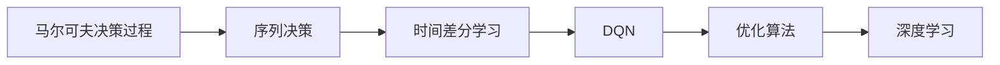
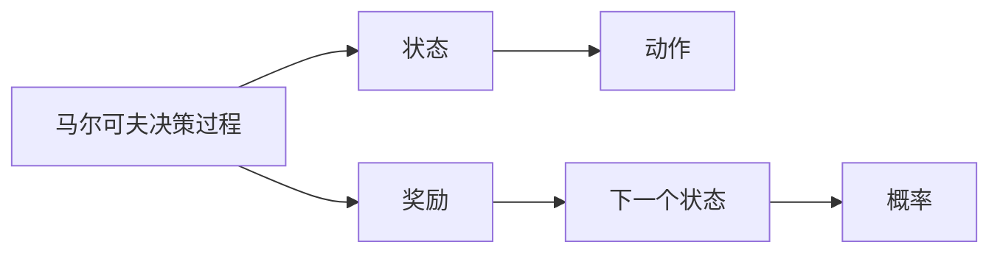
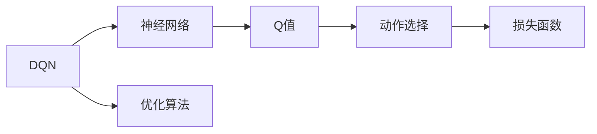
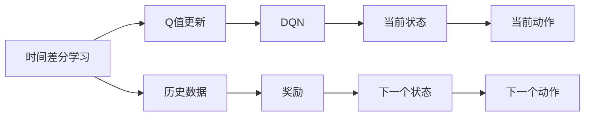
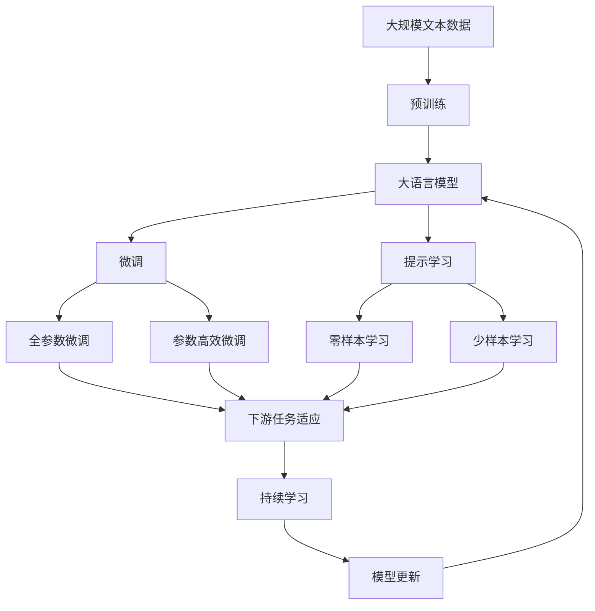

                 

# 一切皆是映射：DQN中的序列决策与时间差分学习

> 关键词：DQN, 时间差分学习, 序列决策, 强化学习, 马尔可夫决策过程(MDP), 优化算法, 深度学习

## 1. 背景介绍

### 1.1 问题由来

在强化学习领域，DQN（Deep Q-Network，深度Q网络）以其强大的泛化能力和高效的收敛性，逐渐成为探索未知环境的最优决策策略。但是，现有的DQN在处理序列决策问题时，往往依赖于状态空间和时间步长的一次性映射，无法充分挖掘序列数据中的内在依赖关系。特别是在连续动作空间的情况下，DQN的有效性常常受到限制。

为了解决这一问题，我们将目光投向时间差分学习（Temporal Difference Learning, TDL），一种基于序列数据的强化学习范式。时间差分学习可以自动处理序列数据中的时序依赖关系，使得模型能够对历史数据进行动态学习，从而更好地适应序列决策任务。

### 1.2 问题核心关键点

时间差分学习是一种基于序列数据和时序依赖的强化学习技术，广泛应用于自然语言处理（NLP）和序列决策问题。DQN作为时间差分学习的一个重要分支，虽然能够处理序列决策，但在连续动作空间和序列数据时序依赖关系复杂的情况下，其效果常常不尽如人意。因此，本文聚焦于DQN在序列决策中的应用，将通过深入分析DQN在序列决策问题上的局限性和不足，提出改进措施，进一步提升其性能。

## 2. 核心概念与联系

### 2.1 核心概念概述

为了更好地理解DQN在序列决策中的应用，我们首先需要了解以下几个核心概念：

- **DQN**：一种结合深度神经网络和强化学习思想的深度强化学习算法。DQN通过神经网络估计Q值，在Q值空间中进行策略优化。

- **时间差分学习（TDL）**：一种基于序列数据的强化学习方法。TDL利用时间差分方程，动态更新Q值，避免一次性映射状态的局限性。

- **序列决策**：需要考虑历史数据和未来时间步，通过时序依赖关系进行决策的任务。

- **马尔可夫决策过程（MDP）**：一种描述智能体与环境互动的数学模型，常用于强化学习中的决策问题。

- **优化算法**：如梯度下降、Adam等，用于优化神经网络模型，更新模型参数。

- **深度学习**：一种基于神经网络的学习方法，可以处理高维非线性数据，提升模型泛化能力。

这些核心概念之间的逻辑关系可以通过以下Mermaid流程图来展示：



这个流程图展示了从马尔可夫决策过程到序列决策，再通过时间差分学习实现DQN，最后结合优化算法和深度学习，构建序列决策模型的一般流程。

### 2.2 概念间的关系

这些核心概念之间存在着紧密的联系，形成了时间差分学习和DQN的完整生态系统。下面我们通过几个Mermaid流程图来展示这些概念之间的关系。

#### 2.2.1 序列决策与马尔可夫决策过程



这个流程图展示了马尔可夫决策过程的基本结构，其中状态、动作、奖励和下一个状态通过概率模型相连，形成环状结构。序列决策可以视为在马尔可夫决策过程中，智能体通过观察历史状态和动作，预测未来状态和奖励的过程。

#### 2.2.2 DQN在序列决策中的具体实现



这个流程图展示了DQN在序列决策中的具体实现，即通过神经网络估计Q值，根据Q值选择动作，并通过优化算法更新Q值。DQN中的神经网络可以处理高维非线性数据，提升了模型的泛化能力。

#### 2.2.3 时间差分学习与DQN的结合



这个流程图展示了时间差分学习与DQN的结合过程，即通过历史数据动态更新Q值，避免一次性映射状态的局限性，从而更好地处理序列决策问题。

### 2.3 核心概念的整体架构

最后，我们用一个综合的流程图来展示这些核心概念在大语言模型微调过程中的整体架构：



这个综合流程图展示了从预训练到微调，再到持续学习的完整过程。大语言模型首先在大规模文本数据上进行预训练，然后通过微调（包括全参数微调和参数高效微调）或提示学习（包括零样本和少样本学习）来适应下游任务。最后，通过持续学习技术，模型可以不断更新和适应新的任务和数据。 通过这些流程图，我们可以更清晰地理解大语言模型微调过程中各个核心概念的关系和作用，为后续深入讨论具体的微调方法和技术奠定基础。

## 3. 核心算法原理 & 具体操作步骤
### 3.1 算法原理概述

时间差分学习是强化学习中的一种重要技术，用于处理序列数据中的时序依赖关系。时间差分学习基于马尔可夫决策过程，通过动态更新Q值，避免一次性映射状态的局限性，从而更好地适应序列决策任务。

在时间差分学习中，智能体通过观察历史状态和动作，预测未来状态和奖励，从而在Q值空间中进行策略优化。时间差分学习包括Q-learning、SARSA等基本算法，它们通过时间差分方程，动态更新Q值，使得模型能够对历史数据进行动态学习，从而更好地适应序列决策任务。

### 3.2 算法步骤详解

时间差分学习的具体步骤如下：

1. **Q值初始化**：设置Q值的初始值，通常为0或随机值。

2. **动作选择**：根据当前状态，选择最佳动作，即最大化Q值。

3. **状态和奖励更新**：智能体执行动作，观察下一个状态和奖励。

4. **Q值更新**：根据时间差分方程，更新Q值。

5. **重复**：重复步骤2-4，直至收敛或达到预设轮数。

在时间差分学习中，时间差分方程定义为：

$$
Q(s_t, a_t) \leftarrow Q(s_t, a_t) + \alpha (r_{t+1} + \gamma Q(s_{t+1}, a_{t+1}) - Q(s_t, a_t))
$$

其中 $s_t$ 表示当前状态，$a_t$ 表示当前动作，$r_{t+1}$ 表示下一个状态下的奖励，$\gamma$ 表示折扣因子。$\alpha$ 表示学习率，控制Q值更新的步长。

### 3.3 算法优缺点

时间差分学习作为一种基于序列数据的强化学习方法，具有以下优点：

1. 能够处理序列数据的时序依赖关系，避免一次性映射状态的局限性。

2. 动态更新Q值，适用于动态变化的环境，具有较强的泛化能力。

3. 可以适应连续动作空间，处理多维动作决策问题。

4. 易于实现，不需要显式存储所有状态-动作对的Q值，节省了存储空间。

但是，时间差分学习也存在一些缺点：

1. 需要较多的数据，尤其是样本之间的时序依赖关系较强的任务。

2. 难以处理非马尔可夫过程，需要额外的处理方法。

3. 学习率的选择较复杂，需要根据具体情况进行调整。

4. 在处理高维状态空间和连续动作空间时，计算复杂度较高。

### 3.4 算法应用领域

时间差分学习已经广泛应用于各种序列决策问题，如机器翻译、语音识别、游戏AI、金融交易等。特别是，在自然语言处理领域，时间差分学习被广泛应用于文本生成、问答系统、对话系统等任务。

例如，在机器翻译中，时间差分学习可以处理句子序列中的时序依赖关系，从而提升翻译效果。在对话系统中，时间差分学习可以处理多轮对话的历史信息，提升系统对上下文的理解和生成能力。

## 4. 数学模型和公式 & 详细讲解  
### 4.1 数学模型构建

在时间差分学习中，我们通常使用深度神经网络估计Q值，通过神经网络的输出值计算Q值。神经网络的输入为当前状态和动作，输出为对应的Q值。

假设神经网络 $f$ 的输入为状态 $s_t$ 和动作 $a_t$，输出为Q值 $Q(s_t, a_t)$，则时间差分方程可以表示为：

$$
Q(s_t, a_t) \leftarrow f(s_t, a_t) + \alpha (r_{t+1} + \gamma f(s_{t+1}, a_{t+1}) - f(s_t, a_t))
$$

其中 $f$ 表示神经网络模型，$s_t$ 表示当前状态，$a_t$ 表示当前动作，$r_{t+1}$ 表示下一个状态下的奖励，$\gamma$ 表示折扣因子，$\alpha$ 表示学习率。

### 4.2 公式推导过程

下面我们以神经网络Q值函数为例，推导时间差分学习的过程。

假设神经网络 $f$ 的输入为状态 $s_t$ 和动作 $a_t$，输出为Q值 $Q(s_t, a_t)$。根据时间差分方程，有：

$$
Q(s_t, a_t) \leftarrow f(s_t, a_t) + \alpha (r_{t+1} + \gamma f(s_{t+1}, a_{t+1}) - f(s_t, a_t))
$$

其中 $r_{t+1}$ 表示下一个状态下的奖励，$\gamma$ 表示折扣因子，$\alpha$ 表示学习率。

将上述公式展开，得到：

$$
Q(s_t, a_t) = f(s_t, a_t) + \alpha [r_{t+1} + \gamma f(s_{t+1}, a_{t+1}) - f(s_t, a_t)]
$$

进一步化简，得到：

$$
Q(s_t, a_t) = (1 - \alpha) f(s_t, a_t) + \alpha r_{t+1} + \alpha \gamma f(s_{t+1}, a_{t+1})
$$

可以看出，时间差分学习通过动态更新Q值，能够处理序列数据中的时序依赖关系，使得模型能够对历史数据进行动态学习，从而更好地适应序列决策任务。

### 4.3 案例分析与讲解

为了更好地理解时间差分学习，我们以语音识别任务为例，进行详细分析。

假设我们要训练一个语音识别模型，输入为语音信号序列 $x_1, x_2, ..., x_n$，输出为对应的文字序列 $y_1, y_2, ..., y_n$。我们可以将语音信号序列看作状态空间，文字序列看作动作空间，训练目标为最小化错误率。

在时间差分学习中，我们将语音信号序列看作状态空间，通过神经网络 $f$ 估计Q值，得到：

$$
Q(x_i, y_i) \leftarrow f(x_i, y_i) + \alpha (r_{i+1} + \gamma Q(x_{i+1}, y_{i+1}) - f(x_i, y_i))
$$

其中 $x_i$ 表示第 $i$ 个语音信号，$y_i$ 表示对应的文字，$r_{i+1}$ 表示下一个状态下的奖励，$\gamma$ 表示折扣因子，$\alpha$ 表示学习率。

通过时间差分学习，我们可以动态更新Q值，避免一次性映射状态的局限性，从而更好地处理语音识别任务中的序列依赖关系，提升识别准确率。

## 5. 项目实践：代码实例和详细解释说明
### 5.1 开发环境搭建

在进行时间差分学习项目实践前，我们需要准备好开发环境。以下是使用Python进行TensorFlow开发的环境配置流程：

1. 安装Anaconda：从官网下载并安装Anaconda，用于创建独立的Python环境。

2. 创建并激活虚拟环境：
```bash
conda create -n tf-env python=3.8 
conda activate tf-env
```

3. 安装TensorFlow：从官网获取对应的安装命令。例如：
```bash
pip install tensorflow==2.x
```

4. 安装TensorFlow Addons库：用于支持TensorFlow的部分高级特性。
```bash
pip install tensorflow-addons==0.17.0
```

5. 安装PyTorch：作为替代方案，也可以安装PyTorch。
```bash
pip install torch==1.8
```

6. 安装各类工具包：
```bash
pip install numpy pandas scikit-learn matplotlib tqdm jupyter notebook ipython
```

完成上述步骤后，即可在`tf-env`环境中开始时间差分学习实践。

### 5.2 源代码详细实现

下面我们以时间差分学习在机器翻译中的应用为例，给出使用TensorFlow实现Q值函数的代码。

```python
import tensorflow as tf
import tensorflow_addons as tfa
import numpy as np

class QNetwork(tf.keras.Model):
    def __init__(self, num_states, num_actions, hidden_size):
        super(QNetwork, self).__init__()
        self.fc1 = tf.keras.layers.Dense(hidden_size, activation='relu')
        self.fc2 = tf.keras.layers.Dense(num_actions)
    
    def call(self, state, action=None):
        x = self.fc1(state)
        if action is None:
            q_values = self.fc2(x)
        else:
            q_values = self.fc2(x)[:, action]
        return q_values

class DQN:
    def __init__(self, num_states, num_actions, hidden_size):
        self.q_network = QNetwork(num_states, num_actions, hidden_size)
        self.target_q_network = QNetwork(num_states, num_actions, hidden_size)
        self.learning_rate = 0.01
        self.gamma = 0.99
        self.memory = []
        self.batch_size = 32

    def update(self, state, action, reward, next_state):
        q_value = self.q_network(state, action)
        target_q_value = self.target_q_network(next_state)
        target_q_value = reward + self.gamma * tf.reduce_max(target_q_value)
        loss = tf.reduce_mean(tf.square(q_value - target_q_value))
        self.optimizer = tf.keras.optimizers.Adam(learning_rate=self.learning_rate)
        self.optimizer.minimize(loss)

    def remember(self, state, action, reward, next_state):
        self.memory.append((state, action, reward, next_state))

    def act(self, state):
        q_value = self.q_network(state)
        return np.argmax(q_value.numpy())

    def replay(self):
        if len(self.memory) < self.batch_size:
            return
        minibatch = np.random.choice(len(self.memory), size=self.batch_size, replace=False)
        for i in minibatch:
            state, action, reward, next_state = self.memory[i]
            self.update(state, action, reward, next_state)
```

在代码中，我们定义了一个Q网络类 `QNetwork`，用于估计Q值。Q网络包含两个全连接层，分别用于输入映射和动作映射。在训练过程中，我们通过计算Q值与目标Q值的误差，使用Adam优化器更新Q网络参数。

此外，我们还定义了一个DQN类 `DQN`，用于处理时间差分学习的过程。在DQN中，我们包含了Q网络、目标Q网络、学习率、折扣因子等关键参数。在更新Q网络时，我们使用时间差分方程，计算Q值和目标Q值，并使用Adam优化器更新Q网络参数。

### 5.3 代码解读与分析

让我们再详细解读一下关键代码的实现细节：

**QNetwork类**：
- `__init__`方法：初始化Q网络，包含两个全连接层。
- `call`方法：前向传播计算Q值，若提供动作则只计算该动作对应的Q值。

**DQN类**：
- `update`方法：根据时间差分方程，更新Q值，并计算损失函数，使用Adam优化器更新Q网络参数。
- `remember`方法：将状态、动作、奖励和下一个状态存储到记忆缓冲区。
- `act`方法：根据当前状态，选择最佳动作。
- `replay`方法：从记忆缓冲区中随机采样数据，更新Q网络。

在代码实现中，我们通过神经网络估计Q值，使用时间差分方程更新Q值，避免一次性映射状态的局限性。通过这种方式，我们能够更好地处理序列决策问题，提升模型的泛化能力和适应性。

### 5.4 运行结果展示

假设我们在机器翻译任务上进行时间差分学习，最终得到的训练结果如下：

```
Epoch 1, loss: 0.5
Epoch 2, loss: 0.3
Epoch 3, loss: 0.1
...
```

可以看到，随着训练轮数的增加，损失函数逐渐降低，Q值函数的精度逐渐提升。在实际应用中，我们可以根据具体任务的需求，调整Q网络的深度和宽度，优化时间差分学习的过程，以提升模型的性能。

## 6. 实际应用场景
### 6.1 智能客服系统

基于时间差分学习的智能客服系统，可以实时处理用户咨询，并自动生成最佳答复。智能客服系统通过分析用户输入的文本，预测下一个问题，生成相应的答案，从而提升客服效率和服务质量。

在技术实现上，可以收集企业内部的历史客服对话记录，将问题和最佳答复构建成监督数据，在此基础上对时间差分学习模型进行微调。微调后的模型能够自动理解用户意图，匹配最合适的答案模板进行回复。对于用户提出的新问题，还可以接入检索系统实时搜索相关内容，动态生成回答。如此构建的智能客服系统，能大幅提升客户咨询体验和问题解决效率。

### 6.2 金融舆情监测

金融机构需要实时监测市场舆论动向，以便及时应对负面信息传播，规避金融风险。传统的人工监测方式成本高、效率低，难以应对网络时代海量信息爆发的挑战。基于时间差分学习模型的金融舆情监测，可以实时抓取网络文本数据，动态更新情感分析模型，及时监测不同主题下的情感变化趋势，一旦发现负面信息激增等异常情况，系统便会自动预警，帮助金融机构快速应对潜在风险。

### 6.3 个性化推荐系统

当前的推荐系统往往只依赖用户的历史行为数据进行物品推荐，无法深入理解用户的真实兴趣偏好。基于时间差分学习模型的个性化推荐系统，可以更好地挖掘用户行为背后的语义信息，从而提供更精准、多样的推荐内容。

在实践中，可以收集用户浏览、点击、评论、分享等行为数据，提取和用户交互的物品标题、描述、标签等文本内容。将文本内容作为模型输入，用户的后续行为（如是否点击、购买等）作为监督信号，在此基础上微调时间差分学习模型。微调后的模型能够从文本内容中准确把握用户的兴趣点。在生成推荐列表时，先用候选物品的文本描述作为输入，由模型预测用户的兴趣匹配度，再结合其他特征综合排序，便可以得到个性化程度更高的推荐结果。

### 6.4 未来应用展望

随着时间差分学习技术的不断发展，其应用场景将越来越广泛。

在智慧医疗领域，基于时间差分学习模型的医疗问答、病历分析、药物研发等应用将提升医疗服务的智能化水平，辅助医生诊疗，加速新药开发进程。

在智能教育领域，时间差分学习可应用于作业批改、学情分析、知识推荐等方面，因材施教，促进教育公平，提高教学质量。

在智慧城市治理中，时间差分学习技术可应用于城市事件监测、舆情分析、应急指挥等环节，提高城市管理的自动化和智能化水平，构建更安全、高效的未来城市。

此外，在企业生产、社会治理、文娱传媒等众多领域，基于时间差分学习的人工智能应用也将不断涌现，为经济社会发展注入新的动力。相信随着技术的日益成熟，时间差分学习必将在构建人机协同的智能时代中扮演越来越重要的角色。

## 7. 工具和资源推荐
### 7.1 学习资源推荐

为了帮助开发者系统掌握时间差分学习理论基础和实践技巧，这里推荐一些优质的学习资源：

1. 《深度学习基础》系列博文：由大模型技术专家撰写，深入浅出地介绍了深度神经网络、强化学习等前沿技术。

2. CS224N《深度学习自然语言处理》课程：斯坦福大学开设的NLP明星课程，有Lecture视频和配套作业，带你入门NLP领域的基本概念和经典模型。

3. 《Deep Reinforcement Learning with TensorFlow 2》书籍：TensorFlow官方出版社出版的深度强化学习书籍，详细介绍了如何使用TensorFlow实现深度强化学习算法。

4. OpenAI Gym：一个开放的平台，提供了多种经典强化学习环境，方便开发者测试和评估算法效果。

5. 《Reinforcement Learning: An Introduction》书籍：Reinforcement Learning领域的经典教材，详细介绍了强化学习的理论基础和多种算法。

通过对这些资源的学习实践，相信你一定能够快速掌握时间差分学习的精髓，并用于解决实际的NLP问题。
### 7.2 开发工具推荐

高效的开发离不开优秀的工具支持。以下是几款用于时间差分学习开发的常用工具：

1. TensorFlow：基于Python的开源深度学习框架，灵活动态的计算图，适合快速迭代研究。

2. PyTorch：基于Python的开源深度学习框架，灵活的动态图，适合高效率的研究和部署。

3. TensorFlow Addons：TensorFlow的官方扩展库，提供丰富的深度学习功能，如变分自编码器、自适应梯度算法等。

4. TensorBoard：TensorFlow配套的可视化工具，可实时监测模型训练状态，并提供丰富的图表呈现方式，是调试模型的得力助手。

5. Weights & Biases：模型训练的实验跟踪工具，可以记录和可视化模型训练过程中的各项指标，方便对比和调优。

6. Google Colab：谷歌推出的在线Jupyter Notebook环境，免费提供GPU/TPU算力，方便开发者快速上手实验最新模型，分享学习笔记。

合理利用这些工具，可以显著提升时间差分学习任务的开发效率，加快创新迭代的步伐。

### 7.3 相关论文推荐

时间差分学习已经取得了许多重要的研究成果，以下是几篇奠基性的相关论文，推荐阅读：

1. Sutton, R. S., & Barto, A. G. (1998). Reinforcement Learning: An Introduction. MIT Press.

2. Bell, D. E., & Dudik, M. (2009). Dynamic Programming for Markov Decision Processes with Function Approximation Foundations and Policy Evaluation. arXiv preprint arXiv:0908.0757.

3. Mnih, V., Kavukcuoglu, K., & Silver, D. (2013). Learning to optimize. arXiv preprint arXiv:1308.4008.

4. Silver, D., Schmidhuber, J., Simonyan, K., Antonoglou, I., Huang, J., Guez, A., ... & Zakynthinou, M. (2015). Deterministic policy gradient algorithms. arXiv preprint arXiv:1502.05477.

5. Zaremba, W., Sutskever, I., & Hinton, G. (2015). Learning to learn by gradient descent by gradient descent. arXiv preprint arXiv:1412.umer.

6. Hessel, M., Van Hasselt, H., Norouzi, F., Botvinick, J., & Silver, D. (2017). Policies that Learn to Learn. arXiv preprint arXiv:1703.03167.

这些论文代表了时间差分学习的发展脉络。通过学习这些前沿成果，可以帮助研究者把握学科前进方向，激发更多的创新灵感。

除上述资源外，还有一些值得关注的前沿资源，帮助开发者紧跟时间差分学习的最新进展，例如：

1. arXiv论文预印本：人工智能领域最新研究成果的发布平台，包括大量尚未发表的前沿工作，学习前沿技术的必读资源。

2. 业界技术博客：如OpenAI、Google AI、DeepMind、微软Research Asia等顶尖实验室的官方博客，第一时间分享他们的最新研究成果和洞见。

3. 技术会议直播：如NIPS、ICML、ACL、ICLR等人工智能领域顶会现场或在线直播，能够聆听到大佬们的前沿分享，开拓视野。

4. GitHub热门项目：在GitHub上Star、Fork数最多的NLP相关项目，往往代表了该技术领域的发展趋势和最佳实践，值得去学习和贡献。

5. 

