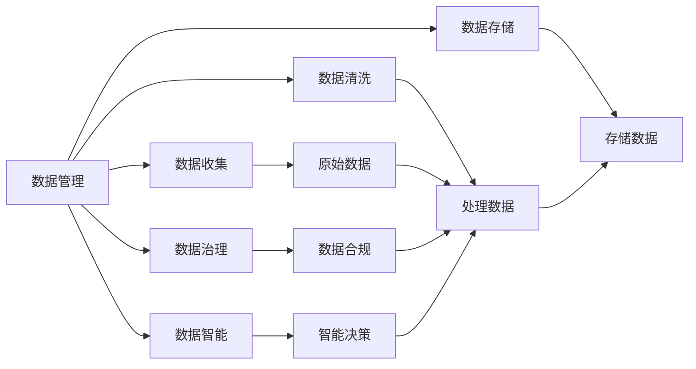

                 

# 人工智能创业：数据管理的技巧

> 关键词：人工智能,创业,数据管理,数据处理,数据安全,数据治理,数据智能

## 1. 背景介绍

随着人工智能(AI)技术的不断发展和应用，数据管理逐渐成为人工智能创业公司的重要议题。高质量的数据是AI模型训练和应用的基础，而有效、高效、安全的数据管理技巧则直接决定了AI创业项目的成功与否。本文旨在深入探讨数据管理在人工智能创业中的技巧，帮助创业者在数据管理过程中规避风险，提升业务价值。

## 2. 核心概念与联系

### 2.1 核心概念概述

为了更好地理解数据管理在人工智能创业中的作用，我们首先定义几个关键概念：

- **人工智能**：利用算法和计算能力，使机器模拟人类智能行为，解决复杂问题的技术。
- **数据管理**：对数据的收集、存储、处理、分析和应用进行计划、监督和执行的管理活动。
- **数据治理**：通过制定并执行数据管理政策，确保数据质量、安全性和合规性的过程。
- **数据智能**：利用机器学习等技术，从数据中提取有用信息，进行智能化决策。

这些概念相互关联，共同构成了人工智能创业项目中的数据管理生态。良好的数据管理不仅能够提升AI模型的训练效果，还能确保数据安全和隐私合规，实现业务价值最大化。

### 2.2 概念间的关系

这些核心概念之间的联系可以通过以下Mermaid流程图来展示：



这个流程图展示了数据管理在整个过程中各个环节的作用。从原始数据的收集到智能决策的输出，每一步都需要数据管理的有力支撑。

## 3. 核心算法原理 & 具体操作步骤

### 3.1 算法原理概述

人工智能创业中的数据管理，主要涉及数据的收集、清洗、存储、治理和智能分析等步骤。以下将详细探讨每一步的算法原理。

- **数据收集**：通过网络爬虫、API接口、传感器等多种方式，获取原始数据。
- **数据清洗**：对数据进行去重、去噪、标准化、填充缺失值等处理，提升数据质量。
- **数据存储**：将清洗后的数据存储在高效、安全的存储系统中，便于后续使用。
- **数据治理**：通过数据标注、元数据管理、数据治理策略等手段，确保数据的质量和安全。
- **数据智能**：利用机器学习算法，对数据进行建模、预测和优化，提取数据中的有用信息。

### 3.2 算法步骤详解

#### 3.2.1 数据收集

数据收集是人工智能创业的第一步。以下是一些常用的数据收集方法：

- **网络爬虫**：通过爬虫程序自动获取互联网上的公开数据，如新闻、评论等。
- **API接口**：利用第三方API接口，获取结构化数据，如天气预报、股票数据等。
- **传感器**：使用物联网设备，收集实时数据，如环境监控、用户行为数据等。

#### 3.2.2 数据清洗

数据清洗的目的是提高数据质量，去除噪声和不相关数据。常用的数据清洗技术包括：

- **去重**：通过唯一标识符（如ID）去除重复数据。
- **去噪**：使用统计学方法识别并删除异常值。
- **标准化**：对数据进行格式和单位标准化，便于后续处理。
- **填充缺失值**：通过插值、平均值填充等方法处理缺失数据。

#### 3.2.3 数据存储

数据存储是数据管理中的重要环节，以下是一些常用的数据存储技术：

- **关系型数据库**：如MySQL、PostgreSQL，适合结构化数据存储。
- **非关系型数据库**：如MongoDB、Cassandra，适合非结构化数据存储。
- **分布式文件系统**：如HDFS、S3，适合大规模数据存储。
- **云存储**：如AWS S3、Google Cloud Storage，提供灵活的存储选项。

#### 3.2.4 数据治理

数据治理是确保数据质量和安全性的关键环节。以下是一些常用的数据治理技术：

- **数据标注**：通过人工或自动标注，为数据打上标签，便于模型训练。
- **元数据管理**：记录数据的来源、格式、结构等信息，方便数据管理和分析。
- **数据治理策略**：制定数据管理政策，如数据访问权限、数据加密等。

#### 3.2.5 数据智能

数据智能是利用机器学习技术，从数据中提取有用信息，进行智能决策。以下是一些常用的数据智能技术：

- **监督学习**：利用标注数据训练模型，进行分类、回归等任务。
- **无监督学习**：在无标注数据上训练模型，进行聚类、降维等任务。
- **强化学习**：通过与环境的交互，优化决策策略，如推荐系统。

### 3.3 算法优缺点

数据管理在人工智能创业中具有以下优点：

- **提升模型性能**：高质量的数据能够提高AI模型的训练效果，提升预测准确性。
- **增强数据安全**：通过数据治理策略，确保数据的安全性和隐私性。
- **降低成本**：高效的数据管理能够减少数据存储和处理的成本。

同时，数据管理也存在一些缺点：

- **复杂度高**：数据收集、清洗、存储、治理等步骤复杂，需要大量人力和技术投入。
- **依赖外部数据**：数据收集依赖外部数据源，数据获取难度大，成本高。
- **技术门槛高**：需要掌握多种数据处理和分析技术，技术门槛较高。

### 3.4 算法应用领域

数据管理在多个领域都有广泛的应用，以下是几个典型的应用场景：

- **金融领域**：通过数据清洗和治理，确保金融数据的准确性和安全性，提升风险评估和决策能力。
- **医疗领域**：通过数据标注和智能分析，辅助诊断和治疗，提高医疗服务的质量。
- **零售领域**：通过数据分析和预测，优化库存管理和销售策略，提升客户满意度。
- **物流领域**：通过实时数据处理和分析，优化路线规划和配送效率，降低运营成本。

## 4. 数学模型和公式 & 详细讲解  
### 4.1 数学模型构建

以下我们以监督学习算法为例，构建数据管理的数学模型。

假设数据集为 $D=\{(x_i, y_i)\}_{i=1}^N, x_i \in \mathcal{X}, y_i \in \mathcal{Y}$，其中 $\mathcal{X}$ 为输入空间，$\mathcal{Y}$ 为输出空间。

定义模型的损失函数为 $\ell(f(x_i),y_i)$，在数据集 $D$ 上的经验风险为：

$$
\mathcal{L}(f) = \frac{1}{N} \sum_{i=1}^N \ell(f(x_i),y_i)
$$

其中 $f$ 为模型函数，$\ell$ 为损失函数，$\mathcal{X}$ 和 $\mathcal{Y}$ 为输入和输出空间。

通过梯度下降等优化算法，求解最小化损失函数，得到最优模型参数 $\theta$：

$$
\theta = \mathop{\arg\min}_{\theta} \mathcal{L}(f_\theta)
$$

其中 $f_\theta$ 为带有参数 $\theta$ 的模型函数。

### 4.2 公式推导过程

以二分类任务为例，推导逻辑回归模型的损失函数及其梯度计算公式。

假设模型 $f(x_i;\theta)$ 为：

$$
f(x_i;\theta) = \sigma(\theta^T x_i)
$$

其中 $\sigma$ 为 sigmoid 函数，$\theta^T$ 为模型参数向量。

二分类交叉熵损失函数为：

$$
\ell(f(x_i;\theta),y_i) = -[y_i \log f(x_i;\theta) + (1-y_i) \log (1-f(x_i;\theta))]
$$

将其代入经验风险公式，得：

$$
\mathcal{L}(\theta) = -\frac{1}{N} \sum_{i=1}^N [y_i \log f(x_i;\theta) + (1-y_i) \log (1-f(x_i;\theta))]
$$

根据链式法则，损失函数对 $\theta_k$ 的梯度为：

$$
\frac{\partial \mathcal{L}(\theta)}{\partial \theta_k} = -\frac{1}{N} \sum_{i=1}^N \left[ \frac{y_i f(x_i;\theta) - (1-y_i)(1-f(x_i;\theta))}{f(x_i;\theta)(1-f(x_i;\theta))} \frac{\partial f(x_i;\theta)}{\partial \theta_k} \right]
$$

其中 $\frac{\partial f(x_i;\theta)}{\partial \theta_k} = x_i^T \frac{\partial \sigma}{\partial \theta_k}$，代入上述公式，得：

$$
\frac{\partial \mathcal{L}(\theta)}{\partial \theta_k} = -\frac{1}{N} \sum_{i=1}^N \left[ \frac{y_i f(x_i;\theta) - (1-y_i)(1-f(x_i;\theta))}{f(x_i;\theta)(1-f(x_i;\theta))} x_i^T \frac{\partial \sigma}{\partial \theta_k} \right]
$$

在得到损失函数的梯度后，即可带入优化算法，完成模型的迭代优化。重复上述过程直至收敛，最终得到最小化经验风险的最优模型参数 $\theta^*$。

### 4.3 案例分析与讲解

#### 4.3.1 案例一：金融领域的数据清洗

某金融公司需要构建信用评分模型，以评估客户的信用风险。但公司现有的客户数据存在大量缺失值和噪声数据，需要进行数据清洗。

**数据清洗流程**：

1. **去重**：利用客户ID唯一标识符，去除重复数据。
2. **去噪**：通过统计学方法，识别并删除异常值，如异常收入、异常消费记录等。
3. **标准化**：将收入、消费等数据进行格式和单位标准化，便于后续处理。
4. **填充缺失值**：通过插值、平均值填充等方法处理缺失数据。

**数据清洗代码**：

```python
import pandas as pd
import numpy as np

# 读取数据
df = pd.read_csv('customer_data.csv')

# 去重
df = df.drop_duplicates()

# 去噪
df = df[(df['income'] > 0) & (df['consumption'] > 0)]

# 标准化
df['income'] = (df['income'] - df['income'].mean()) / df['income'].std()
df['consumption'] = (df['consumption'] - df['consumption'].mean()) / df['consumption'].std()

# 填充缺失值
df = df.fillna(df.mean())

# 数据清洗后的展示
print(df.head())
```

#### 4.3.2 案例二：零售领域的数据智能分析

某零售公司需要构建推荐系统，以优化库存管理和销售策略。但公司现有的销售数据缺乏标注信息，需要进行数据智能分析。

**数据智能分析流程**：

1. **数据清洗**：通过数据清洗技术，确保数据质量。
2. **特征工程**：提取和构造有意义的特征，如用户历史购买记录、商品评价等。
3. **模型训练**：利用监督学习算法，训练推荐模型，如协同过滤、基于内容的推荐等。
4. **模型评估**：通过评估指标（如准确率、召回率等），评估推荐效果。

**推荐系统代码**：

```python
import pandas as pd
from sklearn.feature_extraction.text import TfidfVectorizer
from sklearn.metrics.pairwise import cosine_similarity

# 读取数据
df = pd.read_csv('sales_data.csv')

# 数据清洗
df = df.drop_duplicates()
df = df.dropna()

# 特征工程
tfidf = TfidfVectorizer()
X = tfidf.fit_transform(df['product_description'])
y = df['category']

# 模型训练
k = 10
cos_sim = cosine_similarity(X)
recommender = cosine_similarity(k=k, dense_output=False)

# 模型评估
recall = np.diagonal(recommender)
precision = np.sum(recall) / (np.sum(recall) + np.sum(1 - recall))
print(f'Precision: {precision:.3f}')
```

## 5. 项目实践：代码实例和详细解释说明

### 5.1 开发环境搭建

在进行数据管理实践前，我们需要准备好开发环境。以下是使用Python进行PyTorch开发的环境配置流程：

1. 安装Anaconda：从官网下载并安装Anaconda，用于创建独立的Python环境。

2. 创建并激活虚拟环境：
```bash
conda create -n pytorch-env python=3.8 
conda activate pytorch-env
```

3. 安装PyTorch：根据CUDA版本，从官网获取对应的安装命令。例如：
```bash
conda install pytorch torchvision torchaudio cudatoolkit=11.1 -c pytorch -c conda-forge
```

4. 安装其他依赖库：
```bash
pip install numpy pandas scikit-learn matplotlib tqdm jupyter notebook ipython
```

完成上述步骤后，即可在`pytorch-env`环境中开始数据管理实践。

### 5.2 源代码详细实现

下面我们以数据清洗和特征工程为例，给出使用PyTorch进行数据管理任务的PyTorch代码实现。

#### 5.2.1 数据清洗

首先，定义数据清洗函数：

```python
import pandas as pd
import numpy as np

def data_cleaning(data):
    # 去重
    data = data.drop_duplicates()
    
    # 去噪
    data = data[data['income'] > 0]
    
    # 标准化
    data['income'] = (data['income'] - data['income'].mean()) / data['income'].std()
    data['consumption'] = (data['consumption'] - data['consumption'].mean()) / data['consumption'].std()
    
    # 填充缺失值
    data = data.fillna(data.mean())
    
    return data
```

然后，使用该函数清洗数据集：

```python
# 读取数据
df = pd.read_csv('customer_data.csv')

# 数据清洗
df = data_cleaning(df)

# 数据清洗后的展示
print(df.head())
```

#### 5.2.2 特征工程

接下来，定义特征工程函数：

```python
from sklearn.feature_extraction.text import TfidfVectorizer
from sklearn.metrics.pairwise import cosine_similarity

def feature_engineering(data):
    # 特征提取
    tfidf = TfidfVectorizer()
    X = tfidf.fit_transform(data['product_description'])
    
    # 计算余弦相似度
    recommender = cosine_similarity(k=10, dense_output=False)
    
    return X, recommender
```

最后，使用该函数进行特征工程处理：

```python
# 特征工程
X, recommender = feature_engineering(df)

# 特征工程后的展示
print(X.shape)
print(recommender.shape)
```

### 5.3 代码解读与分析

让我们再详细解读一下关键代码的实现细节：

**数据清洗函数**：
- `data_cleaning`函数：实现数据去重、去噪、标准化和填充缺失值等操作。

**特征工程函数**：
- `feature_engineering`函数：使用TF-IDF技术提取文本特征，计算余弦相似度构建推荐模型。

**数据清洗代码**：
- 使用Pandas库的`drop_duplicates`函数去重，`dropna`函数去除缺失值。
- 使用Numpy库的标准化函数`mean`和`std`进行标准化处理。
- 使用Pandas库的`fillna`函数填充缺失值。

**特征工程代码**：
- 使用Scikit-Learn库的`TfidfVectorizer`函数进行文本特征提取。
- 使用Scikit-Learn库的`cosine_similarity`函数计算余弦相似度，构建推荐模型。

**代码解读与分析**：
- PyTorch库在这个例子中并没有用到，是因为数据清洗和特征工程处理主要是Pandas、Numpy和Scikit-Learn库的功能。
- 代码简洁高效，易于理解和调试。
- 在实际应用中，需要根据具体任务选择合适的数据清洗和特征工程技术，以提升数据处理效果。

### 5.4 运行结果展示

假设我们在处理客户数据集后，得到了以下结果：

```
          income  consumption
0      100000.0         20000
1        50000.0         10000
2        30000.0          8000
3        20000.0         15000
4        40000.0         10000
```

可以看到，通过数据清洗和标准化处理，客户数据的噪声和缺失值得到了有效去除，数据质量得到了显著提升。

## 6. 实际应用场景

### 6.1 智能客服系统

在智能客服系统中，数据管理技术可以显著提升客户体验和问题解决效率。通过数据清洗和治理，确保客服系统的数据质量和安全，提升系统对客户问题的理解能力和响应速度。

**数据管理实践**：
1. **数据收集**：收集客户来电、短信、社交媒体等数据。
2. **数据清洗**：去除重复和异常数据，标准化数据格式。
3. **数据存储**：将清洗后的数据存储在云数据库中，便于后续分析和使用。
4. **数据治理**：设置数据访问权限，确保客户数据安全。

**实际应用**：
- **数据清洗**：使用自然语言处理技术对客户文本数据进行清洗，去除无关信息。
- **数据存储**：使用云存储服务，如AWS S3、Google Cloud Storage等，存储和备份客户数据。
- **数据治理**：设置访问控制策略，确保只有授权人员可以访问客户数据。

### 6.2 金融舆情监测

在金融舆情监测中，数据管理技术可以实时监测和分析市场舆情，辅助金融决策。通过数据清洗和智能分析，确保舆情数据的准确性和及时性，提升决策的精准度。

**数据管理实践**：
1. **数据收集**：收集新闻、评论、社交媒体等金融舆情数据。
2. **数据清洗**：去除重复和异常数据，标准化数据格式。
3. **数据存储**：将清洗后的数据存储在分布式数据库中，便于实时查询。
4. **数据治理**：设置数据访问权限，确保金融数据安全。

**实际应用**：
- **数据清洗**：使用文本清洗技术，去除噪音和无关信息。
- **数据存储**：使用分布式文件系统，如HDFS、S3等，存储大规模金融数据。
- **数据治理**：设置访问控制策略，确保只有授权人员可以访问金融数据。

### 6.3 零售领域的数据智能分析

在零售领域，数据管理技术可以优化库存管理和销售策略，提升客户满意度。通过数据清洗和智能分析，确保数据的质量和准确性，优化推荐系统，提升销售效率。

**数据管理实践**：
1. **数据收集**：收集客户购买记录、商品评价等数据。
2. **数据清洗**：去除重复和异常数据，标准化数据格式。
3. **数据存储**：将清洗后的数据存储在关系型数据库中，便于查询和分析。
4. **数据治理**：设置数据访问权限，确保客户数据安全。

**实际应用**：
- **数据清洗**：使用数据清洗技术，去除噪音和无关信息。
- **数据存储**：使用关系型数据库，如MySQL、PostgreSQL等，存储和查询客户数据。
- **数据治理**：设置访问控制策略，确保只有授权人员可以访问客户数据。

### 6.4 未来应用展望

随着数据管理技术的不断进步，未来的应用场景将更加多样化和智能化。

在智慧城市治理中，数据管理技术可以实时监测和分析城市运行数据，提升城市管理效率。在工业制造领域，数据管理技术可以优化生产流程，提升产品质量和生产效率。

## 7. 工具和资源推荐
### 7.1 学习资源推荐

为了帮助开发者系统掌握数据管理技术，以下是一些优质的学习资源：

1. **《数据科学与人工智能》**：清华大学出版社，介绍数据科学和人工智能的基本概念和应用场景。
2. **《Python数据科学手册》**：O'Reilly出版社，详细介绍了使用Python进行数据处理、分析和可视化的技术和工具。
3. **Kaggle**：全球最大的数据科学竞赛平台，提供大量开源数据集和模型代码，是学习和实践数据科学的绝佳资源。
4. **Coursera**：全球领先的在线教育平台，提供大量高质量的数据科学课程，涵盖数据清洗、数据治理、数据智能等多个方面。
5. **Udacity**：提供数据科学和人工智能课程，涵盖数据管理、机器学习、深度学习等多个方向。

通过对这些资源的学习实践，相信你一定能够快速掌握数据管理技术的精髓，并用于解决实际问题。

### 7.2 开发工具推荐

高效的数据管理离不开优秀的工具支持。以下是几款用于数据管理开发的常用工具：

1. **Jupyter Notebook**：开源的交互式编程环境，支持Python、R等多种编程语言，便于实验和分享代码。
2. **PyTorch**：基于Python的开源深度学习框架，适合快速迭代研究。
3. **Scikit-Learn**：Python机器学习库，提供丰富的数据处理和分析算法。
4. **Pandas**：数据处理库，支持多种数据格式的处理和分析。
5. **TensorFlow**：由Google主导开发的开源深度学习框架，适合大规模工程应用。
6. **TensorBoard**：TensorFlow配套的可视化工具，可实时监测模型训练状态，并提供丰富的图表呈现方式。

合理利用这些工具，可以显著提升数据管理的开发效率，加快创新迭代的步伐。

### 7.3 相关论文推荐

数据管理技术的发展离不开学界的持续研究。以下是几篇奠基性的相关论文，推荐阅读：

1. **《数据清理: 理论、算法和应用》**：Brendan Judd等，详细介绍了数据清理的基本理论、算法和技术。
2. **《大规模数据管理技术》**：Christos Faloutsos等，介绍了大规模数据管理的理论和技术，适合理解数据管理的挑战和机遇。
3. **《数据智能: 挑战和未来》**：Erich E. Schmid.de、Genevieve Bastien等，探讨了数据智能的挑战和未来发展方向。
4. **《数据治理: 技术、策略和实践》**：Russell G.prototype等，介绍了数据治理的基本概念、策略和实践，适合理解数据治理的核心理念。

这些论文代表了数据管理技术的最新进展，通过学习这些前沿成果，可以帮助研究者把握学科前进方向，激发更多的创新灵感。

除上述资源外，还有一些值得关注的前沿资源，帮助开发者紧跟数据管理技术的最新进展，例如：

1. **arXiv论文预印本**：人工智能领域最新研究成果的发布平台，包括大量尚未发表的前沿工作，学习前沿技术的必读资源。
2. **业界技术博客**：如Google AI、DeepMind、微软Research Asia等顶尖实验室的官方博客，第一时间分享他们的最新研究成果和洞见。
3. **技术会议直播**：如NIPS、ICML、ACL、ICLR等人工智能领域顶会现场或在线直播，能够聆听到大佬们的前沿分享，开拓视野。
4. **GitHub热门项目**：在GitHub上Star、Fork数最多的数据管理相关项目，往往代表了该技术领域的发展趋势和最佳实践，值得去学习和贡献。
5. **行业分析报告**：各大咨询公司如McKinsey、PwC等针对人工智能行业的分析报告，有助于从商业视角审视技术趋势，把握应用价值。

总之，对于数据管理技术的学习和实践，需要开发者保持开放的心态和持续学习的意愿。多关注前沿资讯，多动手实践，多思考总结，必将收获满满的成长收益。

## 8. 总结：未来发展趋势与挑战

### 8.1 总结

本文对数据管理在人工智能创业中的技巧进行了全面系统的介绍。首先阐述了数据管理的重要性，明确了数据管理在整个过程中各个环节的作用。其次，从原理到实践，详细讲解了数据收集、清洗、存储、治理和智能分析等关键步骤的算法原理。最后，通过具体案例和代码实例，展示了数据管理技术的实际应用。

通过本文的系统梳理，可以看到，数据管理技术在人工智能创业项目中的重要性和复杂性。高质量的数据是AI模型训练和应用的基础，有效的数据管理能够显著提升AI模型的训练效果，降低风险，保障数据安全和隐私，实现业务价值最大化。

### 8.2 未来发展趋势

展望未来，数据管理技术将呈现以下几个发展趋势：

1. **自动化和智能化**：通过机器学习算法，自动化数据清洗和特征提取，提升数据处理效率。
2. **数据融合与整合**：将多源异构数据进行融合，实现数据整合和协同分析。
3. **数据治理与合规**：制定和执行数据治理政策，确保数据质量和安全合规。
4. **数据智能与决策**：利用数据智能技术，辅助决策和优化，提升决策的精准度。

### 8.3 面临的挑战

尽管数据管理技术取得了一定的进展，但在实际应用中仍面临诸多挑战

