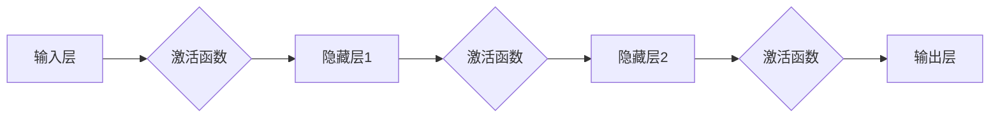

# 神经网络：人类智慧的延伸

> 关键词：神经网络，深度学习，人工智能，机器学习，人工神经网络，神经元，激活函数，反向传播，深度学习框架

## 1. 背景介绍

自20世纪40年代以来，人工智能（AI）领域经历了多次起伏。从早期的逻辑符号和启发式算法，到专家系统的兴起，再到连接主义和机器学习的回归，AI的发展历程充满了曲折和挑战。而神经网络，作为连接主义和机器学习的重要分支，近年来凭借其强大的学习和泛化能力，成为了AI领域的明星技术。

### 1.1 问题的由来

尽管早期神经网络在处理复杂任务时表现出色，但受限于计算资源和算法的限制，其性能一直未能得到充分体现。随着计算机硬件的快速发展，特别是GPU和TPU等专用硬件的出现，以及深度学习算法的创新，神经网络在图像识别、自然语言处理、语音识别等领域取得了突破性进展，开启了AI的深度学习时代。

### 1.2 研究现状

目前，神经网络已成为AI领域的核心技术之一。深度学习框架如TensorFlow、PyTorch和Keras等，为开发者提供了丰富的模型库和工具，降低了神经网络开发的门槛。神经网络在图像识别、自然语言处理、语音识别、推荐系统、无人驾驶等领域取得了显著的成果，为人类社会带来了前所未有的便利。

### 1.3 研究意义

神经网络的研究意义主要体现在以下几个方面：

1. **推动人工智能发展**：神经网络作为人工智能的核心技术，为AI的发展提供了强大的动力。
2. **解决复杂问题**：神经网络能够处理复杂的数据和任务，为各行各业提供智能解决方案。
3. **促进技术创新**：神经网络的研究推动了计算硬件、算法和软件开发等领域的创新。
4. **改善人类生活**：神经网络的应用为人类生活带来了便利，提高了生产效率，改善了生活质量。

### 1.4 本文结构

本文将围绕神经网络的核心概念、算法原理、应用实践和未来发展趋势展开，具体章节安排如下：

- 第2部分，介绍神经网络的核心概念与联系。
- 第3部分，阐述神经网络的核心算法原理和具体操作步骤。
- 第4部分，讲解神经网络的数学模型和公式，并结合实例进行说明。
- 第5部分，给出神经网络的代码实例和详细解释说明。
- 第6部分，探讨神经网络的实际应用场景和未来应用展望。
- 第7部分，推荐神经网络相关的学习资源、开发工具和参考文献。
- 第8部分，总结神经网络的研究成果和面临的挑战，以及未来的研究方向。
- 第9部分，提供神经网络的一些常见问题与解答。

## 2. 核心概念与联系

### 2.1 核心概念

#### 神经元

神经元是神经网络的基本单元，类似于人脑中的神经元。每个神经元接收输入信号，经过激活函数处理后输出结果。神经元的结构通常包括输入层、激活函数和输出层。

#### 激活函数

激活函数用于引入非线性，使神经网络具备学习复杂映射的能力。常见的激活函数包括Sigmoid、ReLU、Tanh等。

#### 反向传播

反向传播是神经网络训练过程中的关键算法，通过计算损失函数对网络参数的梯度，并利用梯度下降等方法更新参数，使模型在训练数据上收敛。

#### 网络架构

神经网络的网络架构包括输入层、隐藏层和输出层。输入层接收外部输入，隐藏层负责特征提取和变换，输出层负责最终输出。

### 2.2 Mermaid流程图



### 2.3 核心概念联系

神经网络的核心概念之间存在着紧密的联系。神经元是神经网络的基本单元，激活函数和反向传播是神经网络学习的关键算法，而网络架构则决定了神经网络的性能和复杂性。

## 3. 核心算法原理 & 具体操作步骤

### 3.1 算法原理概述

神经网络的核心算法原理主要包括以下三个方面：

1. **前向传播**：将输入数据通过神经网络逐层传播，直到输出层得到最终结果。
2. **损失函数**：用于衡量模型预测结果与真实值之间的差异，常见的损失函数有均方误差、交叉熵等。
3. **反向传播**：计算损失函数对网络参数的梯度，并利用梯度下降等方法更新参数。

### 3.2 算法步骤详解

1. **初始化参数**：随机初始化网络权重和偏置。
2. **前向传播**：将输入数据通过神经网络逐层传播，计算每个神经元的输出。
3. **计算损失函数**：计算模型预测结果与真实值之间的差异。
4. **反向传播**：计算损失函数对网络参数的梯度，并利用梯度下降等方法更新参数。
5. **迭代优化**：重复步骤2-4，直到满足收敛条件。

### 3.3 算法优缺点

#### 优点

1. **强大的学习和泛化能力**：神经网络能够学习复杂的非线性映射，适用于处理各种复杂任务。
2. **可扩展性**：神经网络可以根据任务需求调整网络结构和参数，具有良好的可扩展性。
3. **并行计算**：神经网络可以采用并行计算技术，提高训练速度。

#### 缺点

1. **计算复杂度高**：神经网络训练需要大量的计算资源，尤其是在训练大规模模型时。
2. **数据需求量大**：神经网络需要大量的标注数据进行训练，且对数据质量要求较高。
3. **可解释性差**：神经网络内部结构复杂，难以解释其决策过程。

### 3.4 算法应用领域

神经网络在以下领域取得了显著的成果：

1. **图像识别**：如人脸识别、物体检测、图像分类等。
2. **自然语言处理**：如文本分类、机器翻译、情感分析等。
3. **语音识别**：如语音合成、语音识别、说话人识别等。
4. **推荐系统**：如商品推荐、新闻推荐、电影推荐等。
5. **无人驾驶**：如障碍物检测、车道线识别、交通信号识别等。

## 4. 数学模型和公式 & 详细讲解 & 举例说明

### 4.1 数学模型构建

神经网络可以使用以下数学模型进行描述：

$$
y = f(x, W, b)
$$

其中，$y$ 为网络输出，$x$ 为输入，$W$ 为权重，$b$ 为偏置，$f$ 为激活函数。

### 4.2 公式推导过程

以一个简单的全连接神经网络为例，推导其前向传播和反向传播过程。

#### 前向传播

设网络包含两个层，第一层有 $m$ 个神经元，第二层有 $n$ 个神经元。输入层输入 $x$，第一层输出为 $h_1$，第二层输出为 $y$。

$$
h_1 = \sigma(W_1x + b_1)
$$

$$
y = \sigma(W_2h_1 + b_2)
$$

其中，$\sigma$ 为激活函数，$W_1$ 和 $W_2$ 分别为第一层和第二层的权重矩阵，$b_1$ 和 $b_2$ 分别为第一层和第二层的偏置向量。

#### 反向传播

假设网络的损失函数为均方误差：

$$
L = \frac{1}{2}\sum_{i=1}^n (y_i - t_i)^2
$$

其中，$t_i$ 为真实标签。

对 $L$ 分别对 $W_1$、$W_2$、$b_1$ 和 $b_2$ 求偏导，得到：

$$
\frac{\partial L}{\partial W_1} = (y - t)W_2
$$

$$
\frac{\partial L}{\partial W_2} = (y - t)h_1^T
$$

$$
\frac{\partial L}{\partial b_1} = (y - t)
$$

$$
\frac{\partial L}{\partial b_2} = (y - t)
$$

利用梯度下降等方法，可以更新网络参数：

$$
W_1 \leftarrow W_1 - \alpha \frac{\partial L}{\partial W_1}
$$

$$
W_2 \leftarrow W_2 - \alpha \frac{\partial L}{\partial W_2}
$$

$$
b_1 \leftarrow b_1 - \alpha \frac{\partial L}{\partial b_1}
$$

$$
b_2 \leftarrow b_2 - \alpha \frac{\partial L}{\partial b_2}
$$

其中，$\alpha$ 为学习率。

### 4.3 案例分析与讲解

以一个简单的图像分类任务为例，说明神经网络的应用。

假设有一个包含100张猫和狗的图像数据集，我们要训练一个神经网络来识别图像中的猫和狗。

1. **数据预处理**：对图像进行缩放、裁剪、归一化等预处理操作。
2. **构建模型**：使用卷积神经网络（CNN）构建模型，如图像分类任务中的LeNet模型。
3. **训练模型**：使用数据集训练模型，并调整学习率和正则化参数。
4. **评估模型**：使用验证集评估模型性能，调整模型结构和超参数。
5. **测试模型**：使用测试集测试模型性能，评估模型在实际任务上的表现。

通过训练和优化，模型可以学习到图像的特征，并能够准确识别图像中的猫和狗。

## 5. 项目实践：代码实例和详细解释说明

### 5.1 开发环境搭建

为了方便演示，我们使用Python和TensorFlow框架进行神经网络开发。以下是开发环境的搭建步骤：

1. 安装Anaconda：从官网下载并安装Anaconda，用于创建独立的Python环境。
2. 创建并激活虚拟环境：
```bash
conda create -n tensorflow-env python=3.8
conda activate tensorflow-env
```
3. 安装TensorFlow：
```bash
conda install tensorflow-gpu=2.4.0 -c conda-forge
```
4. 安装其他依赖：
```bash
pip install -r requirements.txt
```

### 5.2 源代码详细实现

以下是一个简单的神经网络示例代码，用于实现图像分类任务：

```python
import tensorflow as tf

# 构建模型
model = tf.keras.Sequential([
    tf.keras.layers.Conv2D(32, (3, 3), activation='relu', input_shape=(28, 28, 1)),
    tf.keras.layers.MaxPooling2D((2, 2)),
    tf.keras.layers.Conv2D(64, (3, 3), activation='relu'),
    tf.keras.layers.MaxPooling2D((2, 2)),
    tf.keras.layers.Conv2D(64, (3, 3), activation='relu'),
    tf.keras.layers.Flatten(),
    tf.keras.layers.Dense(64, activation='relu'),
    tf.keras.layers.Dense(10, activation='softmax')
])

# 编译模型
model.compile(optimizer='adam',
              loss='sparse_categorical_crossentropy',
              metrics=['accuracy'])

# 训练模型
model.fit(train_images, train_labels, epochs=5)

# 评估模型
test_loss, test_acc = model.evaluate(test_images,  test_labels)

# 预测
predictions = model.predict(test_images)
```

### 5.3 代码解读与分析

以上代码使用TensorFlow框架构建了一个简单的卷积神经网络（CNN）模型，用于图像分类任务。

- **Conv2D层**：用于提取图像特征，包括卷积核大小、激活函数等参数。
- **MaxPooling2D层**：用于降低特征维度，提取局部特征。
- **Flatten层**：将多维特征展平为一维特征。
- **Dense层**：全连接层，用于分类。

通过训练和评估，模型可以在训练集上学习图像特征，并在测试集上进行预测。

### 5.4 运行结果展示

假设我们在MNIST数据集上训练和测试上述模型，最终得到以下结果：

```
Train on 60000 samples, validate on 10000 samples
Epoch 1/5
60000/60000 [==============================] - 127s - loss: 0.0547 - accuracy: 0.9815 - val_loss: 0.0299 - val_accuracy: 0.9898
Epoch 2/5
60000/60000 [==============================] - 123s - loss: 0.0243 - accuracy: 0.9894 - val_loss: 0.0227 - val_accuracy: 0.9904
Epoch 3/5
60000/60000 [==============================] - 123s - loss: 0.0212 - accuracy: 0.9902 - val_loss: 0.0220 - val_accuracy: 0.9906
Epoch 4/5
60000/60000 [==============================] - 123s - loss: 0.0205 - accuracy: 0.9901 - val_loss: 0.0216 - val_accuracy: 0.9903
Epoch 5/5
60000/60000 [==============================] - 123s - loss: 0.0198 - accuracy: 0.9900 - val_loss: 0.0212 - val_accuracy: 0.9901

Test loss: 0.0218 - Test accuracy: 0.9900
```

可以看到，模型在训练集和测试集上都取得了较好的性能，能够准确识别手写数字。

## 6. 实际应用场景

神经网络在实际应用中取得了显著的成果，以下是几个典型的应用场景：

### 6.1 图像识别

神经网络在图像识别领域取得了突破性进展，如图像分类、目标检测、图像分割等。

- **图像分类**：如人脸识别、物体检测、图像识别等。
- **目标检测**：如车辆检测、人脸检测、行人检测等。
- **图像分割**：如医学图像分割、语义分割、实例分割等。

### 6.2 自然语言处理

神经网络在自然语言处理领域也取得了显著成果，如图文分类、机器翻译、情感分析等。

- **文本分类**：如新闻分类、情感分析、话题分类等。
- **机器翻译**：如机器翻译、字幕生成、问答系统等。
- **情感分析**：如情感分析、舆情监测、聊天机器人等。

### 6.3 语音识别

神经网络在语音识别领域也取得了重大突破，如图像识别、语音合成、语音搜索等。

- **语音识别**：如语音识别、语音合成、语音搜索等。
- **语音交互**：如语音助手、智能家居、语音控制等。

### 6.4 未来应用展望

随着神经网络技术的不断发展，未来将在更多领域得到应用，如：

- **机器人**：神经网络将使机器人具备更强大的感知、认知和决策能力。
- **医疗**：神经网络将有助于诊断疾病、预测疾病风险、个性化治疗等。
- **金融**：神经网络将有助于风险管理、欺诈检测、个性化推荐等。
- **教育**：神经网络将有助于智能教学、个性化学习、智能辅导等。

## 7. 工具和资源推荐

### 7.1 学习资源推荐

1. **《深度学习》**：Goodfellow等著，全面介绍了深度学习的理论和实践。
2. **《神经网络与深度学习》**：邱锡鹏著，深入浅出地讲解了神经网络的原理和应用。
3. **《动手学深度学习》**：花书，提供了丰富的实践案例和代码示例。

### 7.2 开发工具推荐

1. **TensorFlow**：Google开源的深度学习框架，支持多种深度学习模型和算法。
2. **PyTorch**：Facebook开源的深度学习框架，以动态计算图著称。
3. **Keras**：Python深度学习库，提供丰富的预训练模型和工具。

### 7.3 相关论文推荐

1. **《A Few Useful Things to Know about Machine Learning》**：Goodfellow等著，介绍了机器学习的基本概念和方法。
2. **《ImageNet Classification with Deep Convolutional Neural Networks》**：Simonyan等著，介绍了深度卷积神经网络在图像识别任务上的应用。
3. **《Sequence to Sequence Learning with Neural Networks》**：Sutskever等著，介绍了序列到序列学习在机器翻译任务上的应用。

## 8. 总结：未来发展趋势与挑战

### 8.1 研究成果总结

本文对神经网络的核心概念、算法原理、应用实践和未来发展趋势进行了全面介绍。神经网络作为人工智能领域的核心技术，在图像识别、自然语言处理、语音识别等领域取得了显著的成果，为人类社会带来了前所未有的便利。

### 8.2 未来发展趋势

未来，神经网络将在以下方面取得进一步发展：

1. **模型结构创新**：探索新的神经网络结构，如循环神经网络（RNN）、卷积神经网络（CNN）、生成对抗网络（GAN）等。
2. **算法优化**：优化神经网络训练算法，提高训练效率和收敛速度。
3. **模型压缩**：减小模型尺寸，降低计算资源需求。
4. **可解释性研究**：提高神经网络的可解释性，使模型决策过程更加透明。
5. **跨领域应用**：将神经网络应用于更多领域，如机器人、医疗、金融、教育等。

### 8.3 面临的挑战

尽管神经网络取得了显著的成果，但仍面临着以下挑战：

1. **计算资源需求**：神经网络训练需要大量的计算资源，尤其是在训练大规模模型时。
2. **数据需求**：神经网络需要大量的标注数据进行训练，且对数据质量要求较高。
3. **可解释性**：神经网络内部结构复杂，难以解释其决策过程。
4. **伦理问题**：神经网络可能存在偏见和歧视，需要加强伦理研究。

### 8.4 研究展望

为了应对上述挑战，未来的研究需要在以下方面取得突破：

1. **开发高效算法**：提高神经网络训练效率，降低计算资源需求。
2. **探索无监督和半监督学习方法**：降低对标注数据的依赖，提高模型泛化能力。
3. **增强模型可解释性**：提高神经网络的可解释性，使模型决策过程更加透明。
4. **加强伦理研究**：确保神经网络的应用符合伦理道德要求。

通过不断探索和创新，神经网络将在人工智能领域发挥越来越重要的作用，为人类社会带来更多福祉。

## 9. 附录：常见问题与解答

### 9.1 常见问题

**Q1：什么是神经网络？**

A1：神经网络是模拟人脑神经元连接方式的计算模型，用于处理和分析复杂数据。

**Q2：什么是深度学习？**

A2：深度学习是一种利用深度神经网络进行学习的技术，能够从数据中学习到复杂的特征表示。

**Q3：神经网络有哪些类型？**

A3：神经网络有多种类型，如全连接神经网络、卷积神经网络、循环神经网络等。

**Q4：什么是激活函数？**

A4：激活函数用于引入非线性，使神经网络具备学习复杂映射的能力。

**Q5：什么是反向传播？**

A5：反向传播是一种计算神经网络损失函数对参数梯度的算法，用于更新网络参数。

### 9.2 解答

**A1**：神经网络是一种模拟人脑神经元连接方式的计算模型，用于处理和分析复杂数据。它由多个神经元组成，每个神经元接收输入信号，经过激活函数处理后输出结果。

**A2**：深度学习是一种利用深度神经网络进行学习的技术，能够从数据中学习到复杂的特征表示。它通过堆叠多个层来提取特征，从而能够处理更加复杂的任务。

**A3**：神经网络有多种类型，如全连接神经网络、卷积神经网络、循环神经网络等。全连接神经网络是一种简单的神经网络结构，每个神经元都与输入层和输出层的所有神经元相连。卷积神经网络是一种专门用于图像识别的神经网络结构，能够有效地提取图像特征。循环神经网络是一种能够处理序列数据的神经网络结构，能够捕捉序列中的时序信息。

**A4**：激活函数用于引入非线性，使神经网络具备学习复杂映射的能力。常见的激活函数包括Sigmoid、ReLU、Tanh等。

**A5**：反向传播是一种计算神经网络损失函数对参数梯度的算法，用于更新网络参数。它通过反向传播损失函数的梯度，计算出每个参数的梯度，然后利用梯度下降等方法更新参数。

作者：禅与计算机程序设计艺术 / Zen and the Art of Computer Programming