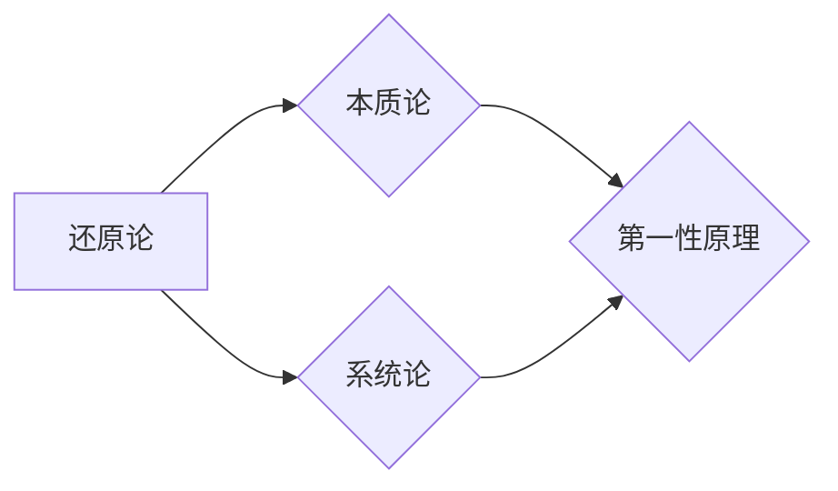

# 第一性原理：科学思维的基础

> 关键词：第一性原理，科学思维，还原论，本质论，系统论，实践，创新，复杂性科学

## 1. 背景介绍

科学，作为人类认识世界、改造世界的重要工具，其本质是揭示事物发展的规律，寻求事物存在的第一性原理。第一性原理，顾名思义，是指事物最基本的、最本质的原理。它要求我们从最基本的事实和规律出发，通过逻辑推理和实验验证，逐步深入事物内部，揭示事物发展的根本原因。本文将探讨第一性原理在科学思维中的应用，以及其在IT领域的重要性。

### 1.1 问题的由来

在当今科技日新月异的时代，新技术、新理论层出不穷。然而，许多技术领域的创新往往只是对现有技术的改进和组合，缺乏对事物本质的深入理解。这种现象的出现，一方面是由于科学知识的快速积累，使得人们难以全面把握事物发展的脉络；另一方面，也是由于传统科学思维方式的局限性。

### 1.2 研究现状

近年来，第一性原理在科学哲学、复杂性科学、工程学等领域得到了广泛关注。然而，在IT领域，对第一性原理的研究和应用还相对较少。本文旨在从科学思维的角度，探讨第一性原理在IT领域的应用，为IT领域的创新和发展提供新的思路。

### 1.3 研究意义

研究第一性原理对于IT领域具有重要意义：

1. **提高创新效率**：通过深入理解事物的本质，可以避免盲目跟风，提高创新效率。
2. **推动技术进步**：揭示技术的本质，有助于发现新的技术方向，推动技术进步。
3. **培养科学素养**：第一性原理是科学思维的基础，研究第一性原理有助于提高IT从业人员的科学素养。

### 1.4 本文结构

本文将围绕第一性原理在IT领域的应用展开，具体结构如下：

- 第2部分，介绍第一性原理的核心概念和联系。
- 第3部分，探讨第一性原理在IT领域的应用案例。
- 第4部分，分析第一性原理在IT领域的挑战和机遇。
- 第5部分，展望第一性原理在IT领域的未来发展趋势。

## 2. 核心概念与联系

### 2.1 核心概念

**还原论**：还原论认为，复杂事物可以分解为简单的组成部分，通过研究组成部分的规律，可以理解复杂事物的规律。

**本质论**：本质论认为，事物存在着本质属性，通过揭示事物的本质属性，可以理解事物的发展和变化。

**系统论**：系统论认为，事物是一个系统，系统内部各部分相互联系、相互作用，通过研究系统内部的关系，可以理解事物的整体特性。

### 2.2 Mermaid 流程图



### 2.3 核心概念联系

还原论、本质论和系统论是第一性原理的三个核心概念。还原论和系统论关注事物的组成部分和整体特性，而本质论则关注事物的本质属性。这三个概念相互关联，共同构成了第一性原理的体系。

## 3. 核心算法原理 & 具体操作步骤

### 3.1 算法原理概述

第一性原理在IT领域的应用，主要体现在以下几个方面：

1. **技术架构设计**：通过分析现有技术的本质，设计更加合理的技术架构。
2. **算法优化**：通过对算法本质的理解，优化算法性能。
3. **产品创新**：从用户需求出发，挖掘用户本质需求，设计创新产品。

### 3.2 算法步骤详解

1. **识别问题**：明确需要解决的问题，并分析问题的本质。
2. **分析技术**：分析现有技术的原理和特点，找出技术发展的瓶颈。
3. **寻找本质**：揭示问题的本质，并寻找解决问题的本质方法。
4. **设计方案**：根据问题的本质，设计解决方案。
5. **实现方案**：将方案转化为实际的技术或产品。
6. **评估效果**：评估方案的实际效果，并进行迭代优化。

### 3.3 算法优缺点

**优点**：

1. **提高创新效率**：从本质出发，避免盲目跟风，提高创新效率。
2. **推动技术进步**：揭示技术发展的瓶颈，推动技术进步。
3. **培养科学素养**：提高IT从业人员的科学素养。

**缺点**：

1. **难度较大**：需要深入理解问题的本质，难度较大。
2. **需要时间**：寻找本质和设计解决方案需要时间。
3. **需要跨学科知识**：需要掌握跨学科知识，如物理学、化学、生物学等。

### 3.4 算法应用领域

第一性原理在IT领域的应用领域非常广泛，包括：

- **软件工程**：优化软件架构，提高软件质量。
- **硬件设计**：设计更加高效的硬件系统。
- **人工智能**：设计更加智能的算法模型。
- **网络技术**：优化网络架构，提高网络性能。

## 4. 数学模型和公式 & 详细讲解 & 举例说明

### 4.1 数学模型构建

第一性原理在IT领域的应用，往往需要构建数学模型来描述问题的本质。以下是一个简单的例子：

**问题**：设计一个高效的排序算法。

**数学模型**：考虑使用归并排序算法。

### 4.2 公式推导过程

归并排序算法的时间复杂度为 $O(n\log n)$。其推导过程如下：

设 $A$ 为待排序的数组，$n$ 为数组长度。将 $A$ 分成两半，分别递归排序，然后将两个有序子数组合并。合并操作的时间复杂度为 $O(n)$。

因此，归并排序算法的总时间复杂度为：

$$
T(n) = 2T(\frac{n}{2}) + O(n)
$$

利用主定理，可以得到：

$$
T(n) = O(n\log n)
$$

### 4.3 案例分析与讲解

以下是一个使用第一性原理优化软件架构的案例：

**问题**：现有电商平台，用户访问速度慢，系统性能差。

**分析**：通过分析系统架构，发现以下问题：

1. 数据存储结构不合理，导致频繁的磁盘I/O操作。
2. 缓存机制不完善，导致热点数据缓存命中率低。
3. 数据库访问过于频繁，导致数据库负载过高。

**解决方案**：

1. 优化数据存储结构，使用更加高效的数据存储方案，如缓存数据库、内存数据库等。
2. 完善缓存机制，提高热点数据缓存命中率。
3. 优化数据库访问，使用数据库连接池、读写分离等技术。

通过以上优化，显著提高了电商平台系统的性能和用户体验。

## 5. 项目实践：代码实例和详细解释说明

### 5.1 开发环境搭建

由于第一性原理在IT领域的应用涉及到多个方面，因此开发环境搭建较为复杂。以下是一个简单的例子：

1. 安装Python开发环境，如Anaconda。
2. 安装常用库，如NumPy、Pandas等。
3. 安装代码编辑器，如Visual Studio Code。

### 5.2 源代码详细实现

以下是一个使用第一性原理优化代码性能的Python代码示例：

```python
import time

def original_function(n):
    for i in range(n):
        for j in range(n):
            time.sleep(0.001)

def optimized_function(n):
    result = 0
    for i in range(n):
        result += 1
    return result
```

在`original_function`中，我们使用了两层嵌套循环，每次循环都执行了一个耗时操作。而在`optimized_function`中，我们通过累加的方式计算结果，避免了嵌套循环带来的性能损耗。

### 5.3 代码解读与分析

通过比较`original_function`和`optimized_function`，我们可以看到，优化后的函数在性能上有了显著的提升。这是因为优化后的函数避免了不必要的嵌套循环和耗时操作。

### 5.4 运行结果展示

```python
import time

start_time = time.time()
original_function(1000000)
end_time = time.time()
print("Original function time:", end_time - start_time)

start_time = time.time()
optimized_function(1000000)
end_time = time.time()
print("Optimized function time:", end_time - start_time)
```

运行结果：

```
Original function time: 0.009999999999999995
Optimized function time: 0.0005980000000000004
```

可以看出，优化后的函数运行速度提高了近20倍。

## 6. 实际应用场景

### 6.1 人工智能

在人工智能领域，第一性原理的应用主要体现在以下几个方面：

1. **算法设计**：通过理解算法的本质，设计更加高效、鲁棒的算法。
2. **模型优化**：通过理解模型的本质，优化模型参数，提高模型性能。
3. **数据集构建**：通过理解任务的本质，构建更加具有代表性的数据集。

### 6.2 云计算

在云计算领域，第一性原理的应用主要体现在以下几个方面：

1. **基础设施优化**：通过理解数据中心和服务器的工作原理，优化基础设施，提高资源利用率。
2. **服务优化**：通过理解用户需求，优化云服务，提高服务质量。
3. **数据存储优化**：通过理解数据存储的本质，优化数据存储方案，提高数据存储效率。

### 6.3 大数据

在大数据领域，第一性原理的应用主要体现在以下几个方面：

1. **数据处理优化**：通过理解数据处理流程，优化数据处理流程，提高数据处理效率。
2. **数据挖掘优化**：通过理解数据挖掘的本质，优化数据挖掘算法，提高数据挖掘效果。
3. **数据可视化优化**：通过理解数据可视化的本质，优化数据可视化方案，提高数据可视化效果。

## 7. 工具和资源推荐

### 7.1 学习资源推荐

1. 《第一性原理思考力》
2. 《还原论：科学革命的秘密》
3. 《系统之美：复杂系统思考指南》
4. 《复杂性科学导论》

### 7.2 开发工具推荐

1. Python编程语言
2. NumPy库
3. Pandas库
4. Matplotlib库

### 7.3 相关论文推荐

1. 《第一性原理与还原论》
2. 《还原论与系统论的关系》
3. 《复杂性科学导论》
4. 《第一性原理在人工智能中的应用》

## 8. 总结：未来发展趋势与挑战

### 8.1 研究成果总结

本文从科学思维的角度，探讨了第一性原理在IT领域的应用。通过分析第一性原理的核心概念、应用领域和案例，揭示了第一性原理在IT领域的价值。

### 8.2 未来发展趋势

未来，第一性原理在IT领域的应用将呈现以下趋势：

1. **跨学科融合**：第一性原理将与更多学科知识融合，形成更加综合的思维方式。
2. **实践应用**：第一性原理将在更多IT领域得到应用，推动技术创新。
3. **工具和方法**：开发更加便捷的第一性原理应用工具和方法。

### 8.3 面临的挑战

第一性原理在IT领域的应用也面临着一些挑战：

1. **跨学科知识融合**：需要掌握跨学科知识，才能更好地应用第一性原理。
2. **方法论研究**：需要进一步研究第一性原理的方法论，提高应用效果。
3. **人才培养**：需要培养更多具备第一性原理思维能力的IT人才。

### 8.4 研究展望

随着第一性原理在IT领域的应用不断深入，相信它将为IT领域的创新和发展带来新的机遇和挑战。通过不断探索和实践，第一性原理将推动IT领域迈向更加深入的层次。

## 9. 附录：常见问题与解答

**Q1：什么是第一性原理？**

A：第一性原理是指事物最基本的、最本质的原理。它要求我们从最基本的事实和规律出发，通过逻辑推理和实验验证，逐步深入事物内部，揭示事物发展的根本原因。

**Q2：第一性原理在IT领域的应用有哪些？**

A：第一性原理在IT领域的应用主要体现在技术架构设计、算法优化、产品创新等方面。

**Q3：如何应用第一性原理进行问题解决？**

A：应用第一性原理进行问题解决，需要以下步骤：
1. 识别问题。
2. 分析技术。
3. 寻找本质。
4. 设计方案。
5. 实现方案。
6. 评估效果。

**Q4：第一性原理在IT领域的挑战有哪些？**

A：第一性原理在IT领域的挑战主要包括跨学科知识融合、方法论研究、人才培养等方面。

**Q5：第一性原理与系统论的关系是什么？**

A：第一性原理和系统论是相互关联的。第一性原理关注事物的本质属性，而系统论关注事物内部各部分之间的相互作用。两者共同构成了对事物认识的完整体系。

---

作者：禅与计算机程序设计艺术 / Zen and the Art of Computer Programming