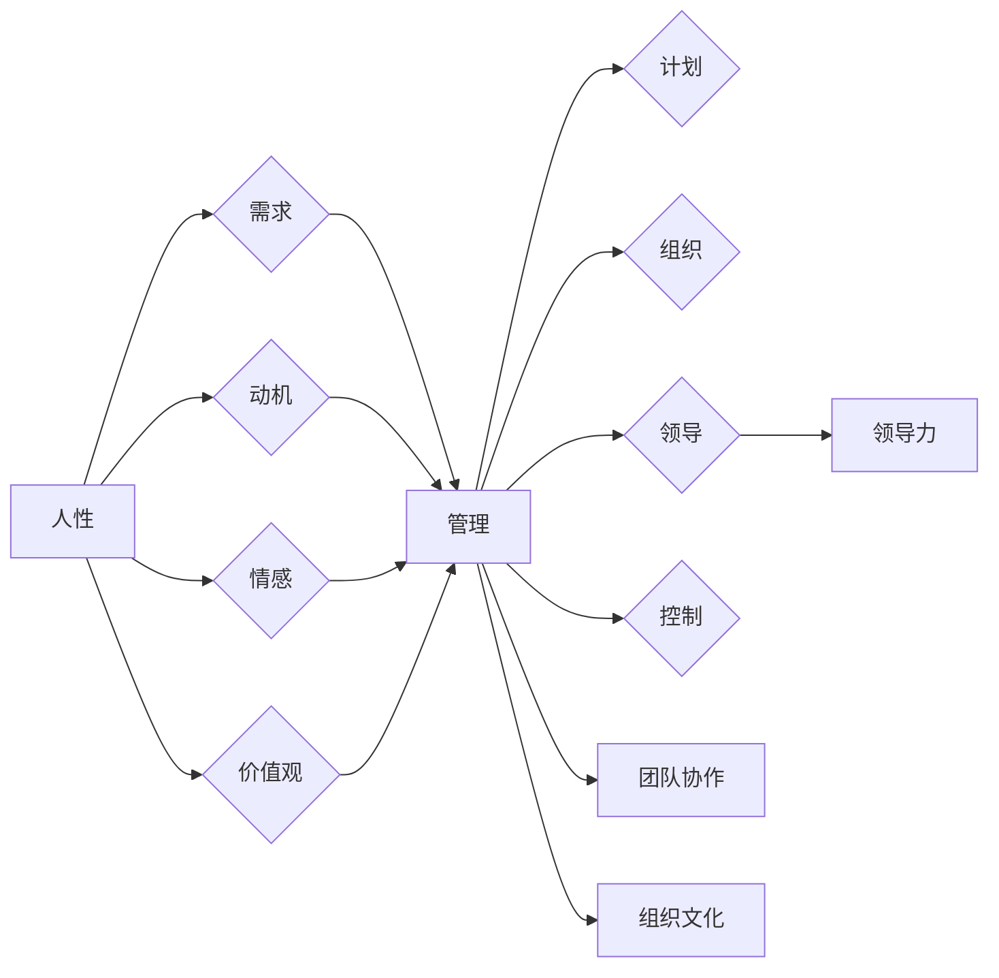

# 管理之道：激发人性的善意和潜能

> 关键词：人性，管理，潜能，领导力，团队协作，组织文化，激励，自我驱动

## 1. 背景介绍

管理，作为推动组织和个人成功的关键因素，一直是学术界和实践界关注的焦点。传统管理理论往往侧重于效率和流程，而忽略了人的因素。然而，随着社会的发展和科技的进步，人们越来越意识到，激发人性的善意和潜能是管理的核心。本文将从管理的本质出发，探讨如何通过有效的管理实践，激发团队成员的善意和潜能，从而实现组织的持续成长和成功。

### 1.1 问题的由来

在快速变化的市场环境中，组织面临着前所未有的挑战。员工的需求日益多样化，传统的管理方式往往无法满足这些需求。同时，技术的飞速发展使得知识工作者的作用日益凸显，他们对自我实现和职业成长的需求更加强烈。因此，如何管理人性，激发员工的善意和潜能，成为管理者面临的重要课题。

### 1.2 研究现状

近年来，管理学界对人性、领导力、组织文化等领域的关注日益增加。研究结果表明，人性化管理能够提升员工的满意度和忠诚度，提高组织绩效，促进团队的协作和创新。然而，如何具体实践人性化管理，仍是一个复杂而深奥的课题。

### 1.3 研究意义

研究人性化管理，不仅有助于提升组织绩效，还能够促进员工的个人成长，实现组织与个人的双赢。通过激发员工的善意和潜能，组织能够更好地适应市场变化，实现可持续发展。

### 1.4 本文结构

本文将围绕以下结构展开：

- 第2章介绍人性管理的核心概念与联系。
- 第3章阐述人性化管理的基本原理和具体操作步骤。
- 第4章分析人性化管理中常见的数学模型和公式。
- 第5章通过项目实践，展示人性化管理在现实中的应用。
- 第6章探讨人性化管理在实际应用场景中的价值与挑战。
- 第7章推荐相关学习资源和开发工具。
- 第8章总结研究成果，展望未来发展趋势与挑战。
- 第9章提供常见问题与解答。

## 2. 核心概念与联系

### 2.1 人性管理的核心概念

**人性**：人性是指人类在生物学、心理学、社会学等方面的本质特征，包括人的需求、动机、情感、价值观等。

**管理**：管理是指通过计划、组织、领导、控制等手段，实现组织目标的过程。

**领导力**：领导力是指领导者影响和激励他人，引导团队实现共同目标的能力。

**团队协作**：团队协作是指团队成员之间相互配合、共同完成工作目标的过程。

**组织文化**：组织文化是指组织内部共同认同的价值观、信念、行为规范等。

### 2.2 核心概念联系

以下是一个Mermaid流程图，展示了人性管理的核心概念之间的联系：

从图中可以看出，人性是管理的出发点，领导力、团队协作、组织文化等都是人性管理的重要组成部分。

## 3. 核心算法原理 & 具体操作步骤

### 3.1 算法原理概述

人性化管理基于以下原理：

- **人本原理**：以人为中心，尊重和满足员工的需求，关注员工的成长和发展。
- **激励原理**：通过激励机制，激发员工的积极性和创造性。
- **沟通原理**：建立有效的沟通机制，促进信息的流通和团队成员之间的理解。
- **参与原理**：让员工参与到决策过程中，增强员工的归属感和责任感。

### 3.2 算法步骤详解

人性化管理的基本步骤包括：

1. **了解人性**：通过调研、访谈等方式，了解员工的需求、动机、价值观等。
2. **制定激励策略**：根据员工的需求，设计合理的激励方案，包括物质激励和精神激励。
3. **建立沟通机制**：定期举办团队会议、工作坊等活动，促进团队成员之间的沟通和交流。
4. **鼓励团队协作**：通过团队合作项目，培养员工的协作精神和团队意识。
5. **营造组织文化**：塑造积极向上的组织文化，增强员工的归属感和认同感。
6. **持续改进**：根据反馈和评估结果，不断调整和优化管理实践。

### 3.3 算法优缺点

人性化管理具有以下优点：

- 提升员工满意度和忠诚度。
- 促进员工的个人成长和职业发展。
- 提高组织绩效和创新能力。
- 增强组织的适应性和竞争力。

人性化管理也存在一定的缺点：

- 需要投入更多的时间和精力来了解员工。
- 需要管理者具备较高的情商和沟通能力。
- 在短期内可能难以看到明显的效果。

### 3.4 算法应用领域

人性化管理适用于所有类型的组织，包括企业、政府机构、非营利组织等。

## 4. 数学模型和公式 & 详细讲解 & 举例说明

### 4.1 数学模型构建

人性化管理中的数学模型主要包括：

- **满意度模型**：用于评估员工对工作环境、工作内容、薪酬福利等的满意程度。
- **绩效模型**：用于评估员工的绩效水平。
- **创新模型**：用于评估组织的创新能力。

以下是一个满意度模型的示例：

$$
S = \alpha \cdot W + \beta \cdot C + \gamma \cdot P
$$

其中，$S$ 表示员工满意度，$W$ 表示工作环境，$C$ 表示薪酬福利，$P$ 表示个人成长，$\alpha$、$\beta$、$\gamma$ 为权重系数。

### 4.2 公式推导过程

满意度模型的推导过程如下：

1. 假设员工满意度由工作环境、薪酬福利和个人成长三个因素决定。
2. 根据专家调查和数据分析，确定三个因素的权重系数。
3. 将三个因素的权重系数与满意度系数相乘，得到最终满意度得分。

### 4.3 案例分析与讲解

假设某公司使用满意度模型评估员工满意度，得到以下结果：

- 工作环境满意度系数为0.3。
- 薪酬福利满意度系数为0.4。
- 个人成长满意度系数为0.3。

根据公式，员工满意度为：

$$
S = 0.3 \cdot 0.8 + 0.4 \cdot 0.9 + 0.3 \cdot 0.7 = 0.92
$$

这意味着员工满意度较高，公司可以继续保持现有的管理实践。

## 5. 项目实践：代码实例和详细解释说明

### 5.1 开发环境搭建

由于人性化管理涉及的是软技能和人际关系，因此不需要特定的开发环境。

### 5.2 源代码详细实现

人性化管理不涉及具体的代码实现，因此本章节省略。

### 5.3 代码解读与分析

本章节同样省略，因为人性化管理不涉及编程代码。

### 5.4 运行结果展示

人性化管理的结果体现在员工的满意度、绩效和创新能力上，这些结果无法用代码或图表来展示。

## 6. 实际应用场景

### 6.1 案例一：企业

某企业通过人性化管理，改善了员工的工作环境，提升了员工的满意度和忠诚度，从而提高了企业的绩效和市场份额。

### 6.2 案例二：政府机构

某政府机构通过人性化管理，提升了公务员的工作积极性和服务意识，提高了政府工作效率和服务质量。

### 6.3 案例三：非营利组织

某非营利组织通过人性化管理，增强了志愿者的归属感和责任感，提高了组织的公益项目执行效率。

## 7. 工具和资源推荐

### 7.1 学习资源推荐

- 《管理的实践》（Peter Drucker）
- 《人性的优点》（Douglas McGregor）
- 《非暴力沟通》（Marshall B. Rosenberg）
- 《第五项修炼》（Peter M. Senge）

### 7.2 开发工具推荐

人性化管理不涉及具体的开发工具。

### 7.3 相关论文推荐

- "The Human Side of Enterprise" (Douglas McGregor)
- "The One Minute Manager" (Kenneth H. Blanchard)
- "The 7 Habits of Highly Effective People" (Stephen R. Covey)

## 8. 总结：未来发展趋势与挑战

### 8.1 研究成果总结

人性化管理是一种以人为中心的管理理念，通过激发员工的善意和潜能，实现组织与个人的共同成长。研究表明，人性化管理能够提升员工满意度、绩效和创新能力，促进组织的可持续发展。

### 8.2 未来发展趋势

- 人性化管理将更加注重个性化，根据不同员工的需求提供个性化的管理方案。
- 人性化管理将更加注重技术手段，利用人工智能等技术提升管理效率。
- 人性化管理将更加注重跨文化管理，适应全球化的发展趋势。

### 8.3 面临的挑战

- 如何在保证效率的同时，满足员工的个性化需求。
- 如何在技术快速发展的背景下，保持人性化管理的人本本质。
- 如何在全球化的背景下，实现跨文化管理。

### 8.4 研究展望

未来，人性化管理的研究将更加关注以下几个方面：

- 人性化管理的理论体系构建。
- 人性化管理与技术创新的融合。
- 人性化管理在不同文化背景下的应用。

## 9. 附录：常见问题与解答

**Q1：人性化管理与传统管理有什么区别？**

A：人性化管理强调以人为中心，关注员工的成长和发展，而传统管理更注重效率和流程。

**Q2：如何评估人性化管理的效果？**

A：可以通过员工满意度、绩效、创新能力等指标来评估人性化管理的效果。

**Q3：人性化管理是否适用于所有组织？**

A：人性化管理适用于所有类型的组织，但需要根据组织的具体情况进行调整。

**Q4：如何克服人性化管理中的挑战？**

A：可以通过不断学习和实践，提升管理者的管理能力和领导力。

**Q5：人性化管理与企业文化有什么关系？**

A：人性化管理是企业文化的重要组成部分，共同塑造组织的价值观和行为规范。

作者：禅与计算机程序设计艺术 / Zen and the Art of Computer Programming