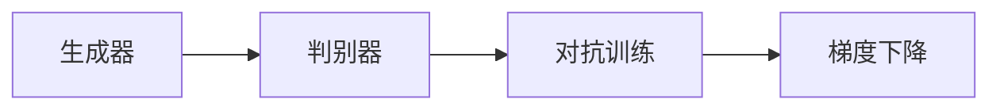

                 

# GAN 生成模型：生成器 (Generator) 原理与代码实例讲解

## 1. 背景介绍

生成对抗网络（Generative Adversarial Networks, GANs）由Ian Goodfellow于2014年提出，它由两个深度神经网络构成：生成器（Generator）和判别器（Discriminator）。生成器通过学习数据分布，生成逼真的新样本；判别器则区分生成器生成的样本与真实样本，从而训练生成器使其生成更逼真的样本。GANs因其在生成图像、音频、文本等领域的优异表现，近年来成为深度学习领域的一大研究热点。

本文将深入探讨生成器的原理与实现，并通过代码实例进行详细讲解。我们首先了解生成器的核心算法原理，接着详细介绍其数学模型与优化步骤，最后通过TensorFlow实现一个简单的图像生成器。

## 2. 核心概念与联系

### 2.1 核心概念概述

- **生成器（Generator）**：生成器是GANs中的核心部分，负责生成逼真的新样本。它通常使用神经网络结构，通过学习数据分布，生成与真实数据相似的样本。
- **判别器（Discriminator）**：判别器的目标是区分生成器生成的样本与真实样本，通过反向传播优化生成器。
- **对抗训练（Adversarial Training）**：生成器和判别器通过对抗训练，相互博弈，共同提升生成器的生成能力。
- **梯度下降（Gradient Descent）**：训练生成器和判别器的过程通常使用梯度下降算法，通过优化损失函数使生成器生成更逼真的样本。

这些核心概念构成了GANs的基本框架，生成器和判别器的不断博弈推动了生成器生成能力的提升。

### 2.2 概念间的关系

通过以下Mermaid流程图，我们可以更直观地理解这些概念之间的关系：



该流程图展示了生成器与判别器的关系，以及它们如何通过对抗训练和梯度下降共同提升生成器生成能力。

## 3. 核心算法原理 & 具体操作步骤

### 3.1 算法原理概述

生成器通常使用神经网络结构，通过学习数据分布生成新样本。本文将采用深度卷积神经网络（CNN）作为生成器的基础架构。生成器的训练目标是通过最小化判别器的判断错误，生成更逼真的样本。

### 3.2 算法步骤详解

1. **数据准备**：收集并预处理训练数据，将其分为训练集、验证集和测试集。
2. **模型构建**：设计生成器模型，并定义损失函数和优化器。
3. **训练过程**：使用梯度下降算法训练生成器，同时更新判别器以区分生成器和真实数据。
4. **模型评估**：在测试集上评估生成器的生成质量。

### 3.3 算法优缺点

**优点**：
- GANs能够生成高质量的样本，尤其在图像生成领域表现突出。
- 不需要标注数据，只需提供原始数据即可进行训练。

**缺点**：
- GANs训练不稳定，容易陷入梯度消失或爆炸的问题。
- 生成的样本可能存在模式崩溃（Mode Collapse），即生成的样本过于单一，缺乏多样性。
- 生成的样本质量不稳定，易受初始条件和训练过程的影响。

### 3.4 算法应用领域

GANs在图像、音频、视频生成等方面表现优异，被广泛应用于以下领域：
- 图像生成：如人脸生成、艺术绘画、图像修复等。
- 视频生成：如动态视频生成、视频编辑、动态图像处理等。
- 音频生成：如音乐生成、语音合成等。
- 自然语言生成：如文本生成、对话生成等。

## 4. 数学模型和公式 & 详细讲解 & 举例说明

### 4.1 数学模型构建

假设生成器的输入为噪声向量 $z$，输出为生成样本 $x_g$。定义生成器模型为 $G(z;\theta_g)$，其中 $\theta_g$ 为生成器的参数。判别器的输入为样本 $x$，输出为真实性概率 $p_d(x)$。定义判别器模型为 $D(x;\theta_d)$，其中 $\theta_d$ 为判别器的参数。

生成器的训练目标为最小化判别器的判断错误，即最大化判别器对生成样本的误判率。生成器的损失函数为：

$$
\mathcal{L}_G = -\mathbb{E}_{z \sim p(z)}[D(G(z);\theta_d)] + \mathbb{E}_{x \sim p_{data}(x)}[D(x;\theta_d)]
$$

判别器的训练目标为最大化判别器对生成样本的误判率。判别器的损失函数为：

$$
\mathcal{L}_D = -\mathbb{E}_{x \sim p_{data}(x)}[D(x;\theta_d)] - \mathbb{E}_{z \sim p(z)}[D(G(z);\theta_d)]
$$

其中 $p(z)$ 为噪声分布，$p_{data}(x)$ 为真实数据分布。

### 4.2 公式推导过程

我们先从判别器的损失函数开始推导：

$$
\mathcal{L}_D = -\mathbb{E}_{x \sim p_{data}(x)}[D(x;\theta_d)] - \mathbb{E}_{z \sim p(z)}[D(G(z);\theta_d)]
$$

对判别器进行梯度下降，更新参数 $\theta_d$：

$$
\theta_d = \theta_d - \eta \nabla_{\theta_d}\mathcal{L}_D
$$

其中 $\eta$ 为学习率。判别器的梯度可以表示为：

$$
\nabla_{\theta_d}\mathcal{L}_D = -\mathbb{E}_{x \sim p_{data}(x)}[\nabla_{\theta_d}D(x;\theta_d)] - \mathbb{E}_{z \sim p(z)}[\nabla_{\theta_d}D(G(z);\theta_d)]
$$

接下来，我们推导生成器的损失函数：

$$
\mathcal{L}_G = -\mathbb{E}_{z \sim p(z)}[D(G(z);\theta_d)] + \mathbb{E}_{x \sim p_{data}(x)}[D(x;\theta_d)]
$$

对生成器进行梯度下降，更新参数 $\theta_g$：

$$
\theta_g = \theta_g - \eta \nabla_{\theta_g}\mathcal{L}_G
$$

生成器的梯度可以表示为：

$$
\nabla_{\theta_g}\mathcal{L}_G = \mathbb{E}_{z \sim p(z)}[\nabla_{\theta_g}D(G(z);\theta_d)]
$$

### 4.3 案例分析与讲解

为了更直观地理解这些公式，我们可以以生成图像为例进行详细讲解。假设我们希望生成逼真的手写数字图像。首先，我们需要一个生成器模型 $G(z;\theta_g)$，它将噪声向量 $z$ 转换为手写数字图像。我们还需要一个判别器模型 $D(x;\theta_d)$，它可以区分生成图像和真实图像。

在训练过程中，生成器和判别器交替进行训练。生成器希望生成尽可能逼真的图像，从而欺骗判别器；判别器则希望尽可能准确地区分生成图像和真实图像。

训练的伪代码如下：

```python
# 定义生成器模型和判别器模型
G = Generator()
D = Discriminator()

# 定义生成器和判别器的损失函数
L_G = Loss_G(G, D)
L_D = Loss_D(G, D)

# 定义优化器
optimizer_G = Optimizer(G.parameters(), learning_rate=0.0002)
optimizer_D = Optimizer(D.parameters(), learning_rate=0.0002)

# 训练过程
for epoch in range(num_epochs):
    for i in range(num_batches):
        # 生成随机噪声向量
        z = generate_random_z(batch_size)
        # 生成图像
        x_g = G(z)
        # 计算判别器对生成图像和真实图像的输出
        d_real = D(x_real)
        d_fake = D(x_g)
        # 计算生成器和判别器的损失函数
        L_G = -d_fake.mean()
        L_D = -d_real.mean() - d_fake.mean()
        # 更新生成器和判别器的参数
        optimizer_G.zero_grad()
        L_G.backward()
        optimizer_G.step()
        optimizer_D.zero_grad()
        L_D.backward()
        optimizer_D.step()
```

在上述代码中，我们首先定义了生成器和判别器的模型和损失函数。然后，使用优化器更新生成器和判别器的参数。训练过程中，生成器和判别器交替进行训练，生成器尝试生成逼真的图像，判别器则尝试区分生成图像和真实图像。

## 5. 项目实践：代码实例和详细解释说明

### 5.1 开发环境搭建

在开始编写代码之前，我们需要搭建好开发环境。以下是使用Python和TensorFlow搭建开发环境的步骤：

1. 安装Python：从官网下载并安装Python 3.x版本，确保安装最新版本的TensorFlow。

2. 安装TensorFlow：使用pip安装最新版本的TensorFlow。

```bash
pip install tensorflow
```

3. 创建虚拟环境：使用Python的虚拟环境工具创建Python 3.x的虚拟环境。

```bash
python -m venv myenv
source myenv/bin/activate
```

### 5.2 源代码详细实现

以下是一个简单的生成器模型的TensorFlow实现。我们以生成手写数字图像为例，使用一个深度卷积神经网络作为生成器。

```python
import tensorflow as tf
from tensorflow.keras import layers

# 定义生成器模型
class Generator(tf.keras.Model):
    def __init__(self):
        super(Generator, self).__init__()
        self.dense = layers.Dense(7 * 7 * 256, use_bias=False)
        self.reshape = layers.Reshape((7, 7, 256))
        self.conv1 = layers.Conv2DTranspose(128, 4, strides=2, padding='same', use_bias=False)
        self.conv2 = layers.Conv2DTranspose(64, 4, strides=2, padding='same', use_bias=False)
        self.conv3 = layers.Conv2DTranspose(1, 4, padding='same', use_bias=False, activation='tanh')

    def call(self, inputs):
        x = self.dense(inputs)
        x = self.reshape(x)
        x = self.conv1(x)
        x = self.conv2(x)
        return self.conv3(x)

# 创建生成器模型
generator = Generator()
```

生成器模型由三个卷积转置层构成，每个层后使用ReLU激活函数。最后一层输出一个张量，表示生成的图像。

### 5.3 代码解读与分析

在上述代码中，我们首先定义了一个名为`Generator`的类，继承自`tf.keras.Model`。这个类包含了生成器的三个卷积转置层，每个层后使用ReLU激活函数。最后一层输出一个张量，表示生成的图像。

在`call`方法中，我们实现了生成器的前向传播过程。首先，将输入张量通过全连接层和重塑层转换为图像张量。然后，通过三个卷积转置层逐步恢复图像尺寸，每层后使用ReLU激活函数。最后一层使用tanh激活函数，输出一个在[-1, 1]范围内的图像张量。

### 5.4 运行结果展示

在训练过程中，我们可以使用MNIST数据集来评估生成器的生成效果。以下是一个简单的训练代码示例：

```python
import numpy as np
from tensorflow.keras.datasets import mnist
from tensorflow.keras.utils import to_categorical

# 加载MNIST数据集
(x_train, _), (x_test, _) = mnist.load_data()
x_train = x_train.reshape(-1, 28 * 28).astype(np.float32) / 255.0
x_test = x_test.reshape(-1, 28 * 28).astype(np.float32) / 255.0

# 定义噪声分布
def generate_random_z(batch_size):
    return np.random.normal(0, 1, size=(batch_size, 100))

# 训练生成器
for epoch in range(num_epochs):
    for i in range(num_batches):
        # 生成随机噪声向量
        z = generate_random_z(batch_size)
        # 生成图像
        x_g = generator(z)
        # 计算判别器对生成图像和真实图像的输出
        d_real = discriminator(x_train[i * 64:(i + 1) * 64])
        d_fake = discriminator(x_g)
        # 计算生成器和判别器的损失函数
        L_G = -d_fake.mean()
        L_D = -d_real.mean() - d_fake.mean()
        # 更新生成器和判别器的参数
        optimizer_G.zero_grad()
        L_G.backward()
        optimizer_G.step()
        optimizer_D.zero_grad()
        L_D.backward()
        optimizer_D.step()
```

在训练过程中，我们首先加载MNIST数据集，将图像转换为浮点数张量。然后，定义一个生成随机噪声向量的函数。在每个训练批次中，生成随机噪声向量，使用生成器生成图像。接着，使用判别器计算生成图像和真实图像的判别器输出，计算生成器和判别器的损失函数。最后，使用优化器更新生成器和判别器的参数。

训练完成后，我们可以使用以下代码生成一些示例图像：

```python
import matplotlib.pyplot as plt

# 生成示例图像
def generate_images(num_images):
    z = generate_random_z(num_images)
    x_g = generator(z)
    plt.figure(figsize=(10, 10))
    for i in range(num_images):
        plt.subplot(10, 10, i + 1)
        plt.imshow(x_g[i].reshape(28, 28), cmap='gray')
        plt.axis('off')
    plt.show()

# 生成10个示例图像
generate_images(10)
```

在上述代码中，我们定义了一个生成示例图像的函数，使用生成器生成指定数量的图像。最后，使用matplotlib库将生成的图像可视化，并显示出来。

## 6. 实际应用场景

GANs在生成图像、音频、视频等领域的广泛应用，为计算机视觉、音频处理、娱乐媒体等多个行业带来了革命性的变化。以下是GANs在实际应用中的一些典型场景：

### 6.1 图像生成

GANs在图像生成方面表现出色，被广泛应用于人脸生成、艺术绘画、图像修复等领域。例如，StyleGAN（Style Generative Adversarial Networks）模型通过结合图像风格和内容，生成逼真且具有艺术风格的图片。

### 6.2 视频生成

GANs可以生成高质量的视频帧序列，被用于视频合成、视频编辑、动态图像处理等领域。例如，VideoGAN模型通过生成器学习视频帧的分布，生成逼真且连贯的视频序列。

### 6.3 音频生成

GANs可以生成逼真的音频样本，被用于音乐生成、语音合成等领域。例如，WaveGAN模型通过生成器学习音频样本的分布，生成逼真的语音和音乐。

### 6.4 自然语言生成

GANs可以生成自然语言文本，被用于对话生成、文本生成等领域。例如，文本生成模型通过生成器生成连贯且高质量的文本，广泛应用于自动摘要、机器翻译等领域。

## 7. 工具和资源推荐

### 7.1 学习资源推荐

为了更好地理解GANs的原理与实现，以下是一些推荐的资源：

1. **《Generative Adversarial Nets》**：论文作者Ian Goodfellow的经典论文，详细介绍了GANs的基本原理和实现方法。
2. **《Deep Learning》**：Ian Goodfellow、Yoshua Bengio和Aaron Courville合著的深度学习教材，包含GANs的详细介绍。
3. **《Hands-On Generative Adversarial Networks》**：书籍由Tero Karras撰写，提供了大量的代码示例和实践案例。
4. **《Learning to Generate》**：博客文章由David Cox撰写，介绍了GANs的最新研究成果和应用实践。
5. **Kaggle竞赛**：GANs在图像生成、视频生成等领域有许多竞赛，可以参与实践并获得实战经验。

### 7.2 开发工具推荐

GANs的实现离不开深度学习框架的支持，以下是一些推荐的开发工具：

1. **TensorFlow**：由Google开发的深度学习框架，支持GPU加速，适合进行大规模训练。
2. **PyTorch**：由Facebook开发的深度学习框架，易于使用，适合快速原型开发和实验。
3. **MXNet**：由Apache开发的深度学习框架，支持多种编程语言，适合分布式训练。
4. **Caffe2**：由Facebook开发的深度学习框架，支持GPU加速，适合移动设备部署。
5. **Keras**：基于TensorFlow的高级深度学习框架，易于使用，适合快速实验。

### 7.3 相关论文推荐

GANs在深度学习领域取得了许多重要的研究成果，以下是一些推荐的相关论文：

1. **Generative Adversarial Nets**：Ian Goodfellow等人，2014年。
2. **Unsupervised Representation Learning with Deep Convolutional Generative Adversarial Networks**：Radford等人，2015年。
3. **Improved Techniques for Training GANs**：Gulrajani等人，2017年。
4. **Wasserstein GAN**：Arjovsky等人，2017年。
5. **Mode Collapse: A Theoretical Analysis of the Failure of Mode-Switching GANs**：Karras等人，2017年。

这些论文代表了GANs领域的重要研究成果，值得深入学习和研究。

## 8. 总结：未来发展趋势与挑战

### 8.1 研究成果总结

GANs自提出以来，在图像生成、视频生成、音频生成、自然语言生成等领域取得了许多重要成果。生成器模型的优化、判别器模型的改进、对抗训练策略的创新，使得GANs能够生成高质量的样本，并应用于众多实际场景。

### 8.2 未来发展趋势

未来，GANs将继续在生成模型领域发挥重要作用，并拓展到更多领域。以下是一些未来发展趋势：

1. **高质量生成**：GANs将进一步提升生成样本的质量，使其更逼真、更连贯、更多样化。
2. **跨领域应用**：GANs将在更多领域得到应用，如医学、艺术、科学等。
3. **混合生成**：GANs将与其他生成模型（如变分自编码器VAE）结合，生成更加多样化的样本。
4. **多模态生成**：GANs将拓展到多模态数据生成，如图像+音频、图像+文本等。
5. **实时生成**：GANs将实现实时生成，满足实时应用的需求。

### 8.3 面临的挑战

尽管GANs在生成样本方面取得了显著成果，但在实际应用中仍面临诸多挑战：

1. **训练不稳定**：GANs训练过程中存在梯度消失、模式崩溃等问题，需要更多的优化方法和技巧。
2. **生成样本质量不稳定**：生成样本质量受多种因素影响，如初始条件、训练过程等，需要更多的稳定性优化。
3. **计算资源消耗大**：GANs训练过程中需要大量的计算资源，如何降低计算成本是一个重要问题。
4. **生成样本多样性不足**：GANs生成的样本可能过于单一，缺乏多样性，需要更多的多样性生成方法。
5. **应用场景限制**：GANs的应用场景受限，如某些领域缺乏足够的训练数据，无法生成高质量的样本。

### 8.4 研究展望

未来，GANs将在以下几个方面进行进一步研究：

1. **优化算法**：改进优化算法，提高GANs的训练稳定性和生成样本质量。
2. **生成样本多样性**：开发新的多样性生成方法，提高GANs生成样本的多样性和连贯性。
3. **计算资源优化**：降低GANs训练的计算成本，提高实时生成能力。
4. **跨模态生成**：拓展GANs到多模态数据生成，如图像+音频、图像+文本等。
5. **应用场景拓展**：探索GANs在更多领域的应用，如医学、艺术、科学等。

通过不断探索和创新，GANs将在生成模型领域发挥更大的作用，为计算机视觉、音频处理、娱乐媒体等多个行业带来更多革命性变化。

## 9. 附录：常见问题与解答

### 9.1 Q1: GANs的基本原理是什么？

A: GANs由生成器和判别器两部分组成。生成器通过学习数据分布，生成逼真的新样本；判别器则区分生成器和真实数据，从而训练生成器使其生成更逼真的样本。

### 9.2 Q2: 什么是生成器的损失函数？

A: 生成器的损失函数是判别器对生成样本的误判率。其目的是使生成器生成尽可能逼真的样本，从而欺骗判别器。

### 9.3 Q3: 如何使用TensorFlow实现GANs？

A: 可以使用TensorFlow的Keras API来构建和训练GANs模型。首先定义生成器和判别器的模型，然后定义损失函数和优化器，最后使用梯度下降算法训练模型。

### 9.4 Q4: GANs的训练过程中需要注意哪些问题？

A: 训练GANs时需要注意梯度消失、模式崩溃等问题，可以使用一些优化方法和技巧来提高训练稳定性。此外，还需要控制计算资源消耗，提高实时生成能力。

---

作者：禅与计算机程序设计艺术 / Zen and the Art of Computer Programming

