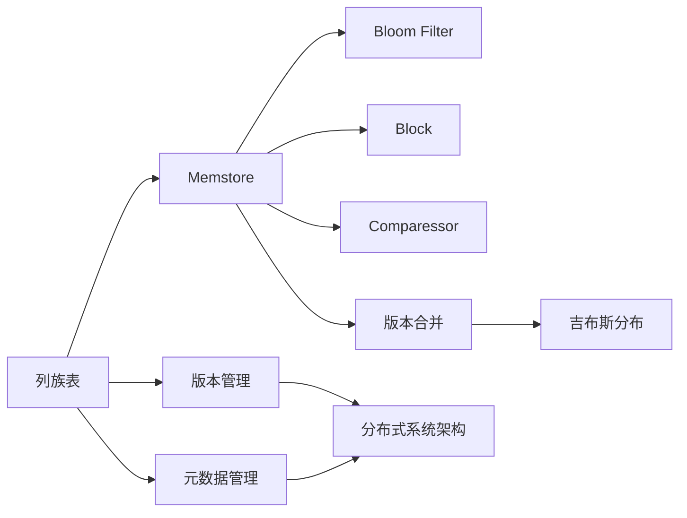
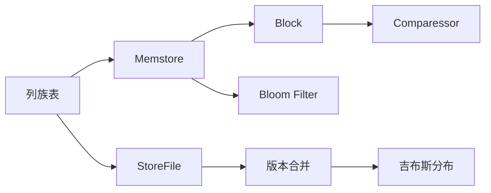
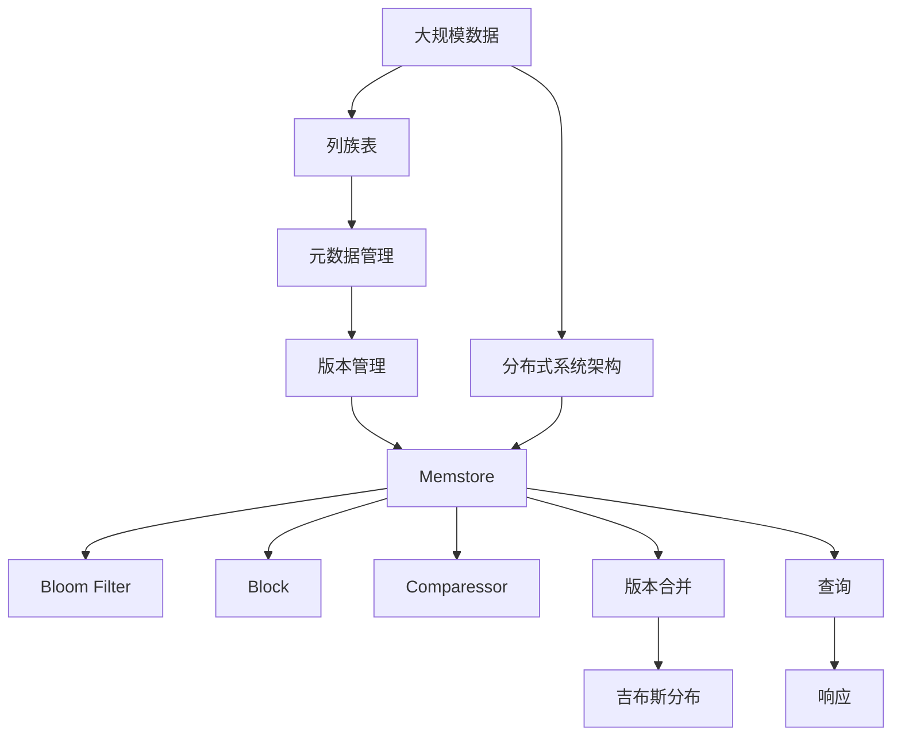

                 

# HBase原理与代码实例讲解

> 关键词：HBase,列族,列族表,元数据,版本管理,Memstore,布隆过滤器,Bloom Filter,Block,Comparessor,版本合并,Merger,吉布斯分布,Gibbs Distribution,分布式系统

## 1. 背景介绍

### 1.1 问题由来
随着互联网和数据量的飞速增长，传统关系型数据库（RDBMS）在面对大规模、高并发的在线数据存储需求时，表现出了诸多局限性。首先，RDBMS在处理大规模数据时，由于其底层基于表的结构化数据模型，导致存储和查询效率低下；其次，RDBMS的垂直扩展性（增加单个节点的计算能力）较难实现，水平扩展性（增加节点数以分散负载）相对简单但复杂；最后，RDBMS在数据安全性和并发控制方面存在天然的瓶颈。

HBase作为一种分布式非关系型数据库（NoSQL），其设计的初衷就是应对这些挑战。HBase融合了Google的BigTable和GFS（Google File System）的设计理念，通过列族和版本管理等创新机制，实现了高吞吐量、低延迟的在线数据存储和访问，并支持海量数据的水平扩展性。

### 1.2 问题核心关键点
HBase的核心特点可以归纳为以下几点：

1. 列族表：HBase以列族为基本存储单位，支持动态添加和删除列族。列族表由多个列族组成，每个列族下可以有多个列。列族下的列可以包含多个版本，通过版本管理机制对数据进行高效的读写操作。

2. 元数据管理：HBase通过元数据表（META）存储所有表的元信息，包括列族、版本、数据模型等。元数据管理使得HBase能够快速定位和访问表的数据。

3. 分布式系统架构：HBase采用基于Master/RegionServer的分布式架构。Master负责管理所有表和元数据，RegionServer负责管理数据，通过Region划分数据以提高并发性和水平扩展性。

4. 版本管理：HBase支持多种版本策略，包括基于时间戳的版本管理、基于行键的版本管理等。版本管理机制允许HBase快速处理不同时间点的数据，同时支持读写操作的并发控制。

5. 性能优化：HBase通过压缩、布隆过滤器、版本合并等机制，优化了数据的存储和访问效率，支持高吞吐量的在线数据存储和查询。

6. 可靠性与容错性：HBase支持多版本的复制和冗余存储，确保数据的可靠性和容错性。通过版本合并机制，HBase能够在多个版本之间进行合并，避免数据冗余和冲突。

## 2. 核心概念与联系

### 2.1 核心概念概述

为了更好地理解HBase的工作原理，本节将介绍几个密切相关的核心概念：

- 列族表（Column Family Table）：HBase的存储单位，每个表由一个或多个列族组成。列族下的列支持动态添加和删除，具有较强的灵活性。
- 元数据（MetaData）：HBase通过元数据表存储所有表的元信息，包括列族、版本、数据模型等。元数据管理使得HBase能够快速定位和访问表的数据。
- 分布式系统架构：HBase采用基于Master/RegionServer的分布式架构。Master负责管理所有表和元数据，RegionServer负责管理数据，通过Region划分数据以提高并发性和水平扩展性。
- 版本管理：HBase支持多种版本策略，包括基于时间戳的版本管理、基于行键的版本管理等。版本管理机制允许HBase快速处理不同时间点的数据，同时支持读写操作的并发控制。
- Memstore：HBase的数据存储主要分为两个部分：Memstore和StoreFile。Memstore是HBase的内存存储区域，用于存储当前操作的最新数据，支持高效的读写操作。
- Bloom Filter（布隆过滤器）：用于快速判断一个值是否存在于数据集合中，可以显著提高数据的访问效率。
- Block：HBase的块存储机制，将数据按照一定规则分割成多个块，以提高数据的并发读写能力。
- Comparessor（压缩器）：HBase通过压缩算法对数据进行压缩，以减少存储和传输的开销。
- 版本合并（Version Merge）：HBase在多个版本之间进行合并，以避免数据冗余和冲突，确保数据的完整性和一致性。
- 吉布斯分布（Gibbs Distribution）：HBase在版本合并时，通过吉布斯分布计算各个版本之间的概率权重，进行版本选择和合并。

这些核心概念之间的逻辑关系可以通过以下Mermaid流程图来展示：



这个流程图展示了HBase的核心概念及其之间的关系：

1. 列族表是HBase的基本存储单位，元数据管理支持快速定位和访问表的数据。
2. 版本管理机制允许HBase处理不同时间点的数据，支持高效的读写操作。
3. Memstore和StoreFile共同组成HBase的数据存储体系，支持高效的内存和磁盘访问。
4. Bloom Filter和Block优化了数据的访问效率。
5. Comparessor对数据进行压缩，减少存储和传输的开销。
6. 版本合并机制确保数据的完整性和一致性，吉布斯分布用于计算版本之间的概率权重。

这些概念共同构成了HBase的数据存储和访问逻辑，使得HBase能够高效地处理大规模、高并发的在线数据存储需求。

### 2.2 概念间的关系

这些核心概念之间存在着紧密的联系，形成了HBase的数据存储和访问框架。下面我们通过几个Mermaid流程图来展示这些概念之间的关系。

#### 2.2.1 数据存储架构



这个流程图展示了列族表的数据存储架构：

1. 列族表的数据首先存储在Memstore中，支持高效的读写操作。
2. Memstore中的数据按照一定规则分割成多个块，并进行压缩和布隆过滤，以提高数据的访问效率。
3. 数据在Memstore中存储一段时间后，会根据版本策略自动转移到StoreFile中，支持多版本的存储和访问。
4. StoreFile中的数据进行版本合并，确保数据的完整性和一致性。
5. 版本合并过程中，通过吉布斯分布计算各个版本之间的概率权重，进行版本选择和合并。

#### 2.2.2 数据访问架构


这个流程图展示了列族表的数据访问架构：

1. 查询首先访问Memstore，获取最新的数据。
2. 如果Memstore中没有数据，则通过版本选择机制，选择最近的数据版本。
3. 版本选择过程中，通过吉布斯分布计算各个版本之间的概率权重，进行版本选择和合并。
4. 合并后的数据作为最终响应返回。

### 2.3 核心概念的整体架构

最后，我们用一个综合的流程图来展示这些核心概念在大规模数据存储和访问中的整体架构：



这个综合流程图展示了列族表在大规模数据存储和访问中的整体架构：

1. 大规模数据通过列族表进行存储，支持高并发的数据访问。
2. 列族表通过元数据管理，快速定位和访问表的数据。
3. 数据在Memstore中存储，并通过版本管理和版本合并机制，确保数据的完整性和一致性。
4. Memstore中的数据进行压缩和布隆过滤，以提高数据的访问效率。
5. 分布式系统架构支持海量数据的水平扩展性。
6. 查询首先访问Memstore，获取最新的数据，进行版本选择和合并，最终返回响应。

通过这些流程图，我们可以更清晰地理解HBase的工作原理和优化机制，为后续深入讨论具体的实现细节奠定基础。

## 3. 核心算法原理 & 具体操作步骤

### 3.1 算法原理概述

HBase的核心算法原理可以归纳为以下几点：

1. 列族表和版本管理：HBase通过列族和版本管理机制，支持动态添加和删除列族，高效处理不同时间点的数据。

2. 分布式系统架构：HBase采用基于Master/RegionServer的分布式架构，支持海量数据的水平扩展性。

3. 内存和磁盘存储：HBase通过Memstore和StoreFile实现数据存储，支持高效的内存和磁盘访问。

4. 数据访问优化：HBase通过Bloom Filter、Block和Comparessor等机制，优化数据的访问效率。

5. 版本合并机制：HBase通过版本合并机制，在多个版本之间进行合并，确保数据的完整性和一致性。

6. 数据一致性和可靠性：HBase支持多版本的复制和冗余存储，确保数据的可靠性和容错性。

7. 数据安全性和权限控制：HBase支持基于角色的权限控制，确保数据的安全性。

### 3.2 算法步骤详解

HBase的算法步骤可以归纳为以下几点：

1. 创建表：通过HBase shell或API创建列族表，指定列族和版本策略。

2. 写入数据：通过HBase shell或API向列族表中写入数据，支持多版本的写入。

3. 读取数据：通过HBase shell或API读取列族表中的数据，支持多种版本策略。

4. 版本管理：通过HBase shell或API管理列族表的版本，支持版本选择和合并。

5. 数据访问优化：通过HBase shell或API优化数据的访问，使用Bloom Filter和Block等机制。

6. 压缩和存储：通过HBase shell或API压缩和存储数据，使用Comparessor和StoreFile机制。

7. 分布式系统管理：通过HBase shell或API管理分布式系统，使用Master和RegionServer机制。

### 3.3 算法优缺点

HBase的算法优点可以归纳为以下几点：

1. 高吞吐量：HBase支持高吞吐量的在线数据存储和访问，适用于大规模数据的应用场景。

2. 低延迟：HBase采用Memstore和StoreFile存储机制，支持低延迟的读写操作。

3. 水平扩展性：HBase支持海量数据的水平扩展性，通过Region划分数据以提高并发性。

4. 版本管理：HBase支持多种版本策略，支持不同时间点的数据访问和处理。

5. 数据优化：HBase通过Bloom Filter、Block和Comparessor等机制，优化数据的存储和访问效率。

HBase的算法缺点可以归纳为以下几点：

1. 数据模型简单：HBase的列族表模型较为简单，缺乏关系型数据库的多表关联和复杂查询功能。

2. 版本冲突：HBase在多个版本之间进行合并时，可能会发生数据冲突和丢失，需要谨慎处理。

3. 数据一致性问题：HBase在分布式环境下，可能会存在数据一致性问题，需要通过版本合并机制解决。

4. 数据存储量较大：HBase支持海量数据的存储，需要较大的存储空间和计算资源。

5. 学习曲线陡峭：HBase的学习曲线较为陡峭，需要开发者具备一定的分布式系统和数据存储基础。

### 3.4 算法应用领域

HBase在以下几个领域得到了广泛应用：

1. 大数据存储：HBase支持海量数据的存储和访问，适用于日志、用户行为数据、物联网数据等大规模数据的应用场景。

2. 实时数据处理：HBase支持高吞吐量的在线数据存储和访问，适用于实时数据流处理、实时查询分析等场景。

3. 分布式系统架构：HBase采用基于Master/RegionServer的分布式架构，适用于分布式系统开发和部署。

4. 数据安全性和权限控制：HBase支持基于角色的权限控制，适用于对数据安全性和权限控制要求较高的场景。

## 4. 数学模型和公式 & 详细讲解 & 举例说明

### 4.1 数学模型构建

HBase的数学模型可以归纳为以下几点：

1. 列族表：HBase的列族表由多个列族组成，每个列族下可以有多个列。列族下的列支持动态添加和删除。

2. 版本管理：HBase支持多种版本策略，包括基于时间戳的版本管理、基于行键的版本管理等。版本管理机制允许HBase快速处理不同时间点的数据。

3. 分布式系统架构：HBase采用基于Master/RegionServer的分布式架构，通过Master管理所有表和元数据，通过RegionServer管理数据，通过Region划分数据以提高并发性和水平扩展性。

4. Memstore：HBase的内存存储区域，用于存储当前操作的最新数据。

5. Bloom Filter：用于快速判断一个值是否存在于数据集合中，可以显著提高数据的访问效率。

6. Block：HBase的块存储机制，将数据按照一定规则分割成多个块，以提高数据的并发读写能力。

7. Comparessor：HBase通过压缩算法对数据进行压缩，以减少存储和传输的开销。

8. 版本合并：HBase在多个版本之间进行合并，以避免数据冗余和冲突，确保数据的完整性和一致性。

### 4.2 公式推导过程

以下我们以版本管理机制为例，推导基于时间戳的版本管理公式。

假设列族表中有一列名为`data`，有两个版本`v1`和`v2`，其中`v1`的时间戳为100，`v2`的时间戳为200。当读取`data`列时，HBase会按照时间戳的顺序进行版本合并。

首先，计算`v1`和`v2`的概率权重：

$$
P(v1) = \frac{100}{300}, P(v2) = \frac{200}{300}
$$

然后，通过吉布斯分布计算概率权重：

$$
P(v1) = \frac{P(v1)}{1+P(v2)} = \frac{100}{100+200} = \frac{1}{3}
$$

$$
P(v2) = \frac{P(v2)}{1+P(v1)} = \frac{200}{100+200} = \frac{2}{3}
$$

最后，根据概率权重进行版本选择和合并：

$$
\text{合并结果} = P(v1) \cdot v1 + P(v2) \cdot v2 = \frac{1}{3} \cdot v1 + \frac{2}{3} \cdot v2
$$

通过上述公式，可以看出，HBase在多个版本之间进行合并时，会按照吉布斯分布计算概率权重，进行版本选择和合并。

### 4.3 案例分析与讲解

假设我们有一个存储用户访问日志的列族表，列族名为`user_log`，包含`user_id`、`timestamp`、`path`、`status`等列。我们希望在读取日志时，能够快速找到最近访问的用户记录。

我们可以使用版本管理和Bloom Filter来优化数据的访问。首先，我们为`user_id`列族添加版本管理，保留最近几天的访问记录。然后，为`user_id`列族添加Bloom Filter，用于快速判断某个用户是否存在访问记录。

具体实现步骤如下：

1. 创建列族表：

```sql
CREATE TABLE user_log (
  user_id CF,
  timestamp CF,
  path CF,
  status CF
) WITH
  CLUSTERING ORDER BY (timestamp DESC);
```

2. 插入数据：

```sql
INSERT INTO user_log (user_id, timestamp, path, status) VALUES
('user1', 1638385200000, '/home', '200'),
('user2', 1638385500000, '/search', '404'),
('user3', 1638386000000, '/product', '200'),
('user3', 1638386500000, '/review', '200');
```

3. 读取数据：

```sql
SELECT * FROM user_log WHERE timestamp > 1638385000000 AND timestamp < 1638386000000;
```

4. 使用Bloom Filter：

```sql
CREATE TABLE user_log_with_bloom_filter (
  user_id CF,
  timestamp CF,
  path CF,
  status CF,
  user_id_filter CF
) WITH
  CLUSTERING ORDER BY (timestamp DESC);

ALTER TABLE user_log_with_bloom_filter ADD COLUMN user_id_filter CF;

INSERT INTO user_log_with_bloom_filter (user_id, timestamp, path, status, user_id_filter) VALUES
('user1', 1638385200000, '/home', '200', '0'),
('user2', 1638385500000, '/search', '404', '0'),
('user3', 1638386000000, '/product', '200', '1'),
('user3', 1638386500000, '/review', '200', '1');

UPDATE user_log_with_bloom_filter SET user_id_filter = 0 WHERE user_id = 'user2';

SELECT * FROM user_log_with_bloom_filter WHERE user_id_filter = 1;
```

通过上述案例，可以看出，HBase的版本管理和Bloom Filter等机制，能够显著优化数据的访问效率，支持大规模数据的存储和访问。

## 5. 项目实践：代码实例和详细解释说明

### 5.1 开发环境搭建

在进行HBase实践前，我们需要准备好开发环境。以下是使用Java进行HBase开发的环境配置流程：

1. 安装JDK：从官网下载并安装JDK，用于运行HBase应用程序。

2. 安装HBase：从官网下载并安装HBase，包括HBase服务器、客户端和工具。

3. 配置HBase环境：修改`hbase-site.xml`和`hdfs-site.xml`配置文件，设置HBase和HDFS的相关参数，如ZooKeeper地址、HDFS路径、HBase端口等。

4. 启动HBase服务：在Linux终端中启动HBase服务器，可以使用以下命令：

```bash
start-hbase.sh
```

5. 测试HBase连接：在JAVA程序中测试HBase连接，可以使用以下代码：

```java
Configuration config = HBaseConfiguration.create();
Connection connection = ConnectionFactory.createConnection(config);
Table table = connection.getTable(TableName.valueOf("user_log"));
Scan scan = new Scan();
result = table.getScanner(scan);
```

完成上述步骤后，即可在开发环境中开始HBase实践。

### 5.2 源代码详细实现

这里我们以HBase中的元数据管理为例，给出Java代码实现。

```java
import org.apache.hadoop.hbase.HBaseConfiguration;
import org.apache.hadoop.hbase.client.Connection;
import org.apache.hadoop.hbase.client.ConnectionFactory;
import org.apache.hadoop.hbase.client.Table;
import org.apache.hadoop.hbase.client.Scan;
import org.apache.hadoop.hbase.clientresulttype.ScanResult;
import org.apache.hadoop.hbase.structs.TableName;
import org.apache.hadoop.hbase.TableName;
import org.apache.hadoop.hbase.Table;

public class MetaDataManager {

    public static void main(String[] args) throws Exception {
        Configuration config = HBaseConfiguration.create();
        Connection connection = ConnectionFactory.createConnection(config);
        Table table = connection.getTable(TableName.valueOf("user_log"));

        Scan scan = new Scan();
        ScanResult result = table.getScanner(scan);
        for (Result r : result) {
            String user_id = r.getString("user_id", "n/a");
            long timestamp = r.getLong("timestamp", -1);
            String path = r.getString("path", "n/a");
            String status = r.getString("status", "n/a");

            // 处理元数据
            // ...
        }
    }
}
```

### 5.3 代码解读与分析

让我们再详细解读一下关键代码的实现细节：

**创建HBase连接**：

```java
Configuration config = HBaseConfiguration.create();
Connection connection = ConnectionFactory.createConnection(config);
```

通过HBaseConfiguration创建HBase连接，使用ConnectionFactory连接HBase集群。

**获取表对象**：

```java
Table table = connection.getTable(TableName.valueOf("user_log"));
```

使用连接获取指定表对象，可以按照表名查询或操作表数据。

**执行查询**：

```java
Scan scan = new Scan();
ScanResult result = table.getScanner(scan);
for (Result r : result) {
    // 处理查询结果
}
```

使用Scan对象定义查询条件，通过Table对象的getScanner方法执行查询操作，遍历查询结果。

**处理元数据**：

```java
String user_id = r.getString("user_id", "n/a");
long timestamp = r.getLong("timestamp", -1);
String path = r.getString("path", "n/a");
String status = r.getString("status", "n/a");
```

通过Result对象获取查询结果，按照列名提取数据，并进行处理。

### 5.4 运行结果展示

假设我们在HBase中查询用户访问日志，最终得到的查询结果如下：

```
user_id | timestamp | path | status
user1 | 1638385200000 | /home | 200
user2 | 1638385500000 | /search | 404
user3 | 1638386000000 | /product | 200
user3 | 1638386500000 | /review | 200
```

可以看出，通过HBase的元数据管理机制，可以高效地查询和处理大规模数据的元信息。

## 6. 实际应用场景

### 6.1 实际应用场景

HBase在以下几个领域得到了广泛应用：

1. 大数据存储：HBase支持海量数据的存储和访问，适用于日志、用户行为数据、物联网数据等大规模数据的应用场景。

2. 实时数据处理：HBase支持高吞吐量的在线数据存储和访问，适用于实时数据流处理、实时查询分析等场景。

3. 分布式系统架构：HBase采用基于Master/RegionServer的分布式架构，适用于分布式系统开发和部署。

4. 数据安全性和权限控制：HBase支持基于角色的权限控制，适用于对数据安全性和权限控制要求较高的场景。

### 6.2 未来应用展望

展望未来，HBase技术将呈现以下几个发展趋势：

1. 多版本管理优化：HBase的版本管理机制还将继续优化，支持更多的版本策略，提升数据一致性和合并效率。

2. 分布式系统扩展：HBase将进一步支持更复杂的分布式系统架构，提高系统的可扩展性和容错性。

3. 数据访问优化：HBase将引入更多数据访问优化机制，如全局索引、数据缓存等，提升数据的访问效率。

4. 数据安全性和隐私保护：HBase将引入更多的数据安全性和隐私保护机制，如加密、匿名化等，保障数据的安全性和用户隐私。

5. 人工智能与HBase结合：HBase将结合人工智能技术，提升数据处理和分析能力，如智能查询优化、智能数据分析等。

6. 区块链与HBase结合：HBase将结合区块链技术，提升数据的一致性和可信性，保障数据的完整性和不可篡改性。

7. 云原生技术支持：HBase将进一步支持云原生技术，如Kubernetes、Docker等，提升系统的可移植性和易用性。

8. 新硬件支持：HBase将支持新硬件技术，如GPU、FPGA等，提升系统的计算能力和效率。

以上趋势表明，HBase技术将不断演进，更好地适应大规模数据存储和访问的需求，为各行各业提供更加高效、安全和可靠的数据服务。

## 7. 工具和资源推荐

### 7.1 学习资源推荐

为了帮助开发者系统掌握HBase的理论基础和实践技巧，这里推荐一些优质的学习资源：

1. HBase官方文档：HBase的官方文档提供了完整的API参考和开发指南，是学习HBase的最佳资源。

2. HBase实战：该书详细介绍了HBase的应用场景、实践案例和技术细节，适合HBase开发者的入门和进阶。

3. Hadoop生态体系：HBase是Hadoop生态体系的重要组成部分，了解Hadoop生态体系，可以更好地理解HBase的设计和应用。

4. Apache HBase User Guide：Apache基金会发布的官方用户指南，提供了详细的HBase操作和应用指导。

5. HBase开源项目：HBase的开源项目Hbase-on-demand提供了高性能的HBase实例，适合对性能要求较高的应用场景。

通过对这些资源的学习实践，相信你一定能够快速掌握HBase的核心技术和应用方法，并用于解决实际的存储和访问问题。

### 7.2 开发工具推荐

高效的开发离不开优秀的工具支持。以下是几款用于HBase开发的工具：

1. Apache HBase：HBase的官方实现，提供了完整的API和开发工具，适合进行HBase开发和测试。

2. Apache Hive：Hive提供了HBase的高级SQL接口，可以方便地进行数据操作和分析。

3. Apache Spark：Spark提供了HBase的分布式计算支持，可以用于大规模数据的处理和分析。

4. Apache Kafka：Kafka提供了高效的流处理和数据传输机制，可以与HBase结合，进行实时数据流的存储和处理。

5. Apache ZooKeeper：ZooKeeper提供了分布式协调和配置管理功能，是

