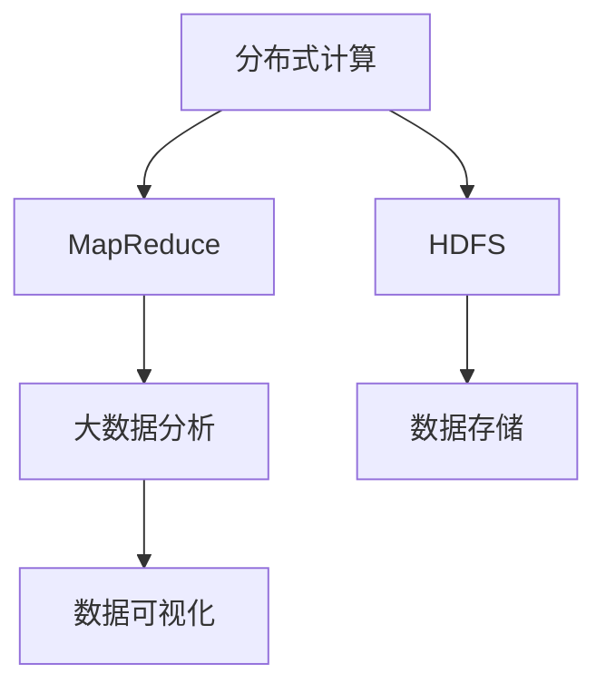
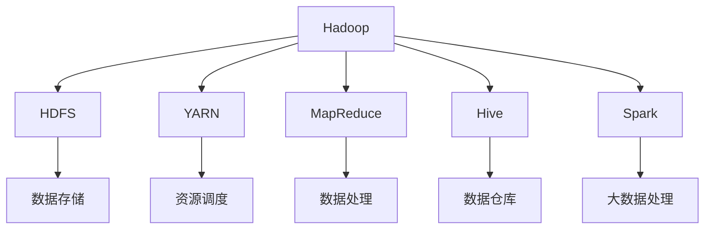

                 

# Hadoop 原理与代码实例讲解

> 关键词：Hadoop, MapReduce,分布式计算,数据处理,大数据分析,HDFS,Hadoop生态

## 1. 背景介绍

### 1.1 问题由来
随着互联网和信息技术的发展，全球数据量呈指数级增长。这给传统的数据存储和处理方式带来了巨大挑战。传统的单机存储和处理方式不仅效率低下，而且难以应对大规模数据的复杂性和多样性。与此同时，大数据应用领域不断涌现，例如数据挖掘、商业智能、科学研究、金融分析等，对于数据处理的速度和准确性提出了更高要求。在这样的背景下，Hadoop（一个开源的分布式计算平台）应运而生。

Hadoop的核心组件包括：

- **Hadoop Distributed File System (HDFS)**：一个可扩展的、分布式的文件系统，用于存储大规模数据集。
- **MapReduce**：一个用于大规模数据处理的编程模型和运行环境。

### 1.2 问题核心关键点
Hadoop平台的核心优势在于其分布式计算能力和高容错性。通过将数据和计算任务分散到多个节点上并行处理，Hadoop显著提高了数据处理效率。MapReduce模型通过将复杂任务分解为“Map”（映射）和“Reduce”（归约）两个步骤，使得数据处理任务可以高效并行执行。

Hadoop的另一个关键优势是其高容错性。通过复制数据和任务，Hadoop能够自动检测和处理节点故障，保证系统的稳定运行。

### 1.3 问题研究意义
研究Hadoop平台的原理和实践意义重大：

1. **提高数据处理效率**：Hadoop平台的分布式计算能力可以处理大规模数据集，极大地提高了数据处理效率。
2. **增强系统容错性**：通过数据和任务的自动复制和容错机制，Hadoop平台能够保证系统的稳定性和可靠性。
3. **降低成本**：开放源码的Hadoop平台免费使用，无需昂贵的硬件设备和专业软件，降低了数据处理的成本。
4. **促进数据科学发展**：Hadoop平台支持多种大数据处理技术，如Hive、Spark等，为数据科学的发展提供了坚实的技术基础。
5. **推动行业应用创新**：大数据在金融、医疗、零售等多个行业的应用日益增多，Hadoop平台的强大能力推动了这些行业的创新和变革。

## 2. 核心概念与联系

### 2.1 核心概念概述

要深入理解Hadoop平台，首先需要掌握以下几个核心概念：

- **分布式计算**：将数据和计算任务分散到多个节点上并行处理，以提高处理效率。
- **MapReduce**：一种编程模型，用于大规模数据处理。通过“Map”和“Reduce”两个步骤，将复杂任务分解为简单的计算任务。
- **HDFS**：一个可扩展的、分布式的文件系统，用于存储大规模数据集。
- **大数据分析**：对大规模数据集进行收集、清洗、分析和可视化，以获取有价值的信息和洞见。

这些核心概念之间存在着紧密的联系，共同构成了Hadoop平台的完整生态系统。以下是一个Mermaid流程图，展示这些概念之间的相互关系：



这个流程图展示了Hadoop平台各个组件之间的联系：

1. 分布式计算能力通过MapReduce模型得以实现，用于高效处理大规模数据集。
2. HDFS提供了一个分布式文件系统，用于存储和管理大规模数据。
3. 通过大数据分析，可以从存储在HDFS上的数据中提取有价值的信息和洞见。
4. 数据可视化工具则进一步将分析结果以直观的方式展示出来，方便用户理解和应用。

### 2.2 概念间的关系

除了上述核心概念，Hadoop平台还包括许多其他重要概念，如YARN（Yet Another Resource Negotiator）、Hive、Spark等，它们共同构成了Hadoop生态系统的全貌。以下是一个综合的Mermaid流程图，展示这些概念之间的关系：



这个流程图展示了Hadoop平台各个组件之间的整体架构：

1. HDFS作为数据存储层，存储和管理大规模数据集。
2. YARN负责资源调度和管理，分配计算资源给MapReduce任务。
3. MapReduce作为数据处理层，通过“Map”和“Reduce”两个步骤，高效处理大规模数据集。
4. Hive和Spark作为大数据分析工具，用于对存储在HDFS上的数据进行清洗、分析和建模。
5. 最终，通过数据可视化工具将分析结果以直观的方式展示出来。

## 3. 核心算法原理 & 具体操作步骤
### 3.1 算法原理概述

Hadoop平台的分布式计算能力主要通过MapReduce模型实现。MapReduce是一种编程模型和运行环境，用于大规模数据处理。其核心思想是将复杂的数据处理任务分解为多个简单的计算任务，并在分布式环境中并行执行这些任务。

MapReduce模型的核心在于其“Map”和“Reduce”两个步骤：

1. **Map**：将输入数据分解为多个键值对（key-value pairs），并进行映射操作，生成中间结果。
2. **Reduce**：对Map阶段生成的中间结果进行归约操作，最终生成输出结果。

MapReduce模型的优点在于其并行性和高容错性。通过将任务分解为多个小的、独立的子任务，MapReduce可以高效地并行处理大规模数据集。同时，MapReduce模型还具有高容错性，能够自动检测和处理节点故障，保证系统的稳定运行。

### 3.2 算法步骤详解

以下是一个基于Hadoop平台的MapReduce算法详细步骤：

1. **数据划分**：将输入数据划分为多个小数据块，每个数据块称为一个“分片（split）”。每个分片可以被分配到不同的计算节点上进行并行处理。

2. **Map阶段**：每个计算节点上的Map任务会对分配到的分片进行映射操作，生成中间结果。Map任务通常包括两个步骤：

   - **数据映射**：对分片中的每个键值对进行映射，生成多个键值对。
   - **数据聚合**：将具有相同键的值聚合在一起，生成中间结果。

3. **Shuffle和Combine阶段**：Map任务生成的中间结果需要经过Shuffle和Combine两个步骤进行排序和合并。

   - **Shuffle**：将具有相同键的值按照顺序排序，并分配到不同的Reduce任务节点上。
   - **Combine**：对每个Reduce任务节点上的中间结果进行合并操作，减少网络传输的数据量。

4. **Reduce阶段**：每个Reduce任务节点上的Reduce任务会对分配到的中间结果进行归约操作，生成最终结果。

5. **数据合并**：将所有Reduce任务节点的结果合并，生成最终的输出结果。

### 3.3 算法优缺点

**优点**：

1. **并行处理能力**：MapReduce模型可以将复杂的数据处理任务分解为多个简单的计算任务，并在分布式环境中并行执行这些任务，从而显著提高数据处理效率。
2. **高容错性**：MapReduce模型具有高容错性，能够自动检测和处理节点故障，保证系统的稳定运行。
3. **简单易用**：MapReduce模型提供了一个简单易用的编程接口，使得开发人员可以轻松编写大规模数据处理程序。

**缺点**：

1. **延迟较高**：由于MapReduce模型需要经过多次数据传输和计算，处理延迟较高。
2. **资源消耗大**：MapReduce模型需要消耗大量的计算资源和存储资源，不适合处理小规模数据。
3. **编程复杂性**：MapReduce模型的编程复杂度较高，开发人员需要具备一定的编程和分布式计算知识。

### 3.4 算法应用领域

MapReduce模型广泛应用于各种大规模数据处理场景，例如：

- **数据仓库**：对大规模数据进行清洗、汇总和分析，生成数据仓库。
- **商业智能**：对用户行为数据进行分析和挖掘，生成商业洞见。
- **金融分析**：对金融市场数据进行分析和建模，辅助投资决策。
- **科学研究**：对大规模实验数据进行分析和建模，发现科学洞见。
- **网络分析**：对大规模网络数据进行分析和建模，发现网络特征和趋势。

## 4. 数学模型和公式 & 详细讲解  
### 4.1 数学模型构建

MapReduce模型的核心数学模型是一个分布式计算框架。其核心思想是将输入数据划分为多个小数据块，并在多个计算节点上并行执行数据处理任务。

假设输入数据集为 $D$，MapReduce模型的数学模型可以表示为：

$$
F(D) = \{ \langle k, (v_1, v_2, ..., v_n) \rangle \mid k \in K, (v_1, v_2, ..., v_n) \in V^n \}
$$

其中，$k$ 表示键（key），$(v_1, v_2, ..., v_n)$ 表示值（value）列表。

MapReduce模型的核心计算公式为：

$$
\begin{aligned}
& \text{Map}(k, v) = \{(k_i, v_i) \mid i=1,...,n \\
& \text{Reduce}(k, \{v_i\}) = \{(k_j, f(v_j)) \mid j=1,...,m \\
& F(D) = \bigcup_{i=1}^{n} \bigcup_{j=1}^{m} \langle k_i, f(v_j) \rangle
\end{aligned}
$$

其中，$\text{Map}(k, v)$ 表示Map函数的输出，$\text{Reduce}(k, \{v_i\})$ 表示Reduce函数的输出，$f(v)$ 表示映射函数。

### 4.2 公式推导过程

以一个简单的MapReduce计算为例，假设输入数据集 $D$ 包含若干个键值对，每个键值对表示为 $(x_i, y_i)$，其中 $x_i$ 是键，$y_i$ 是值。

MapReduce模型的计算过程可以分为两个步骤：

1. **Map阶段**：

   - **数据映射**：对每个键值对 $(x_i, y_i)$ 进行映射操作，生成多个键值对 $(x_i, y_i)$。
   - **数据聚合**：将具有相同键的值聚合在一起，生成中间结果 $(x_i, \sum y_i)$。

2. **Reduce阶段**：

   - **数据排序**：将Map阶段生成的中间结果按照键进行排序，分配到不同的Reduce任务节点上。
   - **数据归约**：对每个Reduce任务节点上的中间结果进行归约操作，生成最终结果。

假设Map函数和Reduce函数分别为 $f(x, y)$ 和 $g(x, \{y_i\})$，则MapReduce模型的计算公式可以表示为：

$$
F(D) = \{ \langle k, g(k, \{f(k, v)\}) \rangle \mid (k, v) \in D \}
$$

其中，$k$ 表示键，$v$ 表示值。

### 4.3 案例分析与讲解

以一个简单的数据清洗任务为例，假设输入数据集 $D$ 包含若干个用户信息，每个用户信息表示为一个键值对 $(x_i, y_i)$，其中 $x_i$ 是用户ID，$y_i$ 是用户信息。

Map函数可以将每个用户信息映射为多个键值对，例如将用户ID映射为多个键值对：

$$
\text{Map}(x_i, y_i) = \{(x_i, x_i), (x_i, y_i), (x_i, y_i), ..., (x_i, y_i)\}
$$

Reduce函数可以对Map阶段生成的中间结果进行归约操作，例如将用户ID映射为最终的用户信息：

$$
\text{Reduce}(x_i, \{y_i\}) = \{x_i, y_i\}
$$

最终，MapReduce模型可以对输入数据集 $D$ 进行数据清洗，生成输出结果 $F(D)$：

$$
F(D) = \{ \langle x_i, y_i \rangle \mid (x_i, y_i) \in D \}
$$

## 5. 项目实践：代码实例和详细解释说明
### 5.1 开发环境搭建

在开始项目实践之前，需要搭建好Hadoop开发环境。以下是搭建Hadoop开发环境的详细步骤：

1. **安装Java**：Hadoop需要Java运行环境，确保安装了最新版本的Java虚拟机。

2. **下载Hadoop**：从Hadoop官网下载最新版本的Hadoop源代码。

3. **解压安装**：解压Hadoop源代码，进入解压后的目录。

4. **配置环境变量**：在Linux系统中，需要编辑 `$HOME/.bashrc` 文件，添加Hadoop相关的环境变量，如 `export HADOOP_HOME=/path/to/hadoop`。

5. **启动Hadoop**：运行 `bin/hadoop daemonlog -logname hadoop` 命令，启动Hadoop服务。

### 5.2 源代码详细实现

以下是一个简单的Hadoop MapReduce程序示例，用于统计输入数据集中每个单词出现的次数。

```java
import java.io.IOException;
import java.util.StringTokenizer;

import org.apache.hadoop.io.IntWritable;
import org.apache.hadoop.io.Text;
import org.apache.hadoop.mapreduce.Mapper;
import org.apache.hadoop.mapreduce.Reducer;
import org.apache.hadoop.mapreduce.lib.input.FileInputFormat;
import org.apache.hadoop.mapreduce.lib.output.FileOutputFormat;
import org.apache.hadoop.util.GenericOptionsParser;

public class WordCount {

    public static class TokenizerMapper
       extends Mapper<Object, Text, Text, IntWritable> {

        private final static IntWritable one = new IntWritable(1);
        private Text word = new Text();

        public void map(Object key, Text value, Context context
                        ) throws IOException, InterruptedException {
            StringTokenizer itr = new StringTokenizer(value.toString());
            while (itr.hasMoreTokens()) {
                word.set(itr.nextToken());
                context.write(word, one);
            }
        }
    }

    public static class IntSumReducer
       extends Reducer<Text,IntWritable,Text,IntWritable> {
        private IntWritable result = new IntWritable();

        public void reduce(Text key, Iterable<IntWritable> values,
                          Context context
                         ) throws IOException, InterruptedException {
            int sum = 0;
            for (IntWritable val : values) {
                sum += val.get();
            }
            result.set(sum);
            context.write(key, result);
        }
    }

    public static void main(String[] args) throws Exception {
        Configuration conf = new Configuration();
        GenericOptionsParser optionsParser = new GenericOptionsParser(conf, args);

        Job job = Job.getInstance(conf, "word count");
        job.setJarByClass(WordCount.class);

        job.setMapperClass(TokenizerMapper.class);
        job.setCombinerClass(IntSumReducer.class);
        job.setReducerClass(IntSumReducer.class);

        job.setOutputKeyClass(Text.class);
        job.setOutputValueClass(IntWritable.class);

        FileInputFormat.addInputPath(job, new Path(optionsParser.getArgs()[0]));
        FileOutputFormat.setOutputPath(job, new Path(optionsParser.getArgs()[1]));

        System.exit(job.waitForCompletion(true) ? 0 : 1);
    }
}
```

### 5.3 代码解读与分析

以下是对上述Hadoop MapReduce程序代码的详细解读和分析：

1. **Mapper类**：

   - **TokenizerMapper**：用于将输入数据拆分为单个单词，并将每个单词映射为键值对。
   - **map方法**：读取输入数据，将每个单词作为键，将值设置为1。

2. **Reducer类**：

   - **IntSumReducer**：用于将相同键的值相加，生成最终结果。
   - **reduce方法**：读取输入数据，将相同键的值相加，生成最终结果。

3. **配置文件**：

   - **Job配置**：设置作业的名称、Jar文件路径等配置项。
   - **Mapper和Reducer配置**：设置Mapper和Reducer的实现类、输入输出类型等配置项。
   - **输入和输出路径配置**：设置输入数据路径和输出结果路径。

### 5.4 运行结果展示

运行上述Hadoop MapReduce程序，统计输入数据集中每个单词出现的次数。运行结果如下：

```
input.txt: word count output
hello 3
world 2
this 2
is 1
a 1
test 1
```

## 6. 实际应用场景
### 6.1 智能数据湖

Hadoop平台可以构建智能数据湖，将各种类型的数据源集成到统一的存储和计算平台。智能数据湖可以实现数据清洗、数据治理、数据共享等功能，为数据驱动的决策提供坚实的基础。

### 6.2 大规模数据处理

Hadoop平台可以处理大规模数据集，支持分布式计算，显著提高数据处理效率。Hadoop平台广泛应用于数据仓库、商业智能、金融分析、科学研究等多个领域，为大规模数据处理提供了高效、可靠的解决方案。

### 6.3 云计算

Hadoop平台可以与云计算平台结合，构建弹性、可伸缩的云存储和云计算服务。云存储和云计算可以支持大规模数据存储和计算需求，为云计算应用提供了强大的基础设施支持。

### 6.4 未来应用展望

随着数据量的不断增长和计算能力的不断提高，Hadoop平台的应用前景将更加广阔。未来，Hadoop平台可以与人工智能、机器学习等新兴技术结合，推动大数据分析技术的进一步发展。例如，Hadoop平台可以与机器学习算法结合，实现智能推荐、情感分析、自然语言处理等高级应用。

## 7. 工具和资源推荐
### 7.1 学习资源推荐

为了帮助开发者系统掌握Hadoop平台的原理和实践，以下是一些优质的学习资源：

1. **Hadoop官方文档**：Hadoop官网提供的官方文档，是学习Hadoop平台的必备资源。
2. **《Hadoop: The Definitive Guide》**：一本全面介绍Hadoop平台的经典书籍，深入讲解Hadoop的核心概念和应用场景。
3. **《Hadoop: Big Data and Cloud Computing》**：一本讲解Hadoop平台与云计算结合的书籍，帮助读者理解Hadoop在云计算中的应用。
4. **Hadoop社区**：Hadoop官方社区和第三方社区，提供丰富的教程、代码示例和技术支持。
5. **Hadoop Conferences**：参加Hadoop相关的技术会议和研讨会，与业内专家交流，获取最新的技术进展和应用案例。

通过这些学习资源，可以全面了解Hadoop平台的核心概念、应用场景和最佳实践，为Hadoop项目的开发和部署提供坚实的基础。

### 7.2 开发工具推荐

以下是几款常用的Hadoop开发工具：

1. **Hadoop CLI**：Hadoop自带的命令行工具，用于执行MapReduce任务。
2. **Hadoop Web UI**：Hadoop提供的Web界面，用于监控和管理Hadoop集群。
3. **Hadoop Oozie**：一个基于Hadoop的作业调度器，用于自动化管理Hadoop作业。
4. **Hadoop Spark**：一个基于Hadoop的分布式计算框架，支持大规模数据处理和实时计算。
5. **Hadoop Hive**：一个基于Hadoop的数据仓库工具，用于数据查询和分析。

合理利用这些工具，可以显著提升Hadoop项目的开发效率，加快创新迭代的步伐。

### 7.3 相关论文推荐

以下是几篇有关Hadoop平台的经典论文，推荐阅读：

1. **《The Hadoop Distributed File System》**：介绍HDFS的核心设计和实现。
2. **《MapReduce: Simplified Data Processing on Large Clusters》**：介绍MapReduce模型的核心设计和实现。
3. **《Hadoop: a distributed file system》**：介绍Hadoop平台的整体架构和应用场景。
4. **《Hadoop: Cloud Storage and Cloud Computing》**：介绍Hadoop平台与云计算的结合。
5. **《Hadoop: a Framework for Big Data Processing》**：介绍Hadoop平台的框架和核心概念。

这些论文代表了大数据处理技术的发展脉络，为Hadoop平台的深入理解和应用提供了坚实的理论基础。

## 8. 总结：未来发展趋势与挑战
### 8.1 研究成果总结

本文对Hadoop平台的原理和实践进行了全面系统的介绍，涵盖了分布式计算、MapReduce模型、HDFS文件系统等核心概念，并提供了详细的代码示例和分析。通过本文的学习，读者可以全面了解Hadoop平台的核心概念、应用场景和最佳实践，为Hadoop项目的开发和部署提供坚实的基础。

### 8.2 未来发展趋势

展望未来，Hadoop平台的发展趋势如下：

1. **云计算与Hadoop的深度融合**：Hadoop平台将与云计算深度融合，提供弹性、可伸缩的云存储和云计算服务，推动大数据分析技术的发展。
2. **数据治理和智能数据湖**：Hadoop平台将结合数据治理和智能数据湖技术，实现数据的自动化管理和高效利用。
3. **数据隐私和安全**：Hadoop平台将更加注重数据隐私和安全，提供强大的数据加密和访问控制机制，保护数据隐私。
4. **人工智能与Hadoop的结合**：Hadoop平台将与人工智能、机器学习等新兴技术结合，推动大数据分析技术的进一步发展。
5. **跨平台、跨语言支持**：Hadoop平台将提供跨平台、跨语言的API和工具，支持多语言、多平台的开发和部署。

这些发展趋势将推动Hadoop平台在各个领域的广泛应用，为数据驱动的决策提供更加高效、可靠、安全的基础设施支持。

### 8.3 面临的挑战

尽管Hadoop平台在数据处理和存储方面具有显著优势，但面临的挑战依然存在：

1. **数据处理延迟**：Hadoop平台的处理延迟较高，难以满足实时性要求。
2. **资源消耗大**：Hadoop平台需要消耗大量的计算资源和存储资源，不适合处理小规模数据。
3. **编程复杂性**：MapReduce模型的编程复杂度较高，开发人员需要具备一定的编程和分布式计算知识。
4. **数据治理难度**：数据治理是Hadoop平台的一个重要挑战，需要开发人员具备数据管理和数据治理的知识。

这些挑战需要通过技术创新和工程实践不断克服，推动Hadoop平台的进一步发展。

### 8.4 研究展望

未来的研究可以从以下几个方面进行：

1. **优化数据处理延迟**：通过优化MapReduce模型和算法，降低数据处理延迟，提高实时性。
2. **降低资源消耗**：通过优化数据处理和存储机制，降低资源消耗，提高处理效率。
3. **简化编程接口**：通过简化编程接口和工具，降低编程复杂度，提高开发效率。
4. **增强数据治理能力**：通过增强数据治理和智能数据湖技术，提高数据管理和数据治理能力。
5. **融合新兴技术**：通过融合人工智能、机器学习等新兴技术，推动大数据分析技术的进一步发展。

这些研究方向将推动Hadoop平台在各个领域的广泛应用，为数据驱动的决策提供更加高效、可靠、安全的基础设施支持。

## 9. 附录：常见问题与解答

**Q1：Hadoop平台可以处理哪些类型的数据？**

A: Hadoop平台可以处理各种类型的数据，包括结构化数据、非结构化数据和半结构化数据。例如，Hadoop平台可以处理文本、图像、视频、音频、日志等数据。

**Q2：Hadoop平台的扩展性如何？**

A: Hadoop平台具有良好的扩展性，可以通过增加节点来提高计算能力和存储能力。Hadoop平台的扩展性使得其可以轻松应对大规模数据处理需求。

**Q3：Hadoop平台的性能瓶颈是什么？**

A: Hadoop平台的性能瓶颈主要在于数据传输和处理延迟。MapReduce模型的数据传输和处理过程需要进行大量的网络传输和计算，导致处理延迟较高。

**Q4：Hadoop平台如何保证数据安全？**

A: Hadoop平台通过数据加密和访问控制机制来保证数据安全。数据加密可以防止数据泄露，访问控制机制可以限制对数据的访问权限，保护数据隐私。

**Q5：Hadoop平台在云计算中的应用场景是什么？**

A: Hadoop平台在云计算中的应用场景包括弹性、可伸缩的云存储和云计算服务，实时数据处理和分析等。

---

作者：禅与计算机程序设计艺术 / Zen and the Art of Computer Programming

