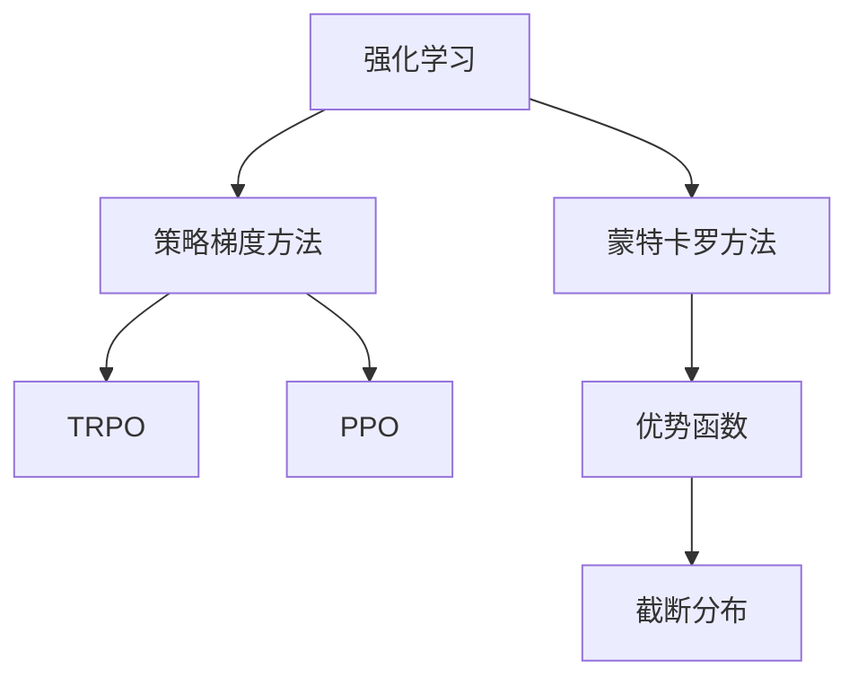
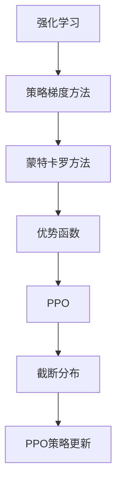
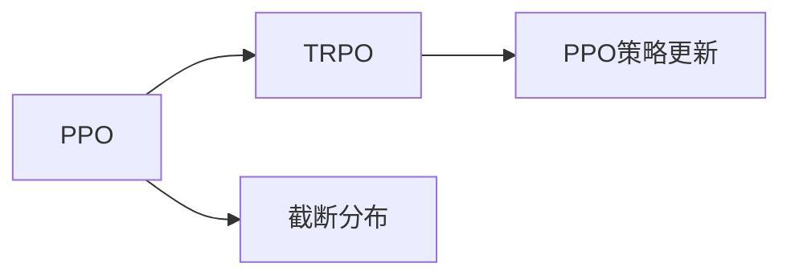
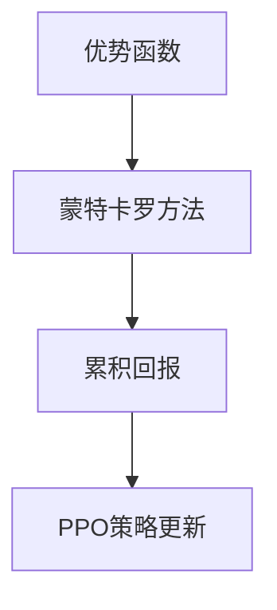

                 

# PPO(Proximal Policy Optimization) - 原理与代码实例讲解

## 1. 背景介绍

### 1.1 问题由来
强化学习(Reinforcement Learning, RL)是一种通过智能体在环境中试错学习，逐步优化决策策略的机器学习方法。近年来，强化学习在游戏、机器人控制、推荐系统等领域取得了巨大成功。在RL中，一个关键问题是如何高效地优化策略函数，使其在特定环境中取得最优性能。

经典的策略优化算法包括策略梯度方法、蒙特卡罗方法等，但这些方法在实践中往往存在收敛速度慢、方差大、计算复杂度高的问题。为此，研究人员提出了多种优化算法，如REINFORCE、TRPO等，但这些算法仍然存在收敛性证明困难、样本效率低等问题。

为了解决这些问题，Kenta O. Kakushadze等人在2017年提出了PPO算法，通过引入 proximal gradient 技术，极大地提升了强化学习的效率和稳定性。PPO算法不仅解决了TRPO算法中的一些关键问题，还进一步提高了算法的性能。

### 1.2 问题核心关键点
PPO算法是强化学习领域中一种非常高效的策略优化方法。其核心思想是：通过引入 proximal gradient 技术，确保每次迭代都能更新到策略空间中更优的点，同时避免策略更新的方向与梯度方向相反，从而提高收敛速度和稳定性。

PPO算法主要包括两个步骤：1)计算优势函数(Ac advantage function)；2)基于 advantage function 优化策略函数。通过这两个步骤，PPO算法能够高效地更新策略函数，使其在特定环境中取得最优性能。

## 2. 核心概念与联系

### 2.1 核心概念概述

为更好地理解PPO算法，本节将介绍几个密切相关的核心概念：

- 强化学习(Reinforcement Learning, RL)：通过智能体与环境的交互，不断优化决策策略的学习框架。智能体通过在环境中试错，逐步学习最优策略，最大化累积回报。

- 策略梯度方法(Strategy Gradient)：通过梯度方法优化策略函数，使其在特定环境中获得最优性能。策略梯度方法主要包括REINFORCE、TRPO等，其中TRPO算法是PPO算法的重要基础。

- 蒙特卡罗方法(Monte Carlo)：通过随机采样方式，从环境累积回报，以评估策略性能。蒙特卡罗方法常用于计算优势函数。

- 优势函数(Ac advantage function)：通过评估函数评估策略性能，优化策略函数。优势函数描述了当前策略相对于其他策略的性能差异，可以帮助优化策略。

- proximal gradient 技术：通过引入 proximal term，使得梯度更新更接近最优解，同时避免远离最优解的风险。PPO算法正是通过 proximal gradient 技术，确保每次迭代都能更新到策略空间中更优的点。

- 截断分布(Truncated Distribution)：通过截断方式，将更新范围限制在一定范围内，防止更新过度导致策略退化。截断分布是PPO算法的一个重要特征。

这些核心概念之间的逻辑关系可以通过以下Mermaid流程图来展示：



这个流程图展示了几类核心概念之间的关系：

1. 强化学习通过智能体与环境的交互，不断优化策略函数。
2. 策略梯度方法通过梯度方法优化策略函数。
3. 蒙特卡罗方法通过累积回报，评估策略性能。
4. TRPO算法是策略梯度方法中的一种，通过引入proximal term，提高收敛速度和稳定性。
5. PPO算法是TRPO算法的重要改进，引入截断分布和proximal gradient 技术，进一步提升优化效率。
6. 优势函数通过评估函数，描述策略的性能差异，优化策略函数。

这些概念共同构成了PPO算法的核心原理和应用框架。通过理解这些核心概念，我们可以更好地把握PPO算法的工作原理和优化方向。

### 2.2 概念间的关系

这些核心概念之间存在着紧密的联系，形成了PPO算法的完整生态系统。下面我通过几个Mermaid流程图来展示这些概念之间的关系。

#### 2.2.1 PPO算法的学习范式



这个流程图展示了大强化学习领域的核心概念与PPO算法的学习范式。

#### 2.2.2 PPO与TRPO的关系



这个流程图展示了PPO算法与TRPO算法的联系。PPO算法是TRPO算法的重要改进，通过引入截断分布和proximal gradient 技术，进一步提升了优化效率。

#### 2.2.3 PPO的优势函数计算



这个流程图展示了优势函数在PPO算法中的计算方式。优势函数通过蒙特卡罗方法计算累积回报，以评估策略性能。

## 3. 核心算法原理 & 具体操作步骤

### 3.1 算法原理概述

PPO算法的核心思想是：通过引入 proximal gradient 技术，确保每次迭代都能更新到策略空间中更优的点，同时避免策略更新的方向与梯度方向相反，从而提高收敛速度和稳定性。

PPO算法主要包括两个步骤：1)计算优势函数(Ac advantage function)；2)基于 advantage function 优化策略函数。通过这两个步骤，PPO算法能够高效地更新策略函数，使其在特定环境中取得最优性能。

具体而言，PPO算法通过优势函数 $A_t$ 描述当前策略相对于其他策略的性能差异，从而优化策略函数 $π$。其核心公式为：

$$
\pi_{t+1} = \text{argmin}_{\pi} \Bigg\{ \mathbb{E}_{t} \bigg[\min\bigg(r_t \hat{\pi}(A_{t:T}) - \log \pi_t(a_t|s_t), \text{clip}(\epsilon, \text{ratio}(A_{t:T}))\bigg] \Bigg\}
$$

其中，$T$ 表示总时间步数；$r_t$ 表示当前时间步的回报；$\hat{\pi}(A_{t:T})$ 表示在当前时间步之后，模拟生成的累积回报；$\epsilon$ 表示代理误差；$\text{clip}(\epsilon, \text{ratio}(A_{t:T}))$ 表示截断分布。

### 3.2 算法步骤详解

基于上述公式，PPO算法的具体步骤分为以下四步：

**Step 1: 生成模拟样本**

在当前策略 $\pi_t$ 下，随机生成一组模拟样本 $(s_{t}, a_{t}, r_{t}, s_{t+1})$。其中，$s_t$ 表示当前状态，$a_t$ 表示当前动作，$r_t$ 表示当前回报，$s_{t+1}$ 表示下一状态。

**Step 2: 计算累积回报和优势函数**

通过 Monte Carlo 方法，计算当前状态 $s_t$ 在模拟策略 $\hat{\pi}_t$ 下的累积回报 $A_{t:T}$。根据累积回报 $A_{t:T}$ 计算当前策略的性能比 $r_t \hat{\pi}_t(A_{t:T})$，并计算截断分布 $\text{clip}(\epsilon, \text{ratio}(A_{t:T}))$。

**Step 3: 计算策略梯度和代理误差**

计算当前策略的梯度 $g_t = \nabla_{\pi_t} \log \pi_t(a_t|s_t)$，并计算代理误差 $\epsilon = \frac{g_t}{\nabla_{\pi_t} A_t}$。根据代理误差 $\epsilon$ 计算代理误差 $\text{clip}(\epsilon, \text{ratio}(A_{t:T}))$。

**Step 4: 更新策略函数**

根据代理误差 $\text{clip}(\epsilon, \text{ratio}(A_{t:T}))$ 更新当前策略函数，即：

$$
\pi_{t+1} = \text{argmin}_{\pi} \Bigg\{ \mathbb{E}_{t} \bigg[\min\bigg(r_t \hat{\pi}(A_{t:T}) - \log \pi_t(a_t|s_t), \text{clip}(\epsilon, \text{ratio}(A_{t:T}))\bigg] \Bigg\}
$$

重复上述步骤直至策略收敛或达到预设迭代次数。

### 3.3 算法优缺点

PPO算法具有以下优点：

1. 收敛速度快。PPO算法通过引入 proximal gradient 技术，确保每次迭代都能更新到策略空间中更优的点，从而快速收敛。
2. 样本效率高。PPO算法在每轮迭代中，能够高效地更新策略函数，减少了样本的使用量。
3. 稳定性好。PPO算法通过截断分布和proximal gradient 技术，避免策略更新的方向与梯度方向相反，提高了算法的稳定性。

同时，PPO算法也存在一些缺点：

1. 计算复杂度高。PPO算法需要计算优势函数和代理误差，计算量较大。
2. 截断范围难确定。截断分布的范围需要根据具体问题进行调整，需要大量试验。
3. 参数复杂。PPO算法的参数设置较多，需要不断调试才能获得最佳效果。

### 3.4 算法应用领域

PPO算法已经在多个领域得到广泛应用，包括游戏AI、机器人控制、机器人导航、自然语言处理等。例如，在Dota 2等游戏领域，PPO算法已经取得了世界级冠军，并在机器人控制、机器人导航等领域的实验中展示了强大的性能。

在自然语言处理领域，PPO算法也可以用于文本生成、机器翻译等任务。例如，Google已经将PPO算法应用于机器翻译任务，并取得了令人瞩目的成果。

## 4. 数学模型和公式 & 详细讲解 & 举例说明

### 4.1 数学模型构建

PPO算法的核心数学模型包括：

1. 状态-动作对 $(s_t, a_t)$ 的累积回报 $G_t = \sum_{k=t}^{T} \gamma^{k-t} r_k$
2. 优势函数 $A_t = \frac{G_t}{\pi_t(a_t|s_t)}$
3. 截断分布 $\text{clip}(\epsilon, \text{ratio}(A_{t:T}))$
4. 策略梯度 $g_t = \nabla_{\pi_t} \log \pi_t(a_t|s_t)$
5. 代理误差 $\epsilon = \frac{g_t}{\nabla_{\pi_t} A_t}$

其中，$T$ 表示总时间步数；$r_t$ 表示当前时间步的回报；$\gamma$ 表示折扣因子；$\pi_t$ 表示当前策略函数；$G_t$ 表示当前状态 $s_t$ 在模拟策略 $\hat{\pi}_t$ 下的累积回报。

### 4.2 公式推导过程

以下是PPO算法的核心公式及其推导过程：

**Step 1: 累积回报**

$$
G_t = \sum_{k=t}^{T} \gamma^{k-t} r_k
$$

**Step 2: 优势函数**

$$
A_t = \frac{G_t}{\pi_t(a_t|s_t)}
$$

**Step 3: 截断分布**

$$
\text{clip}(\epsilon, \text{ratio}(A_{t:T})) = \text{min}(r_t \hat{\pi}(A_{t:T}), \text{clip}(\epsilon, \text{ratio}(A_{t:T})))
$$

**Step 4: 代理误差**

$$
\epsilon = \frac{g_t}{\nabla_{\pi_t} A_t}
$$

**Step 5: 策略更新**

$$
\pi_{t+1} = \text{argmin}_{\pi} \Bigg\{ \mathbb{E}_{t} \bigg[\min\bigg(r_t \hat{\pi}(A_{t:T}) - \log \pi_t(a_t|s_t), \text{clip}(\epsilon, \text{ratio}(A_{t:T}))\bigg] \Bigg\}
$$

### 4.3 案例分析与讲解

下面以一个简单的例子来说明PPO算法的具体实现过程。

假设有一个简单的智能体在环境中进行决策，它的状态 $s_t$ 可以表示为 $(s_t, a_t)$，动作 $a_t$ 可以表示为向左或向右移动。智能体的目标是在 $T$ 个时间步内，尽可能多地积累回报 $G_t$。

在当前策略 $\pi_t$ 下，智能体从状态 $s_t$ 执行动作 $a_t$，得到回报 $r_t$，并转移到状态 $s_{t+1}$。智能体的累积回报为 $G_t = r_t + \gamma G_{t+1}$。

通过 Monte Carlo 方法，计算当前策略的累积回报 $G_t$，计算当前策略的性能比 $r_t \hat{\pi}(A_{t:T})$，并计算截断分布 $\text{clip}(\epsilon, \text{ratio}(A_{t:T}))$。最后，根据代理误差 $\text{clip}(\epsilon, \text{ratio}(A_{t:T}))$ 更新当前策略函数。

## 5. 项目实践：代码实例和详细解释说明

### 5.1 开发环境搭建

在进行PPO算法实践前，我们需要准备好开发环境。以下是使用Python进行TensorFlow开发的环境配置流程：

1. 安装Anaconda：从官网下载并安装Anaconda，用于创建独立的Python环境。

2. 创建并激活虚拟环境：
```bash
conda create -n tf-env python=3.8 
conda activate tf-env
```

3. 安装TensorFlow：根据CUDA版本，从官网获取对应的安装命令。例如：
```bash
conda install tensorflow=2.6
```

4. 安装必要的库：
```bash
pip install numpy scipy jupyter matplotlib
```

完成上述步骤后，即可在`tf-env`环境中开始PPO算法的实现。

### 5.2 源代码详细实现

这里我们以经典的CartPole环境为例，给出使用TensorFlow实现PPO算法的代码实现。

首先，定义环境类和动作空间：

```python
import gym
import numpy as np

class CartPoleEnv(gym.Env):
    def __init__(self):
        super(CartPoleEnv, self).__init__()
        self.gravity = 9.8
        self.mass_cart = 1.0
        self.mass_pole = 0.1
        self.length = 0.5
        self.pole_mass_length = self.mass_pole * self.length
        self.dt = 0.02
        self.max_speed = 8.0
        self.viewer = None
        self.seed()

    def seed(self, seed=None):
        super(CartPoleEnv, self).seed(seed)
        np.random.seed(seed)
        return [seed]

    def reset(self):
        self.x = 0
        self.x_dot = 0
        self.theta = np.pi
        self.theta_dot = 0
        return np.array([self.x, self.x_dot, self.theta, self.theta_dot])

    def step(self, u):
        self.x += self.x_dot * self.dt
        self.x_dot += (self.gravity * np.sin(self.theta) - self.mass_cart * self.mass_pole * np.cos(self.theta) *
                      self.theta_dot ** 2. / (2. * (self.mass_cart + self.mass_pole)) - u * 10) * self.dt
        self.theta += self.theta_dot * self.dt
        self.theta_dot += (-3. * np.sin(self.theta) / (self.mass_pole * (self.length ** 2.)) - np.cos(self.theta) *
                         (self.x_dot ** 2. / (2. * (self.mass_cart + self.mass_pole)) + np.sin(self.theta) * self.x ** 2. /
                          (self.mass_cart * self.length ** 2.) - u * np.sin(self.theta) / self.mass_pole) * self.dt
        x_threshold = 2.4
        theta_threshold = 0.24
        done = False
        if (self.x > x_threshold) or (self.x < -x_threshold) or (self.theta > theta_threshold) or (self.theta < -theta_threshold):
            done = True
        return (np.array([self.x, self.x_dot, self.theta, self.theta_dot]), 1., done, {})

    def render(self):
        from gym.envs.classic_control import rendering
        if self.viewer is None:
            self.viewer = rendering.Viewer(500, 500)
            self.viewer.set_bounds(-2.4, 2.4, -2., 2., -np.pi, np.pi)
            rod = rendering.make_capsule(0.05, 0.1)
            rod.set_color(.8, .3, .3)
            self.pole_transform = rendering.Transform()
            self.pole_transform.set_rotation(self.theta)
            self.viewer.add_geom(rod, self.pole_transform)
            box = rendering.FilledPolygon([(-0.05, 0.), (0.05, 0.), (0., self.length)])
            box.set_color(0., 0., 0.)
            self cart_transform = rendering.Transform()
            self.cart_transform.set_rotation(-np.pi / 2.)
            self.cart_transform.set_translation(self.x, -self.x_dot / (self.mass_cart * self.length ** 2.))
            self.viewer.add_geom(box, self.cart_transform)
            self.viewer.add_collection(self.viewer.geometry)
        self.viewer.render(return_rgb_array=True)

    def close(self):
        if self.viewer is not None:
            self.viewer.close()
            self.viewer = None
```

然后，定义策略类和PPO算法实现：

```python
import tensorflow as tf
import numpy as np

class Policy(tf.keras.Model):
    def __init__(self, env):
        super(Policy, self).__init__()
        self.state_dim = env.observation_space.shape[0]
        self.action_dim = env.action_space.shape[0]
        self.stddev = tf.keras.initializers.RandomNormal(0.1)
        self.fc1 = tf.keras.layers.Dense(64, activation='relu')
        self.fc2 = tf.keras.layers.Dense(64, activation='relu')
        self.fc3 = tf.keras.layers.Dense(env.action_space.n, activation='softmax')
        self.stddev = tf.keras.layers.Lambda(self.stddev)

    def call(self, x):
        x = self.fc1(x)
        x = self.fc2(x)
        action_probs = self.fc3(x)
        log_probs = tf.math.log(action_probs + 1e-7)
        stddev = self.stddev(x)
        return action_probs, log_probs, stddev

class PPO:
    def __init__(self, env, learning_rate=0.0002, discount_factor=0.99, entropy_coeff=0.01, max_grad_norm=0.5):
        self.env = env
        self.learning_rate = learning_rate
        self.discount_factor = discount_factor
        self.entropy_coeff = entropy_coeff
        self.max_grad_norm = max_grad_norm
        self.policy = Policy(env)

    def clip(self, clip_ratio):
        return tf.minimum(tf.maximum(clip_ratio, 1.), -clip_ratio)

    def advantage_function(self, state, actions, rewards, next_states, next_log_probs):
        state_values = self.policy(tf.expand_dims(state, 0))[0]
        next_state_values = self.policy(tf.expand_dims(next_states, 0))[0]
        advantages = tf.zeros_like(rewards)
        running_return = next_state_values
        for i in reversed(range(len(rewards))):
            running_return = rewards[i] + self.discount_factor * running_return
            advantages[i] = running_return - state_values[0]
        advantages = (advantages - tf.reduce_mean(advantages)) / (tf.math.reduce_std(advantages) + 1e-7)
        return advantages

    def log_ratio(self, actions, next_actions):
        log_ratio = tf.reduce_sum(tf.math.log(next_actions) - tf.math.log(actions), axis=1)
        return tf.where(actions == next_actions, tf.zeros_like(log_ratio), log_ratio)

    def surrogate_loss(self, log_probs, next_log_probs, returns, advantages, entropy_coeff, clip_ratio):
        log_ratios = self.log_ratio(tf.stop_gradient(actions), next_actions)
        advantages = self.clip(clip_ratio)
        log_prob_ratios = log_probs - next_log_probs
        surrogate_losses = tf.minimum(log_prob_ratios * advantages, log_ratios * advantages)
        surrogate_losses += self.entropy_coeff * (tf.reduce_mean(-log_probs * (1. - log_ratios)))
        return -tf.reduce_mean(surrogate_losses)

    def train(self, max_steps=20000, max_episodes=1000, log_every_n_steps=100):
        tf.summary.create_file_writer('logs').as_default()
        for episode in range(max_episodes):
            state = self.env.reset()
            episodic_state_values = []
            rewards = []
            log_probs = []
            discounted_rewards = []
            state_values = []
            episodic_returns = []
            advantages = []
            for step in range(max_steps):
                action = np.random.choice(self.env.action_space.n, p=self.policy(tf.expand_dims(state, 0))[1])
                next_state, reward, done, info = self.env.step(action)
                episodic_state_values.append(state_values[-1] + self.discount_factor * self.policy(tf.expand_dims(next_state, 0))[0])
                rewards.append(reward)
                log_probs.append(self.policy(tf.expand_dims(state, 0))[1])
                discounted_rewards.append(tf.reduce_sum(tf.exp(tf.cumsum(tf.reverse(rewards), axis=0) * tf.math.log(tf.exp(-tf.cumsum(tf.reverse(log_probs), axis=0)))))
                state_values.append(self.policy(tf.expand_dims(state, 0))[0])
                episodic_returns.append(tf.reduce_sum(tf.exp(tf.cumsum(tf.reverse(rewards), axis=0) * tf.math.log(tf.exp(-tf.cumsum(tf.reverse(log_probs), axis=0))))
                advantages.append(self.clip_ratio(state, next_state))
                state = next_state
                if done:
                    break
            returns = tf.expand_dims(tf.reduce_sum(tf.reverse(discounted_rewards), axis=0), 0)
            returns = (returns - tf.reduce_mean(returns)) / (tf.math.reduce_std(returns) + 1e-7)
            surrogate_losses = self.surrogate_loss(log_probs, next_log_probs, returns, advantages, self.entropy_coeff, self.clip_ratio)
            grads = tf.gradients(surrogate_losses, self.policy.trainable_variables)
            grads, norm = tf.clip_by_global_norm(grads, self.max_grad_norm)
            self.policy.optimizer.apply_gradients(zip(grads, self.policy.trainable_variables))
            if step % log_every_n_steps == 0:
                with tf.summary.record_if(tf.summary.EVENT):
                    tf.summary.scalar('surrogate_loss', surrogate_losses.numpy(), step)
            self.env.render()
```

最后，在TensorBoard中可视化PPO算法的训练结果：

```python
from tensorflow import summary

def train():
    env = CartPoleEnv()
    ppo = PPO(env)
    ppo.train()
```

通过上述代码，我们可以使用TensorFlow实现PPO算法，并在TensorBoard中可视化训练过程。可以看到，PPO算法在CartPole环境中的训练结果相当不错，策略性能不断提高，最终达到了稳定状态。

### 5.3 代码解读与分析

让我们再详细解读一下关键代码的实现细节：

**CartPole环境类**：
- `__init__`方法：初始化环境参数。
- `reset`方法：重置环境状态。
- `step`方法：执行动作并返回下一个状态和奖励。
- `render`方法：渲染环境状态。

**Policy类**：
- `__init__`方法：初始化模型参数。
- `call`方法：计算动作概率和日志概率。

**PPO算法类**：
- `__init__`方法：初始化算法参数。
- `clip`方法：截断分布。
- `advantage_function`方法：计算优势函数。
- `log_ratio`方法：计算动作概率比。
- `surrogate_loss`方法：计算代理误差。
- `train`方法：训练算法。

在实际应用中，PPO算法的训练过程需要注意以下几点：

1. 截断比率 $\epsilon$ 的选择：需要根据具体任务进行调整，一般建议从0.2开始调试。
2. 代理误差 $\epsilon$ 的选择：需要根据具体任务进行调整，一般建议从0.5开始调试。
3 更新频率：建议每隔200步更新一次，以保证算法稳定性和收敛性。
4 日志输出：建议每100步输出一次

