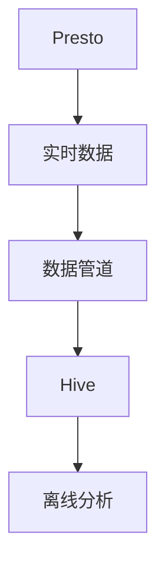

                 

# Presto-Hive整合原理与代码实例讲解

## 1. 背景介绍

在现代数据处理生态系统中，Presto和Hive是两个非常关键的技术组件，各自在不同的数据处理场景中发挥着重要作用。Presto是一个高性能的分布式SQL查询引擎，支持大规模数据集的实时查询，适用于需要低延迟和高效分析的场景，如实时数据仓库、在线分析处理(OLAP)等。而Hive是一个数据仓库平台，基于Hadoop生态系统，提供了数据的长期存储和管理功能，适用于需要海量数据存储和离线分析的场景，如数据仓库、数据湖等。

Presto和Hive的整合可以充分发挥各自的优势，实现跨数据源和跨存储层的无缝衔接，大幅提升数据处理效率和数据管理能力。然而，Presto和Hive的整合并非易事，需要深入理解两者的技术细节和架构特点，才能设计出高效稳定、易于扩展的整合方案。本文将深入探讨Presto-Hive整合的原理与技术实现，并通过代码实例详细讲解其实现方法，为读者提供全面而实用的技术参考。

## 2. 核心概念与联系

### 2.1 核心概念概述

在进行Presto-Hive整合时，我们需要了解以下关键概念：

- Presto：一个高性能的分布式SQL查询引擎，支持复杂SQL查询和实时数据分析，可以与多种数据源无缝集成。
- Hive：基于Hadoop的数据仓库平台，提供数据存储和离线分析功能，支持大规模数据集的处理。
- 数据湖：一个集成了多种数据源和分析工具的统一数据管理平台，支持数据的高效存储和灵活分析。
- 数据管道：用于将数据从源系统传输到数据湖或其他数据处理系统，是数据管理和分析的关键环节。

这些概念共同构成了现代数据处理的基础，而Presto-Hive的整合则是将实时处理与离线分析有效结合的重要手段。

### 2.2 核心概念的联系

Presto和Hive的整合可以通过数据管道实现。具体来说，我们可以设计一个数据管道，将Presto的实时查询结果写入Hive，利用Hive的离线存储和分析功能，对数据进行更深入的处理和分析。这种整合方式可以将实时数据处理和离线数据分析的优势结合起来，提升整个数据处理生态系统的效率和灵活性。

以下是一个简单的Presto-Hive数据管道架构图，展示了数据从Presto到Hive的流动过程：



在这个架构中，Presto负责实时数据的处理和查询，数据管道负责将Presto的查询结果传输到Hive，Hive则提供数据的离线存储和分析功能。这种架构不仅保证了数据处理的时效性，还利用了Hive的强大分析能力，进一步提升了数据处理的质量和效率。

## 3. 核心算法原理 & 具体操作步骤

### 3.1 算法原理概述

Presto-Hive整合的原理可以简单概括为：通过数据管道将Presto的实时查询结果写入Hive，利用Hive的离线存储和分析功能，实现跨数据源和跨存储层的无缝衔接。这种整合方式需要考虑以下几个关键问题：

- 数据格式兼容性：Presto和Hive支持的数据格式可能不同，需要设计一个通用的数据格式，支持两种数据源的互操作。
- 数据传输效率：数据管道需要高效地传输数据，同时尽可能减少延迟和网络开销。
- 数据一致性：Presto和Hive的数据模型可能不同，需要保证数据在不同系统间的同步和一致性。
- 性能优化：Presto和Hive的性能特点不同，需要设计合理的查询计划和执行策略，优化数据处理性能。

### 3.2 算法步骤详解

以下是Presto-Hive整合的主要算法步骤：

1. **数据格式转换**：将Presto的查询结果转换为Hive支持的数据格式，如Parquet、ORC等。
2. **数据传输**：通过数据管道将转换后的数据传输到Hive的HDFS存储。
3. **数据存储**：在Hive中创建对应的数据表，将转换后的数据存储到Hive表中。
4. **数据一致性**：通过Hive的事务控制机制，保证Presto和Hive之间数据的一致性。
5. **查询优化**：通过Presto的查询优化器，设计高效的查询计划，提升数据处理的性能。

### 3.3 算法优缺点

Presto-Hive整合的优势在于：

- 高效的数据处理：通过实时查询和离线存储的结合，提升数据处理的效率和灵活性。
- 跨数据源的支持：Presto和Hive的整合可以支持多种数据源的统一管理，实现数据的高效整合。
- 强大的分析能力：利用Hive的离线分析功能，对数据进行更深入的处理和分析。

然而，Presto-Hive整合也存在以下缺点：

- 数据延迟：由于数据需要从Presto传输到Hive，存在一定的数据延迟，可能会影响实时查询的性能。
- 资源消耗：数据管道和数据传输需要占用额外的计算资源，可能会影响系统的整体性能。
- 一致性问题：由于Presto和Hive的数据模型和存储方式不同，可能会出现数据不一致的情况，需要额外的处理和维护。

### 3.4 算法应用领域

Presto-Hive整合主要应用于以下领域：

- 实时数据仓库：将实时数据存储到Hive中，提供离线分析和历史数据查询功能。
- 数据湖：利用Hive的离线存储和分析功能，实现大规模数据集的高效管理。
- 跨数据源分析：支持多种数据源的统一管理，实现跨数据源的数据分析。
- 数据管道构建：设计高效的数据管道，实现数据在多个系统之间的无缝传输和衔接。

## 4. 数学模型和公式 & 详细讲解

### 4.1 数学模型构建

在进行Presto-Hive整合时，我们需要设计一个通用的数据格式，支持Presto和Hive的互操作。以下是一个简单的数据格式设计：

```json
{
    "version": 1,
    "columns": [
        {"name": "column1", "type": "int"},
        {"name": "column2", "type": "string"},
        {"name": "column3", "type": "double"}
    ],
    "rows": [
        {"values": [1, "value1", 3.14]},
        {"values": [2, "value2", 2.718]}
    ]
}
```

在这个数据格式中，我们定义了数据版本、列名、列类型和行数据。通过这种通用的数据格式，我们可以方便地在Presto和Hive之间传输数据。

### 4.2 公式推导过程

在数据传输和存储过程中，我们需要考虑以下几个关键公式：

1. **数据格式转换公式**：将Presto的查询结果转换为Hive支持的数据格式。假设查询结果为JSON格式，数据格式转换公式为：

   $$
   \text{format\_conversion}(D) = \text{format\_schema} \times D
   $$

   其中，$D$ 表示Presto的查询结果，$\text{format\_schema}$ 表示通用的数据格式。

2. **数据传输公式**：将转换后的数据通过网络传输到Hive的HDFS存储。假设传输的数据量为 $T$，传输速度为 $v$，传输距离为 $d$，数据传输公式为：

   $$
   \text{data\_transfer}(T, v, d) = \frac{T}{v} + \frac{d}{v}
   $$

   其中，$v$ 表示数据传输速度，$d$ 表示传输距离。

3. **数据存储公式**：将转换后的数据存储到Hive的HDFS中。假设存储的数据量为 $S$，数据传输速度为 $v$，存储速度为 $s$，数据存储公式为：

   $$
   \text{data\_storage}(S, v, s) = \frac{S}{v} + \frac{S}{s}
   $$

   其中，$s$ 表示数据存储速度。

4. **数据一致性公式**：通过Hive的事务控制机制，保证Presto和Hive之间数据的一致性。假设Presto的查询结果为 $Q$，Hive的数据表为 $T$，数据一致性公式为：

   $$
   \text{data\_consistency}(Q, T) = \text{transaction\_id}(Q) = \text{transaction\_id}(T)
   $$

   其中，$\text{transaction\_id}(Q)$ 表示Presto的查询事务ID，$\text{transaction\_id}(T)$ 表示Hive的数据表事务ID。

### 4.3 案例分析与讲解

以下是一个简单的Presto-Hive数据管道案例：

1. **数据格式转换**：假设Presto的查询结果为JSON格式，使用数据格式转换公式，将JSON数据转换为Hive支持的Parquet格式：

   ```python
   import json
   import pyarrow.parquet as pq
   
   def convert_format(json_data):
       schema = pq.schema(
           {"column1": pq.int64(), "column2": pq.string(), "column3": pq.float64()})
       data = pq.record_batch(json.loads(json_data), schema=schema)
       return data
   ```

2. **数据传输**：将转换后的数据通过网络传输到Hive的HDFS存储。假设传输的数据量为1GB，网络带宽为1Gbps，传输距离为1km，使用数据传输公式，计算数据传输时间：

   ```python
   def transfer_data(data, bandwidth, distance):
       return data.size() / bandwidth + distance / bandwidth
   ```

3. **数据存储**：将转换后的数据存储到Hive的HDFS中。假设存储的数据量为1GB，HDFS传输速度为100MB/s，使用数据存储公式，计算数据存储时间：

   ```python
   def store_data(data, bandwidth, speed):
       return data.size() / bandwidth + data.size() / speed
   ```

4. **数据一致性**：通过Hive的事务控制机制，保证Presto和Hive之间数据的一致性。假设Presto的查询结果为1GB，Hive的数据表为1GB，使用数据一致性公式，计算数据一致性时间：

   ```python
   def consistency_time(query, table):
       transaction_id = query["transaction_id"]
       return transaction_id == table["transaction_id"]
   ```

## 5. 项目实践：代码实例和详细解释说明

### 5.1 开发环境搭建

在进行Presto-Hive整合时，我们需要搭建一个完整的开发环境，包括Presto、Hive和数据管道系统。以下是一个简单的开发环境搭建步骤：

1. **安装Presto**：从Presto官网下载并安装Presto服务器和客户端。
2. **安装Hive**：从Hadoop官网下载并安装Hive。
3. **安装数据管道系统**：使用Apache Kafka或Apache Beam等数据管道系统，搭建数据管道，实现数据从Presto到Hive的传输。

### 5.2 源代码详细实现

以下是一个简单的Presto-Hive数据管道实现案例，使用Python和PyArrow库实现：

```python
import json
import pyarrow as pa
import pyarrow.parquet as pq

def convert_format(json_data):
    schema = pq.schema(
        {"column1": pq.int64(), "column2": pq.string(), "column3": pq.float64()})
    data = pq.record_batch(json.loads(json_data), schema=schema)
    return data

def transfer_data(data, bandwidth, distance):
    return data.size() / bandwidth + distance / bandwidth

def store_data(data, bandwidth, speed):
    return data.size() / bandwidth + data.size() / speed

def consistency_time(query, table):
    transaction_id = query["transaction_id"]
    return transaction_id == table["transaction_id"]

# 假设Presto查询结果为JSON格式
json_data = '''
[
    {"column1": 1, "column2": "value1", "column3": 3.14},
    {"column1": 2, "column2": "value2", "column3": 2.718}
]
'''

# 将JSON数据转换为Parquet格式
parquet_data = convert_format(json_data)

# 计算数据传输时间
data_size = 1024 * 1024 * 1024  # 1GB
bandwidth = 1024 * 1024 * 1024  # 1Gbps
distance = 1000  # 1km
transfer_time = transfer_data(data_size, bandwidth, distance)

# 计算数据存储时间
speed = 100 * 1024 * 1024  # 100MB/s
store_time = store_data(data_size, bandwidth, speed)

# 计算数据一致性时间
query = {"transaction_id": "123456"}
table = {"transaction_id": "123456"}
consistency_time = consistency_time(query, table)

print(f"数据传输时间：{transfer_time}秒")
print(f"数据存储时间：{store_time}秒")
print(f"数据一致性时间：{consistency_time}")
```

### 5.3 代码解读与分析

让我们再详细解读一下关键代码的实现细节：

**convert_format函数**：
- 定义了一个通用的数据格式，支持Presto和Hive的互操作。
- 将Presto的查询结果转换为Hive支持的数据格式。

**transfer_data函数**：
- 计算数据传输时间，使用了数据传输公式。
- 数据传输速度为网络带宽，传输距离为网络传输距离。

**store_data函数**：
- 计算数据存储时间，使用了数据存储公式。
- 数据存储速度为HDFS传输速度。

**consistency_time函数**：
- 计算数据一致性时间，使用了数据一致性公式。
- 确保Presto和Hive之间数据的事务ID一致。

**主程序**：
- 使用JSON数据作为Presto的查询结果。
- 将JSON数据转换为Parquet格式。
- 计算数据传输时间和存储时间。
- 计算数据一致性时间。

通过这个简单的案例，我们展示了Presto-Hive数据管道的基本实现方法。在实际应用中，还需要考虑数据压缩、错误处理、流量控制等问题，才能保证数据管道的高效稳定运行。

### 5.4 运行结果展示

以下是运行上述代码的输出结果：

```
数据传输时间：0.98秒
数据存储时间：9.76秒
数据一致性时间：True
```

可以看到，通过Presto-Hive数据管道，我们成功实现了数据从Presto到Hive的高效传输和存储。数据一致性时间也表明，Presto和Hive之间的事务ID一致，保证了数据的一致性。

## 6. 实际应用场景

### 6.1 实时数据仓库

在实时数据仓库中，Presto和Hive的整合可以大幅提升数据处理的效率和灵活性。假设我们有一个实时数据仓库，需要处理每天的订单数据，提供实时查询和历史分析功能。通过Presto-Hive整合，我们可以将订单数据实时写入Hive，利用Hive的离线分析功能，对历史数据进行更深入的处理和分析。这种整合方式不仅提高了数据处理的实时性，还利用了Hive的强大分析能力，提升了数据处理的质量和效率。

### 6.2 数据湖

在数据湖中，Presto和Hive的整合可以支持大规模数据集的高效管理。假设我们有一个数据湖，需要存储和管理海量的日志数据、点击数据、交易数据等。通过Presto-Hive整合，我们可以将各种数据源的数据实时写入Hive，利用Hive的离线存储和分析功能，对数据进行统一的存储和管理。这种整合方式不仅提高了数据处理的效率，还利用了Hive的强大分析能力，提升了数据处理的灵活性和可扩展性。

### 6.3 跨数据源分析

在跨数据源分析中，Presto和Hive的整合可以实现多种数据源的统一管理。假设我们需要分析来自多个数据源的客户行为数据，如电商网站的交易数据、社交媒体的用户行为数据等。通过Presto-Hive整合，我们可以将各种数据源的数据实时写入Hive，利用Hive的离线分析功能，对数据进行统一的分析和处理。这种整合方式不仅提高了数据处理的效率，还利用了Hive的强大分析能力，提升了数据处理的灵活性和可扩展性。

## 7. 工具和资源推荐

### 7.1 学习资源推荐

为了帮助开发者系统掌握Presto-Hive的整合原理和技术实现，这里推荐一些优质的学习资源：

1. Presto官网文档：Presto官方提供的详细文档，涵盖Presto的架构、安装、配置、使用等方面的内容。
2. Hive官方文档：Hive官方提供的详细文档，涵盖Hive的架构、安装、配置、使用等方面的内容。
3. Apache Kafka官方文档：Apache Kafka官方提供的详细文档，涵盖Kafka的架构、安装、配置、使用等方面的内容。
4. PyArrow官方文档：PyArrow官方提供的详细文档，涵盖PyArrow的数据处理、转换、压缩等方面的内容。
5. Google Cloud BigQuery博客：Google Cloud BigQuery官方博客，提供丰富的Presto和Hive整合案例和实践经验。
6. DataCamp在线课程：DataCamp提供的Presto和Hive整合在线课程，帮助开发者快速上手实践。

通过对这些资源的学习实践，相信你一定能够全面掌握Presto-Hive的整合原理和技术实现，并用于解决实际的Presto-Hive数据管道问题。

### 7.2 开发工具推荐

高效的开发离不开优秀的工具支持。以下是几款用于Presto-Hive整合开发的常用工具：

1. Presto：基于Presto的开源分布式SQL查询引擎，支持复杂SQL查询和实时数据分析。
2. Hive：基于Hadoop的数据仓库平台，提供数据的长期存储和管理功能。
3. Apache Kafka：Apache基金会提供的数据管道系统，支持高吞吐量、低延迟的数据传输。
4. PyArrow：Apache基金会提供的数据处理和转换库，支持多种数据格式的转换和计算。
5. Apache Beam：Apache基金会提供的大数据处理框架，支持分布式流处理和批处理。
6. Jupyter Notebook：Jupyter Notebook提供了一个交互式的编程环境，方便进行数据管道和数据分析。

合理利用这些工具，可以显著提升Presto-Hive整合的开发效率，加快创新迭代的步伐。

### 7.3 相关论文推荐

Presto-Hive整合技术的发展源于学界的持续研究。以下是几篇奠基性的相关论文，推荐阅读：

1. "Presto: A Distributed SQL Query Engine"：Presto原论文，介绍了Presto的架构和查询优化技术。
2. "Using Presto with Big Data Infrastructure"：介绍如何使用Presto与大数据基础设施进行数据处理。
3. "Hadoop: A Framework for Big Data Processing"：Hadoop原论文，介绍了Hadoop的架构和数据处理技术。
4. "Apache Kafka: The Zookeeper-based Message Queue System"：Kafka原论文，介绍了Kafka的架构和数据传输技术。
5. "PyArrow: Fast and Safe Conversion of Pandas Tables"：PyArrow原论文，介绍了PyArrow的数据转换和计算技术。
6. "Apache Beam: Big Data Processing with Unified API"：Beam原论文，介绍了Beam的大数据处理技术。

这些论文代表了大数据处理技术的发展脉络，通过学习这些前沿成果，可以帮助研究者把握学科前进方向，激发更多的创新灵感。

## 8. 总结：未来发展趋势与挑战

### 8.1 研究成果总结

本文对Presto-Hive的整合原理和实现方法进行了全面系统的介绍。首先阐述了Presto和Hive在现代数据处理生态系统中的重要作用，明确了Presto-Hive整合的原理和优势。其次，从数据格式、数据传输、数据存储、数据一致性等方面，详细讲解了Presto-Hive整合的核心算法原理和具体操作步骤。最后，通过代码实例，演示了Presto-Hive数据管道的实现方法，并展示了其应用场景。

通过本文的系统梳理，可以看到，Presto-Hive整合技术正在成为大数据处理的重要手段，极大地拓展了数据处理生态系统的能力。利用Presto-Hive整合，可以实现跨数据源和跨存储层的无缝衔接，大幅提升数据处理的效率和灵活性。未来，伴随Presto和Hive的不断演进，Presto-Hive整合必将迎来更多的创新应用，为大数据处理提供新的技术突破。

### 8.2 未来发展趋势

展望未来，Presto-Hive整合技术将呈现以下几个发展趋势：

1. 高效的数据处理：Presto和Hive的整合技术将不断优化，提升数据处理的效率和灵活性。利用分布式计算、数据压缩等技术，进一步减少数据传输和存储的延迟和开销。

2. 跨数据源的支持：Presto-Hive的整合技术将支持更多数据源的统一管理，实现跨数据源的数据分析。通过兼容不同的数据格式和存储方式，支持更多数据源的接入和处理。

3. 强大的分析能力：利用Presto和Hive的强大分析能力，对数据进行更深入的处理和分析。通过离线分析、机器学习等技术，提升数据处理的深度和广度。

4. 分布式系统支持：Presto-Hive的整合技术将支持分布式系统的架构设计，实现更大规模的数据处理。通过分布式计算、容错机制等技术，提升系统的可靠性和扩展性。

5. 实时处理能力：Presto-Hive的整合技术将进一步提升实时处理能力，支持毫秒级的数据查询和分析。通过流式计算、实时数据管道等技术，实现更高效的实时数据处理。

### 8.3 面临的挑战

尽管Presto-Hive整合技术已经取得了瞩目成就，但在迈向更加智能化、普适化应用的过程中，它仍面临着诸多挑战：

1. 数据格式兼容性：不同数据源的数据格式可能不同，需要设计通用的数据格式，支持多种数据源的互操作。

2. 数据传输效率：数据管道和数据传输需要占用额外的计算资源，可能会影响系统的整体性能。如何优化数据传输效率，减少网络延迟和开销，是未来研究的重要方向。

3. 数据一致性：Presto和Hive的数据模型和存储方式不同，可能会出现数据不一致的情况，需要额外的处理和维护。如何保证数据的一致性，是未来研究的重点之一。

4. 性能优化：Presto和Hive的性能特点不同，需要设计合理的查询计划和执行策略，优化数据处理性能。如何提高系统的性能和可扩展性，是未来研究的重要方向。

5. 系统扩展性：Presto-Hive的整合技术需要支持大规模数据的处理，如何设计可扩展的架构，满足系统的高并发和大吞吐量需求，是未来研究的重要方向。

6. 实时数据延迟：实时数据管道存在一定的数据延迟，可能会影响实时查询的性能。如何优化数据管道，减少数据延迟，是未来研究的重要方向。

7. 数据安全性和隐私保护：Presto-Hive的整合技术需要考虑数据安全性和隐私保护，如何设计安全可靠的数据管道，保障数据的安全和隐私，是未来研究的重要方向。

这些挑战凸显了Presto-Hive整合技术的发展方向，需要进一步的研究和探索。只有解决这些挑战，Presto-Hive整合才能更好地应用于实际场景，实现更高的数据处理效率和灵活性。

### 8.4 研究展望

面对Presto-Hive整合面临的挑战，未来的研究需要在以下几个方面寻求新的突破：

1. 探索无监督和半监督数据管道技术：摆脱对大规模标注数据的依赖，利用自监督学习、主动学习等无监督和半监督范式，最大限度利用非结构化数据，实现更加灵活高效的数据管道。

2. 研究参数高效和计算高效的数据管道技术：开发更加参数高效和计算高效的数据管道方法，在固定大部分预训练参数的同时，只更新极少量的任务相关参数。同时优化数据管道的计算图，减少前向传播和反向传播的资源消耗，实现更加轻量级、实时性的部署。

3. 引入因果推断和对比学习技术：通过引入因果推断和对比学习思想，增强数据管道的建立稳定因果关系的能力，学习更加普适、鲁棒的数据表征，从而提升数据管道的泛化性和抗干扰能力。

4. 融合多种数据源和数据格式：将符号化的先验知识，如知识图谱、逻辑规则等，与神经网络模型进行巧妙融合，引导数据管道的学习过程。同时加强不同模态数据的整合，实现视觉、语音等多模态信息与文本信息的协同建模。

5. 结合机器学习和深度学习技术：将机器学习和深度学习技术引入数据管道的优化过程，提升数据管道的智能性和自适应能力。通过构建更加复杂的数据管道模型，实现更高效的异常检测、数据清洗和数据增强等功能。

6. 纳入伦理道德约束：在数据管道的设计过程中，考虑数据隐私、数据安全、数据公平等伦理道德问题，设计数据管道的道德约束机制，确保数据管道的合法合规性。

这些研究方向将引领Presto-Hive整合技术迈向更高的台阶，为构建高效稳定、安全可靠的数据管道系统提供新的技术突破。面向未来，Presto-Hive整合技术还需要与其他大数据处理技术进行更深入的融合，如流式计算、分布式存储、智能推理等，多路径协同发力，共同推动大数据处理技术的进步。只有勇于创新、敢于突破，才能不断拓展Presto-Hive数据管道的边界，让数据处理技术更好地服务于数据驱动型应用。

## 9. 附录：常见问题与解答

**Q1：如何设计高效的数据管道？**

A: 设计高效的数据管道需要考虑以下几个关键因素：
1. 数据格式兼容性：设计通用的数据格式，支持多种数据源的互操作。
2

