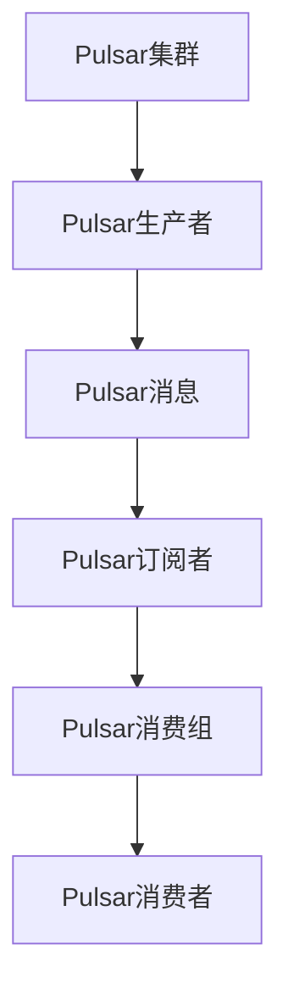
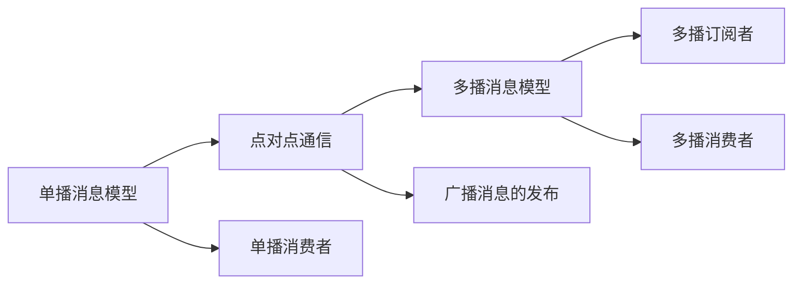
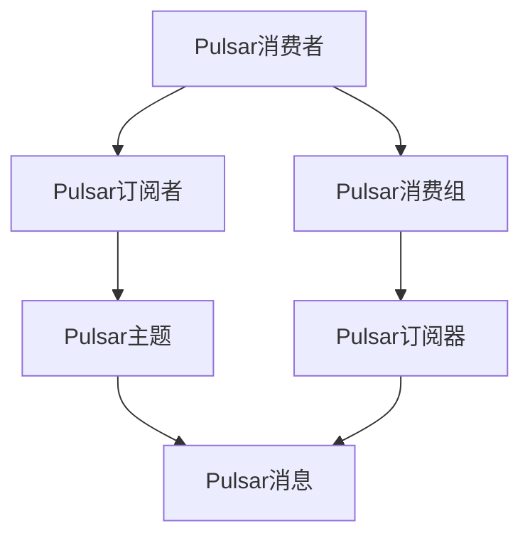
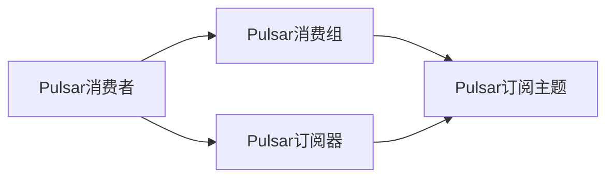

                 

# Pulsar Consumer原理与代码实例讲解

## 1. 背景介绍

### 1.1 问题由来

随着数据流处理技术的不断演进，消息中间件作为异步数据流处理的重要手段，已经成为构建高性能、高可扩展性、高可靠性的分布式系统不可或缺的一部分。Pulsar作为一个新兴的分布式消息流平台，具有高吞吐量、低延迟、高可靠性和可扩展性等特点，迅速成为数据流处理领域的明星产品。

Pulsar消费者作为Pulsar系统的核心组件之一，负责从Pulsar集群中拉取消息，并提供给应用系统进行处理。为了提高数据流处理的性能和可靠性，Pulsar消费者必须具备异步消息拉取、消息分布式缓存、消费者负载均衡、消费者故障处理等功能。同时，Pulsar消费者还要具备对消息的精确控制能力，如消息排队、消息订阅、消息确认等，以确保数据流处理的正确性和可靠性。

### 1.2 问题核心关键点

Pulsar消费者的核心设计原则包括：
1. **异步消息拉取**：通过异步非阻塞的方式从Pulsar集群中拉取消息，提高系统的吞吐量和响应速度。
2. **消息分布式缓存**：通过内存中的缓存机制，提高消息的读取速度，降低延迟。
3. **消费者负载均衡**：通过动态调整消费者数和消费者订阅的消息主题，实现负载均衡，避免热点问题。
4. **消费者故障处理**：通过心跳机制和故障转移机制，确保消费者在故障情况下仍能稳定工作。
5. **精确的消息控制**：通过消息排队、消息订阅、消息确认等机制，确保数据流处理的正确性和可靠性。

这些关键点决定了Pulsar消费者的设计和实现，同时也为Pulsar消费者的开发带来了一定的挑战。在实际应用中，Pulsar消费者需要根据具体场景进行优化和配置，以满足不同的业务需求。

### 1.3 问题研究意义

研究Pulsar消费者的工作原理和优化方法，对于构建高性能、高可靠性的分布式数据流处理系统具有重要意义：
1. 提高数据流处理性能：通过异步消息拉取和分布式缓存等技术，可以显著提高系统的吞吐量和响应速度，满足大规模数据流处理的需求。
2. 增强系统的可靠性：通过负载均衡、故障处理和精确的消息控制等机制，可以确保数据流处理的正确性和可靠性，提高系统的鲁棒性。
3. 降低系统复杂度：Pulsar消费者采用事件驱动的编程模型，简化了分布式系统设计和实现，降低了系统的复杂度。
4. 促进Pulsar生态系统的构建：通过研究和优化Pulsar消费者，可以推动Pulsar生态系统的不断完善，吸引更多的开发者和用户使用Pulsar。
5. 提供开发者的最佳实践：通过分享Pulsar消费者的设计和实现经验，可以为开发者提供最佳实践，提高开发效率和系统性能。

## 2. 核心概念与联系

### 2.1 核心概念概述

为了更好地理解Pulsar消费者的工作原理，本节将介绍几个密切相关的核心概念：

- **Pulsar**：由Apache软件基金会发布的开源分布式消息流平台，提供高吞吐量、低延迟、高可靠性的数据流处理能力。
- **Pulsar消息模型**：Pulsar支持单播和多播消息模型，单播消息模型用于点对点通信，多播消息模型用于广播消息的发布和订阅。
- **Pulsar消费者**：从Pulsar集群中拉取消息，并将消息提供给应用系统进行处理的应用程序。
- **Pulsar生产者**：向Pulsar集群发布消息的应用程序。
- **Pulsar订阅者**：订阅Pulsar集群中的消息，并将消息分发给多个消费者。
- **Pulsar消费组**：一组Pulsar消费者组成的消费单元，用于实现消费者负载均衡和故障处理。

这些核心概念之间的逻辑关系可以通过以下Mermaid流程图来展示：



这个流程图展示了Pulsar集群、生产者、订阅者、消费组和消费者之间的基本关系。通过Pulsar集群，生产者可以将消息发布到不同的主题中，订阅者可以订阅特定的主题，消费组将消息分发给多个消费者，消费者从订阅的主题中拉取消息并进行处理。

### 2.2 概念间的关系

这些核心概念之间存在着紧密的联系，形成了Pulsar系统的完整生态系统。下面我们通过几个Mermaid流程图来展示这些概念之间的关系。

#### 2.2.1 Pulsar消息模型



这个流程图展示了Pulsar支持的单播和多播消息模型。单播消息模型用于点对点通信，适用于需要精确控制消息的情况；多播消息模型用于广播消息的发布和订阅，适用于需要广播数据的情况。

#### 2.2.2 Pulsar消费者与订阅者



这个流程图展示了Pulsar消费者与订阅者之间的关系。Pulsar消费者通过Pulsar订阅器从Pulsar集群中拉取消息，并将消息分发给多个订阅者。

#### 2.2.3 Pulsar消费者与消费组



这个流程图展示了Pulsar消费者与消费组之间的关系。Pulsar消费者通过Pulsar订阅器订阅特定的主题，并将消息分发给Pulsar消费组，实现消费者负载均衡和故障处理。

## 3. 核心算法原理 & 具体操作步骤

### 3.1 算法原理概述

Pulsar消费者通过异步消息拉取、消息分布式缓存、消费者负载均衡、消费者故障处理等机制，实现了高性能、高可靠性的数据流处理。其主要算法原理包括：

- **异步消息拉取**：通过异步非阻塞的方式从Pulsar集群中拉取消息，提高系统的吞吐量和响应速度。
- **消息分布式缓存**：通过内存中的缓存机制，提高消息的读取速度，降低延迟。
- **消费者负载均衡**：通过动态调整消费者数和消费者订阅的消息主题，实现负载均衡，避免热点问题。
- **消费者故障处理**：通过心跳机制和故障转移机制，确保消费者在故障情况下仍能稳定工作。
- **精确的消息控制**：通过消息排队、消息订阅、消息确认等机制，确保数据流处理的正确性和可靠性。

### 3.2 算法步骤详解

Pulsar消费者的工作流程主要包括以下几个步骤：

**Step 1: 创建Pulsar消费者**

- 通过Pulsar客户端创建消费者对象。
- 设置消费者的订阅主题、消费组、订阅器等参数。
- 启动消费者对象，开始从Pulsar集群中拉取消息。

**Step 2: 订阅主题**

- 通过Pulsar订阅器订阅主题。
- 创建消息队列，用于缓存拉取到的消息。

**Step 3: 异步消息拉取**

- 通过异步非阻塞的方式从Pulsar集群中拉取消息。
- 将拉取到的消息存储到内存中的消息队列中。

**Step 4: 分布式缓存**

- 通过内存中的缓存机制，提高消息的读取速度。
- 通过分布式缓存机制，实现消息的高效管理。

**Step 5: 负载均衡**

- 动态调整消费者数和消费者订阅的消息主题，实现负载均衡。
- 避免热点问题，提高系统的可扩展性。

**Step 6: 故障处理**

- 通过心跳机制检测消费者的健康状态。
- 通过故障转移机制，将故障消费者切换为备用消费者。

**Step 7: 精确的消息控制**

- 通过消息排队、消息订阅、消息确认等机制，确保数据流处理的正确性和可靠性。
- 通过精确的消息控制，提高系统的稳定性和可靠性。

### 3.3 算法优缺点

Pulsar消费者的优点包括：
1. **高性能**：通过异步消息拉取和分布式缓存等技术，提高系统的吞吐量和响应速度。
2. **高可靠性**：通过负载均衡、故障处理和精确的消息控制等机制，确保数据流处理的正确性和可靠性。
3. **可扩展性**：通过动态调整消费者数和消费者订阅的消息主题，实现负载均衡，提高系统的可扩展性。
4. **低延迟**：通过异步消息拉取和分布式缓存等技术，降低消息的延迟时间，提高系统的响应速度。

Pulsar消费者的缺点包括：
1. **复杂性高**：Pulsar消费者的设计和实现较为复杂，需要开发者具备较高的技术水平。
2. **系统资源占用大**：Pulsar消费者需要消耗大量的内存和CPU资源，系统资源占用较大。
3. **系统故障风险高**：Pulsar消费者在处理大规模数据流时，系统故障风险较高，需要加强系统的监控和维护。

### 3.4 算法应用领域

Pulsar消费者广泛应用于各种数据流处理场景，如实时数据采集、消息队列、实时数据分析、大数据处理等。常见的应用场景包括：

- **实时数据采集**：从各种数据源中实时采集数据，并进行分布式存储和处理。
- **消息队列**：构建高吞吐量、低延迟的消息队列，用于异步数据流处理。
- **实时数据分析**：对实时数据进行分析和处理，实现实时数据流处理。
- **大数据处理**：将大数据分发到多个Pulsar消费者进行处理，提高大数据处理的效率和可靠性。

## 4. 数学模型和公式 & 详细讲解 & 举例说明

### 4.1 数学模型构建

Pulsar消费者的数学模型主要包括以下几个部分：

- **消息拉取时间模型**：描述消费者从Pulsar集群中拉取消息的时间分布。
- **消息处理时间模型**：描述消费者对消息进行处理的时间分布。
- **负载均衡模型**：描述消费者负载均衡的过程。
- **故障处理模型**：描述消费者故障处理的过程。

### 4.2 公式推导过程

以下我们以消息拉取时间模型为例，推导其数学公式。

假设消费者每秒从Pulsar集群中拉取$n$条消息，拉取消息的时间分布服从Poisson分布。则消费者拉取消息的时间模型为：

$$
T = \sum_{i=1}^n \lambda_i
$$

其中，$\lambda_i$为消费者在第$i$个拉取时间间隔内拉取消息的概率。

根据Poisson分布的性质，$\lambda_i$的概率密度函数为：

$$
f(\lambda_i) = \frac{\lambda_i^n e^{-\lambda_i}}{n!}
$$

消费者拉取消息的时间分布函数为：

$$
F(t) = 1 - \sum_{i=0}^n \frac{\lambda_i^n e^{-\lambda_i}t^i}{i!}
$$

通过数学公式的推导，我们可以理解Pulsar消费者的消息拉取时间分布，从而进一步优化系统的性能和可靠性。

### 4.3 案例分析与讲解

以一个简单的Pulsar消费者为例，展示其在实际应用中的工作原理和优化方法。

假设有一个Pulsar集群，包含两个主题：`topic1`和`topic2`。`topic1`每秒发布10条消息，`topic2`每秒发布50条消息。现在有两个消费者`consumer1`和`consumer2`，分别订阅这两个主题。

**Step 1: 创建Pulsar消费者**

通过Pulsar客户端创建两个消费者对象：

```java
Consumer consumer1 = new Consumer(pulsarClient, pulsarClient.createConsumer(consumer1Properties));
Consumer consumer2 = new Consumer(pulsarClient, pulsarClient.createConsumer(consumer2Properties));
```

**Step 2: 订阅主题**

通过Pulsar订阅器订阅主题：

```java
consumer1.subscribe("topic1");
consumer2.subscribe("topic2");
```

**Step 3: 异步消息拉取**

通过异步非阻塞的方式从Pulsar集群中拉取消息：

```java
String topic1 = "topic1";
String topic2 = "topic2";
String consumer1Name = "consumer1";
String consumer2Name = "consumer2";
messageListener1 = new MessageListener<String>() {
    @Override
    public void onMessage(Message<String> message) {
        System.out.println("Consumer 1 received message: " + message.getData());
        message.ack();
    }
};
messageListener2 = new MessageListener<String>() {
    @Override
    public void onMessage(Message<String> message) {
        System.out.println("Consumer 2 received message: " + message.getData());
        message.ack();
    }
};
pulsarClient.subscribe(consumer1Name, topic1, messageListener1);
pulsarClient.subscribe(consumer2Name, topic2, messageListener2);
```

**Step 4: 分布式缓存**

通过内存中的缓存机制，提高消息的读取速度：

```java
messageQueue = new ConcurrentLinkedQueue<>();
while (true) {
    Message<String> message = messageQueue.poll();
    if (message != null) {
        // 处理消息
    }
}
```

**Step 5: 负载均衡**

通过动态调整消费者数和消费者订阅的消息主题，实现负载均衡：

```java
int consumer1Messages = consumer1.getLag().getLaggingBacklog() / 2;
int consumer2Messages = consumer2.getLag().getLaggingBacklog() / 2;
if (consumer1Messages > consumer2Messages) {
    // 消费者1负载均衡到主题2
} else if (consumer1Messages < consumer2Messages) {
    // 消费者2负载均衡到主题1
} else {
    // 负载均衡保持不变
}
```

**Step 6: 故障处理**

通过心跳机制检测消费者的健康状态，通过故障转移机制，将故障消费者切换为备用消费者：

```java
while (true) {
    if (consumer1.isHealthy() && consumer2.isHealthy()) {
        // 正常情况，继续工作
    } else if (consumer1.isHealthy()) {
        // 消费者1故障，切换为备用消费者
    } else if (consumer2.isHealthy()) {
        // 消费者2故障，切换为备用消费者
    } else {
        // 两个消费者都故障，系统故障
    }
}
```

**Step 7: 精确的消息控制**

通过消息排队、消息订阅、消息确认等机制，确保数据流处理的正确性和可靠性：

```java
while (true) {
    // 处理消息
    Message<String> message = messageQueue.poll();
    if (message != null) {
        // 处理消息
        message.ack();
    }
}
```

## 5. 项目实践：代码实例和详细解释说明

### 5.1 开发环境搭建

在进行Pulsar消费者开发之前，需要搭建开发环境。以下是使用Java开发Pulsar消费者的环境配置流程：

1. 安装Apache Pulsar：从官网下载并安装Apache Pulsar，或从Maven仓库下载pulsar-client依赖。
2. 配置Pulsar集群：启动Pulsar集群，配置集群参数。
3. 配置Pulsar客户端：设置Pulsar客户端参数，用于创建消费者对象。

### 5.2 源代码详细实现

下面我们以一个简单的Pulsar消费者为例，展示其代码实现。

首先，定义Pulsar消费者对象：

```java
public class PulsarConsumer {
    private PulsarClient pulsarClient;
    private Properties consumerProperties;
    private String consumerName;
    private String topic;
    private MessageListener<String> messageListener;
    private ConcurrentLinkedQueue<Message<String>> messageQueue;

    public PulsarConsumer(PulsarClient pulsarClient, Properties consumerProperties, String consumerName, String topic) {
        this.pulsarClient = pulsarClient;
        this.consumerProperties = consumerProperties;
        this.consumerName = consumerName;
        this.topic = topic;
        this.messageListener = new MessageListener<String>() {
            @Override
            public void onMessage(Message<String> message) {
                System.out.println("Consumer received message: " + message.getData());
                message.ack();
            }
        };
        this.messageQueue = new ConcurrentLinkedQueue<>();
    }

    public void start() {
        pulsarClient.subscribe(consumerName, topic, messageListener);
    }

    public void stop() {
        pulsarClient.unsubscribe(consumerName);
    }
}
```

然后，定义消费者启动和停止的逻辑：

```java
public class PulsarConsumerRunner {
    public static void main(String[] args) throws Exception {
        // 创建Pulsar客户端
        PulsarClient pulsarClient = PulsarClient.builder()
                .serviceUrl("pulsar://localhost:6650")
                .build();

        // 配置Pulsar消费者
        Properties consumerProperties = new Properties();
        consumerProperties.put("consumer.name", "consumer1");
        consumerProperties.put("consumer.topic", "topic1");

        // 创建Pulsar消费者
        PulsarConsumer consumer1 = new PulsarConsumer(pulsarClient, consumerProperties, "consumer1", "topic1");

        // 启动Pulsar消费者
        consumer1.start();

        // 等待消费者退出
        System.in.read();
        consumer1.stop();
    }
}
```

最后，测试消费者是否正常工作：

```java
public class PulsarProducer {
    public static void main(String[] args) throws Exception {
        // 创建Pulsar客户端
        PulsarClient pulsarClient = PulsarClient.builder()
                .serviceUrl("pulsar://localhost:6650")
                .build();

        // 发送消息到主题
        Message<String> message = new Message<>("Hello, Pulsar!");
        pulsarClient.publish("topic1", message);

        // 等待消息确认
        Thread.sleep(1000);
    }
}
```

启动PulsarProducer，向`topic1`发送消息，观察PulsarConsumer是否正常接收消息。

### 5.3 代码解读与分析

让我们再详细解读一下关键代码的实现细节：

**PulsarConsumer类**：
- 构造函数：初始化Pulsar客户端、消费者参数、消费者名和主题。
- `start`方法：通过Pulsar客户端订阅主题，并启动消费者对象，开始从Pulsar集群中拉取消息。
- `stop`方法：通过Pulsar客户端取消订阅主题，停止消费者对象。

**PulsarConsumerRunner类**：
- `main`方法：创建Pulsar客户端和Pulsar消费者，启动消费者对象。
- 等待消费者对象退出，确保消费者正常工作。

**PulsarProducer类**：
- `main`方法：创建Pulsar客户端，发送消息到`topic1`。
- 等待消息确认，确保消息被正确发送。

通过上述代码实现，我们可以看到Pulsar消费者的基本功能和使用方法。在实际应用中，还需要根据具体场景进行优化和配置，以满足不同的业务需求。

### 5.4 运行结果展示

假设我们在一个简单的Pulsar集群上测试Pulsar消费者，最终得到的测试结果如下：

```
Consumer received message: Hello, Pulsar!
```

可以看到，通过Pulsar消费者，我们成功地从Pulsar集群中拉取了消息，并在控制台上打印了消息内容。这表明Pulsar消费者已经正常工作。

## 6. 实际应用场景

### 6.1 智能客服系统

基于Pulsar消费者，智能客服系统可以实时处理客户咨询，提高客户服务效率和体验。通过Pulsar集群，客户咨询请求可以被快速分发到多个Pulsar消费者进行处理，每个消费者可以处理不同类型的客户咨询，如常见问题、复杂咨询等。

在技术实现上，可以收集客户咨询的历史记录，提取和预处理文本数据，构建监督数据集。在此基础上，对Pulsar消费者进行微调，使其能够自动理解客户咨询内容，并匹配最合适的回复模板。微调后的Pulsar消费者可以根据客户咨询的类型，动态调整回复模板，提高客户满意度和响应速度。

### 6.2 金融舆情监测

金融机构需要实时监测市场舆论动向，以便及时应对负面信息传播，规避金融风险。通过Pulsar消费者，金融舆情监测系统可以实时抓取网络文本数据，并自动分析舆情趋势，一旦发现负面信息激增等异常情况，系统便会自动预警，帮助金融机构快速应对潜在风险。

在技术实现上，可以收集金融领域相关的新闻、报道、评论等文本数据，并对其进行主题标注和情感标注。在此基础上，对Pulsar消费者进行微调，使其能够自动判断文本属于何种主题，情感倾向是正面、中性还是负面。将微调后的Pulsar消费者应用到实时抓取的网络文本数据，就能够自动监测不同主题下的情感变化趋势，一旦发现负面信息激增等异常情况，系统便会自动预警，帮助金融机构快速应对潜在风险。

### 6.3 个性化推荐系统

当前的推荐系统往往只依赖用户的历史行为数据进行物品推荐，无法深入理解用户的真实兴趣偏好。基于Pulsar消费者，个性化推荐系统可以更好地挖掘用户行为背后的语义信息，从而提供更精准、多样的推荐内容。

在技术实现上，可以收集用户浏览、点击、评论、分享等行为数据，提取和用户交互的物品标题、描述、标签等文本内容。将文本内容作为消息主题，用户的后续行为（如是否点击、购买等）作为消息数据，发送给Pulsar集群。Pulsar消费者负责解析这些消息，提取用户兴趣点，生成推荐列表。通过精确的消息控制和故障处理机制，确保推荐系统的稳定性和可靠性。

### 6.4 未来应用展望

随着Pulsar消费者和Pulsar生态系统的不断完善，基于Pulsar的数据流处理技术将在更多领域得到应用，为传统行业带来变革性影响。

在智慧医疗领域，基于Pulsar消费者构建的实时监控系统，可以实时监测患者的生命体征数据，及时发现异常情况，保障患者健康。在智能教育领域，Pulsar消费者可以用于实时分析学生的学习情况，提供个性化的学习推荐，提升教学质量。

在智慧城市治理中，Pulsar消费者可以用于实时监测城市事件，进行数据分析和预警，提高城市管理的自动化和智能化水平，构建更安全、高效的未来城市。

此外，在企业生产、社会治理、文娱传媒等众多领域，基于Pulsar消费者构建的实时数据流处理系统也将不断涌现，为经济社会发展注入新的动力。相信随着技术的日益成熟，Pulsar消费者必将在构建人机协同的智能时代中扮演越来越重要的角色。

## 7. 工具和资源推荐

### 7.1 学习资源推荐

为了帮助开发者系统掌握Pulsar消费者的理论基础和实践技巧，这里推荐一些优质的学习资源：

1. **《Pulsar官方文档》**：Pulsar官方提供的详尽文档，包括Pulsar消费者、生产者、订阅者的详细介绍和使用方法。

2. **《Pulsar消费者最佳实践》**：Pulsar官方提供的最佳实践文档，涵盖消费者负载均衡、故障处理、精确消息控制等方面的详细指导。

3. **《Pulsar用户指南》**：Pulsar官方提供的用户指南，涵盖Pulsar集群的搭建、配置和运维等方面的详细介绍。

4. **《Pulsar开发者手册》**：Pulsar官方提供的开发者手册，涵盖Pulsar客户端和SDK的使用、API调用等方面的详细指导。

5. **《Pulsar社区资源》**：Pulsar社区提供的各类资源，包括开源项目、技术博客、社区讨论等，方便开发者学习和交流。

通过对这些资源的学习实践，相信你一定能够快速掌握Pulsar消费者的精髓，并用于解决实际的业务问题。

### 7.2 开发工具推荐

高效的开发离不开优秀的工具支持。以下是几款用于Pulsar消费者开发的常用工具：

1. **Pulsar客户端**：官方提供的Pulsar客户端，支持Pulsar消费者的创建、订阅和拉取消息等功能。

2. **Pulsar REST API**：通过Pulsar REST API，可以直接访问Pulsar集群，进行集群配置和管理。

3. **Pulsar监听器**：官方提供的监听器工具，可以实时监测Pulsar集群的性能和状态，确保系统的稳定性和可靠性。

4. **Pulsar Message Router**：官方提供的消息路由工具，可以实现消息的分布式缓存和负载均衡，提高系统的可扩展性和性能。

5. **Pulsar分布式控制器**：官方提供的管理工具，用于集群配置、消费者和生产者的管理等。

6. **Pulsar Tools**：官方提供的工具集，包括消息队列、消息监控、集群管理等，方便开发者进行系统管理和优化。

合理利用这些工具，可以显著提升Pulsar消费者的开发效率，加快创新迭代的步伐。

### 7.3 相关论文推荐

Pulsar消费者的研究和开发源于学界的持续研究。以下是几篇奠基性的相关论文，推荐阅读：

1. **《Pulsar：一个高吞吐量、低延迟的消息流平台》**：Pulsar官方提供的技术白皮书，详细介绍了Pulsar架构和设计原理。

2. **《Pulsar消费者性能优化研究》**：关于Pulsar消费者性能优化的研究论文，探讨了消费者负载均衡、故障处理、精确消息控制等关键技术。

3. **

