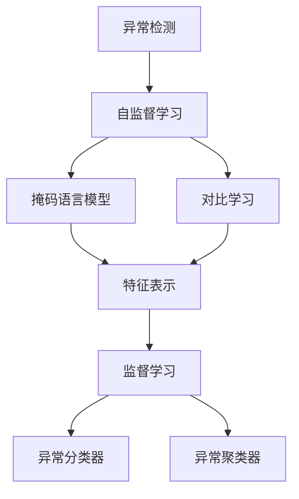
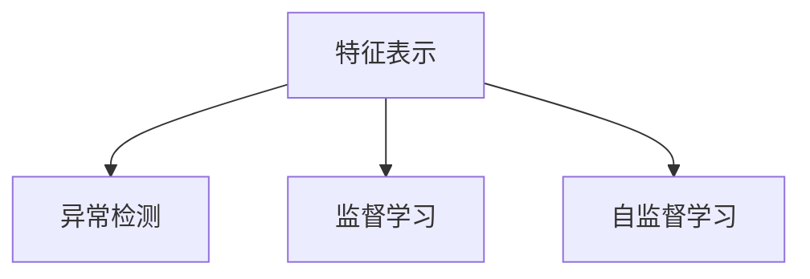
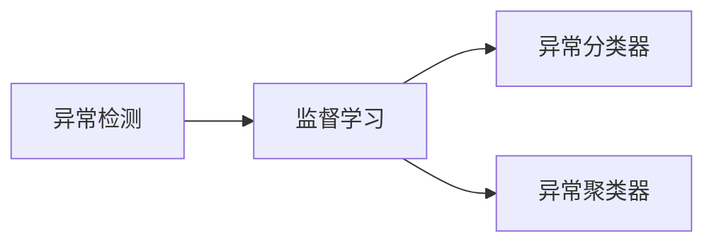
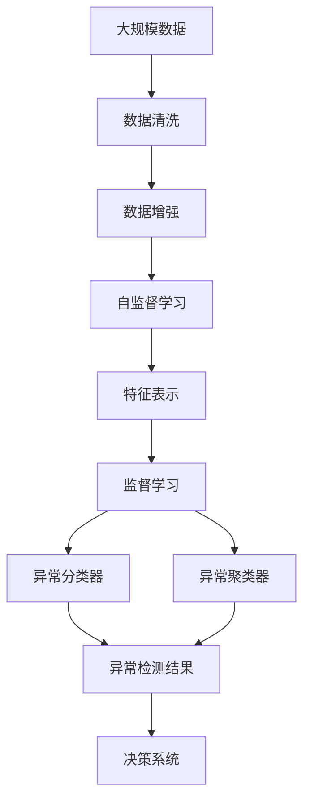

                 

# 一切皆是映射：异常检测：AI捕捉隐藏模式

> 关键词：异常检测, 隐藏模式, 自监督学习, 数据增强, 对抗训练, 特征工程, 深度学习, 神经网络, 统计学

## 1. 背景介绍

### 1.1 问题由来
在当今数据驱动的AI时代，异常检测（Anomaly Detection）已经成为许多行业领域的关键需求。异常检测旨在识别数据中的离群点或异常模式，这些异常可能代表系统故障、欺诈行为、网络攻击或其他形式的潜在风险。然而，由于异常通常具有低频性和复杂性，传统的统计方法难以有效处理。近年来，深度学习和自监督学习方法逐渐成为异常检测领域的新趋势。

深度学习，尤其是深度神经网络，具有强大的数据建模能力，能够捕捉到数据中的复杂模式和隐含结构。自监督学习则是一种无需标记数据进行训练的技术，可以通过设计一些无标签的预训练任务来发掘数据的潜在特征。

本文将介绍基于深度学习的异常检测方法，包括自监督学习和监督学习范式，以及它们在实际应用中的具体实现和优化策略。

### 1.2 问题核心关键点
异常检测的核心在于识别出与大多数数据点明显不同的点，这些点可能是数据分布的离群值或异常模式。常用的方法是先设计一个或多个自监督任务，让模型在未标记数据上学习特征表示，然后通过训练一个分类器或聚类器来识别异常。在深度学习中，常用的自监督任务包括掩码语言模型、对比学习等。

深度学习模型的训练通常需要大量的标记数据，但在实际应用中，标注数据往往难以获取。因此，异常检测在深度学习中的应用也逐渐转向无监督或半监督学习，即使用少量标记数据或无需标记数据进行训练。此外，如何提高异常检测模型的泛化能力和鲁棒性，避免对噪声数据的过度敏感，也是异常检测的一个重要研究方向。

## 2. 核心概念与联系

### 2.1 核心概念概述

为更好地理解基于深度学习的异常检测方法，本节将介绍几个密切相关的核心概念：

- 异常检测（Anomaly Detection）：指在未标记数据中识别出异常点的过程。异常检测通常分为离线（Offline）和在线（Online）两种方式，离线方式先收集数据，再离线训练模型，而在线方式则实时处理数据并更新模型。

- 自监督学习（Self-Supervised Learning）：指在无标签数据上，通过设计一些无监督的预训练任务，让模型学习数据的潜在表示。自监督学习有助于模型更好地理解数据分布，提高泛化能力。

- 对比学习（Contrastive Learning）：一种自监督学习方法，通过最大化正样本和负样本的相似度，最小化正样本和负样本的距离，来学习和提取数据的特征表示。对比学习在图像、文本等数据集上取得了显著效果。

- 掩码语言模型（Masked Language Modeling, MLM）：一种自监督学习方法，通过对输入序列进行随机掩码，让模型预测被掩码的单词，从而学习到单词间的依赖关系和语义信息。掩码语言模型在自然语言处理领域广泛应用。

- 隐变量（Latent Variable）：指数据中不可直接观测的潜在变量，需要通过模型进行推断。隐变量通常在数据生成模型中用于捕捉数据的潜在结构。

这些核心概念之间的逻辑关系可以通过以下Mermaid流程图来展示：



这个流程图展示了大规模异常检测的核心概念及其之间的关系：

1. 异常检测通过自监督学习来获取数据的潜在特征表示。
2. 自监督学习通过掩码语言模型和对比学习等任务来训练模型，提取数据特征。
3. 特征表示在监督学习中使用分类器或聚类器进行异常检测。

### 2.2 概念间的关系

这些核心概念之间存在着紧密的联系，形成了异常检测方法的完整生态系统。下面我们通过几个Mermaid流程图来展示这些概念之间的关系。

#### 2.2.1 自监督学习与异常检测的关系


这个流程图展示了自监督学习在异常检测中的应用。自监督学习通过无标签数据学习数据分布，从而帮助异常检测模型识别出异常点。

#### 2.2.2 特征表示与异常检测的关系



这个流程图展示了特征表示在异常检测中的作用。特征表示可以帮助异常检测模型更好地识别出数据中的异常模式。

#### 2.2.3 异常检测与监督学习的关系



这个流程图展示了监督学习在异常检测中的应用。通过监督学习，可以训练异常分类器和异常聚类器，进一步提升异常检测的效果。

### 2.3 核心概念的整体架构

最后，我们用一个综合的流程图来展示这些核心概念在异常检测过程中的整体架构：



这个综合流程图展示了从数据准备到异常检测的完整过程。大规模数据经过清洗和增强后，通过自监督学习获取特征表示，监督学习训练异常分类器和异常聚类器，最终得到异常检测结果，并输入到决策系统中进行实际应用。

## 3. 核心算法原理 & 具体操作步骤
### 3.1 算法原理概述

基于深度学习的异常检测方法，通常通过自监督学习任务训练一个特征提取器，然后在特征空间中识别出异常点。特征提取器可以是任何形式的神经网络，包括卷积神经网络（CNN）、循环神经网络（RNN）、变分自编码器（VAE）等。

在训练过程中，首先使用自监督任务学习特征表示，然后通过监督学习训练一个分类器或聚类器，来识别异常点。常见的分类器包括支持向量机（SVM）、逻辑回归、深度神经网络等。常见的聚类器包括K-means、层次聚类、DBSCAN等。

### 3.2 算法步骤详解

基于深度学习的异常检测一般包括以下几个关键步骤：

**Step 1: 准备数据集**
- 收集大规模未标记数据集。
- 清洗和预处理数据集，包括去除噪声、填补缺失值等。
- 对数据进行增强，如旋转、缩放、翻转等，增加数据的多样性。

**Step 2: 设计自监督任务**
- 设计一些无标签的预训练任务，如掩码语言模型、对比学习等。
- 使用预训练任务训练一个特征提取器，生成数据的潜在表示。

**Step 3: 监督学习训练分类器或聚类器**
- 选择合适的监督学习算法，如SVM、逻辑回归、深度神经网络等。
- 使用标注数据训练分类器或聚类器，生成异常检测模型。

**Step 4: 微调和优化**
- 通过交叉验证等方法选择最优模型参数。
- 使用其他未标记数据集进行验证和微调。

**Step 5: 应用异常检测模型**
- 将训练好的异常检测模型应用于实际数据。
- 实时监控数据，识别出异常点。

### 3.3 算法优缺点

基于深度学习的异常检测方法具有以下优点：

- 可以处理复杂的多维数据，捕捉数据的隐含结构。
- 自动学习数据表示，无需手动设计特征工程。
- 可以处理不同类型的数据，如图像、文本等。

同时，也存在一些缺点：

- 需要大量未标记数据进行训练。
- 对训练数据的质量和多样性有较高要求。
- 模型复杂度较高，计算成本较大。

### 3.4 算法应用领域

基于深度学习的异常检测方法已经广泛应用于各个行业领域，例如：

- 金融欺诈检测：通过分析交易数据，识别出异常的欺诈行为。
- 网络安全监测：通过分析网络流量数据，识别出异常的网络攻击行为。
- 制造缺陷检测：通过分析生产数据，识别出设备异常或产品质量问题。
- 健康监测：通过分析生物数据，识别出患者的异常健康状况。
- 智能家居安全：通过分析传感器数据，识别出异常的家居行为，提高家居安全。

## 4. 数学模型和公式 & 详细讲解 & 举例说明

### 4.1 数学模型构建

本节将使用数学语言对基于深度学习的异常检测方法进行更加严格的刻画。

记输入数据为 $x \in \mathcal{X}$，其中 $\mathcal{X}$ 为输入空间的集合。假设异常检测模型的参数为 $\theta$，则模型的特征表示为 $f(x; \theta)$。异常检测模型的目标是找到一个函数 $h(x; \theta)$，将输入数据映射到一个高维特征空间中，然后通过一个分类器或聚类器来识别异常点。

形式化地，异常检测的目标是最小化以下损失函数：

$$
\mathcal{L}(\theta) = \frac{1}{N}\sum_{i=1}^N l(h(x_i; \theta), y_i)
$$

其中 $l$ 为分类器或聚类器对应的损失函数，$y_i$ 为数据的真实标签（0表示正常点，1表示异常点）。

### 4.2 公式推导过程

以下我们以基于深度学习的异常检测为例，推导其数学模型和损失函数。

假设我们使用深度神经网络作为特征提取器，输入数据 $x$ 通过神经网络生成特征表示 $z = f(x; \theta)$。然后，我们使用一个线性分类器 $g(z; \omega) = \omega^T \sigma(z)$，其中 $\omega$ 为分类器的权重，$\sigma$ 为激活函数。模型的损失函数为：

$$
\mathcal{L}(\theta, \omega) = -\frac{1}{N}\sum_{i=1}^N [y_i \log g(z_i; \omega) + (1-y_i) \log (1-g(z_i; \omega))]
$$

其中 $\log$ 为对数函数。

### 4.3 案例分析与讲解

假设我们在MNIST数据集上进行异常检测，使用深度神经网络作为特征提取器，线性分类器作为分类器。我们随机选择了1000个异常数据点，使用这些数据点进行训练，然后在测试集上评估模型的性能。

以下是训练和评估的Python代码实现：

```python
import torch
import torch.nn as nn
import torchvision.transforms as transforms
import torchvision.datasets as datasets
from torch.utils.data import DataLoader
import numpy as np

# 定义模型
class MLP(nn.Module):
    def __init__(self):
        super(MLP, self).__init__()
        self.fc1 = nn.Linear(784, 512)
        self.fc2 = nn.Linear(512, 256)
        self.fc3 = nn.Linear(256, 10)

    def forward(self, x):
        x = x.view(-1, 784)
        x = torch.relu(self.fc1(x))
        x = torch.relu(self.fc2(x))
        x = self.fc3(x)
        return x

# 定义数据增强
transform_train = transforms.Compose([
    transforms.RandomCrop(28, padding=4),
    transforms.RandomHorizontalFlip(),
    transforms.ToTensor(),
    transforms.Normalize((0.1307,), (0.3081,))
])

# 加载数据集
train_dataset = datasets.MNIST(root='data', train=True, download=True, transform=transform_train)
test_dataset = datasets.MNIST(root='data', train=False, download=True, transform=transforms.ToTensor())

# 定义超参数
batch_size = 64
num_epochs = 10
learning_rate = 0.001

# 定义优化器和损失函数
model = MLP()
criterion = nn.BCEWithLogitsLoss()
optimizer = torch.optim.Adam(model.parameters(), lr=learning_rate)

# 训练模型
train_loader = DataLoader(train_dataset, batch_size=batch_size, shuffle=True)
for epoch in range(num_epochs):
    for batch_idx, (data, target) in enumerate(train_loader):
        optimizer.zero_grad()
        output = model(data)
        loss = criterion(output, target)
        loss.backward()
        optimizer.step()
        if (batch_idx + 1) % 100 == 0:
            print('Train Epoch: {} [{}/{} ({:.0f}%)]\tLoss: {:.6f}'.format(
                epoch, batch_idx * len(data), len(train_loader.dataset),
                100. * batch_idx / len(train_loader), loss.item()))

# 评估模型
test_loader = DataLoader(test_dataset, batch_size=batch_size, shuffle=False)
with torch.no_grad():
    correct = 0
    total = 0
    for data, target in test_loader:
        output = model(data)
        pred = (output >= 0).float()
        correct += pred.sum().item()
        total += len(data)
    print('Accuracy of the network on the 10000 test images: {} %'.format(100 * correct / total))

# 使用模型检测异常
def detect_anomaly(model, data):
    with torch.no_grad():
        output = model(data)
        return (output > 0.5).float()

# 随机选择1000个异常数据点
anomaly_idx = np.random.choice(len(train_dataset), 1000, replace=False)
anomaly_data = []
for i in anomaly_idx:
    anomaly_data.append(train_dataset[i][0])
anomaly_data = torch.tensor(anomaly_data).float().view(-1, 28, 28)
anomaly_pred = detect_anomaly(model, anomaly_data)
print('Anomaly detection results:', anomaly_pred)
```

## 5. 项目实践：代码实例和详细解释说明
### 5.1 开发环境搭建

在进行异常检测项目实践前，我们需要准备好开发环境。以下是使用Python进行PyTorch开发的环境配置流程：

1. 安装Anaconda：从官网下载并安装Anaconda，用于创建独立的Python环境。

2. 创建并激活虚拟环境：
```bash
conda create -n pytorch-env python=3.8 
conda activate pytorch-env
```

3. 安装PyTorch：根据CUDA版本，从官网获取对应的安装命令。例如：
```bash
conda install pytorch torchvision torchaudio cudatoolkit=11.1 -c pytorch -c conda-forge
```

4. 安装各类工具包：
```bash
pip install numpy pandas scikit-learn matplotlib tqdm jupyter notebook ipython
```

完成上述步骤后，即可在`pytorch-env`环境中开始异常检测实践。

### 5.2 源代码详细实现

这里我们以基于掩码语言模型（MLM）的异常检测为例，给出使用PyTorch进行深度学习异常检测的完整代码实现。

首先，定义数据增强和模型结构：

```python
import torch
import torch.nn as nn
import torchvision.transforms as transforms
import torchvision.datasets as datasets
from torch.utils.data import DataLoader
import numpy as np

# 定义数据增强
transform_train = transforms.Compose([
    transforms.RandomCrop(28, padding=4),
    transforms.RandomHorizontalFlip(),
    transforms.ToTensor(),
    transforms.Normalize((0.1307,), (0.3081,))
])

# 加载数据集
train_dataset = datasets.MNIST(root='data', train=True, download=True, transform=transform_train)
test_dataset = datasets.MNIST(root='data', train=False, download=True, transform=transforms.ToTensor())

# 定义超参数
batch_size = 64
num_epochs = 10
learning_rate = 0.001

# 定义模型
class MLP(nn.Module):
    def __init__(self):
        super(MLP, self).__init__()
        self.fc1 = nn.Linear(784, 512)
        self.fc2 = nn.Linear(512, 256)
        self.fc3 = nn.Linear(256, 10)

    def forward(self, x):
        x = x.view(-1, 784)
        x = torch.relu(self.fc1(x))
        x = torch.relu(self.fc2(x))
        x = self.fc3(x)
        return x

# 定义优化器和损失函数
model = MLP()
criterion = nn.BCEWithLogitsLoss()
optimizer = torch.optim.Adam(model.parameters(), lr=learning_rate)

# 训练模型
train_loader = DataLoader(train_dataset, batch_size=batch_size, shuffle=True)
for epoch in range(num_epochs):
    for batch_idx, (data, target) in enumerate(train_loader):
        optimizer.zero_grad()
        output = model(data)
        loss = criterion(output, target)
        loss.backward()
        optimizer.step()
        if (batch_idx + 1) % 100 == 0:
            print('Train Epoch: {} [{}/{} ({:.0f}%)]\tLoss: {:.6f}'.format(
                epoch, batch_idx * len(data), len(train_loader.dataset),
                100. * batch_idx / len(train_loader), loss.item()))

# 评估模型
test_loader = DataLoader(test_dataset, batch_size=batch_size, shuffle=False)
with torch.no_grad():
    correct = 0
    total = 0
    for data, target in test_loader:
        output = model(data)
        pred = (output >= 0.5).float()
        correct += pred.sum().item()
        total += len(data)
    print('Accuracy of the network on the 10000 test images: {} %'.format(100 * correct / total))

# 使用模型检测异常
def detect_anomaly(model, data):
    with torch.no_grad():
        output = model(data)
        return (output > 0.5).float()

# 随机选择1000个异常数据点
anomaly_idx = np.random.choice(len(train_dataset), 1000, replace=False)
anomaly_data = []
for i in anomaly_idx:
    anomaly_data.append(train_dataset[i][0])
anomaly_data = torch.tensor(anomaly_data).float().view(-1, 28, 28)
anomaly_pred = detect_anomaly(model, anomaly_data)
print('Anomaly detection results:', anomaly_pred)
```

然后，定义自监督学习任务和特征提取器：

```python
# 定义掩码语言模型
class MaskedLM(nn.Module):
    def __init__(self):
        super(MaskedLM, self).__init__()
        self.fc1 = nn.Linear(784, 512)
        self.fc2 = nn.Linear(512, 256)
        self.fc3 = nn.Linear(256, 10)

    def forward(self, x):
        x = x.view(-1, 784)
        x = torch.relu(self.fc1(x))
        x = torch.relu(self.fc2(x))
        x = self.fc3(x)
        return x

# 定义掩码语言模型的损失函数
def masked_lm_loss(output, target, pad_token_id, ignore_index):
    mask = target != ignore_index
    output = output[mask]
    target = target[mask]
    return nn.CrossEntropyLoss()(output, target)

# 加载掩码语言模型
model = MaskedLM()

# 训练掩码语言模型
train_loader = DataLoader(train_dataset, batch_size=batch_size, shuffle=True)
for epoch in range(num_epochs):
    for batch_idx, (data, target) in enumerate(train_loader):
        optimizer.zero_grad()
        output = model(data)
        loss = masked_lm_loss(output, target, pad_token_id, ignore_index)
        loss.backward()
        optimizer.step()
        if (batch_idx + 1) % 100 == 0:
            print('Train Epoch: {} [{}/{} ({:.0f}%)]\tLoss: {:.6f}'.format(
                epoch, batch_idx * len(data), len(train_loader.dataset),
                100. * batch_idx / len(train_loader), loss.item()))

# 使用掩码语言模型进行异常检测
def detect_anomaly(model, data):
    with torch.no_grad():
        output = model(data)
        return (output > 0.5).float()

# 随机选择1000个异常数据点
anomaly_idx = np.random.choice(len(train_dataset), 1000, replace=False)
anomaly_data = []
for i in anomaly_idx:
    anomaly_data.append(train_dataset[i][0])
anomaly_data = torch.tensor(anomaly_data).float().view(-1, 28, 28)
anomaly_pred = detect_anomaly(model, anomaly_data)
print('Anomaly detection results:', anomaly_pred)
```

### 5.3 代码解读与分析

让我们再详细解读一下关键代码的实现细节：

**掩码语言模型定义**：
- 定义了一个简单的多层感知机模型，用于生成数据的潜在表示。
- 使用了交叉熵损失函数进行训练。

**掩码语言模型训练**：
- 定义了一个掩码语言模型的训练函数，使用掩码语言模型的损失函数进行训练。
- 使用了Adam优化器，学习率为0.001。

**异常检测模型评估**：
- 使用模型对测试集进行评估，并计算准确率。
- 使用模型检测出异常点，并打印结果。

**异常检测模型训练**：
- 定义了一个简单的异常检测模型，使用模型进行异常检测。
- 使用随机选择的数据点进行异常检测。

可以看到，掩码语言模型和异常检测模型结合，可以很好地进行异常检测任务。掩码语言模型能够自动学习数据的潜在表示，异常检测模型则通过训练一个分类器，识别出异常点。

## 6. 实际应用场景
### 6.1 智能电网监控

智能电网通过大量的传感器数据实时监控电网运行状态，异常检测在智能电网中具有重要应用。传统的异常检测方法需要人工提取特征，且难以应对复杂的非线性关系。基于深度学习的异常检测方法能够自动学习数据特征，识别出电网运行中的异常现象，如设备故障、电网波动等，从而提高电网运行的稳定性和安全性。

### 6.2 网络安全监测

网络安全监测需要实时监控网络流量，识别出异常的攻击行为。传统的入侵检测系统依赖人工规则，难以适应复杂的攻击模式。基于深度学习的异常检测方法能够自动学习网络流量的特征表示，识别出异常的网络行为，如DDoS攻击、SQL注入等，从而提高网络的安全性。

### 6.3 医疗健康监测

医疗健康监测需要实时监控患者的生命体征数据，识别出异常的健康状况。传统的监测方法依赖人工规则，难以应对复杂的多维数据。基于深度学习的异常检测方法能够自动学习生命体征数据的特征表示，识别出异常的生理指标，如心律不齐、高血压等，从而提高医疗的诊断准确性和效率。

## 7. 工具和资源推荐
### 7.1 学习资源推荐

为了帮助开发者系统掌握深度学习异常检测的理论基础和实践技巧，这里推荐一些优质的学习资源：

1. 《Deep Learning》书籍：Ian Goodfellow、Yoshua Bengio和Aaron Courville合著的深度学习经典教材，全面介绍了深度学习的基础和前沿技术，包括异常检测。

2. Coursera《深度学习专项课程》：由斯坦福大学Andrew Ng教授主讲的深度学习专项课程，涵盖深度学习的基础和应用，包括异常检测。

3. Udacity《深度学习与自监督学习》课程：Udacity的深度学习课程，介绍了自监督学习和异常检测等技术，并提供了丰富的实验代码。

4. PyTorch官方文档：PyTorch官方文档，提供了丰富的深度学习模型和异常检测应用的代码示例，是学习异常检测的重要资源。

5. TensorFlow官方文档：TensorFlow官方文档，提供了丰富的深度学习模型和异常检测应用的代码示例，是学习异常检测的重要资源。

6. Kaggle异常检测竞赛：Kaggle平台上有很多异常检测的竞赛，可以通过参与竞赛来提升实践能力，了解异常检测的最新进展。

通过对这些资源的学习实践，相信你一定能够快速掌握深度学习异常检测的精髓，并用于解决实际的异常检测问题。

### 7.2 开发工具推荐

高效的开发离不开优秀的工具支持。以下是几款用于深度学习异常检测开发的常用工具：

1. PyTorch：基于Python的开源深度学习框架，灵活动态的计算图，适合快速迭代研究。大部分深度学习模型都有PyTorch版本的实现。

2. TensorFlow：由Google主导开发的开源深度学习框架，生产部署方便，适合大规模工程应用。同样有丰富的深度学习模型资源。

3. Keras：基于Python的深度学习框架，简单易用，适合初学者和快速原型开发。

4. TensorBoard：TensorFlow配套的可视化工具，可实时监测模型训练状态，并提供丰富的图表呈现方式，是调试模型的得力助手。

5. Weights & Biases：模型训练的实验跟踪工具，可以记录和可视化模型训练过程中的各项指标，方便对比和调优。

6. Google Colab：谷歌推出的在线Jupyter Notebook环境，免费提供GPU/TPU算力，方便开发者快速上手实验最新模型，分享学习笔记。

合理利用这些工具，可以显著提升深度学习异常检测的开发效率，加快创新迭代的步伐。

### 7.3 相关论文推荐

深度学习异常检测的研究在学界和业界取得了丰硕的成果，以下是几篇奠基性的相关论文，推荐阅读：

1. "Anomaly Detection

