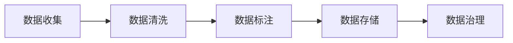

                 

## 1. 背景介绍

### 1.1 问题由来

在人工智能（AI）领域，创业公司数据管理的重要性不言而喻。随着AI技术的快速发展，越来越多的创业公司试图在各行各业中利用AI技术取得突破。然而，数据管理方面的问题却是不少创业公司所面临的重大挑战。数据管理不善不仅会影响到模型训练和性能，还会影响到业务决策和用户体验。

### 1.2 问题核心关键点

数据管理对于人工智能创业公司至关重要，其中涉及到的核心问题包括数据收集、数据清洗、数据标注、数据存储和数据治理等。数据收集决定了模型训练的数据量和质量，数据清洗保证了数据的准确性，数据标注决定了模型对数据的理解深度，数据存储影响了模型的访问效率，数据治理则决定了数据管理的规范化和标准化。

### 1.3 问题研究意义

高效的数据管理不仅能够提升AI模型的性能，还能够加速AI技术的落地应用。具体而言，数据管理能够：

- 提高数据质量和多样性，增强模型的泛化能力。
- 降低数据获取成本，快速迭代模型。
- 提升数据处理效率，缩短模型训练时间。
- 增强数据安全性和隐私保护，避免数据泄露风险。

因此，数据管理对于AI创业公司的成功与否具有重要意义。本文将系统性地介绍数据管理的核心概念、重要算法和实践技巧，为AI创业公司提供数据管理方面的指导。

## 2. 核心概念与联系

### 2.1 核心概念概述

数据管理在人工智能中占据了极其重要的地位，涉及多个关键概念，包括数据收集、数据清洗、数据标注、数据存储和数据治理等。这些概念通过数据流的传递，形成了紧密的联系和交互。

**数据收集（Data Collection）**：指从不同来源收集数据，如传感器数据、用户交互数据、公共数据集等，构建完整的数据集。

**数据清洗（Data Cleaning）**：指对数据进行去重、去噪、处理缺失值等操作，保证数据的准确性和一致性。

**数据标注（Data Labeling）**：指给数据添加标签，如分类标签、实体标签等，供模型学习使用。

**数据存储（Data Storage）**：指将数据存储在合适的数据仓库或数据库中，便于模型访问和使用。

**数据治理（Data Governance）**：指制定数据管理规范和标准，保证数据管理的标准化和规范化。

这些概念通过数据流的传递，形成了紧密的联系和交互。例如，数据收集的数据需要经过清洗和标注，才能用于模型训练；数据存储需要遵循数据治理的规范，保证数据的一致性和安全性。

### 2.2 概念间的关系

数据管理的过程可以概括为数据收集、数据清洗、数据标注、数据存储和数据治理等几个环节。这些环节之间的关系可以通过以下Mermaid流程图来展示：



这个流程图展示了大规模数据管理的基本流程。具体来说，数据收集的数据需要进行清洗和标注，才能用于模型训练；数据存储需要遵循数据治理的规范，保证数据的一致性和安全性。

## 3. 核心算法原理 & 具体操作步骤

### 3.1 算法原理概述

人工智能创业公司在数据管理中，主要涉及以下几种算法：

- 数据清洗算法：用于去除数据中的噪声和冗余信息，保证数据的准确性和一致性。
- 数据标注算法：用于给数据添加标签，供模型学习使用。
- 数据存储算法：用于高效存储和管理数据，便于模型访问和使用。
- 数据治理算法：用于制定数据管理规范和标准，保证数据管理的标准化和规范化。

这些算法通过数据流的传递，形成了一个完整的数据管理生态系统。

### 3.2 算法步骤详解

#### 3.2.1 数据清洗算法

**算法步骤**：

1. **数据预处理**：对原始数据进行格式转换、缺失值处理、去重等操作，生成数据集。
2. **异常值检测**：使用统计学方法和机器学习算法，检测并去除异常值。
3. **噪声过滤**：使用滤波器和算法，去除数据中的噪声和冗余信息。
4. **数据标准化**：对数据进行归一化和标准化处理，保证数据的一致性。

**算法实现**：

```python
import pandas as pd
from sklearn.preprocessing import StandardScaler
from sklearn.decomposition import PCA

# 数据预处理
df = pd.read_csv('data.csv')
df = df.drop_duplicates() # 去重
df = df.dropna() # 处理缺失值

# 异常值检测
from sklearn.covariance import EllipticEnvelope
model = EllipticEnvelope(contamination=0.01)
model.fit(df)
outliers = model.predict(df)

# 噪声过滤
from sklearn.linear_model import LinearRegression
model = LinearRegression()
model.fit(df)
noise = df - model.predict(df)

# 数据标准化
scaler = StandardScaler()
df_scaled = scaler.fit_transform(df)
pca = PCA(n_components=3)
pca.fit(df_scaled)
df_pca = pca.transform(df_scaled)
```

#### 3.2.2 数据标注算法

**算法步骤**：

1. **标注数据准备**：对原始数据进行预处理，生成标注数据集。
2. **标注规则制定**：制定标注规则，确保标注结果的一致性和准确性。
3. **标注任务分配**：将标注任务分配给标注人员，进行标注操作。
4. **标注结果审核**：对标注结果进行审核，确保标注质量。

**算法实现**：

```python
import pandas as pd
from tqdm import tqdm

# 标注数据准备
df = pd.read_csv('data.csv')
df = df.drop_duplicates() # 去重
df = df.dropna() # 处理缺失值

# 标注规则制定
def create_label(row):
    # 根据规则生成标签
    label = None
    # ...
    return label

# 标注任务分配
def assign_task(df):
    tasks = []
    for row in df.itertuples():
        tasks.append((row, create_label(row)))
    return tasks

# 标注结果审核
def review_labels(tasks):
    correct = []
    for task in tasks:
        row, label = task
        # 审核标注结果
        if label == row.label:
            correct.append(task)
    return correct
```

#### 3.2.3 数据存储算法

**算法步骤**：

1. **数据存储选择**：选择适合的数据存储方式，如关系型数据库、NoSQL数据库、云存储等。
2. **数据分割和压缩**：对数据进行分割和压缩，提高存储效率。
3. **数据冗余处理**：使用冗余处理技术，减少存储开销。
4. **数据备份和恢复**：对数据进行备份和恢复，确保数据安全。

**算法实现**：

```python
import sqlite3
from pandas import DataFrame

# 数据存储选择
conn = sqlite3.connect('data.db')
c = conn.cursor()
df.to_sql('data', c, if_exists='replace', index=False)

# 数据分割和压缩
df_split = df.sample(frac=0.2, random_state=1)
df_split.to_sql('data_split', c, if_exists='replace', index=False)

# 数据冗余处理
from sklearn.decomposition import PCA
pca = PCA(n_components=2)
pca.fit(df)
reduced_df = pca.transform(df)

# 数据备份和恢复
from sqlite3 import backup
backup(conn, 'data_backup.db')
```

#### 3.2.4 数据治理算法

**算法步骤**：

1. **数据管理规范制定**：制定数据管理规范和标准，确保数据管理的标准化和规范化。
2. **数据访问控制**：对数据进行访问控制，保证数据的安全性。
3. **数据质量监控**：对数据质量进行监控，及时发现和修复数据问题。
4. **数据隐私保护**：对数据隐私进行保护，避免数据泄露风险。

**算法实现**：

```python
import os
import time
from flask import Flask, request

app = Flask(__name__)

@app.route('/data')
def get_data():
    # 数据访问控制
    if not request.authorization and request.method == 'GET':
        return 'Unauthorized', 401
    else:
        # 获取数据
        df = pd.read_csv('data.csv')
        return df.to_csv(index=False)

@app.route('/data/backup')
def backup_data():
    # 数据备份
    backup_dir = os.path.join(app.config['BACKUP_DIR'], time.strftime('%Y%m%d'))
    if not os.path.exists(backup_dir):
        os.makedirs(backup_dir)
    backup(conn, os.path.join(backup_dir, 'data_backup.db'))
    return 'Backup completed'

@app.route('/data/restore')
def restore_data():
    # 数据恢复
    restore_dir = os.path.join(app.config['RESTORE_DIR'], time.strftime('%Y%m%d'))
    if os.path.exists(restore_dir):
        restore(conn, os.path.join(restore_dir, 'data_backup.db'))
    return 'Restore completed'
```

### 3.3 算法优缺点

**数据清洗算法**：

- **优点**：可以提升数据质量和一致性，减少模型训练误差。
- **缺点**：清洗过程可能丢失部分数据，影响数据多样性。

**数据标注算法**：

- **优点**：标注结果准确度高，模型训练效果更好。
- **缺点**：标注成本高，周期长。

**数据存储算法**：

- **优点**：存储效率高，数据访问快。
- **缺点**：数据冗余处理和备份恢复可能导致存储开销大。

**数据治理算法**：

- **优点**：数据管理规范化和标准化，提升数据安全性和隐私保护。
- **缺点**：管理规范和标准的制定和执行成本高。

## 4. 数学模型和公式 & 详细讲解 & 举例说明

### 4.1 数学模型构建

数据管理涉及到多个数学模型，包括数据清洗模型的数学模型、数据标注模型的数学模型、数据存储模型的数学模型和数据治理模型的数学模型。下面将详细讲解这些数学模型。

#### 4.1.1 数据清洗模型

**数学模型构建**：

- **数据预处理模型**：对原始数据进行格式转换、缺失值处理、去重等操作，生成数据集。
- **异常值检测模型**：使用统计学方法和机器学习算法，检测并去除异常值。
- **噪声过滤模型**：使用滤波器和算法，去除数据中的噪声和冗余信息。
- **数据标准化模型**：对数据进行归一化和标准化处理，保证数据的一致性。

**数学公式推导**：

```latex
$X = \left\{ \begin{array}{ll}
    \text{数据预处理模型} & \text{数据预处理阶段} \\
    \text{异常值检测模型} & \text{异常值检测阶段} \\
    \text{噪声过滤模型} & \text{噪声过滤阶段} \\
    \text{数据标准化模型} & \text{数据标准化阶段}
\end{array} \right.$
```

**案例分析与讲解**：

```python
import pandas as pd
from sklearn.preprocessing import StandardScaler

# 数据预处理
df = pd.read_csv('data.csv')
df = df.drop_duplicates() # 去重
df = df.dropna() # 处理缺失值

# 异常值检测
from sklearn.covariance import EllipticEnvelope
model = EllipticEnvelope(contamination=0.01)
model.fit(df)
outliers = model.predict(df)

# 噪声过滤
from sklearn.linear_model import LinearRegression
model = LinearRegression()
model.fit(df)
noise = df - model.predict(df)

# 数据标准化
scaler = StandardScaler()
df_scaled = scaler.fit_transform(df)
pca = PCA(n_components=3)
pca.fit(df_scaled)
df_pca = pca.transform(df_scaled)
```

#### 4.1.2 数据标注模型

**数学模型构建**：

- **标注数据准备模型**：对原始数据进行预处理，生成标注数据集。
- **标注规则制定模型**：制定标注规则，确保标注结果的一致性和准确性。
- **标注任务分配模型**：将标注任务分配给标注人员，进行标注操作。
- **标注结果审核模型**：对标注结果进行审核，确保标注质量。

**数学公式推导**：

```latex
$Y = \left\{ \begin{array}{ll}
    \text{标注数据准备模型} & \text{标注数据准备阶段} \\
    \text{标注规则制定模型} & \text{标注规则制定阶段} \\
    \text{标注任务分配模型} & \text{标注任务分配阶段} \\
    \text{标注结果审核模型} & \text{标注结果审核阶段}
\end{array} \right.$
```

**案例分析与讲解**：

```python
import pandas as pd
from tqdm import tqdm

# 标注数据准备
df = pd.read_csv('data.csv')
df = df.drop_duplicates() # 去重
df = df.dropna() # 处理缺失值

# 标注规则制定
def create_label(row):
    # 根据规则生成标签
    label = None
    # ...
    return label

# 标注任务分配
def assign_task(df):
    tasks = []
    for row in df.itertuples():
        tasks.append((row, create_label(row)))
    return tasks

# 标注结果审核
def review_labels(tasks):
    correct = []
    for task in tasks:
        row, label = task
        # 审核标注结果
        if label == row.label:
            correct.append(task)
    return correct
```

#### 4.1.3 数据存储模型

**数学模型构建**：

- **数据存储选择模型**：选择适合的数据存储方式，如关系型数据库、NoSQL数据库、云存储等。
- **数据分割和压缩模型**：对数据进行分割和压缩，提高存储效率。
- **数据冗余处理模型**：使用冗余处理技术，减少存储开销。
- **数据备份和恢复模型**：对数据进行备份和恢复，确保数据安全。

**数学公式推导**：

```latex
$Z = \left\{ \begin{array}{ll}
    \text{数据存储选择模型} & \text{数据存储选择阶段} \\
    \text{数据分割和压缩模型} & \text{数据分割和压缩阶段} \\
    \text{数据冗余处理模型} & \text{数据冗余处理阶段} \\
    \text{数据备份和恢复模型} & \text{数据备份和恢复阶段}
\end{array} \right.$
```

**案例分析与讲解**：

```python
import sqlite3
from pandas import DataFrame

# 数据存储选择
conn = sqlite3.connect('data.db')
c = conn.cursor()
df.to_sql('data', c, if_exists='replace', index=False)

# 数据分割和压缩
df_split = df.sample(frac=0.2, random_state=1)
df_split.to_sql('data_split', c, if_exists='replace', index=False)

# 数据冗余处理
from sklearn.decomposition import PCA
pca = PCA(n_components=2)
pca.fit(df)
reduced_df = pca.transform(df)

# 数据备份和恢复
from sqlite3 import backup
backup(conn, 'data_backup.db')
```

#### 4.1.4 数据治理模型

**数学模型构建**：

- **数据管理规范制定模型**：制定数据管理规范和标准，确保数据管理的标准化和规范化。
- **数据访问控制模型**：对数据进行访问控制，保证数据的安全性。
- **数据质量监控模型**：对数据质量进行监控，及时发现和修复数据问题。
- **数据隐私保护模型**：对数据隐私进行保护，避免数据泄露风险。

**数学公式推导**：

```latex
$T = \left\{ \begin{array}{ll}
    \text{数据管理规范制定模型} & \text{数据管理规范制定阶段} \\
    \text{数据访问控制模型} & \text{数据访问控制阶段} \\
    \text{数据质量监控模型} & \text{数据质量监控阶段} \\
    \text{数据隐私保护模型} & \text{数据隐私保护阶段}
\end{array} \right.$
```

**案例分析与讲解**：

```python
import os
import time
from flask import Flask, request

app = Flask(__name__)

@app.route('/data')
def get_data():
    # 数据访问控制
    if not request.authorization and request.method == 'GET':
        return 'Unauthorized', 401
    else:
        # 获取数据
        df = pd.read_csv('data.csv')
        return df.to_csv(index=False)

@app.route('/data/backup')
def backup_data():
    # 数据备份
    backup_dir = os.path.join(app.config['BACKUP_DIR'], time.strftime('%Y%m%d'))
    if not os.path.exists(backup_dir):
        os.makedirs(backup_dir)
    backup(conn, os.path.join(backup_dir, 'data_backup.db'))
    return 'Backup completed'

@app.route('/data/restore')
def restore_data():
    # 数据恢复
    restore_dir = os.path.join(app.config['RESTORE_DIR'], time.strftime('%Y%m%d'))
    if os.path.exists(restore_dir):
        restore(conn, os.path.join(restore_dir, 'data_backup.db'))
    return 'Restore completed'
```

### 4.2 公式推导过程

#### 4.2.1 数据清洗模型

**数据预处理模型**：

- **公式推导**：
  $$
  X_{preprocessed} = \text{preprocess}(X)
  $$

- **解释**：将原始数据 $X$ 通过预处理函数 $\text{preprocess}$ 处理，生成预处理后的数据 $X_{preprocessed}$。

**异常值检测模型**：

- **公式推导**：
  $$
  X_{anomalies} = \text{anomaly\_detect}(X_{preprocessed})
  $$

- **解释**：将预处理后的数据 $X_{preprocessed}$ 通过异常检测函数 $\text{anomaly\_detect}$ 检测，生成异常值数据 $X_{anomalies}$。

**噪声过滤模型**：

- **公式推导**：
  $$
  X_{noise\_removed} = \text{noise\_filter}(X_{anomalies})
  $$

- **解释**：将异常值数据 $X_{anomalies}$ 通过噪声过滤函数 $\text{noise\_filter}$ 处理，生成噪声过滤后的数据 $X_{noise\_removed}$。

**数据标准化模型**：

- **公式推导**：
  $$
  X_{standardized} = \text{standardize}(X_{noise\_removed})
  $$

- **解释**：将噪声过滤后的数据 $X_{noise\_removed}$ 通过标准化函数 $\text{standardize}$ 处理，生成标准化后的数据 $X_{standardized}$。

#### 4.2.2 数据标注模型

**标注数据准备模型**：

- **公式推导**：
  $$
  Y_{prepared} = \text{prepare\_data}(X_{standardized})
  $$

- **解释**：将标准化后的数据 $X_{standardized}$ 通过数据准备函数 $\text{prepare\_data}$ 处理，生成标注数据 $Y_{prepared}$。

**标注规则制定模型**：

- **公式推导**：
  $$
  Y_{rules} = \text{create\_rules}(X_{standardized})
  $$

- **解释**：将标准化后的数据 $X_{standardized}$ 通过规则制定函数 $\text{create\_rules}$ 处理，生成标注规则 $Y_{rules}$。

**标注任务分配模型**：

- **公式推导**：
  $$
  Y_{tasks} = \text{assign\_tasks}(X_{standardized}, Y_{prepared})
  $$

- **解释**：将标准化后的数据 $X_{standardized}$ 和标注数据 $Y_{prepared}$ 通过任务分配函数 $\text{assign\_tasks}$ 处理，生成标注任务 $Y_{tasks}$。

**标注结果审核模型**：

- **公式推导**：
  $$
  Y_{corrected} = \text{review\_labels}(X_{standardized}, Y_{prepared})
  $$

- **解释**：将标准化后的数据 $X_{standardized}$ 和标注数据 $Y_{prepared}$ 通过审核函数 $\text{review\_labels}$ 处理，生成审核后的标注结果 $Y_{corrected}$。

#### 4.2.3 数据存储模型

**数据存储选择模型**：

- **公式推导**：
  $$
  Z_{chosen} = \text{choose\_storage}(X_{standardized})
  $$

- **解释**：将标准化后的数据 $X_{standardized}$ 通过存储选择函数 $\text{choose\_storage}$ 处理，生成选择的存储方式 $Z_{chosen}$。

**数据分割和压缩模型**：

- **公式推导**：
  $$
  Z_{split} = \text{split\_and\_compress}(X_{standardized}, Z_{chosen})
  $$

- **解释**：将标准化后的数据 $X_{standardized}$ 和选择的存储方式 $Z_{chosen}$ 通过分割和压缩函数 $\text{split\_and\_compress}$ 处理，生成分割和压缩后的存储数据 $Z_{split}$。

**数据冗余处理模型**：

- **公式推导**：
  $$
  Z_{redundant} = \text{redundancy\_reduce}(X_{standardized}, Z_{split})
  $$

- **解释**：将标准化后的数据 $X_{standardized}$ 和分割和压缩后的存储数据 $Z_{split}$ 通过冗余处理函数 $\text{redundancy\_reduce}$ 处理，生成冗余处理后的存储数据 $Z_{redundant}$。

**数据备份和恢复模型**：

- **公式推导**：
  $$
  Z_{backup} = \text{backup\_data}(X_{standardized}, Z_{redundant})
  $$

- **解释**：将标准化后的数据 $X_{standardized}$ 和冗余处理后的存储数据 $Z_{redundant}$ 通过备份函数 $\text{backup\_data}$ 处理，生成备份数据 $Z_{backup}$。

#### 4.2.4 数据治理模型

**数据管理规范制定模型**：

- **公式推导**：
  $$
  T_{rules} = \text{rules}(X_{standardized})
  $$

- **解释**：将标准化后的数据 $X_{standardized}$ 通过规范制定函数 $\text{rules}$ 处理，生成数据管理规范 $T_{rules}$。

**数据访问控制模型**：

- **公式推导**：
  $$
  T_{access} = \text{access\_control}(X_{standardized}, T_{rules})
  $$

- **解释**：将标准化后的数据 $X_{standardized}$ 和数据管理规范 $T_{rules}$ 通过访问控制函数 $\text{access\_control}$ 处理，生成访问控制策略 $T_{access}$。

**数据质量监控模型**：

- **公式推导**：
  $$
  T_{quality} = \text{quality\_monitor}(X_{standardized}, T_{access})
  $$

- **解释**：将标准化后的数据 $X_{standardized}$ 和访问控制策略 $T_{access}$ 通过质量监控函数 $\text{quality\_monitor}$ 处理，生成质量监控结果 $T_{quality}$。

**数据隐私保护模型**：

- **公式推导**：
  $$
  T_{privacy} = \text{privacy\_protect}(X_{standardized}, T_{quality})
  $$

- **解释**：将标准化后的数据 $X_{standardized}$ 和质量监控结果 $T_{quality}$ 通过隐私保护函数 $\text{privacy\_protect}$ 处理，生成隐私保护策略 $T_{privacy}$。

## 5. 项目实践：代码实例和详细解释说明

### 5.1 开发环境搭建

在进行数据管理实践前，我们需要准备好开发环境。以下是使用Python进行PyTorch开发的环境配置流程：

1. 安装Anaconda：从官网下载并安装Anaconda，用于创建独立的Python环境。

2. 创建并激活虚拟环境：
```bash
conda create -n pytorch-env python=3.8 
conda activate pytorch-env
```

3. 安装PyTorch：根据CUDA版本，从官网获取对应的安装命令。例如：
```bash
conda install pytorch torchvision torchaudio cudatoolkit=11.1 -c pytorch -c conda-forge
```

4. 安装各类工具包：
```bash
pip install numpy pandas scikit-learn matplotlib tqdm jupyter notebook ipython
```

完成上述步骤后，即可在`pytorch-env`环境中开始数据管理实践。

### 5.2 源代码详细实现

下面我们以数据清洗为例，给出使用Pandas库对数据进行清洗的PyTorch代码实现。

首先，定义数据清洗函数：

```python
import pandas as pd
from sklearn.impute import SimpleImputer
from sklearn.preprocessing import StandardScaler
from sklearn.decomposition import PCA

def clean_data(df):
    # 去重
    df = df.drop_duplicates()
    # 处理缺失值
    imputer = SimpleImputer(strategy='mean')
    df = pd.DataFrame(imputer.fit_transform(df), columns=df.columns)
    # 标准化
    scaler = StandardScaler()
    df = scaler.fit_transform(df)
    # 数据分割
    split_ratio = 0.2
    split_index = int(len(df)

