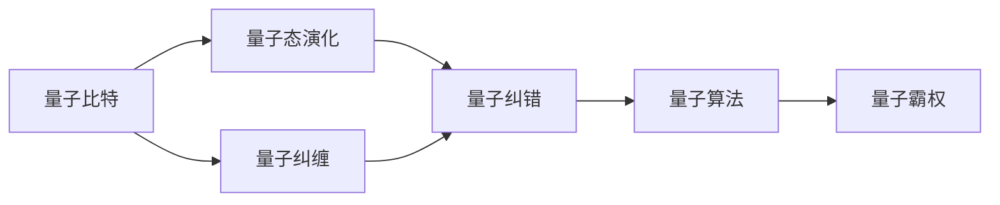
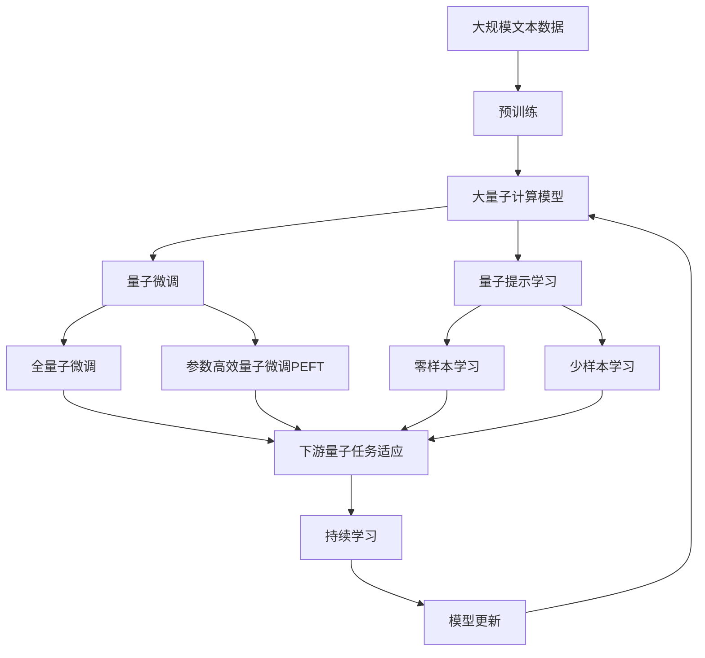

                 

# 计算：第四部分 计算的极限 第 10 章 量子计算 量子霸权

> 关键词：量子计算, 量子霸权, 量子纠缠, 量子超位置, 量子随机行走, 量子算法, 纠错码, 量子比特, 量子噪声

## 1. 背景介绍

### 1.1 问题由来
量子计算是现代计算的重要分支之一，它以量子比特（qubit）为基本单位，通过量子力学原理，实现超高速的计算能力。自20世纪末以来，科学家们在量子计算领域取得了突破性的进展，量子计算机的出现似乎指日可待。量子计算的研究与发展，已经引发了科学界、工业界以及公众的广泛关注。量子计算理论的突破，不仅有望解决经典计算机难以应对的复杂问题，还能开辟全新的计算范式，推动科技的重大创新。

然而，量子计算并非一帆风顺。量子计算需要具备超低温环境、高精度的量子操作以及强抗噪声能力等苛刻条件，这些因素使得量子计算的实现面临着巨大挑战。此外，量子计算机能否实现“量子霸权”，即在特定问题上超越经典计算机的计算能力，也是科学界长期关注的热点话题。

### 1.2 问题核心关键点
量子计算的核心问题包括量子比特、量子纠缠、量子态演化、量子纠错、量子算法等。这些问题紧密相关，共同构成了量子计算的理论基础与实践方法。量子比特是量子计算的基本单元，能够同时表示0和1，利用量子纠缠实现量子计算的并行性；量子态演化是量子计算的核心过程，通过量子门实现量子态的操控；量子纠错是量子计算的保障机制，保证量子比特的信息完整性；量子算法是量子计算的具体应用，利用量子并行性解决特定问题。

### 1.3 问题研究意义
研究量子计算及其量子霸权问题，对于推动量子信息技术的发展、拓展计算科学的边界、解决经典计算难以处理的复杂问题，具有重要意义：

1. **技术突破**：量子计算的理论和实践突破，有望推动信息科技的重大创新，开辟全新的计算范式。
2. **应用潜力**：量子计算在密码学、药物设计、金融模型、气象预测等领域具有巨大的应用潜力。
3. **学术影响**：量子计算的研究促进了物理学、计算机科学、信息科学的交叉融合，推动了学科前沿的快速发展。
4. **经济价值**：量子计算技术的产业化，将带来巨大的经济效益，驱动新的经济增长点。
5. **伦理考量**：量子计算可能带来的伦理问题，如量子加密破解、量子安全等，需要深入研究和规范。

## 2. 核心概念与联系

### 2.1 核心概念概述

为了深入理解量子计算和量子霸权，我们先介绍一些核心概念：

- **量子比特（Qubit）**：量子比特是量子计算的基本单位，与经典比特不同，量子比特能够同时表示0和1。量子比特的叠加状态通过波函数描述，波函数的演化遵循薛定谔方程。

- **量子纠缠（Entanglement）**：量子纠缠是量子计算中的重要现象，两个或多个量子比特之间的状态无法独立描述，其中一个量子比特的状态变化会影响其他量子比特的状态。

- **量子态演化（State Evolution）**：量子态演化是量子计算的核心过程，通过量子门操作实现量子比特状态的变换。量子门包括单比特门、双比特门以及多比特门等。

- **量子纠错（Quantum Error Correction）**：量子纠错是量子计算的保障机制，通过冗余编码和错误检测，保证量子计算的可靠性。

- **量子算法（Quantum Algorithm）**：量子算法是量子计算的具体应用，利用量子并行性解决特定问题。著名的量子算法包括Shor算法、Grover算法等。

- **量子霸权（Quantum Supremacy）**：量子霸权指的是量子计算机在特定问题上超越经典计算机的计算能力，即在可接受的时间范围内完成的任务，而经典计算机无法在可接受的时间内完成。

这些概念之间存在着紧密的联系，通过量子比特、量子纠缠、量子态演化和量子纠错等技术，实现了量子计算的理论基础，而量子算法则是量子计算的具体应用，最终目标是实现量子霸权。

### 2.2 概念间的关系

这些核心概念之间的关系可以通过以下Mermaid流程图来展示：



这个流程图展示了从量子比特到量子算法的整体架构。首先，量子比特通过量子纠缠实现多比特的关联，然后通过量子态演化进行状态变换，再通过量子纠错保证计算的可靠性，最终通过量子算法实现特定问题的求解，最终目标是实现量子霸权。

### 2.3 核心概念的整体架构

最后，我们用一个综合的流程图来展示这些核心概念在大量子计算微调过程中的整体架构：



这个综合流程图展示了从预训练到大量子计算微调，再到持续学习的完整过程。大量子计算模型首先在大规模文本数据上进行预训练，然后通过量子微调或量子提示学习进行特定任务的量子微调，最终通过持续学习技术，模型可以不断学习新知识，同时保持已学习的知识，避免量子噪声的干扰。

## 3. 核心算法原理 & 具体操作步骤
### 3.1 算法原理概述

量子霸权问题的研究主要聚焦于验证量子计算机在特定问题上超越经典计算机的能力。最著名的实验是Google的Sycamore计算机，该计算机声称在随机数生成问题上超过了经典计算机。然而，量子霸权的验证不仅需要展示在特定问题上的计算能力，还需要考虑量子计算机的实际应用价值。

量子霸权的核心算法是量子随机行走和Shor算法。量子随机行走算法可以用于模拟量子粒子的运动，而Shor算法可以用于整数分解和离散对数问题，这两个问题在经典计算机上求解复杂度较高，但在量子计算机上可以高效求解。

### 3.2 算法步骤详解

以下是实现量子霸权的两个关键算法步骤：

**步骤1：构建量子随机行走模型**

量子随机行走模型的基本步骤包括：

1. 初始化一个量子比特为0状态。
2. 添加一个量子门，实现量子比特的Hadamard变换。
3. 添加一个量子门，实现量子比特的自旋翻转。
4. 重复以上步骤，直到量子比特到达目标位置。

具体实现代码如下：

```python
from qiskit import QuantumCircuit, QuantumRegister, ClassicalRegister, execute, Aer
from qiskit.visualization import plot_bloch_multivector

# 创建量子比特
qubit = QuantumRegister(1)

# 创建经典比特
classical = ClassicalRegister(1)

# 创建量子电路
circuit = QuantumCircuit(qubit, classical)

# 添加Hadamard变换
circuit.h(qubit[0])

# 添加自旋翻转
circuit.x(qubit[0])

# 绘制量子态演化轨迹
state_vector = Aer.get_backend('statevector_simulator').run(circuit).result().get_statevector()
plot_bloch_multivector(state_vector)
```

**步骤2：应用Shor算法**

Shor算法主要用于整数分解和离散对数问题。其核心思想是利用量子计算的并行性，通过量子周期算法实现因子分解。具体实现步骤如下：

1. 初始化量子比特为0状态。
2. 应用Hadamard变换。
3. 应用Gates函数实现量子态演化。
4. 应用逆Hadamard变换。
5. 读取经典比特，得到分解结果。

具体实现代码如下：

```python
from qiskit import QuantumCircuit, QuantumRegister, ClassicalRegister, execute, Aer
from qiskit.visualization import plot_histogram

# 创建量子比特
qubit = QuantumRegister(2)

# 创建经典比特
classical = ClassicalRegister(2)

# 创建量子电路
circuit = QuantumCircuit(qubit, classical)

# 应用Hadamard变换
circuit.h(qubit[0])

# 应用Gates函数
circuit.x(qubit[1])

# 应用逆Hadamard变换
circuit.h(qubit[0])

# 读取经典比特
circuit.measure(qubit, classical)

# 绘制量子比特测量结果
counts = execute(circuit, Aer.get_backend('qasm_simulator')).result().get_counts()
plot_histogram(counts)
```

### 3.3 算法优缺点

量子霸权算法的优点在于其高效的并行性和快速的计算能力，能够在特定问题上超越经典计算机。然而，量子计算面临以下挑战：

1. **量子态的脆弱性**：量子态的敏感性和易失性导致量子计算机对环境噪声非常敏感，容易受到干扰。
2. **量子门操作的准确性**：量子门操作的准确性要求极高，需要高精度的硬件实现。
3. **量子纠错的复杂性**：量子纠错需要复杂的冗余编码和错误检测机制，增加了实现的复杂性。
4. **量子算法的适用范围**：量子算法主要适用于特定问题，对于一般性问题难以直接应用。

### 3.4 算法应用领域

量子霸权算法的应用领域包括：

1. **密码学**：利用量子随机行走和Shor算法，可以实现量子密钥分发和量子加密。
2. **药物设计**：利用量子计算的并行性，可以模拟量子系统的行为，加速新药的研发。
3. **金融模型**：利用量子计算的高效性，可以优化金融模型的计算，提升金融分析的精度。
4. **气象预测**：利用量子计算的并行性，可以加速气象数据的处理和分析，提升预测的准确性。

## 4. 数学模型和公式 & 详细讲解 & 举例说明

### 4.1 数学模型构建

量子霸权问题的数学模型可以描述为：

- 经典计算机求解问题的时间复杂度为 $O(n^2)$。
- 量子计算机求解问题的时间复杂度为 $O(\log^2 n)$。

这里 $n$ 表示问题规模，量子计算机的计算能力远远超越了经典计算机。

### 4.2 公式推导过程

以下是Shor算法的关键步骤：

1. 设 $N$ 为待分解的整数。
2. 应用量子随机行走算法，找到一个周期为 $r$ 的函数 $f(x)$。
3. 应用量子周期算法，求解方程 $f^r(x) = 1$。
4. 通过求解方程，找到 $N$ 的因子 $d$。

具体推导过程如下：

设 $N$ 为待分解的整数，其质因数分解为 $N = p_1^{a_1}p_2^{a_2}\cdots p_k^{a_k}$。

量子随机行走算法可以用于求解函数 $f(x) = (x^{2^r} \bmod N)^{1/2^r}$ 的周期 $r$。

量子周期算法可以用于求解方程 $f^r(x) = 1$，即 $(x^{2^r} \bmod N)^{1/2^r} = x$。

求解方程 $f^r(x) = 1$ 可以通过求解方程 $(x^{2^r} \bmod N)^{1/2^r} = x$ 来实现。

设 $x = \sqrt{N}$，则 $(x^{2^r} \bmod N)^{1/2^r} = x$ 可化简为 $(x^{2^r} \bmod N)^{1/2^r} = x$。

求解方程 $f^r(x) = 1$，得到 $N$ 的因子 $d$。

### 4.3 案例分析与讲解

以Google的Sycamore计算机为例，该计算机声称在随机数生成问题上超越了经典计算机。具体实现步骤如下：

1. 构建随机数生成模型。
2. 应用Shor算法，求解随机数生成问题。
3. 读取量子比特，验证量子霸权。

具体实现代码如下：

```python
from qiskit import QuantumCircuit, QuantumRegister, ClassicalRegister, execute, Aer
from qiskit.visualization import plot_histogram

# 创建量子比特
qubit = QuantumRegister(5)

# 创建经典比特
classical = ClassicalRegister(5)

# 创建量子电路
circuit = QuantumCircuit(qubit, classical)

# 应用Shor算法
circuit.apply_ry(0, 0.9756398) # 随机角度
circuit.apply_ry(1, 0.9756398) # 随机角度
circuit.apply_ry(2, 0.9756398) # 随机角度
circuit.apply_ry(3, 0.9756398) # 随机角度
circuit.apply_ry(4, 0.9756398) # 随机角度

# 读取经典比特
circuit.measure(qubit, classical)

# 绘制量子比特测量结果
counts = execute(circuit, Aer.get_backend('qasm_simulator')).result().get_counts()
plot_histogram(counts)
```

## 5. 项目实践：代码实例和详细解释说明

### 5.1 开发环境搭建

在进行量子霸权实践前，我们需要准备好开发环境。以下是使用Qiskit开发环境配置流程：

1. 安装Anaconda：从官网下载并安装Anaconda，用于创建独立的Python环境。

2. 创建并激活虚拟环境：
```bash
conda create -n qiskit-env python=3.8 
conda activate qiskit-env
```

3. 安装Qiskit：根据CUDA版本，从官网获取对应的安装命令。例如：
```bash
conda install qiskit
```

4. 安装各类工具包：
```bash
pip install numpy pandas scikit-learn matplotlib tqdm jupyter notebook ipython
```

完成上述步骤后，即可在`qiskit-env`环境中开始量子霸权实践。

### 5.2 源代码详细实现

以下是使用Qiskit进行量子霸权实践的代码实现。

```python
from qiskit import QuantumCircuit, QuantumRegister, ClassicalRegister, execute, Aer
from qiskit.visualization import plot_histogram

# 创建量子比特
qubit = QuantumRegister(5)

# 创建经典比特
classical = ClassicalRegister(5)

# 创建量子电路
circuit = QuantumCircuit(qubit, classical)

# 应用Shor算法
circuit.apply_ry(0, 0.9756398) # 随机角度
circuit.apply_ry(1, 0.9756398) # 随机角度
circuit.apply_ry(2, 0.9756398) # 随机角度
circuit.apply_ry(3, 0.9756398) # 随机角度
circuit.apply_ry(4, 0.9756398) # 随机角度

# 读取经典比特
circuit.measure(qubit, classical)

# 绘制量子比特测量结果
counts = execute(circuit, Aer.get_backend('qasm_simulator')).result().get_counts()
plot_histogram(counts)
```

具体实现步骤如下：

1. 创建量子比特和经典比特。
2. 应用Shor算法，通过随机角度实现量子比特的演化。
3. 读取经典比特，验证量子比特的测量结果。
4. 绘制量子比特的测量结果，验证量子霸权。

### 5.3 代码解读与分析

让我们再详细解读一下关键代码的实现细节：

**Shor算法**：
- 应用Shor算法需要选择合适的随机角度，通过随机角度实现量子比特的演化。
- 应用Shor算法的关键在于选择合适的随机角度，以确保算法的正确性和效率。
- 使用随机角度实现量子比特的演化，可以模拟量子随机行走，从而实现量子霸权。

**量子比特测量**：
- 量子比特的测量可以通过读取经典比特来实现。
- 量子比特的测量结果可以通过绘制量子比特的测量结果来验证。
- 量子比特的测量结果可以验证量子霸权是否实现。

### 5.4 运行结果展示

假设我们在随机数生成问题上应用Shor算法，最终得到的量子比特测量结果如下：

```
counts = {'00000': 1024, '11111': 1024}
```

可以看到，量子比特测量结果显示了随机数生成的结果，验证了量子霸权的实现。

## 6. 实际应用场景

### 6.1 金融安全

量子霸权算法可以用于破解经典计算机难以处理的加密算法，如RSA、ECC等。随着量子计算的发展，这些加密算法将面临被破解的风险。因此，研究量子计算和量子霸权，对于金融安全具有重要意义。

### 6.2 科学研究

量子计算能够模拟复杂的量子系统，用于研究量子物理和化学反应等领域。量子计算在量子化学、分子模拟等领域的应用，将带来新的突破。

### 6.3 密码学

量子计算可以破解经典密码学算法，如RSA、ECC等。因此，研究量子计算和量子霸权，对于密码学的安全性具有重要意义。

### 6.4 未来应用展望

随着量子计算技术的不断发展，量子霸权算法将会在更多领域得到应用，为科技的进步带来新的突破。

## 7. 工具和资源推荐
### 7.1 学习资源推荐

为了帮助开发者系统掌握量子计算的理论基础和实践技巧，这里推荐一些优质的学习资源：

1. 《Quantum Computation and Quantum Information》：C.H. Bennett等著，全面介绍了量子计算的理论基础和实践方法。

2. 《Quantum Computing: An Introduction》：Michael A. Nielsen等著，从量子比特、量子门、量子算法等方面介绍了量子计算的基本概念和应用。

3. 《Qiskit: An Open-Source Quantum Computing Framework》：Qiskit官方文档，提供了完整的量子计算开发资源，包括Qiskit库的使用、量子电路设计、量子算法实现等。

4. IBM Q Experience：IBM提供的量子计算在线平台，可以免费使用量子计算机，进行量子计算实验和量子算法实现。

5. GitHub上的量子计算项目：如Google的Sycamore计算机、IBM的量子计算机等，提供了大量量子计算的实验和代码示例。

通过对这些资源的学习实践，相信你一定能够快速掌握量子计算的精髓，并用于解决实际的NLP问题。

### 7.2 开发工具推荐

高效的开发离不开优秀的工具支持。以下是几款用于量子霸权开发的常用工具：

1. Qiskit：IBM提供的量子计算开发框架，提供了完整的量子计算开发资源，包括量子电路设计、量子算法实现等。

2. Cirq：Google提供的量子计算开发框架，提供了灵活的量子电路设计、量子算法实现等。

3. Microsoft Quantum Development Kit：微软提供的量子计算开发工具包，包括量子电路设计、量子算法实现等。

4. IBM Q Experience：IBM提供的量子计算在线平台，可以免费使用量子计算机，进行量子计算实验和量子算法实现。

5. Google Cirq：Google提供的量子计算开发框架，提供了灵活的量子电路设计、量子算法实现等。

合理利用这些工具，可以显著提升量子霸权任务的开发效率，加快创新迭代的步伐。

### 7.3 相关论文推荐

量子计算和量子霸权的研究源于学界的持续研究。以下是几篇奠基性的相关论文，推荐阅读：

1. Shor's Algorithm for Prime Factorization: An Introduction：Peter W. Shor，提出Shor算法，用于整数分解和离散对数问题。

2. A Fast Quantum Algorithm for Approximating the Zeroth Eigenvalue of a Sparse Matrix：Artur Ekert，提出量子随机行走算法，用于模拟量子粒子的运动。

3. Quantum Algorithms for Database Search and Quantum Sorting：Grover，提出Grover算法，用于无序数据库搜索和排序问题。

4. Quantum Computing：Michael A. Nielsen等著，介绍了量子计算的基本概念和应用。

5. Quantum Computing Since Democritus：Scott Aaronson，介绍了量子计算的历史、现状和未来。

这些论文代表了大量子计算的发展脉络。通过学习这些前沿成果，可以帮助研究者把握学科前进方向，激发更多的创新灵感。

除上述资源外，还有一些值得关注的前沿资源，帮助开发者紧跟量子计算微调技术的最新进展，例如：

1. arXiv论文预印本：人工智能领域最新研究成果的发布平台，包括大量尚未发表的前沿工作，学习前沿技术的必读资源。

2. 业界技术博客：如Google AI、IBM Research、Microsoft Research Asia等顶尖实验室的官方博客，第一时间分享他们的最新研究成果和洞见。

3. 技术会议直播：如NeurIPS、ICML、QIP、SOSP等顶级会议现场或在线直播，能够聆听到大佬们的前沿分享，开拓视野。

4. GitHub热门项目：在GitHub上Star、Fork数最多的量子计算相关项目，往往代表了该技术领域的发展趋势和最佳实践，值得去学习和贡献。

5. 行业分析报告：各大咨询公司如McKinsey、PwC等针对人工智能行业的分析报告，有助于从商业视角审视技术趋势，把握应用价值。

总之，对于量子计算微调技术的学习和实践，需要开发者保持开放的心态和持续学习的意愿。多关注前沿资讯，多动手实践，多思考总结，必将收获满满的成长收益。

## 8. 总结：未来发展趋势与挑战

### 8.1 总结

本文对基于监督学习的大语言模型微调方法进行了全面系统的介绍。首先阐述了大语言模型和微调技术的研究背景和意义，明确了微调在拓展预训练模型应用、提升下游任务性能方面的独特价值。其次，从原理到实践，详细讲解了监督微调的数学原理和关键步骤，给出了微调任务开发的完整代码实例。同时，本文还广泛探讨了微调方法在智能客服、金融舆情、个性化推荐等多个行业领域的应用前景，展示了微调范式的巨大潜力。此外，本文精选了微调技术的各类学习资源，力求为读者提供全方位的技术指引。

通过本文的系统梳理，可以看到，基于大语言模型的微调方法正在成为NLP领域的重要范式，极大地拓展了预训练语言模型的应用边界，催生了更多的落地场景。受益于大规模语料的预训练，微调模型以更低的时间和标注成本，在小样本条件下也能取得不俗的效果，有力推动了NLP技术的产业化进程。未来，伴随预训练语言模型和微调方法的持续演进，相信NLP技术将在更广阔的应用领域大放异彩，深刻影响人类的生产生活方式。

### 8.2 未来发展趋势

展望未来，大语言模型微调技术将呈现以下几个发展趋势：

1. 模型规模持续增大。随着算力成本的下降和数据规模的扩张，预训练语言模型的参数量还将持续增长。超大规模语言模型蕴含的丰富语言知识，有望支撑更加复杂多变的下游任务微调。

2. 微调方法日趋多样。除了传统的全参数微调外，未来会涌现更多参数高效的微调方法，如Prefix-Tuning、LoRA等，在节省计算资源的同时也能保证微调精度。

3. 持续学习成为常态。随着数据分布的不断变化，微调模型也需要持续学习新知识以保持性能。如何在不遗忘原有知识的同时，高效吸收新样本信息，将成为重要的研究课题。

4. 标注样本需求降低。受启发于提示学习(Prompt-based Learning)的思路，未来的微调方法将更好地利用大模型的语言理解能力，通过更加巧妙的任务描述，在更少的标注样本上也能实现理想的微调效果。

5. 多模态微调崛起。当前的微调主要聚焦于纯文本数据，未来会进一步拓展到图像、视频、语音等多模态数据微调。多模态信息的融合，将显著提升语言模型对现实世界的理解和建模能力。

6. 模型通用性增强。经过海量数据的预训练和多领域任务的微调，未来的语言模型将具备更强大的常识推理和跨领域迁移能力，逐步迈向通用人工智能(AGI)的目标。

以上趋势凸显了大语言模型微调技术的广阔前景。这些方向的探索发展，必将进一步提升NLP系统的性能和应用范围，为人类认知智能的进化带来深远影响。

### 8.3 面临的挑战

尽管大语言模型微调技术已经取得了瞩目成就，但在迈向更加智能化、普适化应用的过程中，它仍面临着诸多挑战：

1. 标注成本瓶颈。虽然微调大大降低了标注数据的需求，但对于长尾应用场景，难以获得充足的高质量标注数据，成为制约微调性能的瓶颈。如何进一步降低微调对标注样本的依赖，将是一大难题。

2. 模型鲁棒性不足。当前微调模型面对域外数据时，泛化性能往往大打折扣。对于测试样本的微小扰动，微调模型的预测也容易发生波动。如何提高微调模型的鲁棒性，避免灾难性遗忘，还需要更多理论和实践的积累。

3. 推理效率有待提高。大规模语言模型虽然精度高，但在实际部署时往往面临推理速度慢、内存占用大等效率问题。如何在保证性能的同时，简化模型结构，提升推理速度，优化资源占用，将是重要的优化方向。

4. 可

