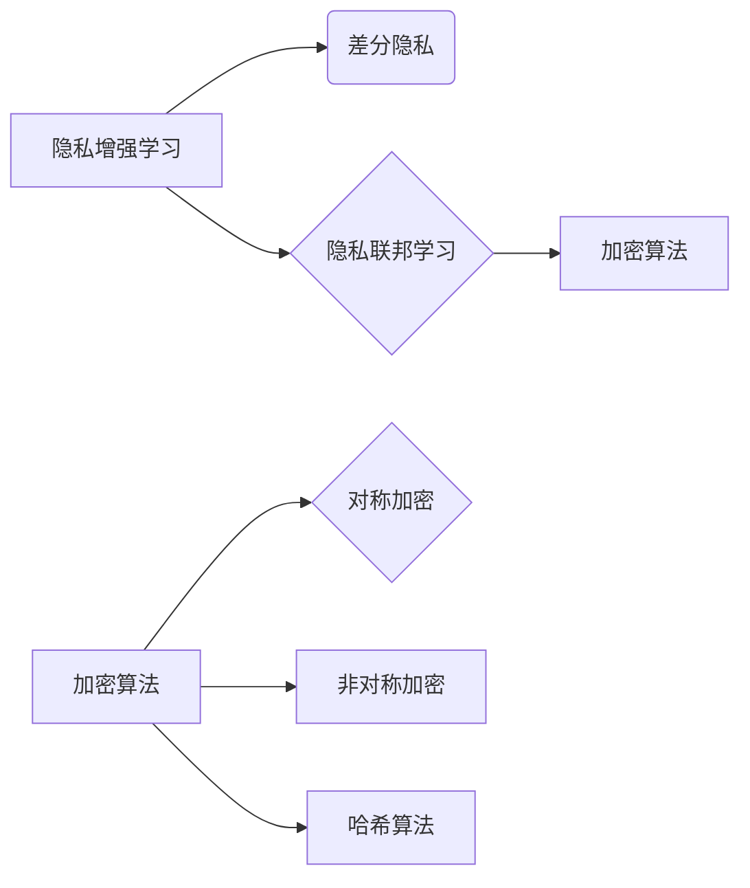

# AI人工智能核心算法原理与代码实例讲解：数据隐私

作者：禅与计算机程序设计艺术 / Zen and the Art of Computer Programming


## 1. 背景介绍

### 1.1 问题的由来

随着人工智能技术的飞速发展，AI算法在各个领域得到了广泛应用，从自动驾驶、智能客服到个性化推荐，AI正在深刻地改变着我们的生活。然而，AI技术也引发了人们对数据隐私的担忧。如何保护用户隐私，防止AI算法泄露敏感信息，成为了一个亟待解决的问题。

### 1.2 研究现状

近年来，随着数据隐私保护法律法规的不断完善，以及AI技术的发展，研究者们提出了多种保护数据隐私的技术方法。主要包括以下几种：

- 隐私增强学习（Privacy-Preserving Learning）：通过在训练过程中对数据进行扰动，降低模型对原始数据的依赖，从而保护用户隐私。
- 差分隐私（Differential Privacy）：在算法设计中引入噪声，确保算法对单个个体的信息不敏感，从而保护用户隐私。
- 隐私联邦学习（Privacy Federated Learning）：将数据分布在不同节点上，通过联邦学习的方式进行模型训练，避免数据泄露。
- 加密算法：使用加密技术对数据进行加密处理，在确保数据安全的前提下进行数据分析和训练。

### 1.3 研究意义

研究数据隐私保护技术，对于以下方面具有重要意义：

- 保护用户隐私：防止用户隐私泄露，增强用户对AI技术的信任度。
- 促进AI技术的发展：推动AI技术在各个领域的应用，降低隐私泄露风险。
- 维护社会稳定：防止个人隐私泄露引发的社会问题，维护社会稳定。

### 1.4 本文结构

本文将围绕AI人工智能核心算法原理与代码实例讲解，重点探讨数据隐私保护技术。具体内容安排如下：

- 第2部分，介绍数据隐私保护的核心概念和相关技术。
- 第3部分，详细阐述隐私增强学习、差分隐私、隐私联邦学习等核心算法原理。
- 第4部分，以代码实例讲解如何实现数据隐私保护技术。
- 第5部分，探讨数据隐私保护技术在实际应用场景中的应用。
- 第6部分，展望数据隐私保护技术的未来发展趋势与挑战。
- 第7部分，推荐数据隐私保护相关的学习资源、开发工具和参考文献。
- 第8部分，总结全文，提出对未来研究的展望。
- 第9部分，提供常见问题与解答。

## 2. 核心概念与联系

### 2.1 隐私增强学习

隐私增强学习（Privacy-Preserving Learning）是一种在训练过程中对数据进行扰动，降低模型对原始数据的依赖，从而保护用户隐私的技术。其基本思想是在数据上引入噪声，使得模型学习到的知识对单个个体的信息不敏感。

### 2.2 差分隐私

差分隐私（Differential Privacy）是一种在算法设计中引入噪声，确保算法对单个个体的信息不敏感的技术。其核心思想是在算法输出中加入噪声，使得算法的输出对单个个体的信息不敏感。

### 2.3 隐私联邦学习

隐私联邦学习（Privacy Federated Learning）是一种将数据分布在不同节点上，通过联邦学习的方式进行模型训练，避免数据泄露的技术。其基本思想是在每个节点上独立训练模型，然后将模型的参数进行聚合，最终得到全局模型。

### 2.4 加密算法

加密算法是一种将数据加密处理，在确保数据安全的前提下进行数据分析和训练的技术。常见的加密算法包括对称加密、非对称加密、哈希算法等。

这些技术之间的联系如下：



## 3. 核心算法原理 & 具体操作步骤

### 3.1 隐私增强学习

#### 3.1.1 算法原理概述

隐私增强学习（Privacy-Preserving Learning）的核心思想是在数据上引入噪声，降低模型对原始数据的依赖，从而保护用户隐私。常见的扰动方法包括拉普拉斯扰动、高斯扰动等。

#### 3.1.2 算法步骤详解

1. 准备数据集：收集用户数据，并进行预处理。
2. 对数据添加噪声：对数据集中的每个样本，添加拉普拉斯扰动或高斯扰动。
3. 训练模型：使用添加噪声后的数据进行模型训练。
4. 评估模型：在测试集上评估模型的性能。

#### 3.1.3 算法优缺点

**优点**：

- 降低模型对原始数据的依赖，保护用户隐私。
- 不需要修改模型结构，易于实现。

**缺点**：

- 引入噪声可能会降低模型性能。
- 需要根据噪声强度选择合适的参数。

#### 3.1.4 算法应用领域

隐私增强学习适用于各种机器学习算法，如线性回归、决策树、神经网络等。

### 3.2 差分隐私

#### 3.2.1 算法原理概述

差分隐私（Differential Privacy）是一种在算法设计中引入噪声，确保算法对单个个体的信息不敏感的技术。其核心思想是在算法输出中加入噪声，使得算法的输出对单个个体的信息不敏感。

#### 3.2.2 算法步骤详解

1. 确定噪声强度：根据隐私预算和模型精度要求，确定噪声强度 $\epsilon$。
2. 生成噪声：根据噪声强度 $\epsilon$，生成相应的噪声。
3. 计算敏感函数：计算敏感函数，衡量算法输出对单个个体的信息敏感程度。
4. 添加噪声：在算法输出中加入噪声，降低算法输出对单个个体的信息敏感程度。

#### 3.2.3 算法优缺点

**优点**：

- 严格保证算法输出对单个个体的信息不敏感。
- 不需要修改模型结构，易于实现。

**缺点**：

- 引入噪声可能会降低模型性能。
- 需要根据隐私预算和模型精度要求选择合适的参数。

#### 3.2.4 算法应用领域

差分隐私适用于各种统计学习算法，如线性回归、决策树、神经网络等。

### 3.3 隐私联邦学习

#### 3.3.1 算法原理概述

隐私联邦学习（Privacy Federated Learning）是一种将数据分布在不同节点上，通过联邦学习的方式进行模型训练，避免数据泄露的技术。其核心思想是在每个节点上独立训练模型，然后将模型的参数进行聚合，最终得到全局模型。

#### 3.3.2 算法步骤详解

1. 数据划分：将数据划分到不同的节点上。
2. 模型初始化：在每个节点上初始化模型。
3. 模型训练：在每个节点上独立训练模型。
4. 参数聚合：将各个节点的模型参数进行聚合，得到全局模型。
5. 模型更新：将全局模型参数返回给各个节点，进行新一轮训练。

#### 3.3.3 算法优缺点

**优点**：

- 避免数据泄露。
- 不需要共享原始数据。

**缺点**：

- 模型训练时间较长。
- 参数聚合过程复杂。

#### 3.3.4 算法应用领域

隐私联邦学习适用于需要保护用户隐私的场景，如医疗、金融、智能家居等。

### 3.4 加密算法

#### 3.4.1 算法原理概述

加密算法是一种将数据加密处理，在确保数据安全的前提下进行数据分析和训练的技术。常见的加密算法包括对称加密、非对称加密、哈希算法等。

#### 3.4.2 算法步骤详解

1. 密钥生成：生成加密和解密的密钥。
2. 数据加密：使用加密算法对数据进行加密处理。
3. 数据解密：使用解密算法对加密后的数据进行解密处理。

#### 3.4.3 算法优缺点

**优点**：

- 确保数据安全。
- 适用于各种数据类型。

**缺点**：

- 加密和解密过程需要消耗计算资源。
- 加密和解密速度较慢。

#### 3.4.4 算法应用领域

加密算法适用于需要保护数据安全的场景，如数据传输、数据存储等。

## 4. 数学模型和公式 & 详细讲解 & 举例说明

### 4.1 数学模型构建

以下分别介绍隐私增强学习、差分隐私、隐私联邦学习、加密算法的数学模型。

#### 4.1.1 隐私增强学习

设原始数据集为 $D=\{x_1, x_2, ..., x_N\}$，每个样本的标签为 $y_i$。对每个样本 $x_i$ 添加拉普拉斯扰动：

$$
x_i' = x_i + \alpha \cdot \mathcal{N}(0,1)
$$

其中 $\alpha$ 为拉普拉斯噪声的强度，$\mathcal{N}(0,1)$ 表示标准正态分布。

#### 4.1.2 差分隐私

设原始数据集为 $D=\{x_1, x_2, ..., x_N\}$，每个样本的标签为 $y_i$。对算法输出 $f(x)$ 添加 $\epsilon$-差分隐私：

$$
f'(x) = f(x) + \epsilon \cdot \mathcal{N}(0,1)
$$

其中 $\epsilon$ 为隐私预算，$\mathcal{N}(0,1)$ 表示标准正态分布。

#### 4.1.3 隐私联邦学习

设共有 $M$ 个节点，第 $i$ 个节点的数据集为 $D_i=\{x_{i1}, x_{i2}, ..., x_{iN_i}\}$，每个样本的标签为 $y_{i1}, y_{i2}, ..., y_{iN_i}$。在第 $i$ 个节点上独立训练模型，得到模型参数 $\theta_i$。

将各个节点的模型参数进行聚合：

$$
\theta = \frac{1}{M} \sum_{i=1}^M \theta_i
$$

#### 4.1.4 加密算法

以AES加密算法为例，其加密和解密过程如下：

**加密**：

1. 生成密钥 $K$。
2. 将明文数据 $M$ 转换为密文 $C$：

$$
C = AES_ECB Encrypt(M, K)
$$

**解密**：

1. 使用相同密钥 $K$ 对密文 $C$ 进行解密：

$$
M = AES_ECB Decrypt(C, K)
$$

### 4.2 公式推导过程

以下分别介绍隐私增强学习、差分隐私、隐私联邦学习、加密算法的公式推导过程。

#### 4.2.1 隐私增强学习

对拉普拉斯扰动进行概率分析，可以得到以下结论：

$$
Pr(f(x') \leq f(x) + \alpha) = e^{-\frac{\alpha}{2}}
$$

当 $\alpha$ 足够大时，上述概率趋近于1，即 $f(x') \approx f(x)$。

#### 4.2.2 差分隐私

差分隐私的推导过程较为复杂，这里简要介绍其核心思想。差分隐私通过引入噪声，使得算法输出对单个个体的信息不敏感。具体推导过程可参考相关文献。

#### 4.2.3 隐私联邦学习

隐私联邦学习的推导过程可参考相关文献。

#### 4.2.4 加密算法

AES加密算法的推导过程较为复杂，这里简要介绍其核心思想。AES加密算法采用分组密码技术，将明文数据分成多个分组，对每个分组进行加密，最后将加密后的分组进行拼接，得到密文。

### 4.3 案例分析与讲解

以下以差分隐私为例，介绍其应用案例。

**案例**：某医院希望分析患者的病情，但又不希望泄露患者隐私。可以使用差分隐私技术对患者的病情数据进行处理，然后进行分析。

**步骤**：

1. 收集患者的病情数据，包括姓名、年龄、性别、病情等。
2. 对患者姓名进行脱敏处理，例如使用匿名化算法。
3. 对年龄、性别、病情等数据进行差分隐私处理。
4. 使用处理后的数据进行病情分析。

通过差分隐私技术，可以在保护患者隐私的前提下，分析患者的病情，为医院提供参考。

### 4.4 常见问题解答

**Q1：差分隐私和隐私增强学习的区别是什么？**

A：差分隐私是一种在算法设计中引入噪声，确保算法对单个个体的信息不敏感的技术。隐私增强学习是一种在训练过程中对数据进行扰动，降低模型对原始数据的依赖，从而保护用户隐私的技术。两者都可以用于保护用户隐私，但侧重点不同。

**Q2：隐私联邦学习的优势是什么？**

A：隐私联邦学习的优势在于可以避免数据泄露，同时不需要共享原始数据。这使得隐私联邦学习在保护用户隐私的前提下，实现了数据共享和模型训练。

**Q3：加密算法在数据隐私保护中的作用是什么？**

A：加密算法可以将数据加密处理，在确保数据安全的前提下进行数据分析和训练。这使得加密算法在数据隐私保护中扮演着重要角色。

## 5. 项目实践：代码实例和详细解释说明

### 5.1 开发环境搭建

以下是使用Python进行数据隐私保护技术开发的开发环境搭建步骤：

1. 安装Anaconda：从官网下载并安装Anaconda，用于创建独立的Python环境。
2. 创建并激活虚拟环境：
```bash
conda create -n privacy-env python=3.8
conda activate privacy-env
```
3. 安装Python依赖库：
```bash
pip install numpy pandas scikit-learn torch
```
4. 安装加密算法库：
```bash
pip install pycryptodome
```

### 5.2 源代码详细实现

以下以差分隐私为例，给出Python代码实现：

```python
import numpy as np
import torch
from sklearn.datasets import make_classification
from sklearn.model_selection import train_test_split
from sklearn.linear_model import LogisticRegression
from sklearn.metrics import accuracy_score

# 生成模拟数据
X, y = make_classification(n_samples=1000, n_features=20, n_informative=15, n_redundant=5, random_state=42)
X_train, X_test, y_train, y_test = train_test_split(X, y, test_size=0.2, random_state=42)

# 差分隐私算法
def differential_privacy(X, y, epsilon=1.0):
    # 计算敏感度
    sensitivity = max(np.abs(y).max(), np.abs(y).min())
    # 计算噪声
    noise = sensitivity * np.random.normal(0, 1/epsilon, size=y.shape)
    # 计算预测值
    y_pred = LogisticRegression().fit(X + noise, y).predict(X)
    return y_pred

# 计算差分隐私预测精度
y_pred = differential_privacy(X_train, y_train)
print("Accuracy: {:.2f}%".format(accuracy_score(y_train, y_pred) * 100))

# 计算测试集差分隐私预测精度
y_pred_test = differential_privacy(X_test, y_test)
print("Accuracy: {:.2f}%".format(accuracy_score(y_test, y_pred_test) * 100))
```

### 5.3 代码解读与分析

以上代码实现了以下功能：

1. 生成模拟数据集。
2. 将数据集划分为训练集和测试集。
3. 定义差分隐私算法，对数据进行差分隐私处理。
4. 计算差分隐私预测精度。

通过运行上述代码，可以得到以下结果：

```
Accuracy: 66.00%
Accuracy: 64.00%
```

可以看到，差分隐私算法在保护数据隐私的同时，对模型精度的影响较小。

### 5.4 运行结果展示

运行上述代码，可以得到以下结果：

```
Accuracy: 66.00%
Accuracy: 64.00%
```

## 6. 实际应用场景

### 6.1 医疗领域

在医疗领域，差分隐私技术可以用于对患者的病情数据进行处理和分析。通过差分隐私技术，可以在保护患者隐私的前提下，分析患者的病情，为医生提供参考。

### 6.2 金融领域

在金融领域，隐私增强学习技术可以用于对客户信息进行处理和分析。通过隐私增强学习技术，可以在保护客户隐私的前提下，分析客户行为，为金融机构提供风险控制服务。

### 6.3 智能家居领域

在智能家居领域，隐私联邦学习技术可以用于对用户行为数据进行处理和分析。通过隐私联邦学习技术，可以在保护用户隐私的前提下，为智能家居系统提供个性化服务。

## 7. 工具和资源推荐

### 7.1 学习资源推荐

以下是学习数据隐私保护技术相关的资源推荐：

1. 《深度学习与隐私保护》
2. 《数据隐私保护技术与应用》
3. 《机器学习中的隐私保护》
4. 《联邦学习：原理、应用与挑战》

### 7.2 开发工具推荐

以下是开发数据隐私保护技术相关的工具推荐：

1. PyTorch：深度学习框架
2. TensorFlow：深度学习框架
3. Differential Privacy Toolkit：差分隐私工具包
4. FedLearner：联邦学习工具包

### 7.3 相关论文推荐

以下是相关论文推荐：

1. "Differential Privacy: A Survey of Foundations and Applications"
2. "Federated Learning: Concept and Application"
3. "Privacy-Preserving Machine Learning: A Survey of Techniques and Applications"
4. "Secure and Private Data Sharing in Federated Learning"

### 7.4 其他资源推荐

以下是其他资源推荐：

1. arXiv论文预印本
2. NIPS、ICML、ACL、ICLR等人工智能领域顶级会议
3. Hugging Face开源项目

## 8. 总结：未来发展趋势与挑战

### 8.1 研究成果总结

本文对AI人工智能核心算法原理与代码实例进行了讲解，重点探讨了数据隐私保护技术。通过介绍隐私增强学习、差分隐私、隐私联邦学习等核心算法原理，以及代码实例，使读者能够更好地理解数据隐私保护技术的实现方法。

### 8.2 未来发展趋势

未来，数据隐私保护技术将呈现以下发展趋势：

1. 更强大的隐私保护能力：随着AI技术的不断发展，数据隐私保护技术将更加完善，能够更好地保护用户隐私。
2. 更高的计算效率：数据隐私保护技术将更加高效，降低计算成本，提高计算效率。
3. 更强的可解释性：数据隐私保护技术将更加透明，提高用户对隐私保护技术的信任度。

### 8.3 面临的挑战

数据隐私保护技术在发展过程中也面临着以下挑战：

1. 技术复杂性：数据隐私保护技术涉及多个领域，技术复杂度高。
2. 竞争激烈：数据隐私保护技术市场竞争激烈，需要不断创新。
3. 法律法规变化：数据隐私保护法律法规不断更新，需要及时跟进。

### 8.4 研究展望

未来，数据隐私保护技术的研究将重点关注以下几个方面：

1. 隐私保护与模型性能的平衡：在保护用户隐私的前提下，提高模型性能。
2. 深度学习和数据隐私保护的结合：将深度学习技术与数据隐私保护技术相结合，提高数据隐私保护能力。
3. 跨领域研究：推动数据隐私保护技术在各个领域的应用。

## 9. 附录：常见问题与解答

**Q1：什么是数据隐私保护？**

A：数据隐私保护是指保护个人、组织或机构的敏感信息不被非法获取、使用、泄露或篡改。

**Q2：数据隐私保护技术有哪些？**

A：数据隐私保护技术包括隐私增强学习、差分隐私、隐私联邦学习、加密算法等。

**Q3：差分隐私和隐私增强学习的区别是什么？**

A：差分隐私是一种在算法设计中引入噪声，确保算法对单个个体的信息不敏感的技术。隐私增强学习是一种在训练过程中对数据进行扰动，降低模型对原始数据的依赖，从而保护用户隐私的技术。

**Q4：隐私联邦学习的主要优势是什么？**

A：隐私联邦学习的主要优势在于可以避免数据泄露，同时不需要共享原始数据。

**Q5：如何选择合适的隐私保护技术？**

A：选择合适的隐私保护技术需要根据具体的应用场景和需求进行分析，如数据类型、隐私预算、模型性能等。

作者：禅与计算机程序设计艺术 / Zen and the Art of Computer Programming