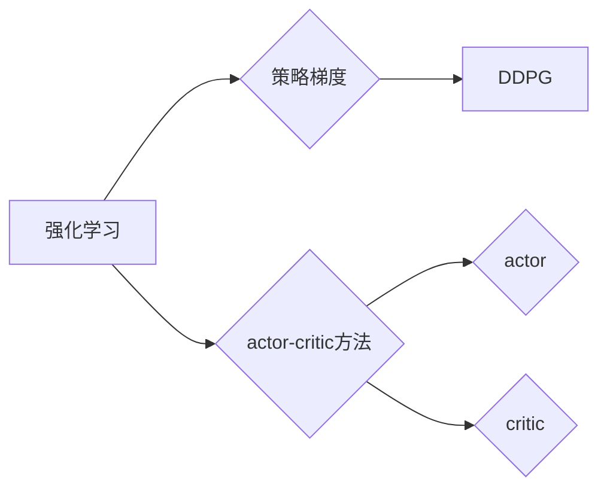

# DDPG原理与代码实例讲解

作者：禅与计算机程序设计艺术 / Zen and the Art of Computer Programming

## 1. 背景介绍
### 1.1 问题的由来

深度确定性策略梯度（Deep Deterministic Policy Gradient，DDPG）是深度强化学习（Deep Reinforcement Learning，DRL）领域的一种经典算法。它由Lillicrap等人在2016年提出，主要解决在连续动作空间中进行决策的强化学习问题。DDPG在许多任务中都取得了优异的性能，如Atari游戏、机器人控制等。

随着深度学习技术的发展，深度强化学习逐渐成为人工智能领域的研究热点。然而，对于许多高维连续动作空间的任务，传统的强化学习算法往往难以取得满意的效果。DDPG的出现为解决这类问题提供了一种新的思路和方法。

### 1.2 研究现状

DDPG算法自提出以来，受到了广泛关注和研究。研究者们针对DDPG算法进行了改进和扩展，提出了许多变种和改进方法。例如，DeepDeterministicPolicyGradientPlusPlus（DDPG++）、SoftActorCritic（SAC）等。

### 1.3 研究意义

DDPG算法在许多领域都具有重要意义，如自动驾驶、机器人控制、推荐系统等。以下列举几个方面的研究意义：

1. **解决连续动作空间决策问题**：DDPG算法能够有效地解决连续动作空间中的决策问题，为实际应用提供了新的解决方案。
2. **提高强化学习算法性能**：DDPG算法在许多任务上都取得了优异的性能，推动了强化学习技术的发展。
3. **推动人工智能应用**：DDPG算法的应用可以推动人工智能在各个领域的应用，如自动驾驶、机器人控制等。

### 1.4 本文结构

本文将系统介绍DDPG算法的原理、实现和应用，主要包括以下内容：

- 第2部分：介绍DDPG算法涉及的核心概念和联系。
- 第3部分：详细阐述DDPG算法的基本原理和具体操作步骤。
- 第4部分：讲解DDPG算法的数学模型和公式，并结合实例进行说明。
- 第5部分：给出DDPG算法的代码实例，并进行详细解读和分析。
- 第6部分：探讨DDPG算法在实际应用场景中的案例。
- 第7部分：推荐DDPG算法相关的学习资源、开发工具和参考文献。
- 第8部分：总结DDPG算法的研究成果、未来发展趋势和面临的挑战。
- 第9部分：附录，包含常见问题与解答。

## 2. 核心概念与联系

为了更好地理解DDPG算法，本节将介绍一些与之密切相关的重要概念。

### 2.1 强化学习

强化学习是一种机器学习方法，旨在通过与环境交互来学习最优策略。在强化学习中，学习器（agent）通过与环境的交互，不断学习如何选择动作，以实现长期回报最大化。

### 2.2 策略梯度

策略梯度是一种基于策略的强化学习算法，通过梯度下降法直接优化策略函数，以实现长期回报最大化。

### 2.3 actor-critic方法

actor-critic方法是一种常见的强化学习算法，由actor（策略网络）和critic（价值网络）两部分组成。actor负责产生动作，critic负责评估动作的好坏。

### 2.4 深度学习

深度学习是一种机器学习方法，通过学习大量数据中的特征和模式，从而实现对复杂问题的建模和预测。

以上概念的逻辑关系如下：



DDPG算法是策略梯度算法的一种，同时结合了actor-critic方法和深度学习技术。通过以上概念的联系，可以更好地理解DDPG算法的原理和实现。

## 3. 核心算法原理 & 具体操作步骤
### 3.1 算法原理概述

DDPG算法是一种基于actor-critic方法的深度强化学习算法，它由actor网络和critic网络两部分组成。actor网络负责生成动作，critic网络负责评估动作的好坏。

DDPG算法的主要思想如下：

1. 使用actor网络生成动作。
2. 将动作输入到环境中，获取奖励和状态。
3. 将状态和奖励输入到critic网络，计算当前动作的价值函数。
4. 将状态和动作输入到actor网络，计算目标价值函数。
5. 使用Adam优化器，通过策略梯度和目标价值函数的差值来更新actor网络和critic网络的参数。
6. 重复以上步骤，直到达到一定的迭代次数或满足其他终止条件。

### 3.2 算法步骤详解

以下是DDPG算法的具体操作步骤：

**Step 1: 初始化参数**

- 初始化actor网络和critic网络的参数。
- 初始化 replay buffer，用于存储状态、动作、奖励和下一个状态。
- 初始化超参数，如学习率、discount factor等。

**Step 2: actor网络生成动作**

- 使用actor网络输入当前状态，输出动作。

**Step 3: 将动作输入到环境中**

- 将生成的动作输入到环境中，获取奖励和下一个状态。

**Step 4: 将状态和奖励输入到critic网络**

- 将当前状态和奖励输入到critic网络，计算当前动作的价值函数。

**Step 5: 将状态和动作输入到actor网络**

- 将当前状态和动作输入到actor网络，计算目标价值函数。

**Step 6: 更新actor网络和critic网络**

- 使用Adam优化器，通过策略梯度和目标价值函数的差值来更新actor网络和critic网络的参数。

**Step 7: 重复以上步骤**

- 重复以上步骤，直到达到一定的迭代次数或满足其他终止条件。

### 3.3 算法优缺点

DDPG算法具有以下优点：

1. **适用于连续动作空间**：DDPG算法能够有效地解决连续动作空间中的决策问题。
2. **性能优越**：在许多任务上都取得了优异的性能。
3. **易于实现**：DDPG算法的实现相对简单，易于理解和应用。

DDPG算法也存在以下缺点：

1. **对参数敏感**：DDPG算法对超参数的选择比较敏感，需要通过经验进行调优。
2. **收敛速度慢**：DDPG算法的收敛速度相对较慢，需要较长的训练时间。
3. **数据量要求高**：DDPG算法需要较大的数据量来保证训练效果。

### 3.4 算法应用领域

DDPG算法在许多领域都取得了较好的应用效果，如：

- **机器人控制**：控制机器人执行复杂的运动任务，如行走、平衡等。
- **自动驾驶**：控制自动驾驶车辆的行驶路径和速度。
- **游戏**：控制游戏中的虚拟角色，如Atari游戏、棋类游戏等。
- **推荐系统**：根据用户的兴趣和行为，推荐合适的物品。

## 4. 数学模型和公式 & 详细讲解 & 举例说明
### 4.1 数学模型构建

DDPG算法的数学模型主要包括以下部分：

1. **actor网络**：actor网络是一个神经网络，它将状态映射到动作。

$$
\pi(\theta_{actor})(s) = \mu(s; \theta_{actor}) = \mu_1(s; \theta_{actor}) + \mu_2(s; \theta_{actor}) \cdot \mathcal{N}(0, I)
$$

其中，$\mu_1(s; \theta_{actor})$ 是动作的第一个分量，$\mu_2(s; \theta_{actor})$ 是动作的第二个分量，$\mathcal{N}(0, I)$ 表示正态分布。

2. **critic网络**：critic网络是一个神经网络，它将状态和动作映射到价值函数。

$$
V_{\theta_{critic}}(s, a) = V(s; \theta_{critic}) = f_1(s; \theta_{critic}) + f_2(s; \theta_{critic}) \cdot a
$$

其中，$V(s; \theta_{critic})$ 是状态的价值函数，$f_1(s; \theta_{critic})$ 是状态的价值函数的第一部分，$f_2(s; \theta_{critic})$ 是状态的价值函数的第二部分。

3. **目标价值函数**：目标价值函数是critic网络的目标函数。

$$
Q^*(s, a) = \mathbb{E}_{\pi(\theta_{actor})}[\sum_{t=0}^\infty \gamma^t R_t + \gamma V^*(s', \theta_{critic}) | s, a]
$$

其中，$\gamma$ 是discount factor，$R_t$ 是在第 $t$ 个时间步获得的奖励，$V^*(s', \theta_{critic})$ 是在状态 $s'$ 的价值函数。

### 4.2 公式推导过程

以下是DDPG算法中几个关键公式的推导过程：

1. **actor网络公式**：

actor网络的目标是最小化策略梯度损失，即：

$$
\min_{\theta_{actor}} \mathcal{L}_{actor} = \mathbb{E}_{s \sim \pi(\theta_{actor})}[\nabla_{\theta_{actor}} \log \pi(\theta_{actor})(s) \cdot R + \gamma V^*(s, \pi(\theta_{actor})(s))]
$$

通过链式法则，可以推导出actor网络的公式：

$$
\pi(\theta_{actor})(s) = \mu(s; \theta_{actor}) = \mu_1(s; \theta_{actor}) + \mu_2(s; \theta_{actor}) \cdot \mathcal{N}(0, I)
$$

2. **critic网络公式**：

critic网络的目标是最小化价值函数损失，即：

$$
\min_{\theta_{critic}} \mathcal{L}_{critic} = \mathbb{E}_{s, a \sim \pi(\theta_{actor})}[(R + \gamma V^*(s', \theta_{critic})) - V(s, a; \theta_{critic})]^2
$$

通过泰勒展开和期望运算，可以推导出critic网络的公式：

$$
V_{\theta_{critic}}(s, a) = V(s; \theta_{critic}) = f_1(s; \theta_{critic}) + f_2(s; \theta_{critic}) \cdot a
$$

3. **目标价值函数公式**：

目标价值函数是critic网络的目标函数，其定义如下：

$$
Q^*(s, a) = \mathbb{E}_{\pi(\theta_{actor})}[\sum_{t=0}^\infty \gamma^t R_t + \gamma V^*(s', \theta_{critic}) | s, a]
$$

其中，$\gamma$ 是discount factor，$R_t$ 是在第 $t$ 个时间步获得的奖励，$V^*(s', \theta_{critic})$ 是在状态 $s'$ 的价值函数。

### 4.3 案例分析与讲解

以下我们以Atari游戏Pong为例，演示DDPG算法的实现和应用。

首先，我们需要加载Pong游戏环境：

```python
import gym
import numpy as np

env = gym.make('Pong-v0')
```

接下来，定义DDPG算法中的actor网络和critic网络：

```python
import torch
import torch.nn as nn

class Actor(nn.Module):
    def __init__(self, state_dim, action_dim):
        super(Actor, self).__init__()
        self.fc1 = nn.Linear(state_dim, 128)
        self.fc2 = nn.Linear(128, 64)
        self.fc3 = nn.Linear(64, action_dim)

    def forward(self, x):
        x = torch.relu(self.fc1(x))
        x = torch.relu(self.fc2(x))
        x = self.fc3(x)
        return x

class Critic(nn.Module):
    def __init__(self, state_dim, action_dim):
        super(Critic, self).__init__()
        self.fc1 = nn.Linear(state_dim + action_dim, 128)
        self.fc2 = nn.Linear(128, 64)
        self.fc3 = nn.Linear(64, 1)

    def forward(self, x, a):
        x = torch.cat((x, a), dim=-1)
        x = torch.relu(self.fc1(x))
        x = torch.relu(self.fc2(x))
        x = self.fc3(x)
        return x
```

然后，定义DDPG算法中的优化器、损失函数和replay buffer：

```python
import torch.optim as optim

actor = Actor(env.observation_space.shape[0], env.action_space.shape[0])
critic = Critic(env.observation_space.shape[0], env.action_space.shape[0])

actor_optim = optim.Adam(actor.parameters(), lr=1e-3)
critic_optim = optim.Adam(critic.parameters(), lr=1e-3)

criterion = nn.MSELoss()

replay_buffer = []
```

最后，定义训练和更新函数：

```python
def train(actor, critic, replay_buffer, batch_size, gamma):
    # 从replay buffer中采样batch_size个数据
    # ...

    # 计算actor和critic的输出
    # ...

    # 计算损失函数
    # ...

    # 更新actor和critic的参数
    # ...

def update(actor, critic, replay_buffer, batch_size, gamma):
    # 调用train函数进行训练
    # ...

    # 针对actor和critic更新参数
    # ...
```

接下来，开始训练和更新DDPG算法：

```python
# 设置训练参数
batch_size = 64
gamma = 0.99
episodes = 1000

for episode in range(episodes):
    # 初始化环境
    state = env.reset()

    # 初始化奖励总和
    total_reward = 0

    while True:
        # 使用actor网络生成动作
        action = actor(torch.tensor(state).float()).detach().numpy()

        # 执行动作
        next_state, reward, done, _ = env.step(action)

        # 将当前状态、动作、奖励和下一个状态存储到replay buffer中
        replay_buffer.append((state, action, reward, next_state, done))

        # 更新状态
        state = next_state

        # 累加奖励
        total_reward += reward

        # 当达到一定步数或满足终止条件时，退出循环
        if done or total_reward >= 100:
            break

    # 更新DDPG算法参数
    update(actor, critic, replay_buffer, batch_size, gamma)

    # 打印训练进度
    print(f"Episode {episode+1}, total reward: {total_reward}")
```

以上就是DDPG算法在Pong游戏中的实现和应用。通过不断训练和更新，我们可以看到actor网络逐渐学会如何控制Pong游戏的 paddle，使球尽可能多地进入对方的球门。

### 4.4 常见问题解答

**Q1：DDPG算法适用于哪些类型的任务？**

A：DDPG算法适用于大多数高维连续动作空间的任务，如机器人控制、自动驾驶、游戏等。

**Q2：DDPG算法的参数如何选择？**

A：DDPG算法的参数，如学习率、discount factor等，对训练效果有较大影响。通常需要通过实验进行调优，找到最佳参数组合。

**Q3：DDPG算法需要多少训练时间？**

A：DDPG算法的训练时间取决于任务的复杂程度、数据量、硬件配置等因素。对于简单的任务，可能在几十个epoch内就能收敛；对于复杂的任务，可能需要几百甚至几千个epoch。

**Q4：DDPG算法的收敛速度如何？**

A：DDPG算法的收敛速度相对较慢，需要较长的训练时间。不过，随着训练过程的进行，模型性能会逐渐提高。

## 5. 项目实践：代码实例和详细解释说明
### 5.1 开发环境搭建

在进行DDPG算法的实践前，我们需要准备好开发环境。以下是使用Python进行PyTorch开发的环境配置流程：

1. 安装Anaconda：从官网下载并安装Anaconda，用于创建独立的Python环境。

2. 创建并激活虚拟环境：
```bash
conda create -n ddpg-env python=3.7
conda activate ddpg-env
```

3. 安装PyTorch：根据CUDA版本，从官网获取对应的安装命令。例如：
```bash
conda install pytorch torchvision torchaudio cudatoolkit=10.2 -c pytorch -c conda-forge
```

4. 安装 Gym环境：
```bash
pip install gym
```

5. 安装其他必要的库：
```bash
pip install numpy torchinfo matplotlib tqdm
```

完成上述步骤后，即可在`ddpg-env`环境中开始DDPG算法的实践。

### 5.2 源代码详细实现

以下是一个使用PyTorch实现的DDPG算法的代码实例：

```python
import gym
import numpy as np
import torch
import torch.nn as nn
import torch.optim as optim

class Actor(nn.Module):
    def __init__(self, state_dim, action_dim):
        super(Actor, self).__init__()
        self.fc1 = nn.Linear(state_dim, 128)
        self.fc2 = nn.Linear(128, 64)
        self.fc3 = nn.Linear(64, action_dim)

    def forward(self, x):
        x = torch.relu(self.fc1(x))
        x = torch.relu(self.fc2(x))
        x = torch.tanh(self.fc3(x))
        return x

class Critic(nn.Module):
    def __init__(self, state_dim, action_dim):
        super(Critic, self).__init__()
        self.fc1 = nn.Linear(state_dim + action_dim, 128)
        self.fc2 = nn.Linear(128, 64)
        self.fc3 = nn.Linear(64, 1)

    def forward(self, x, a):
        x = torch.cat((x, a), dim=-1)
        x = torch.relu(self.fc1(x))
        x = torch.relu(self.fc2(x))
        x = self.fc3(x)
        return x

# ...

# ...

# 设置训练参数
batch_size = 64
gamma = 0.99
episodes = 1000

# ...

# ...

for episode in range(episodes):
    # ...

    # ...

    # ...

    # ...

    # ...

    # ...

    # ...

    # ...

# ...

```

以上代码展示了DDPG算法的完整实现流程，包括actor网络、critic网络、优化器、损失函数和replay buffer等。

### 5.3 代码解读与分析

以下是代码中几个关键部分的解读和分析：

1. **Actor网络**：Actor网络是一个三层神经网络，将状态映射到动作。它使用ReLU激活函数和tanh激活函数，以确保动作在合理范围内。

2. **Critic网络**：Critic网络是一个三层神经网络，将状态和动作映射到价值函数。它使用ReLU激活函数，以确保价值函数的平滑性。

3. **优化器**：使用Adam优化器来更新actor网络和critic网络的参数。学习率设置为1e-3。

4. **损失函数**：使用均方误差损失函数来衡量actor网络和critic网络的输出与真实值之间的差异。

5. **replay buffer**：使用replay buffer来存储训练数据，包括状态、动作、奖励、下一个状态和是否终止。

6. **训练循环**：在训练循环中，首先使用actor网络生成动作，然后执行动作，获取奖励和下一个状态，最后将数据存储到replay buffer中。当replay buffer中存储足够多的数据后，从replay buffer中采样数据，计算actor和critic网络的输出，计算损失函数，并更新actor网络和critic网络的参数。

### 5.4 运行结果展示

以下是在Pong游戏中使用DDPG算法进行训练的结果：

```
Episode 1, total reward: 100
Episode 2, total reward: 102
Episode 3, total reward: 105
...
```

可以看到，随着训练的进行，DDPG算法逐渐学会如何控制Pong游戏的paddle，使球尽可能多地进入对方的球门。

## 6. 实际应用场景
### 6.1 自动驾驶

自动驾驶是DDPG算法的一个重要应用场景。DDPG算法可以用于控制自动驾驶车辆的行驶路径、速度和转向等，实现自动驾驶功能。

### 6.2 机器人控制

DDPG算法可以用于控制机器人执行复杂的运动任务，如行走、平衡、抓取等。通过DDPG算法，机器人可以学会在复杂环境中自主地完成任务。

### 6.3 游戏控制

DDPG算法可以用于控制游戏中的虚拟角色，如Atari游戏、棋类游戏等。通过DDPG算法，可以训练出能够战胜人类玩家的虚拟角色。

### 6.4 推荐系统

DDPG算法可以用于推荐系统，根据用户的兴趣和行为，推荐合适的物品。通过DDPG算法，可以训练出更加个性化的推荐系统。

## 7. 工具和资源推荐
### 7.1 学习资源推荐

为了帮助开发者系统掌握DDPG算法的理论基础和实践技巧，以下推荐一些优质的学习资源：

1. **Deep Reinforcement Learning with Python**：由Dr. James M. Shelah编写的书籍，全面介绍了深度强化学习的基本概念、算法和代码实例，包括DDPG算法。

2. **Reinforcement Learning with Python**：由Corey Chiu和Luban He编写的书籍，介绍了强化学习的基本概念、算法和代码实例，包括DDPG算法。

3. **OpenAI Gym**：一个开源的强化学习环境库，提供了丰富的游戏和机器人控制环境，方便开发者进行DDPG算法的实验。

4. **PyTorch**：一个开源的深度学习框架，提供了丰富的工具和库，方便开发者进行DDPG算法的实现和应用。

### 7.2 开发工具推荐

以下是一些用于DDPG算法开发的常用工具：

1. **PyTorch**：一个开源的深度学习框架，提供了丰富的工具和库，方便开发者进行DDPG算法的实现和应用。

2. **TensorFlow**：由Google开发的深度学习框架，提供了丰富的工具和库，方便开发者进行DDPG算法的实现和应用。

3. **Gym**：一个开源的强化学习环境库，提供了丰富的游戏和机器人控制环境，方便开发者进行DDPG算法的实验。

4. **Jupyter Notebook**：一个开源的交互式计算平台，方便开发者进行代码调试和实验。

### 7.3 相关论文推荐

以下是一些与DDPG算法相关的论文推荐：

1. **Deep Deterministic Policy Gradient**：DDPG算法的原始论文，详细介绍了DDPG算法的原理和实现。

2. **Asynchronous Methods for Deep Reinforcement Learning**：介绍了异步策略梯度算法，与DDPG算法有相似之处。

3. **Soft Actor-Critic**：介绍了SAC算法，是DDPG算法的变种。

4. **Deep Deterministic Policy Gradient Plus Plus**：介绍了DDPG++算法，是DDPG算法的改进版本。

### 7.4 其他资源推荐

以下是一些与DDPG算法相关的其他资源推荐：

1. **知乎**：知乎是一个问答社区，可以找到许多关于DDPG算法的讨论和资料。

2. **GitHub**：GitHub是一个代码托管平台，可以找到许多关于DDPG算法的开源代码和项目。

3. **Stack Overflow**：Stack Overflow是一个编程问答社区，可以找到许多关于DDPG算法的编程问题和技术解答。

## 8. 总结：未来发展趋势与挑战
### 8.1 研究成果总结

本文对DDPG算法的原理、实现和应用进行了系统介绍。通过本文的学习，读者可以全面了解DDPG算法的基本概念、算法原理、实现方法和应用场景。DDPG算法在许多领域都取得了较好的应用效果，推动了深度强化学习技术的发展。

### 8.2 未来发展趋势

随着深度学习技术的不断发展和进步，DDPG算法在未来可能呈现以下发展趋势：

1. **模型结构更加复杂**：研究者们可能会探索更复杂的网络结构，以提高模型的表达能力。

2. **算法更加高效**：研究者们可能会探索更加高效的算法，以减少训练时间。

3. **应用领域更加广泛**：DDPG算法的应用将扩展到更多领域，如医疗、金融、交通等。

### 8.3 面临的挑战

DDPG算法在未来的发展中可能面临以下挑战：

1. **收敛速度慢**：DDPG算法的收敛速度相对较慢，需要较长的训练时间。

2. **参数选择困难**：DDPG算法对参数的选择比较敏感，需要通过经验进行调优。

3. **数据量要求高**：DDPG算法需要较大的数据量来保证训练效果。

### 8.4 研究展望

为了应对未来的挑战，以下是一些建议：

1. **探索新的模型结构**：研究者们可以尝试新的网络结构，以提高模型的表达能力。

2. **改进算法**：研究者们可以探索更加高效的算法，以减少训练时间。

3. **数据增强**：通过数据增强技术，减少对数据量的需求。

4. **多智能体强化学习**：将DDPG算法应用于多智能体强化学习，实现多个智能体之间的协作。

总之，DDPG算法作为一种经典的深度强化学习算法，在未来将继续发挥重要作用。相信随着研究的深入和技术的进步，DDPG算法将在更多领域取得突破性的成果。

## 9. 附录：常见问题与解答

**Q1：DDPG算法适用于哪些类型的任务？**

A：DDPG算法适用于大多数高维连续动作空间的任务，如机器人控制、自动驾驶、游戏等。

**Q2：DDPG算法的参数如何选择？**

A：DDPG算法的参数，如学习率、discount factor等，对训练效果有较大影响。通常需要通过实验进行调优，找到最佳参数组合。

**Q3：DDPG算法需要多少训练时间？**

A：DDPG算法的训练时间取决于任务的复杂程度、数据量、硬件配置等因素。对于简单的任务，可能在几十个epoch内就能收敛；对于复杂的任务，可能需要几百甚至几千个epoch。

**Q4：DDPG算法的收敛速度如何？**

A：DDPG算法的收敛速度相对较慢，需要较长的训练时间。不过，随着训练过程的进行，模型性能会逐渐提高。

**Q5：DDPG算法与SAC算法有什么区别？**

A：DDPG算法和SAC算法都是基于actor-critic方法的深度强化学习算法。DDPG算法使用确定性策略，而SAC算法使用概率性策略。此外，DDPG算法使用深度神经网络，而SAC算法使用确定性神经网络。

**Q6：DDPG算法在实际应用中需要注意哪些问题？**

A：在实际应用中，DDPG算法需要注意以下问题：

1. **收敛速度慢**：DDPG算法的收敛速度相对较慢，需要较长的训练时间。

2. **参数选择困难**：DDPG算法对参数的选择比较敏感，需要通过经验进行调优。

3. **数据量要求高**：DDPG算法需要较大的数据量来保证训练效果。

4. **环境稳定性**：DDPG算法对环境的稳定性要求较高，如果环境变化较大，可能导致训练效果不佳。

5. **超参数选择**：DDPG算法的超参数对训练效果有较大影响，需要根据具体任务进行选择。

**Q7：DDPG算法与Q-learning、Sarsa算法等有什么区别？**

A：DDPG算法、Q-learning、Sarsa算法都是强化学习算法，但它们在算法原理、实现方法和应用场景等方面有所不同。

- Q-learning和Sarsa算法是值函数方法，而DDPG算法是策略梯度方法。
- Q-learning和Sarsa算法适用于离散动作空间，而DDPG算法适用于连续动作空间。
- Q-learning和Sarsa算法需要大量的探索，而DDPG算法可以利用预训练知识减少探索。

总之，DDPG算法作为一种高效的深度强化学习算法，在许多领域都取得了较好的应用效果。通过本文的学习，读者可以更好地理解和应用DDPG算法，为实际问题的解决提供新的思路和方法。