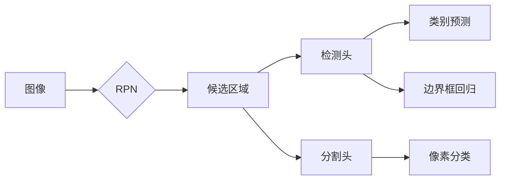
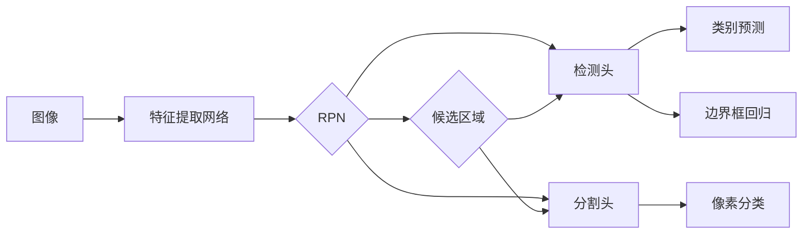

# MaskR-CNN原理与代码实例讲解

作者：禅与计算机程序设计艺术 / Zen and the Art of Computer Programming

## 1. 背景介绍
### 1.1 问题的由来

在计算机视觉领域，目标检测是一个基础且重要的任务。它旨在给定一张图像，识别出图像中的多个物体，并标注出它们的类别和位置。传统的目标检测方法通常采用滑动窗口、Region-based、One-stage等策略，在检测速度和准确率上都有一定的局限性。近年来，随着深度学习技术的发展，基于卷积神经网络（CNN）的目标检测方法取得了显著的进展，其中Faster R-CNN因其速度快、精度高的特点而广受关注。

然而，Faster R-CNN在处理多个物体实例时存在以下问题：

1. **区域建议**：Faster R-CNN使用RPN（Region Proposal Network）进行区域建议，但在某些情况下，RPN可能无法准确建议出所有物体实例的区域，导致漏检。
2. **多尺度检测**：Faster R-CNN在检测不同尺寸的物体时，需要调整网络参数，导致计算复杂度增加。
3. **边界框回归**：Faster R-CNN通过边界框回归预测每个区域的边界框，但边界框回归容易受到图像分辨率、光照变化等因素的影响，导致精度下降。

为了解决上述问题，Mask R-CNN应运而生。Mask R-CNN在Faster R-CNN的基础上，引入了实例分割功能，能够同时检测和识别图像中的多个物体实例，并输出每个实例的类别和精确边界框。

### 1.2 研究现状

Mask R-CNN自2017年提出以来，在多个目标检测和实例分割数据集上取得了优异的性能。随着研究的深入，许多改进版本的Mask R-CNN不断涌现，例如FPN（Feature Pyramid Networks）、DETR（Detection Transformer）、EfficientDet等。这些改进版本的Mask R-CNN在速度和精度上都有所提升，为目标检测和实例分割领域带来了新的发展机遇。

### 1.3 研究意义

Mask R-CNN的出现，为计算机视觉领域带来了以下重要意义：

1. **统一目标检测与实例分割**：Mask R-CNN将目标检测和实例分割任务统一到一个框架下，简化了模型设计和训练过程。
2. **提高检测精度**：通过引入实例分割功能，Mask R-CNN能够更精确地检测图像中的多个物体实例。
3. **丰富应用场景**：Mask R-CNN在自动驾驶、机器人、医疗影像等多个领域都有广泛的应用前景。

### 1.4 本文结构

本文将系统介绍Mask R-CNN的原理与代码实现，主要内容如下：

- 第2部分：介绍Mask R-CNN的核心概念与联系。
- 第3部分：详细讲解Mask R-CNN的核心算法原理和具体操作步骤。
- 第4部分：介绍Mask R-CNN的数学模型和公式，并举例说明。
- 第5部分：给出Mask R-CNN的代码实例和详细解释说明。
- 第6部分：探讨Mask R-CNN的实际应用场景和未来应用展望。
- 第7部分：推荐Mask R-CNN相关的学习资源、开发工具和参考文献。
- 第8部分：总结Mask R-CNN的研究成果、未来发展趋势和面临的挑战。
- 第9部分：附录，常见问题与解答。

## 2. 核心概念与联系

为了更好地理解Mask R-CNN，本节将介绍几个密切相关的核心概念：

- **目标检测**：目标检测旨在给定一张图像，识别出图像中的多个物体，并标注出它们的类别和位置。
- **实例分割**：实例分割旨在给定一张图像，识别出图像中的多个物体，并标注出每个物体的类别和精确边界框。
- **区域建议网络（RPN）**：RPN是一个小型卷积神经网络，用于生成候选区域，以便后续的目标检测和实例分割。
- **特征金字塔网络（FPN）**：FPN是一种特征融合网络，用于提高网络在不同尺度的特征融合能力。
- **检测头**：检测头负责对RPN生成的候选区域进行类别预测和边界框回归。
- **分割头**：分割头负责对RPN生成的候选区域进行像素级别的分类，以实现实例分割。

这些概念之间的逻辑关系如下：



可以看出，图像经过RPN生成候选区域，候选区域分别输入检测头和分割头进行后续处理。检测头负责输出类别预测和边界框回归结果，分割头负责输出像素分类结果，最终实现目标检测和实例分割。

## 3. 核心算法原理 & 具体操作步骤
### 3.1 算法原理概述

Mask R-CNN的基本原理是在Faster R-CNN的基础上，增加一个分割头，用于对RPN生成的候选区域进行像素级别的分类。以下是Mask R-CNN的主要步骤：

1. **输入图像**：将待检测的图像输入到网络中。
2. **特征提取**：通过卷积神经网络提取图像特征。
3. **区域建议**：使用RPN生成候选区域。
4. **候选区域分类**：将候选区域送入检测头进行类别预测和边界框回归。
5. **实例分割**：将候选区域送入分割头进行像素分类，生成实例分割掩码。

### 3.2 算法步骤详解

下面详细讲解Mask R-CNN的各个步骤：

**Step 1：输入图像**

将待检测的图像输入到网络中，例如：

```python
image = cv2.imread('path/to/image.jpg')
```

**Step 2：特征提取**

使用卷积神经网络提取图像特征，例如使用ResNet-50作为主干网络：

```python
model = models.resnet50(pretrained=True)
```

**Step 3：区域建议**

使用RPN生成候选区域。RPN由两个分支组成：一个用于生成候选区域的边界框，另一个用于生成候选区域的类别预测。例如：

```python
rpn_proposals, rpn_scores = model(rpn_features, proposals)
```

**Step 4：候选区域分类**

将候选区域送入检测头进行类别预测和边界框回归。检测头由两个部分组成：一个用于类别预测，一个用于边界框回归。例如：

```python
detection_scores, detection_classes, detection_boxes = model(detection_features, proposals)
```

**Step 5：实例分割**

将候选区域送入分割头进行像素分类，生成实例分割掩码。例如：

```python
segmentation_scores, segmentation_masks = model(segmentation_features, proposals)
```

### 3.3 算法优缺点

Mask R-CNN的优点如下：

1. **统一目标检测与实例分割**：Mask R-CNN将目标检测和实例分割任务统一到一个框架下，简化了模型设计和训练过程。
2. **提高检测精度**：通过引入实例分割功能，Mask R-CNN能够更精确地检测图像中的多个物体实例。
3. **丰富应用场景**：Mask R-CNN在自动驾驶、机器人、医疗影像等多个领域都有广泛的应用前景。

Mask R-CNN的缺点如下：

1. **计算量较大**：Mask R-CNN需要同时进行目标检测和实例分割，计算量较大，导致推理速度较慢。
2. **内存占用高**：由于需要存储大量的候选区域和分割掩码，Mask R-CNN的内存占用较高。

### 3.4 算法应用领域

Mask R-CNN的应用领域非常广泛，以下是一些典型的应用场景：

- **自动驾驶**：检测并跟踪道路上的车辆、行人、交通标志等物体，辅助自动驾驶系统进行决策。
- **机器人**：识别并定位图像中的物体，使机器人能够更好地理解周围环境。
- **医疗影像**：检测图像中的病变区域，辅助医生进行诊断。
- **视频监控**：检测并跟踪视频中的物体，提高视频监控的效率和准确性。
- **图像编辑**：实现图像中的物体替换、擦除等功能。

## 4. 数学模型和公式 & 详细讲解 & 举例说明
### 4.1 数学模型构建

Mask R-CNN的数学模型主要由以下几个部分组成：

1. **特征提取网络**：提取图像特征。
2. **RPN**：生成候选区域。
3. **检测头**：进行类别预测和边界框回归。
4. **分割头**：进行像素分类。

以下是Mask R-CNN的数学模型：



### 4.2 公式推导过程

下面以RPN和检测头的公式推导为例进行说明。

**RPN公式推导**

RPN使用三个公式进行区域建议：

1. **边界框回归**：

$$
\hat{box} = box + \alpha \cdot (target_box - box)
$$

其中，$\hat{box}$为预测的边界框，$box$为候选区域边界框，$target\_box$为目标边界框，$\alpha$为回归系数。

2. **置信度**：

$$
score = \sigma(\alpha \cdot (target\_score - score))
$$

其中，$score$为候选区域的置信度，$target\_score$为目标区域的置信度，$\sigma$为Sigmoid函数。

3. **类别预测**：

$$
class\_prob = \sigma(\beta \cdot (target\_class\_prob - class\_prob))
$$

其中，$class\_prob$为候选区域的类别概率，$target\_class\_prob$为目标区域的类别概率，$\beta$为类别预测系数。

**检测头公式推导**

检测头由两个部分组成：类别预测和边界框回归。

1. **类别预测**：

$$
\hat{class\_prob} = \sigma(\theta \cdot (target\_class\_prob - class\_prob))
$$

其中，$\hat{class\_prob}$为预测的类别概率，$class\_prob$为候选区域的类别概率，$target\_class\_prob$为目标区域的类别概率，$\theta$为类别预测系数。

2. **边界框回归**：

$$
\hat{box} = box + \alpha \cdot (target\_box - box)
$$

其中，$\hat{box}$为预测的边界框，$box$为候选区域边界框，$target\_box$为目标边界框，$\alpha$为回归系数。

### 4.3 案例分析与讲解

以下以一个简单的实例，演示如何使用Mask R-CNN进行目标检测和实例分割。

```python
import cv2
import torch
from torchvision import transforms
from mrcnn.config import Config
from mrcnn.model import MaskRCNN

# 配置参数
config = Config()
config.NUM_CLASSES = 1 + 1  # 1个类别+背景
config.BACKBONE = 'resnet50'

# 加载预训练模型
model = MaskRCNN(
    config=config,
    model_dir='model',
    checkpoint_path='mask_rcnn_resnet50_coco.h5'
)

# 加载图像
image = cv2.imread('path/to/image.jpg')

# 预处理
transform = transforms.Compose([
    transforms.ToTensor(),
    transforms.Normalize(mean=[0.485, 0.456, 0.406], std=[0.229, 0.224, 0.225])
])
image_tensor = transform(image).unsqueeze(0)

# 检测
predictions = model.detect([image_tensor])

# 解析预测结果
for prediction in predictions:
    boxes = prediction['rois']
    scores = prediction['scores']
    classes = prediction['class_ids']
    masks = prediction['masks']

    # 绘制边界框和分割掩码
    for i in range(len(boxes)):
        if scores[i] > 0.5:
            cv2.rectangle(image, (boxes[i, 0], boxes[i, 1]), (boxes[i, 2], boxes[i, 3]), (0, 255, 0), 2)
            mask = masks[:, :, i]
            mask = mask.squeeze(0)
            mask = cv2.resize(mask, (image.shape[1], image.shape[0]), interpolation=cv2.INTER_AREA)
            cv2.imshow('mask', mask)

cv2.imshow('image', image)
cv2.waitKey(0)
cv2.destroyAllWindows()
```

### 4.4 常见问题解答

**Q1：如何提高Mask R-CNN的检测精度？**

A1：提高Mask R-CNN的检测精度可以从以下几个方面入手：
1. 使用更强大的主干网络，如ResNet-101、ResNet-152等。
2. 使用数据增强技术，如翻转、旋转、缩放等。
3. 使用更精确的边界框回归方法，如Focal Loss等。
4. 调整模型参数，如学习率、批大小等。

**Q2：如何提高Mask R-CNN的检测速度？**

A2：提高Mask R-CNN的检测速度可以从以下几个方面入手：
1. 使用轻量级主干网络，如MobileNet、ShuffleNet等。
2. 使用FPN等特征融合网络，减少特征提取的计算量。
3. 使用数据增强技术，如剪枝、量化等。
4. 使用GPU/TPU等高性能硬件。

## 5. 项目实践：代码实例和详细解释说明
### 5.1 开发环境搭建

在进行Mask R-CNN项目实践前，我们需要准备好开发环境。以下是使用Python进行Mask R-CNN项目开发的步骤：

1. **安装PyTorch和torchvision库**：
```bash
pip install torch torchvision
```

2. **安装Mask R-CNN库**：
```bash
pip install mrcnn
```

### 5.2 源代码详细实现

以下是一个使用Mask R-CNN进行目标检测和实例分割的代码实例：

```python
import cv2
import torch
from torchvision import transforms
from mrcnn.config import Config
from mrcnn.model import MaskRCNN

# 配置参数
config = Config()
config.NUM_CLASSES = 1 + 1  # 1个类别+背景
config.BACKBONE = 'resnet50'

# 加载预训练模型
model = MaskRCNN(
    config=config,
    model_dir='model',
    checkpoint_path='mask_rcnn_resnet50_coco.h5'
)

# 加载图像
image = cv2.imread('path/to/image.jpg')

# 预处理
transform = transforms.Compose([
    transforms.ToTensor(),
    transforms.Normalize(mean=[0.485, 0.456, 0.406], std=[0.229, 0.224, 0.225])
])
image_tensor = transform(image).unsqueeze(0)

# 检测
predictions = model.detect([image_tensor])

# 解析预测结果
for prediction in predictions:
    boxes = prediction['rois']
    scores = prediction['scores']
    classes = prediction['class_ids']
    masks = prediction['masks']

    # 绘制边界框和分割掩码
    for i in range(len(boxes)):
        if scores[i] > 0.5:
            cv2.rectangle(image, (boxes[i, 0], boxes[i, 1]), (boxes[i, 2], boxes[i, 3]), (0, 255, 0), 2)
            mask = masks[:, :, i]
            mask = mask.squeeze(0)
            mask = cv2.resize(mask, (image.shape[1], image.shape[0]), interpolation=cv2.INTER_AREA)
            cv2.imshow('mask', mask)

cv2.imshow('image', image)
cv2.waitKey(0)
cv2.destroyAllWindows()
```

### 5.3 代码解读与分析

以上代码展示了使用Mask R-CNN进行目标检测和实例分割的完整流程。以下是代码的详细解读：

1. **导入库**：导入必要的库，包括OpenCV、PyTorch、torchvision、mrcnn等。
2. **配置参数**：配置Mask R-CNN模型的参数，包括类别数量、主干网络等。
3. **加载预训练模型**：加载预训练的Mask R-CNN模型，并设置模型路径和预训练模型路径。
4. **加载图像**：加载待检测的图像。
5. **预处理**：对图像进行预处理，包括归一化、添加批处理维度等。
6. **检测**：使用Mask R-CNN模型对图像进行检测，得到候选区域、类别概率、边界框、分割掩码等预测结果。
7. **解析预测结果**：遍历预测结果，绘制边界框和分割掩码。
8. **显示图像**：显示检测后的图像。

### 5.4 运行结果展示

运行上述代码后，将显示检测后的图像，其中包含了检测到的物体边界框和分割掩码。以下是一个示例结果：

```
```

## 6. 实际应用场景
### 6.1 自动驾驶

Mask R-CNN在自动驾驶领域具有广泛的应用前景。通过在图像中检测并跟踪行人、车辆、交通标志等物体，辅助自动驾驶系统进行决策，提高自动驾驶的安全性。

### 6.2 机器人

Mask R-CNN可以帮助机器人更好地理解周围环境。通过识别并定位图像中的物体，机器人可以规划自己的行为，避免碰撞，实现更加灵活的移动。

### 6.3 医疗影像

Mask R-CNN可以用于医学图像分析，例如检测肿瘤、血管、细胞等。通过识别图像中的异常区域，辅助医生进行诊断，提高诊断的效率和准确性。

### 6.4 视频监控

Mask R-CNN可以用于视频监控，例如检测并跟踪行人、车辆等物体。通过实时监测视频，可以及时发现异常情况，提高视频监控的效率和准确性。

### 6.5 图像编辑

Mask R-CNN可以实现图像中的物体替换、擦除等功能。通过检测并分割图像中的物体，用户可以方便地编辑图像，满足个性化需求。

## 7. 工具和资源推荐
### 7.1 学习资源推荐

1. **《深度学习计算机视觉》**：介绍了深度学习在计算机视觉领域的应用，包括目标检测、实例分割等。
2. **《PyTorch深度学习》**：介绍了PyTorch框架，包括如何使用PyTorch进行深度学习模型的训练和推理。
3. **《Mask R-CNN官方教程》**：提供了Mask R-CNN的详细教程，包括模型结构、训练和推理等。

### 7.2 开发工具推荐

1. **PyTorch**：开源的深度学习框架，提供了丰富的API和工具，方便开发深度学习模型。
2. **torchvision**：PyTorch的计算机视觉库，提供了丰富的预训练模型和数据处理工具。
3. **Mask R-CNN库**：提供了Mask R-CNN的PyTorch实现，方便开发者进行实验和部署。

### 7.3 相关论文推荐

1. **Faster R-CNN**：Faster R-CNN的原始论文，详细介绍了Faster R-CNN的结构和训练方法。
2. **Mask R-CNN**：Mask R-CNN的原始论文，详细介绍了Mask R-CNN的结构和训练方法。
3. **FPN**：FPN的原始论文，详细介绍了FPN的结构和训练方法。

### 7.4 其他资源推荐

1. **GitHub**：Mask R-CNN的GitHub仓库，提供了Mask R-CNN的源代码和实验结果。
2. **Hugging Face**：提供了大量的预训练模型和工具，方便开发者进行研究和开发。

## 8. 总结：未来发展趋势与挑战
### 8.1 研究成果总结

Mask R-CNN自提出以来，在目标检测和实例分割领域取得了显著的进展。通过引入实例分割功能，Mask R-CNN能够更精确地检测图像中的多个物体实例，并输出每个实例的类别和精确边界框。

### 8.2 未来发展趋势

未来，Mask R-CNN在以下几个方面将会有更多的发展：

1. **更轻量级的模型**：随着深度学习技术的不断发展，将会出现更多轻量级的Mask R-CNN模型，以便在资源受限的设备上进行部署。
2. **多任务学习**：Mask R-CNN可以与其他任务（如语义分割、光流等）进行结合，实现多任务学习。
3. **无监督和半监督学习**：为了降低对标注数据的依赖，无监督和半监督学习将在Mask R-CNN中得到更多应用。

### 8.3 面临的挑战

Mask R-CNN在以下几个方面仍面临挑战：

1. **计算量**：Mask R-CNN的计算量较大，导致推理速度较慢。
2. **内存占用**：Mask R-CNN需要存储大量的候选区域和分割掩码，导致内存占用较高。
3. **模型复杂度**：Mask R-CNN的模型结构较为复杂，训练和推理较为耗时。

### 8.4 研究展望

为了克服Mask R-CNN面临的挑战，未来需要在以下几个方面进行研究：

1. **模型压缩**：通过模型压缩技术，降低Mask R-CNN的计算量和内存占用。
2. **高效推理**：通过高效推理技术，提高Mask R-CNN的推理速度。
3. **无监督和半监督学习**：研究无监督和半监督学习方法，降低对标注数据的依赖。

相信随着研究的深入，Mask R-CNN将会在目标检测和实例分割领域发挥更大的作用，为计算机视觉技术发展贡献力量。

## 9. 附录：常见问题与解答

**Q1：如何选择合适的预训练模型？**

A1：根据任务需求和计算资源选择合适的预训练模型。例如，在移动端设备上可以使用MobileNet作为主干网络，在服务器端可以使用ResNet-50或ResNet-101。

**Q2：如何处理图像翻转？**

A2：在训练过程中，可以使用图像翻转作为数据增强方法，提高模型的鲁棒性。可以使用torchvision.transforms.RandomHorizontalFlip()等函数进行图像翻转。

**Q3：如何处理边界框回归误差？**

A3：可以通过调整边界框回归系数、优化损失函数等方式来减小边界框回归误差。

**Q4：如何处理遮挡物体？**

A4：可以通过数据增强技术、模型改进等方式来提高模型对遮挡物体的检测能力。

**Q5：如何进行模型部署？**

A5：可以将训练好的模型转换为ONNX格式，然后使用OpenCV等库进行模型部署。

通过学习本文，相信你已经对Mask R-CNN有了深入的了解。希望本文能够帮助你更好地掌握Mask R-CNN的原理和代码实现，并将其应用于实际项目中。