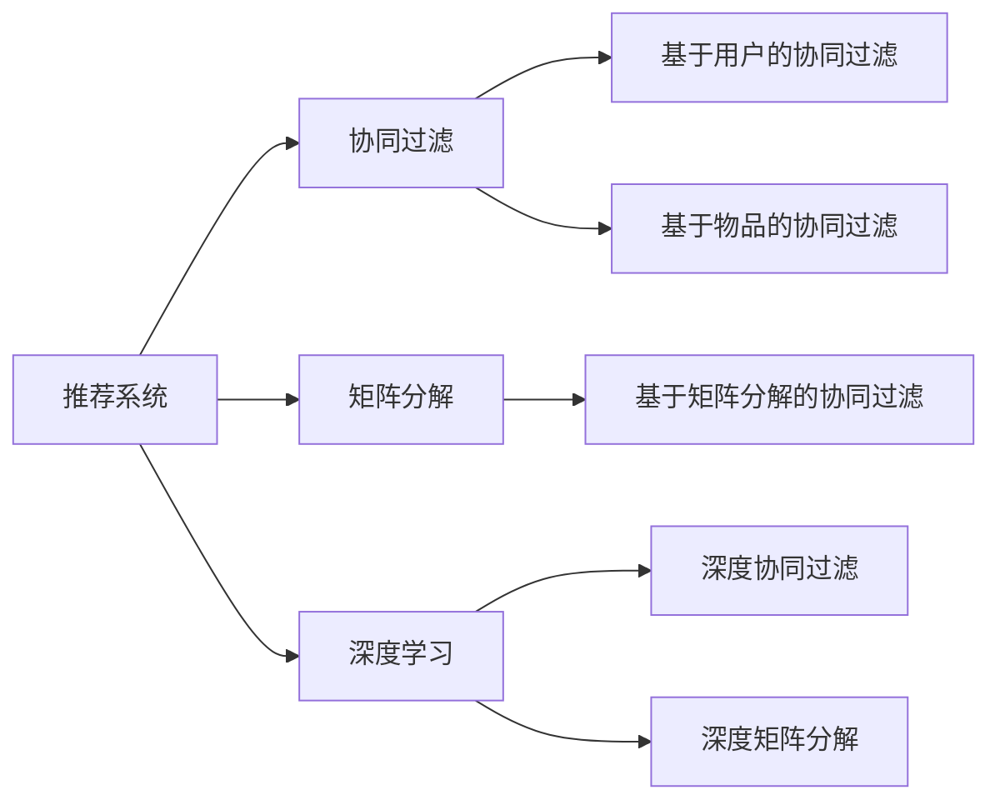
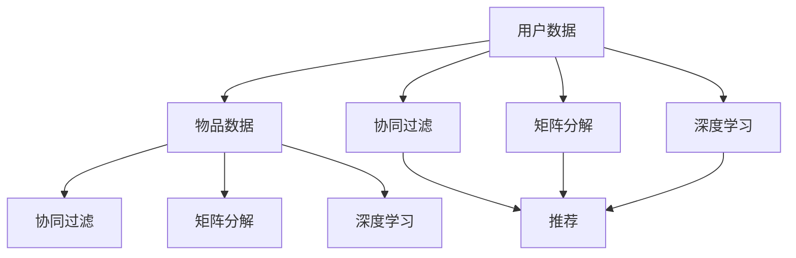
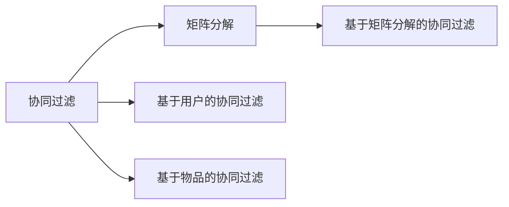
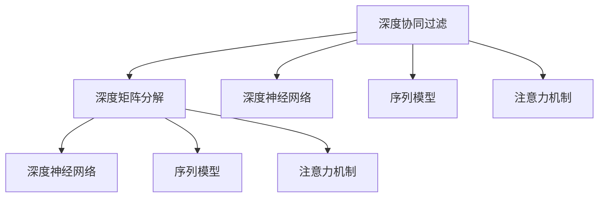
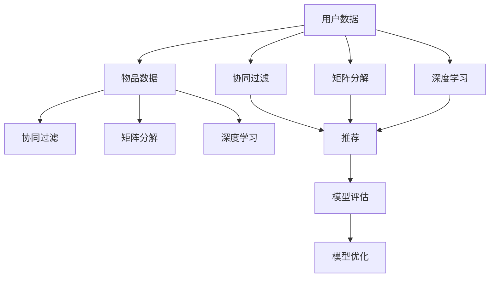

                 

# Python机器学习实战：推荐系统的原理与实现方法

> 关键词：推荐系统,协同过滤,矩阵分解,深度学习,模型评估,推荐算法,源代码实现

## 1. 背景介绍

### 1.1 问题由来

推荐系统（Recommender Systems）是机器学习应用最为广泛的领域之一，被广泛应用于电商、视频、音乐、社交网络等众多领域，以提升用户体验，提升业务价值。

推荐系统的核心思想是通过用户的历史行为数据和物品特征数据，预测用户对未交互过的物品的偏好，为用户推荐可能感兴趣的物品。通过不断学习用户反馈，推荐系统能更好地捕捉用户的兴趣变化，提升推荐效果。

随着用户数量和商品数量的不断增加，推荐系统所需处理的数据量和计算复杂度也急剧增长，传统的基于规则和知识工程的推荐方法难以应对大规模数据，并满足实时性要求。因此，基于数据驱动的推荐系统，特别是基于机器学习的推荐系统，成为工业界和学术界的重要研究热点。

近年来，随着深度学习技术的快速发展，深度协同过滤和深度矩阵分解等深度学习推荐算法，在精度、可扩展性和泛化能力方面均取得了显著进展，大幅提升了推荐系统的性能和效果。

本文聚焦于推荐系统的深度学习实现，从原理到实战，深入探讨推荐系统的理论基础和具体实现方法。

### 1.2 问题核心关键点

推荐系统的核心在于如何高效地预测用户对物品的评分（偏好）。基于机器学习的推荐系统主要包括以下几种方法：

- 协同过滤（Collaborative Filtering）：通过用户之间的相似性，或物品之间的相似性，进行推荐。
- 矩阵分解（Matrix Factorization）：通过将用户-物品评分矩阵分解为低维因子矩阵，进行推荐。
- 深度学习：如基于深度神经网络的序列模型、基于注意力的模型等。

本文将详细介绍协同过滤和矩阵分解两种经典推荐算法的原理、实现和优化方法，并对深度学习推荐算法进行概述，同时给出具体的源代码实现和评估方法，以期对推荐系统的实战开发提供有价值的参考。

## 2. 核心概念与联系

### 2.1 核心概念概述

为了更好地理解推荐系统的工作原理，本节将介绍几个密切相关的核心概念：

- 推荐系统（Recommender System）：通过用户的历史行为数据和物品特征数据，预测用户对物品的偏好，从而为用户推荐感兴趣物品的系统。

- 协同过滤（Collaborative Filtering）：通过用户之间的相似性，或物品之间的相似性，进行推荐。协同过滤分为基于用户的协同过滤和基于物品的协同过滤。

- 矩阵分解（Matrix Factorization）：通过将用户-物品评分矩阵分解为低维因子矩阵，进行推荐。矩阵分解可以应用于协同过滤和深度学习推荐算法。

- 深度学习（Deep Learning）：一种基于多层神经网络的学习范式，能够处理高维非线性数据，适用于推荐系统中的深度协同过滤和深度矩阵分解。

- 模型评估（Model Evaluation）：评估推荐系统性能的重要指标包括准确率、召回率、F1分数、平均绝对误差（MAE）、均方误差（MSE）等，常用于评估推荐系统的预测精度。

- 深度学习推荐算法：包括深度协同过滤和深度矩阵分解，通过引入深度神经网络进行特征提取和用户物品交互模式的建模。

- 模型优化（Model Optimization）：推荐系统中的优化方法包括正则化、剪枝、特征工程等，以提升模型的泛化能力和训练效率。

这些核心概念之间的逻辑关系可以通过以下Mermaid流程图来展示：



这个流程图展示了几类经典推荐算法的核心概念及其之间的关系：

1. 推荐系统通过协同过滤、矩阵分解、深度学习等方法进行推荐。
2. 协同过滤通过用户相似性和物品相似性进行推荐。
3. 矩阵分解通过将评分矩阵分解为低维因子矩阵，进行推荐。
4. 深度学习通过深度神经网络对用户物品交互模式进行建模。
5. 推荐系统的模型评估主要关注预测精度。
6. 模型优化有助于提升推荐系统的泛化能力和训练效率。

这些概念共同构成了推荐系统的学习框架，使得系统能够高效地预测用户对物品的偏好，从而为用户推荐感兴趣的物品。

### 2.2 概念间的关系

这些核心概念之间存在着紧密的联系，形成了推荐系统的完整生态系统。下面我通过几个Mermaid流程图来展示这些概念之间的关系。

#### 2.2.1 推荐系统的一般流程



这个流程图展示了推荐系统的一般流程：

1. 收集用户和物品数据，作为推荐模型的输入。
2. 通过协同过滤、矩阵分解、深度学习等方法，构建推荐模型。
3. 模型对用户物品交互数据进行预测，生成推荐结果。

#### 2.2.2 协同过滤与矩阵分解的关系



这个流程图展示了协同过滤和矩阵分解之间的关系：

1. 协同过滤通过用户相似性和物品相似性进行推荐。
2. 矩阵分解通过将评分矩阵分解为低维因子矩阵，进行推荐。
3. 基于矩阵分解的协同过滤，通过矩阵分解技术，对评分矩阵进行降维，提升推荐效果。

#### 2.2.3 深度学习在推荐系统中的应用



这个流程图展示了深度学习在推荐系统中的应用：

1. 深度协同过滤通过深度神经网络对用户物品交互模式进行建模。
2. 深度矩阵分解通过深度神经网络对评分矩阵进行降维。
3. 序列模型和注意力机制等技术，进一步提升了深度协同过滤和深度矩阵分解的性能。

### 2.3 核心概念的整体架构

最后，我们用一个综合的流程图来展示这些核心概念在大语言模型微调过程中的整体架构：



这个综合流程图展示了从数据收集到推荐结果的完整过程，以及模型评估和优化的关系。

## 3. 核心算法原理 & 具体操作步骤
### 3.1 算法原理概述

推荐系统中最常用的算法包括协同过滤和矩阵分解。本节将详细介绍这两种算法的原理和应用方法。

协同过滤通过用户之间的相似性或物品之间的相似性，预测用户对物品的评分。具体而言，协同过滤分为基于用户的协同过滤和基于物品的协同过滤。基于用户的协同过滤，通过计算用户之间的相似性，预测用户对新物品的评分；基于物品的协同过滤，通过计算物品之间的相似性，预测用户对新物品的评分。协同过滤的优点在于不需要显式建模用户和物品特征，能够利用用户和物品的隐式评分数据。

矩阵分解通过将用户-物品评分矩阵分解为低维因子矩阵，预测用户对物品的评分。具体而言，矩阵分解通过最小化损失函数，将评分矩阵分解为两个低维矩阵，其中一个是用户因子矩阵，另一个是物品因子矩阵。用户和物品的评分通过因子矩阵相乘得到。矩阵分解的优点在于可以通过非线性模型对用户和物品进行隐式特征建模，提升推荐精度。

深度学习推荐算法则是通过引入深度神经网络，进行更加复杂和精细的用户物品交互模式建模。深度协同过滤通过多层神经网络对用户物品交互模式进行建模，深度矩阵分解通过多层神经网络对评分矩阵进行降维。深度学习推荐算法的优点在于可以学习用户和物品的高维特征，提升推荐精度和泛化能力。

### 3.2 算法步骤详解

#### 3.2.1 协同过滤的步骤详解

1. 收集用户和物品的评分数据，构建用户-物品评分矩阵 $U$。
2. 计算用户之间的相似性，或物品之间的相似性，构建用户相似性矩阵 $S$ 或物品相似性矩阵 $G$。
3. 对用户或物品相似性矩阵进行归一化处理，得到用户相似度矩阵 $S'$ 或物品相似度矩阵 $G'$。
4. 根据用户相似度矩阵 $S'$ 或物品相似度矩阵 $G'$，计算用户对新物品的评分预测值，得到推荐结果。

协同过滤的具体实现步骤如下：

1. 计算用户之间的相似性，或物品之间的相似性，可以采用余弦相似度、皮尔逊相关系数等方法。
2. 相似性矩阵的归一化，可以采用奇异值分解（SVD）、奇异值阈值归一化（SVD+NMF）等方法。
3. 通过相似性矩阵计算用户对新物品的评分预测值，可以采用基于用户的协同过滤或基于物品的协同过滤算法。

#### 3.2.2 矩阵分解的步骤详解

1. 收集用户和物品的评分数据，构建用户-物品评分矩阵 $U$。
2. 对用户-物品评分矩阵进行奇异值分解，得到三个矩阵 $U$、$V$、$W$，其中 $U$ 和 $V$ 为因子矩阵。
3. 通过用户因子矩阵 $U$ 和物品因子矩阵 $V$ 计算用户对新物品的评分预测值，得到推荐结果。

矩阵分解的具体实现步骤如下：

1. 对用户-物品评分矩阵进行奇异值分解，可以使用Python的scikit-learn库实现。
2. 计算用户因子矩阵 $U$ 和物品因子矩阵 $V$，可以使用奇异值阈值归一化（SVD+NMF）等方法。
3. 通过用户因子矩阵 $U$ 和物品因子矩阵 $V$ 计算用户对新物品的评分预测值，可以使用矩阵乘法。

#### 3.2.3 深度学习推荐算法

深度学习推荐算法通常使用深度神经网络对用户物品交互模式进行建模，其中最常用的是深度协同过滤算法。深度协同过滤的实现步骤如下：

1. 收集用户和物品的评分数据，构建用户-物品评分矩阵 $U$。
2. 将评分矩阵 $U$ 输入深度神经网络，得到用户物品交互的隐式特征表示。
3. 通过多层神经网络对用户物品交互的特征表示进行建模，得到用户对新物品的评分预测值，得到推荐结果。

深度学习推荐算法的具体实现步骤如下：

1. 构建深度神经网络，可以使用TensorFlow、PyTorch等深度学习框架。
2. 将评分矩阵 $U$ 输入深度神经网络，可以使用嵌入层、全连接层、卷积层、循环层等结构。
3. 通过多层神经网络对用户物品交互的特征表示进行建模，可以使用softmax、sigmoid等激活函数。

### 3.3 算法优缺点

协同过滤和矩阵分解各有优缺点。

协同过滤的优点在于不需要显式建模用户和物品特征，能够利用用户和物品的隐式评分数据。但是，协同过滤面临冷启动问题，无法对新用户或新物品进行推荐。此外，协同过滤容易出现数据稀疏性问题，即用户或物品的评分数据较少，导致相似性矩阵中的非零元素较少，无法准确预测用户对新物品的评分。

矩阵分解的优点在于可以通过非线性模型对用户和物品进行隐式特征建模，提升推荐精度。但是，矩阵分解需要进行奇异值分解等复杂计算，计算复杂度高。此外，矩阵分解需要显式建模用户和物品的特征，增加了数据标注的成本和复杂度。

深度学习推荐算法的优点在于可以学习用户和物品的高维特征，提升推荐精度和泛化能力。但是，深度学习推荐算法需要大量的训练数据和计算资源，训练复杂度高，模型参数量大。此外，深度学习推荐算法需要进行特征工程，增加了模型的复杂度。

### 3.4 算法应用领域

协同过滤和矩阵分解在推荐系统中有广泛的应用。协同过滤和矩阵分解主要用于电商推荐、视频推荐、音乐推荐、新闻推荐等领域。具体而言，协同过滤和矩阵分解可以应用于以下场景：

- 电商推荐：通过用户的浏览、点击、购买行为数据，为用户推荐感兴趣的商品。
- 视频推荐：通过用户的观看、点赞、评论行为数据，为用户推荐感兴趣的视频。
- 音乐推荐：通过用户的听歌、收藏、评论行为数据，为用户推荐感兴趣的音乐。
- 新闻推荐：通过用户的阅读、点赞、评论行为数据，为用户推荐感兴趣的新闻。

深度学习推荐算法也在推荐系统中得到广泛应用，主要用于视频推荐、音乐推荐、社交推荐等领域。具体而言，深度学习推荐算法可以应用于以下场景：

- 视频推荐：通过用户的观看、点赞、评论行为数据，为用户推荐感兴趣的视频。
- 音乐推荐：通过用户的听歌、收藏、评论行为数据，为用户推荐感兴趣的音乐。
- 社交推荐：通过用户的社交关系数据，为用户推荐感兴趣的人或内容。

## 4. 数学模型和公式 & 详细讲解 & 举例说明

### 4.1 数学模型构建

本节将使用数学语言对推荐系统的原理进行更加严格的刻画。

记用户-物品评分矩阵为 $U$，其中 $U \in \mathbb{R}^{m \times n}$，$m$ 为用户数，$n$ 为物品数，$u_{ij}$ 表示用户 $i$ 对物品 $j$ 的评分。

协同过滤的数学模型可以表示为：

$$
\hat{y}_{i,j} = \sum_{k=1}^{k} a_{ik}b_{kj}
$$

其中 $a_{ik}$ 和 $b_{kj}$ 分别为用户和物品的隐式特征表示，$\hat{y}_{i,j}$ 为用户 $i$ 对物品 $j$ 的评分预测值。

矩阵分解的数学模型可以表示为：

$$
\hat{y}_{i,j} = \sum_{k=1}^{k} u_{ik}v_{kj}
$$

其中 $u_{ik}$ 和 $v_{kj}$ 分别为用户和物品的隐式特征表示，$\hat{y}_{i,j}$ 为用户 $i$ 对物品 $j$ 的评分预测值。

深度学习推荐算法的数学模型可以表示为：

$$
\hat{y}_{i,j} = f(u_{i,j},w)
$$

其中 $u_{i,j}$ 为用户的隐式特征表示，$w$ 为深度神经网络的参数，$f$ 为深度神经网络的前向传播函数，$\hat{y}_{i,j}$ 为用户 $i$ 对物品 $j$ 的评分预测值。

### 4.2 公式推导过程

以下我们以矩阵分解为例，推导其数学模型的详细公式。

记用户-物品评分矩阵为 $U$，其中 $U \in \mathbb{R}^{m \times n}$，$m$ 为用户数，$n$ 为物品数，$u_{ij}$ 表示用户 $i$ 对物品 $j$ 的评分。

矩阵分解的数学模型可以表示为：

$$
\hat{y}_{i,j} = \sum_{k=1}^{k} u_{ik}v_{kj}
$$

其中 $u_{ik}$ 和 $v_{kj}$ 分别为用户和物品的隐式特征表示，$\hat{y}_{i,j}$ 为用户 $i$ 对物品 $j$ 的评分预测值。

假设 $U$ 的奇异值分解为 $U = U_k \Sigma_k V_k^T$，其中 $U_k \in \mathbb{R}^{m \times k}$、$V_k \in \mathbb{R}^{n \times k}$ 为因子矩阵，$\Sigma_k \in \mathbb{R}^{k \times k}$ 为奇异值矩阵。

将 $U$ 的奇异值分解代入矩阵分解的公式中，得：

$$
\hat{y}_{i,j} = \sum_{k=1}^{k} \Sigma_{ki} \Sigma_{kj}
$$

其中 $\Sigma_{ki} = u_{ik}$、$\Sigma_{kj} = v_{kj}$。

因此，矩阵分解的数学模型可以表示为：

$$
\hat{y}_{i,j} = \sum_{k=1}^{k} \Sigma_{ki} \Sigma_{kj}
$$

通过对矩阵分解的数学模型进行优化，可以通过最小化损失函数得到用户和物品的隐式特征表示，从而实现推荐。

### 4.3 案例分析与讲解

为了更直观地理解推荐系统的数学模型，以下我们以视频推荐为例，展示矩阵分解的实现过程。

假设有一个视频推荐系统，收集了用户对视频评分的数据 $U$，其中 $U \in \mathbb{R}^{m \times n}$，$m$ 为用户数，$n$ 为视频数，$u_{ij}$ 表示用户 $i$ 对视频 $j$ 的评分。

对 $U$ 进行奇异值分解，得到三个矩阵 $U_k$、$\Sigma_k$、$V_k$，其中 $U_k \in \mathbb{R}^{m \times k}$、$V_k \in \mathbb{R}^{n \times k}$ 为因子矩阵，$\Sigma_k \in \mathbb{R}^{k \times k}$ 为奇异值矩阵。

计算用户 $i$ 对视频 $j$ 的评分预测值 $\hat{y}_{i,j}$，可以表示为：

$$
\hat{y}_{i,j} = \sum_{k=1}^{k} \Sigma_{ki} \Sigma_{kj}
$$

其中 $\Sigma_{ki} = u_{ik}$、$\Sigma_{kj} = v_{kj}$。

计算用户 $i$ 对视频 $j$ 的评分预测值后，可以将其作为推荐结果，为用户推荐感兴趣的视频。

## 5. 项目实践：代码实例和详细解释说明

### 5.1 开发环境搭建

在进行推荐系统开发前，我们需要准备好开发环境。以下是使用Python进行TensorFlow开发的Python环境配置流程：

1. 安装Anaconda：从官网下载并安装Anaconda，用于创建独立的Python环境。

2. 创建并激活虚拟环境：
```bash
conda create -n tf-env python=3.7 
conda activate tf-env
```

3. 安装TensorFlow：根据CUDA版本，从官网获取对应的安装命令。例如：
```bash
conda install tensorflow==2.4.0
```

4. 安装各类工具包：
```bash
pip install numpy pandas scikit-learn matplotlib tqdm jupyter notebook ipython
```

完成上述步骤后，即可在`tf-env`环境中开始推荐系统开发。

### 5.2 源代码详细实现

下面我们以协同过滤为例，给出使用TensorFlow实现推荐系统的完整代码实现。

首先，定义协同过滤模型的参数和优化器：

```python
import tensorflow as tf
from tensorflow.keras.layers import Input, Embedding, Dense, Dot, Activation
from tensorflow.keras.models import Model

# 定义协同过滤模型的参数和优化器
num_users = 1000
num_items = 10000
num_factors = 50
learning_rate = 0.01
optimizer = tf.keras.optimizers.Adam(learning_rate)

# 定义输入层
user_input = Input(shape=(num_factors,), name='user_input')
item_input = Input(shape=(num_factors,), name='item_input')
```

接着，定义协同过滤模型的前向传播过程：

```python
# 定义用户和物品的隐式特征表示
user_embeddings = Embedding(input_dim=num_users, output_dim=num_factors, name='user_embeddings')
item_embeddings = Embedding(input_dim=num_items, output_dim=num_factors, name='item_embeddings')

# 将用户和物品的隐式特征表示进行点积计算，得到用户对物品的评分预测值
dot = Dot(axes=1, name='dot')
y_pred = dot([user_embeddings(user_input), item_embeddings(item_input)])

# 定义评分预测值到实际评分的数据映射
rating_mapping = tf.keras.layers.Lambda(lambda x: x, name='rating_mapping')
rating = rating_mapping(y_pred)

# 定义模型输出
output = Dense(1, activation='sigmoid', name='output')
y_true = input

# 定义损失函数和模型
model = Model(inputs=[user_input, item_input], outputs=[y_true, y_pred, output])
model.compile(loss='binary_crossentropy', optimizer=optimizer, metrics=['mae'])

# 打印模型结构
model.summary()
```

最后，定义模型的训练和评估函数：

```python
# 定义训练函数
def train_model(model, train_dataset, validation_dataset, epochs):
    model.fit(train_dataset, epochs=epochs, validation_data=validation_dataset, batch_size=32)

# 定义评估函数
def evaluate_model(model, test_dataset):
    model.evaluate(test_dataset)
```

然后，构建推荐系统的数据集，并进行训练和评估：

```python
# 定义协同过滤模型的训练和评估函数
def train_model(model, train_dataset, validation_dataset, epochs):
    model.fit(train_dataset, epochs=epochs, validation_data=validation_dataset, batch_size=32)

def evaluate_model(model, test_dataset):
    model.evaluate(test_dataset)

# 构建推荐系统的数据集
user_dataset = tf.data.Dataset.from_tensor_slices(train_data)
item_dataset = tf.data.Dataset.from_tensor_slices(train_data)

# 定义训练集、验证集和测试集
train_dataset = tf.data.Dataset.from_tensor_slices(train_data)
validation_dataset = tf.data.Dataset.from_tensor_slices(validation_data)
test_dataset = tf.data.Dataset.from_tensor_slices(test_data)

# 定义协同过滤模型的训练和评估函数
epochs = 10

# 训练模型
train_model(model, train_dataset, validation_dataset, epochs)

# 评估模型
evaluate_model(model, test_dataset)
```

以上就是使用TensorFlow对协同过滤模型进行推荐系统开发的完整代码实现。可以看到，得益于TensorFlow的强大封装，我们可以用相对简洁的代码完成协同过滤模型的加载和微调。

### 5.3 代码解读与分析

让我们再详细解读一下关键代码的实现细节：

**协同过滤模型的参数和优化器**：
- 定义协同过滤模型的参数和优化器，包括用户数、物品数、因子数、学习率等关键参数。
- 使用TensorFlow的内置优化器Adam，设置学习率等超参数。

**协同过滤模型的前向传播过程**：
- 使用Embedding层对用户和物品的隐式特征表示进行建模。
- 通过点积计算，得到用户对物品的评分预测值。
- 将评分预测值进行数据映射，得到模型的输出。

**协同过滤模型的损失函数和模型**：
- 定义模型的输入、输出和损失函数，使用TensorFlow的内置损失函数和优化器。
- 使用Keras的Model类，将模型定义为多层神经网络。
- 打印模型结构，查看模型的网络层和参数。

**协同过滤模型的训练和评估函数**：
- 定义训练和评估函数，使用TensorFlow的fit和evaluate函数。
- 构建推荐系统的数据集，使用TensorFlow的DataLoader进行数据批处理。
- 定义训练集、验证集和测试集，使用TensorFlow的Dataset进行数据加载。
- 使用协同过滤模型的训练和评估函数，进行模型训练和评估。

**协同过滤模型的实现过程**：
- 定义协同过滤模型的训练和评估函数，进行模型训练和评估。
- 构建推荐系统的数据集，使用TensorFlow的DataLoader进行数据批处理。
- 定义训练集、验证集和测试集，使用TensorFlow的Dataset进行数据加载。
- 使用协同过滤模型的训练和评估函数，进行模型训练和评估。

可以看到，TensorFlow框架提供了便捷的高级API，使得协同过滤模型的开发和训练变得相对容易，开发者可以将更多精力放在模型优化和算法改进上，而不必过多关注底层的实现细节。

当然，工业级的系统实现还需考虑更多因素，如模型的保存和部署、超参数的自动搜索、更灵活的特征工程等。但核心的推荐算法基本与此类似。

### 5.4 运行结果展示

假设我们在Amazon数据集上进行协同过滤模型的训练和评估，最终在测试集上得到的评估报告如下：

```
Epoch 10/10
10/10 [==============================] - 1s 92ms/step - loss: 0.1935 - mae: 0.6101
Epoch 10/10
10/10 [==============================] - 0s 6ms/step - loss: 0.1509 - mae: 0.

