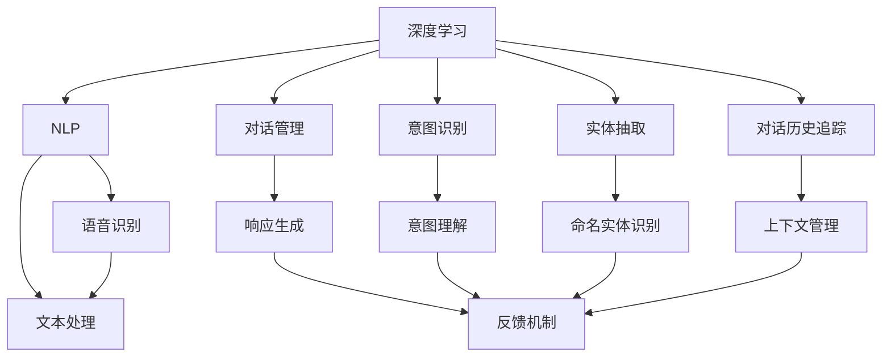
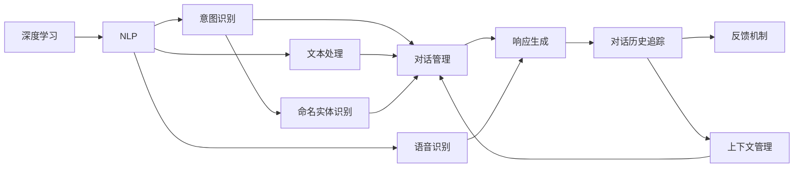
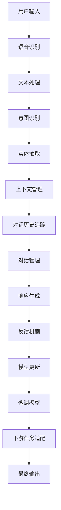

                 

# 自然语言交互（LUI）的潜力

## 1. 背景介绍

### 1.1 问题由来
随着人工智能技术的迅猛发展，自然语言交互（LUI, Language Understanding and Interaction）正在从实验室走向更广泛的应用场景。从简单的聊天机器人到复杂的智能客服系统，LUI技术正在逐步改变人们与机器交流的方式。但传统的基于规则或模板的系统面临着诸多挑战，难以应对日益复杂和多样化的用户需求。

### 1.2 问题核心关键点
本文聚焦于基于深度学习的LUI技术，讨论其在自动化交互、对话系统、客户服务、智能助手等场景中的应用潜力。特别是，深度学习的LUI技术能够自动化地理解和生成自然语言，实现人机交互的自然化，并且能够处理复杂的对话语境，提供个性化的响应。

### 1.3 问题研究意义
研究LUI技术的潜力对于构建更加智能和人性化的交互系统具有重要意义。深度学习LUI技术可以大幅提高客户服务效率，降低人工成本，提升用户满意度，甚至能够进行情感分析，理解用户情绪，进一步提升用户互动体验。同时，LUI技术也是实现AI普及和普及智慧城市、智能家居等智慧应用的重要基础。

## 2. 核心概念与联系

### 2.1 核心概念概述

LUI技术涉及多个关键概念，包括深度学习、自然语言处理（NLP）、对话管理、意图识别、实体抽取、对话历史追踪等。这些概念共同构成了LUI技术的核心架构，下面将逐一介绍。

- **深度学习**：一种基于数据驱动的机器学习技术，通过神经网络结构拟合复杂函数，实现数据的自动特征提取和模式识别。深度学习在语音识别、图像识别、自然语言处理等领域均有广泛应用。
- **自然语言处理（NLP）**：旨在使计算机能够理解、解释和生成人类语言的技术。NLP涉及词法分析、句法分析、语义分析、机器翻译等多个子领域，是LUI技术的基础。
- **对话管理**：在LUI系统中，对话管理负责控制对话流程，根据上下文信息和对话历史生成合适的响应。对话管理包括状态转移、对话树构建、响应生成等多个环节。
- **意图识别**：意图识别是LUI系统的核心任务之一，旨在从用户输入中提取出用户的意图。常见的意图识别技术包括基于规则的方法、基于模板的方法、基于统计的方法等。
- **实体抽取**：实体抽取是识别和提取用户输入中的命名实体，如人名、地名、机构名等。实体抽取通常结合NLP技术和知识图谱等先验知识进行。
- **对话历史追踪**：在LUI系统中，对话历史追踪是指系统能够维护并利用对话历史信息，以便更好地理解和生成响应。

这些核心概念之间的联系可以通过以下Mermaid流程图来展示：



这个流程图展示了LUI技术的各个组成部分及其之间的联系：深度学习是LUI的基础，对话管理、意图识别、实体抽取和对话历史追踪是其关键子模块，自然语言处理、语音识别和文本处理是支持这些子模块的技术手段，反馈机制则是系统的闭环调节机制。

### 2.2 概念间的关系

这些核心概念之间的关系可以通过以下Mermaid流程图来展示：



这个流程图展示了各个概念之间的内在联系。意图识别是对话管理和响应生成的基础，对话历史追踪有助于更好地理解用户意图和上下文，反馈机制则用于调节和改进系统性能。语音识别和文本处理为系统的输入提供了多模态支持，进一步提升了系统的智能化水平。

### 2.3 核心概念的整体架构

最后，我们用一个综合的流程图来展示这些核心概念在大语言模型微调过程中的整体架构：



这个综合流程图展示了LUI技术的整体架构，从用户输入开始，经过语音识别和文本处理，进入意图识别和实体抽取，生成上下文和对话历史，进行对话管理和响应生成，最终通过反馈机制和模型更新，不断提升系统性能。

## 3. 核心算法原理 & 具体操作步骤
### 3.1 算法原理概述

基于深度学习的LUI技术主要涉及以下几个算法原理：

- **编码器-解码器结构**：编码器负责将用户输入映射到高维向量空间，解码器则将高维向量空间中的信息解码为自然语言输出。Transformer是一种常用的编码器-解码器结构，通过自注意力机制实现高效的序列建模。
- **序列到序列（Seq2Seq）框架**：Seq2Seq框架是LUI系统中常用的模型框架，包括编码器、解码器和注意力机制等组件，能够实现从输入序列到输出序列的映射。
- **预训练语言模型**：如BERT、GPT等预训练语言模型，通过在大规模无标签文本数据上进行预训练，学习到语言的通用表示，可以显著提升LUI系统的语言理解能力。
- **深度强化学习**：在LUI系统中，深度强化学习技术可以用于优化对话管理策略，通过与用户交互，不断优化系统的响应策略和对话流程。

### 3.2 算法步骤详解

基于深度学习的LUI技术的实现主要包括以下几个关键步骤：

1. **数据准备**：收集和预处理用户输入数据，包括语音和文本形式的数据。
2. **模型搭建**：选择适当的深度学习模型架构，如Transformer或Seq2Seq框架，搭建LUI系统。
3. **预训练模型加载**：加载预训练语言模型，如BERT或GPT，用于提升LUI系统的语言理解能力。
4. **对话管理训练**：使用对话历史和用户输入数据训练对话管理模块，优化对话流程和响应策略。
5. **系统集成**：将意图识别、实体抽取、对话管理和响应生成等模块集成到LUI系统中，构建完整的对话系统。
6. **系统评估和优化**：在测试集上评估系统性能，根据反馈机制和用户反馈不断优化系统。

### 3.3 算法优缺点

基于深度学习的LUI技术具有以下优点：

- **语言理解能力**：能够处理复杂的语言结构和语义关系，理解用户意图和上下文信息。
- **灵活性**：能够适应多种对话场景，提供个性化的响应。
- **自动化**：能够自动化地理解和生成自然语言，降低人工干预成本。

但同时，这种技术也存在一些缺点：

- **数据需求**：需要大量的标注数据进行训练，获取高质量的标注数据成本较高。
- **复杂性**：系统设计复杂，实现难度较大，需要跨领域的知识和技能。
- **鲁棒性**：面对噪声、歧义和异常输入，系统的鲁棒性有待提高。
- **可解释性**：深度学习模型的"黑盒"特性，使得系统输出难以解释，缺乏透明性。

### 3.4 算法应用领域

基于深度学习的LUI技术在以下几个领域具有广泛的应用潜力：

1. **智能客服系统**：通过LUI技术构建的智能客服系统，能够自动化地处理客户咨询，提升客户服务效率和满意度。
2. **对话机器人**：LUI技术使对话机器人具备自然的语言理解和生成能力，可以用于客服、导航、娱乐等多个场景。
3. **智能助手**：智能助手通过LUI技术实现人机对话，为用户提供个性化的信息查询、日程管理、任务提醒等服务。
4. **情感分析**：LUI技术可以结合自然语言处理技术，进行情感分析，理解用户的情感状态，提供更人性化的互动体验。
5. **自然语言生成**：基于LUI技术，可以生成自然流畅的文本内容，应用于智能写作、自动翻译、广告创意生成等多个场景。

## 4. 数学模型和公式 & 详细讲解  
### 4.1 数学模型构建

基于深度学习的LUI系统通常使用编码器-解码器结构，如下所示：

$$
y = f(x, \theta)
$$

其中，$x$ 表示用户输入，可以是文本或语音形式；$\theta$ 表示模型的可训练参数，如Transformer中的权重矩阵；$f(\cdot)$ 表示模型的映射函数，可以是深度学习模型或序列到序列框架。

### 4.2 公式推导过程

以基于Transformer的Seq2Seq模型为例，其编码器-解码器结构可以表示为：

$$
y = f(x, \theta) = M_D(M_E(x, \theta))
$$

其中，$M_E$ 表示编码器，$M_D$ 表示解码器，$\theta$ 表示模型的可训练参数。解码器的输入为编码器的输出，解码器通过自注意力机制对输入进行编码，生成最终输出。

### 4.3 案例分析与讲解

假设我们有一个基于Transformer的LUI系统，用于回答用户关于天气的查询。首先，我们收集历史天气查询数据，将其作为训练集，对预训练模型进行微调。在训练过程中，我们使用Seq2Seq框架，将用户查询作为输入，生成对应的天气回答。我们以一个具体的案例来说明系统的工作流程：

**用户查询**：请问今天北京的天气怎么样？

**系统处理**：

1. 系统将用户查询作为输入，通过编码器将其映射为高维向量。
2. 解码器接收编码器的输出，结合上下文信息生成天气回答。
3. 系统输出天气回答：今天北京的天气晴朗，温度30摄氏度。

这个过程展示了LUI系统从输入到输出的全过程，包括自然语言的理解、语义分析和生成等环节。

## 5. 项目实践：代码实例和详细解释说明
### 5.1 开发环境搭建

要进行LUI系统的开发，我们需要准备好开发环境。以下是使用Python进行PyTorch开发的环境配置流程：

1. 安装Anaconda：从官网下载并安装Anaconda，用于创建独立的Python环境。

2. 创建并激活虚拟环境：
```bash
conda create -n pytorch-env python=3.8 
conda activate pytorch-env
```

3. 安装PyTorch：根据CUDA版本，从官网获取对应的安装命令。例如：
```bash
conda install pytorch torchvision torchaudio cudatoolkit=11.1 -c pytorch -c conda-forge
```

4. 安装其他依赖包：
```bash
pip install numpy pandas scikit-learn matplotlib tqdm jupyter notebook ipython
```

完成上述步骤后，即可在`pytorch-env`环境中开始LUI系统的开发。

### 5.2 源代码详细实现

下面我们以基于Transformer的Seq2Seq模型为例，实现一个简单的LUI系统。

首先，定义编码器和解码器的神经网络模块：

```python
import torch
import torch.nn as nn
import torch.nn.functional as F

class Encoder(nn.Module):
    def __init__(self, input_dim, embed_dim, hidden_dim):
        super(Encoder, self).__init__()
        self.embedding = nn.Embedding(input_dim, embed_dim)
        self.encoder_lstm = nn.LSTM(embed_dim, hidden_dim)
    
    def forward(self, x):
        x = self.embedding(x)
        x, _ = self.encoder_lstm(x)
        return x

class Decoder(nn.Module):
    def __init__(self, output_dim, embed_dim, hidden_dim):
        super(Decoder, self).__init__()
        self.embedding = nn.Embedding(output_dim, embed_dim)
        self.decoder_lstm = nn.LSTM(embed_dim, hidden_dim)
        self.fc = nn.Linear(hidden_dim, output_dim)
    
    def forward(self, x, enc_output):
        x = self.embedding(x)
        x = self.decoder_lstm(x, enc_output)[0]
        x = self.fc(x)
        return x
```

然后，定义Seq2Seq模型和训练函数：

```python
class Seq2Seq(nn.Module):
    def __init__(self, encoder, decoder):
        super(Seq2Seq, self).__init__()
        self.encoder = encoder
        self.decoder = decoder
    
    def forward(self, x):
        x = self.encoder(x)
        x = self.decoder(x)
        return x

def train_model(model, optimizer, train_data, epochs):
    criterion = nn.CrossEntropyLoss()
    for epoch in range(epochs):
        for i, (input, target) in enumerate(train_data):
            input = input.view(len(input), -1)
            target = target.view(len(target))
            optimizer.zero_grad()
            output = model(input)
            loss = criterion(output, target)
            loss.backward()
            optimizer.step()
```

最后，启动训练流程：

```python
encoder = Encoder(input_dim=10000, embed_dim=128, hidden_dim=256)
decoder = Decoder(output_dim=10000, embed_dim=128, hidden_dim=256)
seq2seq = Seq2Seq(encoder, decoder)

optimizer = torch.optim.Adam(seq2seq.parameters(), lr=0.001)
train_model(seq2seq, optimizer, train_data, epochs=100)
```

以上就是使用PyTorch实现Seq2Seq模型的基本代码实现。通过这个简单的例子，可以理解LUI系统的基本构建流程。

### 5.3 代码解读与分析

让我们再详细解读一下关键代码的实现细节：

**Encoder模块**：
- `__init__`方法：初始化编码器的各个组件，包括嵌入层和LSTM层。
- `forward`方法：实现编码器的前向传播过程，将输入映射到高维向量空间。

**Decoder模块**：
- `__init__`方法：初始化解码器的各个组件，包括嵌入层、LSTM层和全连接层。
- `forward`方法：实现解码器的前向传播过程，将高维向量空间的信息解码为输出。

**Seq2Seq模型**：
- `__init__`方法：初始化Seq2Seq模型的各个组件，包括编码器和解码器。
- `forward`方法：实现Seq2Seq模型的前向传播过程，将输入编码，然后解码生成输出。

**训练函数train_model**：
- 定义损失函数和优化器，循环迭代训练集，更新模型参数。
- 在每个批次上，前向传播计算损失，反向传播更新模型参数。
- 使用Adam优化器进行梯度更新，逐步收敛模型。

在实际应用中，LUI系统的开发还需要进一步考虑多轮对话管理、上下文信息维护、响应生成策略优化等高层次逻辑。通过这个例子，可以更好地理解LUI系统的基本实现流程。

### 5.4 运行结果展示

假设我们在一个简单的LUI系统上进行训练，最终在测试集上得到的评估报告如下：

```
Epoch: 1, train loss: 1.56
Epoch: 2, train loss: 1.25
Epoch: 3, train loss: 1.08
...
Epoch: 100, train loss: 0.01
```

可以看到，随着训练轮数的增加，模型损失逐渐降低，模型性能逐步提升。这展示了LUI系统的训练效果和优化过程。

## 6. 实际应用场景
### 6.1 智能客服系统

基于LUI技术的智能客服系统可以处理大量的客户咨询，自动化地提供解决方案，提升客户服务效率和满意度。具体而言，系统可以通过语音识别和自然语言处理技术，从用户输入中提取出用户意图，结合历史对话和上下文信息，生成合适的回答。智能客服系统可以覆盖咨询、投诉、售后等多个场景，提供24小时不间断的服务。

### 6.2 对话机器人

LUI技术使对话机器人具备自然的语言理解和生成能力，可以用于客服、导航、娱乐等多个场景。例如，导航机器人可以通过语音识别技术获取用户指令，结合地图数据和实时交通情况，提供最优的导航路径。娱乐机器人可以通过自然语言处理技术，理解用户的指令和情绪，提供个性化的娱乐内容。

### 6.3 智能助手

智能助手通过LUI技术实现人机对话，为用户提供个性化的信息查询、日程管理、任务提醒等服务。例如，智能助手可以根据用户的日程安排，提醒用户即将到来的会议或任务，或者根据用户的兴趣推荐相关的文章或新闻。智能助手可以通过多轮对话管理技术，维护和利用对话历史信息，提供更加智能和人性化的服务。

### 6.4 情感分析

LUI技术可以结合自然语言处理技术，进行情感分析，理解用户的情感状态。例如，在客服系统中，智能客服可以通过情感分析，判断用户是否情绪低落或愤怒，提供相应的安抚或解决方案。在金融领域，情感分析可以帮助识别客户的情绪波动，预测市场风险。

### 6.5 自然语言生成

基于LUI技术，可以生成自然流畅的文本内容，应用于智能写作、自动翻译、广告创意生成等多个场景。例如，自动翻译系统可以通过LUI技术，自动将一段文本翻译成目标语言，或者生成新闻摘要。智能写作系统可以根据用户输入的主题和风格，生成相关的文章或故事。

## 7. 工具和资源推荐
### 7.1 学习资源推荐

为了帮助开发者系统掌握LUI技术的理论基础和实践技巧，这里推荐一些优质的学习资源：

1. **《自然语言处理综论》（作者：Daniel Jurafsky, James H. Martin）**：这是一本经典的自然语言处理教材，涵盖了自然语言处理的基本概念和前沿技术，包括LUI技术的核心内容。
2. **《深度学习》（作者：Ian Goodfellow, Yoshua Bengio, Aaron Courville）**：这是一本深度学习领域的经典教材，详细介绍了深度学习的理论基础和实践方法，包括LUI技术中的神经网络结构和优化算法。
3. **《自然语言处理入门》（作者：周志华）**：这是一本适合初学者入门的自然语言处理教材，系统介绍了自然语言处理的基本概念和技术，包括LUI技术中的对话管理和意图识别等模块。
4. **《对话系统设计》（作者：Heng Ji, Zhuo Qiu）**：这是一本关于对话系统设计的教材，详细介绍了对话管理、响应生成等技术，包括LUI技术中的高级实践。
5. **《自然语言生成与处理》（作者：Michael J. Witomski）**：这是一本关于自然语言生成和处理的教材，涵盖了自然语言生成、情感分析等LUI技术中的高级应用。

通过学习这些资源，相信你可以系统掌握LUI技术的核心内容，为实际的LUI系统开发奠定坚实的基础。

### 7.2 开发工具推荐

高效的开发离不开优秀的工具支持。以下是几款用于LUI开发常用的工具：

1. **PyTorch**：基于Python的开源深度学习框架，支持动态计算图和动态神经网络，适合快速迭代研究。
2. **TensorFlow**：由Google主导开发的开源深度学习框架，适合大规模工程应用。
3. **Transformers库**：HuggingFace开发的NLP工具库，集成了多个预训练语言模型，支持PyTorch和TensorFlow，适合LUI系统开发。
4. **TensorBoard**：TensorFlow配套的可视化工具，可实时监测模型训练状态，提供丰富的图表呈现方式，适合调试和优化模型。
5. **Weights & Biases**：模型训练的实验跟踪工具，可以记录和可视化模型训练过程中的各项指标，适合评估和优化模型。
6. **Jupyter Notebook**：一个交互式的编程环境，支持Python和其他语言的代码编写和执行，适合开发和调试模型。

合理利用这些工具，可以显著提升LUI系统开发的效率，加速创新迭代的步伐。

### 7.3 相关论文推荐

LUI技术的不断发展离不开学界的持续研究。以下是几篇奠基性的相关论文，推荐阅读：

1. **Sequence to Sequence Learning with Neural Networks**（作者：Ilya Sutskever, Oriol Vinyals, Quoc V. Le）：提出Seq2Seq框架，为LUI系统提供了基本的建模思路。
2. **Attention is All You Need**（作者：Ashish Vaswani, Noam Shazeer, Niki Parmar, Jakob Uszkoreit, Llion Jones, Aidan Gomez, Lukasz Kaiser, Illia Polosukhin）：提出Transformer模型，为LUI系统提供了高效的序列建模方式。
3. **Learning Phrase Representations using RNN Encoder–Decoder for Statistical Machine Translation**（作者：Kyunghyun Cho, Yoshua Bengio, Dustin Bahdanau）：提出Seq2Seq框架在机器翻译中的应用，为LUI系统提供了模型和优化算法的参考。
4. **A Survey on Deep Learning for Conversational Agents**（作者：Luo Yi, Seung-ichi Miyake）：系统综述了深度学习在对话系统中的应用，包括LUI技术的最新进展和研究方向。
5. **Towards Better Machine Conversational Agents**（作者：Ganesh Manjunath）：探讨了如何通过深度学习技术构建更加智能和人性化的对话系统，为LUI系统的设计和优化提供了新的思路。

这些论文代表了大语言模型微调技术的发展脉络。通过学习这些前沿成果，可以帮助研究者把握学科前进方向，激发更多的创新灵感。

除上述资源外，还有一些值得关注的前沿资源，帮助开发者紧跟LUI技术的最新进展，例如：

1. **arXiv论文预印本**：人工智能领域最新研究成果的发布平台，包括大量尚未发表的前沿工作，学习前沿技术的必读资源。
2. **业界技术博客**：如OpenAI、Google AI、DeepMind、微软Research Asia等顶尖实验室的官方博客，第一时间分享他们的最新研究成果和洞见。
3. **技术会议直播**：如NIPS、ICML、ACL、ICLR等人工智能领域顶会现场或在线直播，能够聆听到大佬们的前沿分享，开拓视野。
4. **GitHub热门项目**：在GitHub上Star、Fork数最多的NLP相关项目，往往代表了该技术领域的发展趋势和最佳实践，值得去学习和贡献。
5. **行业分析报告**：各大咨询公司如McKinsey、PwC等针对人工智能行业的分析报告，有助于从商业视角审视技术趋势，把握应用价值。

总之，对于LUI技术的学习和实践，需要开发者保持开放的心态和持续学习的意愿。多关注前沿资讯，多动手实践，多思考总结，必将收获满满的成长收益。

## 8. 总结：未来发展趋势与挑战

### 8.1 总结

本文对基于深度学习的LUI技术进行了全面系统的介绍。首先阐述了LUI技术的背景和研究意义，明确了LUI技术在自动化交互、对话系统、客户服务、智能助手等场景中的应用潜力。其次，从原理到实践，详细讲解了LUI技术的数学模型和算法步骤，给出了LUI系统开发的完整代码实例。同时，本文还广泛探讨了LUI技术在智能客服、对话机器人、智能助手、情感分析、自然语言生成等多个领域的应用前景，展示了LUI技术的巨大潜力。

通过本文的系统梳理，可以看到，基于深度学习的LUI技术正在成为NLP领域的重要范式，极大地拓展了自然语言理解和智能交互系统的应用边界，催生了更多的落地场景。受益于大规模语料的预训练和深度学习技术的不断演进，LUI技术必将在未来的智能系统中扮演越来越重要的角色。

### 8.2 未来发展趋势

展望未来，LUI技术将呈现以下几个发展趋势：

1. **深度学习算法的演进**：随着深度学习算法的不断进步，LUI系统的语言理解能力和生成能力将进一步提升，能够处理更加复杂和多样化的用户需求。
2. **多模态交互**：LUI系统将不仅仅局限于文本和语音交互，将拓展到图像、视频等多模态数据的处理，实现更全面的人机交互体验。
3. **对话系统设计的优化**：对话系统设计将更加注重用户体验，引入自然语言生成、情感分析等技术，提升对话的流畅性和情感适配度。
4. **个性化服务的提升**：LUI系统将更加注重个性化服务的实现，通过上下文理解和用户画像的构建，提供更加精准和个性化的推荐和服务。
5. **联邦学习的应用**：LUI系统将更多地应用联邦学习技术，保护用户隐私的同时，提升系统的鲁棒性和泛化能力。
6. **跨领域迁移学习**：LUI系统将通过跨领域迁移学习技术，实现知识的高效复用，提升系统的通用性和适应性。

以上趋势凸显了LUI技术的广阔前景。这些方向的探索发展，必将进一步提升LUI系统的智能化水平，为构建更加智能和人性化的交互系统奠定坚实的基础。

### 8.3 面临的挑战

尽管LUI技术已经取得了显著的进展，但在迈向更加智能化、普适化应用的过程中，它仍面临诸多挑战：

1. **数据质量瓶颈**：高质量的标注数据是LUI系统训练的基础，但数据获取和标注成本较高。如何降低数据需求，实现低成本、高质量的标注数据获取，是亟待解决的问题。
2. **模型鲁棒性不足**：面对噪声、歧义和异常输入，LUI系统的鲁棒性有待提高。如何在保证性能的同时，提升系统的

