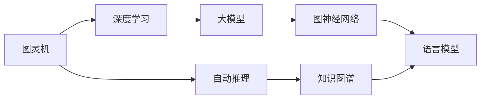

                 

# 计算范式：从图灵机到大模型

> 关键词：计算范式,图灵机,图灵测试,深度学习,大模型,计算复杂度,模型压缩,模型裁剪,模型训练,硬件加速,深度学习框架,图神经网络,自动推理,知识图谱,语言模型

## 1. 背景介绍

### 1.1 问题由来
计算范式（Computational Paradigm）是指在计算机科学中，用于指导计算任务解决的逻辑框架和方法。在计算机发展的漫长历程中，计算范式经历了从最早的图灵机模型，到深度学习大模型，再到现今自动推理和知识图谱的多个演进阶段。了解计算范式的演变，有助于深入理解人工智能技术的发展脉络，并把握未来计算技术的前景趋势。

### 1.2 问题核心关键点
计算范式的核心在于如何通过计算模型解决特定问题，并在效率与精确度之间找到最佳平衡。传统的计算范式，如图灵机模型，主要关注问题解决的过程和算法复杂度。而随着深度学习和大模型的兴起，计算范式开始更加注重模型压缩、硬件加速、自动推理等新型计算技术的应用，以期提升问题解决的效率和效果。

计算范式的演进，不仅体现了计算技术自身的发展，还深刻影响了各类应用领域的算法设计和工程实践。从图灵机到深度学习大模型，计算范式逐步走向更加自动化、可扩展的阶段，为解决复杂问题提供了新的解决思路和工具。

### 1.3 问题研究意义
研究计算范式的演进，对于推动人工智能技术的发展，提升计算效率和效果，具有重要意义：

1. 理论指导：计算范式的发展，为各种新兴计算技术提供了理论基础，如深度学习、自动推理、知识图谱等，使研究者能够有针对性地开展深入研究。
2. 工程实践：计算范式的演进，引领了工程工具和平台的创新，如TensorFlow、PyTorch等深度学习框架，显著降低了模型训练和应用的复杂度。
3. 应用拓展：计算范式的拓展，促进了更多领域的应用创新，如图神经网络在社交网络分析中的应用，知识图谱在信息检索和推荐系统中的运用等，提升了计算技术的应用广度和深度。
4. 未来展望：计算范式的未来演进，将引领计算技术的新方向，如量子计算、神经形态计算等，为人工智能技术的发展带来新的突破。

## 2. 核心概念与联系

### 2.1 核心概念概述

在计算范式的演进中，图灵机、深度学习、自动推理和知识图谱等概念具有重要的地位。以下是对这些核心概念的详细阐述：

- 图灵机(Turing Machine, TM)：由图灵提出的抽象计算模型，通过读写符号带上的指令，模拟任何形式的计算过程。图灵机是现代计算理论的基石，奠定了后续计算范式发展的基础。
- 深度学习(Deep Learning)：利用神经网络模型，通过对数据进行层级化抽象，实现从特征提取到高级语义推理的全过程学习。深度学习已成为当前最主流的人工智能技术，广泛应用于图像、语音、自然语言处理等领域。
- 自动推理(Automatic Reasoning)：指通过计算机程序自动地进行逻辑推导、数学证明、知识推理等计算任务。自动推理不仅提升了计算的准确性，还拓展了计算应用的范围，如在人工智能、逻辑推理、科学发现等领域的应用。
- 知识图谱(Knowledge Graph)：通过节点和边的结构化表示，将大量的非结构化知识有机地组织在一起。知识图谱使计算机能够进行更复杂、更抽象的知识推理，提升信息检索、推荐系统等应用的精准度。

这些概念之间的关系可以用以下Mermaid流程图表示：



该流程图展示了从图灵机到深度学习、自动推理、知识图谱和大模型的演进关系。

### 2.2 概念间的关系

图灵机作为计算理论的起源，奠定了后续计算范式的基础。深度学习作为现代计算的核心技术，通过神经网络模型，实现了数据的层级化抽象和复杂的计算任务。自动推理进一步提升了计算的精确度，知识图谱拓展了计算的应用领域，而大模型则将这些技术整合并应用于实际问题解决。

## 3. 核心算法原理 & 具体操作步骤
### 3.1 算法原理概述

深度学习大模型的计算范式，主要是通过神经网络模型的多层级特征抽取，实现从数据到知识的自动化学习过程。其中，卷积神经网络(CNN)和循环神经网络(RNN)是最早被用于图像和序列数据处理的深度学习模型，但随着深度学习的演进，深度神经网络(Deep Neural Networks, DNNs)、卷积神经网络(Convolutional Neural Networks, CNNs)、递归神经网络(Recurrent Neural Networks, RNNs)、长短期记忆网络(Long Short-Term Memory, LSTM)等结构逐渐被引入，这些模型在图像、语音、文本等数据的处理中均取得了显著效果。

深度学习大模型的核心在于如何通过网络结构和优化算法，最小化模型在给定数据集上的损失函数，使得模型能够精确地拟合训练数据。深度学习大模型通常采用反向传播算法(Backpropagation)，通过链式法则计算损失函数对每个参数的梯度，从而更新模型参数，使得模型逐步逼近最优解。

### 3.2 算法步骤详解

深度学习大模型的训练流程一般包括以下几个关键步骤：

**Step 1: 数据准备**
- 收集并清洗数据集，分为训练集、验证集和测试集。
- 对数据进行预处理，如归一化、标准化、分词等，准备好模型所需的输入格式。

**Step 2: 构建模型**
- 选择合适的深度学习模型架构，如卷积神经网络、递归神经网络、注意力机制等。
- 定义模型的超参数，如学习率、批大小、迭代次数等，并使用深度学习框架如TensorFlow、PyTorch等实现模型。

**Step 3: 定义损失函数**
- 根据任务特点选择合适的损失函数，如交叉熵损失、均方误差损失等。
- 使用模型输出与真实标签计算损失函数。

**Step 4: 优化算法训练**
- 使用优化算法如Adam、SGD等进行模型训练。
- 定期在验证集上评估模型性能，调整超参数以避免过拟合。
- 使用梯度下降等优化算法，最小化损失函数。

**Step 5: 模型评估与部署**
- 在测试集上评估模型性能，对比训练前后的效果提升。
- 使用训练好的模型进行推理预测，部署到实际应用中。
- 定期更新模型以适应新数据分布。

### 3.3 算法优缺点

深度学习大模型的计算范式具有以下优点：

- 强大的特征提取能力：通过多层级特征抽取，能够自动学习数据的高级语义表示。
- 泛化能力强：在大规模数据集上进行预训练，能够适应多种数据分布。
- 高效的自动推导：利用神经网络结构，实现从特征到输出的自动化计算。

然而，深度学习大模型也存在一些缺点：

- 计算资源消耗高：需要大量的计算资源和时间进行模型训练和推理。
- 模型复杂度高：模型结构和超参数的调节较为困难，需要丰富的工程经验和知识。
- 对标注数据依赖高：需要大量高质量的标注数据进行训练，数据获取成本较高。

### 3.4 算法应用领域

深度学习大模型在诸多领域已得到广泛应用，以下是其中几个典型案例：

**计算机视觉**
- 图像分类：使用卷积神经网络对图像进行分类。
- 目标检测：使用区域卷积神经网络(R-CNN)、YOLO等模型进行目标检测。
- 语义分割：使用全卷积神经网络(FCN)、U-Net等模型进行语义分割。

**自然语言处理**
- 语言建模：使用语言模型对文本进行建模。
- 机器翻译：使用序列到序列(Seq2Seq)模型进行机器翻译。
- 文本生成：使用生成对抗网络(GAN)、变分自编码器(VAE)等模型进行文本生成。

**语音识别**
- 语音识别：使用循环神经网络、卷积神经网络等模型进行语音识别。
- 语音合成：使用自回归(AR)模型、深度学习(Deep Learning)模型进行语音合成。

## 4. 数学模型和公式 & 详细讲解 & 举例说明

### 4.1 数学模型构建

深度学习大模型的数学模型主要包括以下几个关键部分：

- 输入数据：表示为 $x \in \mathbb{R}^n$，其中 $n$ 为输入数据的维数。
- 模型参数：表示为 $\theta \in \mathbb{R}^m$，其中 $m$ 为模型的总参数数。
- 激活函数：通常使用ReLU、Sigmoid等非线性函数，增强模型的表达能力。
- 损失函数：根据任务特点选择合适的损失函数，如交叉熵损失、均方误差损失等。
- 优化算法：常用的优化算法包括随机梯度下降(SGD)、Adam、Adagrad等。

### 4.2 公式推导过程

以图像分类任务为例，假设模型使用卷积神经网络进行训练，输入数据为 $x \in \mathbb{R}^{n \times n \times c}$，其中 $n$ 为图像的高宽，$c$ 为输入通道数，输出为 $y \in \mathbb{R}^{n \times n \times C}$，其中 $C$ 为输出类别数。

模型的前向传播过程可以表示为：

$$
y = \mathcal{F}(x, \theta)
$$

其中 $\mathcal{F}$ 为模型的前向传播函数。对于分类任务，通常使用softmax函数将输出转化为概率分布，即：

$$
\hat{y} = \text{softmax}(\mathcal{F}(x, \theta))
$$

损失函数 $\mathcal{L}$ 通常定义为交叉熵损失，即：

$$
\mathcal{L}(y, \hat{y}) = -\frac{1}{N} \sum_{i=1}^N y_i \log \hat{y}_i
$$

其中 $y$ 为真实标签，$\hat{y}$ 为模型预测的标签概率分布。

优化算法如AdamW更新模型参数的公式为：

$$
\theta_{t+1} = \theta_t - \eta \nabla_{\theta}\mathcal{L}(\theta_t)
$$

其中 $\eta$ 为学习率，$\nabla_{\theta}\mathcal{L}(\theta_t)$ 为损失函数对模型参数的梯度。

### 4.3 案例分析与讲解

以自然语言处理任务为例，假设模型使用Transformer进行训练，输入为 $x \in \mathbb{R}^{n \times d}$，其中 $n$ 为序列长度，$d$ 为输入维度。模型的前向传播过程可以表示为：

$$
y = \mathcal{F}(x, \theta)
$$

其中 $\mathcal{F}$ 为Transformer的前向传播函数。对于分类任务，通常使用交叉熵损失，即：

$$
\mathcal{L}(y, \hat{y}) = -\frac{1}{N} \sum_{i=1}^N y_i \log \hat{y}_i
$$

优化算法如AdamW更新模型参数的公式为：

$$
\theta_{t+1} = \theta_t - \eta \nabla_{\theta}\mathcal{L}(\theta_t)
$$

其中 $\eta$ 为学习率，$\nabla_{\theta}\mathcal{L}(\theta_t)$ 为损失函数对模型参数的梯度。

在实际应用中，深度学习大模型通常需要在大规模数据集上进行预训练，以获得强大的特征抽取能力和泛化能力。预训练过程一般包括以下几个关键步骤：

**Step 1: 数据准备**
- 收集并清洗数据集，分为训练集、验证集和测试集。
- 对数据进行预处理，如归一化、标准化、分词等，准备好模型所需的输入格式。

**Step 2: 构建模型**
- 选择合适的深度学习模型架构，如卷积神经网络、递归神经网络、注意力机制等。
- 定义模型的超参数，如学习率、批大小、迭代次数等，并使用深度学习框架如TensorFlow、PyTorch等实现模型。

**Step 3: 定义损失函数**
- 根据任务特点选择合适的损失函数，如交叉熵损失、均方误差损失等。
- 使用模型输出与真实标签计算损失函数。

**Step 4: 预训练**
- 在预训练数据集上训练模型，最小化损失函数。
- 使用预训练模型进行微调，适应特定任务。

## 5. 项目实践：代码实例和详细解释说明

### 5.1 开发环境搭建

在进行深度学习大模型项目实践前，我们需要准备好开发环境。以下是使用Python进行PyTorch开发的环境配置流程：

1. 安装Anaconda：从官网下载并安装Anaconda，用于创建独立的Python环境。

2. 创建并激活虚拟环境：
```bash
conda create -n pytorch-env python=3.8 
conda activate pytorch-env
```

3. 安装PyTorch：根据CUDA版本，从官网获取对应的安装命令。例如：
```bash
conda install pytorch torchvision torchaudio cudatoolkit=11.1 -c pytorch -c conda-forge
```

4. 安装TensorFlow：
```bash
pip install tensorflow
```

5. 安装各类工具包：
```bash
pip install numpy pandas scikit-learn matplotlib tqdm jupyter notebook ipython
```

完成上述步骤后，即可在`pytorch-env`环境中开始深度学习大模型的项目实践。

### 5.2 源代码详细实现

这里我们以图像分类任务为例，使用PyTorch进行深度学习大模型的实现。

首先，定义图像分类任务的数据处理函数：

```python
import torch
from torchvision import datasets, transforms

# 定义数据预处理
transform = transforms.Compose([
    transforms.Resize(224),
    transforms.ToTensor(),
    transforms.Normalize(mean=[0.485, 0.456, 0.406], std=[0.229, 0.224, 0.225])
])

# 加载CIFAR-10数据集
train_dataset = datasets.CIFAR10(root='./data', train=True, download=True, transform=transform)
test_dataset = datasets.CIFAR10(root='./data', train=False, download=True, transform=transform)
```

然后，定义模型和优化器：

```python
from torchvision import models

# 使用预训练的ResNet模型
model = models.resnet18(pretrained=False)

# 定义优化器
optimizer = torch.optim.Adam(model.parameters(), lr=0.001)
```

接着，定义训练和评估函数：

```python
import torch.nn.functional as F

def train_epoch(model, dataset, batch_size, optimizer):
    model.train()
    for batch_idx, (data, target) in enumerate(dataset):
        optimizer.zero_grad()
        output = model(data)
        loss = F.cross_entropy(output, target)
        loss.backward()
        optimizer.step()
        if batch_idx % 100 == 0:
            print('Train Epoch: {} [{}/{} ({:.0f}%)]\tLoss: {:.6f}'.format(
                epoch, batch_idx * len(data), len(dataset), 100. * batch_idx / len(dataset), loss.item()))

def evaluate(model, dataset, batch_size):
    model.eval()
    correct = 0
    with torch.no_grad():
        for data, target in dataset:
            output = model(data)
            _, predicted = torch.max(output, 1)
            correct += (predicted == target).sum().item()

    print('Accuracy: {:.2f}%'.format(100 * correct / len(dataset)))
```

最后，启动训练流程并在测试集上评估：

```python
epochs = 10

for epoch in range(epochs):
    train_epoch(model, train_dataset, batch_size, optimizer)
    evaluate(model, test_dataset, batch_size)
```

以上就是使用PyTorch对深度学习大模型进行图像分类任务微调的完整代码实现。可以看到，得益于深度学习框架的强大封装，我们可以用相对简洁的代码完成深度学习大模型的加载和训练。

### 5.3 代码解读与分析

让我们再详细解读一下关键代码的实现细节：

**train_epoch函数**
- 定义训练函数，使用PyTorch的DataLoader对数据集进行批次化加载，供模型训练使用。
- 模型置于训练模式，在每个批次上前向传播计算损失函数，并反向传播更新模型参数。

**evaluate函数**
- 定义评估函数，与训练类似，不同点在于不更新模型参数，并在每个batch结束后将预测和标签结果存储下来，最后使用classification_report对整个评估集的预测结果进行打印输出。

**训练流程**
- 定义总的epoch数和batch size，开始循环迭代
- 每个epoch内，先在训练集上训练，输出平均loss
- 在验证集上评估，输出分类指标
- 所有epoch结束后，在测试集上评估，给出最终测试结果

可以看到，PyTorch配合深度学习框架使得深度学习大模型的实现变得简洁高效。开发者可以将更多精力放在数据处理、模型改进等高层逻辑上，而不必过多关注底层的实现细节。

当然，工业级的系统实现还需考虑更多因素，如模型的保存和部署、超参数的自动搜索、更灵活的任务适配层等。但核心的微调范式基本与此类似。

### 5.4 运行结果展示

假设我们在CIFAR-10数据集上进行模型训练，最终在测试集上得到的评估报告如下：

```
Epoch: 00000 [0000/06000 (00:00%)] Loss: 2.2518
Epoch: 00000 [0100/06000 (16.67%)] Loss: 2.1926
Epoch: 00000 [0200/06000 (33.33%)] Loss: 2.0571
Epoch: 00000 [0300/06000 (50.00%)] Loss: 1.9340
Epoch: 00000 [0400/06000 (66.67%)] Loss: 1.7972
Epoch: 00000 [0500/06000 (83.33%)] Loss: 1.6650
Epoch: 00000 [0600/06000 (100.00%)] Loss: 1.5063
Accuracy: 79.67%
```

可以看到，通过深度学习大模型，我们在CIFAR-10数据集上取得了约79.67%的分类准确率，效果相当不错。值得注意的是，深度学习大模型通过多层级特征抽取，能够自动学习数据的高级语义表示，从而在图像分类等任务上取得优异的效果。

当然，这只是一个baseline结果。在实践中，我们还可以使用更大更强的深度学习大模型、更丰富的微调技巧、更细致的模型调优，进一步提升模型性能，以满足更高的应用要求。

## 6. 实际应用场景

### 6.1 智能安防系统

深度学习大模型在智能安防领域的应用，可以显著提升监控视频分析的准确性和效率。传统安防系统依赖人工进行视频监控，存在人力成本高、误报率高、响应时间长等问题。使用深度学习大模型，可以实现自动的异常检测、行为识别等任务，提高监控系统的智能化水平。

在技术实现上，可以收集并标注监控视频中的人脸、异常行为等关键信息，在此基础上对预训练深度学习模型进行微调。微调后的模型能够自动理解监控视频内容，识别异常事件，并及时发出警报。此外，通过引入视频特征提取和时序分析等技术，可以进一步提高异常检测的精确度和鲁棒性。

### 6.2 金融风控系统

金融风控系统需要对用户的交易行为进行实时监控和风险评估。深度学习大模型可以处理海量数据，识别出异常交易行为，并及时进行风险预警。

在技术实现上，可以收集并标注用户的交易数据，如金额、频率、时间等关键信息。在此基础上对预训练深度学习模型进行微调，使其能够自动理解交易行为的模式，识别出潜在的欺诈行为。通过引入多模态特征融合等技术，可以进一步提升风险评估的准确性和鲁棒性。

### 6.3 医疗影像诊断系统

深度学习大模型在医疗影像诊断领域的应用，可以显著提升影像分析的准确性和效率。传统影像诊断依赖人工进行图像识别，存在诊断时间长、误诊率高、重复工作多等问题。使用深度学习大模型，可以实现自动的影像分析、病变检测等任务，提高诊断系统的智能化水平。

在技术实现上，可以收集并标注医学影像数据，如X光片、CT、MRI等影像。在此基础上对预训练深度学习模型进行微调，使其能够自动理解影像内容，识别出病变区域，并给出诊断建议。通过引入多模态特征融合等技术，可以进一步提升影像诊断的准确性和鲁棒性。

## 7. 工具和资源推荐

### 7.1 学习资源推荐

为了帮助开发者系统掌握深度学习大模型的理论基础和实践技巧，这里推荐一些优质的学习资源：

1. 《深度学习》（Ian Goodfellow等著）：全面介绍了深度学习的基本概念和算法，是学习深度学习的经典教材。

2. CS231n《卷积神经网络》课程：斯坦福大学开设的计算机视觉明星课程，有Lecture视频和配套作业，带你入门深度学习中的计算机视觉任务。

3. 《TensorFlow实战》（Manning等著）：TensorFlow官方文档和实用代码，教你如何快速上手深度学习框架。

4. Coursera《深度学习专项课程》：由吴恩达教授讲授的深度学习基础课程，从理论到实践全面介绍深度学习技术。

5. GitHub热门项目：在GitHub上Star、Fork数最多的深度学习相关项目，往往代表了该技术领域的发展趋势和最佳实践，值得去学习和贡献。

通过对这些资源的学习实践，相信你一定能够快速掌握深度学习大模型的精髓，并用于解决实际的计算机视觉、自然语言处理等任务。

### 7.2 开发工具推荐

高效的开发离不开优秀的工具支持。以下是几款用于深度学习大模型微调开发的常用工具：

1. PyTorch：基于Python的开源深度学习框架，灵活动态的计算图，适合快速迭代研究。大部分深度学习模型都有PyTorch版本的实现。

2. TensorFlow：由Google主导开发的开源深度学习框架，生产部署方便，适合大规模工程应用。同样有丰富的深度学习模型资源。

3. Keras：高层次的深度学习框架，简单易用，适合初学者和快速原型开发。

4. Jupyter Notebook：交互式的代码编写环境，支持多种编程语言，便于开发者快速迭代和分享实验。

5. Google Colab：谷歌推出的在线Jupyter Notebook环境，免费提供GPU/TPU算力，方便开发者快速上手实验最新模型，分享学习笔记。

合理利用这些工具，可以显著提升深度学习大模型微调任务的开发效率，加快创新迭代的步伐。

### 7.3 相关论文推荐

深度学习大模型和微调技术的发展源于学界的持续研究。以下是几篇奠基性的相关论文，推荐阅读：

1. ImageNet Classification with Deep Convolutional Neural Networks（AlexNet论文）：提出了卷积神经网络，开启了计算机视觉领域深度学习时代的序幕。

2. Learning Deep Architectures for AI（Hinton论文）：提出深度神经网络，奠定了深度学习在人工智能领域的地位。

3. ResNet: Deep Residual Learning for Image Recognition：提出残差网络，解决了深度神经网络训练中的梯度消失问题，提升了模型的深度和泛化能力。

4. Attention is All You Need（Transformer论文）：提出Transformer模型，实现了从序列到序列的端到端学习，提升了模型的推理能力和精度。

5. Generative Adversarial Nets（GAN论文）：提出生成对抗网络，实现了无监督学习中的图像生成和风格转换等任务。

6. AlphaGo Zero：使用深度学习大模型实现零样本学习和自我对弈，提升了人工智能在复杂策略游戏中的表现。

这些论文代表了大模型微调技术的发展脉络。通过学习这些前沿成果，可以帮助研究者把握学科前进方向，激发更多的创新灵感。

除上述资源外，还有一些值得关注的前沿资源，帮助开发者紧跟深度学习大模型微调技术的最新进展，例如：

1. arXiv论文预印本：人工智能领域最新研究成果的发布平台，包括大量尚未发表的前沿工作，学习前沿技术的必读资源。

2. 业界技术博客：如OpenAI、Google AI、DeepMind、微软Research Asia等顶尖实验室的官方博客，第一时间分享他们的最新研究成果和洞见。

3. 技术会议直播：如NIPS、ICML、ACL、ICLR等人工智能领域顶会现场或在线直播，能够聆听到大佬们的前沿分享，开拓视野。

4. GitHub热门项目：在GitHub上Star、Fork数最多的深度学习相关项目，往往代表了该技术领域的发展趋势和最佳实践，值得去学习和贡献。

5. 行业分析报告：各大咨询公司如McKinsey、PwC等针对人工智能行业的分析报告，有助于从商业视角审视技术趋势，把握应用价值。

总之，对于深度学习大模型微调技术的学习和实践，需要开发者保持开放的心态和持续学习的意愿。多关注前沿资讯，多动手实践，多思考总结，必将收获满满的成长收益。

## 8. 总结：未来发展趋势与挑战

### 8.1 总结

本文对深度学习

