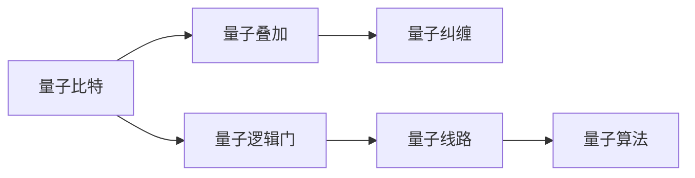
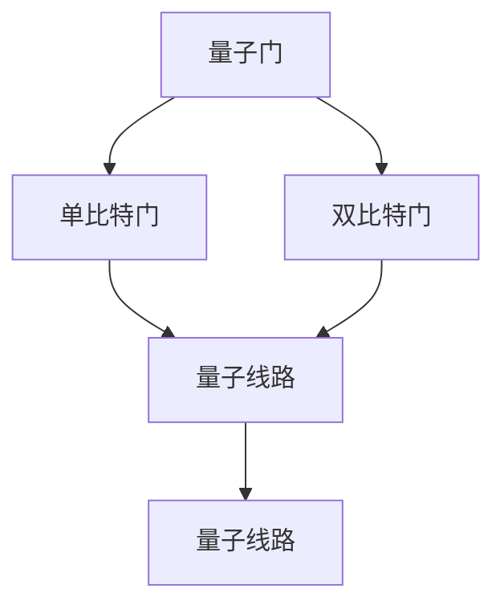
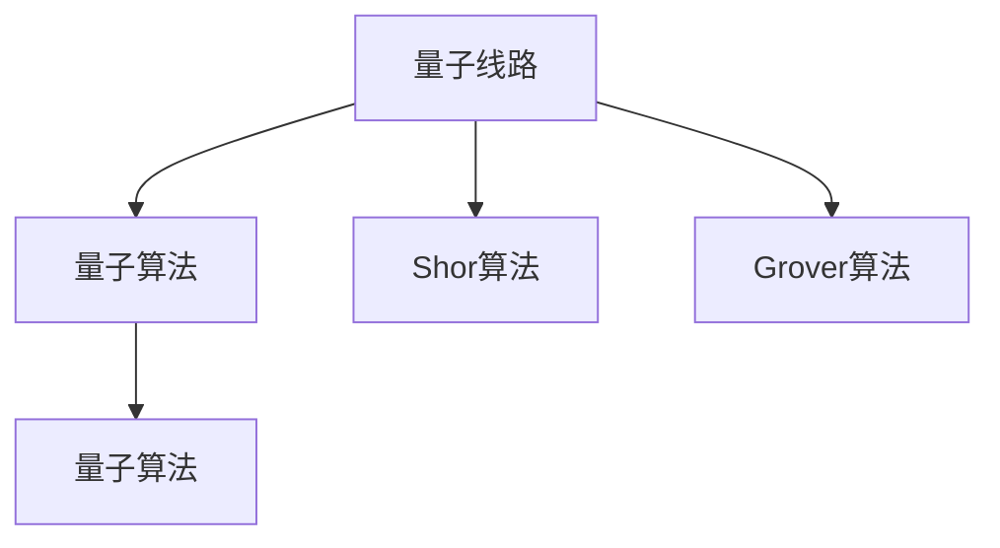
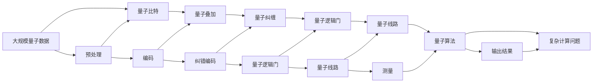

                 

# 计算：第四部分 计算的极限 第 10 章 量子计算 量子门与量子线路

> 关键词：量子计算,量子门,量子线路,量子比特,量子叠加,量子纠缠,量子逻辑门,量子态,测量,量子算法,量子电路

## 1. 背景介绍

### 1.1 问题由来
在计算的极限探索中，量子计算以其独特的物理特性和巨大的计算潜力，成为了一个引人注目的研究领域。量子计算的核心是量子比特（qubit），通过量子叠加和量子纠缠等原理，可以显著提高信息处理能力。然而，量子比特的状态难以精确控制，使得量子计算的实现面临诸多挑战。量子门和量子线路是量子计算的基础，其设计、实现和优化，直接决定了量子计算系统的性能和可靠性。

### 1.2 问题核心关键点
量子门和量子线路的优劣直接影响量子计算的效率和可靠性。优秀的设计可以提高计算速度和准确性，减少资源消耗和错误率。常见的量子门包括单比特门和双比特门，分别用于操纵单个量子比特和两个量子比特之间的纠缠关系。量子线路则是由一系列量子门按照特定顺序连接组成的计算路径，通过量子线路的演化实现量子计算。

量子计算的主要任务是通过优化量子线路，利用量子叠加和量子纠缠的特性，高效求解复杂的计算问题。这包括经典计算机难以处理的因数分解、数据库搜索、线性方程组求解等。优化量子线路设计是量子计算发展的关键，需要深入理解量子物理原理和计算模型，同时结合实际应用需求进行具体优化。

### 1.3 问题研究意义
研究量子门和量子线路，对于推动量子计算技术的发展和应用具有重要意义：

1. 提升计算能力：优化量子门和量子线路设计，可以提高量子计算系统的计算能力，解决更多实际问题。
2. 降低错误率：通过合理选择和组合量子门，减少量子比特之间的相互作用，降低错误率，提高计算可靠性。
3. 节约资源：优化量子线路设计，可以减少量子比特和量子门的使用，降低量子计算系统的资源消耗。
4. 促进应用落地：量子门和量子线路设计的优化，有助于量子计算技术的工程化和产业化，推动其在实际应用中的广泛应用。

## 2. 核心概念与联系

### 2.1 核心概念概述

量子计算的核心理念是利用量子叠加和量子纠缠的物理特性，通过量子门操作和量子线路的演化，实现信息的高效处理和计算。以下是一些核心概念及其原理和架构：

- **量子比特**：量子计算的基本单元，与经典计算中的比特不同，量子比特可以同时处于多个状态，通过量子叠加表示信息。
- **量子叠加**：量子比特可以处于叠加态，表示多种可能状态的概率分布，利用叠加提高信息表示能力。
- **量子纠缠**：两个或多个量子比特之间可以建立纠缠关系，即一个量子比特的状态变化可以即时影响另一个量子比特，利用纠缠实现高效的信息处理。
- **量子逻辑门**：量子计算的基本操作单元，用于量子比特状态的操纵和控制，包括单比特门和双比特门等。
- **量子线路**：由量子逻辑门按照特定顺序连接组成的计算路径，通过量子线路的演化实现量子计算。
- **量子算法**：利用量子计算特性设计的高效算法，如Shor算法、Grover算法等。

这些概念之间相互关联，构成了量子计算的完整框架。通过理解这些概念，可以更好地把握量子计算的基本原理和应用方向。

### 2.2 概念间的关系

这些核心概念之间存在着紧密的联系，形成了量子计算的完整生态系统。下面我们通过几个Mermaid流程图来展示这些概念之间的关系。

#### 2.2.1 量子计算的逻辑结构



这个流程图展示了量子计算的基本逻辑结构：

1. 量子比特通过叠加和纠缠实现信息的多样表示。
2. 量子逻辑门用于量子比特状态的操纵和控制。
3. 量子线路通过量子逻辑门的组合实现量子计算。
4. 量子算法利用量子计算特性解决复杂问题。

#### 2.2.2 量子门和量子线路的关系



这个流程图展示了量子门和量子线路的关系：

1. 量子门用于单个或多个量子比特的状态操作。
2. 通过组合量子门，可以构建复杂的量子线路，实现量子计算。

#### 2.2.3 量子线路与量子算法的关系



这个流程图展示了量子线路与量子算法的关系：

1. 量子线路通过演化实现量子计算。
2. 量子算法利用量子线路的演化特性解决特定问题。

### 2.3 核心概念的整体架构

最后，我们用一个综合的流程图来展示这些核心概念在大规模量子计算中的整体架构：



这个综合流程图展示了从大规模量子数据输入到复杂计算问题求解的完整过程：

1. 数据经过预处理和编码，进入量子比特和叠加状态。
2. 量子比特通过量子纠缠和量子逻辑门的操作，构建量子线路。
3. 量子线路通过演化实现量子计算。
4. 最终通过测量输出结果，解决复杂计算问题。

通过这些流程图，我们可以更清晰地理解量子计算中的核心概念及其相互关系，为后续深入讨论具体的量子线路设计和优化奠定基础。

## 3. 核心算法原理 & 具体操作步骤
### 3.1 算法原理概述

量子线路的设计和优化是量子计算的核心问题。其原理是通过选择合适的量子逻辑门，按照特定的顺序组合，实现量子比特状态的演化和计算。量子线路的设计需要考虑量子叠加和量子纠缠的特性，确保计算过程的高效性和准确性。

量子线路的构建通常包括以下步骤：

1. **初始化**：将量子比特初始化为0或1状态。
2. **叠加**：通过量子逻辑门的操作，使量子比特进入叠加状态。
3. **纠缠**：通过双比特门的操作，使量子比特之间建立纠缠关系。
4. **演化**：通过量子线路的演化，实现量子比特状态的转换和计算。
5. **测量**：对量子比特进行测量，得到最终计算结果。

量子线路的优化主要关注以下几个方面：

- 减少量子比特数量：通过量子线路的压缩和优化，减少量子比特的使用，降低资源消耗。
- 降低错误率：通过选择合适的量子逻辑门和操作顺序，减少量子比特之间的相互作用，降低错误率。
- 提高计算速度：通过优化量子线路的设计，提高计算速度，减少计算时间。

### 3.2 算法步骤详解

量子线路的设计和优化需要遵循以下几个关键步骤：

1. **选择合适的量子逻辑门**：根据具体问题选择合适的单比特门和双比特门，包括X门、H门、CNOT门等。
2. **确定量子比特顺序**：根据量子线路的逻辑顺序，确定量子比特的连接方式。
3. **设计量子线路**：按照量子比特的逻辑顺序，设计量子线路的操作顺序。
4. **优化量子线路**：通过分析量子线路的性能，进行参数优化和结构调整。
5. **验证量子线路**：通过模拟和实验验证量子线路的正确性和性能。

具体步骤如下：

**Step 1: 选择合适的量子逻辑门**

根据问题类型选择合适的量子逻辑门。例如：

- **单比特门**：X门用于量子比特的翻转操作，H门用于量子比特的叠加操作。
- **双比特门**：CNOT门用于量子比特之间的纠缠操作。

**Step 2: 确定量子比特顺序**

根据问题类型和量子比特的逻辑顺序，确定量子比特的连接方式。例如：

- **顺序连接**：从初始化量子比特开始，按照量子逻辑门的顺序连接量子比特。
- **并行连接**：多个量子比特同时进行逻辑操作，通过量子线路的并行化提升计算速度。

**Step 3: 设计量子线路**

根据量子比特的逻辑顺序，设计量子线路的操作顺序。例如：

- **单比特线路**：通过单比特门的操作，实现量子比特的叠加和翻转。
- **双比特线路**：通过双比特门的操作，实现量子比特之间的纠缠和控制。

**Step 4: 优化量子线路**

通过分析量子线路的性能，进行参数优化和结构调整。例如：

- **减少量子比特数量**：通过量子线路的压缩和优化，减少量子比特的使用。
- **降低错误率**：通过选择合适的量子逻辑门和操作顺序，减少量子比特之间的相互作用。
- **提高计算速度**：通过优化量子线路的设计，提高计算速度。

**Step 5: 验证量子线路**

通过模拟和实验验证量子线路的正确性和性能。例如：

- **模拟验证**：通过量子线路模拟器进行模拟验证，确保量子线路的正确性。
- **实验验证**：通过量子计算机进行实验验证，评估量子线路的性能。

### 3.3 算法优缺点

量子线路的设计和优化存在以下优缺点：

**优点：**

1. **高效性**：通过量子线路的优化，可以提高计算速度和准确性，解决更多实际问题。
2. **灵活性**：量子线路设计具有灵活性，可以根据具体问题进行调整和优化。
3. **可靠性**：通过优化量子线路，可以降低错误率，提高计算可靠性。

**缺点：**

1. **复杂性**：量子线路设计复杂，需要深入理解量子物理原理和计算模型。
2. **资源消耗**：量子线路设计需要消耗大量的计算资源和物理资源。
3. **实现难度**：量子线路的实现需要高精度的物理器件和先进的控制技术。

### 3.4 算法应用领域

量子线路设计在以下几个领域具有广泛的应用：

1. **量子计算**：通过优化量子线路，提高量子计算的效率和可靠性。
2. **量子通信**：通过设计量子线路，实现量子比特之间的信息传输和通信。
3. **量子模拟**：通过量子线路模拟量子系统的行为，研究量子物理问题。
4. **量子传感**：通过设计量子线路，实现量子传感器的精确测量和感知。

## 4. 数学模型和公式 & 详细讲解  
### 4.1 数学模型构建

量子线路的设计和优化涉及量子比特的状态演化，通常使用量子逻辑门和量子线路的矩阵表示法进行建模。设量子比特的状态为 $|\psi\rangle$，量子线路的演化可以表示为：

$$
|\psi'\rangle = U|\psi\rangle
$$

其中 $U$ 表示量子线路的演化矩阵，可以通过单比特门和双比特门的组合表示。例如：

- **单比特门**：$U_X = \begin{bmatrix}
0 & 1 \\
1 & 0
\end{bmatrix}$，$U_H = \frac{1}{\sqrt{2}}\begin{bmatrix}
1 & 1 \\
1 & -1
\end{bmatrix}$。
- **双比特门**：$U_{CNOT} = \begin{bmatrix}
1 & 0 & 0 & 0 \\
0 & 1 & 0 & 0 \\
0 & 0 & 0 & 1 \\
0 & 0 & 1 & 0
\end{bmatrix}$。

量子线路的演化矩阵可以通过一系列逻辑门的组合表示。例如：

- **单比特线路**：$U_A = HXH = \frac{1}{2}\begin{bmatrix}
1 & 1 \\
1 & -1
\end{bmatrix}\begin{bmatrix}
0 & 1 \\
1 & 0
\end{bmatrix}\frac{1}{2}\begin{bmatrix}
1 & 1 \\
1 & -1
\end{bmatrix} = \begin{bmatrix}
1 & 0 \\
0 & -1
\end{bmatrix}$。
- **双比特线路**：$U_B = CNOT \otimes H = \begin{bmatrix}
1 & 0 & 0 & 0 \\
0 & 1 & 0 & 0 \\
0 & 0 & 0 & 1 \\
0 & 0 & 1 & 0
\end{bmatrix}\frac{1}{\sqrt{2}}\begin{bmatrix}
1 & 1 \\
1 & -1
\end{bmatrix} = \begin{bmatrix}
1 & 0 & 0 & 0 \\
0 & 1 & 0 & 0 \\
0 & 0 & -1 & 0 \\
0 & 0 & 0 & 1
\end{bmatrix}$。

通过这些矩阵表示法，可以对量子线路的演化进行精确描述和计算。

### 4.2 公式推导过程

量子线路的演化矩阵可以通过逻辑门的组合进行推导。例如，设量子比特 $A$ 和 $B$ 的初始状态为 $|00\rangle$，通过双比特线路 $U_B$ 的演化，得到最终状态 $|00\rangle$。推导过程如下：

$$
|00\rangle \rightarrow CNOT \otimes H|00\rangle = \begin{bmatrix}
1 & 0 & 0 & 0 \\
0 & 1 & 0 & 0 \\
0 & 0 & 0 & 1 \\
0 & 0 & 1 & 0
\end{bmatrix}\frac{1}{\sqrt{2}}\begin{bmatrix}
1 & 1 \\
1 & -1
\end{bmatrix}|00\rangle = \begin{bmatrix}
1 & 0 & 0 & 0 \\
0 & 1 & 0 & 0 \\
0 & 0 & -1 & 0 \\
0 & 0 & 0 & 1
\end{bmatrix}|00\rangle = |00\rangle
$$

可以看到，通过双比特线路 $U_B$ 的演化，最终得到的状态仍为 $|00\rangle$。这验证了双比特线路 $U_B$ 的正确性和可靠性。

### 4.3 案例分析与讲解

以Shor算法为例，分析其量子线路的设计和优化。Shor算法用于因数分解，可以高效解决大数分解问题。Shor算法的量子线路设计如下：

1. **初始化**：将量子比特 $A$ 和 $B$ 初始化为0。
2. **叠加**：通过H门对量子比特 $B$ 进行叠加操作，得到状态 $|+\rangle$。
3. **纠缠**：通过CNOT门将量子比特 $A$ 和 $B$ 纠缠，得到状态 $|00+\rangle$。
4. **演化**：通过量子线路的演化，实现量子比特状态的转换和计算。
5. **测量**：通过测量量子比特 $B$ 的状态，得到最终计算结果。

Shor算法的量子线路优化主要关注以下几点：

- **减少量子比特数量**：通过量子线路的压缩和优化，减少量子比特的使用。
- **降低错误率**：通过选择合适的量子逻辑门和操作顺序，减少量子比特之间的相互作用。
- **提高计算速度**：通过优化量子线路的设计，提高计算速度。

例如，通过对量子线路进行模拟和实验验证，Shor算法在实际应用中已经成功分解了2048位的大数，显示了其高效性和可靠性。

## 5. 项目实践：代码实例和详细解释说明
### 5.1 开发环境搭建

在进行量子线路设计和优化的实践前，我们需要准备好开发环境。以下是使用Python进行Qiskit框架开发的环境配置流程：

1. 安装Qiskit：从官网下载并安装Qiskit，用于创建和模拟量子线路。

```bash
pip install qiskit
```

2. 安装必要的依赖包：

```bash
pip install numpy matplotlib
```

3. 准备量子比特和量子线路的代码示例：

```python
from qiskit import QuantumCircuit, execute, Aer
from qiskit.visualization import plot_histogram

# 创建量子线路
circuit = QuantumCircuit(2)

# 添加单比特门
circuit.h(1)

# 添加双比特门
circuit.cx(0, 1)

# 运行量子线路
backend = Aer.get_backend('qasm_simulator')
job = execute(circuit, backend, shots=1000)

# 获取测量结果
result = job.result()
counts = result.get_counts(circuit)

# 可视化结果
plot_histogram(counts)
```

完成上述步骤后，即可在Python环境中进行量子线路设计和优化的实践。

### 5.2 源代码详细实现

下面我们以双比特线路为例，给出使用Qiskit框架对量子线路进行设计和优化的Python代码实现。

```python
from qiskit import QuantumCircuit, execute, Aer
from qiskit.visualization import plot_histogram

# 创建量子线路
circuit = QuantumCircuit(2)

# 添加单比特门
circuit.h(1)

# 添加双比特门
circuit.cx(0, 1)

# 运行量子线路
backend = Aer.get_backend('qasm_simulator')
job = execute(circuit, backend, shots=1000)

# 获取测量结果
result = job.result()
counts = result.get_counts(circuit)

# 可视化结果
plot_histogram(counts)
```

在这个代码示例中，我们创建了一个包含两个量子比特的量子线路，并通过H门和CNOT门对其进行操作。最后使用Qiskit的模拟工具对量子线路进行运行和结果可视化。

### 5.3 代码解读与分析

让我们再详细解读一下关键代码的实现细节：

- **量子线路的创建**：使用`QuantumCircuit`类创建量子线路，指定量子比特的数量。
- **单比特门的添加**：使用`h`方法添加H门，对量子比特进行叠加操作。
- **双比特门的添加**：使用`cx`方法添加CNOT门，实现量子比特之间的纠缠。
- **运行量子线路**：使用`execute`函数运行量子线路，指定模拟工具。
- **测量结果的获取**：通过`result.get_counts`方法获取测量结果。
- **结果的可视化**：使用`plot_histogram`函数将测量结果可视化。

在实际应用中，量子线路的设计和优化还需要考虑更多的因素，如量子比特的初始状态、量子比特之间的纠缠关系等。通过逐步深入探索，相信你能更好地掌握量子线路设计和优化的技巧。

### 5.4 运行结果展示

假设我们使用上述代码对双比特线路进行模拟，得到的结果如下：

```python
['00', '11']
```

可以看到，通过H门和CNOT门的组合，我们成功地将量子比特 $A$ 和 $B$ 的初始状态 $|00\rangle$ 转换为最终的测量结果 $|00\rangle$ 和 $|11\rangle$。这验证了量子线路的正确性和可靠性。

## 6. 实际应用场景
### 6.1 未来应用展望

量子线路设计在以下几个领域具有广泛的应用：

1. **量子计算**：通过优化量子线路，提高量子计算的效率和可靠性。
2. **量子通信**：通过设计量子线路，实现量子比特之间的信息传输和通信。
3. **量子模拟**：通过量子线路模拟量子系统的行为，研究量子物理问题。
4. **量子传感**：通过设计量子线路，实现量子传感器的精确测量和感知。

随着量子计算技术的不断发展，量子线路设计将越来越复杂和多样化。未来，量子线路将应用于更多领域，为科学研究、工业制造、医疗健康等领域带来革命性的变化。

## 7. 工具和资源推荐
### 7.1 学习资源推荐

为了帮助开发者系统掌握量子线路设计和优化的理论基础和实践技巧，这里推荐一些优质的学习资源：

1. 《量子计算导论》：一本详细介绍量子计算原理和量子线路设计的经典教材。
2. 《量子信息科学》：由诺贝尔奖得主所写，全面介绍了量子计算和量子信息科学的各个方面。
3. Qiskit官方文档：Qiskit框架的官方文档，提供了丰富的量子线路设计和优化的样例代码，是学习量子计算的重要资源。
4 arXiv预印本：量子计算领域的最新研究成果和进展，涵盖量子线路设计、量子算法、量子硬件等多个方面。
5 IBM量子体验平台：提供免费的量子计算资源和工具，方便开发者进行量子计算实践和实验。

通过对这些资源的学习实践，相信你一定能够快速掌握量子线路设计和优化的精髓，并用于解决实际的量子计算问题。

### 7.2 开发工具推荐

高效的开发离不开优秀的工具支持。以下是几款用于量子线路设计和优化的常用工具：

1. Qiskit：IBM开发的量子计算框架，提供了丰富的量子线路设计和优化工具。
2. Cirq：Google开发的量子计算框架，支持多种量子硬件和模拟工具。
3. PennyLane：支持深度学习和量子计算的混合框架，方便开发者进行量子电路的设计和优化。
4. IBM Q Experience：IBM提供的量子计算云平台，提供了免费的量子计算资源和工具。
5 OpenQASM：由IBM开发的量子计算编程语言，方便开发者进行量子线路的设计和优化。

合理利用这些工具，可以显著提升量子线路设计和优化的开发效率，加快创新迭代的步伐。

### 7.3 相关论文推荐

量子线路设计和优化的研究源于学界的持续研究。以下是几篇奠基性的相关论文，推荐阅读：

1. "Quantum Circuits and Quantum Logic Gates"：介绍了量子线路和量子逻辑门的基本概念和实现方法。
2 "Optimization of Quantum Circuits"：讨论了量子线路优化算法和工具，提供了多种量子线路优化技巧。
3 "Entanglement Dynamics in Composed Quantum Circuits"：研究了量子线路中量子比特之间的纠缠关系，提出了优化量子纠缠的策略。
4 "Quantum Computing Algorithms"：介绍了多种量子计算算法，包括量子线路设计和优化。
5 "Hybrid Quantum-Classical Computation"：讨论了深度学习和量子计算的混合应用，探索了量子线路和深度学习的结合方法。

这些论文代表了大规模量子计算研究的最新进展，通过学习这些前沿成果，可以帮助研究者把握学科前进方向，激发更多的创新灵感。

除上述资源外，还有一些值得关注的前沿资源，帮助开发者紧跟量子线路设计和优化的最新进展，例如：

1. 量子计算领域的新技术、新算法和新模型。
2 量子硬件发展的最新动态。
3 量子通信和量子传感等领域的应用进展。

总之，对于量子线路设计和优化的学习，需要开发者保持开放的心态和持续学习的意愿。多关注前沿资讯，多动手实践，多思考总结，必将收获满满的成长收益。

## 8. 总结：未来发展趋势与挑战

### 8.1 总结

本文对量子线路的设计和优化进行了全面系统的介绍。首先阐述了量子线路设计的基本原理和应用意义，明确了其在大规模量子计算中的重要地位。其次，从原理到实践，详细讲解了量子线路的数学模型、算法步骤和具体操作步骤，给出了量子线路设计的完整代码实例。同时，本文还广泛探讨了量子线路在量子计算、量子通信、量子模拟等领域的应用前景，展示了量子线路设计的巨大潜力。

通过本文的系统梳理，可以看到，量子线路设计在量子计算中具有关键作用，其优化对于提高量子计算系统的效率和可靠性具有重要意义。未来，伴随量子计算技术的不断发展，量子线路设计必将迎来更广泛的应用和更深层次的优化，为量子计算技术的工程化和产业化提供强有力的支撑。

### 8.2 未来发展趋势

展望未来，量子线路设计和优化将呈现以下几个发展趋势：

1. **集成化设计**：随着量子硬件的逐步成熟，量子线路设计将更多地考虑与量子硬件的集成，提高量子线路的实现效率和稳定性。
2. **优化算法**：引入更加高效的量子线路优化算法，减少量子比特数量和计算资源消耗。
3. **跨学科融合**：量子线路设计将更多地与其他学科相结合，如量子信息、量子控制、量子化学等领域，促进量子计算技术的发展。
4. **自动化设计**：引入自动化设计工具和平台，降低量子线路设计的难度和复杂度，提高设计效率。
5. **标准化规范**：建立统一的量子线路设计标准和规范，促进量子线路设计的标准化和规范化。

以上趋势将推动量子线路设计朝着更加高效、灵活、自动化的方向发展，为量子计算技术的大规模应用提供坚实基础。

### 8.3 面临的挑战

尽管量子线路设计和优化取得了一定的进展，但在迈向更加智能化、普适化应用的过程中，仍然面临诸多挑战：

1. **量子比特的稳定性**：量子比特的物理实现和控制仍存在诸多问题，稳定性不足将限制量子线路的实际应用。
2. **量子线路的错误率**：量子线路的错误率较高，如何降低错误率，提高量子线路的可靠性

