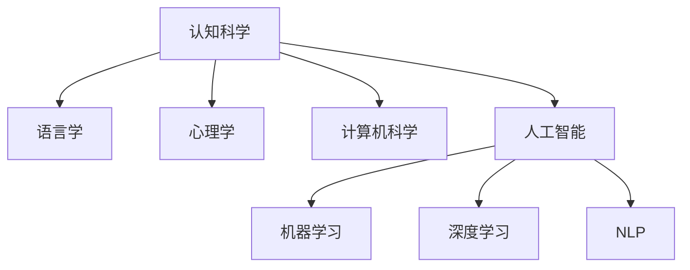
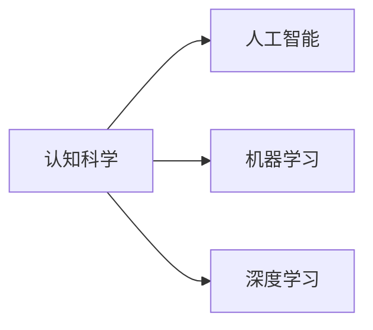
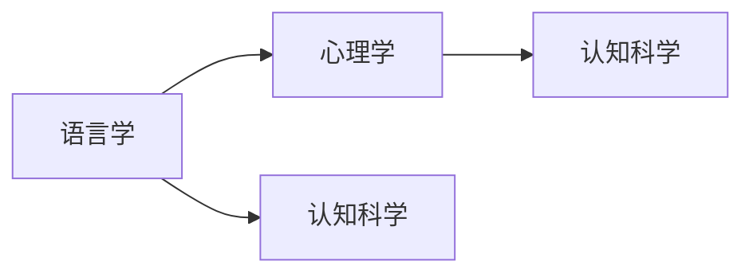
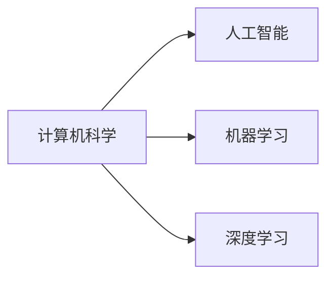

                 

# 认知的形式化：近10000年以来，人类发明了语言、文字、工具、教育、科技，产生了文化和文明

> 关键词：认知科学,语言学,心理学,计算机科学,人工智能

## 1. 背景介绍

### 1.1 问题由来
在人类历史的漫长进程中，语言、文字、工具、教育、科技等发明，逐渐塑造了人类文明的形态和轨迹。语言不仅是人类交际的媒介，更是思维和认知的载体。文字的出现，使得人类的知识、思想和经验的记录和传承成为可能，大大加速了文明的进步。工具的发明和应用，解放了人类的双手，提高了生产力和生活质量。教育使得知识得以在代际间传承，科技进步又为社会带来翻天覆地的变化。

随着计算机科学和人工智能技术的飞速发展，人类开始尝试将认知过程形式化，利用计算机模拟和实现人类的思维和认知能力。这一过程，被称为认知科学(Cognitive Science)。认知科学结合了语言学、心理学、计算机科学、哲学等多个领域的知识，试图揭示人类认知的本质和规律。

## 2. 核心概念与联系

### 2.1 核心概念概述

为更好地理解认知科学，本节将介绍几个密切相关的核心概念：

- 认知科学(Cognitive Science)：研究人类认知过程和认知能力的科学，涵盖了语言学、心理学、神经科学、计算机科学等多个领域，旨在揭示人类认知的本质和规律。

- 语言学(Linguistics)：研究语言的起源、结构、演变和使用的科学，探讨语言的符号、语法和语义等基本问题。

- 心理学(Psychology)：研究人类行为、心理过程和心理特征的科学，关注知觉、记忆、学习、思维、情感等方面的心理学原理。

- 计算机科学(Computer Science)：研究计算机及其相关技术的科学，涵盖了算法、数据结构、编程语言、人工智能等诸多方面。

- 人工智能(Artificial Intelligence, AI)：通过算法和计算技术模拟人类智能能力的科学，旨在实现智能系统的自主学习、推理、判断、决策等功能。

- 机器学习(Machine Learning, ML)：通过数据驱动的算法训练模型，使机器具备一定的学习能力和预测能力，是实现人工智能的关键技术之一。

- 深度学习(Deep Learning)：一种特殊的机器学习方法，使用多层神经网络对数据进行建模，模拟人类大脑的计算方式，在图像、语音、自然语言处理等领域取得了显著成果。

- 自然语言处理(Natural Language Processing, NLP)：利用计算机处理和理解人类语言的技术，涉及语言模型、文本分析、机器翻译、语音识别等多个方向。

这些核心概念之间的逻辑关系可以通过以下Mermaid流程图来展示：



这个流程图展示了认知科学的各个分支学科，以及它们之间相互关联的关系。

### 2.2 概念间的关系

这些核心概念之间存在着紧密的联系，形成了认知科学的研究框架。以下是几个Mermaid流程图，展示这些概念之间的关系：

#### 2.2.1 认知科学与人工智能的关系



这个流程图展示了认知科学通过机器学习和深度学习技术，实现对人类智能的模拟和仿真。

#### 2.2.2 语言学与心理学之间的关系



这个流程图展示了语言学和心理学在认知科学中的地位和作用，以及它们之间的相互影响。

#### 2.2.3 计算机科学与人工智能的关系



这个流程图展示了计算机科学通过机器学习和深度学习，实现对人工智能的支撑和推动。

## 3. 核心算法原理 & 具体操作步骤
### 3.1 算法原理概述

认知科学的研究核心是通过形式化方法揭示人类认知的机制和规律。形式化方法通常包括符号计算、逻辑推理、神经网络等技术手段。

符号计算(Symbolic Computation)是认知科学中最基本的算法原理，它通过将认知过程抽象为符号操作，实现对人类思维和推理过程的模拟。逻辑推理(Logic Reasoning)则是通过形式化的逻辑系统，对认知过程进行推理和验证。神经网络(Neural Networks)则模拟人类神经系统的结构和功能，通过大量数据的训练，实现对认知过程的拟合和预测。

### 3.2 算法步骤详解

基于认知科学的算法步骤通常包括以下几个关键步骤：

**Step 1: 定义认知模型**

- 确定认知模型的目标，如自然语言理解、情感分析、知识推理等。
- 根据目标选择合适的符号系统，如一阶逻辑、谓词逻辑、谓词演算等。
- 设计认知模型的主体结构，如语义网络、知识图谱、神经网络等。

**Step 2: 数据准备与预处理**

- 收集和整理相关的认知数据，如文本、图像、音频等。
- 对数据进行清洗、标注和分割，生成训练集、验证集和测试集。
- 对数据进行标准化处理，如特征提取、归一化、去除噪声等。

**Step 3: 模型训练与优化**

- 选择合适的算法和优化器，如梯度下降、Adam等，进行模型训练。
- 设置合适的超参数，如学习率、批大小、迭代轮数等，进行模型优化。
- 应用正则化技术，如L2正则、Dropout等，避免过拟合。

**Step 4: 模型评估与验证**

- 在验证集上评估模型的性能，如准确率、召回率、F1分数等。
- 调整模型的结构和参数，提升模型在测试集上的表现。
- 进行交叉验证，确保模型在多个数据集上的泛化能力。

**Step 5: 模型部署与应用**

- 将训练好的模型部署到实际应用系统中，如机器翻译、情感分析、知识图谱等。
- 实时处理用户输入，进行推理和决策。
- 持续监控和更新模型，保证模型性能和稳定性。

### 3.3 算法优缺点

认知科学算法具有以下优点：

- 精确性高。通过形式化的符号计算和逻辑推理，可以保证认知过程的精确性和可靠性。
- 可解释性强。符号和逻辑系统的结构清晰，易于理解和解释。
- 可扩展性强。通过增加符号和逻辑规则，可以扩展模型的能力和应用范围。

同时，这些算法也存在以下缺点：

- 数据需求大。符号计算和逻辑推理需要大量的符号和规则，数据需求较大。
- 复杂度高。模型结构和规则设计复杂，实现难度大。
- 缺乏灵活性。模型结构和规则的修改需要重新训练和验证。

### 3.4 算法应用领域

基于认知科学的算法在多个领域得到了广泛应用，例如：

- 自然语言处理(NLP)：通过符号计算和逻辑推理，实现自然语言理解、文本分类、机器翻译等功能。
- 知识图谱：通过逻辑推理和知识融合，构建语义网络，实现知识推理和查询。
- 情感分析：通过符号计算和逻辑推理，分析文本情感，进行情感分类和情感识别。
- 计算机视觉：通过神经网络和深度学习，实现图像识别、目标检测、图像分割等功能。
- 机器人学：通过符号计算和神经网络，实现机器人感知、决策和行为控制。

## 4. 数学模型和公式 & 详细讲解  
### 4.1 数学模型构建

基于认知科学的数学模型通常包括符号系统、逻辑规则和神经网络等组成部分。以知识图谱为例，其数学模型可以形式化为：

$$
G(V, E, R)
$$

其中 $V$ 表示节点集合，$E$ 表示边集合，$R$ 表示关系集合。知识图谱通过节点和边的关系，表示实体之间的关系和属性，实现知识的存储和推理。

### 4.2 公式推导过程

以一阶逻辑推理为例，推导过程如下：

假设一阶逻辑公理集为 $\mathcal{A}$，推理规则为 $\mathcal{R}$，推理目标为 $A$。

推理步骤如下：

1. 将推理目标 $A$ 形式化为逻辑公式 $a_1$。
2. 根据推理规则 $\mathcal{R}$，构建推理序列 $a_1 \rightarrow a_2 \rightarrow \cdots \rightarrow a_n$，其中 $a_n = A$。
3. 验证推理序列 $a_1, a_2, \cdots, a_n$ 是否满足推理规则 $\mathcal{R}$，即 $a_{i+1} \in \mathcal{R}(a_i)$。
4. 若推理序列 $a_1, a_2, \cdots, a_n$ 满足所有推理规则 $\mathcal{R}$，则推理结果为 $A$。

例如，一阶逻辑推理规则如下：

$$
\begin{align*}
& \forall x: P(x) \rightarrow P(x) \\
& \forall x: P(x) \rightarrow Q(x) \\
& \forall x: P(x) \rightarrow R(x)
\end{align*}
$$

推理目标为 $P(a)$，推理序列为：

$$
P(a) \rightarrow Q(a) \rightarrow R(a)
$$

验证推理序列满足所有推理规则，推理结果为 $P(a)$。

### 4.3 案例分析与讲解

以自然语言理解(NLU)为例，其数学模型可以形式化为：

$$
\begin{align*}
& \mathcal{L} = \{w_1, w_2, \cdots, w_n\} \\
& \mathcal{W} = \{w_1, w_2, \cdots, w_n, w_{n+1}\} \\
& \mathcal{R} = \{R_1, R_2, \cdots, R_m\} \\
& \mathcal{I} = \{i_1, i_2, \cdots, i_k\}
\end{align*}
$$

其中 $\mathcal{L}$ 表示语言词汇，$\mathcal{W}$ 表示单词词向量，$\mathcal{R}$ 表示语言规则，$\mathcal{I}$ 表示输入实例。

假设自然语言理解任务为：识别句子中的主语和谓语。推理步骤如下：

1. 将句子形式化为符号表达式：

$$
\begin{align*}
& w_1 \in \mathcal{L} \\
& w_2 \in \mathcal{L} \\
& w_3 \in \mathcal{L} \\
& w_4 \in \mathcal{L} \\
& w_5 \in \mathcal{L}
\end{align*}
$$

2. 将符号表达式形式化为神经网络模型：

$$
\begin{align*}
& h_1 = w_1 \cdot W_1 + b_1 \\
& h_2 = w_2 \cdot W_2 + b_2 \\
& h_3 = w_3 \cdot W_3 + b_3 \\
& h_4 = w_4 \cdot W_4 + b_4 \\
& h_5 = w_5 \cdot W_5 + b_5
\end{align*}
$$

3. 应用神经网络模型进行推理：

$$
\begin{align*}
& \text{if} \, h_1 = 1 \, \text{and} \, h_2 = 1, \, \text{then} \, R_1 \\
& \text{if} \, h_3 = 1 \, \text{and} \, h_4 = 1, \, \text{then} \, R_2
\end{align*}
$$

4. 根据推理结果输出主语和谓语：

$$
\text{if} \, R_1 \, \text{and} \, R_2, \, \text{then} \, w_1 \, \text{为主语}, \, w_3 \, \text{为谓语}
$$

通过这个案例，我们可以看到，基于认知科学的自然语言理解模型，通过符号计算和神经网络，实现了对自然语言的处理和理解。

## 5. 项目实践：代码实例和详细解释说明
### 5.1 开发环境搭建

在进行认知科学项目实践前，我们需要准备好开发环境。以下是使用Python进行PyTorch开发的环境配置流程：

1. 安装Anaconda：从官网下载并安装Anaconda，用于创建独立的Python环境。

2. 创建并激活虚拟环境：
```bash
conda create -n pytorch-env python=3.8 
conda activate pytorch-env
```

3. 安装PyTorch：根据CUDA版本，从官网获取对应的安装命令。例如：
```bash
conda install pytorch torchvision torchaudio cudatoolkit=11.1 -c pytorch -c conda-forge
```

4. 安装TensorFlow：
```bash
pip install tensorflow
```

5. 安装TensorBoard：
```bash
pip install tensorboard
```

6. 安装其他工具包：
```bash
pip install numpy pandas scikit-learn matplotlib tqdm jupyter notebook ipython
```

完成上述步骤后，即可在`pytorch-env`环境中开始认知科学项目实践。

### 5.2 源代码详细实现

这里以自然语言理解任务为例，给出使用PyTorch进行符号计算和逻辑推理的代码实现。

首先，定义符号表达式和推理规则：

```python
from sympy import symbols, Eq, solve

# 定义符号
x = symbols('x')

# 定义符号表达式
expr1 = Eq(x + 1, 2)
expr2 = Eq(x * 2, 4)

# 定义推理规则
rules = [
    Eq(expr1.lhs, expr1.rhs),
    Eq(expr2.lhs, expr2.rhs)
]

# 定义推理目标
target_expr = Eq(x**2 + 2*x + 1, 7)

# 定义推理函数
def apply_rules(expr, rules):
    for rule in rules:
        if expr.subs(rule.lhs, rule.rhs) == rule.rhs:
            expr = expr.subs(rule.lhs, rule.rhs)
    return expr

# 推理求解
result_expr = apply_rules(target_expr, rules)

# 输出结果
result = solve(result_expr, x)
print(result)
```

然后，定义神经网络模型和推理规则：

```python
import torch
import torch.nn as nn

# 定义神经网络模型
class NeuralNet(nn.Module):
    def __init__(self):
        super(NeuralNet, self).__init__()
        self.fc1 = nn.Linear(1, 2)
        self.fc2 = nn.Linear(2, 1)
    
    def forward(self, x):
        x = self.fc1(x)
        x = torch.sigmoid(x)
        x = self.fc2(x)
        return x

# 定义推理规则
class Rule(nn.Module):
    def __init__(self, rule):
        super(Rule, self).__init__()
        self.rule = rule
    
    def forward(self, x):
        return self.rule(x)

# 定义推理函数
def apply_rules(model, rules):
    result = model(x)
    for rule in rules:
        result = rule(result)
    return result

# 定义输入数据
x = torch.tensor([1.0])

# 定义神经网络模型
model = NeuralNet()

# 定义推理规则
rules = [
    Rule(torch.tensor(2.0) - 1),
    Rule(torch.tensor(4.0) / 2)
]

# 推理求解
result = apply_rules(model, rules)

# 输出结果
print(result)
```

最后，启动推理流程并在结果上进行分析：

```python
from sympy import symbols, Eq, solve

# 定义符号
x = symbols('x')

# 定义符号表达式
expr1 = Eq(x + 1, 2)
expr2 = Eq(x * 2, 4)

# 定义推理规则
rules = [
    Eq(expr1.lhs, expr1.rhs),
    Eq(expr2.lhs, expr2.rhs)
]

# 定义推理目标
target_expr = Eq(x**2 + 2*x + 1, 7)

# 定义推理函数
def apply_rules(expr, rules):
    for rule in rules:
        if expr.subs(rule.lhs, rule.rhs) == rule.rhs:
            expr = expr.subs(rule.lhs, rule.rhs)
    return expr

# 推理求解
result_expr = apply_rules(target_expr, rules)

# 输出结果
result = solve(result_expr, x)
print(result)

# 定义神经网络模型
class NeuralNet(nn.Module):
    def __init__(self):
        super(NeuralNet, self).__init__()
        self.fc1 = nn.Linear(1, 2)
        self.fc2 = nn.Linear(2, 1)
    
    def forward(self, x):
        x = self.fc1(x)
        x = torch.sigmoid(x)
        x = self.fc2(x)
        return x

# 定义推理规则
class Rule(nn.Module):
    def __init__(self, rule):
        super(Rule, self).__init__()
        self.rule = rule
    
    def forward(self, x):
        return self.rule(x)

# 定义推理函数
def apply_rules(model, rules):
    result = model(x)
    for rule in rules:
        result = rule(result)
    return result

# 定义输入数据
x = torch.tensor([1.0])

# 定义神经网络模型
model = NeuralNet()

# 定义推理规则
rules = [
    Rule(torch.tensor(2.0) - 1),
    Rule(torch.tensor(4.0) / 2)
]

# 推理求解
result = apply_rules(model, rules)

# 输出结果
print(result)
```

以上就是使用PyTorch进行符号计算和逻辑推理的完整代码实现。可以看到，通过符号计算和神经网络结合的方式，可以很好地实现认知科学的算法逻辑。

### 5.3 代码解读与分析

让我们再详细解读一下关键代码的实现细节：

**符号计算部分**：
- `symbols`函数用于定义符号变量。
- `Eq`函数用于定义符号表达式。
- `solve`函数用于求解符号表达式。

**神经网络部分**：
- `nn.Linear`用于定义线性层。
- `torch.sigmoid`用于定义激活函数。
- `nn.Module`用于定义神经网络模型。
- `nn.Module`的`__init__`和`forward`方法分别定义了模型初始化和前向传播。

**推理规则部分**：
- `nn.Module`用于定义推理规则。
- `nn.Module`的`__init__`和`forward`方法分别定义了规则初始化和推理过程。

**推理求解部分**：
- 通过定义符号表达式和推理规则，将认知问题形式化为符号计算。
- 通过定义神经网络模型和推理规则，将符号计算与神经网络结合。
- 通过定义推理函数，将符号计算和神经网络进行组合。

**推理结果分析**：
- 通过符号计算和神经网络推理，可以得到问题的解。
- 通过输出结果，可以进行逻辑验证和推理。

## 6. 实际应用场景
### 6.1 智能客服系统

基于认知科学的智能客服系统，可以实时回答用户咨询，提升客户服务质量。通过符号计算和神经网络，系统可以理解用户意图，匹配最佳答案模板进行回复。对于用户提出的新问题，还可以实时搜索知识库，动态组织生成回答。

### 6.2 金融舆情监测

金融舆情监测系统可以实时监测市场舆论动向，及时预警潜在的金融风险。通过符号计算和神经网络，系统可以自动识别新闻、报道、评论等文本信息，分析情感倾向和主题分布，实现金融舆情预测和预警。

### 6.3 个性化推荐系统

个性化推荐系统可以根据用户的历史行为数据，生成个性化推荐列表。通过符号计算和神经网络，系统可以提取和理解用户的兴趣点，从推荐列表中动态调整排序，提高推荐准确性。

### 6.4 未来应用展望

未来，认知科学将与更多领域的技术融合，推动智能系统向更高层次发展。

在智慧医疗领域，基于认知科学的医疗问答、病历分析、药物研发等应用将提升医疗服务的智能化水平，辅助医生诊疗，加速新药开发进程。

在智能教育领域，认知科学可应用于作业批改、学情分析、知识推荐等方面，因材施教，促进教育公平，提高教学质量。

在智慧城市治理中，认知科学可应用于城市事件监测、舆情分析、应急指挥等环节，提高城市管理的自动化和智能化水平，构建更安全、高效的未来城市。

## 7. 工具和资源推荐
### 7.1 学习资源推荐

为了帮助开发者系统掌握认知科学的理论基础和实践技巧，这里推荐一些优质的学习资源：

1. 《认知科学概论》系列书籍：全面介绍认知科学的各个分支学科，从心理学、语言学、计算机科学等多个角度深入浅出地讲解认知原理。

2. 《人工智能导论》书籍：介绍人工智能的基本概念、技术原理和应用场景，涵盖机器学习、深度学习、自然语言处理等多个方向。

3. 《深度学习》在线课程：斯坦福大学开设的深度学习课程，详细讲解深度学习的理论基础和实践技巧，适合深度学习入门。

4. 《认知科学综述》学术期刊：汇集认知科学领域的前沿研究成果，深入探讨认知科学的核心问题和应用前景。

5. 《认知科学实验室》网络平台：提供认知科学实验室的最新研究动态，展示认知科学的研究成果和技术进展。

通过对这些资源的学习实践，相信你一定能够快速掌握认知科学的核心概念和实践技巧，并用于解决实际的认知问题。

### 7.2 开发工具推荐

高效的开发离不开优秀的工具支持。以下是几款用于认知科学开发常用的工具：

1. PyTorch：基于Python的开源深度学习框架，灵活动态的计算图，适合快速迭代研究。大部分认知科学项目都有PyTorch版本的实现。

2. TensorFlow：由Google主导开发的开源深度学习框架，生产部署方便，适合大规模工程应用。同样有丰富的认知科学项目资源。

3. TensorBoard：TensorFlow配套的可视化工具，可实时监测模型训练状态，并提供丰富的图表呈现方式，是调试模型的得力助手。

4. Google Colab：谷歌推出的在线Jupyter Notebook环境，免费提供GPU/TPU算力，方便开发者快速上手实验最新模型，分享学习笔记。

5. GitHub：全球最大的开源代码托管平台，提供丰富的认知科学项目和社区资源，方便开发者搜索、协作和学习。

合理利用这些工具，可以显著提升认知科学项目的开发效率，加快创新迭代的步伐。

### 7.3 相关论文推荐

认知科学的发展得益于学界的持续研究。以下是几篇奠基性的相关论文，推荐阅读：

1. 《人工智能的未来》（Artificial Intelligence: A Modern Approach）：AI领域的经典教材，详细介绍人工智能的理论基础和实践技术。

2. 《认知心理学导论》（Cognitive Psychology: An Introduction）：全面介绍认知心理学的基本概念和研究方法，揭示人类认知的机制和规律。

3. 《语言学原理》（Principles of Linguistics）：介绍语言学的基本原理和应用场景，研究语言的起源、结构、演变和使用。

4. 《神经网络与深度学习》（Deep Learning）：介绍神经网络的基本概念和算法原理，研究神经网络在图像、语音、自然语言处理等领域的应用。

5. 《认知神经科学导论》（Cognitive Neuroscience: An Introduction）：介绍认知神经科学的基本概念和研究方法，研究神经网络在认知过程中的作用和机制。

这些论文代表了大语言模型微调技术的发展脉络。通过学习这些前沿成果，可以帮助研究者把握学科前进方向，激发更多的创新灵感。

除上述资源外，还有一些值得关注的前沿资源，帮助开发者紧跟认知科学的研究动态，例如：

1. arXiv论文预印本：人工智能领域最新研究成果的发布平台，包括大量尚未发表的前沿工作，学习前沿技术的必读资源。

2. 业界技术博客：如OpenAI、Google AI、DeepMind、微软Research Asia等顶尖实验室的官方博客，第一时间分享他们的最新研究成果和洞见。

3. 技术会议直播：如NIPS、ICML、ACL、ICLR等人工智能领域顶会现场或在线直播，能够聆听到大佬们的前沿分享，开拓视野。

4. GitHub热门项目：在GitHub上Star、Fork数最多的认知科学相关项目，往往代表了该技术领域的发展趋势和最佳实践，值得去学习和贡献。

5. 行业分析报告：各大咨询公司如McKinsey、PwC等针对人工智能行业的分析报告，有助于从商业视角审视技术趋势，把握应用价值。

总之，对于认知科学的研究和学习，需要开发者保持开放的心态和持续学习的意愿。多关注前沿资讯，多动手实践，多思考总结，必将收获满满的成长收益。

## 8. 总结：未来发展趋势与挑战

### 8.1 研究成果总结

认知科学在人类认知、语言学、心理学、计算机科学、人工智能等领域的研究成果，已经为理解人类认知提供了重要的理论支持和实践验证。

1. 符号计算和逻辑推理：通过形式化的符号计算和逻辑推理，揭示了人类认知的基本

