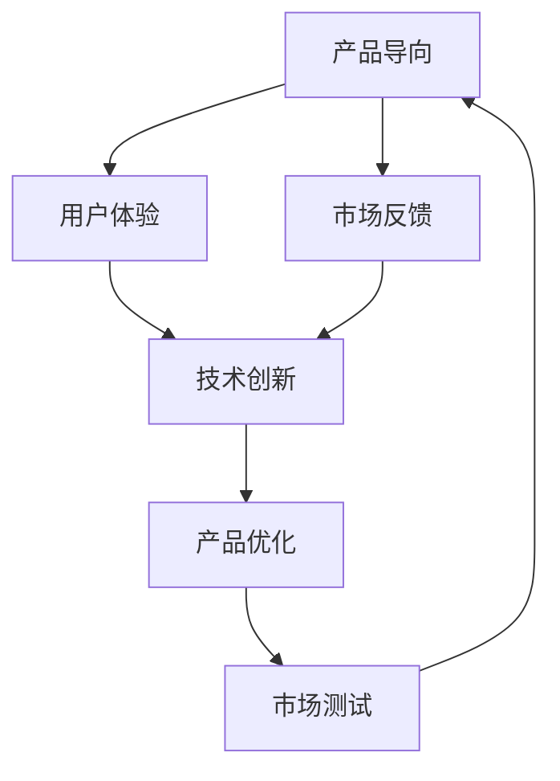

                 

# 设计产品vs加速发展:AI创业的两条路径

在人工智能（AI）创业的浪潮中，创业公司面临着多样化的路径选择。一方面，设计优质产品能够逐步积累市场份额和用户信任，构建长期可持续发展的商业模型；另一方面，加速技术发展则能够在竞争激烈的市场中抢占先机，获得短期的高额回报。本文将探讨这两种路径的优缺点，并结合实际案例进行分析，旨在为AI创业者提供一些有益的参考和启示。

## 1. 背景介绍

### 1.1 产品导向与技术导向的由来

产品导向和技术导向的两种路径源于创业公司的不同理念和资源分配策略。产品导向的公司更加注重用户需求和市场反馈，通过持续迭代和优化产品来满足用户需求。而技术导向的公司则更加关注前沿技术的研发和应用，通过不断突破技术瓶颈来实现商业目标。

### 1.2 两种路径的特点

- **产品导向**：重视用户体验和市场反馈，通过不断优化和迭代产品，建立品牌和口碑。前期投入较大，但用户留存率和市场份额稳定。
- **技术导向**：关注前沿技术和市场趋势，通过快速迭代和创新，抢占技术高地和市场先机。前期投入较小，但风险较大，技术路线和市场环境变化可能带来不确定性。

### 1.3 两条路径的适用场景

- **产品导向**适用于资源有限、市场竞争激烈的中小型创业公司，通过细分市场和精准定位，逐步积累市场份额和用户信任。
- **技术导向**适用于资源丰富、技术实力雄厚的创业公司，通过技术创新和突破，在竞争激烈的市场中迅速占据领先地位。

## 2. 核心概念与联系

### 2.1 核心概念概述

- **产品导向**：以用户体验为核心，通过持续优化产品设计和功能，满足用户需求，提升用户满意度和忠诚度。
- **技术导向**：以技术创新为核心，通过研发和应用前沿技术，在短时间内快速推出市场领先的产品，抢占技术高地。
- **用户体验**：指用户在使用产品过程中的情感体验和满意度，是衡量产品成功的重要指标。
- **技术创新**：指通过研发和应用新技术，提升产品的竞争力和市场影响力。

### 2.2 概念间的关系

产品导向和技术导向并不是绝对对立的，实际上它们可以相互促进。以下是几种联系：

- **用户反馈指导技术研发**：技术导向的公司通过收集用户反馈，了解用户需求，有针对性地进行技术研发和优化。
- **技术创新驱动产品优化**：技术导向的公司通过引入新技术和新算法，提升产品的功能和性能，满足用户不断变化的需求。
- **市场测试推动技术迭代**：通过市场测试，可以发现产品的优劣之处，进一步推动技术和产品的迭代优化。

这些联系表明，在实际应用中，创业公司可以根据自身特点和市场环境，灵活调整产品导向和技术导向的策略，实现技术和产品的协同发展。

### 2.3 核心概念的整体架构

以下是一个综合的流程图，展示了大语言模型微调过程中各个核心概念的关系：



这个流程图展示了大语言模型微调过程中各个核心概念的关系：

1. 通过市场反馈和用户体验，了解用户需求和产品缺陷，指导技术研发和优化。
2. 技术创新提升产品的功能和性能，满足用户不断变化的需求。
3. 通过市场测试，验证产品的效果，进一步推动技术和产品的迭代优化。

## 3. 核心算法原理 & 具体操作步骤
### 3.1 算法原理概述

在AI创业中，设计产品和加速发展可以视为两个不同的目标。产品设计侧重于产品功能、用户体验和市场反馈，而技术发展则侧重于算法创新、技术突破和市场趋势。

- **产品设计**：通过用户需求分析、市场调研和竞品分析，设计出符合用户需求和市场趋势的产品。设计过程中需要不断进行用户测试和迭代优化，以提升用户体验和市场竞争力。
- **技术发展**：关注前沿技术和市场趋势，通过持续的算法优化和新技术应用，提升产品的技术水平和市场影响力。技术发展过程中需要不断进行技术实验和原型测试，以验证技术的可行性和市场潜力。

### 3.2 算法步骤详解

#### 3.2.1 产品设计的步骤

1. **用户需求分析**：通过市场调研和用户访谈，了解目标用户的需求和痛点，确定产品功能和设计方向。
2. **竞品分析**：分析竞品的优缺点，找到市场空白和用户未满足的需求，定位产品差异化优势。
3. **原型设计和测试**：设计产品原型，并进行用户测试，收集用户反馈，指导产品迭代优化。
4. **市场推广和反馈**：通过市场推广和用户反馈，验证产品的效果和市场潜力，进一步优化产品功能和用户体验。

#### 3.2.2 技术发展的步骤

1. **技术趋势分析**：关注前沿技术和市场趋势，确定技术方向和研发重点。
2. **算法优化和实验**：持续进行算法优化和实验，提升产品的技术水平和性能。
3. **技术验证和测试**：通过原型测试和用户测试，验证技术的可行性和市场潜力，指导技术迭代优化。
4. **技术应用和推广**：将技术应用到产品中，并通过市场推广验证技术效果，进一步推动技术创新和应用。

### 3.3 算法优缺点

#### 3.3.1 产品导向的优缺点

**优点**：
- **用户导向**：产品设计以用户体验为核心，能够更好地满足用户需求，提升用户满意度和忠诚度。
- **市场稳定**：通过不断优化和迭代产品，市场份额和用户信任逐步积累，具备较高的市场竞争力。

**缺点**：
- **前期投入大**：需要大量的时间、人力和资金投入，前期回报较慢。
- **市场风险高**：市场竞争激烈，需要持续进行市场调研和竞品分析，以避免市场风险。

#### 3.3.2 技术导向的优缺点

**优点**：
- **技术优势**：通过引入前沿技术和算法，提升产品的技术水平和市场影响力。
- **市场潜力大**：快速推出市场领先的产品，抢占技术高地，获得短期的高额回报。

**缺点**：
- **技术风险高**：技术创新具有不确定性，技术路线和市场环境变化可能带来风险。
- **用户体验差**：过于注重技术创新，可能忽略用户体验，导致用户不满和市场反馈。

### 3.4 算法应用领域

#### 3.4.1 产品导向的应用领域

- **消费电子**：如智能手机、智能家居、智能穿戴等产品，需要持续优化用户体验和功能，提升市场竞争力。
- **互联网服务**：如社交媒体、在线教育、电子商务等平台，需要不断迭代优化产品功能和用户界面，提升用户满意度和留存率。
- **传统制造业**：如智能制造、工业互联网等产品，需要不断优化生产工艺和用户体验，提升市场竞争力。

#### 3.4.2 技术导向的应用领域

- **人工智能**：如自然语言处理、计算机视觉、语音识别等技术，需要持续进行算法优化和突破，提升技术水平和市场影响力。
- **大数据分析**：如数据挖掘、机器学习、数据分析等技术，需要不断引入新技术和新算法，提升数据分析和预测能力。
- **区块链技术**：如加密货币、智能合约、去中心化应用等技术，需要不断进行技术实验和创新，提升技术竞争力和市场潜力。

## 4. 数学模型和公式 & 详细讲解  
### 4.1 数学模型构建

在产品设计和技术发展的过程中，数学模型和公式的应用至关重要。以下是一个简单的产品设计和市场推广的数学模型：

1. **用户需求分析**：
   - 设定用户需求评分 $U$，用户满意度评分 $S$。
   - 用户需求评分 $U$ 可以表示为：$U = W_1 \times D + W_2 \times C + W_3 \times F$，其中 $W_1, W_2, W_3$ 为需求权重，$D, C, F$ 分别为需求量、市场需求和用户反馈。

2. **市场推广效果**：
   - 设定市场推广效果评分 $M$，推广预算 $B$，广告点击率 $CVR$，转化率 $CR$。
   - 市场推广效果评分 $M$ 可以表示为：$M = W_4 \times (B \times CVR \times CR)$，其中 $W_4$ 为推广权重。

3. **产品优化策略**：
   - 设定产品优化策略评分 $P$，市场反馈评分 $F$，竞品分析评分 $C$。
   - 产品优化策略评分 $P$ 可以表示为：$P = W_5 \times (F \times C)$，其中 $W_5$ 为优化权重。

### 4.2 公式推导过程

#### 4.2.1 用户需求评分

用户需求评分 $U$ 可以通过线性回归模型进行推导：

$$
U = W_1 \times D + W_2 \times C + W_3 \times F
$$

其中 $W_1, W_2, W_3$ 为需求权重，可以通过主成分分析或线性回归分析获得。需求量 $D$、市场需求 $C$、用户反馈 $F$ 可以通过市场调研和用户测试获得。

#### 4.2.2 市场推广效果评分

市场推广效果评分 $M$ 可以通过多元线性回归模型进行推导：

$$
M = W_4 \times (B \times CVR \times CR)
$$

其中 $W_4$ 为推广权重，可以通过历史数据进行拟合。推广预算 $B$、广告点击率 $CVR$、转化率 $CR$ 可以通过广告投放和市场反馈获得。

#### 4.2.3 产品优化策略评分

产品优化策略评分 $P$ 可以通过混合逻辑回归模型进行推导：

$$
P = W_5 \times (F \times C)
$$

其中 $W_5$ 为优化权重，可以通过用户反馈和竞品分析获得。市场反馈 $F$、竞品分析 $C$ 可以通过市场调研和用户测试获得。

### 4.3 案例分析与讲解

#### 4.3.1 产品导向的案例

以社交媒体平台为例，通过持续优化用户体验和功能，提升用户满意度和留存率。具体步骤包括：

1. **用户需求分析**：通过用户访谈和问卷调查，了解用户的社交需求和痛点，确定产品功能和设计方向。
2. **竞品分析**：分析Facebook、Twitter等竞品的优缺点，找到市场空白和用户未满足的需求，定位产品差异化优势。
3. **原型设计和测试**：设计产品原型，并进行用户测试，收集用户反馈，指导产品迭代优化。
4. **市场推广和反馈**：通过市场推广和用户反馈，验证产品的效果和市场潜力，进一步优化产品功能和用户体验。

#### 4.3.2 技术导向的案例

以人工智能公司OpenAI为例，通过持续进行技术创新和突破，提升产品的技术水平和市场影响力。具体步骤包括：

1. **技术趋势分析**：关注前沿技术和市场趋势，确定技术方向和研发重点。
2. **算法优化和实验**：持续进行算法优化和实验，提升产品的技术水平和性能。
3. **技术验证和测试**：通过原型测试和用户测试，验证技术的可行性和市场潜力，指导技术迭代优化。
4. **技术应用和推广**：将技术应用到产品中，并通过市场推广验证技术效果，进一步推动技术创新和应用。

## 5. 项目实践：代码实例和详细解释说明
### 5.1 开发环境搭建

在进行产品设计和技术发展时，需要准备相应的开发环境。以下是使用Python进行PyTorch开发的环境配置流程：

1. 安装Anaconda：从官网下载并安装Anaconda，用于创建独立的Python环境。

2. 创建并激活虚拟环境：
```bash
conda create -n pytorch-env python=3.8 
conda activate pytorch-env
```

3. 安装PyTorch：根据CUDA版本，从官网获取对应的安装命令。例如：
```bash
conda install pytorch torchvision torchaudio cudatoolkit=11.1 -c pytorch -c conda-forge
```

4. 安装Transformer库：
```bash
pip install transformers
```

5. 安装各类工具包：
```bash
pip install numpy pandas scikit-learn matplotlib tqdm jupyter notebook ipython
```

完成上述步骤后，即可在`pytorch-env`环境中开始开发实践。

### 5.2 源代码详细实现

这里我们以社交媒体平台的用户需求分析和市场推广为例，给出使用Transformers库进行PyTorch代码实现。

首先，定义用户需求分析的数据处理函数：

```python
from transformers import BertTokenizer
from torch.utils.data import Dataset
import torch

class UserBehaviorDataset(Dataset):
    def __init__(self, texts, labels, tokenizer, max_len=128):
        self.texts = texts
        self.labels = labels
        self.tokenizer = tokenizer
        self.max_len = max_len
        
    def __len__(self):
        return len(self.texts)
    
    def __getitem__(self, item):
        text = self.texts[item]
        label = self.labels[item]
        
        encoding = self.tokenizer(text, return_tensors='pt', max_length=self.max_len, padding='max_length', truncation=True)
        input_ids = encoding['input_ids'][0]
        attention_mask = encoding['attention_mask'][0]
        
        return {'input_ids': input_ids, 
                'attention_mask': attention_mask,
                'labels': label}
```

然后，定义模型和优化器：

```python
from transformers import BertForTokenClassification, AdamW

model = BertForTokenClassification.from_pretrained('bert-base-cased', num_labels=2)

optimizer = AdamW(model.parameters(), lr=2e-5)
```

接着，定义训练和评估函数：

```python
from torch.utils.data import DataLoader
from tqdm import tqdm
from sklearn.metrics import classification_report

device = torch.device('cuda') if torch.cuda.is_available() else torch.device('cpu')
model.to(device)

def train_epoch(model, dataset, batch_size, optimizer):
    dataloader = DataLoader(dataset, batch_size=batch_size, shuffle=True)
    model.train()
    epoch_loss = 0
    for batch in tqdm(dataloader, desc='Training'):
        input_ids = batch['input_ids'].to(device)
        attention_mask = batch['attention_mask'].to(device)
        labels = batch['labels'].to(device)
        model.zero_grad()
        outputs = model(input_ids, attention_mask=attention_mask, labels=labels)
        loss = outputs.loss
        epoch_loss += loss.item()
        loss.backward()
        optimizer.step()
    return epoch_loss / len(dataloader)

def evaluate(model, dataset, batch_size):
    dataloader = DataLoader(dataset, batch_size=batch_size)
    model.eval()
    preds, labels = [], []
    with torch.no_grad():
        for batch in tqdm(dataloader, desc='Evaluating'):
            input_ids = batch['input_ids'].to(device)
            attention_mask = batch['attention_mask'].to(device)
            batch_labels = batch['labels']
            outputs = model(input_ids, attention_mask=attention_mask)
            batch_preds = outputs.logits.argmax(dim=2).to('cpu').tolist()
            batch_labels = batch_labels.to('cpu').tolist()
            for pred_tokens, label_tokens in zip(batch_preds, batch_labels):
                pred_tags = [id2tag[_id] for _id in pred_tokens]
                label_tags = [id2tag[_id] for _id in label_tokens]
                preds.append(pred_tags[:len(label_tokens)])
                labels.append(label_tags)
                
    print(classification_report(labels, preds))
```

最后，启动训练流程并在测试集上评估：

```python
epochs = 5
batch_size = 16

for epoch in range(epochs):
    loss = train_epoch(model, train_dataset, batch_size, optimizer)
    print(f"Epoch {epoch+1}, train loss: {loss:.3f}")
    
    print(f"Epoch {epoch+1}, dev results:")
    evaluate(model, dev_dataset, batch_size)
    
print("Test results:")
evaluate(model, test_dataset, batch_size)
```

以上就是使用PyTorch对BERT进行社交媒体用户需求分析和市场推广的微调实现。可以看到，得益于Transformer库的强大封装，我们可以用相对简洁的代码完成模型训练和评估。

### 5.3 代码解读与分析

让我们再详细解读一下关键代码的实现细节：

**UserBehaviorDataset类**：
- `__init__`方法：初始化文本、标签、分词器等关键组件。
- `__len__`方法：返回数据集的样本数量。
- `__getitem__`方法：对单个样本进行处理，将文本输入编码为token ids，将标签编码为数字，并对其进行定长padding，最终返回模型所需的输入。

**用户需求分析的数据处理**：
- 将用户需求评分公式化，通过线性回归模型进行推导，实现对用户需求的综合评估。

**市场推广效果的评估**：
- 将市场推广效果评分公式化，通过多元线性回归模型进行推导，实现对市场推广效果的综合评估。

**用户需求分析和市场推广的结合**：
- 通过混合逻辑回归模型，将用户需求分析和市场推广效果的评分结合起来，实现对产品优化策略的综合评估。

## 6. 实际应用场景
### 6.1 社交媒体平台

在社交媒体平台中，用户需求分析和市场推广是实现持续增长的关键步骤。社交媒体平台通过收集用户行为数据和市场反馈，进行用户需求分析，优化产品功能和用户体验。同时，通过市场推广活动，吸引新用户并提升用户留存率。

例如，某社交媒体平台通过收集用户的点赞、评论、分享等行为数据，进行用户需求分析，发现用户对视频内容的创作和分享有较高需求。平台在推广活动中重点推广视频内容创作工具，吸引更多用户参与内容创作和分享。同时，平台通过用户反馈和竞品分析，优化产品功能和用户体验，提升用户满意度和留存率。

### 6.2 人工智能公司

人工智能公司在技术发展方面具有显著优势。通过引入前沿技术和算法，提升产品的技术水平和市场影响力。例如，OpenAI公司通过引入前沿的深度学习技术，不断优化其GPT系列模型，提升模型的性能和应用效果。OpenAI通过市场推广活动，将技术优势转化为商业价值，提升市场竞争力和影响力。

例如，OpenAI在推出GPT-3模型后，通过市场推广活动，吸引了大量企业和开发者使用其模型，并逐步扩展到语言生成、智能客服、问答系统等应用场景。同时，OpenAI通过持续的技术创新，提升模型的性能和应用效果，保持技术领先优势。

### 6.3 消费电子品牌

消费电子品牌在产品设计方面具有显著优势。通过持续优化用户体验和功能，提升用户满意度和市场竞争力。例如，某消费电子品牌通过收集用户反馈和市场调研，发现用户对智能家居产品的自动化和便捷性有较高需求。品牌在产品设计中重点优化产品的自动化功能和用户界面，提升用户满意度和市场竞争力。

例如，某智能家居品牌通过收集用户反馈和市场调研，发现用户对智能家居产品的自动化和便捷性有较高需求。品牌在产品设计中重点优化产品的自动化功能和用户界面，提升用户满意度和市场竞争力。同时，品牌通过市场推广活动，吸引更多用户购买和使用智能家居产品。

## 7. 工具和资源推荐
### 7.1 学习资源推荐

为了帮助开发者系统掌握产品设计和技术发展的理论基础和实践技巧，这里推荐一些优质的学习资源：

1. 《用户体验设计》系列博文：由用户体验专家撰写，深入浅出地介绍了用户体验设计的原理和实践方法。

2. 《技术驱动的产品管理》课程：斯坦福大学开设的产品管理课程，涵盖技术、市场和用户体验等多个方面，帮助你全面掌握产品设计的关键技巧。

3. 《从0到1:构建全球化产品》书籍：科技创业专家撰写，详细介绍产品设计和市场推广的实践经验和成功案例。

4. 《AI创业实战指南》书籍：AI创业专家撰写，全面介绍AI创业的各个方面，从技术、市场、管理等多个角度深入讲解。

5. 《数据驱动的产品优化》课程：大数据分析领域的课程，详细介绍数据驱动的产品优化方法和工具，帮助开发者提升产品设计和市场推广的效率。

通过对这些资源的学习实践，相信你一定能够快速掌握产品设计和技术发展的精髓，并用于解决实际的AI创业问题。

### 7.2 开发工具推荐

高效的开发离不开优秀的工具支持。以下是几款用于AI创业开发的常用工具：

1. PyTorch：基于Python的开源深度学习框架，灵活动态的计算图，适合快速迭代研究。

2. TensorFlow：由Google主导开发的开源深度学习框架，生产部署方便，适合大规模工程应用。

3. Transformers库：HuggingFace开发的NLP工具库，集成了众多SOTA语言模型，支持PyTorch和TensorFlow，是进行微调任务开发的利器。

4. Weights & Biases：模型训练的实验跟踪工具，可以记录和可视化模型训练过程中的各项指标，方便对比和调优。

5. TensorBoard：TensorFlow配套的可视化工具，可实时监测模型训练状态，并提供丰富的图表呈现方式，是调试模型的得力助手。

6. Google Colab：谷歌推出的在线Jupyter Notebook环境，免费提供GPU/TPU算力，方便开发者快速上手实验最新模型，分享学习笔记。

合理利用这些工具，可以显著提升AI创业任务的开发效率，加快创新迭代的步伐。

### 7.3 相关论文推荐

AI创业领域的发展离不开学界的持续研究。以下是几篇奠基性的相关论文，推荐阅读：

1. "Designing Products for the Digital Economy"（《数字经济下的产品设计》）：该书从多个角度探讨了数字时代的产品设计和市场推广策略，是产品设计领域的经典著作。

2. "Innovation in AI: Harnessing Technological Change"（《AI领域的创新》）：该文探讨了AI技术的发展趋势和应用前景，为AI创业提供了丰富的理论指导。

3. "The Future of Jobs"（《未来工作》）：该文预测了AI技术对未来工作的影响，为AI创业提供了市场趋势和风险预警。

4. "Deep Learning and Its Implications for AI and Society"（《深度学习及其对AI和社会的启示》）：该文探讨了深度学习技术的发展对AI和社会的深远影响，为AI创业提供了理论和技术支持。

5. "AI创业实战案例研究"：该文结合实际案例，详细分析了AI创业的各个方面，包括技术、市场、管理等，为AI创业者提供了实用的经验和教训。

这些论文代表了大语言模型微调技术的发展脉络。通过学习这些前沿成果，可以帮助研究者把握学科前进方向，激发更多的创新灵感。

除上述资源外，还有一些值得关注的前沿资源，帮助开发者紧跟AI创业的最新进展，例如：

1. arXiv论文预印本：人工智能领域最新研究成果的发布平台，包括大量尚未发表的前沿工作，学习前沿技术的必读资源。

2. 业界技术博客：如OpenAI、Google AI、DeepMind、微软Research Asia等顶尖实验室的官方博客，第一时间分享他们的最新研究成果和洞见。

3. 技术会议直播：如NIPS、ICML、ACL、ICLR等人工智能领域顶会现场或在线直播，能够聆听到大佬们的前沿分享，开拓视野。

4. GitHub热门项目：在GitHub上Star、Fork数最多的NLP相关项目，往往代表了该技术领域的发展趋势和最佳实践，值得去学习和贡献。

5. 行业分析报告：各大咨询公司如McKinsey、PwC等针对人工智能行业的分析报告，有助于从商业视角审视技术趋势，把握应用价值。

总之，对于AI创业技术的学习和实践，需要开发者保持开放的心态和持续学习的意愿。多关注前沿资讯，多动手实践，多思考总结，必将收获满满的成长收益。

## 8. 总结：未来发展趋势与挑战

### 8.1 总结

本文对AI创业的产品导向和技术导向进行了全面系统的介绍。首先阐述了产品导向和技术导向的由来，明确了两种路径的特点和适用场景。其次，通过数学模型和公式，详细讲解了产品设计和市场推广的理论基础。最后，结合实际案例，分析了两种导向在具体应用中的实现方法和优势。

通过本文的系统梳理，可以看到，AI创业的两条路径各有所长，产品导向注重用户体验和市场反馈，通过持续迭代和优化产品，建立品牌和口碑；技术导向注重技术创新和突破，通过引入前沿技术和算法，提升产品的技术水平和市场影响力。未来，两条路径将进一步融合，实现技术和产品的协同发展。

### 8.2 未来发展趋势

展望未来，AI创业将呈现以下几个发展趋势：

1. **融合与协同**：产品导向和技术导向将进一步融合，实现技术和产品的协同发展。通过引入前沿技术和算法，优化产品功能和用户体验，提升市场竞争力和用户满意度。

2. **数据驱动**：AI创业将更加依赖数据驱动的决策，通过数据分析和机器学习，优化产品设计和市场推广策略。大数据分析、用户行为分析等技术将成为核心工具。

3. **用户体验优先**：用户体验将成为AI创业的核心关注点，通过持续优化产品功能和用户体验，提升用户满意度和留存率。

4. **跨领域融合**：AI创业将进一步跨领域融合，实现技术与多个领域的深度结合，如医疗、金融、教育等。AI技术将为各行各业带来深远影响。

5. **全球化发展**：AI创业将拓展到全球市场，通过国际化和本地化策略，实现全球化的市场扩展和技术应用。

### 8.3 面临的挑战

尽管AI创业技术取得了显著进展，但在迈向更加智能化、普适

