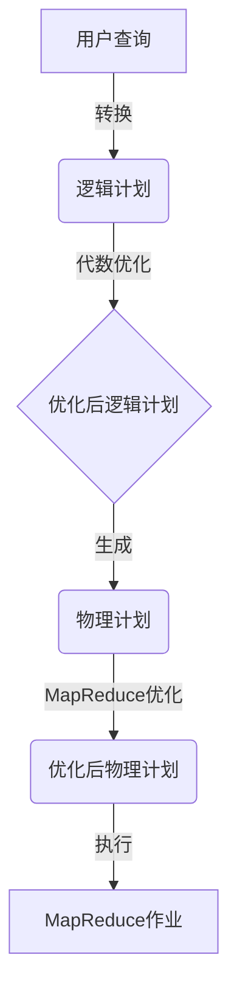

以下是根据您提供的要求和约束条件，为标题《Pig优化策略原理与代码实例讲解》撰写的技术博客文章正文内容：

# Pig优化策略原理与代码实例讲解

## 1. 背景介绍

### 1.1 问题的由来

在大数据时代，海量数据的存储和处理成为了一个巨大的挑战。Apache Pig作为一种高级数据流语言,旨在简化MapReduce编程,提高开发效率。然而,随着数据量的不断增长和计算需求的复杂化,Pig作业的执行效率也成为了一个瓶颈。因此,优化Pig作业的执行效率变得越来越重要。

### 1.2 研究现状

目前,Pig优化策略主要集中在以下几个方面:

1. **逻辑计划优化**:通过查询重写、谓词推导等技术优化逻辑执行计划。
2. **代数优化**:利用代数等价变换规则,对逻辑计划进行等价代数重写。
3. **代价模型优化**:根据代价模型估算不同执行计划的代价,选择最优计划。
4. **MapReduce优化**:减少作业数、合并作业、优化数据分区等策略。

虽然已有一些优化技术,但仍存在一些问题和挑战,如代价模型不准确、优化规则有限等,需要进一步研究和改进。

### 1.3 研究意义

优化Pig作业执行效率,可以带来以下好处:

1. **减少计算资源消耗**,降低运行成本。
2. **缩短作业执行时间**,提高数据处理效率。
3. **简化Pig编程**,提高开发人员生产力。

因此,研究Pig优化策略具有重要的理论意义和实际应用价值。

### 1.4 本文结构

本文将从以下几个方面对Pig优化策略进行介绍:

1. 核心概念与联系
2. 核心算法原理与具体操作步骤
3. 数学模型和公式详细讲解与案例分析
4. 项目实践:代码实例和详细解释
5. 实际应用场景
6. 工具和资源推荐
7. 总结:未来发展趋势与挑战
8. 附录:常见问题与解答

## 2. 核心概念与联系

在介绍Pig优化策略之前,我们先来了解一些核心概念:

1. **逻辑计划(Logical Plan)**: 描述了作业要完成的功能,是对用户查询的高级抽象。
2. **物理计划(Physical Plan)**: 描述了如何执行逻辑计划,包括了MapReduce作业的细节。
3. **代数优化(Algebraic Optimization)**: 利用代数等价变换规则对逻辑计划进行重写,以获得更优的执行计划。
4. **代价模型(Cost Model)**: 估算执行计划的代价(如执行时间、资源消耗等),用于选择最优计划。
5. **MapReduce优化**: 针对MapReduce作业的优化,如减少作业数、合并作业、优化数据分区等。

这些概念相互关联,共同构成了Pig优化策略的理论基础。下面我们将详细介绍其中的核心算法原理和实现细节。



## 3. 核心算法原理与具体操作步骤

### 3.1 算法原理概述

Pig优化策略的核心算法主要包括以下几个部分:

1. **逻辑计划优化**:通过查询重写、谓词推导等技术优化逻辑执行计划。
2. **代数优化**:利用代数等价变换规则对逻辑计划进行重写,以获得更优的执行计划。
3. **代价模型优化**:根据代价模型估算不同执行计划的代价,选择最优计划。
4. **MapReduce优化**:减少作业数、合并作业、优化数据分区等策略,优化MapReduce作业的执行效率。

其中,代数优化是最核心的部分,我们将重点介绍其算法原理和实现细节。

### 3.2 算法步骤详解

Pig的代数优化算法主要包括以下几个步骤:

#### 3.2.1 构建逻辑计划树

首先,将用户查询转换为一棵逻辑计划树(Logical Plan Tree),树中的每个节点代表一个关系代数操作符(如投影、选择、连接等)。

#### 3.2.2 应用等价变换规则

然后,对逻辑计划树应用一系列等价变换规则,对树进行重写。这些规则基于关系代数的等价变换,能够在不改变计算语义的前提下,优化计划的执行效率。

常见的等价变换规则包括:

1. **投影下推(Projection Pushdown)**:将投影操作尽可能下推到查询树的底部,以减少中间数据的大小。
2. **选择下推(Filter Pushdown)**:将选择操作尽可能下推到查询树的底部,以尽早过滤掉不需要的数据。
3. **连接重排(Join Reorder)**:对连接操作进行重排序,以减少中间数据的大小。
4. **连接转换(Join Conversion)**:将一些连接操作转换为其他更高效的实现,如Map端连接(Map-Side Join)。
5. **分组转换(Group Conversion)**:将一些分组操作转换为其他更高效的实现,如Map端合并(Map-Side Combine)。

#### 3.2.3 生成物理计划

对优化后的逻辑计划树进行解析,生成对应的物理计划(Physical Plan),描述了如何使用MapReduce作业来执行该计划。

#### 3.2.4 MapReduce优化

对生成的物理计划进一步应用一些MapReduce优化策略,如减少作业数、合并作业、优化数据分区等,以提高MapReduce作业的执行效率。

#### 3.2.5 选择最优计划

利用代价模型估算不同物理计划的代价,选择代价最小的计划作为最终的执行计划。

### 3.3 算法优缺点

Pig的优化算法具有以下优点:

1. 能够自动优化查询执行计划,提高执行效率。
2. 基于成熟的关系代数理论,优化规则有理论依据。
3. 支持多种优化策略,可以根据具体场景选择合适的优化方式。

但也存在一些缺点和局限性:

1. 优化规则有限,无法覆盖所有场景。
2. 代价模型估算不准确,可能选择了次优计划。
3. 优化过程增加了额外的开销,对简单查询的优化收益可能不大。

### 3.4 算法应用领域

Pig优化策略主要应用于大数据处理领域,特别是基于Hadoop的批处理作业。它可以优化各种类型的Pig查询,如:

1. 结构化数据处理:如日志分析、网络数据处理等。
2. 非结构化数据处理:如文本挖掘、网页分析等。
3. 机器学习和数据挖掘:如特征工程、模型训练等。

此外,Pig优化策略的核心思想也可以应用于其他大数据处理系统,如Spark、Flink等,为其提供优化支持。

## 4. 数学模型和公式详细讲解与举例说明

### 4.1 数学模型构建

在Pig的优化过程中,需要构建代价模型来估算不同执行计划的代价,从而选择最优计划。代价模型通常基于一些数学模型和公式,考虑了多种影响因素,如数据大小、计算资源、I/O开销等。

一个常见的代价模型是**基于开销的代价模型(Cost-Based Model)**,它将执行计划的代价定义为执行时间的函数:

$$
Cost(P) = F(CPU, IO, MEMORY, NETWORK, DATA)
$$

其中:

- $P$表示执行计划
- $CPU$表示CPU开销
- $IO$表示I/O开销
- $MEMORY$表示内存开销
- $NETWORK$表示网络开销
- $DATA$表示数据大小

这些开销可以通过一些公式进行估算,例如:

$$
CPU(P) = \sum\limits_{i=1}^{n} CPU_i(P) \
IO(P) = \sum\limits_{i=1}^{n} IO_i(P) \
MEMORY(P) = \max\limits_{i=1}^{n} MEMORY_i(P) \
NETWORK(P) = \sum\limits_{i=1}^{n} NETWORK_i(P) \
DATA(P) = \prod\limits_{i=1}^{n} DATA_i(P)
$$

其中$n$表示执行计划中操作符的数量,每个操作符的开销可以根据其特性和输入数据大小进行估算。

### 4.2 公式推导过程

以投影下推(Projection Pushdown)优化为例,我们来看一下如何推导出其代价公式。

假设有一个查询计划,包含一个投影操作$\pi$和一个选择操作$\sigma$:

$$
\pi_{A,B}(\sigma_{C>10}(R))
$$

如果不进行优化,则需要先对关系$R$进行选择,然后再进行投影,代价为:

$$
Cost_1 = Cost(\sigma_{C>10}(R)) + Cost(\pi_{A,B}(\sigma_{C>10}(R)))
$$

如果进行投影下推优化,则可以先进行投影,再进行选择:

$$
\sigma_{C>10}(\pi_{A,B,C}(R))
$$

代价为:

$$
Cost_2 = Cost(\pi_{A,B,C}(R)) + Cost(\sigma_{C>10}(\pi_{A,B,C}(R)))
$$

由于投影操作可以减小中间数据的大小,因此通常有$Cost_2 < Cost_1$,所以投影下推是一种优化策略。

我们可以进一步推导出$Cost_1$和$Cost_2$的具体公式:

$$
\begin{aligned}
Cost_1 &= IO(R) + CPU(\sigma_{C>10}) + IO(\sigma_{C>10}(R)) \
       &+ CPU(\pi_{A,B}) + IO(\pi_{A,B}(\sigma_{C>10}(R))) \
Cost_2 &= IO(R) + CPU(\pi_{A,B,C}) + IO(\pi_{A,B,C}(R)) \
       &+ CPU(\sigma_{C>10}) + IO(\sigma_{C>10}(\pi_{A,B,C}(R)))
\end{aligned}
$$

其中,每个操作符的CPU和IO开销可以根据输入数据大小和操作特性进行估算。

通过比较$Cost_1$和$Cost_2$的大小,就可以决定是否应用投影下推优化。

### 4.3 案例分析与讲解

现在,我们来看一个具体的案例,分析Pig如何应用代数优化策略。

假设有一个Pig查询,用于统计每个部门的员工人数:

```pig
employees = LOAD 'employees.txt' AS (name, age, dept);
grouped = GROUP employees BY dept;
counted = FOREACH grouped GENERATE group, COUNT(employees);
STORE counted INTO 'output' USING PigStorage(',');
```

这个查询首先加载员工数据,然后按部门进行分组,最后统计每个组的员工人数。

如果不进行优化,Pig会按照查询的书写顺序执行,生成以下逻辑计划:

```
LOP_PLAN
STORE /tmp/temp LOAD 'employees.txt' AS (name:chararray, age:int, dept:chararray)
GRP_BY_PLAN
GROUP_BY /tmp/temp BY (dept)chararray
STORE /tmp/temp1 FOREACH /tmp/temp GROUP_BY (dept)chararray GENERATE group, COUNT_STAR(employees)
STORE 'output' USING PigStorage(',') LOAD /tmp/temp1
```

可以看到,这个计划包含了两个MapReduce作业:第一个作业加载数据,第二个作业进行分组和统计。

但是,我们可以应用**分组转换(Group Conversion)**优化,将分组和统计合并为一个MapReduce作业,从而减少作业数量和数据写入开销。优化后的逻辑计划如下:

```
LOP_PLAN
STORE /tmp/temp LOAD 'employees.txt' AS (name:chararray, age:int, dept:chararray)
GRP_BY_PLAN
STORE 'output' USING PigStorage(',') FOREACH (GROUP /tmp/temp BY (dept)chararray) GENERATE group, COUNT(employees)
```

可以看到,优化后的计划只包含一个MapReduce作业,直接进行分组和统计。

这种优化可以显著提高查询执行效率,尤其是在处理大数据集时。