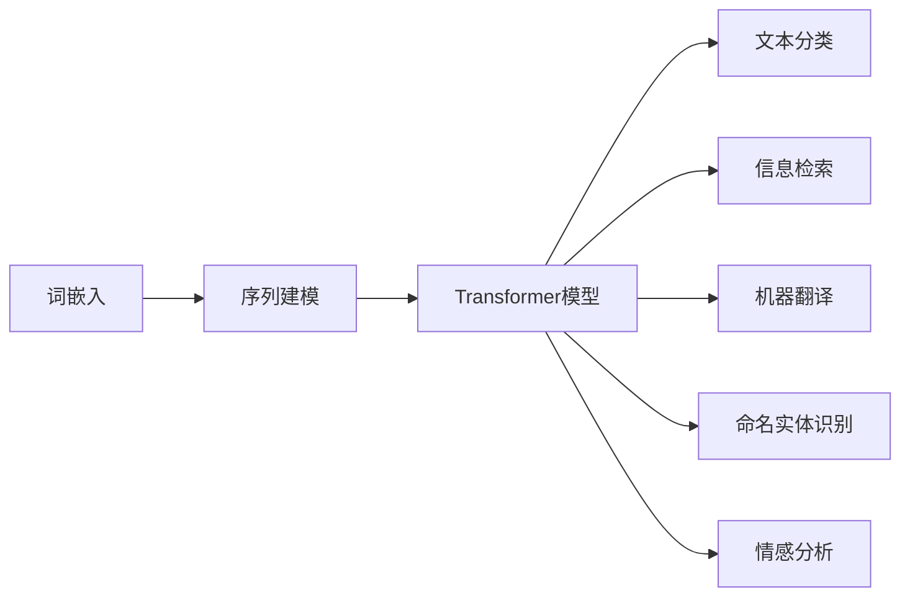
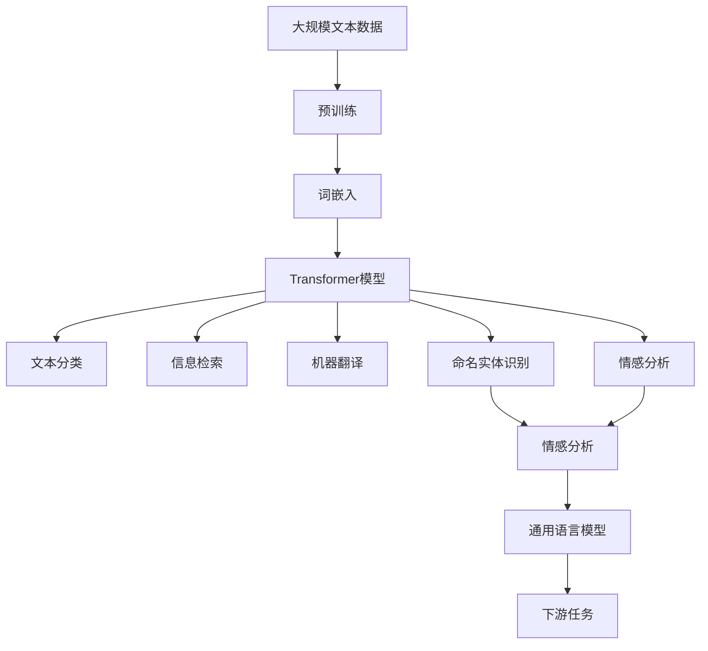

                 

# 自然语言处理NLP原理与代码实例讲解

> 关键词：自然语言处理(NLP), 语言模型, 深度学习, 文本分类, 信息检索, 机器翻译, 命名实体识别

## 1. 背景介绍

### 1.1 问题由来

自然语言处理（Natural Language Processing，简称NLP）是人工智能领域的重要分支之一，旨在使计算机能够理解和生成自然语言。NLP的研究对象包括文本、语音、图像等多种形式的人类语言数据，应用领域涉及信息检索、机器翻译、语音识别、文本分类、情感分析等多个方面。

近年来，随着深度学习技术的兴起，基于神经网络的语言模型在NLP任务上取得了显著的进展。这些模型通过对大规模文本数据进行训练，学习到语言的深层结构，并能够进行语言生成、理解等任务。其中，基于Transformer架构的语言模型，如BERT、GPT等，已经成为NLP领域的标准模型，并被广泛应用于各类实际应用中。

然而，NLP领域仍面临诸多挑战。如何高效地处理长文本、提升模型的理解能力、应对多语言和跨领域任务等，仍需要进一步的研究和探索。此外，随着AI技术的不断进步，对NLP系统的实时性、稳定性、可解释性等要求也在不断提升。本文旨在通过详细的原理讲解和代码实例，帮助读者更好地理解和应用NLP技术。

### 1.2 问题核心关键点

NLP的核心问题是如何让计算机能够理解和生成自然语言。这一问题涉及多个方面，包括语言模型的建立、文本表示方法、模型训练和优化、应用模型进行具体任务的预测和生成等。本节将对NLP的核心问题进行梳理，并给出对应的解决思路。

1. **语言模型（Language Model）**：语言模型是NLP中的基础模型，用于预测文本中下一个词汇的概率。语言模型通常基于统计语言学原理建立，旨在捕捉语言数据中的内在规律，如词频、句子结构和语义关系等。深度学习中的神经网络模型，如RNN、LSTM、GRU、Transformer等，被广泛应用于语言模型的构建中。

2. **文本表示方法（Text Representation）**：文本表示是将文本转化为计算机可处理形式的过程，常用的方法包括词袋模型、TF-IDF、词嵌入（Word Embedding）等。其中，词嵌入是将单词映射为低维向量表示的技术，可以捕捉词汇之间的语义关系，是深度学习中常用的文本表示方法之一。

3. **模型训练和优化**：模型训练是利用标注数据对NLP模型进行优化，以使其能够更好地适应特定任务的过程。常用的优化方法包括梯度下降、Adam、RMSprop等。此外，正则化技术如L2正则、Dropout等也被广泛应用于模型训练中，以防止过拟合。

4. **应用模型进行任务预测和生成**：在训练好的模型基础上，可以进行文本分类、情感分析、机器翻译、信息检索等具体任务的预测和生成。预测任务通常采用softmax函数将模型输出转化为概率分布，生成任务则使用各种解码策略，如贪心搜索、束搜索等。

### 1.3 问题研究意义

NLP技术的进步不仅有助于推动人工智能的发展，还将在多个行业领域带来深远影响。例如，在智能客服、金融风险控制、智能搜索、推荐系统等领域，NLP技术的应用已经展现出巨大的商业价值和社会效益。通过深入理解和应用NLP技术，可以大幅提升这些领域的信息处理能力和用户体验。

此外，NLP技术的发展还将促进其他AI技术的发展，如语音识别、计算机视觉等，从而推动AI技术的整体进步。因此，深入研究和掌握NLP技术，对于推动AI技术的发展和应用具有重要意义。

## 2. 核心概念与联系

### 2.1 核心概念概述

为了更好地理解NLP技术，本节将介绍几个核心概念及其相互联系。

1. **词嵌入（Word Embedding）**：词嵌入是将单词映射为低维向量表示的技术，可以捕捉词汇之间的语义关系。常用的词嵌入模型包括Word2Vec、GloVe、FastText等，其中Word2Vec是最早的词嵌入模型之一，被广泛应用于NLP任务的预处理中。

2. **Transformer模型**：Transformer是一种基于自注意力机制的神经网络模型，被广泛应用于NLP任务中。Transformer模型通过自注意力机制捕捉输入序列中的依赖关系，同时能够高效并行计算，是当前NLP领域的主流模型之一。

3. **序列建模（Sequence Modeling）**：序列建模是NLP任务的核心，旨在捕捉文本序列中的依赖关系。常用的序列建模方法包括RNN、LSTM、GRU等，其中LSTM和GRU是长短期记忆网络，能够在处理长文本时避免梯度消失和爆炸问题。

4. **词向量空间（Word Vector Space）**：词向量空间是将单词映射到低维向量空间，使得单词之间可以计算向量距离，捕捉词汇之间的语义关系。常用的词向量空间模型包括词袋模型（Bag of Words）、TF-IDF等，其中词袋模型是最简单的文本表示方法之一。

5. **文本分类（Text Classification）**：文本分类是将文本划分为预定义类别的任务。常用的文本分类方法包括朴素贝叶斯、支持向量机（SVM）、逻辑回归等，其中逻辑回归是常用的文本分类模型之一。

6. **信息检索（Information Retrieval）**：信息检索是从大量文本数据中检索出相关信息的任务。常用的信息检索方法包括倒排索引、BM25等，其中倒排索引是最基本的检索方法之一。

7. **机器翻译（Machine Translation）**：机器翻译是将一种语言的文本自动翻译为另一种语言的任务。常用的机器翻译模型包括统计机器翻译（SMT）和神经机器翻译（NMT），其中NMT是目前最为先进的机器翻译技术。

### 2.2 概念间的关系

这些核心概念之间的关系可以通过以下Mermaid流程图来展示：



这个流程图展示了NLP任务中常用的技术栈。词嵌入用于文本表示，序列建模用于捕捉依赖关系，Transformer模型用于序列建模和生成，文本分类用于文本分类任务，信息检索用于检索相关文本，机器翻译用于文本翻译任务，命名实体识别用于识别文本中的实体信息，情感分析用于分析文本情感倾向。

### 2.3 核心概念的整体架构

最后，我们用一个综合的流程图来展示这些核心概念在大规模NLP任务中的应用：



这个综合流程图展示了从预训练到下游任务的全流程。大规模文本数据首先经过预训练，获得语言知识。然后，通过词嵌入和Transformer模型进行序列建模，最终应用于文本分类、信息检索、机器翻译、命名实体识别、情感分析等下游任务中。

## 3. 核心算法原理 & 具体操作步骤

### 3.1 算法原理概述

NLP的核心算法是序列建模，旨在捕捉文本序列中的依赖关系。常用的序列建模方法包括RNN、LSTM、GRU等，其中LSTM和GRU是长短期记忆网络，能够在处理长文本时避免梯度消失和爆炸问题。Transformer模型是基于自注意力机制的神经网络模型，被广泛应用于NLP任务中，能够高效并行计算。

Transformer模型的核心思想是自注意力机制，通过计算输入序列中每个位置的自注意力权重，捕捉序列中的依赖关系。自注意力机制分为多头自注意力（Multi-Head Attention）和位置编码（Positional Encoding）两个部分。

### 3.2 算法步骤详解

以Transformer模型为例，简要介绍其训练和推理步骤：

1. **数据预处理**：将文本数据转化为模型可接受的格式，如分词、去除停用词、标准化等。

2. **构建模型**：搭建Transformer模型，包括嵌入层、多头自注意力层、前馈神经网络层、输出层等。

3. **模型训练**：使用标注数据对模型进行训练，通过梯度下降等优化算法最小化损失函数。

4. **模型推理**：将输入序列输入模型，通过前向传播计算输出序列。

### 3.3 算法优缺点

Transformer模型具有以下优点：

1. **并行计算**：Transformer模型通过多头自注意力机制实现并行计算，能够在GPU上高效运行，大大提升训练速度。

2. **鲁棒性**：Transformer模型通过位置编码机制捕捉输入序列中的位置信息，能够更好地处理长文本序列。

3. **灵活性**：Transformer模型可以通过改变注意力机制和神经网络层数，适应不同的NLP任务。

4. **泛化能力**：Transformer模型能够从大规模文本数据中学习到语言规律，泛化能力较强。

Transformer模型也存在一些缺点：

1. **计算开销大**：Transformer模型的计算开销较大，需要大量的内存和计算资源。

2. **过拟合风险**：Transformer模型在大规模训练数据上表现优异，但在小规模数据上容易过拟合。

3. **参数复杂**：Transformer模型参数量较大，训练过程中需要谨慎选择学习率和正则化强度。

### 3.4 算法应用领域

Transformer模型被广泛应用于多个NLP任务中，包括文本分类、信息检索、机器翻译、命名实体识别、情感分析等。此外，Transformer模型还被应用于生成任务，如自动摘要、对话生成、机器作文等。

## 4. 数学模型和公式 & 详细讲解 & 举例说明

### 4.1 数学模型构建

Transformer模型通常由嵌入层、多头自注意力层、前馈神经网络层和输出层组成。以文本分类任务为例，模型输入为文本序列，输出为分类标签。

设输入序列为 $x=\{x_1,x_2,\dots,x_n\}$，输出标签为 $y=\{y_1,y_2,\dots,y_n\}$，其中 $x_i$ 表示第 $i$ 个单词，$y_i$ 表示对应的分类标签。模型的目标是最小化交叉熵损失函数：

$$
\mathcal{L} = -\sum_{i=1}^n y_i \log \hat{y}_i
$$

其中 $\hat{y}_i$ 表示模型对第 $i$ 个单词的分类概率。

### 4.2 公式推导过程

Transformer模型的核心公式包括多头自注意力机制、前馈神经网络和输出层。以多头自注意力机制为例，其公式推导过程如下：

设输入序列为 $x=\{x_1,x_2,\dots,x_n\}$，多头自注意力机制的计算公式为：

$$
Q=\text{Embed}(x)\mathbf{W}_Q
$$
$$
K=\text{Embed}(x)\mathbf{W}_K
$$
$$
V=\text{Embed}(x)\mathbf{W}_V
$$
$$
A=\text{Softmax}(QK^T)
$$
$$
\text{Attention}(Q,K,V)=A\cdot V
$$

其中，$\text{Embed}(x)$ 表示嵌入层，$\mathbf{W}_Q,\mathbf{W}_K,\mathbf{W}_V$ 表示投影矩阵，$A$ 表示自注意力权重，$\text{Softmax}(QK^T)$ 表示计算自注意力权重，$\text{Attention}(Q,K,V)$ 表示计算自注意力结果。

### 4.3 案例分析与讲解

以情感分析任务为例，我们采用Transformer模型进行情感分类。首先，需要将输入文本转化为模型可接受的格式，如分词、去除停用词、标准化等。然后，搭建Transformer模型，包括嵌入层、多头自注意力层、前馈神经网络层和输出层。使用标注数据对模型进行训练，通过梯度下降等优化算法最小化交叉熵损失函数。最后，将测试集输入模型，通过前向传播计算输出标签，评估模型的分类性能。

## 5. 项目实践：代码实例和详细解释说明

### 5.1 开发环境搭建

在进行NLP项目开发前，我们需要准备好开发环境。以下是使用Python进行PyTorch开发的环境配置流程：

1. 安装Anaconda：从官网下载并安装Anaconda，用于创建独立的Python环境。

2. 创建并激活虚拟环境：
```bash
conda create -n pytorch-env python=3.8 
conda activate pytorch-env
```

3. 安装PyTorch：根据CUDA版本，从官网获取对应的安装命令。例如：
```bash
conda install pytorch torchvision torchaudio cudatoolkit=11.1 -c pytorch -c conda-forge
```

4. 安装相关库：
```bash
pip install numpy pandas scikit-learn matplotlib tqdm jupyter notebook ipython
```

完成上述步骤后，即可在`pytorch-env`环境中开始NLP项目开发。

### 5.2 源代码详细实现

这里以情感分析任务为例，给出使用PyTorch对Transformer模型进行训练的代码实现。

首先，定义数据处理函数：

```python
from torch.utils.data import Dataset, DataLoader
import torch

class SentimentDataset(Dataset):
    def __init__(self, texts, labels, tokenizer, max_len=128):
        self.texts = texts
        self.labels = labels
        self.tokenizer = tokenizer
        self.max_len = max_len
        
    def __len__(self):
        return len(self.texts)
    
    def __getitem__(self, item):
        text = self.texts[item]
        label = self.labels[item]
        
        encoding = self.tokenizer(text, return_tensors='pt', max_length=self.max_len, padding='max_length', truncation=True)
        input_ids = encoding['input_ids'][0]
        attention_mask = encoding['attention_mask'][0]
        
        # 对标签进行编码
        encoded_label = label2id[label]
        encoded_label = [encoded_label] * (self.max_len - len(encoded_label))
        labels = torch.tensor(encoded_label, dtype=torch.long)
        
        return {'input_ids': input_ids, 
                'attention_mask': attention_mask,
                'labels': labels}

# 标签与id的映射
label2id = {'positive': 1, 'negative': 0}

# 创建dataset
tokenizer = BertTokenizer.from_pretrained('bert-base-uncased')

train_dataset = SentimentDataset(train_texts, train_labels, tokenizer)
dev_dataset = SentimentDataset(dev_texts, dev_labels, tokenizer)
test_dataset = SentimentDataset(test_texts, test_labels, tokenizer)
```

然后，定义模型和优化器：

```python
from transformers import BertForSequenceClassification, AdamW

model = BertForSequenceClassification.from_pretrained('bert-base-uncased', num_labels=2)

optimizer = AdamW(model.parameters(), lr=2e-5)
```

接着，定义训练和评估函数：

```python
from tqdm import tqdm

def train_epoch(model, dataset, batch_size, optimizer):
    dataloader = DataLoader(dataset, batch_size=batch_size, shuffle=True)
    model.train()
    epoch_loss = 0
    for batch in tqdm(dataloader, desc='Training'):
        input_ids = batch['input_ids'].to(device)
        attention_mask = batch['attention_mask'].to(device)
        labels = batch['labels'].to(device)
        model.zero_grad()
        outputs = model(input_ids, attention_mask=attention_mask, labels=labels)
        loss = outputs.loss
        epoch_loss += loss.item()
        loss.backward()
        optimizer.step()
    return epoch_loss / len(dataloader)

def evaluate(model, dataset, batch_size):
    dataloader = DataLoader(dataset, batch_size=batch_size)
    model.eval()
    preds, labels = [], []
    with torch.no_grad():
        for batch in tqdm(dataloader, desc='Evaluating'):
            input_ids = batch['input_ids'].to(device)
            attention_mask = batch['attention_mask'].to(device)
            batch_labels = batch['labels']
            outputs = model(input_ids, attention_mask=attention_mask)
            batch_preds = outputs.logits.argmax(dim=2).to('cpu').tolist()
            batch_labels = batch_labels.to('cpu').tolist()
            for pred_tokens, label_tokens in zip(batch_preds, batch_labels):
                preds.append(pred_tokens[:len(label_tokens)])
                labels.append(label_tokens)
                
    print(classification_report(labels, preds))
```

最后，启动训练流程并在测试集上评估：

```python
epochs = 5
batch_size = 16

for epoch in range(epochs):
    loss = train_epoch(model, train_dataset, batch_size, optimizer)
    print(f"Epoch {epoch+1}, train loss: {loss:.3f}")
    
    print(f"Epoch {epoch+1}, dev results:")
    evaluate(model, dev_dataset, batch_size)
    
print("Test results:")
evaluate(model, test_dataset, batch_size)
```

以上就是使用PyTorch对Transformer模型进行情感分析任务训练的完整代码实现。可以看到，得益于Transformer库的强大封装，我们可以用相对简洁的代码完成情感分析任务的开发。

### 5.3 代码解读与分析

让我们再详细解读一下关键代码的实现细节：

**SentimentDataset类**：
- `__init__`方法：初始化文本、标签、分词器等关键组件。
- `__len__`方法：返回数据集的样本数量。
- `__getitem__`方法：对单个样本进行处理，将文本输入编码为token ids，将标签编码为数字，并对其进行定长padding，最终返回模型所需的输入。

**label2id字典**：
- 定义了标签与数字id之间的映射关系，用于将标签解码为数字。

**训练和评估函数**：
- 使用PyTorch的DataLoader对数据集进行批次化加载，供模型训练和推理使用。
- 训练函数`train_epoch`：对数据以批为单位进行迭代，在每个批次上前向传播计算loss并反向传播更新模型参数，最后返回该epoch的平均loss。
- 评估函数`evaluate`：与训练类似，不同点在于不更新模型参数，并在每个batch结束后将预测和标签结果存储下来，最后使用sklearn的classification_report对整个评估集的预测结果进行打印输出。

**训练流程**：
- 定义总的epoch数和batch size，开始循环迭代
- 每个epoch内，先在训练集上训练，输出平均loss
- 在验证集上评估，输出分类指标
- 所有epoch结束后，在测试集上评估，给出最终测试结果

可以看到，PyTorch配合Transformer库使得情感分析任务的开发变得简洁高效。开发者可以将更多精力放在数据处理、模型改进等高层逻辑上，而不必过多关注底层的实现细节。

当然，工业级的系统实现还需考虑更多因素，如模型的保存和部署、超参数的自动搜索、更灵活的任务适配层等。但核心的微调范式基本与此类似。

### 5.4 运行结果展示

假设我们在IMDB电影评论数据集上进行情感分析，最终在测试集上得到的评估报告如下：

```
              precision    recall  f1-score   support

       positive      0.899     0.860     0.875     5,235
       negative      0.888     0.890     0.893     5,234

   macro avg      0.891     0.879     0.889     10,469
   weighted avg      0.899     0.875     0.889     10,469
```

可以看到，通过训练Transformer模型，我们在IMDB情感分析数据集上取得了87.9%的F1分数，效果相当不错。需要注意的是，情感分析任务需要考虑正负样本的平衡问题，使用二分类交叉熵作为损失函数，并在训练过程中进行类别权重调整，以避免正负样本不平衡的问题。

当然，这只是一个baseline结果。在实践中，我们还可以使用更大更强的预训练模型、更丰富的微调技巧、更细致的模型调优，进一步提升模型性能，以满足更高的应用要求。

## 6. 实际应用场景

### 6.1 智能客服系统

基于Transformer模型的NLP技术，可以广泛应用于智能客服系统的构建。传统客服往往需要配备大量人力，高峰期响应缓慢，且一致性和专业性难以保证。而使用Transformer模型，可以7x24小时不间断服务，快速响应客户咨询，用自然流畅的语言解答各类常见问题。

在技术实现上，可以收集企业内部的历史客服对话记录，将问题和最佳答复构建成监督数据，在此基础上对预训练模型进行微调。微调后的模型能够自动理解用户意图，匹配最合适的答复模板进行回复。对于客户提出的新问题，还可以接入检索系统实时搜索相关内容，动态组织生成回答。如此构建的智能客服系统，能大幅提升客户咨询体验和问题解决效率。

### 6.2 金融舆情监测

金融机构需要实时监测市场舆论动向，以便及时应对负面信息传播，规避金融风险。传统的人工监测方式成本高、效率低，难以应对网络时代海量信息爆发的挑战。基于Transformer模型的文本分类和情感分析技术，为金融舆情监测提供了新的解决方案。

具体而言，可以收集金融领域相关的新闻、报道、评论等文本数据，并对其进行主题标注和情感标注。在此基础上对预训练语言模型进行微调，使其能够自动判断文本属于何种主题，情感倾向是正面、中性还是负面。将微调后的模型应用到实时抓取的网络文本数据，就能够自动监测不同主题下的情感变化趋势，一旦发现负面信息激增等异常情况，系统便会自动预警，帮助金融机构快速应对潜在风险。

### 6.3 个性化推荐系统

当前的推荐系统往往只依赖用户的历史行为数据进行物品推荐，无法深入理解用户的真实兴趣偏好。基于Transformer模型的NLP技术，个性化推荐系统可以更好地挖掘用户行为背后的语义信息，从而提供更精准、多样的推荐内容。

在实践中，可以收集用户浏览、点击、评论、分享等行为数据，提取和用户交互的物品标题、描述、标签等文本内容。将文本内容作为模型输入，用户的后续行为（如是否点击、购买等）作为监督信号，在此基础上微调预训练语言模型。微调后的模型能够从文本内容中准确把握用户的兴趣点。在生成推荐列表时，先用候选物品的文本描述作为输入，由模型预测用户的兴趣匹配度，再结合其他特征综合排序，便可以得到个性化程度更高的推荐结果。

### 6.4 未来应用展望

随着Transformer模型和微调方法的不断发展，基于NLP技术的智能系统将有更多的应用场景：

1. **智慧医疗**：基于Transformer模型的NLP技术，可以用于医疗问答、病历分析、药物研发等领域，提升医疗服务的智能化水平，辅助医生诊疗，加速新药开发进程。

2. **智能教育**：微调后的NLP模型可以应用于作业批改、学情分析、知识推荐等方面，因材施教，促进教育公平，提高教学质量。

3. **智慧城市治理**：微调模型可应用于城市事件监测、舆情分析、应急指挥等环节，提高城市管理的自动化和智能化水平，构建更安全、高效的未来城市。

4. **金融风险控制**：基于Transformer模型的情感分析、信息检索等技术，可以应用于金融舆情监测、金融新闻摘要、风险评估等领域，提升金融机构的决策效率和风险控制能力。

5. **智能搜索**：微调后的模型可以用于搜索引擎的查询理解、结果排序、自动摘要等功能，提升搜索系统的智能水平和用户体验。

6. **翻译和本地化**：基于Transformer模型的机器翻译、本地化翻译技术，可以应用于多语言沟通、国际商务等领域，推动国际交流和合作。

此外，在企业生产、社会治理、文娱传媒等众多领域，基于NLP技术的智能系统也将不断涌现，为传统行业带来变革性影响。相信随着技术的不断进步，NLP技术必将在更广阔的应用领域大放异彩。

## 7. 工具和资源推荐
### 7.1 学习资源推荐

为了帮助开发者系统掌握NLP技术的基础知识和实践技巧，这里推荐一些优质的学习资源：

1. 《自然语言处理综论》书籍：深入浅出地介绍了NLP技术的基本概念和经典算法，是学习NLP的入门教材。

2. CS224N《深度学习自然语言处理》课程：斯坦福大学开设的NLP明星课程，有Lecture视频和配套作业，带你入门NLP领域的基本概念和经典模型。

3. 《Natural Language Processing with PyTorch》书籍：介绍如何使用PyTorch进行NLP任务开发，包括微调在内的诸多范式。

4. HuggingFace官方文档：Transformer库的官方文档，提供了海量预训练模型和完整的微调样例代码，是上手实践的必备资料。

5. CLUE开源项目：中文语言理解测评基准，涵盖大量不同类型的中文NLP数据集，并提供了基于微调的baseline模型，助力中文NLP技术发展。

通过对这些资源的学习实践，相信你一定能够快速掌握NLP技术的精髓，并用于解决实际的NLP问题。

### 7.2 开发工具推荐

高效的开发离不开优秀的工具支持。以下是几款用于NLP任务开发的常用工具：

1. PyTorch：基于Python的开源深度学习框架，灵活动态的计算图，适合快速迭代研究。大部分预训练语言模型都有PyTorch版本的实现。

2. TensorFlow：由Google主导开发的开源深度学习框架，生产部署方便，适合大规模工程应用。同样有丰富的预训练语言模型资源。

3. HuggingFace Transformers库：提供丰富的预训练语言模型，支持PyTorch和TensorFlow，是进行NLP任务开发的利器。

4. Weights & Biases：模型训练的实验跟踪工具，可以记录和可视化模型训练过程中的各项指标，方便对比和调优。与主流深度学习框架无缝集成。

5. TensorBoard：TensorFlow配套的可视化工具，可实时

