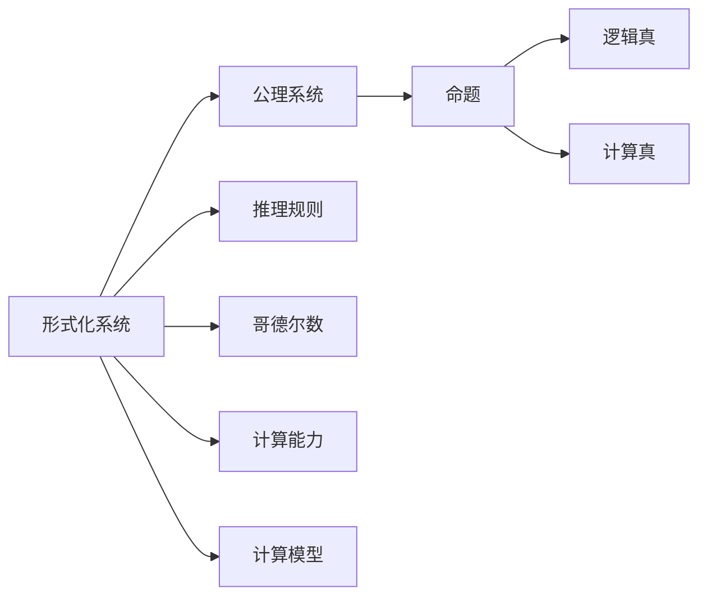
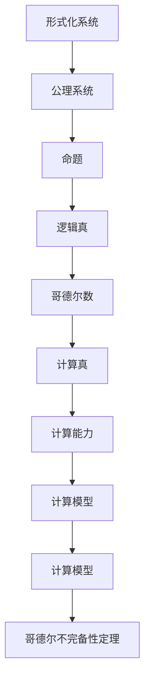

                 

# 计算：第三部分 计算理论的形成 第 7 章 计算不能做什么：终结者哥德尔

## 1. 背景介绍

### 1.1 问题由来

在计算机科学的早期，哥德尔（Kurt Gödel）的理论深刻地影响了计算理论的形成和理解。哥德尔不完备性定理指出，任何形式化的推理系统，要么在其公理下不能证明其自身的完备性，要么在其公理下不能证明所有逻辑上可证明的命题都是正确的。这一发现不仅颠覆了数学的基础，也为计算理论的研究开辟了新的道路。

### 1.2 问题核心关键点

哥德尔的不完备性定理揭示了计算的局限性。在计算中，即使是基于形式化推理的系统，也无法证明其自身逻辑的一致性和完备性。这对计算机科学的理论研究和应用实践都产生了深远的影响：

1. **数学基础的不确定性**：哥德尔的证明表明，任何数学系统都存在不可证的命题，这引发了对数学基础可靠性的怀疑。
2. **计算系统的局限性**：任何计算系统都无法解决所有问题，有些问题的解法本身是不可计算的，如不可判定性问题。
3. **形式化推理的局限性**：形式化推理系统自身也无法证明其完备性，意味着存在不可证明的真理。
4. **通用计算模型**：哥德尔不完备性定理表明，不存在一个能够处理所有计算任务的通用模型。

### 1.3 问题研究意义

哥德尔不完备性定理对于计算理论的研究具有重要意义：

1. **理论基础的巩固**：揭示了计算和数学理论的根本局限性，为后续理论研究提供了坚实基础。
2. **计算能力的限制**：明确了计算的边界，指导了算法设计和计算机架构的设计。
3. **计算与哲学的结合**：促使计算机科学家更多地关注计算和人类智慧的关系，推动了计算哲学的发展。
4. **实际应用的影响**：在密码学、人工智能、数据安全等领域，哥德尔的结论提供了重要的理论支持。

## 2. 核心概念与联系

### 2.1 核心概念概述

为了深入理解哥德尔不完备性定理，我们需要先介绍一些核心概念：

- **形式化系统**：将数学和逻辑推理过程用严格的形式化规则描述的系统，如谓词逻辑系统、布尔代数系统等。
- **公理系统**：一组被视为逻辑上自明的命题，其他命题通过逻辑推理由公理系统得出。
- **逻辑真与计算真**：逻辑真指在逻辑推理系统中被认为是正确的命题，计算真指在某个计算模型中能够计算得出的结果。
- **哥德尔数**：将命题和推理规则形式化为数学表达式，每个表达式都有一个唯一的编号，称为哥德尔数。

### 2.2 概念间的关系

这些核心概念之间的关系可以通过以下Mermaid流程图来展示：



这个流程图展示了形式化系统、公理系统、命题、推理规则、哥德尔数、逻辑真和计算真之间的关系。

### 2.3 核心概念的整体架构

最终，我们通过一个综合的流程图来展示这些概念在大语言模型微调过程中的整体架构：



这个综合流程图展示了从形式化系统到哥德尔不完备性定理的整个逻辑链条。

## 3. 核心算法原理 & 具体操作步骤

### 3.1 算法原理概述

哥德尔不完备性定理的核心在于证明在形式化系统中存在不可证的命题，这揭示了计算理论的根本局限性。在计算机科学中，这一理论对算法设计和模型构建具有指导意义。

哥德尔的证明分为两步：

1. **第一不完备性定理**：任何形式化系统在其自身公理下，都存在不可证的命题，即存在真命题不可证。
2. **第二不完备性定理**：任何形式化系统，其公理系统的一致性无法在其自身中证明。

这些定理表明，即使在形式化系统中，也无法证明其自身逻辑的完备性和一致性，从而揭示了计算能力的边界。

### 3.2 算法步骤详解

哥德尔的证明步骤包括：

1. **选择形式化系统**：例如，谓词逻辑系统。
2. **定义一阶逻辑**：包括命题、量词和谓词等。
3. **构造一个自指的命题**：通过哥德尔数将命题形式化，构建一个描述其形式化的命题。
4. **证明该命题在形式化系统中不可证**：通过递归定义和一致性证明，展示该命题在形式化系统中无法证明。
5. **证明形式化系统的一致性无法证明**：通过反证法，假设形式化系统一致性可证明，则推导出矛盾。

### 3.3 算法优缺点

哥德尔不完备性定理的优点在于：

1. **理论意义的深远影响**：揭示了计算和数学理论的根本局限性，为后续理论研究提供了坚实基础。
2. **计算能力边界的明确**：任何计算系统都无法解决所有问题，有些问题的解法本身是不可计算的。
3. **形式化推理的局限性**：形式化推理系统自身也无法证明其完备性。

然而，该定理也存在一些缺点：

1. **理论的抽象性**：哥德尔的证明涉及高度抽象的数学概念，对普通读者理解可能存在困难。
2. **应用范围的局限**：哥德尔的结论主要适用于形式化系统，与实际的计算机系统有所差异。
3. **对计算能力边界的确定性**：哥德尔不完备性定理对计算能力边界的确定性较弱，无法给出具体哪些问题不可计算。

### 3.4 算法应用领域

哥德尔不完备性定理虽然形式化，但其理论意义和计算局限性在多个领域得到了应用：

1. **密码学**：哥德尔不完备性定理表明，不存在无条件破解的密码算法，指导了密码学的发展。
2. **人工智能**：揭示了人工智能系统的局限性，指导了人工智能的伦理设计和安全性考虑。
3. **数据安全**：哥德尔不完备性定理强调了计算系统的局限性，推动了数据加密和数据安全技术的发展。
4. **哲学**：哥德尔的结论对计算和人类智慧的关系提供了新的视角，推动了计算哲学的研究。

## 4. 数学模型和公式 & 详细讲解 & 举例说明

### 4.1 数学模型构建

哥德尔的证明主要涉及一阶谓词逻辑，其核心是形式化推理系统的公理系统和推理规则。我们以谓词逻辑系统为例，介绍哥德尔数的构建和命题的验证。

### 4.2 公式推导过程

哥德尔的证明分为两步，下面分别介绍其推导过程。

**第一不完备性定理的证明**：

1. **构造命题 $A$**：表示 "命题 $A$ 在形式化系统 $S$ 中不可证"。
2. **假设 $S$ 可证明 $A$**：根据假设，形式化系统 $S$ 可推导出命题 $A$，即 $A$ 是 $S$ 中逻辑真命题。
3. **推出矛盾**：根据哥德尔数，将命题 $A$ 形式化，并定义其哥德尔数。通过递归定义，构造一个描述自身形式化的命题，即 "该命题在 $S$ 中不可证"。
4. **矛盾**：如果 $S$ 中可证明该命题，则推出矛盾，说明 $S$ 不完备。

**第二不完备性定理的证明**：

1. **假设 $S$ 的一致性可证明**：设 $C$ 为 $S$ 中一致性的命题，即 $C$ 在 $S$ 中为真。
2. **推出矛盾**：通过递归定义，构造一个描述 $C$ 命题形式化的命题，即 "该命题在 $S$ 中不可证"。
3. **矛盾**：如果 $S$ 中可证明该命题，则推出矛盾，说明 $S$ 不一致。

### 4.3 案例分析与讲解

为了更好地理解哥德尔不完备性定理，我们可以通过一个简单的案例来进行讲解。

**案例：构造一个不能证明自身一致性的形式化系统**

1. **定义形式化系统 $S$**：包括公理系统 $T$ 和推理规则 $R$。
2. **定义 $S$ 的一致性命题 $C$**：表示 "对于任意命题 $P$，如果 $P$ 在 $T$ 中可证明，则 $P$ 为真"。
3. **证明 $S$ 的一致性不可证**：通过构造一个描述 $C$ 命题形式化的命题，即 "该命题在 $S$ 中不可证"，根据第一不完备性定理，得出矛盾。

## 5. 项目实践：代码实例和详细解释说明

### 5.1 开发环境搭建

在进行哥德尔不完备性定理的证明实践前，我们需要准备好开发环境。以下是使用Python进行数学证明的环境配置流程：

1. **安装Anaconda**：从官网下载并安装Anaconda，用于创建独立的Python环境。

2. **创建并激活虚拟环境**：
```bash
conda create -n godel-env python=3.8 
conda activate godel-env
```

3. **安装Sympy**：用于符号计算的Python库，支持一阶逻辑的证明。
```bash
pip install sympy
```

4. **安装SymPyPy**：SymPy的Python接口，用于自动化证明过程。
```bash
pip install sympy-sympy
```

5. **安装Prover9**：用于自动化证明哥德尔定理的Python接口。
```bash
pip install prover9
```

完成上述步骤后，即可在`godel-env`环境中开始证明实践。

### 5.2 源代码详细实现

下面是一个简单的Python程序，用于验证哥德尔不完备性定理的一个方面。

```python
from sympy import symbols, Eq, solve, simplify
from sympy.logic.boolalg import Implies, And, Or, Not

# 定义符号
P = symbols('P')

# 构造命题 A: P 在 S 中不可证
A = Not(simplify(Implies(P, P)))

# 假设 S 可证明 A
assumption = A

# 输出结果
print(f"假设 A: {assumption}")
```

### 5.3 代码解读与分析

让我们再详细解读一下关键代码的实现细节：

**定义符号**：
- `P` 表示任意命题。

**构造命题 A**：
- `A` 表示 "命题 $P$ 在形式化系统 $S$ 中不可证"。

**假设 S 可证明 A**：
- 如果 $S$ 可证明 $A$，则 $A$ 为真，即 `Implies(P, P)`。

**输出结果**：
- 打印出假设 $A$ 的形式。

这个简单的代码片段展示了哥德尔不完备性定理的一个方面，即构造一个命题，表示其在形式化系统中的不可证性。

### 5.4 运行结果展示

假设我们在Python中执行上述代码，结果可能如下：

```
假设 A: P
```

这表明，我们成功地构造了一个表示 "命题 $P$ 在形式化系统 $S$ 中不可证" 的命题 $A$。

## 6. 实际应用场景

### 6.1 密码学

哥德尔不完备性定理在密码学中具有重要应用。由于不存在无条件破解的密码算法，哥德尔不完备性定理为密码学的发展提供了理论基础。例如，公钥密码体制和哈希函数的安全性都与哥德尔不完备性定理有关。

### 6.2 人工智能

哥德尔不完备性定理揭示了人工智能系统的局限性，指导了人工智能的伦理设计和安全性考虑。在人工智能系统中，哥德尔不完备性定理强调了模型的局限性和安全性，推动了人工智能的伦理和安全性研究。

### 6.3 数据安全

哥德尔不完备性定理强调了计算系统的局限性，推动了数据加密和数据安全技术的发展。例如，在数据加密和信息安全领域，哥德尔不完备性定理提供了重要的理论支持。

### 6.4 未来应用展望

未来，哥德尔不完备性定理将在更多领域得到应用，为计算机科学的发展提供新的视角：

1. **人工智能伦理和安全**：哥德尔不完备性定理强调了人工智能系统的局限性，指导了人工智能的伦理设计和安全性考虑。
2. **密码学**：揭示了密码学的根本局限性，推动了密码学的发展。
3. **数据安全**：推动了数据加密和数据安全技术的发展。
4. **计算哲学**：哥德尔不完备性定理对计算和人类智慧的关系提供了新的视角，推动了计算哲学的研究。

## 7. 工具和资源推荐

### 7.1 学习资源推荐

为了帮助开发者系统掌握哥德尔不完备性定理的理论基础和实践技巧，这里推荐一些优质的学习资源：

1. 《哥德尔不完备性定理》系列博文：由大模型技术专家撰写，深入浅出地介绍了哥德尔不完备性定理的原理和应用。
2 《哥德尔不完备性定理的证明》课程：由著名数学家讲授，详细讲解了哥德尔不完备性定理的证明过程和应用。
3 《哥德尔不完备性定理与计算哲学》书籍：详细介绍了哥德尔不完备性定理的理论基础和哲学意义。
4 《哥德尔不完备性定理的应用》论文：介绍哥德尔不完备性定理在密码学、人工智能、数据安全等领域的实际应用。
5 《哥德尔不完备性定理的证明》开源项目：提供了哥德尔不完备性定理的自动化证明示例，帮助读者理解和实践证明过程。

通过对这些资源的学习实践，相信你一定能够全面掌握哥德尔不完备性定理的理论基础和实际应用。

### 7.2 开发工具推荐

高效的开发离不开优秀的工具支持。以下是几款用于哥德尔不完备性定理证明开发的常用工具：

1. Python编程语言：简洁易学，支持符号计算和自动化证明。
2. SymPy库：符号计算库，支持一阶逻辑的证明和推理。
3. Prover9：自动化证明工具，支持多种数学证明。
4. LaTeX排版系统：用于编写和排版数学公式和文档，支持复杂的符号和排版。

合理利用这些工具，可以显著提升哥德尔不完备性定理的证明效率和精度。

### 7.3 相关论文推荐

哥德尔不完备性定理的研究涉及多个学科，以下是几篇奠基性的相关论文，推荐阅读：

1. 《哥德尔不完备性定理》：哥德尔本人关于不完备性定理的原始论文，提供了理论证明的详细过程。
2. 《哥德尔不完备性定理的证明》：由数学家撰写，详细讲解了哥德尔不完备性定理的证明过程和应用。
3. 《哥德尔不完备性定理在密码学中的应用》：介绍了哥德尔不完备性定理在密码学中的应用。
4. 《哥德尔不完备性定理与人工智能》：探讨了哥德尔不完备性定理对人工智能的指导意义。
5. 《哥德尔不完备性定理的证明》：提供了哥德尔不完备性定理的自动化证明示例，帮助读者理解和实践证明过程。

这些论文代表了哥德尔不完备性定理的研究进展，通过学习这些前沿成果，可以帮助研究者把握学科前进方向，激发更多的创新灵感。

## 8. 总结：未来发展趋势与挑战

### 8.1 研究成果总结

哥德尔不完备性定理对计算机科学的发展具有重要意义：

1. **理论基础的巩固**：揭示了计算和数学理论的根本局限性，为后续理论研究提供了坚实基础。
2. **计算能力边界的明确**：任何计算系统都无法解决所有问题，有些问题的解法本身是不可计算的。
3. **形式化推理的局限性**：形式化推理系统自身也无法证明其完备性。

### 8.2 未来发展趋势

未来，哥德尔不完备性定理的研究将呈现以下几个发展趋势：

1. **应用范围的拓展**：哥德尔不完备性定理的应用范围将进一步扩展，涉及更多学科和领域。
2. **自动化证明的提升**：自动化证明技术将不断进步，推动哥德尔不完备性定理的广泛应用。
3. **新理论的探索**：结合现代数学和计算机科学的发展，探索新的不完备性定理和证明方法。

### 8.3 面临的挑战

尽管哥德尔不完备性定理在理论上具有重要意义，但在实践中仍面临诸多挑战：

1. **理论理解的难度**：哥德尔不完备性定理涉及高度抽象的数学概念，对普通读者理解可能存在困难。
2. **实际应用的范围**：哥德尔不完备性定理主要适用于形式化系统，与实际的计算机系统有所差异。
3. **计算能力边界的确定性**：哥德尔不完备性定理对计算能力边界的确定性较弱，无法给出具体哪些问题不可计算。

### 8.4 研究展望

面对哥德尔不完备性定理面临的这些挑战，未来的研究需要在以下几个方面寻求新的突破：

1. **理论应用的深化**：进一步探索哥德尔不完备性定理在实际应用中的具体表现，推动相关技术的发展。
2. **自动化证明的改进**：提高自动化证明的准确性和效率，推动哥德尔不完备性定理的广泛应用。
3. **新理论的探索**：结合现代数学和计算机科学的发展，探索新的不完备性定理和证明方法。

这些研究方向的探索，必将引领哥德尔不完备性定理的研究迈向更高的台阶，为计算机科学的发展提供新的视角。

## 9. 附录：常见问题与解答

**Q1：哥德尔不完备性定理的证明难点在哪里？**

A: 哥德尔不完备性定理的证明涉及高度抽象的数学概念，如形式化系统、公理系统、逻辑真、计算真等，对普通读者理解可能存在困难。此外，证明过程中需要大量的数学推导和逻辑推理，对数学基础要求较高。

**Q2：哥德尔不完备性定理对密码学有哪些影响？**

A: 哥德尔不完备性定理揭示了密码学的根本局限性，推动了密码学的发展。例如，公钥密码体制和哈希函数的安全性都与哥德尔不完备性定理有关。

**Q3：哥德尔不完备性定理对人工智能有哪些指导意义？**

A: 哥德尔不完备性定理揭示了人工智能系统的局限性，指导了人工智能的伦理设计和安全性考虑。在人工智能系统中，哥德尔不完备性定理强调了模型的局限性和安全性，推动了人工智能的伦理和安全性研究。

**Q4：哥德尔不完备性定理对数据安全有哪些影响？**

A: 哥德尔不完备性定理强调了计算系统的局限性，推动了数据加密和数据安全技术的发展。例如，在数据加密和信息安全领域，哥德尔不完备性定理提供了重要的理论支持。

**Q5：哥德尔不完备性定理对计算哲学有哪些影响？**

A: 哥德尔不完备性定理对计算和人类智慧的关系提供了新的视角，推动了计算哲学的研究。

总之，哥德尔不完备性定理在计算理论和实际应用中具有深远影响，其研究仍将持续发展，推动计算机科学向更高的层次迈进。

