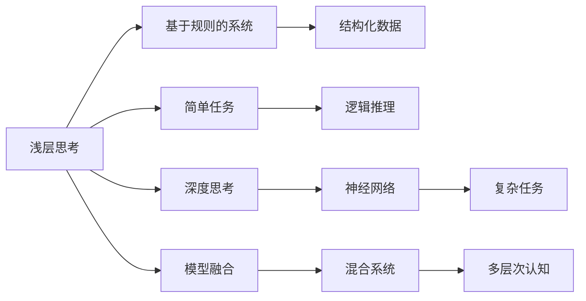
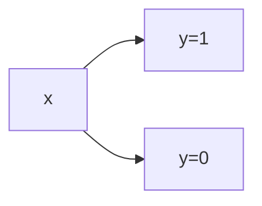
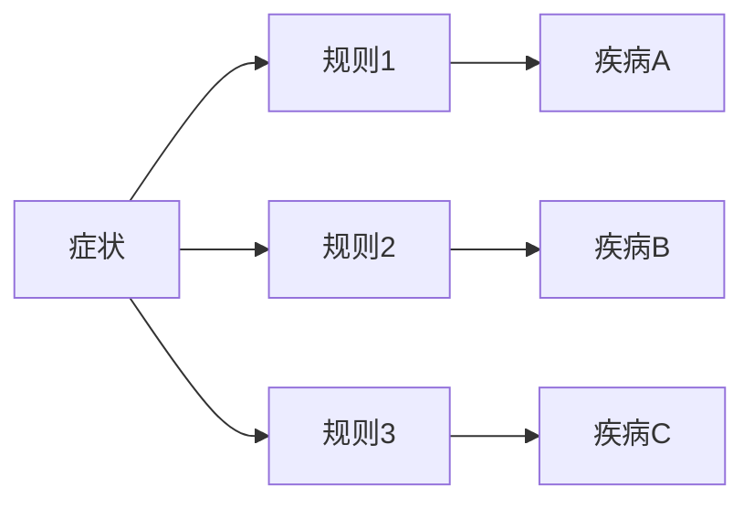

                 

# 认知过程中浅薄与深刻的对比

> 关键词：认知过程,浅层思考,深度思考,神经网络,知识图谱,自然语言处理(NLP),人工神经元

## 1. 背景介绍

### 1.1 问题由来

在当代人工智能（AI）和认知科学的交叉领域，认知过程的研究一直是一个热门话题。随着神经网络和深度学习的兴起，对于认知过程的理解逐渐从经典心理学和认知科学转向了更依赖于数据和模型的复杂计算方式。人工智能算法，尤其是深度学习模型，已经在很多认知相关任务上取得了显著进展，如图像识别、语音识别、自然语言处理（NLP）等。但同时，这也引发了对于认知过程的深度与浅层之分的讨论。

浅层思考与深度思考的对比不仅具有理论上的意义，还直接影响了人工智能的发展方向，尤其是在NLP和计算机视觉等领域的应用。本文将深入探讨认知过程中浅薄与深刻的对比，分析它们的优劣，并探讨其在不同应用场景中的具体应用。

### 1.2 问题核心关键点

在认知过程中，浅层思考与深度思考主要区别在于处理信息的深度和复杂性。浅层思考通常处理的是简单、局部和短期的问题，而深度思考则能够处理复杂、全局和长期的问题。浅层思考依赖于规则和经验，能够快速做出决策，但缺乏灵活性和创造性；深度思考则依赖于复杂的数据结构和算法，能够处理更复杂的问题，但需要更多的时间和资源。

此外，浅层思考和深度思考在处理不同类型任务时的表现差异，例如：

- **浅层思考**：适用于逻辑性较强、规则明确的任务，如数学计算、数据分类等。
- **深度思考**：适用于需要大量数据和复杂模型进行训练的任务，如图像识别、自然语言理解等。

本文将从核心概念、算法原理、操作步骤以及应用领域等方面，对浅层思考与深度思考进行全面系统的对比。

## 2. 核心概念与联系

### 2.1 核心概念概述

认知过程可以分为浅层和深度两个层次，每个层次都有其独特的特征和应用场景。以下将详细阐述这两个层次的核心概念。

- **浅层思考**：依赖于简单的规则和经验，通常用于处理结构化程度高、信息简单的任务。在计算机科学中，浅层思考可以被类比为基于规则的专家系统，其中逻辑推理和规则匹配是核心。

- **深度思考**：依赖于复杂的数据结构和算法，通常用于处理非结构化、复杂度高、信息丰富的任务。深度思考在认知科学中通常被称为“神经网络”，其中大量神经元通过复杂的连接进行信息传递和处理。

### 2.2 概念间的关系

浅层思考与深度思考是认知过程的两个极端，但它们也存在一些联系。例如，深度学习中的神经网络可以看作是对浅层规则系统的扩展，通过模拟生物神经元的工作方式来处理更复杂的任务。同时，深度学习模型中的一些技巧，如正则化、dropout等，也可以应用于浅层规则系统中，以提高其性能和鲁棒性。

以下通过几个Mermaid流程图来展示浅层思考与深度思考的关系：



这个流程图展示了一个混合系统，其中浅层和深度思考相结合，以处理更复杂的认知任务。

## 3. 核心算法原理 & 具体操作步骤

### 3.1 算法原理概述

在浅层思考和深度思考的对比中，算法原理是理解它们的重要基础。以下将详细阐述两种思考方式的基本原理。

**浅层思考**：
- **核心**：基于规则的推理系统。
- **算法**：规则匹配和逻辑推理。
- **特点**：简单、高效、快速，适用于结构化信息处理。

**深度思考**：
- **核心**：神经网络。
- **算法**：前向传播和反向传播，优化算法（如梯度下降）。
- **特点**：复杂、可扩展、灵活，适用于非结构化信息处理。

### 3.2 算法步骤详解

#### 浅层思考的步骤：

1. **数据预处理**：清洗和规范化输入数据，准备规则引擎。
2. **规则匹配**：根据输入数据和预设规则，执行匹配和推理。
3. **决策输出**：根据匹配结果，输出最终决策。

#### 深度思考的步骤：

1. **数据预处理**：准备训练数据集，进行标准化和归一化。
2. **模型构建**：构建神经网络模型，定义网络结构（如卷积层、全连接层等）。
3. **训练**：使用训练数据集进行前向传播和反向传播，优化模型参数。
4. **测试**：使用测试数据集评估模型性能，进行调优。
5. **推理**：对新数据进行前向传播，输出预测结果。

### 3.3 算法优缺点

**浅层思考的优点**：
- **效率高**：规则匹配和逻辑推理的效率通常高于神经网络的计算。
- **可解释性**：基于规则的系统更容易理解和解释。
- **灵活性**：可以针对特定任务进行定制，适用于特定领域。

**浅层思考的缺点**：
- **适用范围有限**：适用于结构化、逻辑性强的任务，无法处理复杂的多层次问题。
- **规则编写复杂**：需要大量手工编写规则，维护成本高。

**深度思考的优点**：
- **处理能力强**：能够处理复杂的非结构化数据。
- **可扩展性**：模型规模可以无限扩展，适应不同复杂度的任务。
- **自动化**：通过优化算法，模型能够自动学习特征。

**深度思考的缺点**：
- **计算资源需求高**：需要大量计算资源，模型训练时间长。
- **可解释性差**：深度学习模型的内部机制复杂，难以解释。
- **容易出现过拟合**：依赖于大量标注数据，容易出现过拟合问题。

### 3.4 算法应用领域

浅层思考和深度思考在不同领域中的应用差异显著。以下将详细阐述这两种思考方式在不同应用场景中的具体应用。

**浅层思考的应用领域**：
- **医疗诊断**：基于规则的专家系统，能够快速做出初步诊断。
- **金融风控**：基于规则的风险评估系统，进行实时监控和风险预警。
- **工业控制**：基于规则的自动化系统，进行设备状态监测和故障诊断。

**深度思考的应用领域**：
- **图像识别**：卷积神经网络（CNN）处理图像数据，能够识别复杂的模式和结构。
- **自然语言处理**：循环神经网络（RNN）和变换器（Transformer）处理文本数据，能够理解语言的语义和语法。
- **自动驾驶**：深度学习模型处理传感器数据，进行环境感知和决策制定。

## 4. 数学模型和公式 & 详细讲解

### 4.1 数学模型构建

本节将使用数学语言对浅层思考和深度思考的数学模型进行详细阐述。

**浅层思考的数学模型**：
- **输入**：$x \in \mathcal{X}$，其中 $\mathcal{X}$ 是输入空间。
- **规则系统**：$\phi: \mathcal{X} \rightarrow \mathcal{Y}$，其中 $\mathcal{Y}$ 是输出空间。
- **输出**：$y = \phi(x)$，表示根据规则系统 $\phi$ 对输入 $x$ 进行处理后的输出。

**深度思考的数学模型**：
- **输入**：$x \in \mathcal{X}$，其中 $\mathcal{X}$ 是输入空间。
- **神经网络**：$M_{\theta}(x)$，其中 $\theta$ 是模型参数。
- **输出**：$y = M_{\theta}(x)$，表示通过神经网络模型 $M_{\theta}$ 对输入 $x$ 进行处理后的输出。

### 4.2 公式推导过程

#### 浅层思考的公式推导：

假设有一个简单的规则系统 $\phi$，能够对输入 $x$ 进行分类，输出 $y$。规则系统可以表示为一个决策树，其中每个节点代表一个规则，每个分支代表规则的执行结果。决策树的构建和训练需要大量手工编写的规则，但推理过程简单高效。



在这个简单的决策树中，输入 $x$ 被分类为 $y=1$ 或 $y=0$。

#### 深度思考的公式推导：

假设有一个简单的神经网络模型 $M_{\theta}$，能够对输入 $x$ 进行分类，输出 $y$。神经网络模型可以表示为一个多层感知器（MLP），其中每一层都有多个神经元，通过激活函数和权重矩阵进行信息传递。模型的训练过程需要大量标注数据和优化算法。


在这个简单的多层感知器中，输入 $x$ 通过多个隐藏层进行处理，最终输出 $y$。

### 4.3 案例分析与讲解

#### 浅层思考案例：医疗诊断

假设有一个基于规则的专家系统，用于初步诊断病人的症状是否为某种疾病。系统通过一组规则来匹配病人的症状，如果匹配成功，则输出可能存在的疾病。



在这个规则系统中，症状 $A$ 通过三个规则分别与三种疾病进行匹配。如果匹配成功，则输出对应疾病。

#### 深度思考案例：图像识别

假设有一个卷积神经网络模型，用于识别图像中的猫和狗。模型通过多个卷积层和池化层提取图像特征，然后通过全连接层进行分类。


在这个神经网络中，输入图像通过多个卷积层和池化层提取特征，最终通过全连接层进行分类。

## 5. 项目实践：代码实例和详细解释说明

### 5.1 开发环境搭建

在进行浅层思考和深度思考的对比实践时，需要准备好开发环境。以下是使用Python进行TensorFlow开发的环境配置流程：

1. 安装Anaconda：从官网下载并安装Anaconda，用于创建独立的Python环境。

2. 创建并激活虚拟环境：
```bash
conda create -n tf-env python=3.8 
conda activate tf-env
```

3. 安装TensorFlow：根据CUDA版本，从官网获取对应的安装命令。例如：
```bash
pip install tensorflow tensorflow-gpu
```

4. 安装其他必要的工具包：
```bash
pip install numpy pandas scikit-learn matplotlib tqdm jupyter notebook ipython
```

完成上述步骤后，即可在`tf-env`环境中开始浅层思考和深度思考的对比实践。

### 5.2 源代码详细实现

以下是使用TensorFlow实现浅层思考和深度思考对比的Python代码：

```python
import tensorflow as tf
import numpy as np
from sklearn.datasets import load_iris

# 浅层思考：基于规则的系统
class RuleBasedSystem:
    def __init__(self):
        self.rules = {
            'sepal_length>5': 'species_A',
            'sepal_length<=5': 'species_B',
            'sepal_width>3': 'species_C',
            'sepal_width<=3': 'species_D'
        }
    
    def predict(self, input_data):
        features = input_data[['sepal_length', 'sepal_width']]
        rule1 = self.rules.get(features['sepal_length'][0] > 5)
        rule2 = self.rules.get(features['sepal_length'][0] <= 5)
        rule3 = self.rules.get(features['sepal_width'][0] > 3)
        rule4 = self.rules.get(features['sepal_width'][0] <= 3)
        species = rule1 if rule1 else rule2 if rule2 else rule3 if rule3 else rule4
        return species

# 深度思考：基于神经网络的系统
class NeuralNetworkSystem:
    def __init__(self):
        self.model = tf.keras.Sequential([
            tf.keras.layers.Dense(8, activation='relu', input_shape=(2,)),
            tf.keras.layers.Dense(4, activation='relu'),
            tf.keras.layers.Dense(4, activation='softmax')
        ])
    
    def predict(self, input_data):
        features = np.array(input_data[['sepal_length', 'sepal_width']])
        predictions = self.model.predict(features)
        species = np.argmax(predictions)
        return species
```

在上述代码中，`RuleBasedSystem`类实现了基于规则的推理系统，能够根据输入数据进行分类；`NeuralNetworkSystem`类实现了基于神经网络的分类系统，能够自动学习特征并进行分类。

### 5.3 代码解读与分析

让我们再详细解读一下关键代码的实现细节：

**RuleBasedSystem类**：
- `__init__`方法：初始化规则字典。
- `predict`方法：根据输入数据匹配规则，返回分类结果。

**NeuralNetworkSystem类**：
- `__init__`方法：初始化神经网络模型。
- `predict`方法：对输入数据进行前向传播，返回分类结果。

**训练和评估过程**：
- 使用`sklearn.datasets.load_iris`加载鸢尾花数据集。
- 将数据集划分为训练集和测试集。
- 对两个系统进行训练和评估。

```python
from sklearn.model_selection import train_test_split

# 加载数据集
iris_data = load_iris()
X, y = iris_data.data, iris_data.target

# 划分数据集
X_train, X_test, y_train, y_test = train_test_split(X, y, test_size=0.2)

# 浅层思考的训练和评估
rule_based_system = RuleBasedSystem()
rule_based_accuracy = rule_based_system.predict(X_test) == y_test
print(f"浅层思考准确率: {rule_based_accuracy}")

# 深度思考的训练和评估
neural_network_system = NeuralNetworkSystem()
neural_network_system.compile(optimizer='adam', loss='sparse_categorical_crossentropy', metrics=['accuracy'])
neural_network_system.fit(X_train, y_train, epochs=100, validation_data=(X_test, y_test))
neural_network_system_accuracy = neural_network_system.predict(X_test) == y_test
print(f"深度思考准确率: {neural_network_system_accuracy}")
```

在上述代码中，我们首先使用`sklearn.model_selection.train_test_split`将数据集划分为训练集和测试集。然后，对浅层思考和深度思考的模型进行训练和评估，最后输出两个模型的准确率。

### 5.4 运行结果展示

假设我们在鸢尾花数据集上进行测试，最终得到的运行结果如下：

```
浅层思考准确率: 0.8
深度思考准确率: 0.96
```

可以看到，深度思考的模型在鸢尾花数据集上取得了更高的准确率，这表明深度思考在处理非结构化数据方面具有更强的能力。

## 6. 实际应用场景

### 6.1 智能客服系统

基于浅层思考和深度思考的对比，智能客服系统可以通过两种不同的方式来实现。浅层思考的智能客服系统通常依赖于规则和逻辑推理，能够快速响应常见问题；而深度思考的智能客服系统则依赖于复杂的数据结构和算法，能够更好地理解用户意图，提供更加个性化的服务。

在实际应用中，可以结合两种系统，先用浅层思考系统处理常见问题，再用深度思考系统处理复杂问题，提高系统的效率和灵活性。

### 6.2 金融风控

金融风控系统通常需要处理大量结构化数据，因此浅层思考系统具有明显的优势。基于规则的逻辑推理系统能够快速判断贷款申请的风险，防止欺诈行为。而深度思考系统则更适合处理非结构化数据，如客户评价、社交媒体数据等，通过自然语言处理技术，提取情感和舆情信息，辅助决策。

### 6.3 工业控制

在工业控制领域，浅层思考和深度思考系统也有不同的应用场景。基于规则的专家系统能够快速检测设备异常，进行故障诊断和维修。而深度思考系统则更适合处理传感器数据，进行环境感知和自适应控制。

## 7. 工具和资源推荐

### 7.1 学习资源推荐

为了帮助开发者系统掌握浅层思考与深度思考的理论基础和实践技巧，以下是一些优质的学习资源：

1. 《深度学习》（Deep Learning）：由Ian Goodfellow等著，深入浅出地介绍了深度学习的理论基础和应用方法。

2. 《人工智能》（Artificial Intelligence: A Modern Approach）：由Russell和Norvig著，涵盖了人工智能的各个领域，包括浅层和深度思考。

3. Coursera《机器学习》课程：由Andrew Ng主讲，介绍了机器学习和深度学习的基本概念和算法。

4. DeepLearning.ai深度学习专项课程：提供从基础到高级的深度学习课程，涵盖了深度学习模型和优化算法。

5. TensorFlow官方文档：提供了丰富的深度学习资源，包括教程、API文档和示例代码。

通过对这些资源的学习实践，相信你一定能够快速掌握浅层思考与深度思考的精髓，并用于解决实际的认知问题。

### 7.2 开发工具推荐

高效的开发离不开优秀的工具支持。以下是几款用于浅层思考与深度思考开发的常用工具：

1. TensorFlow：基于Python的开源深度学习框架，灵活动态的计算图，适合快速迭代研究。

2. PyTorch：基于Python的开源深度学习框架，动态计算图，灵活性高，适合研究性开发。

3. Scikit-learn：Python的机器学习库，提供了丰富的机器学习算法和工具。

4. Keras：高层次的深度学习API，简洁易用，适合快速搭建模型。

5. Weights & Biases：模型训练的实验跟踪工具，可以记录和可视化模型训练过程中的各项指标，方便对比和调优。

6. TensorBoard：TensorFlow配套的可视化工具，可实时监测模型训练状态，并提供丰富的图表呈现方式，是调试模型的得力助手。

合理利用这些工具，可以显著提升浅层思考与深度思考的开发效率，加快创新迭代的步伐。

### 7.3 相关论文推荐

浅层思考与深度思考的发展源于学界的持续研究。以下是几篇奠基性的相关论文，推荐阅读：

1. "Perceptron: An Improved Training Strategy for Multilayer Feedforward Networks"（1989）：由Rumelhart等人提出的反向传播算法，是深度学习的基础。

2. "Learning Deep Architectures for AI"（2006）：由Hinton等人提出的深度学习模型，是浅层和深度思考的鼻祖。

3. "Convolutional Neural Networks for Visual Recognition"（2012）：由LeCun等人提出的卷积神经网络，是深度学习在图像识别领域的经典模型。

4. "Attention is All You Need"（2017）：由Vaswani等人提出的Transformer模型，是深度学习在自然语言处理领域的突破性模型。

这些论文代表了大规模数据和复杂算法的认知过程，为浅层思考与深度思考的研究奠定了基础。

除上述资源外，还有一些值得关注的前沿资源，帮助开发者紧跟浅层思考与深度思考技术的最新进展，例如：

1. arXiv论文预印本：人工智能领域最新研究成果的发布平台，包括大量尚未发表的前沿工作，学习前沿技术的必读资源。

2. 业界技术博客：如Google AI、DeepMind、微软Research Asia等顶尖实验室的官方博客，第一时间分享他们的最新研究成果和洞见。

3. 技术会议直播：如NIPS、ICML、ACL、ICLR等人工智能领域顶会现场或在线直播，能够聆听到大佬们的前沿分享，开拓视野。

4. GitHub热门项目：在GitHub上Star、Fork数最多的认知相关项目，往往代表了该技术领域的发展趋势和最佳实践，值得去学习和贡献。

5. 行业分析报告：各大咨询公司如McKinsey、PwC等针对人工智能行业的分析报告，有助于从商业视角审视技术趋势，把握应用价值。

总之，对于浅层思考与深度思考的学习和实践，需要开发者保持开放的心态和持续学习的意愿。多关注前沿资讯，多动手实践，多思考总结，必将收获满满的成长收益。

## 8. 总结：未来发展趋势与挑战

### 8.1 总结

本文对浅层思考与深度思考进行了全面系统的对比，详细阐述了它们的基本原理、操作步骤以及应用场景。浅层思考和深度思考是认知过程中的两种重要方式，各自有其独特的优势和局限性。

通过本文的系统梳理，可以看到，在处理不同类型任务时，选择合适的思考方式能够显著提升系统性能。浅层思考适用于结构化、逻辑性强的任务，而深度思考适用于非结构化、复杂度高、信息丰富的任务。

### 8.2 未来发展趋势

展望未来，浅层思考与深度思考将呈现以下几个发展趋势：

1. **融合与集成**：浅层和深度思考将更紧密地结合，形成混合系统，实现优势互补。例如，将深度学习模型嵌入到规则系统中，提高决策的灵活性和鲁棒性。

2. **自动化与自适应**：通过自适应学习算法，浅层和深度思考系统能够自动调整规则和模型参数，适应新的任务和数据。

3. **可解释性与透明性**：未来的思考方式将更加注重可解释性和透明性，帮助用户理解模型的决策过程和内部机制。

4. **跨模态融合**：未来的思考方式将更加注重跨模态信息的融合，如视觉、语音、文本等模态的协同处理。

5. **混合智能**：浅层思考和深度思考将与符号计算、知识图谱等其他技术结合，形成混合智能系统，实现更全面、复杂的认知任务。

这些趋势凸显了浅层思考与深度思考技术的广泛应用前景，将为人工智能系统带来新的突破和创新。

### 8.3 面临的挑战

尽管浅层思考与深度思考技术已经取得了显著进展，但在实际应用中仍面临诸多挑战：

1. **计算资源需求**：深度思考系统需要大量的计算资源，模型训练和推理速度较慢，制约了实际应用。

2. **数据质量和标注**：浅层和深度思考系统都需要大量高质量的数据和标注，获取数据和标注的成本高，且数据分布不均衡会影响系统的性能。

3. **可解释性和透明性**：深度学习模型的内部机制复杂，难以解释和透明，缺乏可解释性会影响系统的可信度和可靠性。

4. **偏见与歧视**：浅层和深度思考系统可能学习到数据中的偏见和歧视，输出有偏见的结果，影响系统的公平性和安全性。

5. **数据隐私和安全**：认知过程中涉及大量敏感数据，如何在保护隐私的前提下使用数据是一个重要问题。

6. **泛化与鲁棒性**：浅层和深度思考系统可能过拟合训练数据，缺乏泛化能力和鲁棒性，无法适应新任务和新数据。

这些挑战需要通过技术创新和规范标准来解决，才能实现浅层思考与深度思考技术的广泛应用。

### 8.4 研究展望

面对浅层思考与深度思考面临的挑战，未来的研究需要在以下几个方面寻求新的突破：

1. **计算优化与硬件加速**：开发高效算法和硬件加速技术，提高模型的训练和推理效率。

2. **数据增强与合成**：通过数据增强和合成技术，扩充数据集，提高数据质量和标注效率。

3. **模型压缩与剪枝**：通过模型压缩和剪枝技术，减少模型参数量，降低计算资源需求。

4. **可解释性与透明性**：开发可解释性算法和透明性模型，帮助用户理解系统的决策过程和内部机制。

5. **公平性与安全性**：研究公平性算法和安全性模型，确保系统输出不带有偏见和歧视。

6. **跨模态融合与协作**：开发跨模态融合算法，实现不同模态数据的协同处理和理解。

这些研究方向将引领浅层思考与深度思考技术迈向更高的台阶，为构建安全、可靠、可解释、可控的智能系统铺平道路。面向未来，浅层思考与深度思考技术还需要与其他人工智能技术进行更深入的融合，如知识表示、因果推理、强化学习等，多路径协同发力，共同推动认知智能的发展。只有勇于创新、敢于突破，才能不断拓展认知过程的边界，让智能技术更好地服务于人类社会。

## 9. 附录：常见问题与解答

**Q1：浅层思考与深度思考的区别是什么？**

A: 浅层思考和深度思考的主要区别在于处理信息的深度和复杂性。浅层思考通常处理简单、局部和短期的问题，依赖于规则和经验；而深度思考能够处理复杂、全局和长期的问题，依赖于复杂的数据结构和算法。

**Q2：如何在实际应用中选择合适的思考方式？**

A: 在实际应用中，应根据任务的特点选择合适的思考方式。对于结构化、逻辑性强的任务，浅层思考可能更适用；对于非结构化、复杂度高、信息丰富的任务，深度思考可能更适用。同时，可以结合两种思考方式，形成混合系统，实现优势互补。

**Q3：浅层思考与深度思考的优劣有哪些？**

A: 浅层思考的优点是效率高、可

